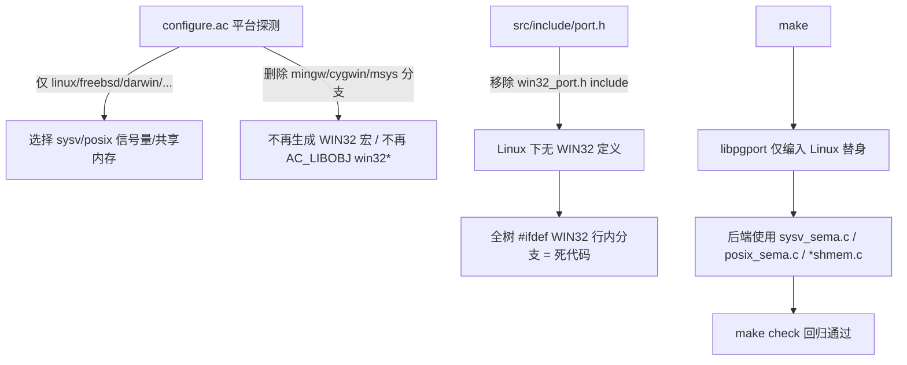

## 用户需求

将当前 PostgreSQL 工程（14.23）改造为**仅支持 Linux 操作系统**，彻底移除对 Windows 系统的支持，包括：

- Windows 原生编译（MinGW / MinGW-w64）
- MSVC（Visual Studio）构建体系
- Cygwin / MSYS（跑在 Windows 上的 POSIX 兼容层）

## 产品概述

本次为"删减/裁剪"任务，不新增功能，目标是让工程在 Linux 上通过 `configure && make && make check` 完整构建与回归测试，同时把 Windows 相关代码与构建链路从工程中剥离，使后续维护不再被 Windows 差异干扰。

## 核心特性

- 删除所有 Windows / Cygwin / MSVC 专属的源文件、头文件、模板与构建脚本目录。
- 清理 `configure.ac` 与构建系统中对 win32/cygwin/msys 的平台探测与实现选择分支（信号量、共享内存、libpgport 替身函数、dbghelp 等）。
- 共用文件（`src/backend`、`src/bin` 等）内部以 `#ifdef WIN32` / `#ifndef WIN32` / `_MSC_VER` 书写的**行内平台分支保留为死代码**（Linux 下宏永不被定义，不会被编译，不影响构建与测试）。
- 可删除确属 Windows-only 的回归测试用例；保留对全平台通用的测试。
- 验证：在 Linux 上 configure、全量 make、make check / make check-world 全部跑通。

## 技术栈

- 工程：PostgreSQL 14.23，C 语言，Autoconf 构建系统（手写 `configure.ac` + 生成的 `configure`）。
- 本次不涉及新框架/新依赖，仅做"减法"，遵循现有目录分层与构建约定。

## 实现方案

总体策略：采用**最小改动**裁剪——把所有 Windows/Cygwin/MSVC 差异收敛在少数专属目录与 configure 选择分支中，直接删除这些目录/文件，并把 configure 中"当 `PORTNAME=win32/cygwin` 时"的选择逻辑删除；共用代码里的行内 `#ifdef WIN32` 分支因宏在 Linux 永不被定义而天然不可达，保留为死代码即可，避免对 358+ 个共用文件做高风险散删。

关键决策与理由：

1. **整目录删除而非逐文件剥离**：Windows 实现集中在 `src/backend/port/win32/`、`src/include/port/win32*`、`src/port/win32*.c`、`src/template/win32`、`src/tools/msvc/`、`src/bin/pgevent/` 等，整目录删除不会误伤 Linux 路径。
2. **清理 configure.ac 而非仅删文件**：`configure.ac` 通过 `AC_LIBOBJ(win32common...)`、`USE_WIN32_SEMAPHORES`/`USE_WIN32_SHARED_MEMORY`、`-I.../port/win32` 等把 Windows 实现接入构建。删除这些分支后，configure 会自然选择 Linux 默认的 SysV/POSIX 信号量、POSIX 共享内存与标准 libc，无需新增 Linux 逻辑。
3. **保留行内 `#ifdef WIN32` 与 `ifeq ($(PORTNAME),win32)` 守卫块**：这些是编译期/构建期死分支，删除它们收益低但风险高（散落 358+ 文件）。保留可使改动面最小、回归风险最低。
4. **必须重新生成 `configure`**：编辑 `configure.ac` 后需运行 `autoconf`（PG14 对应 autoconf 2.69）重新生成 `configure`，否则 `./configure` 仍走旧逻辑。

## 为什么可以删（可行性依据）

- `WIN32` 宏仅在 MinGW/MSVC 工具链或 `win32_port.h` 中定义；`win32_port.h` 又被 `src/include/port.h:25` 的 `#if defined(WIN32) && !defined(__CYGWIN__)` 严格守卫。删除该头文件及其包含守卫后，Linux 构建中 `WIN32` 永不被定义。
- 信号量/共享内存实现由 configure 的 `SEMA_IMPLEMENTATION`/`SHMEM_IMPLEMENTATION` 在 `PORTNAME=win32` 时指向 `win32_sema.c`/`win32_shmem.c`，否则指向 `sysv_*`/`posix_*`（正是 Linux 默认路径）。删除 win32 分支不会丢失任何 Linux 所需实现。
- `libpgport` 的 win32 替身函数同样只通过 `PORTNAME=win32` 分支的 `AC_LIBOBJ` 接入，Linux 不编入。
- 因此删除 Windows 专属文件 + configure/构建选择逻辑后，`WIN32` 相关行内分支全部变为不可达死代码，编译器与回归测试均不受影响。

## 实现要点（防回退/防断链）

- **构建断链防护**：删除 `src/include/port/win32*`、`win32_port.h` 后，必须同步清理 `src/include/port.h` 的 include 守卫、`src/include/Makefile` 中的 `port/win32 port/win32_msvc` 包含路径，否则头文件安装/依赖扫描报错。
- **Makefile 残留防护**：`src/Makefile.shlib`、`src/Makefile.global.in`、`src/bin/Makefile`（pgevent 子目录）中的 win32 显式文件列表/子目录需移除；`ifeq ($(PORTNAME),win32)` 守卫块可保留。
- **改动面控制**：不触碰 `src/backend/access`、`src/backend/executor` 等核心逻辑；不修改任何行内 `#ifdef WIN32` 分支。
- **验证口径**：先 `git status` 确认仅删除预期项；再 `./configure` 生成 `Makefile.global`；`make -j` 全量编译；`make check` 回归（必要时 `make check-world`）。

## 架构与数据流（裁剪后）



## 目录结构与改动清单

### 删除（Windows/Cygwin/MSVC 专属）

```
src/backend/port/win32/             # [DELETE] Windows 信号/套接字/定时器/crashdump 模拟
src/backend/port/win32_sema.c       # [DELETE] Win32 信号量实现
src/backend/port/win32_shmem.c      # [DELETE] Win32 共享内存实现
src/include/port/win32/             # [DELETE] 假头文件(grp/pwd/dlfcn/netdb/sys/arpa/netinet)
src/include/port/win32_msvc/        # [DELETE] MSVC 专属假头文件
src/include/port/win32_port.h       # [DELETE] Windows 兼容层总头
src/include/port/win32.h            # [DELETE] 小兼容头
src/include/port/win32ntdll.h       # [DELETE] ntdll 声明
src/include/port/atomics/generic-msvc.h  # [DELETE] MSVC 原子实现(仅 _MSC_VER 选用)
src/port/win32common.c              # [DELETE]
src/port/win32env.c                 # [DELETE]
src/port/win32error.c               # [DELETE]
src/port/win32fseek.c               # [DELETE]
src/port/win32ntdll.c               # [DELETE]
src/port/win32security.c            # [DELETE]
src/port/win32setlocale.c           # [DELETE]
src/port/win32stat.c                # [DELETE]
src/port/pthread-win32.h            # [DELETE]
src/port/win32.ico                  # [DELETE]
src/port/win32ver.rc                # [DELETE]
interfaces/libpq/win32.c            # [DELETE]
interfaces/libpq/win32.h            # [DELETE]
interfaces/libpq/pthread-win32.c    # [DELETE]
interfaces/ecpg/include/ecpg-pthread-win32.h  # [DELETE]
src/template/win32                  # [DELETE]
src/template/cygwin                 # [DELETE]
src/makefiles/Makefile.win32        # [DELETE]
src/tools/msvc/                     # [DELETE] 整套 MSVC/Perl 构建系统
src/tools/win32tzlist.pl            # [DELETE]
src/bin/pgevent/                    # [DELETE] Windows 事件日志 DLL
```

### 修改（清理构建选择与引用）

```
configure.ac                       # [MODIFY] 删除 mingw*/cygwin*/msys* 平台探测；删除 WIN32 专属分支
                                    #   (L73 mingw→win32; L697-699 -I port/win32; L1904 strtof; L1953-1984
                                    #   AC_LIBOBJ(win32*) + WIN32_LEAN_AND_MEAN + have_win32_dbghelp;
                                    #   L2308-2309 USE_WIN32_SEMAPHORES/win32_sema.c;
                                    #   L2318-2319 USE_WIN32_SHARED_MEMORY/win32_shmem.c;
                                    #   L2537-2538 check_win32_symlinks)
configure                          # [MODIFY] 编辑 configure.ac 后由 autoconf 重新生成
src/include/port.h                 # [MODIFY] 删除 L25-27 win32_port.h 的 include 与守卫
src/Makefile.global.in             # [MODIFY] 删除 WIN32_STACK_RLIMIT/have_win32_dbghelp/cygwin-ldap/ifeq win32 等专属行
src/include/Makefile               # [MODIFY] 从安装路径移除 port/win32、port/win32_msvc
src/Makefile.shlib                 # [MODIFY] 移除 win32 显式文件列表/资源引用，保留 Unix 分支
src/bin/Makefile                   # [MODIFY] 从 SUBDIRS 移除 pgevent
```

### 可选删除（Windows-only 测试，待扫描确认）

```
src/test/...                       # [DELETE if Windows-only] 经扫描确认仅验证 Windows 行为的测试脚本/期望文件
                                    #   (pg_regress.c / TestLib.pm / PostgresNode.pm 内的 #ifdef WIN32 分支保留为死代码)
```

## 关键代码结构（改动后的守卫）

```c
/* src/include/port.h —— 删除 Windows 专属 include，仅保留平台无关兼容声明 */
#ifndef PG_PORT_H
#define PG_PORT_H
#include <ctype.h>
#include <netdb.h>
#include <pwd.h>
/* Windows 专属 #include "port/win32_port.h" 已移除：Linux 下永不包含 */
#endif
```

## Agent Extensions

### SubAgent

- **code-explorer**
- 用途：在删除前完整核查 Windows/Cygwin/MSVC 专属文件清单（补充如 `atomics/generic-msvc.h` 等易遗漏项），并在删除后全树扫描是否存在"未守卫"的 win32 文件引用（`#include "port/win32..."`、Makefile 显式文件列表、`pgevent` 子目录等），防止 Linux 构建断链。
- 预期结果：给出一份已确认可安全删除的完整文件清单，以及一份"删除后残留引用"清单供清理，确保 `configure && make` 在 Linux 上无未定义符号/缺失文件错误。