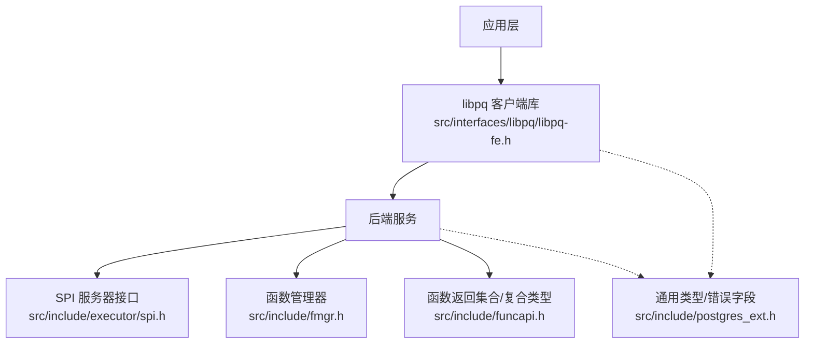
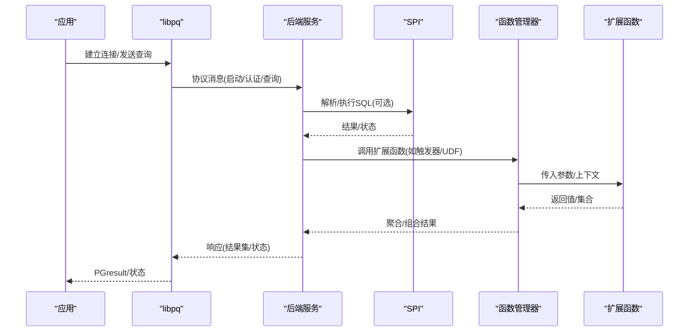
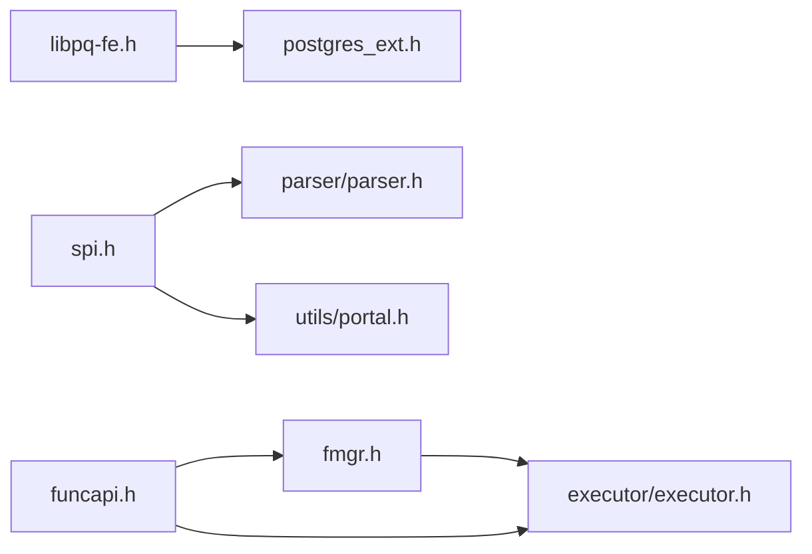

# API参考

<cite>
**本文引用的文件**
- [README](file://README)
- [libpq-fe.h](file://src/interfaces/libpq/libpq-fe.h)
- [spi.h](file://src/include/executor/spi.h)
- [fmgr.h](file://src/include/fmgr.h)
- [funcapi.h](file://src/include/funcapi.h)
- [postgres_ext.h](file://src/include/postgres_ext.h)
- [errcodes.sgml](file://doc/src/sgml/errcodes.sgml)
- [autoinc.example](file://contrib/spi/autoinc.example)
</cite>

## 目录
1. [简介](#简介)
2. [项目结构](#项目结构)
3. [核心组件](#核心组件)
4. [架构总览](#架构总览)
5. [详细组件分析](#详细组件分析)
6. [依赖关系分析](#依赖关系分析)
7. [性能考量](#性能考量)
8. [故障排查指南](#故障排查指南)
9. [结论](#结论)
10. [附录](#附录)

## 简介
本API参考文档面向Mini PostgreSQL（基于PostgreSQL裁剪的轻量实现），系统性记录对外暴露的三类公共接口：
- libpq客户端库API：供外部应用通过C语言连接、认证、执行SQL、处理结果与错误。
- SPI服务器编程接口：供扩展或内部函数在服务器进程内执行SQL、管理游标、操作元组等。
- 扩展开发接口：函数管理器（fmgr）与函数返回集合/复合类型（funcapi）等，用于编写可被SQL调用的C函数。

本参考聚焦于头文件中声明的公开符号，提供函数签名、参数说明、返回值描述、错误码、异常模式与兼容性要点，并给出多语言使用示例与最佳实践指引。

## 项目结构
Mini PostgreSQL将接口按职责分层组织：
- 客户端接口：src/interfaces/libpq（libpq C库）
- 服务器端SPI：src/include/executor/spi.h
- 扩展与函数调用：src/include/fmgr.h、src/include/funcapi.h
- 跨前后端的通用类型与错误字段：src/include/postgres_ext.h
- 错误码规范：doc/src/sgml/errcodes.sgml
- 示例与测试：contrib/spi、src/test/modules

图表来源
- [libpq-fe.h:256-577](file://src/interfaces/libpq/libpq-fe.h#L256-L577)
- [spi.h:107-211](file://src/include/executor/spi.h#L107-L211)
- [fmgr.h:38-172](file://src/include/fmgr.h#L38-L172)
- [funcapi.h:145-349](file://src/include/funcapi.h#L145-L349)
- [postgres_ext.h:28-74](file://src/include/postgres_ext.h#L28-L74)

章节来源
- [README:1-6](file://README#L1-L6)

## 核心组件
本节概述三大API族的关键能力与边界：
- libpq：连接建立、命令发送与获取、异步/管道模式、结果访问、错误与通知、编码与打印。
- SPI：连接SPI管理器、执行SQL/计划、参数化执行、游标、元组操作、内存与事务辅助。
- 扩展接口：函数定义约定、参数/返回值宏、集合返回函数（SRF）、复合类型构建。

章节来源
- [libpq-fe.h:48-177](file://src/interfaces/libpq/libpq-fe.h#L48-L177)
- [spi.h:21-109](file://src/include/executor/spi.h#L21-L109)
- [fmgr.h:175-188](file://src/include/fmgr.h#L175-L188)
- [funcapi.h:234-349](file://src/include/funcapi.h#L234-L349)

## 架构总览
下图展示从客户端到服务器的典型调用路径，以及SPI与扩展函数在服务器侧的协作关系。

图表来源
- [libpq-fe.h:256-577](file://src/interfaces/libpq/libpq-fe.h#L256-L577)
- [spi.h:107-211](file://src/include/executor/spi.h#L107-L211)
- [fmgr.h:38-172](file://src/include/fmgr.h#L38-L172)
- [funcapi.h:234-349](file://src/include/funcapi.h#L234-L349)

## 详细组件分析

### libpq 客户端库API
libpq提供完整的客户端数据库交互能力，涵盖连接、命令、结果、错误、编码、输出等。

- 连接与生命周期
  - 同步/异步连接：PQconnectdb/PQconnectStart/PQconnectPoll
  - 重连：PQreset/PQresetStart/PQresetPoll
  - 关闭：PQfinish
  - 连接信息：PQconndefaults/PQconninfoParse/PQconninfo/PQconninfoFree
  - 取消请求：PQgetCancel/PQcancel/PQfreeCancel/PQrequestCancel
- 命令执行
  - 同步：PQexec/PQexecParams/PQprepare/PQexecPrepared
  - 异步：PQsendQuery/PQsendQueryParams/PQsendPrepare/PQsendQueryPrepared
  - 单行模式：PQsetSingleRowMode
  - 获取结果：PQgetResult
  - 管线模式：PQenterPipelineMode/PQexitPipelineMode/PQpipelineSync/PQsendFlushRequest
- 连接控制与状态
  - 非阻塞：PQsetnonblocking/PQisnonblocking
  - 线程安全：PQisthreadsafe
  - 探测：PQping/PQpingParams
  - 刷新：PQflush
- 结果访问
  - 状态：PQresultStatus/PQresStatus
  - 元数据：PQntuples/PQnfields/PQfname/PQfnumber/PQftype/PQfsize/PQfformat
  - 值读取：PQgetvalue/PQgetlength/PQgetisnull
  - 清理：PQclear/PQfreemem
  - 构造/复制：PQmakeEmptyPGresult/PQcopyResult/PQsetResultAttrs/PQresultAlloc/PQresultMemorySize/PQsetvalue
- 错误与通知
  - 错误严重度/上下文：PQsetErrorVerbosity/PQsetErrorContextVisibility
  - 通知回调：PQsetNoticeReceiver/PQsetNoticeProcessor
  - 错误字符串：PQerrorMessage/PQresultErrorMessage/PQresultVerboseErrorMessage/PQresultErrorField
- 编码与工具
  - 编码：PQclientEncoding/PQsetClientEncoding/PQmblen/PQmblenBounded/PQdsplen/PQenv2encoding/pg_char_to_encoding/pg_encoding_to_char/pg_valid_server_encoding_id
  - 转义：PQescapeStringConn/PQescapeLiteral/PQescapeIdentifier/PQescapeByteaConn/PQunescapeBytea
- 打印
  - PQprint/PQdisplayTuples/PQprintTuples

使用示例（C）
- 同步执行带参查询并遍历结果：
  - 参考路径：[libpq-fe.h:378-485](file://src/interfaces/libpq/libpq-fe.h#L378-L485)
- 异步流水线批量提交：
  - 参考路径：[libpq-fe.h:428-433](file://src/interfaces/libpq/libpq-fe.h#L428-L433)

错误码与兼容
- 连接状态：ConnStatusType（例如CONNECTION_OK/CONNECTION_BAD）
- 执行状态：ExecStatusType（例如PGRES_COMMAND_OK/PGRES_TUPLES_OK/PGRES_FATAL_ERROR）
- 轮询状态：PostgresPollingStatusType（例如PGRES_POLLING_READING/WRITING/OK）
- 事务状态：PGTransactionStatusType
- 版本特性宏：LIBPQ_HAS_PIPELINING/LIBPQ_HAS_TRACE_FLAGS

章节来源
- [libpq-fe.h:48-177](file://src/interfaces/libpq/libpq-fe.h#L48-L177)
- [libpq-fe.h:256-577](file://src/interfaces/libpq/libpq-fe.h#L256-L577)

### SPI 服务器编程接口
SPI允许扩展或内部函数在服务器进程中执行SQL、管理游标、操作元组与内存。

- 连接与生命周期
  - 连接：SPI_connect/SPI_connect_ext
  - 结束：SPI_finish
- 执行SQL
  - 直接执行：SPI_execute/SPI_exec
  - 参数化执行：SPI_execute_with_args
  - 计划执行：SPI_prepare/SPI_prepare_cursor/SPI_prepare_extended/SPI_prepare_params
  - 执行计划：SPI_execute_plan/SPI_execute_plan_extended/SPI_execute_plan_with_paramlist
  - 快照执行：SPI_execute_snapshot
  - 便捷执行：SPI_execp
- 结果与元组
  - 全局结果表：SPI_tuptable
  - 复制/修改/返回元组：SPI_copytuple/SPI_modifytuple/SPI_returntuple
  - 列访问：SPI_fnumber/SPI_fname/SPI_getvalue/SPI_getbinval
  - 类型信息：SPI_gettype/SPI_gettypeid
  - 释放：SPI_freetuple/SPI_freetuptable
- 游标
  - 打开/查找/移动/滚动/关闭：SPI_cursor_open* / SPI_cursor_find / SPI_cursor_fetch / SPI_cursor_move / SPI_scroll_cursor_* / SPI_cursor_close
- 关系注册
  - 临时命名关系：SPI_register_relation/SPI_unregister_relation
- 事务辅助
  - 开始/提交/回滚/链式提交：SPI_start_transaction/SPI_commit/SPI_commit_and_chain/SPI_rollback/SPI_rollback_and_chain
- 其他
  - 计划信息：SPI_keepplan/SPI_saveplan/SPI_freeplan/SPI_is_cursor_plan/SPI_plan_is_valid
  - 结果码字符串：SPI_result_code_string
  - 全局变量：SPI_processed/SPI_result

使用示例（C）
- 在触发器中执行更新并读取影响行数：
  - 参考路径：[spi.h:114-153](file://src/include/executor/spi.h#L114-L153)
- 使用游标分页读取结果：
  - 参考路径：[spi.h:177-194](file://src/include/executor/spi.h#L177-L194)

错误码
- 负值表示错误：SPI_ERROR_CONNECT/COPY/OPUNKNOWN/UNCONNECTED/ARGUMENT/PARAM/TRANSACTION/NOATTRIBUTE/NOOUTFUNC/TYPUNKNOWN/REL_DUPLICATE/REL_NOT_FOUND
- 正值表示成功类别：SPI_OK_FETCH/UTILITY/SELECT/SELINTO/INSERT/DELETE/UPDATE/CURSOR/RETURNING/REWRITTEN/REL_REGISTER/REL_UNREGISTER

章节来源
- [spi.h:21-109](file://src/include/executor/spi.h#L21-L109)
- [spi.h:107-211](file://src/include/executor/spi.h#L107-L211)

### 扩展开发接口（函数管理器与函数返回集合/复合类型）
- 函数签名约定
  - 标准入口：Datum function_name(PG_FUNCTION_ARGS)
  - 参数获取：PG_GETARG_*系列宏
  - 返回值：PG_RETURN_*系列宏
  - NULL处理：PG_ARGISNULL/PG_RETURN_NULL
- 函数调用机制
  - FmgrInfo/FunctionCallInfoBaseData
  - 直接调用：DirectFunctionCallN/OidFunctionCallN/FunctionCallN
  - 动态加载：load_external_function/lookup_external_function
- 模块兼容性
  - PG_MODULE_MAGIC：检查后端兼容性
  - PG_FUNCTION_INFO_V1：声明版本1调用约定
- 集合返回函数（SRF）
  - 上下文：FuncCallContext
  - 初始化/每调用设置/返回下一项/完成：SRF_IS_FIRSTCALL/SRF_FIRSTCALL_INIT/SRF_PERCALL_SETUP/SRF_RETURN_NEXT/SRF_RETURN_DONE
- 复合类型构建
  - TupleDesc/AttInMetadata/BuildTupleFromCStrings/BlessTupleDesc
  - 获取结果类型：get_call_result_type/get_expr_result_type/get_func_result_type

使用示例（C）
- 定义返回复合类型的函数：
  - 参考路径：[funcapi.h:145-231](file://src/include/funcapi.h#L145-L231)
- 定义返回集合的函数：
  - 参考路径：[funcapi.h:234-349](file://src/include/funcapi.h#L234-L349)
- 使用函数管理器调用内置函数：
  - 参考路径：[fmgr.h:499-681](file://src/include/fmgr.h#L499-L681)

章节来源
- [fmgr.h:38-172](file://src/include/fmgr.h#L38-L172)
- [fmgr.h:175-188](file://src/include/fmgr.h#L175-L188)
- [fmgr.h:378-491](file://src/include/fmgr.h#L378-L491)
- [fmgr.h:499-681](file://src/include/fmgr.h#L499-L681)
- [funcapi.h:145-349](file://src/include/funcapi.h#L145-L349)

## 依赖关系分析
- libpq依赖通用类型与错误字段（Oid、错误字段标识），并通过协议与后端通信。
- SPI依赖解析器、Portal、内存上下文等后端子系统，提供SQL执行与元组操作。
- 扩展接口（fmgr/funcapi）为所有C函数提供统一调用约定与结果封装，是SPI与后端执行的桥梁。

图表来源
- [libpq-fe.h:25-30](file://src/interfaces/libpq/libpq-fe.h#L25-L30)
- [spi.h:16-18](file://src/include/executor/spi.h#L16-L18)
- [fmgr.h:20-29](file://src/include/fmgr.h#L20-L29)
- [funcapi.h:20-23](file://src/include/funcapi.h#L20-L23)
- [postgres_ext.h:28-74](file://src/include/postgres_ext.h#L28-L74)

章节来源
- [libpq-fe.h:25-30](file://src/interfaces/libpq/libpq-fe.h#L25-L30)
- [spi.h:16-18](file://src/include/executor/spi.h#L16-L18)
- [fmgr.h:20-29](file://src/include/fmgr.h#L20-L29)
- [funcapi.h:20-23](file://src/include/funcapi.h#L20-L23)
- [postgres_ext.h:28-74](file://src/include/postgres_ext.h#L28-L74)

## 性能考量
- 使用预编译语句（PQprepare/PQexecPrepared、SPI_prepare/SPI_execute_plan）减少重复解析开销。
- 合理使用管线模式（libpq pipeline）批量提交命令以降低往返延迟。
- 在SPI中限制tcount或使用只读模式以减少不必要的工作。
- 对大结果集采用单行模式（PQsetSingleRowMode）或游标分页读取，避免一次性加载全部数据。
- 谨慎使用内存分配，优先使用SPI_palloc/SPI_repalloc/SPI_pfree与函数上下文管理。

## 故障排查指南
- 错误分类
  - SQLSTATE错误码遵循SQL标准，建议应用根据类名做通用处理；具体条件名用于精细分支。
  - libpq ExecStatusType指示命令执行结果，注意区分警告与非致命错误。
  - SPI返回负值表示错误，可使用SPI_result_code_string转换为可读字符串。
- 常见错误场景
  - 未连接SPI即执行：需先调用SPI_connect。
  - 参数类型不匹配：检查SPI_execute_with_args或libpq参数类型数组。
  - 资源泄漏：确保PQclear、SPI_freetuple、SPI_freetuptable等释放。
- 调试技巧
  - 启用libpq跟踪：PQtrace/PQuntrace/PQsetTraceFlags
  - 调整错误详细度：PQsetErrorVerbosity/PQsetErrorContextVisibility
  - 捕获通知：PQsetNoticeReceiver/PQsetNoticeProcessor

章节来源
- [errcodes.sgml:1-89](file://doc/src/sgml/errcodes.sgml#L1-L89)
- [libpq-fe.h:48-177](file://src/interfaces/libpq/libpq-fe.h#L48-L177)
- [spi.h:67-109](file://src/include/executor/spi.h#L67-L109)

## 结论
Mini PostgreSQL暴露了稳定且功能完备的三类API：
- libpq提供成熟的客户端连接与SQL交互能力，支持同步/异步/管线等多种模式。
- SPI为扩展提供了强大的服务器端SQL执行与元组操作能力。
- 扩展接口（fmgr/funcapi）定义了统一的函数调用约定与结果封装方式，便于开发高性能、可复用的C函数。

在实际工程中，应结合预编译语句、管线模式、游标与内存上下文管理，以获得更好的性能与稳定性。

## 附录

### 错误码与兼容性说明
- SQLSTATE错误码：参见错误码文档，建议应用以类名为主要判断依据。
- libpq兼容性：通过LIBPQ_HAS_*宏检测新特性可用性（如管线、跟踪标志）。
- SPI兼容性：选项结构体应清零后填充，保证未来新增字段向后兼容。
- 扩展兼容性：必须包含PG_MODULE_MAGIC以确保与后端版本一致。

章节来源
- [errcodes.sgml:1-89](file://doc/src/sgml/errcodes.sgml#L1-L89)
- [libpq-fe.h:31-38](file://src/interfaces/libpq/libpq-fe.h#L31-L38)
- [spi.h:44-62](file://src/include/executor/spi.h#L44-L62)
- [fmgr.h:427-491](file://src/include/fmgr.h#L427-L491)

### 不同语言使用示例与最佳实践
- C/C++
  - 使用libpq进行连接与查询，注意错误处理与资源释放。
  - 使用SPI在触发器/函数中执行SQL，注意连接与事务边界。
  - 使用fmgr/funcapi编写扩展函数，遵循参数/返回约定与内存管理。
- Python（psycopg2/asyncpg）
  - 通过libpq驱动连接，使用参数化查询防止注入。
  - 利用游标与大结果集分页读取，避免内存峰值。
- Java（JDBC）
  - 使用PreparedStatement与批处理提升性能。
  - 合理设置fetch size与事务隔离级别。
- Go（lib/pq）
  - 使用rows.Next()迭代结果，及时关闭Rows。
  - 使用管道/批处理优化高并发场景。

最佳实践
- 始终使用参数化查询，避免拼接SQL。
- 显式管理连接与结果对象的生命周期。
- 针对大结果集采用流式读取或游标。
- 在扩展中使用正确的内存上下文与释放策略。
- 使用错误码而非文本消息进行逻辑分支。

章节来源
- [autoinc.example:1-36](file://contrib/spi/autoinc.example#L1-L36)
- [libpq-fe.h:378-577](file://src/interfaces/libpq/libpq-fe.h#L378-L577)
- [spi.h:107-211](file://src/include/executor/spi.h#L107-L211)
- [fmgr.h:175-188](file://src/include/fmgr.h#L175-L188)
- [funcapi.h:234-349](file://src/include/funcapi.h#L234-L349)