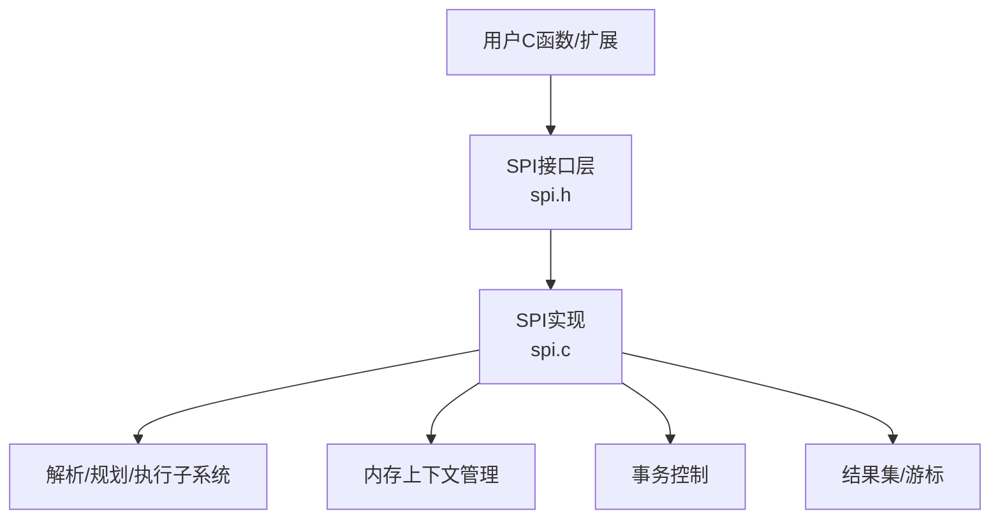
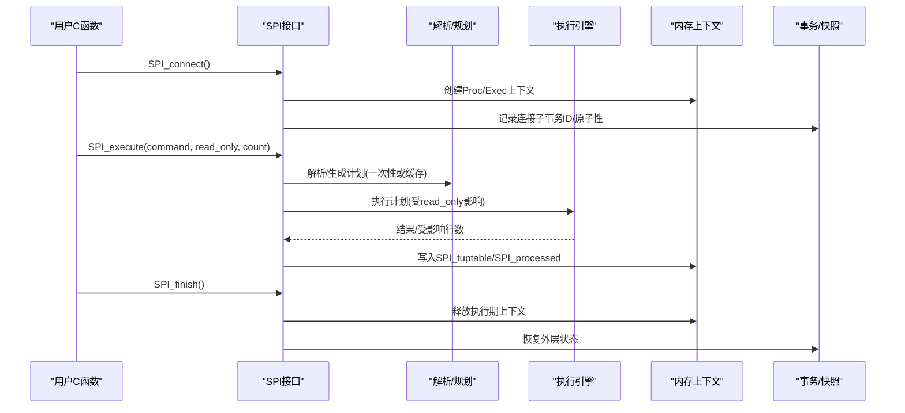
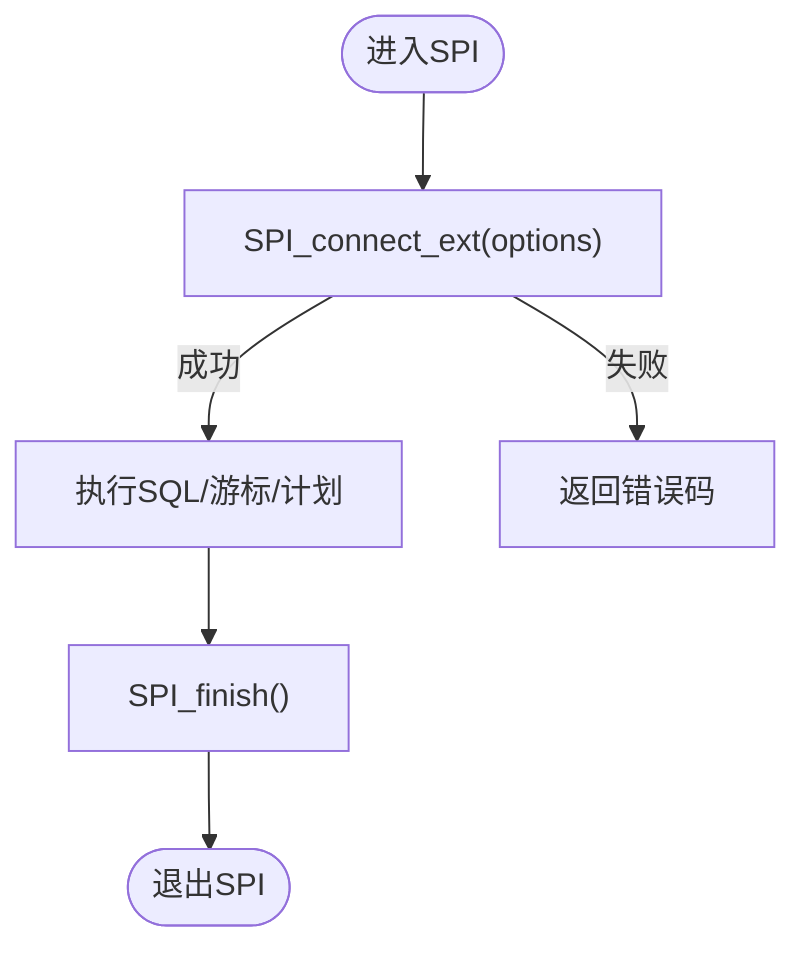
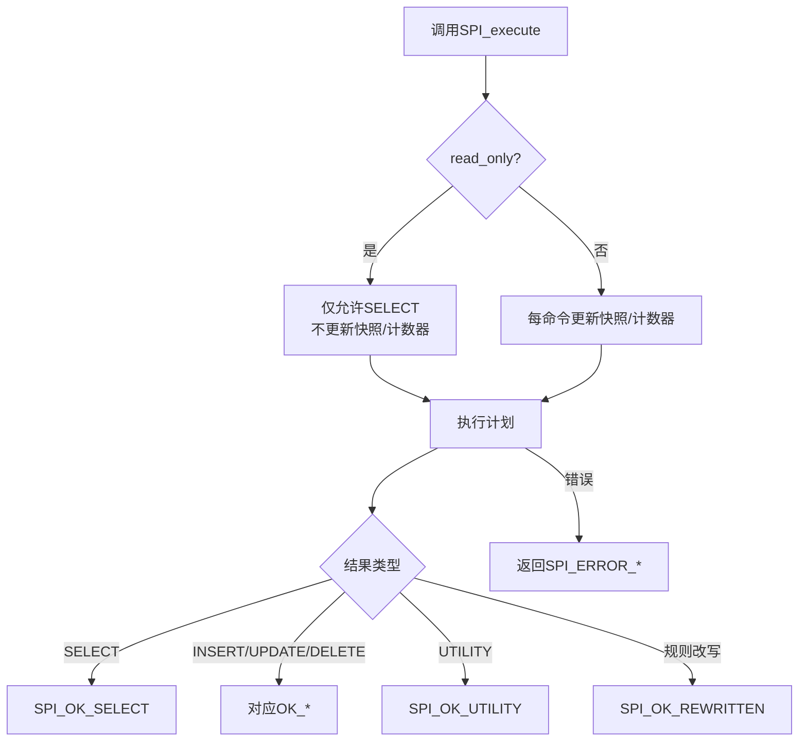
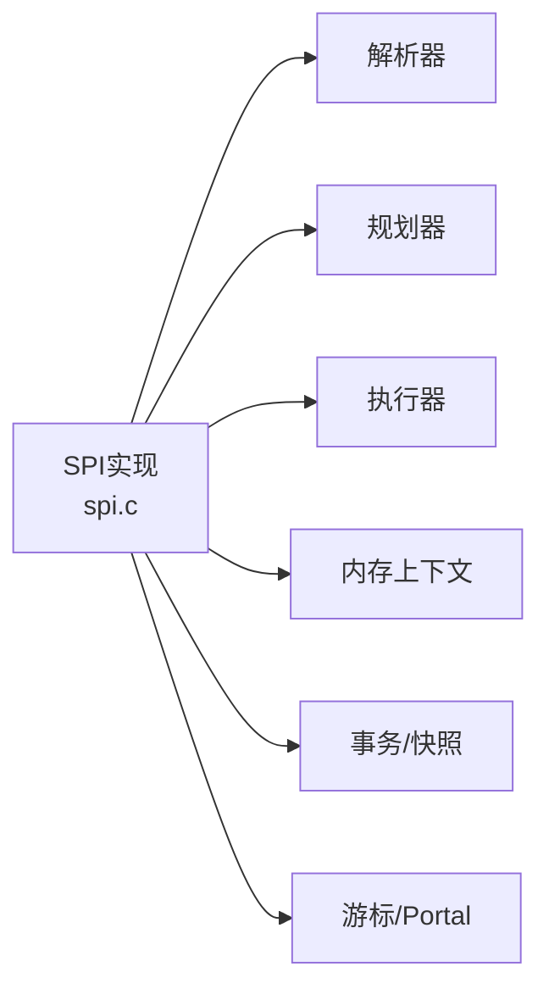

# SPI服务器编程接口

<cite>
**本文引用的文件**
- [spi.c](file://src/backend/executor/spi.c)
- [spi.h](file://src/include/executor/spi.h)
- [spi.sgml](file://doc/src/sgml/spi.sgml)
</cite>

## 目录
1. [简介](#简介)
2. [项目结构](#项目结构)
3. [核心组件](#核心组件)
4. [架构总览](#架构总览)
5. [详细组件分析](#详细组件分析)
6. [依赖关系分析](#依赖关系分析)
7. [性能考虑](#性能考虑)
8. [故障排查指南](#故障排查指南)
9. [结论](#结论)
10. [附录：PL/pgSQL扩展开发示例与最佳实践](#附录plpgsql扩展开发示例与最佳实践)

## 简介
SPI（Server Programming Interface）为C函数提供了在PostgreSQL内部执行SQL命令的能力，封装了解析、规划与执行流程，并提供结果集、游标、内存管理与事务控制等能力。本档面向扩展开发者，系统化梳理SPI初始化、SQL执行、结果集处理、数据类型转换、上下文管理、事务处理、内存管理与性能优化要点，并给出PL/pgSQL扩展开发的最佳实践建议。

## 项目结构
- 实现位于后端执行器模块：src/backend/executor/spi.c
- 公共头文件：src/include/executor/spi.h
- 官方文档源：doc/src/sgml/spi.sgml

图表来源
- [spi.h:107-210](file://src/include/executor/spi.h#L107-L210)
- [spi.c:93-215](file://src/backend/executor/spi.c#L93-L215)

章节来源
- [spi.h:107-210](file://src/include/executor/spi.h#L107-L210)
- [spi.c:93-215](file://src/backend/executor/spi.c#L93-L215)

## 核心组件
- 连接与生命周期
  - SPI_connect/SPI_connect_ext：建立SPI连接，创建专用内存上下文，保存/恢复全局状态
  - SPI_finish：释放执行期内存，恢复外层API全局变量，弹出连接栈
- SQL执行
  - SPI_execute/SPI_exec：执行SQL字符串，支持只读/读写模式与行数限制
  - SPI_execute_extended：带选项的执行（参数、目标接收器、是否必须返回行等）
  - SPI_execute_plan / SPI_execute_plan_extended / SPI_execute_plan_with_paramlist：执行已准备计划
  - SPI_execute_snapshot：指定快照执行（内部使用）
- 计划准备
  - SPI_prepare / SPI_prepare_cursor / SPI_prepare_extended / SPI_prepare_params：准备可重用计划
  - SPI_keepplan / SPI_saveplan / SPI_freeplan：计划生命周期管理
- 结果集与元数据
  - SPI_processed / SPI_tuptable / SPI_result：执行结果的全局访问
  - SPITupleTable：结果表结构
  - SPI_getargcount / SPI_getargtypeid / SPI_is_cursor_plan / SPI_plan_is_valid：计划元信息
- 游标操作
  - SPI_cursor_open / SPI_cursor_fetch / SPI_cursor_move / SPI_scroll_cursor_* / SPI_cursor_close
- 数据类型与列访问
  - SPI_getvalue / SPI_getbinval / SPI_fname / SPI_fnumber / SPI_gettype / SPI_gettypeid
- 元组操作
  - SPI_copytuple / SPI_returntuple / SPI_modifytuple / SPI_freetuple / SPI_freetuptable
- 内存管理
  - SPI_palloc / SPI_repalloc / SPI_pfree
- 事务控制
  - SPI_commit / SPI_rollback / SPI_commit_and_chain / SPI_rollback_and_chain
  - AtEOXact_SPI / AtEOSubXact_SPI：事务/子事务清理
- 其他工具
  - SPI_register_relation / SPI_unregister_relation：临时命名关系注册
  - SPI_result_code_string：错误码转字符串

章节来源
- [spi.h:21-105](file://src/include/executor/spi.h#L21-L105)
- [spi.h:107-210](file://src/include/executor/spi.h#L107-L210)
- [spi.c:93-215](file://src/backend/executor/spi.c#L93-L215)
- [spi.c:605-800](file://src/backend/executor/spi.c#L605-L800)
- [spi.sgml:57-200](file://doc/src/sgml/spi.sgml#L57-L200)
- [spi.sgml:203-630](file://doc/src/sgml/spi.sgml#L203-L630)
- [spi.sgml:813-1124](file://doc/src/sgml/spi.sgml#L813-L1124)
- [spi.sgml:3804-3980](file://doc/src/sgml/spi.sgml#L3804-L3980)
- [spi.sgml:4279-5000](file://doc/src/sgml/spi.sgml#L4279-L5000)

## 架构总览
SPI将上层C函数与底层解析/规划/执行解耦，通过连接栈隔离每次调用上下文，提供一致的API语义。执行路径包括：
- 进入SPI连接：分配内存上下文、保存/重置全局状态
- 解析与计划：一次性计划或缓存计划
- 执行：根据read_only标志选择快照更新策略与命令类型检查
- 结果收集：默认累积到SPITupleTable，或通过DestReceiver流式处理
- 退出SPI连接：释放执行期内存，恢复外层状态

图表来源
- [spi.c:93-215](file://src/backend/executor/spi.c#L93-L215)
- [spi.c:605-710](file://src/backend/executor/spi.c#L605-L710)
- [spi.sgml:203-352](file://doc/src/sgml/spi.sgml#L203-L352)

## 详细组件分析

### 连接与生命周期管理
- SPI_connect/SPI_connect_ext
  - 功能：建立SPI连接，创建Proc/Exec内存上下文，保存外层SPI_processed/SPI_tuptable/SPI_result
  - 选项：SPI_OPT_NONATOMIC允许在连接内提交/回滚
  - 返回：成功SPI_OK_CONNECT；失败SPI_ERROR_CONNECT
- SPI_finish
  - 功能：释放执行期内存，恢复外层全局变量，弹出连接栈
  - 返回：成功SPI_OK_FINISH；未连接时SPI_ERROR_UNCONNECTED

图表来源
- [spi.c:93-215](file://src/backend/executor/spi.c#L93-L215)
- [spi.h:67-99](file://src/include/executor/spi.h#L67-L99)

章节来源
- [spi.c:93-215](file://src/backend/executor/spi.c#L93-L215)
- [spi.h:67-99](file://src/include/executor/spi.h#L67-L99)
- [spi.sgml:57-200](file://doc/src/sgml/spi.sgml#L57-L200)

### SQL执行函数族
- SPI_execute(command, read_only, count)
  - 行为：解析/一次性计划/执行；read_only=true仅允许SELECT且不更新快照
  - 返回：SPI_OK_SELECT/INSERT/UPDATE/DELETE/UTILITY/REWRITTEN等；错误码见下
- SPI_exec(command, count)
  - 等价于SPI_execute(..., false, ...)
- SPI_execute_extended(command, options)
  - 支持外部参数、DestReceiver流式输出、must_return_tuples、allow_nonatomic等
- SPI_execute_plan / SPI_execute_plan_extended / SPI_execute_plan_with_paramlist
  - 复用已准备计划，减少重复解析/规划开销
- SPI_execute_snapshot(plan, values, nulls, snapshot, crosscheck_snapshot, read_only, fire_triggers, tcount)
  - 指定快照执行（内部用途）

返回值与错误码
- 成功：非负常量（如SPI_OK_SELECT、SPI_OK_INSERT等）
- 失败：负值（如SPI_ERROR_ARGUMENT、SPI_ERROR_COPY、SPI_ERROR_TRANSACTION、SPI_ERROR_UNCONNECTED、SPI_ERROR_OPUNKNOWN等）

图表来源
- [spi.c:605-710](file://src/backend/executor/spi.c#L605-L710)
- [spi.h:67-99](file://src/include/executor/spi.h#L67-L99)
- [spi.sgml:203-630](file://doc/src/sgml/spi.sgml#L203-L630)

章节来源
- [spi.c:605-800](file://src/backend/executor/spi.c#L605-L800)
- [spi.h:67-99](file://src/include/executor/spi.h#L67-L99)
- [spi.sgml:203-630](file://doc/src/sgml/spi.sgml#L203-L630)

### 计划准备与复用
- SPI_prepare / SPI_prepare_cursor / SPI_prepare_extended / SPI_prepare_params
  - 将SQL解析并生成计划对象，供后续多次执行复用
- SPI_keepplan / SPI_saveplan / SPI_freeplan
  - 延长计划生命周期或释放计划
- SPI_getargcount / SPI_getargtypeid / SPI_is_cursor_plan / SPI_plan_is_valid
  - 查询计划元信息，判断是否可用于游标

章节来源
- [spi.sgml:966-1124](file://doc/src/sgml/spi.sgml#L966-L1124)
- [spi.h:136-156](file://src/include/executor/spi.h#L136-L156)

### 结果集与元数据
- SPI_processed：最近一次执行的受影响行数
- SPI_tuptable：结果表指针（SELECT/RETURNING/部分UTILITY）
- SPITupleTable：包含tupdesc、vals数组、numvals等
- SPI_getvalue / SPI_getbinval：按列号获取字符串或二进制值
- SPI_fname / SPI_fnumber：列名与列号互查
- SPI_gettype / SPI_gettypeid：列类型名与OID

章节来源
- [spi.sgml:300-352](file://doc/src/sgml/spi.sgml#L300-L352)
- [spi.sgml:3804-3980](file://doc/src/sgml/spi.sgml#L3804-L3980)
- [spi.h:21-33](file://src/include/executor/spi.h#L21-L33)

### 游标操作
- SPI_cursor_open / SPI_cursor_open_with_args / SPI_cursor_open_with_paramlist / SPI_cursor_parse_open
- SPI_cursor_find / SPI_cursor_fetch / SPI_cursor_move / SPI_scroll_cursor_fetch / SPI_scroll_cursor_move / SPI_cursor_close
- 注意：向后移动需CURSOR_OPT_SCROLL；某些Portal并非游标型

章节来源
- [spi.h:177-194](file://src/include/executor/spi.h#L177-L194)
- [spi.sgml:2702-2877](file://doc/src/sgml/spi.sgml#L2702-L2877)

### 元组与数据类型转换
- SPI_copytuple：复制行到上层执行上下文（触发器常用）
- SPI_returntuple：将行转换为Datum返回（复合类型函数）
- SPI_modifytuple：基于原行修改指定列生成新行
- SPI_freetuple / SPI_freetuptable：释放行/结果表
- SPI_datumTransfer：按类型长度/传递方式安全转移Datum

章节来源
- [spi.sgml:4519-4823](file://doc/src/sgml/spi.sgml#L4519-L4823)
- [spi.h:158-175](file://src/include/executor/spi.h#L158-L175)

### 内存管理
- SPI_palloc / SPI_repalloc / SPI_pfree：在上层执行上下文中分配/重分配/释放
- SPI_connect创建Proc/Exec上下文，SPI_finish释放执行期上下文
- 注意：若需跨SPI_finish返回对象，应使用SPI_palloc而非palloc

章节来源
- [spi.sgml:4279-4515](file://doc/src/sgml/spi.sgml#L4279-L4515)
- [spi.c:148-178](file://src/backend/executor/spi.c#L148-L178)

### 事务控制
- SPI_commit / SPI_rollback / SPI_commit_and_chain / SPI_rollback_and_chain
  - 仅在nonatomic连接中允许；子事务中禁止提交/回滚
- AtEOXact_SPI / AtEOSubXact_SPI：事务/子事务结束时清理SPI栈与资源

章节来源
- [spi.c:226-422](file://src/backend/executor/spi.c#L226-L422)
- [spi.c:437-585](file://src/backend/executor/spi.c#L437-L585)
- [spi.sgml:92-115](file://doc/src/sgml/spi.sgml#L92-L115)

### 临时命名关系
- SPI_register_relation / SPI_unregister_relation：注册/注销临时命名关系，便于SQL引用

章节来源
- [spi.sgml:3352-3512](file://doc/src/sgml/spi.sgml#L3352-L3512)
- [spi.h:196-197](file://src/include/executor/spi.h#L196-L197)

## 依赖关系分析
- SPI实现依赖解析器、规划器、执行器、内存上下文、事务管理器、快照管理器等子系统
- 对外暴露稳定的头文件接口，内部实现细节对扩展透明

图表来源
- [spi.c:15-35](file://src/backend/executor/spi.c#L15-L35)
- [spi.h:16-18](file://src/include/executor/spi.h#L16-L18)

章节来源
- [spi.c:15-35](file://src/backend/executor/spi.c#L15-L35)
- [spi.h:16-18](file://src/include/executor/spi.h#L16-L18)

## 性能考虑
- 尽量使用SPI_prepare+SPI_execute_plan复用计划，避免重复解析/规划
- 对于一次性执行且参数多变的场景，SPI_execute_with_args可能更优
- 大结果集优先使用SPI_execute_extended的DestReceiver进行流式处理，避免内存膨胀
- 只读查询设置read_only=true可减少快照/计数器更新开销
- 合理使用SPI_OPT_NONATOMIC仅在需要显式事务控制时使用
- 及时释放结果表：SPI_freetuptable或等待SPI_finish自动回收

[本节为通用性能建议，无需特定文件引用]

## 故障排查指南
- 常见错误码
  - SPI_ERROR_ARGUMENT：参数非法（如NULL命令、负计数、无效计划等）
  - SPI_ERROR_COPY：尝试COPY TO stdout/FROM stdin
  - SPI_ERROR_TRANSACTION：在不允许的位置提交/回滚或在子事务中提交/回滚
  - SPI_ERROR_UNCONNECTED：未连接SPI即调用受限函数
  - SPI_ERROR_OPUNKNOWN：未知命令类型
  - SPI_ERROR_NOATTRIBUTE / SPI_ERROR_NOOUTFUNC：列不存在或无输出函数
- 调试技巧
  - 使用SPI_result_code_string将错误码转为可读字符串
  - 检查SPI_processed与SPI_tuptable是否为预期值
  - 确认read_only与命令类型匹配
  - 确保SPI_connect/SPI_finish成对出现，避免栈不平衡

章节来源
- [spi.h:67-99](file://src/include/executor/spi.h#L67-L99)
- [spi.sgml:4223-4274](file://doc/src/sgml/spi.sgml#L4223-L4274)
- [spi.sgml:490-548](file://doc/src/sgml/spi.sgml#L490-L548)

## 结论
SPI为PostgreSQL扩展提供了强大而稳定的内部SQL执行能力。通过合理管理连接、计划、结果集与内存，并在必要时启用 nonatomic 事务控制，可以构建高效可靠的扩展逻辑。遵循本文档的API说明、错误处理与性能建议，有助于写出健壮且易维护的SPI代码。

[本节为总结性内容，无需特定文件引用]

## 附录：PL/pgSQL扩展开发示例与最佳实践
- 典型流程
  - 在函数入口调用SPI_connect
  - 使用SPI_execute/SPI_execute_with_args执行SQL
  - 读取SPI_processed与SPI_tuptable处理结果
  - 必要时使用SPI_prepare/SPI_execute_plan提升性能
  - 在函数出口调用SPI_finish
- 最佳实践
  - 始终检查返回值与SPI_result
  - 对大结果集使用DestReceiver流式处理
  - 明确read_only语义，避免混用只读/读写命令
  - 使用SPI_palloc返回跨SPI_finish的对象
  - 谨慎使用SPI_OPT_NONATOMIC，仅在需要显式事务控制时使用
  - 利用SPI_result_code_string记录错误信息

[本节为概念性指导，无需特定文件引用]