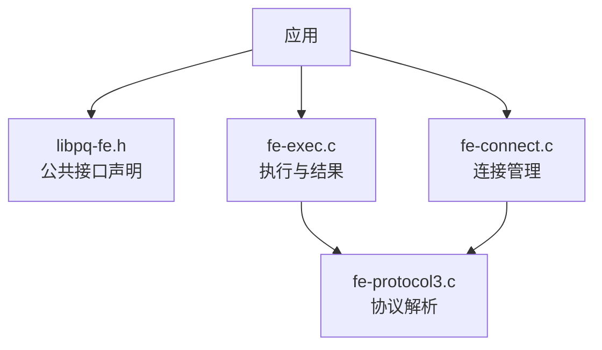
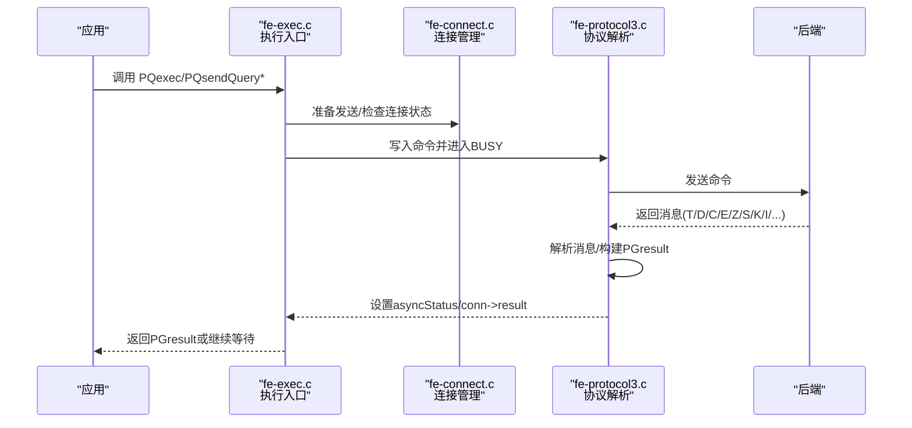
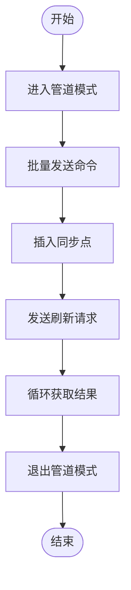
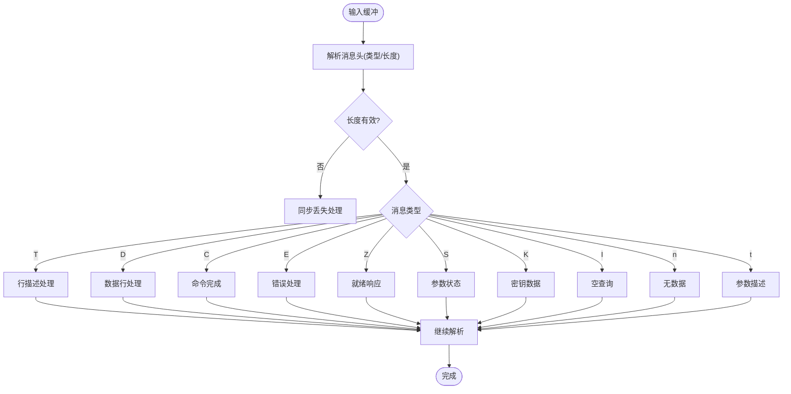
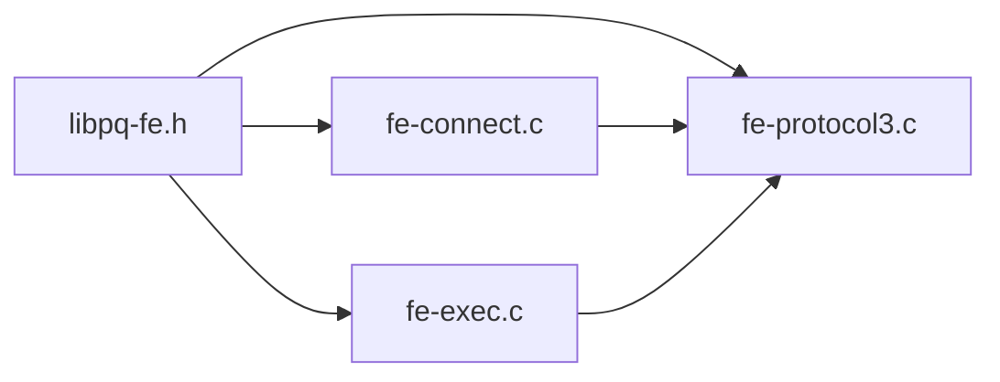

# libpq客户端库API

<cite>
**本文引用的文件**
- [libpq-fe.h](file://src/interfaces/libpq/libpq-fe.h)
- [fe-connect.c](file://src/interfaces/libpq/fe-connect.c)
- [fe-exec.c](file://src/interfaces/libpq/fe-exec.c)
- [fe-protocol3.c](file://src/interfaces/libpq/fe-protocol3.c)
</cite>

## 目录
1. [简介](#简介)
2. [项目结构](#项目结构)
3. [核心组件](#核心组件)
4. [架构总览](#架构总览)
5. [详细组件分析](#详细组件分析)
6. [依赖关系分析](#依赖关系分析)
7. [性能注意事项](#性能注意事项)
8. [故障排查指南](#故障排查指南)
9. [结论](#结论)
10. [附录：函数参考与示例路径](#附录函数参考与示例路径)

## 简介
本文件为PostgreSQL的C语言客户端库libpq提供完整API文档，覆盖连接管理、查询执行、结果处理、错误处理、事务控制、异步查询与管道模式等主题。文档基于源码中的头文件与实现文件进行归纳，面向不同技术背景的读者，提供从概览到代码级细节的渐进式说明，并附带流程图与时序图帮助理解调用链路与数据流。

## 项目结构
libpq对外暴露的头文件位于接口层，核心实现分布在连接建立、协议解析、执行与结果管理等模块中。关键文件职责如下：
- 接口定义：libpq-fe.h（类型、枚举、函数声明）
- 连接管理：fe-connect.c（同步/异步连接、参数解析、重连、Ping）
- 执行与结果：fe-exec.c（PQexec/PQsendQuery系列、PGresult内存管理、单行模式、事件）
- 协议解析：fe-protocol3.c（后端消息解析、状态机、管道同步点）

**图示来源**
- [libpq-fe.h:256-577](file://src/interfaces/libpq/libpq-fe.h#L256-L577)
- [fe-connect.c:421-500](file://src/interfaces/libpq/fe-connect.c#L421-L500)
- [fe-exec.c:1-120](file://src/interfaces/libpq/fe-exec.c#L1-L120)
- [fe-protocol3.c:53-120](file://src/interfaces/libpq/fe-protocol3.c#L53-L120)

**章节来源**
- [libpq-fe.h:256-577](file://src/interfaces/libpq/libpq-fe.h#L256-L577)
- [fe-connect.c:421-500](file://src/interfaces/libpq/fe-connect.c#L421-L500)
- [fe-exec.c:1-120](file://src/interfaces/libpq/fe-exec.c#L1-L120)
- [fe-protocol3.c:53-120](file://src/interfaces/libpq/fe-protocol3.c#L53-L120)

## 核心组件
- 连接对象与状态
  - PGconn：封装与后端的连接状态、缓冲区、参数、事件钩子等
  - ConnStatusType：连接状态（OK/BAD及非阻塞阶段）
  - PostgresPollingStatusType：非阻塞轮询状态
  - PGTransactionStatusType：事务状态
  - PGpipelineStatus：管道模式状态
- 结果对象与状态
  - PGresult：封装单次命令的结果元数据、元组、错误信息等
  - ExecStatusType：结果状态（空查询、命令成功、元组、错误、单行、管道同步/中止）
- 辅助类型
  - PQnoticeReceiver/PQnoticeProcessor：通知回调
  - PQprintOpt：打印选项
  - PGresAttDesc：列描述信息
  - PQconninfoOption：连接参数项

上述类型与枚举在头文件中集中声明，供应用与内部实现共同使用。

**章节来源**
- [libpq-fe.h:56-167](file://src/interfaces/libpq/libpq-fe.h#L56-L167)
- [libpq-fe.h:175-249](file://src/interfaces/libpq/libpq-fe.h#L175-L249)

## 架构总览
libpq采用“前端-后端”协议驱动的状态机模型。应用通过同步或异步API发起请求；后端返回多种消息类型（如命令完成、错误、行描述、数据行、参数状态、同步响应等），由协议解析器统一处理并更新连接与结果对象状态。

**图示来源**
- [fe-exec.c:1-120](file://src/interfaces/libpq/fe-exec.c#L1-L120)
- [fe-protocol3.c:53-240](file://src/interfaces/libpq/fe-protocol3.c#L53-L240)
- [fe-connect.c:421-500](file://src/interfaces/libpq/fe-connect.c#L421-L500)

## 详细组件分析

### 连接管理API
- 同步连接
  - PQconnectdb(conninfo)：以字符串形式传入连接参数，阻塞直至连接完成
  - PQconnectdbParams(keywords, values, expand_dbname)：以键值数组形式传入参数，阻塞连接
  - PQsetdbLogin(...)：旧式接口，已不推荐
- 异步连接
  - PQconnectStart(...)/PQconnectStartParams(...)：启动非阻塞连接
  - PQconnectPoll(conn)：轮询连接进度，返回轮询状态
- 连接维护
  - PQfinish(conn)：关闭连接并释放资源
  - PQresetStart/PQresetPoll：重置并重连
  - PQping/PQpingParams：探测服务器可达性
- 连接信息与配置
  - PQconndefaults/PQconninfoParse/PQconninfo：获取默认/解析/当前连接参数
  - PQconninfoFree：释放参数数组
  - PQsetErrorVerbosity/PQsetErrorContextVisibility：设置错误信息详细程度与上下文可见性
  - PQsetNoticeReceiver/PQsetNoticeProcessor：注册通知回调
  - PQregisterThreadLock：线程锁回调（用于Kerberos等场景）
  - PQtrace/PQuntrace/PQsetTraceFlags：调试跟踪

使用要点
- 无论连接是否成功，均应调用PQfinish释放资源
- 非阻塞模式下需循环调用PQconnectPoll直至完成或失败
- 可通过环境变量与conninfo参数组合配置连接行为

**章节来源**
- [libpq-fe.h:256-364](file://src/interfaces/libpq/libpq-fe.h#L256-L364)
- [fe-connect.c:421-500](file://src/interfaces/libpq/fe-connect.c#L421-L500)

### 查询执行API
- 同步执行
  - PQexec(conn, query)：简单同步执行
  - PQexecParams(...)：带参数的同步执行
  - PQprepare/PQexecPrepared：预编译语句与执行
- 异步执行
  - PQsendQuery/PQsendQueryParams/PQsendPrepare/PQsendQueryPrepared：发送命令并立即返回
  - PQgetResult(conn)：逐个获取结果（支持多结果集）
  - PQisBusy/PQconsumeInput：配合非阻塞I/O
  - PQsetSingleRowMode：开启单行模式，逐行返回结果
- 管道模式
  - PQenterPipelineMode/PQexitPipelineMode：进入/退出管道模式
  - PQpipelineSync：插入同步点
  - PQsendFlushRequest：请求刷新
  - PQpipelineStatus：查询管道状态

使用要点
- 异步模式下，应用需自行管理I/O就绪与结果消费顺序
- 单行模式适合大数据集流式处理，避免一次性加载全部结果
- 管道模式可批量提交多个命令，提高吞吐并减少往返

**章节来源**
- [libpq-fe.h:376-443](file://src/interfaces/libpq/libpq-fe.h#L376-L443)
- [fe-exec.c:1-120](file://src/interfaces/libpq/fe-exec.c#L1-L120)
- [fe-protocol3.c:186-240](file://src/interfaces/libpq/fe-protocol3.c#L186-L240)

### 结果处理API
- 基本查询
  - PQresultStatus(res)：获取结果状态
  - PQntuples(res)/PQnfields(res)：行数/列数
  - PQfname/PQfnumber/PQfformat/PQftype/PQfsize/PQfmod：字段元信息
  - PQgetvalue/PQgetlength/PQgetisnull：读取字段值、长度、是否为NULL
  - PQcmdStatus/PQcmdTuples/PQoidValue：命令状态、影响行数、OID
- 错误与详情
  - PQresultErrorMessage/PQresultVerboseErrorMessage/PQresultErrorField：错误信息
- 结果生命周期
  - PQclear(res)：释放结果
  - PQmakeEmptyPGresult/PQcopyResult/PQsetResultAttrs/PQresultAlloc/PQresultMemorySize：创建/复制/分配结果内存
  - PQsetvalue：设置结果字段（常用于自定义结果构造）

使用要点
- 对每个PGresult必须调用PQclear释放内存
- 单行模式下PQgetResult会返回PGRES_SINGLE_TUPLE，需循环消费
- 二进制格式字段注意对齐与长度处理

**章节来源**
- [libpq-fe.h:457-504](file://src/interfaces/libpq/libpq-fe.h#L457-L504)
- [fe-exec.c:132-212](file://src/interfaces/libpq/fe-exec.c#L132-L212)
- [fe-exec.c:506-639](file://src/interfaces/libpq/fe-exec.c#L506-L639)
- [fe-exec.c:684-752](file://src/interfaces/libpq/fe-exec.c#L684-L752)

### 错误处理与通知
- 连接错误
  - PQerrorMessage(conn)：获取最近错误消息
  - PQstatus(conn)：连接状态
  - pqSaveErrorResult/pqClearAsyncResult：内部错误结果构造与清理
- 结果错误
  - PQresultErrorMessage/PQresultVerboseErrorMessage/PQresultErrorField：结果级错误信息
- 通知机制
  - PQsetNoticeReceiver/PQsetNoticeProcessor：注册通知接收器/处理器
  - pqInternalNotice：内部生成通知并通过回调上报

最佳实践
- 始终检查PQresultStatus，区分PGRES_COMMAND_OK、PGRES_TUPLES_OK、PGRES_FATAL_ERROR等
- 对NOTICE与ERROR分别处理，避免将警告误判为致命错误
- 在非阻塞模式下，结合PQisBusy与PQconsumeInput处理I/O错误

**章节来源**
- [libpq-fe.h:315-364](file://src/interfaces/libpq/libpq-fe.h#L315-L364)
- [fe-exec.c:824-878](file://src/interfaces/libpq/fe-exec.c#L824-L878)
- [fe-exec.c:754-790](file://src/interfaces/libpq/fe-exec.c#L754-L790)

### 事务控制
- 事务状态查询
  - PQtransactionStatus(conn)：返回PQTRANS_*状态
- 典型用法
  - 显式BEGIN/COMMIT/ROLLBACK通过SQL语句执行
  - 根据PQtransactionStatus判断是否在事务块内或处于错误恢复态

注意事项
- 当检测到INERROR状态时，应先执行ROLLBACK再恢复业务逻辑
- 对于只读会话，可利用default_transaction_read_only参数优化

**章节来源**
- [libpq-fe.h:110-117](file://src/interfaces/libpq/libpq-fe.h#L110-L117)
- [fe-exec.c:973-1085](file://src/interfaces/libpq/fe-exec.c#L973-L1085)

### 异步查询与管道模式
- 异步查询流程
  - 发送：PQsendQuery*系列
  - 轮询：PQisBusy/PQconsumeInput
  - 获取：PQgetResult循环直到返回NULL
- 管道模式流程
  - 进入：PQenterPipelineMode
  - 批量发送：连续调用PQsendQuery*
  - 同步点：PQpipelineSync
  - 刷新：PQsendFlushRequest
  - 退出：PQexitPipelineMode

**图示来源**
- [libpq-fe.h:428-433](file://src/interfaces/libpq/libpq-fe.h#L428-L433)
- [fe-protocol3.c:212-238](file://src/interfaces/libpq/fe-protocol3.c#L212-L238)

**章节来源**
- [libpq-fe.h:399-443](file://src/interfaces/libpq/libpq-fe.h#L399-L443)
- [fe-protocol3.c:186-240](file://src/interfaces/libpq/fe-protocol3.c#L186-L240)

### 协议解析与状态机
后端消息类型包括：
- T：行描述（Row Description）
- D：数据行（Data Row）
- C：命令完成（Command Complete）
- E：错误（Error）
- Z：同步响应（Ready For Query）
- S：参数状态（Parameter Status）
- K：密钥（Secret Key）
- I：空查询（Empty Query）
- n：无数据（No Data）
- t：参数描述（Parameter Description）

解析器根据消息类型构建PGresult、更新连接状态，并在异常情况下保存错误结果并推进到READY状态。

**图示来源**
- [fe-protocol3.c:53-240](file://src/interfaces/libpq/fe-protocol3.c#L53-L240)
- [fe-protocol3.c:438-455](file://src/interfaces/libpq/fe-protocol3.c#L438-L455)

**章节来源**
- [fe-protocol3.c:53-240](file://src/interfaces/libpq/fe-protocol3.c#L53-L240)
- [fe-protocol3.c:438-455](file://src/interfaces/libpq/fe-protocol3.c#L438-L455)

## 依赖关系分析
- 头文件依赖
  - libpq-fe.h定义了所有对外类型与函数原型，是应用与实现的契约
- 实现依赖
  - fe-exec.c依赖libpq-fe.h与内部结构，负责执行与结果管理
  - fe-connect.c依赖libpq-fe.h与协议层，负责连接建立与维护
  - fe-protocol3.c依赖libpq-fe.h与底层I/O，负责后端消息解析

**图示来源**
- [libpq-fe.h:256-577](file://src/interfaces/libpq/libpq-fe.h#L256-L577)
- [fe-exec.c:1-120](file://src/interfaces/libpq/fe-exec.c#L1-L120)
- [fe-connect.c:421-500](file://src/interfaces/libpq/fe-connect.c#L421-L500)
- [fe-protocol3.c:53-120](file://src/interfaces/libpq/fe-protocol3.c#L53-L120)

**章节来源**
- [libpq-fe.h:256-577](file://src/interfaces/libpq/libpq-fe.h#L256-L577)
- [fe-exec.c:1-120](file://src/interfaces/libpq/fe-exec.c#L1-L120)
- [fe-connect.c:421-500](file://src/interfaces/libpq/fe-connect.c#L421-L500)
- [fe-protocol3.c:53-120](file://src/interfaces/libpq/fe-protocol3.c#L53-L120)

## 性能注意事项
- 内存分配策略
  - PGresult采用分块分配（PGRESULT_DATA_BLOCKSIZE）以减少malloc/free开销
  - 大对象单独分配以避免碎片化
- 单行模式
  - 对大数据集使用PQsetSingleRowMode，降低峰值内存占用
- 管道模式
  - 批量提交命令可减少网络往返，提升吞吐
- 编码与转义
  - 合理设置client_encoding并使用PQescapeLiteral/PQescapeIdentifier避免注入与编码问题
- 非阻塞I/O
  - 在高并发场景下结合select/epoll与PQisBusy/PQconsumeInput提升利用率

[本节为通用指导，无需特定文件引用]

## 故障排查指南
常见问题与定位方法
- 连接失败
  - 检查PQstatus与PQerrorMessage，确认主机、端口、认证参数
  - 使用PQping/PQpingParams快速探测服务可用性
- 查询错误
  - 检查PQresultStatus，区分命令成功、元组返回、错误
  - 使用PQresultErrorMessage/PQresultErrorField获取详细信息
- 异步卡住
  - 确认是否正确调用PQconsumeInput与PQgetResult
  - 检查管道模式是否忘记插入同步点或刷新
- 内存泄漏
  - 确保每次PQgetResult返回的PGresult都被PQclear
  - 关注PQresultMemorySize监控结果内存增长

**章节来源**
- [libpq-fe.h:315-364](file://src/interfaces/libpq/libpq-fe.h#L315-L364)
- [fe-exec.c:684-752](file://src/interfaces/libpq/fe-exec.c#L684-L752)
- [fe-protocol3.c:438-455](file://src/interfaces/libpq/fe-protocol3.c#L438-L455)

## 结论
libpq提供了完善的连接、执行、结果与错误处理能力，支持同步、异步与管道模式，适用于从简单脚本到高并发服务的多种场景。遵循本文档的最佳实践与故障排查建议，可有效提升稳定性与性能。

[本节为总结，无需特定文件引用]

## 附录：函数参考与示例路径
以下为常用函数的签名位置与相关实现路径，便于进一步查阅源码：
- 连接管理
  - PQconnectdb：[libpq-fe.h:266](file://src/interfaces/libpq/libpq-fe.h#L266)
  - PQconnectdbParams：[libpq-fe.h:267-268](file://src/interfaces/libpq/libpq-fe.h#L267-L268)
  - PQconnectStart/PQconnectPoll：[libpq-fe.h:259-263](file://src/interfaces/libpq/libpq-fe.h#L259-L263)
  - PQfinish：[libpq-fe.h:277-278](file://src/interfaces/libpq/libpq-fe.h#L277-L278)
  - PQping/PQpingParams：[libpq-fe.h:438-440](file://src/interfaces/libpq/libpq-fe.h#L438-L440)
- 查询执行
  - PQexec/PQexecParams：[libpq-fe.h:378-387](file://src/interfaces/libpq/libpq-fe.h#L378-L387)
  - PQprepare/PQexecPrepared：[libpq-fe.h:388-397](file://src/interfaces/libpq/libpq-fe.h#L388-L397)
  - PQsendQuery系列：[libpq-fe.h:402-420](file://src/interfaces/libpq/libpq-fe.h#L402-L420)
  - PQgetResult/PQisBusy/PQconsumeInput：[libpq-fe.h:422-426](file://src/interfaces/libpq/libpq-fe.h#L422-L426)
  - 管道模式：[libpq-fe.h:428-433](file://src/interfaces/libpq/libpq-fe.h#L428-L433)
- 结果处理
  - PQresultStatus/PQntuples/PQnfields：[libpq-fe.h:458-467](file://src/interfaces/libpq/libpq-fe.h#L458-L467)
  - PQgetvalue/PQgetlength/PQgetisnull：[libpq-fe.h:480-482](file://src/interfaces/libpq/libpq-fe.h#L480-L482)
  - PQclear/PQmakeEmptyPGresult/PQcopyResult：[libpq-fe.h:492-500](file://src/interfaces/libpq/libpq-fe.h#L492-L500)
- 错误与通知
  - PQerrorMessage/PQsetErrorVerbosity：[libpq-fe.h:325-344](file://src/interfaces/libpq/libpq-fe.h#L325-L344)
  - PQsetNoticeReceiver/PQsetNoticeProcessor：[libpq-fe.h:346-352](file://src/interfaces/libpq/libpq-fe.h#L346-L352)

示例与教程路径（参考）
- 基础SQL教程：[basics.source](file://src/tutorial/basics.source)
- libpq测试示例：
  - [testlibpq.c](file://src/test/examples/testlibpq.c)
  - [testlibpq3.c](file://src/test/examples/testlibpq3.c)
  - [testlibpq4.c](file://src/test/examples/testlibpq4.c)

[本节为索引，无需特定文件引用]