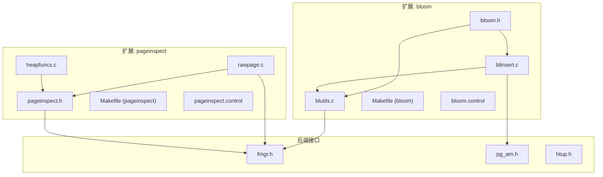
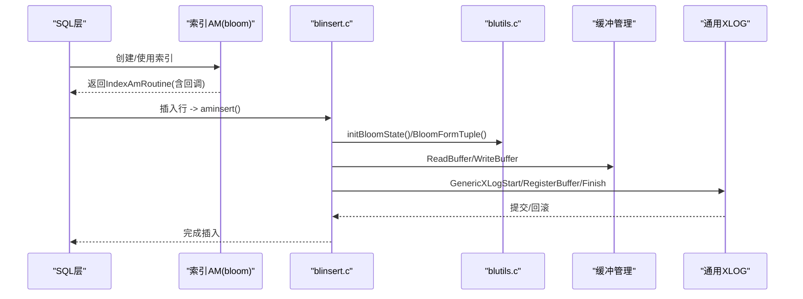
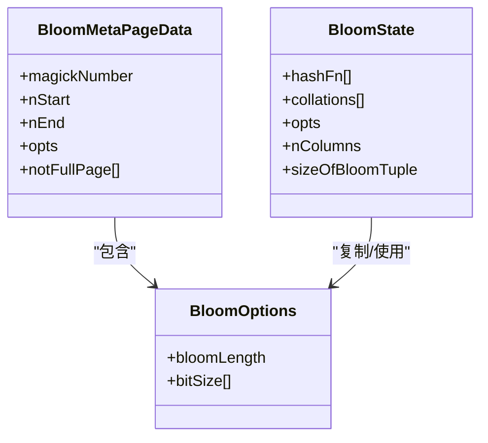
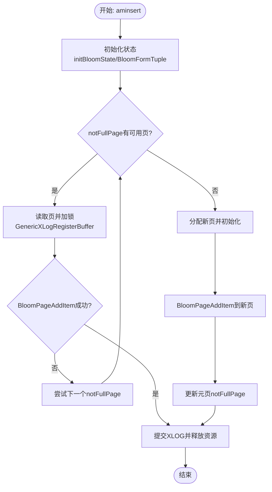
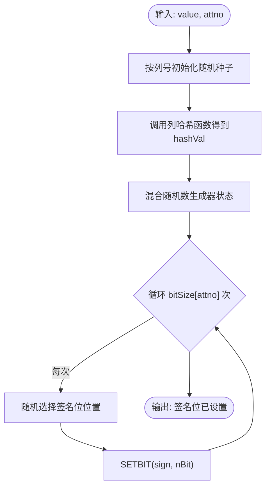
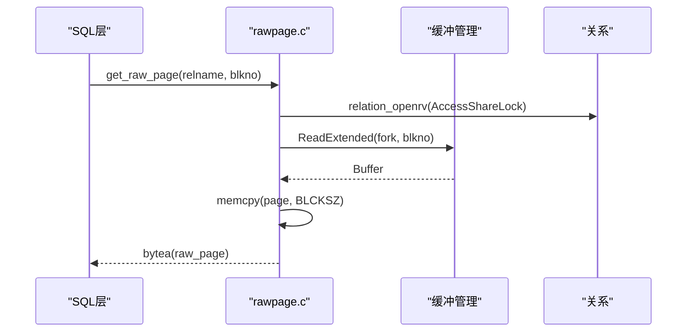
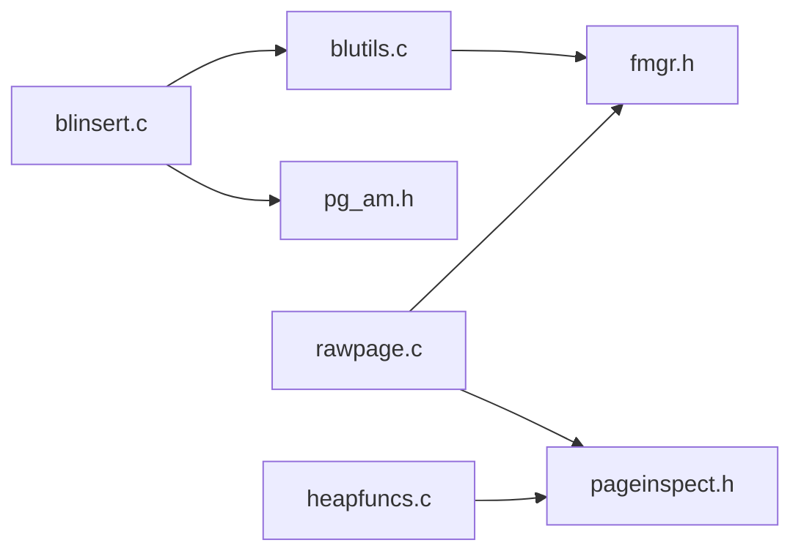

# 扩展开发接口

<cite>
**本文引用的文件**
- [bloom.h](file://contrib/bloom/bloom.h)
- [blinsert.c](file://contrib/bloom/blinsert.c)
- [blutils.c](file://contrib/bloom/blutils.c)
- [Makefile (bloom)](file://contrib/bloom/Makefile)
- [bloom.control](file://contrib/bloom/bloom.control)
- [pageinspect.h](file://contrib/pageinspect/pageinspect.h)
- [rawpage.c](file://contrib/pageinspect/rawpage.c)
- [heapfuncs.c](file://contrib/pageinspect/heapfuncs.c)
- [Makefile (pageinspect)](file://contrib/pageinspect/Makefile)
- [pageinspect.control](file://contrib/pageinspect/pageinspect.control)
- [fmgr.h](file://src/include/fmgr.h)
- [pg_am.h](file://src/include/catalog/pg_am.h)
- [htup.h](file://src/include/access/htup.h)
</cite>

## 目录
1. [简介](#简介)
2. [项目结构](#项目结构)
3. [核心组件](#核心组件)
4. [架构总览](#架构总览)
5. [详细组件分析](#详细组件分析)
6. [依赖关系分析](#依赖关系分析)
7. [性能考量](#性能考量)
8. [故障排查指南](#故障排查指南)
9. [结论](#结论)
10. [附录](#附录)

## 简介
本文件面向PostgreSQL扩展开发者，系统性阐述如何基于仓库中的实际扩展（bloom、pageinspect）实现以下能力：
- 自定义数据类型与访问方法（索引AM）
- 用户定义函数注册与调用约定
- 索引构建、插入、扫描、清理等生命周期回调
- 页面级访问与调试工具
同时提供头文件引用、函数签名规范、内存管理与错误处理的最佳实践，并给出扩展包结构、版本控制与依赖管理要点。

## 项目结构
仓库中两个代表性扩展位于 contrib 目录：
- bloom：基于签名文件的布隆索引访问方法实现
- pageinspect：提供页面级检查与诊断的SQL函数集合

图表来源
- [bloom.h:1-217](file://contrib/bloom/bloom.h#L1-L217)
- [blinsert.c:1-367](file://contrib/bloom/blinsert.c#L1-L367)
- [blutils.c:1-446](file://contrib/bloom/blutils.c#L1-L446)
- [pageinspect.h:1-31](file://contrib/pageinspect/pageinspect.h#L1-L31)
- [rawpage.c:1-335](file://contrib/pageinspect/rawpage.c#L1-L335)
- [heapfuncs.c:1-200](file://contrib/pageinspect/heapfuncs.c#L1-L200)
- [fmgr.h:1-778](file://src/include/fmgr.h#L1-L778)
- [pg_am.h:1-66](file://src/include/catalog/pg_am.h#L1-L66)
- [htup.h:1-90](file://src/include/access/htup.h#L1-L90)

章节来源
- [bloom.h:1-217](file://contrib/bloom/bloom.h#L1-L217)
- [blinsert.c:1-367](file://contrib/bloom/blinsert.c#L1-L367)
- [blutils.c:1-446](file://contrib/bloom/blutils.c#L1-L446)
- [pageinspect.h:1-31](file://contrib/pageinspect/pageinspect.h#L1-L31)
- [rawpage.c:1-335](file://contrib/pageinspect/rawpage.c#L1-L335)
- [heapfuncs.c:1-200](file://contrib/pageinspect/heapfuncs.c#L1-L200)
- [fmgr.h:1-778](file://src/include/fmgr.h#L1-L778)
- [pg_am.h:1-66](file://src/include/catalog/pg_am.h#L1-L66)
- [htup.h:1-90](file://src/include/access/htup.h#L1-L90)

## 核心组件
- 索引访问方法（Index Access Method, AM）
  - 通过处理器函数返回 IndexAmRoutine 结构体，声明策略数、支持函数数、回调函数等
  - Bloom 示例在 blutils.c 中实现 blhandler，填充 ambuild、ambuildempty、aminsert、amgetbitmap、amendscan、amcostestimate、amoptions、amvalidate 等回调
- 元数据与页格式
  - Bloom 使用专用页尾结构（BloomPageOpaqueData）、元页（BloomMetaPageData）和自定义页ID（BLOOM_PAGE_ID）
  - 元页保存选项（BloomOptions）与空闲页列表
- 元组与签名
  - BloomTuple 包含堆指针与变长签名数组；signValue 将列值映射到签名位
- 函数管理器（fmgr）
  - 所有可被SQL调用的C函数必须遵循 PG_FUNCTION_ARGS 签名，并使用 PG_FUNCTION_INFO_V1 宏导出信息
  - 模块需包含 PG_MODULE_MAGIC 以进行兼容性校验
- 页面检查（pageinspect）
  - 提供 get_raw_page、page_header、page_checksum 等函数，用于获取原始页、解析页头、计算校验和
  - 内部通过 get_page_from_raw 将 bytea 转为对齐的 Page 以便安全访问

章节来源
- [blutils.c:69-119](file://contrib/bloom/blutils.c#L69-L119)
- [bloom.h:33-164](file://contrib/bloom/bloom.h#L33-L164)
- [blutils.c:223-275](file://contrib/bloom/blutils.c#L223-L275)
- [fmgr.h:175-492](file://src/include/fmgr.h#L175-L492)
- [rawpage.c:141-225](file://contrib/pageinspect/rawpage.c#L141-L225)

## 架构总览
下图展示 bloom 扩展从SQL到索引回调的关键调用链，以及 pageinspect 对底层页面的访问路径。

图表来源
- [blutils.c:69-119](file://contrib/bloom/blutils.c#L69-L119)
- [blinsert.c:196-367](file://contrib/bloom/blinsert.c#L196-L367)
- [blutils.c:124-172](file://contrib/bloom/blutils.c#L124-L172)

章节来源
- [blutils.c:69-119](file://contrib/bloom/blutils.c#L69-L119)
- [blinsert.c:196-367](file://contrib/bloom/blinsert.c#L196-L367)

## 详细组件分析

### Bloom 索引访问方法（IndexAM）
- 处理器函数 blhandler
  - 设置 amstrategies、amsupport、amoptsprocnum
  - 绑定 ambuild、ambuildempty、aminsert、ambulkdelete、amvacuumcleanup、amcostestimate、amoptions、amvalidate、ambeginscan、amrescan、amgetbitmap、amendscan 等回调
- 元数据与选项
  - BloomMetaPageData 保存魔数、选项、空闲页范围
  - BloomOptions 保存签名长度与每列位数
- 状态初始化
  - initBloomState 根据索引属性加载哈希函数、排序规则与选项，预计算 BloomTuple 大小

图表来源
- [bloom.h:101-164](file://contrib/bloom/bloom.h#L101-L164)
- [blutils.c:124-172](file://contrib/bloom/blutils.c#L124-L172)

章节来源
- [blutils.c:69-119](file://contrib/bloom/blutils.c#L69-L119)
- [bloom.h:101-164](file://contrib/bloom/bloom.h#L101-L164)

### Bloom 插入流程
- 入口 blinsert
  - 构造 BloomState 与 BloomTuple
  - 优先尝试 notFullPage 中的已有页，失败则遍历或分配新页
  - 使用 GenericXLog 记录修改，确保一致性
- 页内添加
  - BloomPageAddItem 检查剩余空间，追加元组并更新 pd_lower/maxoff

图表来源
- [blinsert.c:196-367](file://contrib/bloom/blinsert.c#L196-L367)
- [blutils.c:281-309](file://contrib/bloom/blutils.c#L281-L309)

章节来源
- [blinsert.c:196-367](file://contrib/bloom/blinsert.c#L196-L367)
- [blutils.c:281-309](file://contrib/bloom/blutils.c#L281-L309)

### Bloom 签名与元组生成
- signValue
  - 为每列选择哈希函数，结合列号与随机种子生成多个位位置并置位
- BloomFormTuple
  - 分配 BloomTuple，依次对各列非空值生成签名

图表来源
- [blutils.c:223-275](file://contrib/bloom/blutils.c#L223-L275)

章节来源
- [blutils.c:223-275](file://contrib/bloom/blutils.c#L223-L275)

### 页面检查（pageinspect）
- get_raw_page / get_raw_page_fork
  - 打开关系，校验块号范围，读取指定分叉的页，拷贝为 bytea 返回
- page_header
  - 解析原始页头字段，返回复合类型结果（LSN、校验和、标志、上下界、特殊区、页大小、布局版本、裁剪事务ID）
- page_checksum
  - 计算原始页的校验和，兼容旧版本参数类型

图表来源
- [rawpage.c:141-190](file://contrib/pageinspect/rawpage.c#L141-L190)

章节来源
- [rawpage.c:43-115](file://contrib/pageinspect/rawpage.c#L43-L115)
- [rawpage.c:234-289](file://contrib/pageinspect/rawpage.c#L234-L289)
- [rawpage.c:297-334](file://contrib/pageinspect/rawpage.c#L297-L334)

### 用户定义函数（UDF）注册与调用约定
- 函数签名
  - 所有可被SQL调用的C函数必须采用 Datum function(PG_FUNCTION_ARGS) 形式
  - 使用 PG_FUNCTION_INFO_V1(funcname) 导出函数信息
- 参数与返回值
  - 使用 PG_GETARG_xxx 系列宏获取参数，PG_RETURN_xxx 系列宏返回结果
  - 对于可变长度类型，使用 PG_DETOAST_DATUM_* 系列宏安全解压缩
- 模块魔法
  - 每个动态加载模块需包含 PG_MODULE_MAGIC 以进行版本兼容性检查

章节来源
- [fmgr.h:175-492](file://src/include/fmgr.h#L175-L492)
- [blinsert.c:27-27](file://contrib/bloom/blinsert.c#L27-L27)
- [rawpage.c:32-32](file://contrib/pageinspect/rawpage.c#L32-L32)

### 索引访问方法（IndexAM）定义
- pg_am 系统目录
  - 存储访问方法名称、处理器函数、类型（索引/表）
- 扩展通过处理器函数返回 IndexAmRoutine 描述其能力与回调

章节来源
- [pg_am.h:29-63](file://src/include/catalog/pg_am.h#L29-L63)
- [blutils.c:69-119](file://contrib/bloom/blutils.c#L69-L119)

### 堆元组与最小元组
- HeapTupleData
  - 指向堆元组的内存结构，支持多种表示方式（缓冲区直接指针、palloc组合、最小元组）
- 常用访问
  - 通过 HeapTupleHeaderGetDatum 等转换与访问

章节来源
- [htup.h:30-89](file://src/include/access/htup.h#L30-L89)

## 依赖关系分析
- 模块间耦合
  - bloom 的 blinsert.c 依赖 blutils.c 提供的状态初始化、元组构建、页操作
  - pageinspect 的 rawpage.c 与 heapfuncs.c 共享 pageinspect.h 的版本枚举与辅助函数
- 外部依赖
  - fmgr.h：函数管理器与调用约定
  - pg_am.h：访问方法系统目录定义
  - htup.h：堆元组结构

图表来源
- [blinsert.c:1-367](file://contrib/bloom/blinsert.c#L1-L367)
- [blutils.c:1-446](file://contrib/bloom/blutils.c#L1-L446)
- [rawpage.c:1-335](file://contrib/pageinspect/rawpage.c#L1-L335)
- [heapfuncs.c:1-200](file://contrib/pageinspect/heapfuncs.c#L1-L200)
- [fmgr.h:1-778](file://src/include/fmgr.h#L1-L778)
- [pg_am.h:1-66](file://src/include/catalog/pg_am.h#L1-L66)

章节来源
- [blinsert.c:1-367](file://contrib/bloom/blinsert.c#L1-L367)
- [blutils.c:1-446](file://contrib/bloom/blutils.c#L1-L446)
- [rawpage.c:1-335](file://contrib/pageinspect/rawpage.c#L1-L335)
- [heapfuncs.c:1-200](file://contrib/pageinspect/heapfuncs.c#L1-L200)
- [fmgr.h:1-778](file://src/include/fmgr.h#L1-L778)
- [pg_am.h:1-66](file://src/include/catalog/pg_am.h#L1-L66)

## 性能考量
- Bloom 索引
  - 签名长度与每列位数影响误判率与存储空间；默认值在 blutils.c 中设定
  - 插入时优先复用 notFullPage 中的页，减少元页写入与锁竞争
  - 使用 GenericXLog 批量记录页变更，降低WAL开销
- pageinspect
  - 仅读取共享缓冲区的页副本，避免破坏性访问；注意页对齐与校验
  - 大页或高频调用时应关注内存上下文与临时对象释放

[本节为通用指导，不直接分析具体文件]

## 故障排查指南
- 常见错误与定位
  - 无效块号：pageinspect 的 get_raw_page_internal 会校验块号范围并报错
  - 非法页大小：get_page_from_raw 校验 bytea 长度是否为 BLCKSZ
  - 非Bloom索引：initBloomState 检查魔数与元页标志
- 调试技巧
  - 使用 page_header 查看页头字段（LSN、校验和、pd_lower/pd_upper、特殊区等）
  - 使用 page_checksum 验证页完整性
  - 在插入路径中观察 GenericXLog 的提交/回滚分支，确认日志是否一致

章节来源
- [rawpage.c:141-190](file://contrib/pageinspect/rawpage.c#L141-L190)
- [rawpage.c:205-225](file://contrib/pageinspect/rawpage.c#L205-L225)
- [rawpage.c:234-289](file://contrib/pageinspect/rawpage.c#L234-L289)
- [blutils.c:124-172](file://contrib/bloom/blutils.c#L124-L172)

## 结论
- 通过 bloom 扩展可以学习如何实现完整的索引访问方法：元数据、页格式、插入、扫描、清理、成本估算与选项解析
- 通过 pageinspect 扩展可以掌握页面级诊断能力：获取原始页、解析页头、计算校验和、安全访问页结构
- 统一遵循 fmgr 调用约定与 PG_MODULE_MAGIC，确保函数注册与模块兼容性
- 建议在生产环境中结合 WAL/GenericXLog 与缓冲管理API，保证一致性与性能

[本节为总结，不直接分析具体文件]

## 附录

### 扩展包结构与版本控制
- 包结构
  - Makefile：定义 MODULE_big、OBJS、EXTENSION、DATA、REGRESS 等
  - .control：声明 comment、default_version、module_pathname、relocatable
  - SQL 脚本：定义扩展对象与升级迁移
- 版本控制
  - pageinspect 提供多版本迁移脚本（如 1.8→1.9），并在 C 代码中通过枚举区分行为差异
  - bloom 当前默认版本 1.0，可通过 control 文件配置

章节来源
- [Makefile (bloom):1-31](file://contrib/bloom/Makefile#L1-L31)
- [bloom.control:1-6](file://contrib/bloom/bloom.control#L1-L6)
- [Makefile (pageinspect):1-33](file://contrib/pageinspect/Makefile#L1-L33)
- [pageinspect.control:1-6](file://contrib/pageinspect/pageinspect.control#L1-L6)
- [pageinspect.h:18-25](file://contrib/pageinspect/pageinspect.h#L18-L25)

### 开发最佳实践清单
- 头文件引用
  - 索引AM：access/amapi.h、catalog/index.h、storage/bufmgr.h、access/generic_xlog.h
  - 函数管理器：fmgr.h
  - 页面访问：storage/bufpage.h、storage/checksum.h
- 函数签名规范
  - 使用 PG_FUNCTION_ARGS，配合 PG_FUNCTION_INFO_V1
  - 参数获取使用 PG_GETARG_xxx，返回使用 PG_RETURN_xxx
- 内存管理
  - 使用 MemoryContext 管理临时对象，及时释放
  - 对 detoast 的 varlena 使用 PG_FREE_IF_COPY 清理
- 错误处理
  - 使用 ereport/elog 报告错误，携带 errcode、errmsg、errdetail
  - 对边界条件（块号、页大小、魔数）进行严格校验

[本节为通用指导，不直接分析具体文件]