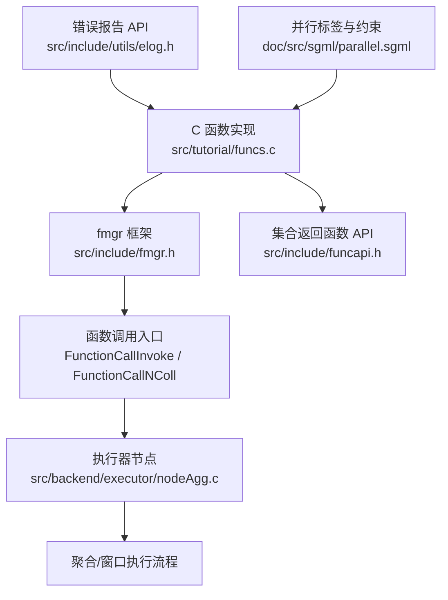
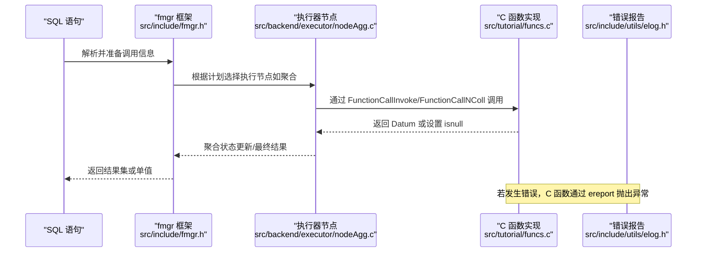
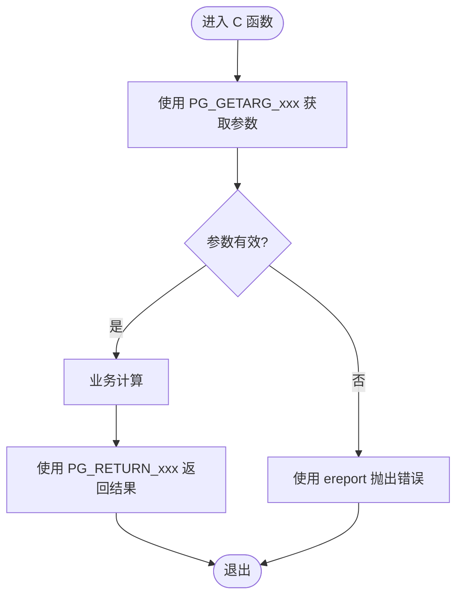
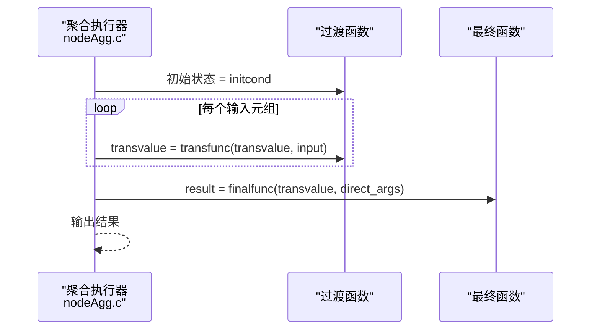
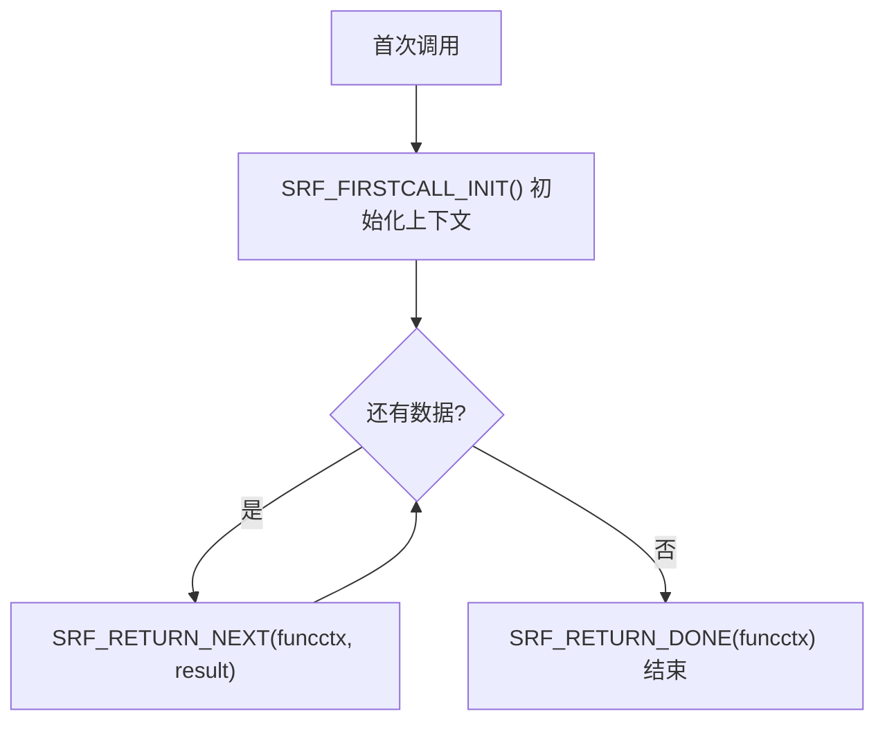
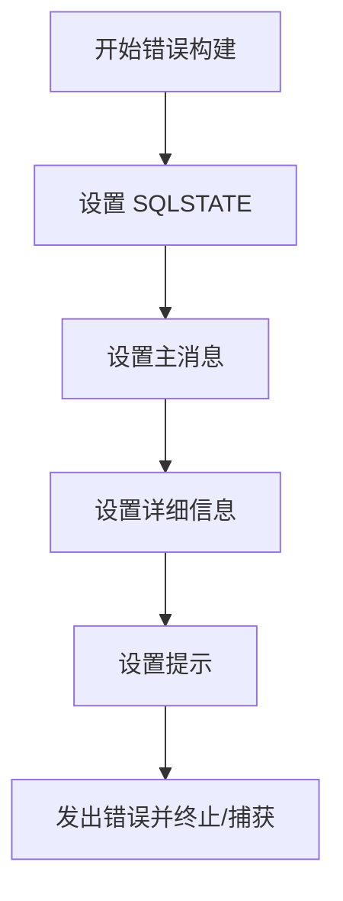
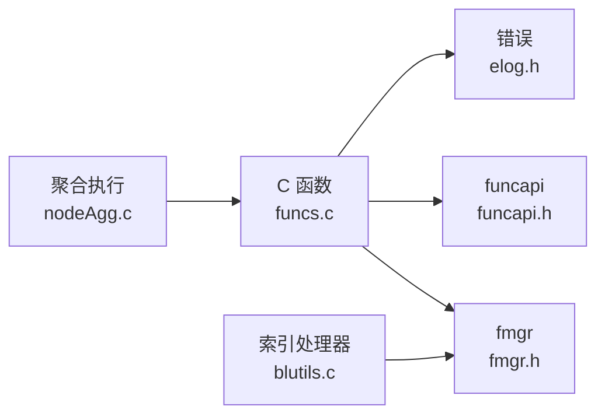

# 用户定义函数

<cite>
**本文引用的文件**
- [fmgr.h](file://src/include/fmgr.h)
- [funcapi.h](file://src/include/funcapi.h)
- [nodeAgg.c](file://src/backend/executor/nodeAgg.c)
- [xaggr.sgml](file://doc/src/sgml/xaggr.sgml)
- [xfunc.sgml](file://doc/src/sgml/xfunc.sgml)
- [parallel.sgml](file://doc/src/sgml/parallel.sgml)
- [create_function.sgml](file://doc/src/sgml/ref/create_function.sgml)
- [elog.c](file://src/backend/utils/error/elog.c)
- [elog.h](file://src/include/utils/elog.h)
- [funcs.c](file://src/tutorial/funcs.c)
- [blutils.c](file://contrib/bloom/blutils.c)
</cite>

## 目录
1. [简介](#简介)
2. [项目结构](#项目结构)
3. [核心组件](#核心组件)
4. [架构总览](#架构总览)
5. [详细组件分析](#详细组件分析)
6. [依赖关系分析](#依赖关系分析)
7. [性能考虑](#性能考虑)
8. [故障排查指南](#故障排查指南)
9. [结论](#结论)
10. [附录](#附录)

## 简介
本文件面向希望在 PostgreSQL 中开发 C 语言用户定义函数的开发者，系统讲解如何编写并注册函数到系统中。内容覆盖：
- 函数签名规范与调用约定（fmgr 框架）
- 参数传递机制、返回值处理与 NULL 语义
- 聚合函数、窗口函数（在仓库中被裁剪）、表值函数（SRF）的开发要点
- 并行执行支持与函数标记
- 错误处理与调试技巧
- 复杂数据类型转换与内存管理

## 项目结构
围绕用户定义函数开发，仓库中与 fmgr 框架、函数 API、执行器聚合实现、文档说明及示例代码相关的关键位置如下：
- 接口与宏定义：src/include/fmgr.h、src/include/funcapi.h
- 聚合执行与上下文：src/backend/executor/nodeAgg.c
- 官方文档：doc/src/sgml/xaggr.sgml、doc/src/sgml/xfunc.sgml、doc/src/sgml/parallel.sgml、doc/src/sgml/ref/create_function.sgml
- 示例与工具：src/tutorial/funcs.c、contrib/bloom/blutils.c
- 错误与日志：src/backend/utils/error/elog.c、src/include/utils/elog.h

图表来源
- [fmgr.h:150-173](file://src/include/fmgr.h#L150-L173)
- [nodeAgg.c:6-31](file://src/backend/executor/nodeAgg.c#L6-L31)
- [funcapi.h:234-324](file://src/include/funcapi.h#L234-L324)
- [elog.h:93-158](file://src/include/utils/elog.h#L93-L158)

章节来源
- [fmgr.h:150-173](file://src/include/fmgr.h#L150-L173)
- [funcapi.h:234-324](file://src/include/funcapi.h#L234-L324)
- [nodeAgg.c:6-31](file://src/backend/executor/nodeAgg.c#L6-L31)

## 核心组件
- fmgr 框架与调用约定
  - 所有可被 fmgr 调用的 C 函数必须遵循统一签名：Datum function_name(PG_FUNCTION_ARGS)，并通过 PG_GETARG_xxx 获取参数、PG_RETURN_xxx 返回结果。
  - 使用 PG_FUNCTION_INFO_V1(funcname) 声明版本化函数信息；动态加载模块需包含 PG_MODULE_MAGIC。
  - 通过 FmgrInfo 缓存函数查找信息，避免重复解析；通过 FunctionCallInfoBaseData 传递调用上下文与参数数组。
- 集合返回函数（SRF）
  - 使用 FuncCallContext 和 SRF_* 宏管理多行返回的生命周期与内存上下文。
  - 支持复合类型返回，提供 AttInMetadata 与 BuildTupleFromCStrings 等便捷工具。
- 聚合执行
  - 聚合由执行器 nodeAgg.c 驱动，维护状态值、过渡函数、最终函数以及部分聚合/合并逻辑。
  - 提供 AggCheckCallContext 等 API 用于识别聚合上下文与临时内存上下文。
- 错误与日志
  - 使用 ereport/errmsg/errdetail 等构建结构化错误消息，支持 SQLSTATE、上下文、提示等。
- 并行执行
  - 函数/聚合需显式标注 PARALLEL SAFE/RESTRICTED/UNSAFE；未标注默认视为 UNSAFE。
  - 对内部状态、全局变量、外部资源访问需谨慎，确保在并行模式下安全。

章节来源
- [fmgr.h:175-424](file://src/include/fmgr.h#L175-L424)
- [funcapi.h:234-324](file://src/include/funcapi.h#L234-L324)
- [nodeAgg.c:6-100](file://src/backend/executor/nodeAgg.c#L6-L100)
- [elog.h:93-158](file://src/include/utils/elog.h#L93-L158)
- [parallel.sgml:526-569](file://doc/src/sgml/parallel.sgml#L526-L569)

## 架构总览
下图展示从 SQL 调用到 C 函数执行的完整路径，包括 fmgr 层、执行器聚合节点、SRF 返回流程与错误处理。

图表来源
- [fmgr.h:150-173](file://src/include/fmgr.h#L150-L173)
- [nodeAgg.c:6-31](file://src/backend/executor/nodeAgg.c#L6-L31)
- [elog.h:93-158](file://src/include/utils/elog.h#L93-L158)

## 详细组件分析

### fmgr 框架与函数调用约定
- 函数签名与宏
  - 使用 PG_FUNCTION_ARGS 作为参数列表，通过 PG_GETARG_xxx 系列宏读取参数，通过 PG_RETURN_xxx 返回结果。
  - 对于可变长度类型（varlena），使用 PG_DETOAST_DATUM/PACKED/COPY 等宏进行解压缩与拷贝。
- 调用方式
  - 直接调用：DirectFunctionCallNColl/FnctionCallNColl/OidFunctionCallNColl。
  - 通过 FmgrInfo 缓存后多次调用，减少开销。
- 模块与版本
  - 动态加载模块需包含 PG_MODULE_MAGIC；函数需使用 PG_FUNCTION_INFO_V1 声明版本信息。

图表来源
- [fmgr.h:175-376](file://src/include/fmgr.h#L175-L376)
- [elog.h:93-158](file://src/include/utils/elog.h#L93-L158)

章节来源
- [fmgr.h:175-424](file://src/include/fmgr.h#L175-L424)
- [funcs.c:19-127](file://src/tutorial/funcs.c#L19-L127)

### 聚合函数开发
- 执行模型
  - 聚合执行器维护状态值，迭代输入元组调用过渡函数，最后可选调用最终函数生成结果。
  - 支持部分聚合、合并、序列化/反序列化以支持并行与分布式场景。
- 上下文与内存
  - 使用 AggCheckCallContext 判断是否处于聚合上下文，并使用其返回的临时内存上下文存储中间状态。
  - 注意在组边界重置状态，避免内存泄漏。
- 有序集合聚合
  - 文档说明了 WITHIN GROUP 等有序聚合的使用与注意事项。

图表来源
- [nodeAgg.c:6-31](file://src/backend/executor/nodeAgg.c#L6-L31)
- [xaggr.sgml:35-61](file://doc/src/sgml/xaggr.sgml#L35-L61)

章节来源
- [nodeAgg.c:6-100](file://src/backend/executor/nodeAgg.c#L6-L100)
- [xaggr.sgml:35-61](file://doc/src/sgml/xaggr.sgml#L35-L61)

### 表值函数（SRF）开发
- 生命周期管理
  - 首次调用初始化 FuncCallContext，后续每次调用通过 SRF_PERCALL_SETUP 恢复上下文。
  - 使用 SRF_RETURN_NEXT 逐行返回，结束时 SRF_RETURN_DONE 清理。
- 复合类型返回
  - 可使用 TupleDescGetAttInMetadata 与 BuildTupleFromCStrings 快速构造元组。
- 内存上下文
  - multi_call_memory_ctx 用于跨调用复用数据；注意不要在回调中持有非内存资源。

图表来源
- [funcapi.h:234-324](file://src/include/funcapi.h#L234-L324)

章节来源
- [funcapi.h:234-324](file://src/include/funcapi.h#L234-L324)
- [xfunc.sgml:1056-1318](file://doc/src/sgml/xfunc.sgml#L1056-L1318)

### 窗口函数（在本仓库中被裁剪）
- 当前仓库已彻底裁剪窗口函数能力（OVER/WINDOW 子句与内置窗口函数）。
- 若未来恢复，需注意窗口执行节点、表达式求值、优化器路径与解析器的集成点。

章节来源
- [CHANGE.md:934-987](file://mydoc/CHANGE.md#L934-L987)

### 错误处理与调试
- 错误报告
  - 使用 ereport(elevel, ...) 组合 errmsg/errdetail/errhint 等构建结构化错误。
  - 支持 SQLSTATE、上下文、回溯等，便于定位问题。
- 调试技巧
  - 在关键路径插入 elog(LOG/DEBUGn) 输出中间状态。
  - 利用 errbacktrace 辅助堆栈追踪。

图表来源
- [elog.h:93-158](file://src/include/utils/elog.h#L93-L158)
- [elog.c:890-937](file://src/backend/utils/error/elog.c#L890-L937)

章节来源
- [elog.h:93-158](file://src/include/utils/elog.h#L93-L158)
- [elog.c:890-937](file://src/backend/utils/error/elog.c#L890-L937)

### 并行执行支持与函数标记
- 函数/聚合需显式标注并行安全性：
  - PARALLEL SAFE：无副作用、无后端本地状态依赖。
  - PARALLEL RESTRICTED：仅限制某些后端本地状态访问。
  - PARALLEL UNSAFE：默认，可能不安全。
- 规划器依据标记决定是否允许并行执行；错误标记可能导致错误或错误答案。

章节来源
- [parallel.sgml:526-569](file://doc/src/sgml/parallel.sgml#L526-L569)
- [create_function.sgml:439-460](file://doc/src/sgml/ref/create_function.sgml#L439-L460)

## 依赖关系分析
- 模块耦合
  - C 函数实现依赖 fmgr 接口与 funcapi 扩展 API。
  - 聚合函数依赖执行器 nodeAgg.c 提供的上下文与内存管理。
  - 错误处理依赖 elog 子系统。
  - 并行性受规划器与文档约束。
- 外部依赖
  - 动态加载模块需满足 PG_MODULE_MAGIC 与版本兼容检查。
  - 索引访问方法示例（bloom）展示了如何在模块初始化中注册处理器。

图表来源
- [funcs.c:19-127](file://src/tutorial/funcs.c#L19-L127)
- [fmgr.h:150-173](file://src/include/fmgr.h#L150-L173)
- [funcapi.h:234-324](file://src/include/funcapi.h#L234-L324)
- [blutils.c:42-119](file://contrib/bloom/blutils.c#L42-L119)

章节来源
- [funcs.c:19-127](file://src/tutorial/funcs.c#L19-L127)
- [blutils.c:42-119](file://contrib/bloom/blutils.c#L42-L119)

## 性能考虑
- 避免重复查找：复用 FmgrInfo 缓存函数信息，减少解析开销。
- 合理使用 detoast：仅在需要时解压缩 varlena，避免不必要的拷贝。
- 聚合优化：
  - 使用严格（strict）过渡函数与合适的 initcond，减少空值处理成本。
  - 为内部状态类型提供序列化/反序列化函数，支持并行与远程聚合。
- SRF 内存管理：
  - 将跨调用复用的数据放入 multi_call_memory_ctx，避免频繁分配释放。
- 并行标记：
  - 正确标注 PARALLEL 级别，避免不必要的串行降级或运行时错误。

[本节为通用指导，不直接分析具体文件]

## 故障排查指南
- 常见错误
  - 参数为空：在函数内检查 PG_ARGISNULL，必要时返回 NULL 或抛出错误。
  - 内存泄漏：确保 detoast 后的拷贝在使用后释放，或在合适上下文中管理。
  - 并行错误：检查函数标记与实际行为是否一致，避免访问后端本地状态。
- 调试步骤
  - 使用 elog(LOG/DEBUGn) 记录关键变量与流程分支。
  - 使用 errbacktrace 获取调用堆栈，定位异常来源。
  - 针对聚合函数，使用 AggCheckCallContext 确认上下文，并在临时内存上下文中分配中间状态。

章节来源
- [elog.h:93-158](file://src/include/utils/elog.h#L93-L158)
- [elog.c:890-937](file://src/backend/utils/error/elog.c#L890-L937)
- [nodeAgg.c:6-100](file://src/backend/executor/nodeAgg.c#L6-L100)

## 结论
PostgreSQL 的用户定义函数开发围绕 fmgr 框架展开，提供了统一的调用约定、丰富的参数/返回值处理宏、完善的聚合与集合返回函数支持，以及严格的错误与并行性管理机制。开发者应遵循接口规范、合理管理内存、正确标注并行性，并利用执行器与文档提供的最佳实践，构建高性能、可维护的自定义函数。

[本节为总结，不直接分析具体文件]

## 附录
- 参考实现
  - 基础函数示例：src/tutorial/funcs.c
  - 索引处理器示例：contrib/bloom/blutils.c
- 文档参考
  - 聚合函数：doc/src/sgml/xaggr.sgml
  - 表值函数：doc/src/sgml/xfunc.sgml
  - 并行标签：doc/src/sgml/parallel.sgml
  - CREATE FUNCTION 选项：doc/src/sgml/ref/create_function.sgml

[本节为参考资料，不直接分析具体文件]