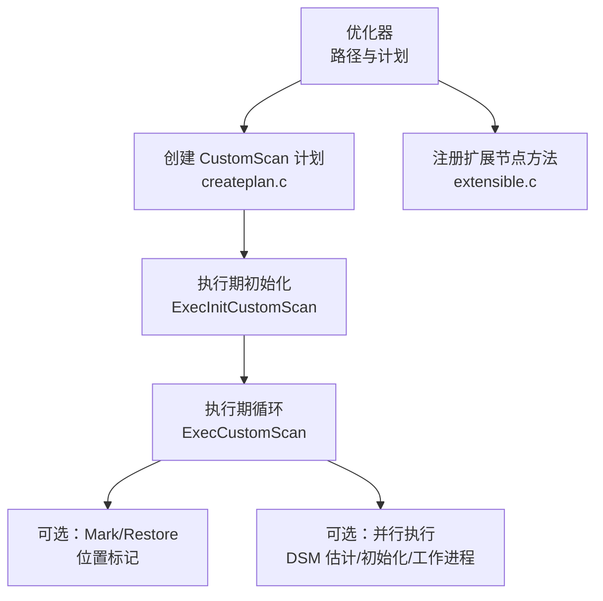
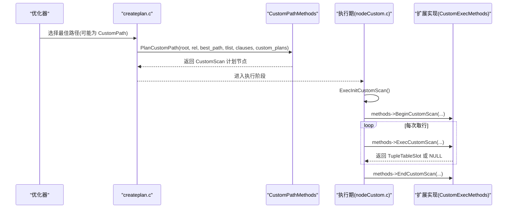
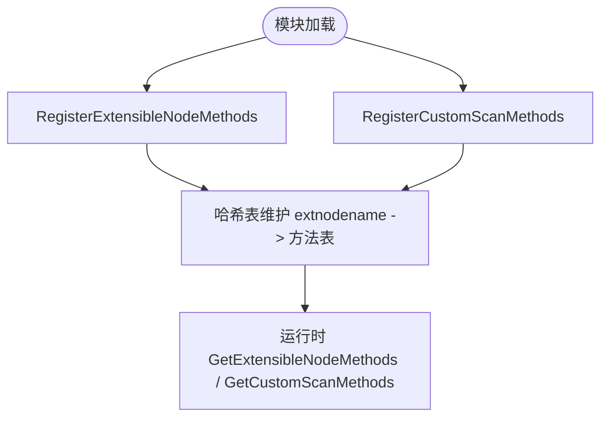
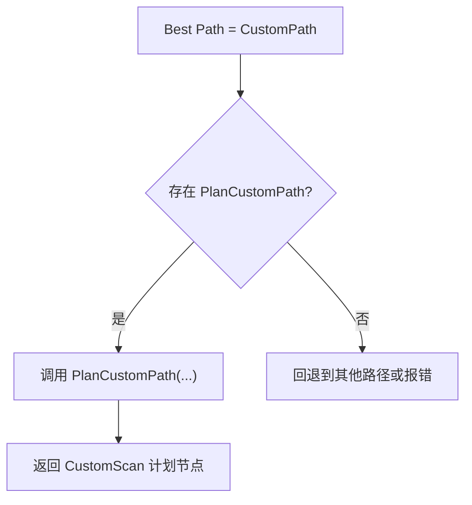
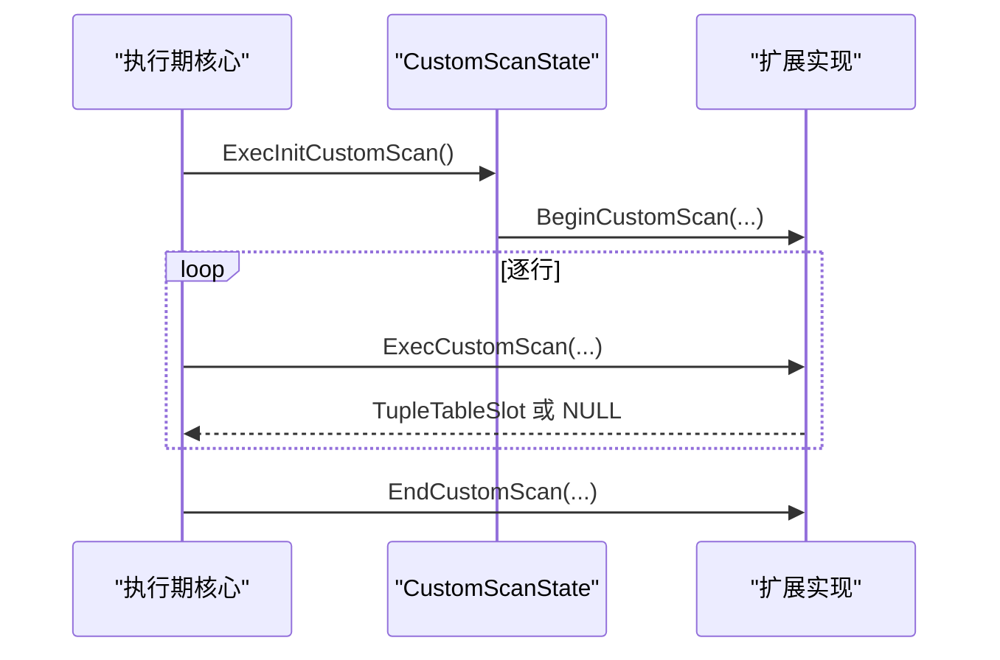
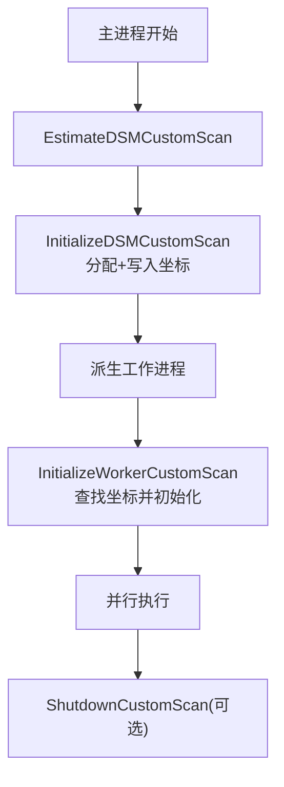
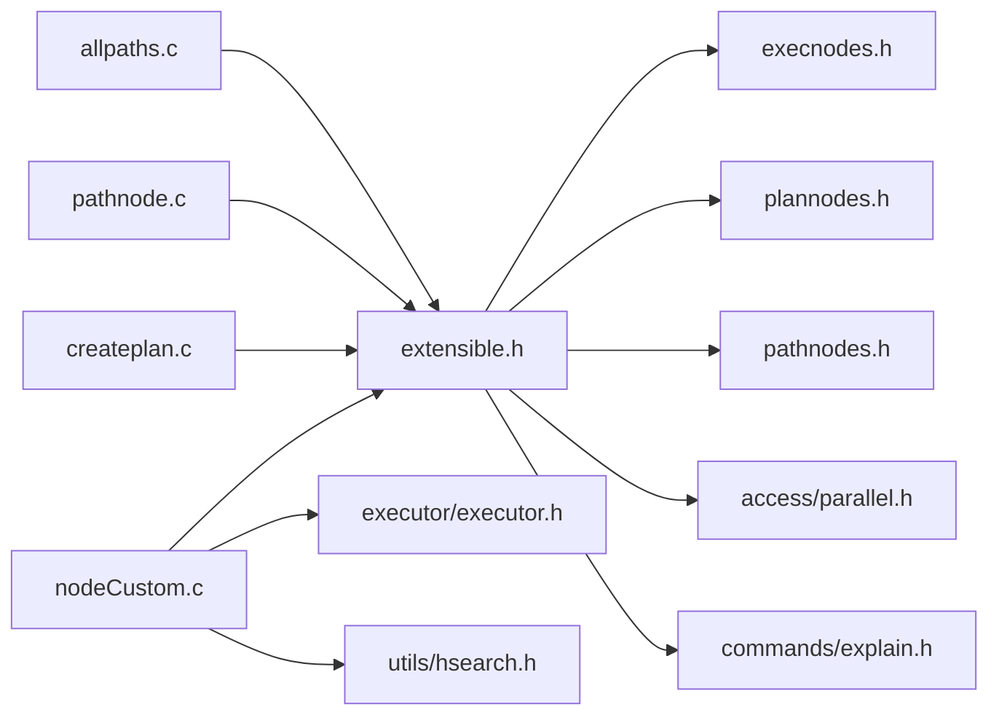

# 自定义扫描器

<cite>
**本文引用的文件**
- [extensible.h](file://src/include/nodes/extensible.h)
- [extensible.c](file://src/backend/nodes/extensible.c)
- [nodeCustom.h](file://src/include/executor/nodeCustom.h)
- [nodeCustom.c](file://src/backend/executor/nodeCustom.c)
- [createplan.c](file://src/backend/optimizer/plan/createplan.c)
- [pathnode.c](file://src/backend/optimizer/util/pathnode.c)
- [allpaths.c](file://src/backend/optimizer/path/allpaths.c)
- [execAmi.c](file://src/backend/executor/execAmi.c)
</cite>

## 目录
1. [简介](#简介)
2. [项目结构](#项目结构)
3. [核心组件](#核心组件)
4. [架构总览](#架构总览)
5. [详细组件分析](#详细组件分析)
6. [依赖关系分析](#依赖关系分析)
7. [性能考虑](#性能考虑)
8. [故障排查指南](#故障排查指南)
9. [结论](#结论)
10. [附录](#附录)

## 简介
本文件面向希望为 PostgreSQL 扩展“外部数据源”的开发者，系统性讲解如何实现 CustomScan 接口，覆盖以下主题：
- 扫描状态管理与元组生成
- 并行执行支持（DSM 共享内存、工作进程初始化）
- EXPLAIN 输出扩展
- 与查询优化器的交互（CustomPath 到 CustomScan Plan 的转换）
- ExtensibleNode 机制与注册流程
- 执行计划集成、优化器路径选择与性能监控要点

## 项目结构
围绕 CustomScan 的关键代码分布在以下模块：
- 节点定义与扩展机制：nodes/extensible.h/.c
- 执行期调度与生命周期：executor/nodeCustom.h/.c
- 优化器路径与计划生成：optimizer/plan/createplan.c、optimizer/util/pathnode.c、optimizer/path/allpaths.c
- 执行期适配入口：executor/execAmi.c

图表来源
- [createplan.c:3488-3519](file://src/backend/optimizer/plan/createplan.c#L3488-L3519)
- [nodeCustom.c:28-105](file://src/backend/executor/nodeCustom.c#L28-L105)
- [nodeCustom.c:107-116](file://src/backend/executor/nodeCustom.c#L107-L116)
- [extensible.c:75-94](file://src/backend/nodes/extensible.c#L75-L94)

章节来源
- [extensible.h:26-75](file://src/include/nodes/extensible.h#L26-L75)
- [extensible.c:75-94](file://src/backend/nodes/extensible.c#L75-L94)
- [nodeCustom.h:21-40](file://src/include/executor/nodeCustom.h#L21-L40)
- [nodeCustom.c:28-105](file://src/backend/executor/nodeCustom.c#L28-L105)
- [createplan.c:3488-3519](file://src/backend/optimizer/plan/createplan.c#L3488-L3519)

## 核心组件
- ExtensibleNode 与 ExtensibleNodeMethods：用于在运行时注册新的节点类型及其序列化/反序列化、拷贝、判等、输出等方法。
- CustomScanMethods：将“自定义扫描”的计划节点与执行期状态构造关联起来。
- CustomExecMethods：定义执行期的回调，包括 Begin/Exec/End/ReScan、可选 Mark/Restore、可选并行相关回调、可选 EXPLAIN 输出。
- 执行期框架 nodeCustom.*：负责分配/初始化 CustomScanState、设置 ExecProcNode、处理 Mark/Restore、并行 DSM 估计与初始化、工作进程初始化与关闭。
- 优化器侧 createplan.c：将 CustomPath 转换为 CustomScan 计划节点，并调用 CustomPathMethods.PlanCustomPath。

章节来源
- [extensible.h:26-75](file://src/include/nodes/extensible.h#L26-L75)
- [extensible.h:88-154](file://src/include/nodes/extensible.h#L88-L154)
- [nodeCustom.c:28-105](file://src/backend/executor/nodeCustom.c#L28-L105)
- [createplan.c:3488-3519](file://src/backend/optimizer/plan/createplan.c#L3488-L3519)

## 架构总览
下图展示了从优化器到执行期的完整链路，以及扩展如何接入：

图表来源
- [createplan.c:3488-3519](file://src/backend/optimizer/plan/createplan.c#L3488-L3519)
- [nodeCustom.c:28-105](file://src/backend/executor/nodeCustom.c#L28-L105)
- [nodeCustom.c:107-116](file://src/backend/executor/nodeCustom.c#L107-L116)

## 详细组件分析

### ExtensibleNode 机制与注册
- 所有扩展节点统一以 T_ExtensibleNode 标识，并通过 extnodename 区分具体类型。
- 通过 RegisterExtensibleNodeMethods 注册 ExtensibleNodeMethods，包含拷贝、判等、输出、读取等回调。
- 通过 RegisterCustomScanMethods 注册 CustomScanMethods，提供 CreateCustomScanState 工厂函数。

图表来源
- [extensible.c:75-94](file://src/backend/nodes/extensible.c#L75-L94)
- [extensible.c:124-143](file://src/backend/nodes/extensible.c#L124-L143)

章节来源
- [extensible.h:26-75](file://src/include/nodes/extensible.h#L26-L75)
- [extensible.c:75-94](file://src/backend/nodes/extensible.c#L75-L94)

### CustomPath 到 CustomScan 计划的转换
- 当优化器选择 CustomPath 时，createplan.c 会调用 CustomPathMethods.PlanCustomPath，由扩展将路径信息转换为 CustomScan 计划节点。
- 若需要子关系重参数化，可扩展实现 ReparameterizeCustomPathByChild。

图表来源
- [createplan.c:3488-3519](file://src/backend/optimizer/plan/createplan.c#L3488-L3519)
- [extensible.h:88-102](file://src/include/nodes/extensible.h#L88-L102)

章节来源
- [createplan.c:3488-3519](file://src/backend/optimizer/plan/createplan.c#L3488-L3519)
- [extensible.h:88-102](file://src/include/nodes/extensible.h#L88-L102)

### 执行期：CustomScan 生命周期与元组生成
- ExecInitCustomScan：分配 CustomScanState（由扩展的 CreateCustomScanState 完成），设置 ExecProcNode，打开扫描关系（如有），准备目标列与投影，最后调用扩展的 BeginCustomScan。
- ExecCustomScan：核心循环中调用扩展的 ExecCustomScan 生成元组；返回 NULL 表示结束。
- ExecEndCustomScan：释放表达式上下文与槽位，调用 EndCustomScan。
- ExecReScanCustomScan：调用 ReScanCustomScan。
- Mark/Restore：若未实现对应回调，将报“不支持”错误。

图表来源
- [nodeCustom.c:28-105](file://src/backend/executor/nodeCustom.c#L28-L105)
- [nodeCustom.c:107-116](file://src/backend/executor/nodeCustom.c#L107-L116)
- [nodeCustom.c:118-137](file://src/backend/executor/nodeCustom.c#L118-L137)

章节来源
- [nodeCustom.c:28-105](file://src/backend/executor/nodeCustom.c#L28-L105)
- [nodeCustom.c:107-116](file://src/backend/executor/nodeCustom.c#L107-L116)
- [nodeCustom.c:118-137](file://src/backend/executor/nodeCustom.c#L118-L137)

### 并行执行支持（DSM）
- EstimateDSMCustomScan：估算共享内存大小，并由核心进行估计登记。
- InitializeDSMCustomScan：分配共享内存区域并写入坐标指针，插入 shm_toc。
- ReInitializeDSMCustomScan：重新初始化共享内存（如重试）。
- InitializeWorkerCustomScan：在工作进程中根据 plan_node_id 查找坐标并初始化。
- ShutdownCustomScan：可选清理。

图表来源
- [nodeCustom.c:161-228](file://src/backend/executor/nodeCustom.c#L161-L228)
- [extensible.h:136-148](file://src/include/nodes/extensible.h#L136-L148)

章节来源
- [nodeCustom.c:161-228](file://src/backend/executor/nodeCustom.c#L161-L228)
- [extensible.h:136-148](file://src/include/nodes/extensible.h#L136-L148)

### EXPLAIN 输出扩展
- 扩展可在 CustomExecMethods.ExplainCustomScan 中输出额外信息，供 EXPLAIN 显示。
- 该回调为可选，仅在需要展示自定义细节时实现。

章节来源
- [extensible.h:150-153](file://src/include/nodes/extensible.h#L150-L153)

### 与优化器的交互要点
- 路径添加：优化器在 allpaths.c 中允许扩展通过 add_path 添加 CustomPath。
- 路径复制/重参数化：pathnode.c 对 CustomPath 进行扁平复制与子关系重参数化，必要时调用扩展的 ReparameterizeCustomPathByChild。
- 执行期适配：execAmi.c 在执行期遇到 CustomPath 时会走相应分支，最终落到 createplan.c 的转换逻辑。

章节来源
- [allpaths.c:471](file://src/backend/optimizer/path/allpaths.c#L471)
- [pathnode.c:3757-3778](file://src/backend/optimizer/util/pathnode.c#L3757-L3778)
- [execAmi.c:413](file://src/backend/executor/execAmi.c#L413)
- [createplan.c:3488-3519](file://src/backend/optimizer/plan/createplan.c#L3488-L3519)

## 依赖关系分析
- 头文件依赖：extensible.h 依赖 execnodes、plannodes、pathnodes、parallel、explain 等，确保节点、路径、并行与解释输出的完整性。
- 运行时依赖：nodeCustom.c 依赖 executor、access/parallel、miscadmin、utils/hsearch 等。
- 优化器依赖：createplan.c、pathnode.c、allpaths.c 共同构成路径选择与计划生成的关键路径。

图表来源
- [extensible.h:17-22](file://src/include/nodes/extensible.h#L17-L22)
- [nodeCustom.c:11-23](file://src/backend/executor/nodeCustom.c#L11-L23)
- [createplan.c:3488-3519](file://src/backend/optimizer/plan/createplan.c#L3488-L3519)
- [pathnode.c:3757-3778](file://src/backend/optimizer/util/pathnode.c#L3757-L3778)
- [allpaths.c:471](file://src/backend/optimizer/path/allpaths.c#L471)

## 性能考虑
- 元组生成效率：ExecCustomScan 应尽量减少每行开销，避免不必要的内存分配与表达式求值。
- 批量处理：尽可能按批获取数据，减少跨层调用次数。
- 并行粒度：合理划分工作单元，使 EstimateDSMCustomScan 估算准确，避免过大或过小的共享内存块。
- 标记/恢复：若需支持 Mark/Restore，注意状态保存/恢复的成本与正确性。
- 统计与可观测性：利用 EXPLAIN 输出关键指标（如数据源类型、过滤条件、并行度），便于定位瓶颈。

[本节为通用指导，不直接分析具体文件]

## 故障排查指南
- “不支持 MarkPos/RestrPos”：若未实现对应回调，执行期会抛出“feature not supported”。请确认是否需要在路径中标记支持能力，并在扩展中实现相应回调。
- 扩展未注册：若 GetExtensibleNodeMethods/GetCustomScanMethods 找不到名称，会报“未注册”错误。请检查模块加载顺序与注册调用时机。
- 并行初始化失败：检查 InitializeDSMCustomScan 是否正确分配并写入坐标，InitializeWorkerCustomScan 是否能通过 plan_node_id 查找到坐标。
- 计划生成异常：确认 CustomPathMethods.PlanCustomPath 能正确处理 tlist、clauses 与 custom_plans，并返回有效的 CustomScan 计划。

章节来源
- [nodeCustom.c:139-158](file://src/backend/executor/nodeCustom.c#L139-L158)
- [extensible.c:124-143](file://src/backend/nodes/extensible.c#L124-L143)
- [nodeCustom.c:161-228](file://src/backend/executor/nodeCustom.c#L161-L228)
- [createplan.c:3488-3519](file://src/backend/optimizer/plan/createplan.c#L3488-L3519)

## 结论
实现 CustomScan 的核心在于：
- 通过 ExtensibleNode 机制注册扩展节点与方法表
- 在优化器侧提供 CustomPathMethods.PlanCustomPath，将路径转为 CustomScan 计划
- 在执行期实现 CustomExecMethods 的 Begin/Exec/End/ReScan，按需实现 Mark/Restore、并行与 EXPLAIN 扩展
- 遵循执行期框架的生命周期约定，保证状态管理、元组生成与资源释放的正确性与高效性

## 附录
- 开发步骤建议
  - 设计数据结构：在扩展中定义 CustomScanState 的子结构，首字段为 CustomScanState，以便核心安全访问。
  - 注册方法：在模块初始化时调用 RegisterCustomScanMethods 与必要的 ExtensibleNodeMethods。
  - 实现路径：在优化器路径阶段添加 CustomPath，并实现 PlanCustomPath 生成 CustomScan 计划。
  - 实现执行：实现 Begin/Exec/End/ReScan，必要时实现并行与 EXPLAIN。
  - 测试验证：使用 EXPLAIN 观察计划与输出，验证并行行为与性能表现。

[本节为概念性内容，不直接分析具体文件]