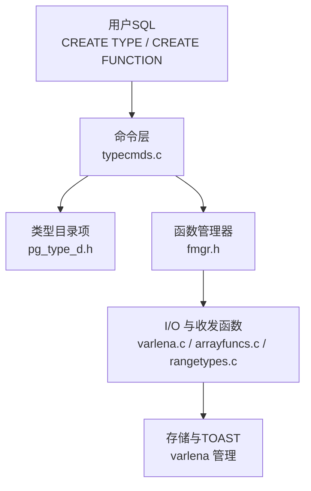
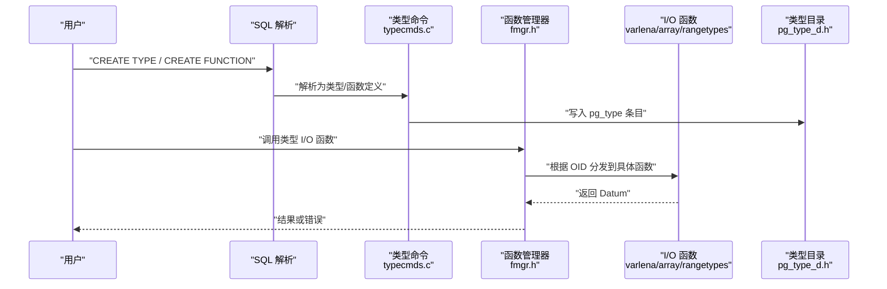
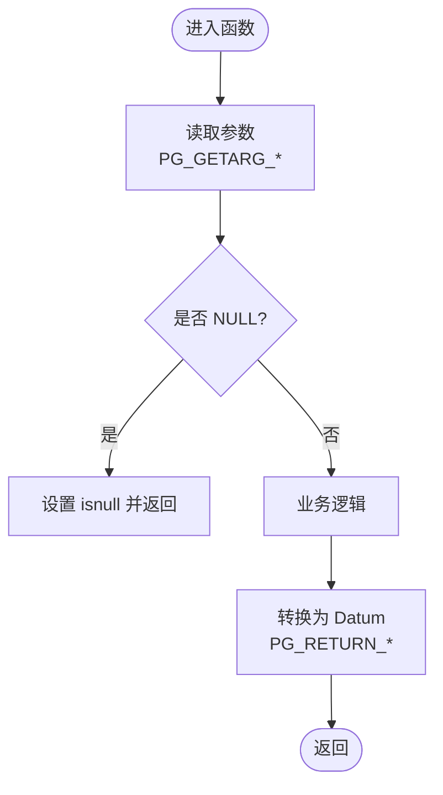
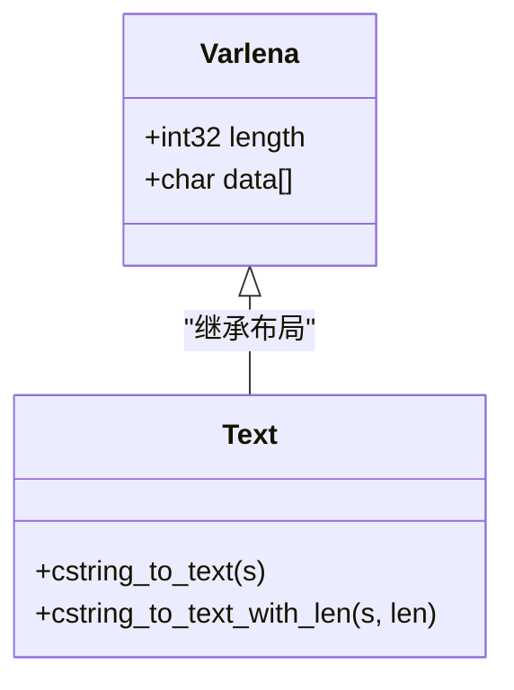
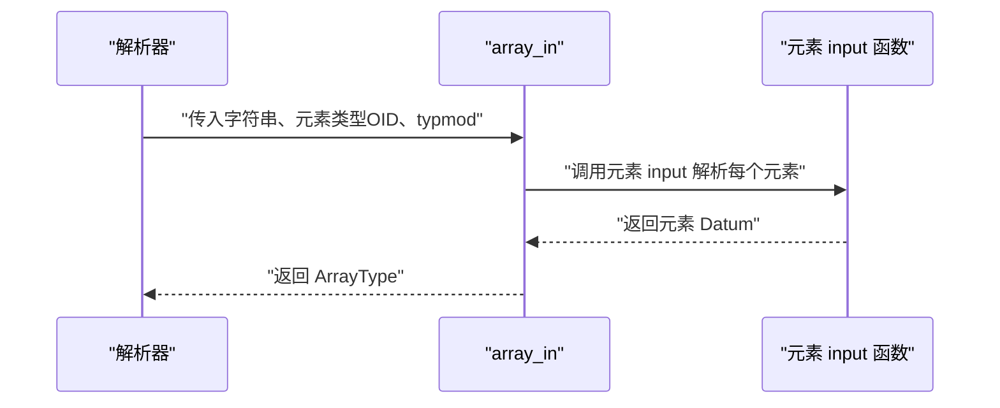
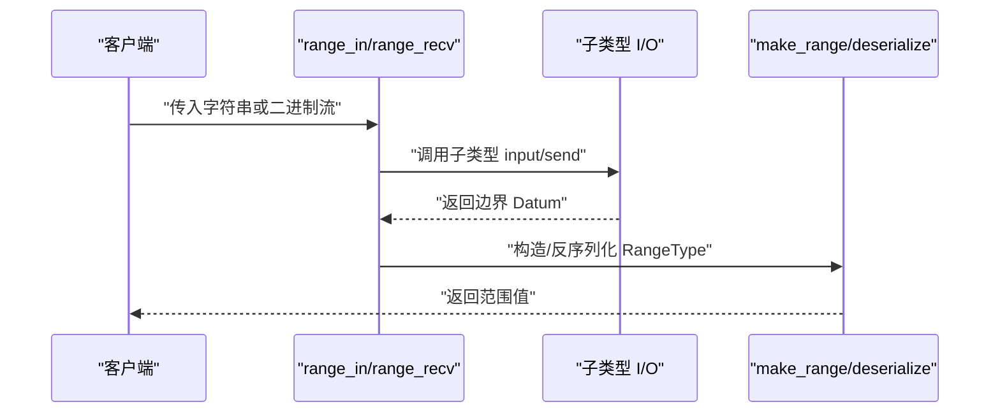
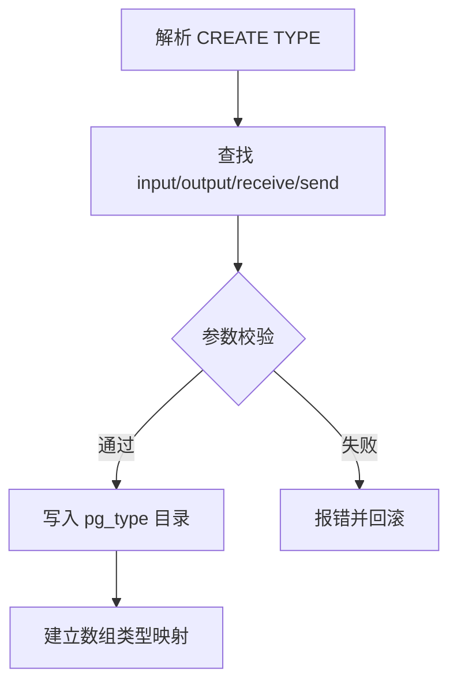
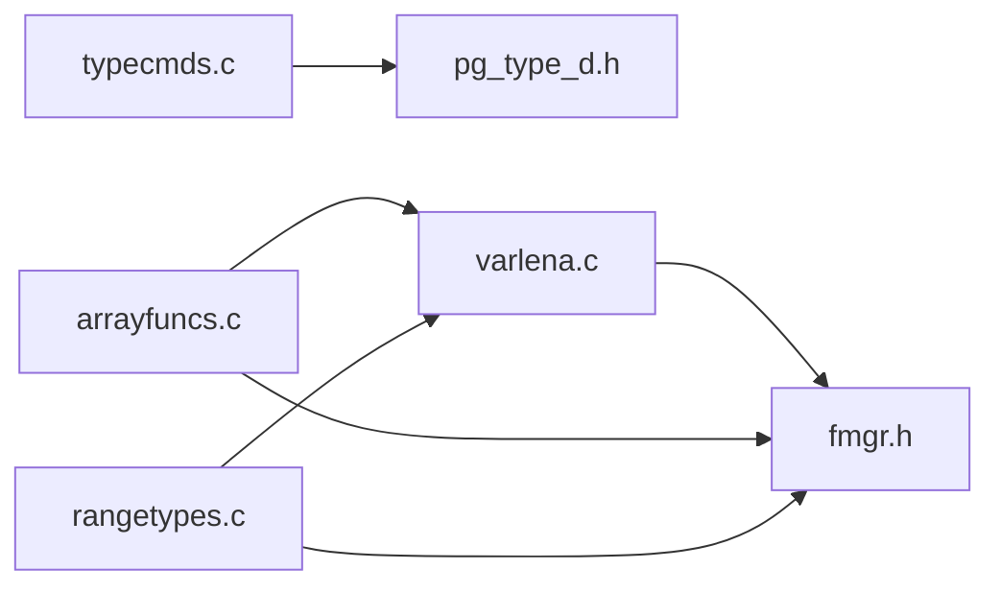

# 自定义数据类型

<cite>
**本文引用的文件**
- [src/include/fmgr.h](file://src/include/ffmgr.h)
- [src/include/catalog/pg_type_d.h](file://src/include/catalog/pg_type_d.h)
- [src/backend/commands/typecmds.c](file://src/backend/commands/typecmds.c)
- [src/backend/utils/adt/varlena.c](file://src/backend/utils/adt/varlena.c)
- [src/backend/utils/adt/arrayfuncs.c](file://src/backend/utils/adt/arrayfuncs.c)
- [src/backend/utils/adt/rangetypes.c](file://src/backend/utils/adt/rangetypes.c)
</cite>

## 目录
1. [简介](#简介)
2. [项目结构](#项目结构)
3. [核心组件](#核心组件)
4. [架构总览](#架构总览)
5. [详细组件分析](#详细组件分析)
6. [依赖关系分析](#依赖关系分析)
7. [性能考虑](#性能考虑)
8. [故障排查指南](#故障排查指南)
9. [结论](#结论)
10. [附录](#附录)

## 简介
本文件面向希望在 PostgreSQL 中开发自定义数据类型的工程师，系统阐述如何定义新类型、实现输入输出与二进制收发函数、设计内部表示、编写比较与排序支持函数，并在系统中注册该类型。文档涵盖 Datum 传递机制、Varlena 可变长度结构的处理、内存管理与序列化/反序列化实践，并提供复合类型、数组类型与范围类型的完整示例路径与流程图示，帮助读者高效完成从设计到落地的全流程。

## 项目结构
围绕自定义类型开发，涉及的关键代码分布在以下位置：
- 函数调用与 I/O 宏接口：src/include/fmgr.h
- 类型元数据与常量：src/include/catalog/pg_type_d.h
- 类型创建命令与注册流程：src/backend/commands/typecmds.c
- 可变长度类型（varlena）工具与文本/字节串处理：src/backend/utils/adt/varlena.c
- 数组类型支持与解析：src/backend/utils/adt/arrayfuncs.c
- 范围类型 I/O 与序列化：src/backend/utils/adt/rangetypes.c

图表来源
- [src/backend/commands/typecmds.c:136-200](file://src/backend/commands/typecmds.c#L136-L200)
- [src/include/catalog/pg_type_d.h:21-95](file://src/include/catalog/pg_type_d.h#L21-L95)
- [src/include/fmgr.h:175-376](file://src/include/fmgr.h#L175-L376)
- [src/backend/utils/adt/varlena.c:181-200](file://src/backend/utils/adt/varlena.c#L181-L200)

章节来源
- [src/backend/commands/typecmds.c:136-200](file://src/backend/commands/typecmds.c#L136-L200)
- [src/include/catalog/pg_type_d.h:21-95](file://src/include/catalog/pg_type_d.h#L21-L95)
- [src/include/fmgr.h:175-376](file://src/include/fmgr.h#L175-L376)
- [src/backend/utils/adt/varlena.c:181-200](file://src/backend/utils/adt/varlena.c#L181-L200)

## 核心组件
- 函数调用约定与宏：通过统一的 PG_FUNCTION_ARGS、PG_GETARG_*、PG_RETURN_* 等宏，屏蔽 Datum 的按值/按引用差异，简化类型 I/O 函数实现。
- 类型元信息：pg_type 表字段定义了类型的长度、对齐、存储策略、输入输出/收发函数 OID、类别、元素类型等，是类型注册的核心。
- 可变长度类型（Varlena）：提供统一的可变长度对象布局与 TOAST 支持，适用于 text、bytea、name、varchar 等类型。
- 数组类型：提供数组解析、构造、切片、迭代等能力，并复用元素类型的 I/O 函数。
- 范围类型：提供范围的序列化布局、边界解析与输出、以及基于子类型的 I/O 委托。

章节来源
- [src/include/fmgr.h:175-376](file://src/include/fmgr.h#L175-L376)
- [src/include/catalog/pg_type_d.h:21-95](file://src/include/catalog/pg_type_d.h#L21-L95)
- [src/backend/utils/adt/varlena.c:181-200](file://src/backend/utils/adt/varlena.c#L181-L200)
- [src/backend/utils/adt/arrayfuncs.c:166-200](file://src/backend/utils/adt/arrayfuncs.c#L166-L200)
- [src/backend/utils/adt/rangetypes.c:6-20](file://src/backend/utils/adt/rangetypes.c#L6-L20)

## 架构总览
下图展示了从 SQL 到 C 函数的调用链，以及类型在目录中的注册过程。

图表来源
- [src/backend/commands/typecmds.c:136-200](file://src/backend/commands/typecmds.c#L136-L200)
- [src/include/fmgr.h:175-376](file://src/include/fmgr.h#L175-L376)
- [src/include/catalog/pg_type_d.h:21-95](file://src/include/catalog/pg_type_d.h#L21-L95)

## 详细组件分析

### 函数调用与 Datum 处理（fmgr）
- 所有可被 fmgr 调用的函数必须遵循统一签名，使用 PG_FUNCTION_ARGS 作为参数列表。
- 获取参数与返回值通过 PG_GETARG_* 与 PG_RETURN_* 宏，自动处理 Datum 的按值/按引用转换。
- 对 varlena 类型，提供 detoast 相关宏以安全访问数据，避免对齐问题与外部压缩/TOAST 影响。
- 支持直接调用与缓存 FmgrInfo 以提升重复调用性能。

图表来源
- [src/include/fmgr.h:175-376](file://src/include/fmgr.h#L175-L376)

章节来源
- [src/include/fmgr.h:175-376](file://src/include/fmgr.h#L175-L376)

### 可变长度类型 Varlena（varlena.c）
- 提供 cstring_to_text 等工具将 C 字符串转为内部 text 对象，确保正确的 VARHDR 布局。
- 支持多种格式与编码，配合 collation 进行排序与比较。
- 与 TOAST 集成，自动处理大对象的压缩与外存存储。

图表来源
- [src/backend/utils/adt/varlena.c:181-200](file://src/backend/utils/adt/varlena.c#L181-L200)

章节来源
- [src/backend/utils/adt/varlena.c:181-200](file://src/backend/utils/adt/varlena.c#L181-L200)

### 数组类型（arrayfuncs.c）
- 提供 array_in 将外部字符串解析为内部数组结构，复用元素类型的 input 函数。
- 支持多维数组、空值位图、切片与迭代器，便于高效遍历与操作。
- 通过 typalign、typlen、typbyval 等属性适配不同元素类型。

图表来源
- [src/backend/utils/adt/arrayfuncs.c:166-200](file://src/backend/utils/adt/arrayfuncs.c#L166-L200)

章节来源
- [src/backend/utils/adt/arrayfuncs.c:166-200](file://src/backend/utils/adt/arrayfuncs.c#L166-L200)

### 范围类型（rangetypes.c）
- 存储格式包含 varlena 头、范围类型 OID、下界/上界（可选）、标志位。
- range_in/range_out 委托子类型的 I/O 函数完成边界的解析与输出。
- range_recv 负责二进制接收，解析标志与边界，并构建 RangeType。

图表来源
- [src/backend/utils/adt/rangetypes.c:6-20](file://src/backend/utils/adt/rangetypes.c#L6-L20)
- [src/backend/utils/adt/rangetypes.c:86-159](file://src/backend/utils/adt/rangetypes.c#L86-L159)
- [src/backend/utils/adt/rangetypes.c:168-200](file://src/backend/utils/adt/rangetypes.c#L168-L200)

章节来源
- [src/backend/utils/adt/rangetypes.c:6-20](file://src/backend/utils/adt/rangetypes.c#L6-L20)
- [src/backend/utils/adt/rangetypes.c:86-159](file://src/backend/utils/adt/rangetypes.c#L86-L159)
- [src/backend/utils/adt/rangetypes.c:168-200](file://src/backend/utils/adt/rangetypes.c#L168-L200)

### 类型注册与命令（typecmds.c）
- DefineType 负责解析 CREATE TYPE 参数，确定输入/输出/收发函数 OID、类别、默认值、对齐与存储策略等。
- 要求先定义函数，再定义类型，最后定义运算符，保证依赖顺序正确。
- 将类型信息写入 pg_type，并建立数组类型与子类型关联。

图表来源
- [src/backend/commands/typecmds.c:136-200](file://src/backend/commands/typecmds.c#L136-L200)

章节来源
- [src/backend/commands/typecmds.c:136-200](file://src/backend/commands/typecmds.c#L136-L200)

### 复合类型（rowtypes）
- 复合类型通常由表行结构派生，其元数据通过 pg_type 描述，字段顺序与对齐由表结构决定。
- 可通过 rowtypes 相关工具进行序列化和访问，但本仓库未展开具体实现细节。

章节来源
- [src/include/catalog/pg_type_d.h:21-95](file://src/include/catalog/pg_type_d.h#L21-L95)

## 依赖关系分析
- typecmds.c 依赖 pg_type_d.h 的类型常量与字段定义，用于写入目录。
- fmgr.h 提供函数调用与 I/O 宏，被 varlena.c、arrayfuncs.c、rangetypes.c 广泛使用。
- varlena.c 提供通用可变长度类型工具，供其他类型复用。
- arrayfuncs.c 与 rangetypes.c 分别实现数组与范围类型的 I/O 与序列化，均依赖 fmgr 与目录查询。

图表来源
- [src/backend/commands/typecmds.c:136-200](file://src/backend/commands/typecmds.c#L136-L200)
- [src/include/catalog/pg_type_d.h:21-95](file://src/include/catalog/pg_type_d.h#L21-L95)
- [src/include/fmgr.h:175-376](file://src/include/fmgr.h#L175-L376)
- [src/backend/utils/adt/varlena.c:181-200](file://src/backend/utils/adt/varlena.c#L181-L200)
- [src/backend/utils/adt/arrayfuncs.c:166-200](file://src/backend/utils/adt/arrayfuncs.c#L166-L200)
- [src/backend/utils/adt/rangetypes.c:86-159](file://src/backend/utils/adt/rangetypes.c#L86-L159)

章节来源
- [src/backend/commands/typecmds.c:136-200](file://src/backend/commands/typecmds.c#L136-L200)
- [src/include/catalog/pg_type_d.h:21-95](file://src/include/catalog/pg_type_d.h#L21-L95)
- [src/include/fmgr.h:175-376](file://src/include/fmgr.h#L175-L376)
- [src/backend/utils/adt/varlena.c:181-200](file://src/backend/utils/adt/varlena.c#L181-L200)
- [src/backend/utils/adt/arrayfuncs.c:166-200](file://src/backend/utils/adt/arrayfuncs.c#L166-L200)
- [src/backend/utils/adt/rangetypes.c:86-159](file://src/backend/utils/adt/rangetypes.c#L86-L159)

## 性能考虑
- 使用 FmgrInfo 缓存函数地址，避免重复查找开销。
- 对 varlena 类型优先使用 packed 访问宏以减少拷贝；仅在需要写时复制。
- 数组与范围类型尽量复用元素类型的 I/O 函数，减少重复解析。
- 合理设置存储策略（plain/extended/main/external），平衡内联与 TOAST 压缩。
- 利用 SortSupport 与 collation 优化排序与比较路径。

[本节为通用指导，不直接分析具体文件]

## 故障排查指南
- 函数签名不匹配：检查是否使用 PG_FUNCTION_ARGS 与 PG_GETARG_*、PG_RETURN_* 宏。
- NULL 处理遗漏：非严格函数需显式检查 PG_ARGISNULL，否则可能导致崩溃。
- 对齐问题：访问 varlena 数据时使用 PG_DETOAST_DATUM 或 packed 版本，避免未对齐指针。
- TOAST 相关错误：确认存储策略与 detoast 调用是否正确，必要时使用 copy/slice 变体。
- 类型注册失败：确保 input/output/receive/send 函数已存在且 OID 正确，依赖顺序符合“先函数后类型”。

章节来源
- [src/include/fmgr.h:175-376](file://src/include/fmgr.h#L175-L376)
- [src/backend/utils/adt/varlena.c:181-200](file://src/backend/utils/adt/varlena.c#L181-L200)
- [src/backend/commands/typecmds.c:136-200](file://src/backend/commands/typecmds.c#L136-L200)

## 结论
通过统一的函数调用约定、完善的 varlena 工具、以及数组与范围类型的成熟实现，PostgreSQL 提供了强大的自定义类型扩展能力。开发者只需遵循规范实现 I/O、比较与序列化逻辑，并通过 typecmds 完成注册，即可无缝融入系统生态。建议在实践中重视内存管理、TOAST 行为与性能优化，确保类型在高负载场景下的稳定性与效率。

[本节为总结性内容，不直接分析具体文件]

## 附录
- 开发步骤清单
  - 定义 C 函数：实现 input/output/receive/send、比较与排序支持。
  - 使用 fmgr 宏：确保参数与返回值处理正确。
  - 设计内部表示：考虑对齐、TOAST 与序列化布局。
  - 注册类型：通过 CREATE TYPE 指定各类函数 OID 与属性。
  - 测试验证：覆盖正常、边界与异常路径，评估性能。

- 参考路径
  - 函数调用与 I/O 宏：[src/include/fmgr.h:175-376](file://src/include/fmgr.h#L175-L376)
  - 类型元数据常量：[src/include/catalog/pg_type_d.h:21-95](file://src/include/catalog/pg_type_d.h#L21-L95)
  - 类型注册命令：[src/backend/commands/typecmds.c:136-200](file://src/backend/commands/typecmds.c#L136-L200)
  - 可变长度类型工具：[src/backend/utils/adt/varlena.c:181-200](file://src/backend/utils/adt/varlena.c#L181-L200)
  - 数组类型实现：[src/backend/utils/adt/arrayfuncs.c:166-200](file://src/backend/utils/adt/arrayfuncs.c#L166-L200)
  - 范围类型实现：[src/backend/utils/adt/rangetypes.c:86-159](file://src/backend/utils/adt/rangetypes.c#L86-L159)

[本节为补充说明，不直接分析具体文件]