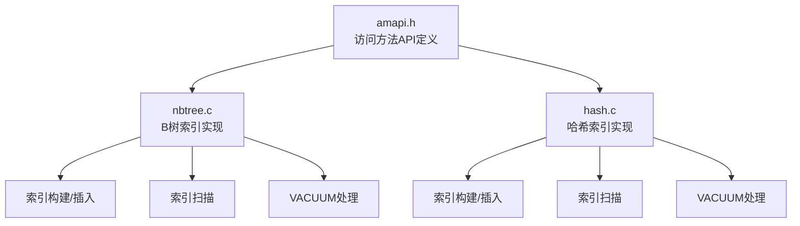
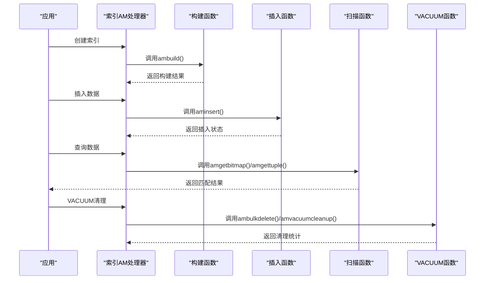
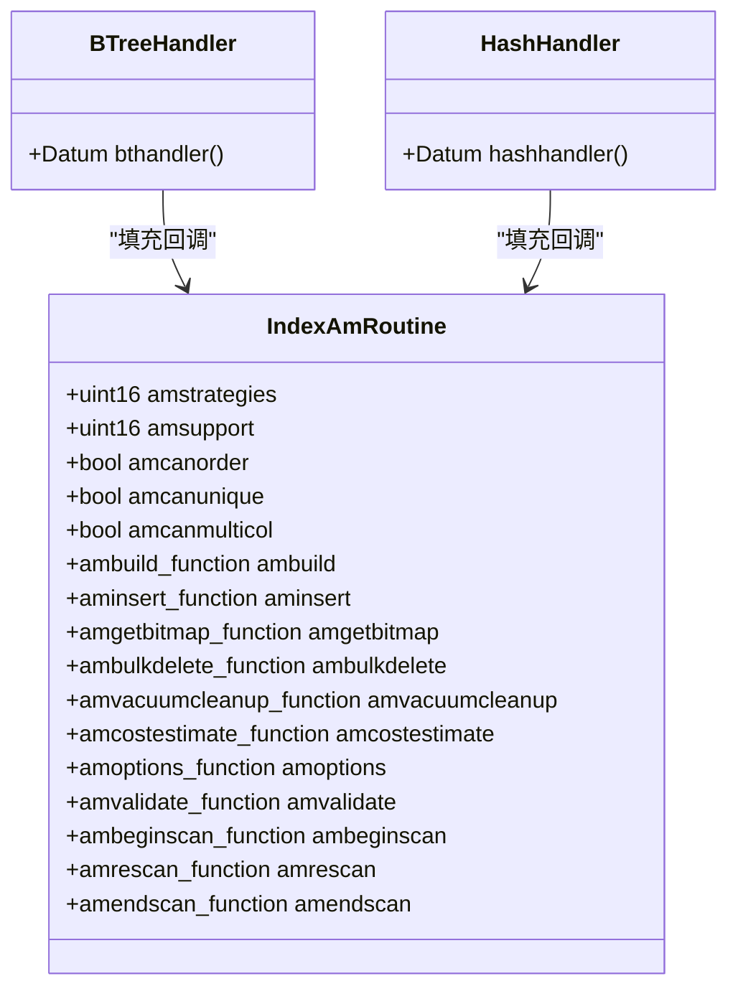
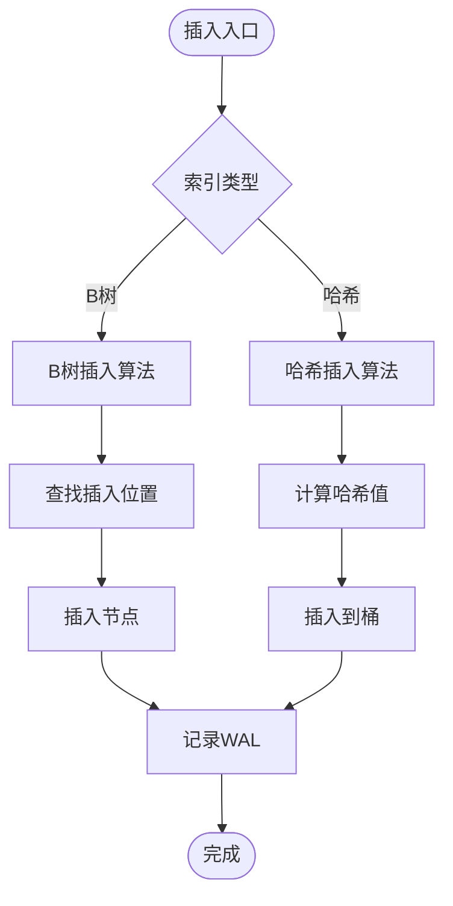
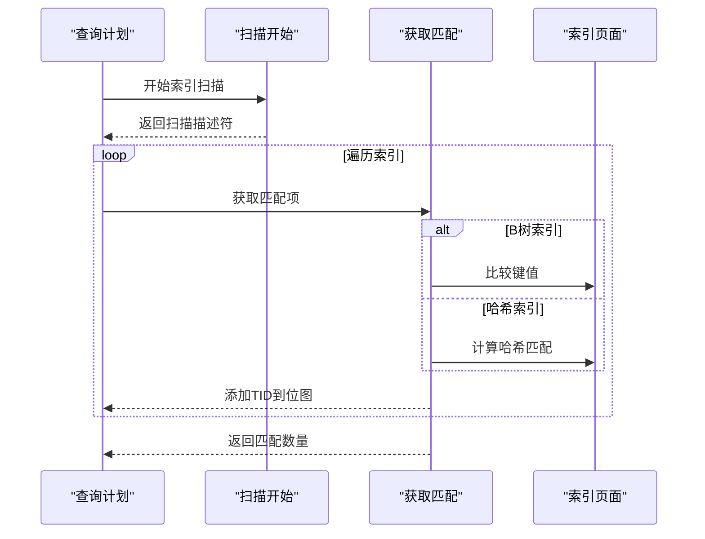
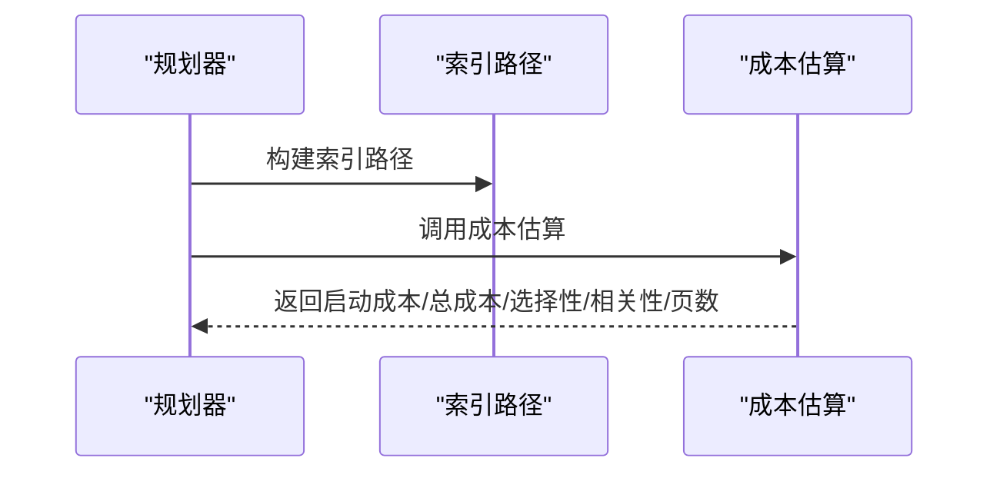
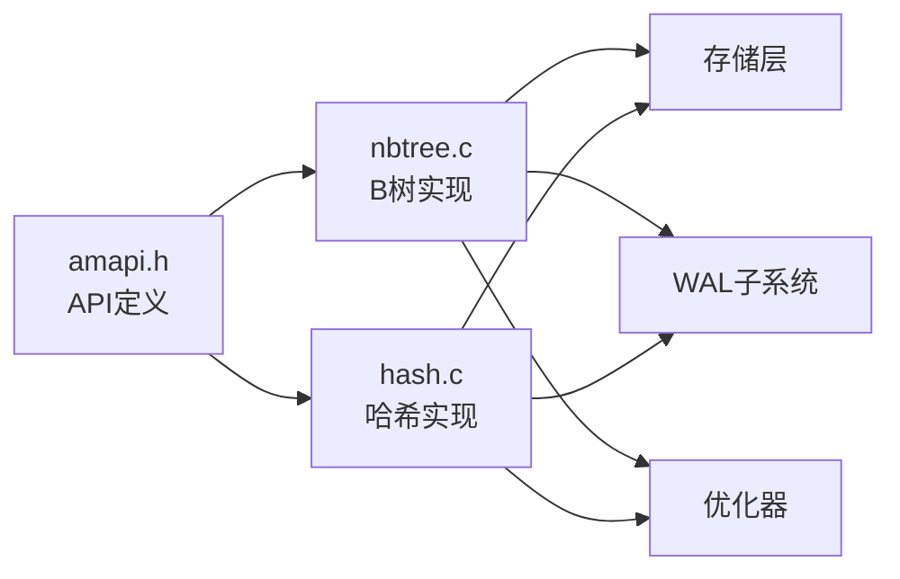

# 自定义索引方法

<cite>
**本文引用的文件**
- [amapi.h](file://src/include/access/amapi.h)
- [amapi.c](file://src/backend/access/index/amapi.c)
- [nbtree.c](file://src/backend/access/nbtree/nbtree.c)
- [hash.c](file://src/backend/access/hash/hash.c)
- [indexam.sgml](file://doc/src/sgml/indexam.sgml)
</cite>

## 更新摘要
**变更内容**
- 移除了Bloom索引扩展的完整实现示例，因为contrib/bloom已从minipg中完全移除
- 更新了文档以反映当前可用的索引类型（B树和哈希索引）
- 提供了基于现有索引实现的自定义索引开发指导
- 强调了在最小化发行版中直接实现访问方法的必要性

## 目录
1. [简介](#简介)
2. [项目结构](#项目结构)
3. [核心组件](#核心组件)
4. [架构总览](#架构总览)
5. [详细组件分析](#详细组件分析)
6. [依赖关系分析](#依赖关系分析)
7. [性能考虑](#性能考虑)
8. [故障排查指南](#故障排查指南)
9. [结论](#结论)
10. [附录](#附录)

## 简介
本文件面向希望为PostgreSQL实现自定义索引方法的开发者。由于Bloom索引扩展（contrib/bloom）已从minipg中完全移除，本文档将基于现有的B树和哈希索引实现，系统讲解如何从零实现新的索引类型，覆盖插入、扫描、删除与VACUUM全流程；并说明访问方法接口（AM API）的实现要求、索引元数据管理、存储格式设计、查询优化器集成、性能调优与一致性保证机制。读者可据此快速扩展或开发新的索引类型。

**重要提示**：在minipg最小化发行版中，用户需要直接实现自己的访问方法，而不是依赖contrib模块中的Bloom索引。

## 项目结构
当前minipg包含两个内置的索引实现：B树索引和哈希索引。它们都遵循相同的IndexAmRoutine接口规范：

**图表来源**
- [amapi.h:210-287](file://src/include/access/amapi.h#L210-L287)
- [nbtree.c:94-144](file://src/backend/access/nbtree/nbtree.c#L94-L144)
- [hash.c:55-105](file://src/backend/access/hash/hash.c#L55-L105)

**章节来源**
- [amapi.h:210-287](file://src/include/access/amapi.h#L210-L287)
- [nbtree.c:94-144](file://src/backend/access/nbtree/nbtree.c#L94-L144)
- [hash.c:55-105](file://src/backend/access/hash/hash.c#L55-L105)

## 核心组件
- **访问方法接口**：通过IndexAmRoutine结构体定义所有回调函数指针
- **B树索引**：支持排序、唯一约束、多列索引、并行扫描等高级功能
- **哈希索引**：提供高效的等值查询，不支持排序和范围查询
- **索引元数据管理**：每个索引类型都有特定的元数据页格式
- **WAL记录**：使用GenericXLog确保事务一致性和崩溃恢复
- **成本估算**：向优化器提供准确的扫描成本估计

**章节来源**
- [amapi.h:210-287](file://src/include/access/amapi.h#L210-L287)
- [nbtree.c:94-144](file://src/backend/access/nbtree/nbtree.c#L94-L144)
- [hash.c:55-105](file://src/backend/access/hash/hash.c#L55-L105)

## 架构总览
自定义索引方法通过IndexAmRoutine暴露给内核，核心流程如下：

**图表来源**
- [nbtree.c:94-144](file://src/backend/access/nbtree/nbtree.c#L94-L144)
- [hash.c:55-105](file://src/backend/access/hash/hash.c#L55-L105)
- [amapi.c:32-46](file://src/backend/access/index/amapi.c#L32-L46)

**章节来源**
- [nbtree.c:94-144](file://src/backend/access/nbtree/nbtree.c#L94-L144)
- [hash.c:55-105](file://src/backend/access/hash/hash.c#L55-L105)
- [amapi.c:32-46](file://src/backend/access/index/amapi.c#L32-L46)

## 详细组件分析

### 访问方法接口（AM API）与注册
IndexAmRoutine结构体定义了所有必需的回调函数：

**图表来源**
- [amapi.h:210-287](file://src/include/access/amapi.h#L210-L287)
- [nbtree.c:94-144](file://src/backend/access/nbtree/nbtree.c#L94-L144)
- [hash.c:55-105](file://src/backend/access/hash/hash.c#L55-L105)

**章节来源**
- [amapi.h:210-287](file://src/include/access/amapi.h#L210-L287)
- [nbtree.c:94-144](file://src/backend/access/nbtree/nbtree.c#L94-L144)
- [hash.c:55-105](file://src/backend/access/hash/hash.c#L55-L105)

### 索引元数据与存储格式
不同的索引类型有不同的元数据格式：

- **B树索引**：使用BTREE_METAPAGE_BLKNO作为元数据页，包含树的高水位标记、版本信息等
- **哈希索引**：使用HASHMETA结构体，包含桶数量、版本等信息
- **通用格式**：所有索引都使用BlockNumber标识页面，使用ItemPointer引用堆元组

**章节来源**
- [nbtree.c:149-177](file://src/backend/access/nbtree/nbtree.c#L149-L177)
- [hash.c:193-197](file://src/backend/access/hash/hash.c#L193-L197)

### 构建与插入（Build & Insert）
两种索引类型的构建和插入流程：

**B树索引**：
- 构建时初始化元数据页，遍历堆表生成B树节点
- 插入时使用递归下降算法找到合适位置
- 支持并发控制和页面分裂

**哈希索引**：
- 构建时根据数据量计算初始桶数量
- 插入时计算哈希值定位到对应桶
- 处理哈希冲突和溢出链

**图表来源**
- [nbtree.c:185-200](file://src/backend/access/nbtree/nbtree.c#L185-L200)
- [hash.c:110-188](file://src/backend/access/hash/hash.c#L110-L188)

**章节来源**
- [nbtree.c:185-200](file://src/backend/access/nbtree/nbtree.c#L185-L200)
- [hash.c:110-188](file://src/backend/access/hash/hash.c#L110-L188)

### 扫描（Scan）
两种索引类型的扫描实现：

**B树索引**：
- 支持等值查询、范围查询、排序查询
- 使用btgetbitmap和btgettuple两种方式
- 支持前向和后向扫描

**哈希索引**：
- 仅支持等值查询
- 使用hashgetbitmap获取匹配的TID位图
- 不支持排序和范围查询

**图表来源**
- [nbtree.c:132-138](file://src/backend/access/nbtree/nbtree.c#L132-L138)
- [hash.c:93-99](file://src/backend/access/hash/hash.c#L93-L99)

**章节来源**
- [nbtree.c:132-138](file://src/backend/access/nbtree/nbtree.c#L132-L138)
- [hash.c:93-99](file://src/backend/access/hash/hash.c#L93-L99)

### VACUUM（Vacuum）
索引的清理和维护：

**B树索引**：
- 支持并行VACUUM
- 压缩页面，回收空间
- 重建索引统计信息

**哈希索引**：
- 基础VACUUM支持
- 清理死元组
- 维护桶的完整性

**章节来源**
- [nbtree.c:123-124](file://src/backend/access/nbtree/nbtree.c#L123-L124)
- [hash.c:84-85](file://src/backend/access/hash/hash.c#L84-L85)

### 成本估算与优化器集成
两种索引的成本估算策略：

**B树索引**：
- 支持复杂的成本模型
- 考虑索引选择性、相关性
- 支持多种查询模式

**哈希索引**：
- 简单的等值查询成本估算
- 基于哈希碰撞率
- 不支持范围查询成本

**图表来源**
- [nbtree.c:126](file://src/backend/access/nbtree/nbtree.c#L126)
- [hash.c:87](file://src/backend/access/hash/hash.c#L87)
- [amapi.h:133-141](file://src/include/access/amapi.h#L133-L141)

**章节来源**
- [nbtree.c:126](file://src/backend/access/nbtree/nbtree.c#L126)
- [hash.c:87](file://src/backend/access/hash/hash.c#L87)
- [amapi.h:133-141](file://src/include/access/amapi.h#L133-L141)

### 操作类与支撑函数验证
索引的验证机制：

**B树索引**：
- 验证操作类和支撑函数
- 检查数据类型兼容性
- 确保必需函数存在

**哈希索引**：
- 基本的验证逻辑
- 检查哈希函数可用性
- 验证操作符族

**章节来源**
- [nbtree.c:130](file://src/backend/access/nbtree/nbtree.c#L130)
- [hash.c:91](file://src/backend/access/hash/hash.c#L91)

## 依赖关系分析
索引实现的依赖关系：

**图表来源**
- [amapi.h:210-287](file://src/include/access/amapi.h#L210-L287)
- [nbtree.c:19-38](file://src/backend/access/nbtree/nbtree.c#L19-L38)
- [hash.c:19-34](file://src/backend/access/hash/hash.c#L19-L34)

**章节来源**
- [amapi.h:210-287](file://src/include/access/amapi.h#L210-L287)
- [nbtree.c:19-38](file://src/backend/access/nbtree/nbtree.c#L19-L38)
- [hash.c:19-34](file://src/backend/access/hash/hash.c#L19-L34)

## 性能考虑
自定义索引的性能优化要点：

- **选择合适的索引类型**：B树适合范围查询和排序，哈希适合等值查询
- **元数据设计**：合理的元数据格式减少I/O开销
- **并发控制**：适当的锁粒度提高并发性能
- **WAL优化**：最小化的WAL记录提高写入性能
- **成本估算准确性**：准确的成本模型帮助优化器选择最佳执行计划
- **VACUUM策略**：定期清理提高长期性能

## 故障排查指南
常见问题的诊断方法：

- **索引构建失败**：检查内存分配、存储空间、权限设置
- **插入性能问题**：分析锁竞争、WAL压力、页面分裂频率
- **扫描效率低下**：检查索引选择性、统计信息准确性
- **VACUUM效果不佳**：监控死元组比例、页面碎片程度
- **成本估算偏差**：调整统计信息收集频率和分析参数

## 结论
通过B树和哈希索引的实现，可以清晰理解PostgreSQL自定义索引方法的核心要点：

- 通过IndexAmRoutine暴露统一接口，实现构建、插入、扫描、VACUUM、成本估算与验证
- 设计合理的元数据与存储格式，确保高效读写与一致性
- 利用WAL与锁机制保证事务一致性与崩溃恢复
- 与优化器集成，提供准确的成本估算以驱动查询计划
- 根据应用场景选择合适的索引类型和优化策略

**注意**：在minipg环境中，由于Bloom索引已移除，开发者需要直接参考现有的B树和哈希索引实现来开发自定义索引。

## 附录
- **关键数据结构参考**：
  - IndexAmRoutine：访问方法接口结构体
  - BTree相关结构：BTreeMetaPageData、BTPrefixData等
  - Hash相关结构：HashMetaPageData、HSpool等
  
- **重要函数参考**：
  - 处理器函数：bthandler()、hashhandler()
  - 构建函数：btbuild()、hashbuild()
  - 插入函数：btinsert()、hashinsert()
  - 扫描函数：btgetbitmap()、hashgetbitmap()
  - VACUUM函数：btbulkdelete()、hashbulkdelete()
  - 成本估算：btcostestimate()、hashcostestimate()

**章节来源**
- [amapi.h:210-287](file://src/include/access/amapi.h#L210-L287)
- [nbtree.c:94-144](file://src/backend/access/nbtree/nbtree.c#L94-L144)
- [hash.c:55-105](file://src/backend/access/hash/hash.c#L55-L105)