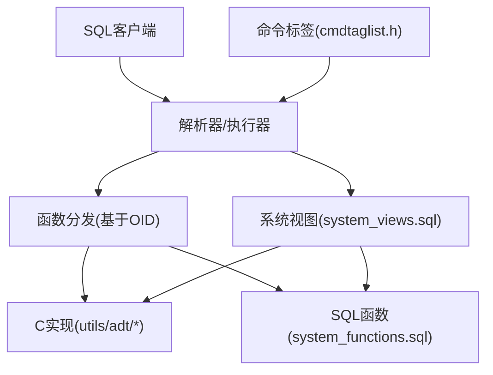
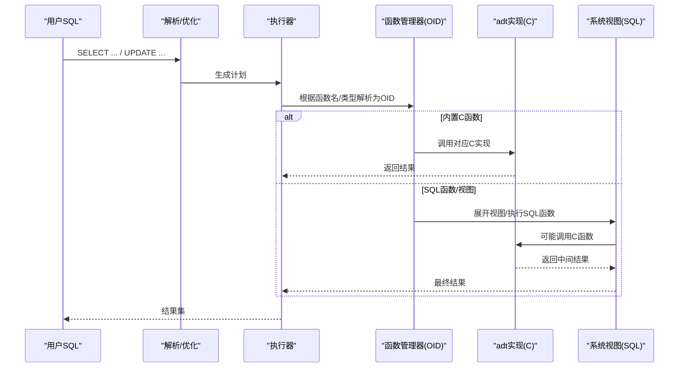
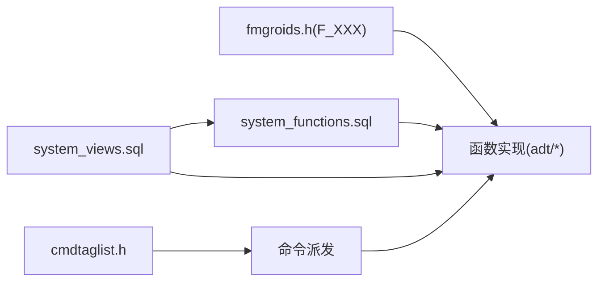

# 系统API参考

<cite>
**本文引用的文件**
- [fmgroids.h](file://src/backend/utils/fmgroids.h)
- [system_views.sql](file://src/backend/catalog/system_views.sql)
- [system_functions.sql](file://src/backend/catalog/system_functions.sql)
- [cmdtaglist.h](file://src/include/tcop/cmdtaglist.h)
- [arrayfuncs.c](file://src/backend/utils/adt/arrayfuncs.c)
- [date.c](file://src/backend/utils/adt/date.c)
- [datetime.c](file://src/backend/utils/adt/datetime.c)
- [timestamp.c](file://src/backend/utils/adt/timestamp.c)
- [float.c](file://src/backend/utils/adt/float.c)
- [int.c](file://src/backend/utils/adt/int.c)
- [int8.c](file://src/backend/utils/adt/int8.c)
- [varbit.c](file://src/backend/utils/adt/varbit.c)
- [encode.c](file://src/backend/utils/adt/encode.c)
- [pgstatfuncs.c](file://src/backend/utils/adt/pgstatfuncs.c)
</cite>

## 更新摘要
**变更内容**
- 移除了CMDTAG_DROP_SUBSCRIPTION命令标签，该标签属于已裁剪的逻辑复制功能的残留
- 更新了CommandTag枚举结构，所有相关枚举值向前移动1位
- 清理了与逻辑复制相关的内部API引用

## 目录
1. [简介](#简介)
2. [项目结构](#项目结构)
3. [核心组件](#核心组件)
4. [架构总览](#架构总览)
5. [详细组件分析](#详细组件分析)
6. [依赖关系分析](#依赖关系分析)
7. [性能考虑](#性能考虑)
8. [故障排查指南](#故障排查指南)
9. [结论](#结论)
10. [附录：内置函数与操作符速查](#附录内置函数与操作符速查)

## 简介
本参考文档面向Mini PostgreSQL系统的内置API，覆盖数学函数、字符串函数、日期时间函数、类型转换函数以及系统信息函数；同时汇总系统视图与常用操作符。文档以"函数签名—参数类型—返回值—SQL示例—性能与兼容性"的结构组织，帮助开发者快速定位并正确使用系统API。

**重要更新**：Mini PostgreSQL已完全移除逻辑复制功能，包括CREATE/DROP SUBSCRIPTION、CREATE/DROP PUBLICATION等语法和实现。CMDTAG_DROP_SUBSCRIPTION命令标签作为残留已被清理，CommandTag枚举整体前移1位。

## 项目结构
- 函数OID与注册表：通过 fmgroids.h 集中定义所有内置函数的OID常量，供后端快速查找与调用。
- SQL层系统函数与视图：system_functions.sql 提供部分用SQL实现的系统函数（如 bit_length、age、overlaps 等），system_views.sql 定义大量系统视图（如 pg_stat_*、pg_locks、pg_settings 等）。
- C语言实现：utils/adt 下按数据类型划分实现文件，涵盖数值、字符串、位串、编码、时间日期、统计等。
- 命令标签管理：cmdtaglist.h 定义了所有支持的SQL命令标签，已移除逻辑复制相关标签。

**图表来源**
- [fmgroids.h:1-120](file://src/backend/utils/fmgroids.h#L1-L120)
- [system_functions.sql:33-179](file://src/backend/catalog/system_functions.sql#L33-L179)
- [system_views.sql:17-287](file://src/backend/catalog/system_views.sql#L17-L287)
- [cmdtaglist.h:27-81](file://src/include/tcop/cmdtaglist.h#L27-L81)

**章节来源**
- [fmgroids.h:1-120](file://src/backend/utils/fmgroids.h#L1-L120)
- [system_functions.sql:1-325](file://src/backend/catalog/system_functions.sql#L1-L325)
- [system_views.sql:1-714](file://src/backend/catalog/system_views.sql#L1-L714)
- [cmdtaglist.h:27-81](file://src/include/tcop/cmdtaglist.h#L27-L81)

## 核心组件
- 函数OID映射：fmgroids.h 提供 F_XXX 宏，将函数名与内部OID绑定，避免每次查询目录开销。
- SQL系统函数：system_functions.sql 定义了若干轻量级或组合型函数（如 bit_length、age、overlaps、pg_relation_size 等）。
- 系统视图：system_views.sql 暴露丰富的运行时与统计信息（如 pg_stat_activity、pg_stat_database、pg_locks、pg_settings 等）。
- 类型与函数实现：utils/adt 下各文件实现具体类型的运算与函数（数值、字符串、位串、时间日期、编码、统计等）。
- 命令标签系统：cmdtaglist.h 定义了当前支持的所有SQL命令标签，已移除逻辑复制相关标签。

**章节来源**
- [fmgroids.h:1-120](file://src/backend/utils/fmgroids.h#L1-L120)
- [system_functions.sql:33-179](file://src/backend/catalog/system_functions.sql#L33-L179)
- [system_views.sql:17-287](file://src/backend/catalog/system_views.sql#L17-L287)
- [cmdtaglist.h:27-81](file://src/include/tcop/cmdtaglist.h#L27-L81)

## 架构总览
下图展示了从SQL到内置函数的调用路径，以及系统视图如何组合底层函数与元数据视图。

**图表来源**
- [fmgroids.h:1-120](file://src/backend/utils/fmgroids.h#L1-L120)
- [system_functions.sql:33-179](file://src/backend/catalog/system_functions.sql#L33-L179)
- [system_views.sql:17-287](file://src/backend/catalog/system_views.sql#L17-L287)

## 详细组件分析

### 数学函数
- 常见函数族
  - 绝对值：abs(int2/int4/int8/float4/float8)
  - 幂与指数：power(base, exponent)、exp(x)、ln(x)、log(b,x)、log10(x)
  - 根与开方：sqrt(x)、cbrt(x)
  - 取整与截断：round(x[, n])、trunc(x[, n])
  - 三角函数：sin/cos/tan/cot/asin/acos/atan/atan2、degrees/radians、pi
  - 随机：random()、setseed(double)
  - 模运算：mod(a,b)
- 典型签名与示例（示意）
  - power(double precision, double precision) → double precision
    - 示例：SELECT power(2.0, 3.0);
  - round(double precision, integer) → double precision
    - 示例：SELECT round(3.14159, 2);
  - random() → double precision
    - 示例：SELECT random();
- 性能与兼容性
  - 多数数学函数为 IMMUTABLE，可被优化器缓存与并行化。
  - 浮点精度遵循IEEE 754，跨平台一致。
- 代码位置参考
  - float.c、int.c、int8.c、fmgroids.h

**章节来源**
- [fmgroids.h:132-162](file://src/backend/utils/fmgroids.h#L132-L162)
- [fmgroids.h:568-575](file://src/backend/utils/fmgroids.h#L568-L575)
- [fmgroids.h:627-639](file://src/backend/utils/fmgroids.h#L627-L639)
- [float.c](file://src/backend/utils/adt/float.c)
- [int.c](file://src/backend/utils/adt/int.c)
- [int8.c](file://src/backend/utils/adt/int8.c)

### 字符串函数
- 常见函数族
  - 长度与字节：length(text/bpchar)、octet_length(text/bytea)、bit_length(bit/text/bytea)
  - 大小写与格式化：lower/upper/initcap、format_type、quote_ident/quote_literal
  - 子串与定位：substring、substr、position/strpos、overlay、translate、repeat
  - 匹配与比较：like/ilike/nlike、regexp相关（若存在）
  - 拼接与裁剪：concat、||、ltrim/rtrim/btrim
  - ASCII/字符：ascii、chr
- 典型签名与示例（示意）
  - octet_length(bytea) → integer
    - 示例：SELECT octet_length(E'\\x48656c6c6f');
  - substring(text FROM int FOR int) → text
    - 示例：SELECT substring('PostgreSQL' FROM 3 FOR 4);
  - position(text IN text) → integer
    - 示例：SELECT position('ell' IN 'hello');
- 性能与兼容性
  - 多数字符串函数为 IMMUTABLE/STABLE，支持并行。
  - 多字节编码安全（UTF-8等）由底层mb库保证。
- 代码位置参考
  - system_functions.sql（bit_length）、fmgroids.h（TEXT/BYTEA/LIKE等）、arrayfuncs.c（数组转字符串等）

**章节来源**
- [system_functions.sql:33-49](file://src/backend/catalog/system_functions.sql#L33-L49)
- [fmgroids.h:336-396](file://src/backend/utils/fmgroids.h#L336-L396)
- [fmgroids.h:610-681](file://src/backend/utils/fmgroids.h#L610-L681)
- [arrayfuncs.c](file://src/backend/utils/adt/arrayfuncs.c)

### 日期时间函数
- 常见函数族
  - 当前时间：now()/current_timestamp/current_time/current_date
  - 区间与差值：age(timestamp/timestamptz/date)、justify_hours/days
  - 截取与拆分：date_trunc(text, timestamp/timestamptz/interval)、date_part(text, ...)
  - 构造与转换：make_interval(...)、to_char/to_timestamp/to_date、timezone处理
  - 范围重叠：overlaps(...)
- 典型签名与示例（示意）
  - age(timestamptz) → interval
    - 示例：SELECT age(current_timestamp);
  - date_trunc('hour', timestamptz) → timestamptz
    - 示例：SELECT date_trunc('hour', now());
  - overlaps(timestamptz, timestamptz, timestamptz, timestamptz) → boolean
    - 示例：SELECT overlaps(ts1, ts2, ts3, ts4);
- 性能与兼容性
  - 多数为 STABLE/IMMUTABLE，可被优化器重用。
  - 时区敏感函数受服务器时区设置影响。
- 代码位置参考
  - system_functions.sql（age/overlaps等）、timestamp.c、datetime.c、date.c

**章节来源**
- [system_functions.sql:51-172](file://src/backend/catalog/system_functions.sql#L51-L172)
- [timestamp.c](file://src/backend/utils/adt/timestamp.c)
- [datetime.c](file://src/backend/utils/adt/datetime.c)
- [date.c](file://src/backend/utils/adt/date.c)

### 类型转换与编码函数
- 常见函数族
  - 编码/解码：encode/decode(data, format)
  - 显式转换：cast(... AS type)、:: 语法、to_char/to_timestamp/to_date
  - 字符集转换：convert/convert_to/convert_from
  - 其他：format_type(oid) 显示类型名称
- 典型签名与示例（示意）
  - encode(bytea, text) → text
    - 示例：SELECT encode(E'\\xDEADBEEF', 'hex');
  - to_char(interval, text) → text
    - 示例：SELECT to_char(make_interval(hours=>2), 'HH24:MI:SS');
- 性能与兼容性
  - 编码函数通常 IMMUTABLE，适合在表达式中重用。
  - 字符集行为受数据库编码与客户端编码影响。
- 代码位置参考
  - encode.c、system_functions.sql、fmgroids.h

**章节来源**
- [encode.c](file://src/backend/utils/adt/encode.c)
- [system_functions.sql:175-228](file://src/backend/catalog/system_functions.sql#L175-L228)
- [fmgroids.h:691-710](file://src/backend/utils/fmgroids.h#L691-L710)

### 系统信息函数与视图
- 系统视图（节选）
  - pg_stat_activity：会话与查询状态
  - pg_stat_database：数据库级统计
  - pg_locks：锁信息
  - pg_settings/pg_file_settings：配置项
  - pg_available_extensions/pg_prepared_xacts/pg_prepared_statements：扩展与事务/语句
- 系统函数（节选）
  - pg_relation_size(regclass) → bigint
  - pg_start_backup/pg_stop_backup/pg_promote/pg_terminate_backend：运维管理
  - make_interval(...)：构造区间
  - normalize/is_normalized：Unicode规范化
- 典型用法（示意）
  - SELECT * FROM pg_stat_activity WHERE state = 'active';
  - SELECT pg_relation_size('my_table');
- 代码位置参考
  - system_views.sql、system_functions.sql、pgstatfuncs.c

**章节来源**
- [system_views.sql:225-287](file://src/backend/catalog/system_views.sql#L225-L287)
- [system_views.sql:291-714](file://src/backend/catalog/system_views.sql#L291-L714)
- [system_functions.sql:175-228](file://src/backend/catalog/system_functions.sql#L175-L228)
- [pgstatfuncs.c](file://src/backend/utils/adt/pgstatfuncs.c)

### 位串与二进制函数
- 常见函数族
  - 位串：bit_length(bit)、bit_and/or/xor/not、shift left/right、cat、substring、length
  - 二进制：octet_length(bytea)、get_byte/set_byte、bit operations on bytea
- 典型签名与示例（示意）
  - bit_and(bit, bit) → bit
    - 示例：SELECT b'1010' & b'1100';
  - get_byte(bytea, int) → smallint
    - 示例：SELECT get_byte(E'\\xDEAD', 0);
- 代码位置参考
  - varbit.c、fmgroids.h

**章节来源**
- [fmgroids.h:610-681](file://src/backend/utils/fmgroids.h#L610-L681)
- [varbit.c](file://src/backend/utils/adt/varbit.c)

### 数组函数（概览）
- 常见能力
  - 维度与元素数：array_dims、array_ndims
  - 拼接与追加：array_cat、array_append、array_prepend
  - 转字符串：array_to_string(anyarray, text[, text])
  - 比较与哈希：array_eq/array_lt/array_gt 等、hash_array
- 代码位置参考
  - arrayfuncs.c、fmgroids.h

**章节来源**
- [arrayfuncs.c](file://src/backend/utils/adt/arrayfuncs.c)
- [fmgroids.h:243-257](file://src/backend/utils/fmgroids.h#L243-L257)

## 依赖关系分析
- OID到实现：fmgroids.h 中的 F_XXX 宏将函数名映射到内部OID，执行期通过函数管理器直接调用C实现或SQL函数体。
- SQL函数依赖：system_functions.sql 中的SQL函数常复用C实现（如 bit_length 调用 length/octet_length）。
- 视图依赖：system_views.sql 的视图广泛调用统计函数（pg_stat_*）与元数据视图，形成稳定的只读接口。
- 命令标签依赖：cmdtaglist.h 定义了所有支持的命令标签，已移除逻辑复制相关标签。

**图表来源**
- [fmgroids.h:1-120](file://src/backend/utils/fmgroids.h#L1-L120)
- [system_functions.sql:33-179](file://src/backend/catalog/system_functions.sql#L33-L179)
- [system_views.sql:17-287](file://src/backend/catalog/system_views.sql#L17-L287)
- [cmdtaglist.h:27-81](file://src/include/tcop/cmdtaglist.h#L27-L81)

**章节来源**
- [fmgroids.h:1-120](file://src/backend/utils/fmgroids.h#L1-L120)
- [system_functions.sql:33-179](file://src/backend/catalog/system_functions.sql#L33-L179)
- [system_views.sql:17-287](file://src/backend/catalog/system_views.sql#L17-L287)
- [cmdtaglist.h:27-81](file://src/include/tcop/cmdtaglist.h#L27-L81)

## 性能考虑
- 稳定性标注
  - 数学/字符串/日期时间函数多为 IMMUTABLE/STABLE，利于缓存与并行。
- 并行性
  - 多数标量函数标记 PARALLEL SAFE，可在并行计划中使用。
- 成本估算
  - 简单函数 COST 较低（如 COST 1），复杂函数（如正则、I/O）更高。
- 内存与I/O
  - 大对象/二进制操作注意内存占用；统计视图读取共享内存，开销低但频繁扫描仍需谨慎。
- 建议
  - 优先使用 IMMUTABLE 函数进行过滤与计算。
  - 对大数据集避免在WHERE中对列使用昂贵函数；必要时建立函数索引。

## 故障排查指南
- 权限问题
  - 部分系统函数（备份、终止后端等）默认限制执行权限，需按角色授权。
- 时区与编码
  - 日期时间函数结果受 server_timezone 与 client_encoding 影响；确认配置一致性。
- 统计视图为空或延迟
  - pg_stat_* 视图依赖后台统计收集，重启后需要时间积累；必要时手动触发 ANALYZE。
- 常见错误
  - 类型不匹配：确保函数参数类型与期望一致，必要时显式转换。
  - 非法输入：如日期越界、除零、负数开方等会抛出异常。
- **构建注意事项**
  - 由于CMDTAG_DROP_SUBSCRIPTION标签已被移除，CommandTag枚举整体前移1位。
  - 必须执行 `make clean && make -j8` 全量干净重编，否则可能出现命令标签错位错误。
  - 旧的cmdtag.o/utility.o/postgres.o不会自动重编，可能导致运行时错误。

**章节来源**
- [system_functions.sql:182-228](file://src/backend/catalog/system_functions.sql#L182-L228)
- [system_views.sql:291-714](file://src/backend/catalog/system_views.sql#L291-L714)
- [cmdtaglist.h:27-81](file://src/include/tcop/cmdtaglist.h#L27-L81)

## 结论
Mini PostgreSQL提供了完整的内置函数与系统视图集合，覆盖数值、字符串、时间日期、编码、位串、数组及系统监控等场景。通过 fmgroids.h 的OID映射、system_functions.sql 的SQL函数与 system_views.sql 的系统视图，配合 utils/adt 下的C实现，形成了稳定高效的API体系。

**重要更新**：随着逻辑复制功能的完全移除，CMDTAG_DROP_SUBSCRIPTION命令标签及相关实现已被清理。CommandTag枚举整体前移1位，构建时必须重新编译以确保正确的命令标签映射。建议在开发中优先选择 IMMUTABLE/STABLE 且 PARALLEL SAFE 的函数，并结合统计视图进行性能调优。

## 附录：内置函数与操作符速查
说明：以下为常用API类别与代表性函数/操作符的速查清单，便于快速检索。完整签名与行为请参考对应源码与测试用例。

- 数学
  - abs、power、exp、ln、log、log10、sqrt、cbrt、round、trunc、sin、cos、tan、cot、asin、acos、atan、atan2、degrees、radians、pi、random、setseed、mod
- 字符串
  - length、octet_length、bit_length、lower、upper、initcap、substring、substr、position、strpos、overlay、translate、repeat、ltrim、rtrim、btrim、ascii、chr、quote_ident、quote_literal、format_type
- 日期时间
  - now、current_timestamp、current_time、current_date、age、date_trunc、date_part、make_interval、to_char、to_timestamp、to_date、overlaps、justify_hours、justify_days
- 类型转换与编码
  - cast/::、to_char、to_timestamp、to_date、encode、decode、convert、convert_to、convert_from
- 位串与二进制
  - bit_and、bit_or、bit_xor、bit_not、bit_shl、bit_shr、bit_cat、bit_length、get_byte、set_byte、octet_length
- 数组
  - array_dims、array_ndims、array_cat、array_append、array_prepend、array_to_string、array_eq/array_lt/array_gt
- 系统信息
  - pg_stat_activity、pg_stat_database、pg_locks、pg_settings、pg_file_settings、pg_available_extensions、pg_prepared_xacts、pg_prepared_statements
  - pg_relation_size、pg_start_backup、pg_stop_backup、pg_promote、pg_terminate_backend、normalize、is_normalized

**章节来源**
- [fmgroids.h:132-162](file://src/backend/utils/fmgroids.h#L132-L162)
- [fmgroids.h:336-396](file://src/backend/utils/fmgroids.h#L336-L396)
- [fmgroids.h:568-575](file://src/backend/utils/fmgroids.h#L568-L575)
- [fmgroids.h:610-681](file://src/backend/utils/fmgroids.h#L610-L681)
- [system_functions.sql:33-228](file://src/backend/catalog/system_functions.sql#L33-L228)
- [system_views.sql:225-714](file://src/backend/catalog/system_views.sql#L225-L714)
- [cmdtaglist.h:27-81](file://src/include/tcop/cmdtaglist.h#L27-L81)