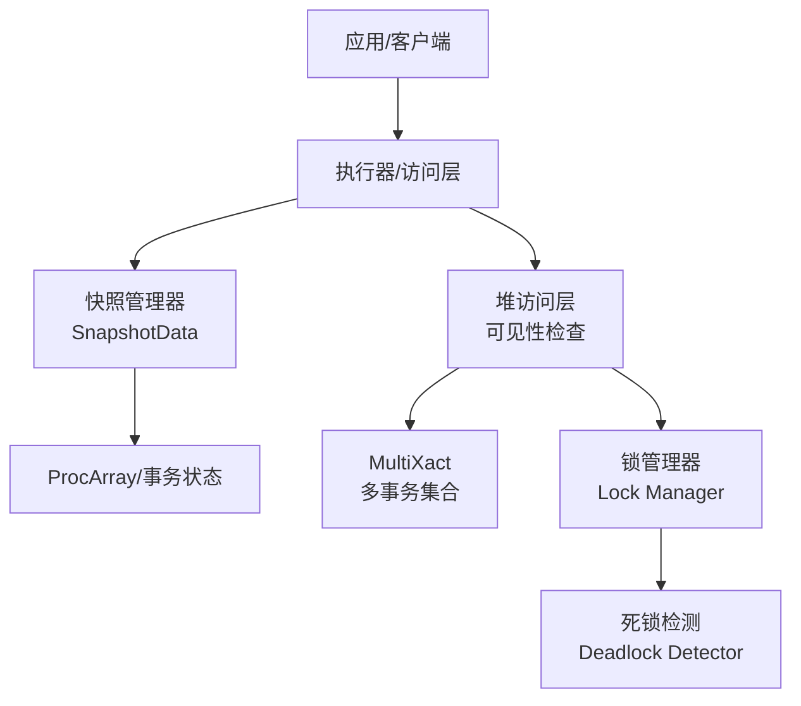
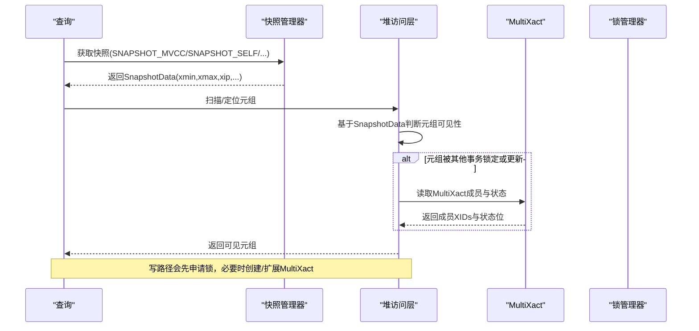
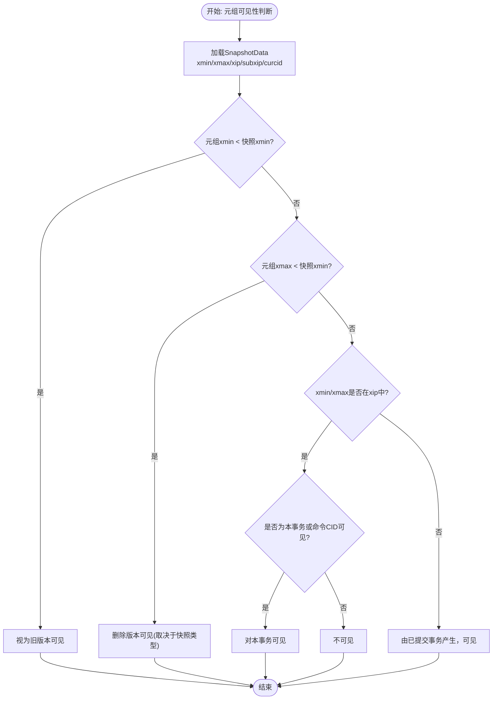
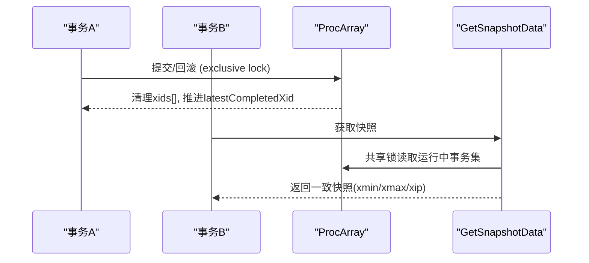
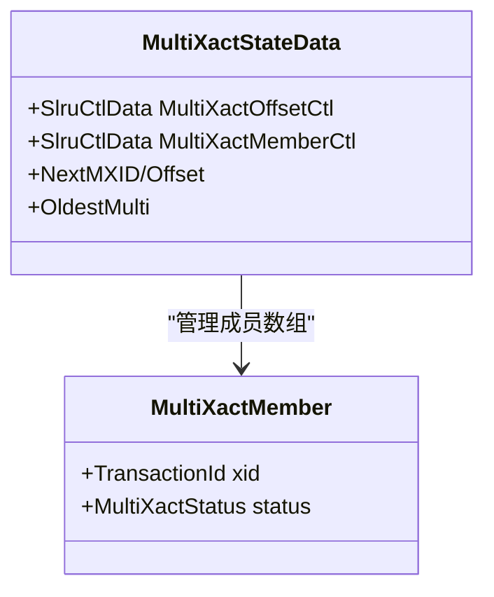
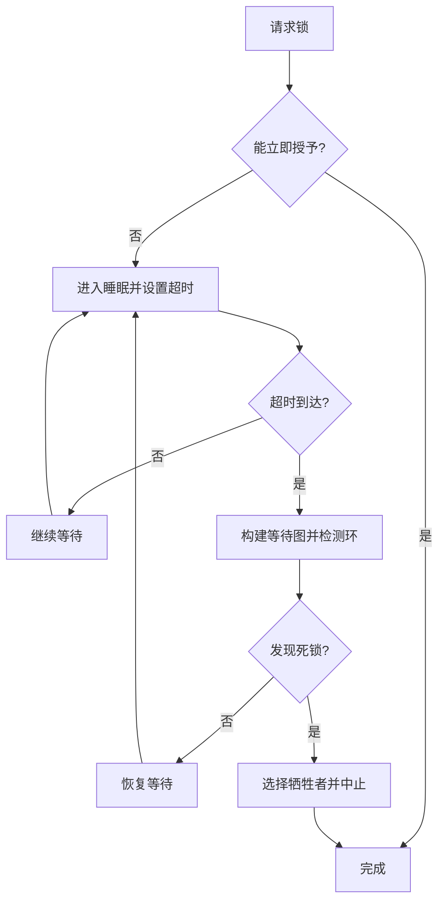
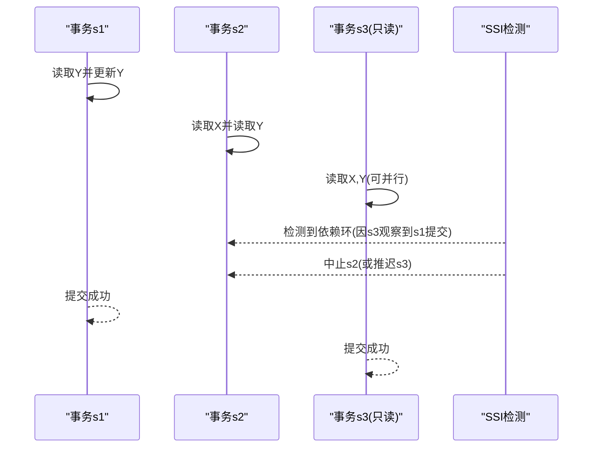
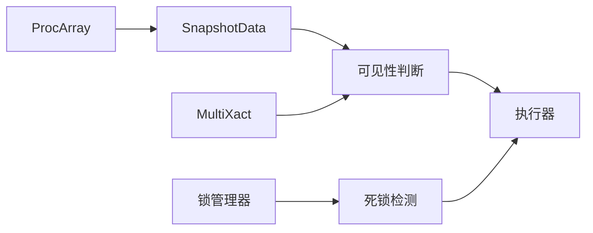

# MVCC并发控制

<cite>
**本文引用的文件**
- [src/include/utils/snapshot.h](file://src/include/utils/snapshot.h)
- [src/backend/access/transam/multixact.c](file://src/backend/access/transam/multixact.c)
- [src/include/access/multixact.h](file://src/include/access/multixact.h)
- [src/backend/storage/lmgr/deadlock.c](file://src/backend/storage/lmgr/deadlock.c)
- [src/backend/storage/lmgr/README](file://src/backend/storage/lmgr/README)
- [src/backend/access/transam/README](file://src/backend/access/transam/README)
- [src/test/isolation/specs/read-only-anomaly-2.spec](file://src/test/isolation/specs/read-only-anomaly-2.spec)
- [src/test/isolation/specs/read-only-anomaly-3.spec](file://src/test/isolation/specs/read-only-anomaly-3.spec)
- [src/test/isolation/specs/serializable-parallel.spec](file://src/test/isolation/specs/serializable-parallel.spec)
- [src/test/isolation/expected/fk-deadlock_1.out](file://src/test/isolation/expected/fk-deadlock_1.out)
- [src/test/isolation/expected/fk-deadlock2_1.out](file://src/test/isolation/expected/fk-deadlock2_1.out)
</cite>

## 目录
1. [简介](#简介)
2. [项目结构](#项目结构)
3. [核心组件](#核心组件)
4. [架构总览](#架构总览)
5. [详细组件分析](#详细组件分析)
6. [依赖关系分析](#依赖关系分析)
7. [性能考量](#性能考量)
8. [故障排查指南](#故障排查指南)
9. [结论](#结论)
10. [附录](#附录)

## 简介
本文件围绕PostgreSQL的多版本并发控制（MVCC）机制，系统阐述元组可见性判断、快照管理、多事务ID（MultiXact）与事务数组管理、锁与死锁检测避免策略，以及不同隔离级别下的行为差异与优化建议。文档以源码为依据，结合测试用例，提供可操作的诊断与调优指引。

## 项目结构
与MVCC相关的核心代码分布在以下模块：
- 快照定义与管理：utils/snapshot.h
- 事务与快照一致性：access/transam/README
- MultiXact多事务集合：access/transam/multixact.c, access/multixact.h
- 锁与死锁检测：storage/lmgr/deadlock.c, storage/lmgr/README
- 隔离级别与并发异常验证：test/isolation/specs/*.spec 及 expected/*.out

图表来源
- [src/include/utils/snapshot.h:121-217](file://src/include/utils/snapshot.h#L121-L217)
- [src/backend/access/transam/README:224-263](file://src/backend/access/transam/README#L224-L263)
- [src/backend/access/transam/multixact.c:1-68](file://src/backend/access/transam/multixact.c#L1-L68)
- [src/backend/storage/lmgr/deadlock.c:1-25](file://src/backend/storage/lmgr/deadlock.c#L1-L25)

章节来源
- [src/include/utils/snapshot.h:121-217](file://src/include/utils/snapshot.h#L121-L217)
- [src/backend/access/transam/README:224-263](file://src/backend/access/transam/README#L224-L263)
- [src/backend/access/transam/multixact.c:1-68](file://src/backend/access/transam/multixact.c#L1-L68)
- [src/backend/storage/lmgr/deadlock.c:1-25](file://src/backend/storage/lmgr/deadlock.c#L1-L25)

## 核心组件
- 快照（Snapshot）：封装MVCC可见性边界（xmin/xmax）、进行中的事务集合（xip/subxip）、命令ID（curcid）等，用于决定元组对当前查询是否可见。
- 事务数组与提交顺序：通过共享的进程数组与latestCompletedXid保证快照的一致性语义，确保“若快照A认为X已提交，且X的某快照认为Y已提交，则A也必须认为Y已提交”。
- MultiXact：记录同一元组上多个事务的锁/更新状态，支持FOR UPDATE/FOR SHARE等行级锁的并发组合。
- 锁与死锁检测：采用乐观等待+超时触发死锁检测的策略，在常见无死锁路径保持低开销，必要时构建等待图并寻找环以打破死锁。

章节来源
- [src/include/utils/snapshot.h:121-217](file://src/include/utils/snapshot.h#L121-L217)
- [src/backend/access/transam/README:224-263](file://src/backend/access/transam/README#L224-L263)
- [src/backend/access/transam/multixact.c:1-68](file://src/backend/access/transam/multixact.c#L1-L68)
- [src/backend/storage/lmgr/README:346-368](file://src/backend/storage/lmgr/README#L346-L368)

## 架构总览
下图展示了MVCC在读取路径上的关键交互：执行器获取快照，堆访问层依据快照与元组头信息（xmin/xmax/MultiXact）判定可见性；写路径可能创建新的MultiXact并写入WAL，同时受锁管理器约束。

图表来源
- [src/include/utils/snapshot.h:121-217](file://src/include/utils/snapshot.h#L121-L217)
- [src/backend/access/transam/multixact.c:1-68](file://src/backend/access/transam/multixact.c#L1-L68)
- [src/backend/storage/lmgr/README:346-368](file://src/backend/storage/lmgr/README#L346-L368)

## 详细组件分析

### 快照与可见性判断
- SnapshotData字段含义：
  - xmin/xmax：可见性边界，所有小于xmin的XID可见，大于等于xmax的XID不可见。
  - xip/subxip：进行中事务ID列表（或历史快照中已提交的区间），用于精确判断冲突。
  - curcid：同事务内命令可见性边界。
  - takenDuringRecovery/copied：恢复态快照与静态快照标记。
  - active_count/regd_count/ph_node：快照引用计数与注册堆节点，供快照管理器使用。
- 可见性规则：
  - SNAPSHOT_MVCC：仅考虑快照时刻之前已提交的事务与本事务之前的命令。
  - SNAPSHOT_SELF：考虑当前事务自身修改与已提交事务，但不包含其他进行中事务。
  - SNAPSHOT_DIRTY：包含其他进行中事务的影响，并可回传影响该元组的并发XID。
  - SNAPSHOT_NON_VACUUMABLE：用于判断元组是否仍可能被某些事务看到（即不可被清理）。

图表来源
- [src/include/utils/snapshot.h:121-217](file://src/include/utils/snapshot.h#L121-L217)

章节来源
- [src/include/utils/snapshot.h:121-217](file://src/include/utils/snapshot.h#L121-L217)

### 事务数组与快照一致性
- 设计目标：最小化begin/end事务与取快照的开销，同时保证提交顺序一致性。
- 实现要点：
  - GetSnapshotData以共享模式持有ProcArrayLock，允许并行取快照。
  - ProcArrayEndTransaction以独占模式持有锁，清理xids[]并推进latestCompletedXid，使后续快照可直接使用该值作为xmax上限。
  - 严格序列化提交/回滚与快照获取，避免快照看到不一致的提交序列。

图表来源
- [src/backend/access/transam/README:224-263](file://src/backend/access/transam/README#L224-L263)

章节来源
- [src/backend/access/transam/README:224-263](file://src/backend/access/transam/README#L224-L263)

### MultiXact多事务集合
- 作用：为同一元组维护多个事务的锁/更新状态（如FOR UPDATE/FOR SHARE），以便并发读/写时正确判断可见性与冲突。
- 存储结构：
  - 两个SLRU区域：Offsets与Members。Offsets指向Members中每个MultiXactId的数据起始位置，支持变长成员数组。
  - 每个成员包含TransactionId与状态位（如KeyShare/Share/Update等）。
- WAL与恢复：
  - 初始化Offsets/Members页与创建新MultiXactId时会生成WAL记录。
  - 通过checkpoint前flush/sync确保数据与WAL一致性；恢复时重放重建。
- 截断与回收：
  - 根据各表使用的最小MultiXactId推进全局最小值，安全截断不再需要的段。

图表来源
- [src/backend/access/transam/multixact.c:1-68](file://src/backend/access/transam/multixact.c#L1-L68)
- [src/include/access/multixact.h:19-53](file://src/include/access/multixact.h#L19-L53)
- [src/include/access/multixact.h:60-64](file://src/include/access/multixact.h#L60-L64)

章节来源
- [src/backend/access/transam/multixact.c:1-68](file://src/backend/access/transam/multixact.c#L1-L68)
- [src/include/access/multixact.h:19-53](file://src/include/access/multixact.h#L19-L53)
- [src/include/access/multixact.h:60-64](file://src/include/access/multixact.h#L60-L64)

### 锁与死锁检测/避免
- 乐观等待：
  - 无法立即获得锁时进入睡眠，不立即做死锁检测；设置DeadlockTimeout延迟，到期后检测。
  - 若无死锁，继续等待直至获锁；若有死锁，选择牺牲者中止其事务以打破循环。
- 检测算法：
  - 构建等待图（Wait-For Graph），递归查找环，必要时尝试重新排序等待队列以消除软边。
  - 记录每条边的详细信息用于诊断输出。

图表来源
- [src/backend/storage/lmgr/README:346-368](file://src/backend/storage/lmgr/README#L346-L368)
- [src/backend/storage/lmgr/deadlock.c:1-25](file://src/backend/storage/lmgr/deadlock.c#L1-L25)
- [src/backend/storage/lmgr/deadlock.c:63-103](file://src/backend/storage/lmgr/deadlock.c#L63-L103)

章节来源
- [src/backend/storage/lmgr/README:346-368](file://src/backend/storage/lmgr/README#L346-L368)
- [src/backend/storage/lmgr/deadlock.c:63-103](file://src/backend/storage/lmgr/deadlock.c#L63-L103)

### 隔离级别与并发异常
- 可串行化快照隔离（SSI）：
  - 通过检测读写依赖环来避免只读事务异常，必要时推迟或中止事务以保证串行化。
  - 测试用例覆盖只读异常场景与并行工作器场景，展示在检测到环时中止相关事务的行为。
- 外键与并发更新：
  - 隔离测试显示在并发更新外键关联表时可能出现“无法序列化访问”的错误，体现SSI的强一致性保障。

图表来源
- [src/test/isolation/specs/read-only-anomaly-2.spec:1-42](file://src/test/isolation/specs/read-only-anomaly-2.spec#L1-L42)
- [src/test/isolation/specs/read-only-anomaly-3.spec:1-39](file://src/test/isolation/specs/read-only-anomaly-3.spec#L1-L39)
- [src/test/isolation/specs/serializable-parallel.spec:1-47](file://src/test/isolation/specs/serializable-parallel.spec#L1-L47)

章节来源
- [src/test/isolation/specs/read-only-anomaly-2.spec:1-42](file://src/test/isolation/specs/read-only-anomaly-2.spec#L1-L42)
- [src/test/isolation/specs/read-only-anomaly-3.spec:1-39](file://src/test/isolation/specs/read-only-anomaly-3.spec#L1-L39)
- [src/test/isolation/specs/serializable-parallel.spec:1-47](file://src/test/isolation/specs/serializable-parallel.spec#L1-L47)
- [src/test/isolation/expected/fk-deadlock_1.out:1-37](file://src/test/isolation/expected/fk-deadlock_1.out#L1-L37)
- [src/test/isolation/expected/fk-deadlock2_1.out:1-30](file://src/test/isolation/expected/fk-deadlock2_1.out#L1-L30)

## 依赖关系分析
- 可见性判断依赖SnapshotData与MultiXact成员状态；写路径依赖锁管理器与MultiXact持久化。
- 快照一致性依赖ProcArray与latestCompletedXid；死锁检测依赖锁管理器等待图。
- 隔离级别语义由执行器与SSI检测共同实现，测试用例验证了在不同并发排列下的行为。

图表来源
- [src/include/utils/snapshot.h:121-217](file://src/include/utils/snapshot.h#L121-L217)
- [src/backend/access/transam/multixact.c:1-68](file://src/backend/access/transam/multixact.c#L1-L68)
- [src/backend/storage/lmgr/deadlock.c:1-25](file://src/backend/storage/lmgr/deadlock.c#L1-L25)
- [src/backend/access/transam/README:224-263](file://src/backend/access/transam/README#L224-L263)

## 性能考量
- 快照获取优化：
  - 利用xmin/xmax快速过滤大部分元组，减少xip搜索成本。
  - 复用静态快照与snapXactCompletionCount避免重复计算。
- MultiXact存储：
  - SLRU结构与分组存储平衡了空间与访问效率；合理设置缓冲数量与阈值降低I/O。
- 死锁检测：
  - 默认DeadlockTimeout避免频繁检测；仅在超时时构建等待图，降低常规路径开销。
- 隔离级别：
  - SERIALIZABLE在出现依赖环时可能中止事务，需评估业务重试与吞吐影响；只读DEFERRABLE可推迟至安全点以减少冲突。

[本节为通用指导，不直接分析具体文件]

## 故障排查指南
- 常见错误与现象：
  - “无法序列化访问由于并发更新”：通常出现在SERIALIZABLE隔离下检测到依赖环，需检查事务顺序与重试逻辑。
  - “当前事务已中止，命令忽略直到事务块结束”：事务被中止后的后续命令将被忽略，需捕获错误并回滚或重启事务。
- 诊断步骤：
  - 查看隔离测试预期输出，确认并发排列与期望行为。
  - 检查锁等待与死锁日志，定位阻塞链与牺牲者选择。
  - 审查MultiXact成员状态，确认是否存在多事务竞争同一元组。

章节来源
- [src/test/isolation/expected/fk-deadlock_1.out:1-37](file://src/test/isolation/expected/fk-deadlock_1.out#L1-L37)
- [src/test/isolation/expected/fk-deadlock2_1.out:1-30](file://src/test/isolation/expected/fk-deadlock2_1.out#L1-L30)

## 结论
PostgreSQL的MVCC通过SnapshotData精确刻画可见性边界，结合ProcArray保证快照一致性；MultiXact支持复杂的行级锁组合；锁管理器采用乐观等待与超时检测平衡性能与正确性；SERIALIZABLE隔离通过SSI检测避免只读异常。理解这些机制有助于在高并发场景下进行合理的建模、调优与问题定位。

## 附录
- 关键数据结构参考：
  - SnapshotData字段与语义：[src/include/utils/snapshot.h:121-217](file://src/include/utils/snapshot.h#L121-L217)
  - MultiXact成员与状态：[src/include/access/multixact.h:19-64](file://src/include/access/multixact.h#L19-L64)
- 关键流程参考：
  - 事务与快照一致性：[src/backend/access/transam/README:224-263](file://src/backend/access/transam/README#L224-L263)
  - 死锁检测策略：[src/backend/storage/lmgr/README:346-368](file://src/backend/storage/lmgr/README#L346-L368)
- 隔离级别测试参考：
  - 只读异常与并行场景：[src/test/isolation/specs/read-only-anomaly-2.spec:1-42](file://src/test/isolation/specs/read-only-anomaly-2.spec#L1-L42), [src/test/isolation/specs/serializable-parallel.spec:1-47](file://src/test/isolation/specs/serializable-parallel.spec#L1-L47)