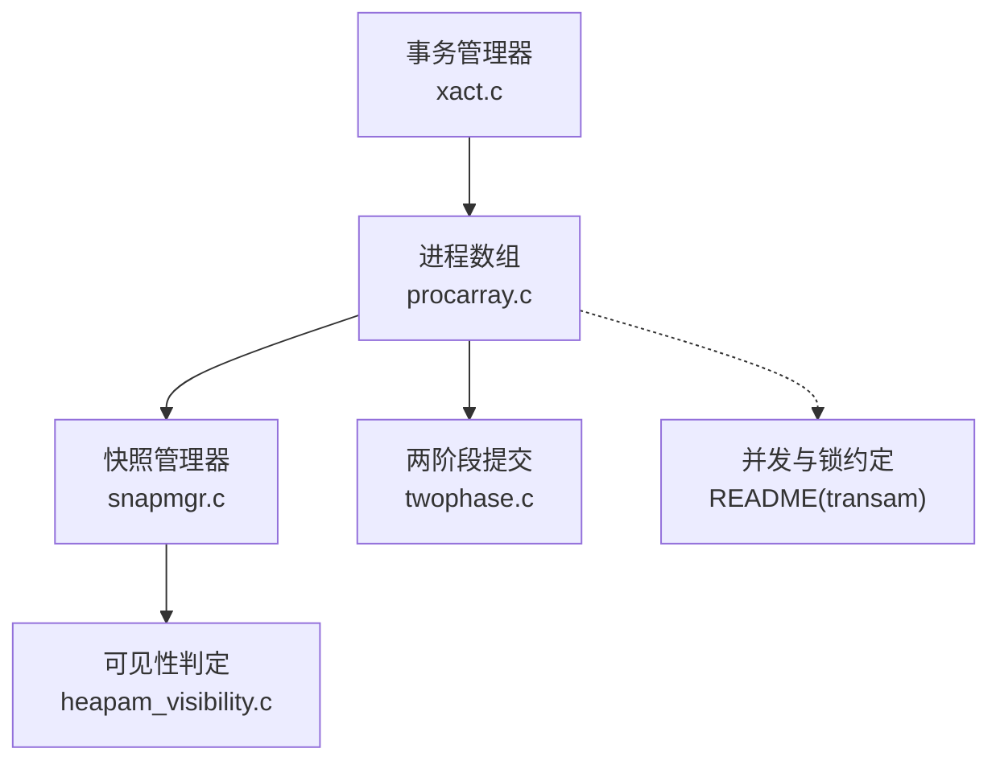
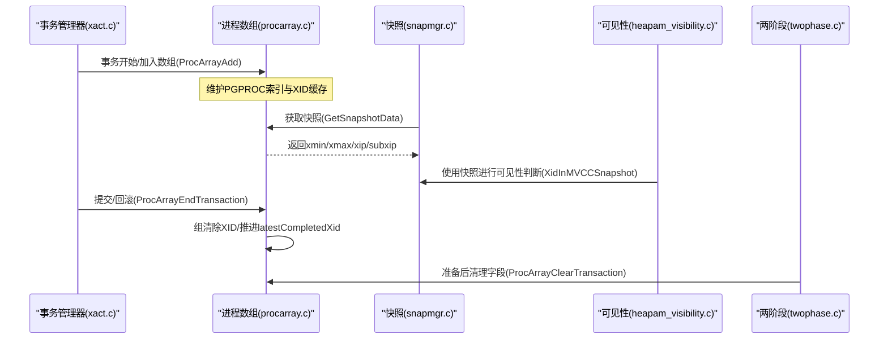
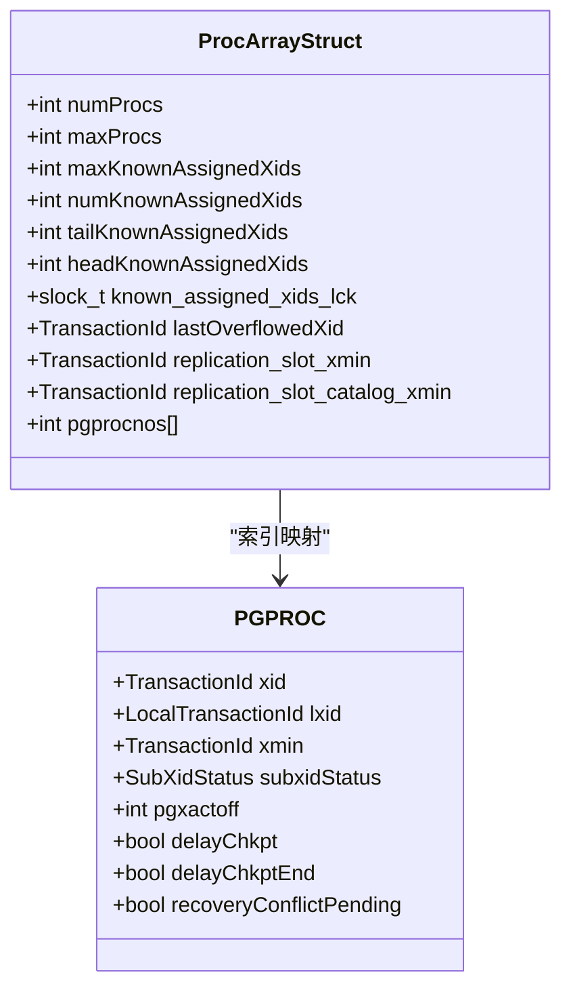
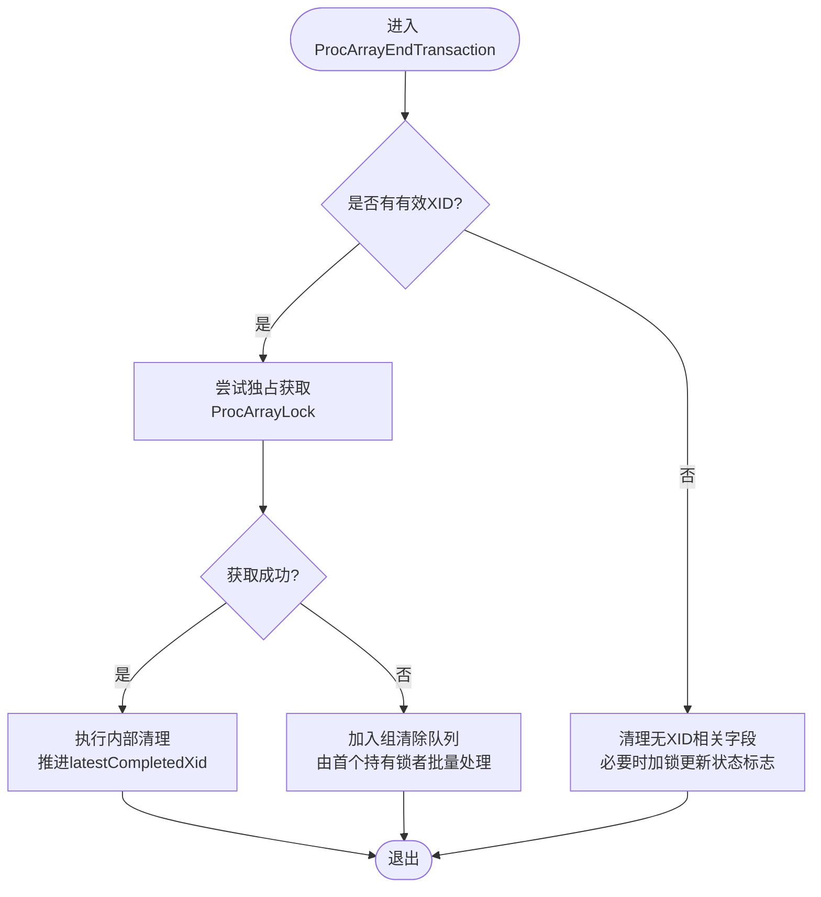
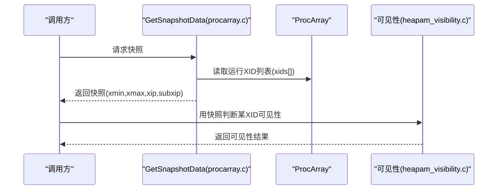
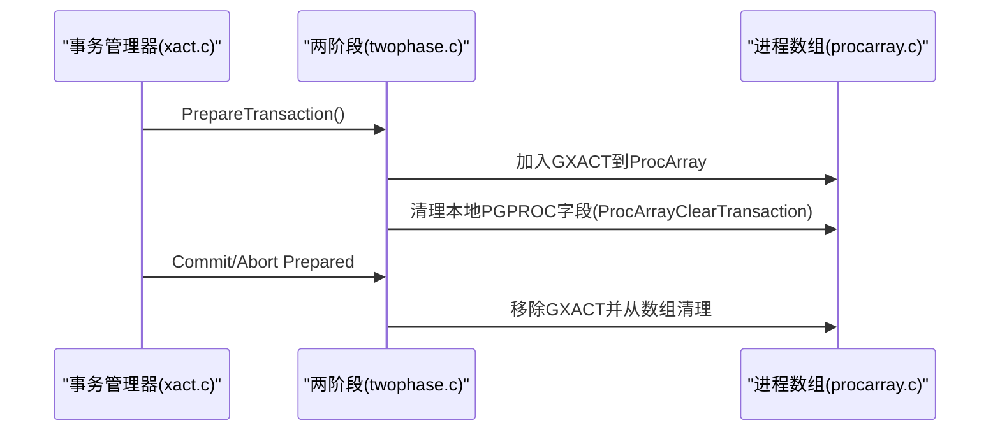
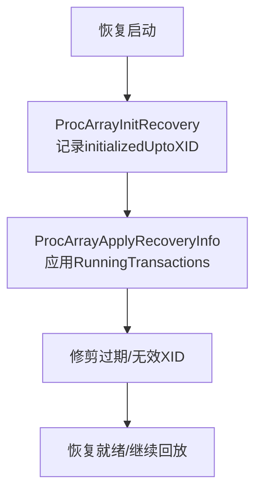
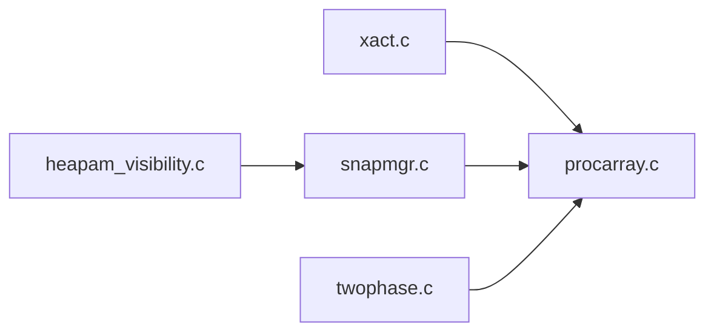

# 事务数组管理

<cite>
**本文引用的文件**
- [procarray.c](file://src/backend/storage/ipc/procarray.c)
- [procarray.h](file://src/include/storage/procarray.h)
- [snapmgr.c](file://src/backend/utils/time/snapmgr.c)
- [heapam_visibility.c](file://src/backend/access/heap/heapam_visibility.c)
- [xact.c](file://src/backend/access/transam/xact.c)
- [twophase.c](file://src/backend/access/transam/twophase.c)
- [README（transam）](file://src/backend/access/transam/README)
</cite>

## 目录
1. [简介](#简介)
2. [项目结构](#项目结构)
3. [核心组件](#核心组件)
4. [架构总览](#架构总览)
5. [详细组件分析](#详细组件分析)
6. [依赖关系分析](#依赖关系分析)
7. [性能考虑](#性能考虑)
8. [故障排查指南](#故障排查指南)
9. [结论](#结论)
10. [附录](#附录)

## 简介
本文件围绕 PostgreSQL 最小实现中的“事务数组管理系统”展开，聚焦进程数组（ProcArray）的设计与实现。内容涵盖：
- 活跃事务跟踪、事务状态同步与跨进程通信机制
- 事务数组的初始化、更新与维护（开始、提交、回滚）
- 与快照生成、可见性判断的交互关系
- 性能优化与内存管理策略

## 项目结构
与事务数组管理直接相关的代码主要位于以下模块：
- 共享内存与进程数组：src/backend/storage/ipc/procarray.c
- 接口定义：src/include/storage/procarray.h
- 快照管理与复用：src/backend/utils/time/snapmgr.c
- 可见性判定：src/backend/access/heap/heapam_visibility.c
- 事务生命周期入口：src/backend/access/transam/xact.c
- 两阶段提交集成：src/backend/access/transam/twophase.c
- 并发与锁约定说明：src/backend/access/transam/README

图表来源
- [procarray.c:2247-2600](file://src/backend/storage/ipc/procarray.c#L2247-L2600)
- [snapmgr.c:2123-2152](file://src/backend/utils/time/snapmgr.c#L2123-L2152)
- [heapam_visibility.c:23-62](file://src/backend/access/heap/heapam_visibility.c#L23-L62)
- [xact.c:2204-2247](file://src/backend/access/transam/xact.c#L2204-L2247)
- [twophase.c:147-183](file://src/backend/access/transam/twophase.c#L147-L183)
- [README（transam）:246-318](file://src/backend/access/transam/README#L246-L318)

章节来源
- [procarray.c:1-300](file://src/backend/storage/ipc/procarray.c#L1-L300)
- [procarray.h:23-100](file://src/include/storage/procarray.h#L23-L100)

## 核心组件
- 进程数组结构体 ProcArrayStruct：维护所有活跃 PGPROC 的索引、已知分配 XID 环形缓冲、复制槽 xmin 等。
- 全局可见性边界 GlobalVisState：用于在构建快照时快速估算哪些删除行可安全移除。
- 关键 API：
  - ProcArrayAdd / ProcArrayRemove：加入/移除 PGPROC 到共享数组
  - ProcArrayEndTransaction / ProcArrayClearTransaction：结束或清理事务字段
  - GetSnapshotData：构造 MVCC 快照，包含 xmin/xmax/xip/subxip
  - TransactionIdIsInProgress / XidInMVCCSnapshot：可见性判断
  - 恢复相关：ProcArrayInitRecovery / ProcArrayApplyRecoveryInfo

章节来源
- [procarray.c:70-100](file://src/backend/storage/ipc/procarray.c#L70-L100)
- [procarray.c:167-245](file://src/backend/storage/ipc/procarray.c#L167-L245)
- [procarray.h:23-100](file://src/include/storage/procarray.h#L23-L100)

## 架构总览
下图展示了事务生命周期中 ProcArray 与快照、可见性、两阶段提交的交互。

图表来源
- [xact.c:2204-2247](file://src/backend/access/transam/xact.c#L2204-L2247)
- [procarray.c:500-561](file://src/backend/storage/ipc/procarray.c#L500-L561)
- [procarray.c:675-788](file://src/backend/storage/ipc/procarray.c#L675-L788)
- [procarray.c:908-971](file://src/backend/storage/ipc/procarray.c#L908-L971)
- [procarray.c:2247-2600](file://src/backend/storage/ipc/procarray.c#L2247-L2600)
- [heapam_visibility.c:23-62](file://src/backend/access/heap/heapam_visibility.c#L23-L62)
- [twophase.c:147-183](file://src/backend/access/transam/twophase.c#L147-L183)

## 详细组件分析

### 进程数组数据结构与共享内存布局
- ProcArrayStruct：
  - numProcs/maxProcs：当前有效条目数与容量
  - KnownAssignedXids：热备/恢复期间记录主库运行事务，避免快照误判
  - replication_slot_xmin/catalog_xmin：复制槽的最小 xmin，影响保留边界
- allProcs[]：所有 PGPROC 的全局数组，按 pgprocno 排序以提升局部性
- 并行访问保护：
  - 读取/写入 head/tail 指针使用自旋锁
  - 常规遍历/修改需持有 ProcArrayLock（读/写模式）

图表来源
- [procarray.c:70-100](file://src/backend/storage/ipc/procarray.c#L70-L100)
- [procarray.c:500-561](file://src/backend/storage/ipc/procarray.c#L500-L561)

章节来源
- [procarray.c:70-100](file://src/backend/storage/ipc/procarray.c#L70-L100)
- [procarray.c:500-561](file://src/backend/storage/ipc/procarray.c#L500-L561)

### 活跃事务跟踪与状态同步
- 加入数组（ProcArrayAdd）：
  - 将 PGPROC 插入共享数组，保持按 pgprocno 排序
  - 同步 xids[]、subxidStates[]、statusFlags[]
  - 释放锁顺序：先 XidGenLock，再 ProcArrayLock（反向释放减少等待）
- 移除数组（ProcArrayRemove）：
  - 若为活动两阶段事务，需推进 latestCompletedXid 并递增 xactCompletionCount
  - 清空对应槽位并调整后续偏移
- 结束事务（ProcArrayEndTransaction）：
  - 优先尝试独占获取 ProcArrayLock；失败则走组清除路径（ProcArrayGroupClearXid）
  - 内部清理 xid/lxid/xmin、子事务缓存、vacuum 标志，并推进完成边界

图表来源
- [procarray.c:675-788](file://src/backend/storage/ipc/procarray.c#L675-L788)
- [procarray.c:790-906](file://src/backend/storage/ipc/procarray.c#L790-L906)

章节来源
- [procarray.c:500-561](file://src/backend/storage/ipc/procarray.c#L500-L561)
- [procarray.c:573-659](file://src/backend/storage/ipc/procarray.c#L573-L659)
- [procarray.c:675-788](file://src/backend/storage/ipc/procarray.c#L675-L788)
- [procarray.c:790-906](file://src/backend/storage/ipc/procarray.c#L790-L906)

### 快照生成与可见性判断
- GetSnapshotData：
  - 在共享模式下持有 ProcArrayLock，确保“正在取快照期间不允许事务退出运行集合”
  - 计算 xmin/xmax/xip/subxip，并尝试复用已有快照（基于 xactCompletionCount）
  - 初始化旧快照阈值相关字段（lsn/whenTaken）
- 可见性判断：
  - 使用 XidInMVCCSnapshot 结合快照的 xip/subxip 判定
  - 对未溢出子事务采用线性/二分查找；溢出时借助子事务树或额外逻辑
- 与 ProcArray 的交互：
  - 通过 ProcGlobal->xids[] 获取运行中的顶层 XID
  - 通过 MyProc->xmin 传播最小 xmin，供全局可见性边界计算

图表来源
- [procarray.c:2247-2600](file://src/backend/storage/ipc/procarray.c#L2247-L2600)
- [heapam_visibility.c:23-62](file://src/backend/access/heap/heapam_visibility.c#L23-L62)

章节来源
- [procarray.c:2132-2213](file://src/backend/storage/ipc/procarray.c#L2132-L2213)
- [procarray.c:2247-2600](file://src/backend/storage/ipc/procarray.c#L2247-L2600)
- [heapam_visibility.c:23-62](file://src/backend/access/heap/heapam_visibility.c#L23-L62)

### 两阶段提交与 ProcArray 集成
- 准备阶段：
  - 将对应的 GXACT 的 PGPROC 加入全局 ProcArray，使该事务在可见性检查中仍被视为运行
  - 清理本地 PGPROC 的事务字段（ProcArrayClearTransaction），但保持全局可见性
- 提交/回滚：
  - 从 ProcArray 移除对应条目，推进完成边界

图表来源
- [twophase.c:147-183](file://src/backend/access/transam/twophase.c#L147-L183)
- [procarray.c:908-971](file://src/backend/storage/ipc/procarray.c#L908-L971)

章节来源
- [twophase.c:147-183](file://src/backend/access/transam/twophase.c#L147-L183)
- [procarray.c:908-971](file://src/backend/storage/ipc/procarray.c#L908-L971)

### 恢复与已知分配XID（KnownAssignedXids）
- 启动恢复：
  - ProcArrayInitRecovery：记录已初始化到的 XID，便于后续增量扩展
- 应用主库运行信息：
  - ProcArrayApplyRecoveryInfo：根据 RunningTransactions 数据初始化/修剪 KnownAssignedXids，保证热备查询不会误判已完成事务
- 压缩与过期：
  - 定期压缩/过期以控制数组大小，防止溢出

图表来源
- [procarray.c:1027-1047](file://src/backend/storage/ipc/procarray.c#L1027-L1047)
- [procarray.c:1049-1200](file://src/backend/storage/ipc/procarray.c#L1049-L1200)

章节来源
- [procarray.c:1027-1047](file://src/backend/storage/ipc/procarray.c#L1027-L1047)
- [procarray.c:1049-1200](file://src/backend/storage/ipc/procarray.c#L1049-L1200)

## 依赖关系分析
- 事务管理器（xact.c）在提交/回滚路径调用 ProcArrayEndTransaction，确保原子地退出“运行集合”
- 快照管理器（snapmgr.c）序列化/反序列化快照，依赖 procarray 提供的最大计数与内容
- 可见性（heapam_visibility.c）依赖快照与 ProcArray 的运行集合进行 MVCC 判定
- 两阶段提交（twophase.c）通过 ProcArray 维持准备态事务的可见性

图表来源
- [xact.c:2204-2247](file://src/backend/access/transam/xact.c#L2204-L2247)
- [snapmgr.c:2123-2152](file://src/backend/utils/time/snapmgr.c#L2123-L2152)
- [heapam_visibility.c:23-62](file://src/backend/access/heap/heapam_visibility.c#L23-L62)
- [twophase.c:147-183](file://src/backend/access/transam/twophase.c#L147-L183)

章节来源
- [xact.c:2204-2247](file://src/backend/access/transam/xact.c#L2204-L2247)
- [snapmgr.c:2123-2152](file://src/backend/utils/time/snapmgr.c#L2123-L2152)
- [heapam_visibility.c:23-62](file://src/backend/access/heap/heapam_visibility.c#L23-L62)
- [twophase.c:147-183](file://src/backend/access/transam/twophase.c#L147-L183)

## 性能考虑
- 锁粒度与批处理：
  - 提交时使用组清除（ProcArrayGroupClearXid）降低 ProcArrayLock 竞争
  - 仅在必要时获取独占锁，其余情况利用共享锁并行取快照
- 内存与缓存：
  - 子事务 XID 缓存（subxidStatus）限制大小，溢出时降级为更昂贵路径
  - KnownAssignedXids 环形缓冲配合压缩/过期，避免无限增长
- 算法复杂度：
  - 添加新 XID O(1)，压缩 O(S)（S 为当前元素数）
  - 快照复用基于 xactCompletionCount，避免重复扫描
- 可见性优化：
  - 使用 definitely_needed/maybe_needed 边界减少频繁计算
  - 大 n 情况下对 xip 使用二分查找提升匹配效率

章节来源
- [procarray.c:790-906](file://src/backend/storage/ipc/procarray.c#L790-L906)
- [procarray.c:2132-2213](file://src/backend/storage/ipc/procarray.c#L2132-L2213)
- [procarray.c:2247-2600](file://src/backend/storage/ipc/procarray.c#L2247-L2600)
- [README（transam）:246-318](file://src/backend/access/transam/README#L246-L318)

## 故障排查指南
- 常见症状与定位：
  - 快照不一致：检查是否在取快照期间有事务退出运行集合（应被独占锁保护）
  - 两阶段提交可见性异常：确认 GXACT 是否已加入 ProcArray，且本地字段已正确清理
  - 热备查询误判：核查 KnownAssignedXids 是否正确初始化与修剪
- 诊断要点：
  - 观察 ProcArrayLock 持有模式（共享/独占）与组清除路径是否生效
  - 检查 latestCompletedXid 与 xactCompletionCount 是否单调递增
  - 验证 MyProc->xmin 与 RecentXmin 的一致性

章节来源
- [procarray.c:675-788](file://src/backend/storage/ipc/procarray.c#L675-L788)
- [procarray.c:908-971](file://src/backend/storage/ipc/procarray.c#L908-L971)
- [procarray.c:1049-1200](file://src/backend/storage/ipc/procarray.c#L1049-L1200)
- [README（transam）:246-318](file://src/backend/access/transam/README#L246-L318)

## 结论
ProcArray 作为 Postgres 事务系统的核心基础设施，通过严格的锁约定、高效的数组结构与批处理机制，实现了高并发下的活跃事务跟踪、快照一致性与可见性判定。其与快照管理器、可见性模块及两阶段提交的紧密协作，确保了 MVCC 语义的正确性与高性能。通过合理的内存管理与边界估算，系统在大规模并发场景下仍能保持稳定与可扩展性。

## 附录
- 关键函数路径参考：
  - 事务结束：[ProcArrayEndTransaction:675-788](file://src/backend/storage/ipc/procarray.c#L675-L788)
  - 快照构建：[GetSnapshotData:2247-2600](file://src/backend/storage/ipc/procarray.c#L2247-L2600)
  - 两阶段清理：[ProcArrayClearTransaction:908-971](file://src/backend/storage/ipc/procarray.c#L908-L971)
  - 恢复应用：[ProcArrayApplyRecoveryInfo:1049-1200](file://src/backend/storage/ipc/procarray.c#L1049-L1200)
  - 可见性判定：[XidInMVCCSnapshot:23-62](file://src/backend/access/heap/heapam_visibility.c#L23-L62)
  - 事务生命周期：[PrepareTransaction/Commit:2204-2247](file://src/backend/access/transam/xact.c#L2204-L2247)