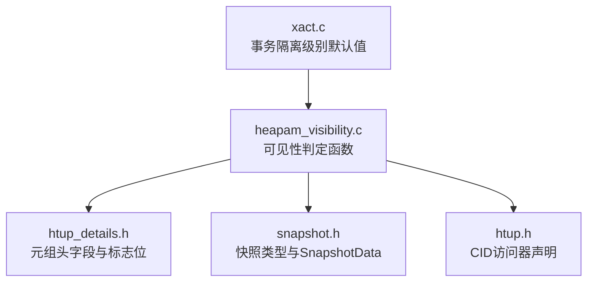
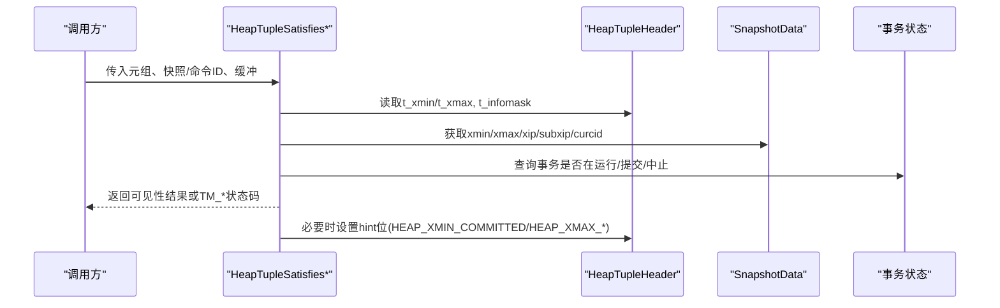
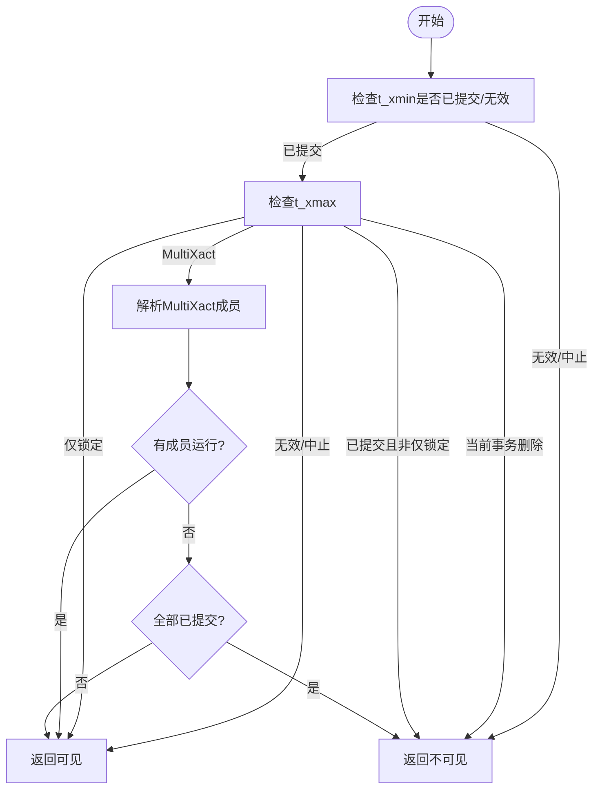
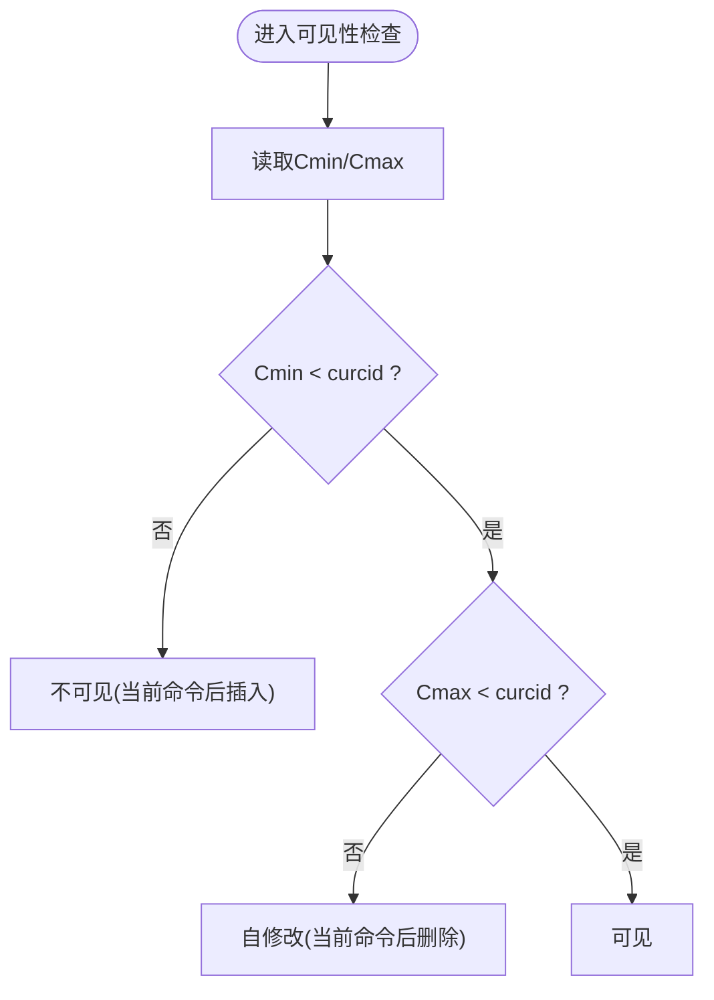
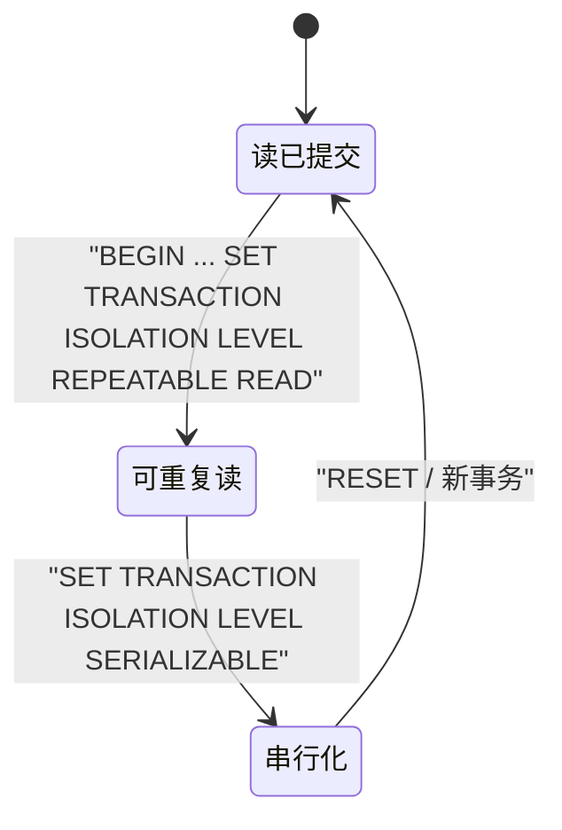
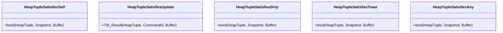
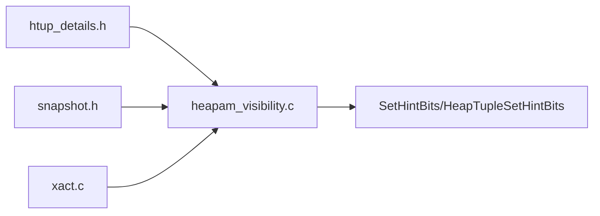

# 元组可见性判断

<cite>
**本文引用的文件**
- [heapam_visibility.c](file://src/backend/access/heap/heapam_visibility.c)
- [snapshot.h](file://src/include/utils/snapshot.h)
- [htup_details.h](file://src/include/access/htup_details.h)
- [htup.h](file://src/include/access/htup.h)
- [xact.c](file://src/backend/access/transam/xact.c)
</cite>

## 目录
1. [简介](#简介)
2. [项目结构](#项目结构)
3. [核心组件](#核心组件)
4. [架构总览](#架构总览)
5. [详细组件分析](#详细组件分析)
6. [依赖关系分析](#依赖关系分析)
7. [性能考虑](#性能考虑)
8. [故障诊断指南](#故障诊断指南)
9. [结论](#结论)
10. [附录](#附录)

## 简介
本文面向PostgreSQL的元组可见性判断系统，系统性阐述基于事务ID（xmin/xmax）与命令ID（CID）的可见性规则、不同隔离级别下的行为差异、HeapTupleSatisfies*系列函数的语义与返回值，以及可见性问题的诊断方法与性能调优策略。内容严格依据仓库中的源码与头文件进行归纳与可视化说明，帮助读者从实现层面理解MVCC在堆表层的落地方式。

## 项目结构
围绕元组可见性的关键代码分布在以下位置：
- 堆层可见性判定逻辑：src/backend/access/heap/heapam_visibility.c
- 快照类型与数据结构定义：src/include/utils/snapshot.h
- 元组头结构与可见性标志位：src/include/access/htup_details.h
- 元组访问器与CID相关接口声明：src/include/access/htup.h
- 事务隔离级别默认值等上下文：src/backend/access/transam/xact.c

**图表来源**
- [heapam_visibility.c:1-120](file://src/backend/access/heap/heapam_visibility.c#L1-L120)
- [snapshot.h:23-119](file://src/include/utils/snapshot.h#L23-L119)
- [htup_details.h:121-218](file://src/include/access/htup_details.h#L121-L218)
- [htup.h:80-87](file://src/include/access/htup.h#L80-L87)
- [xact.c:63-76](file://src/backend/access/transam/xact.c#L63-L76)

**章节来源**
- [heapam_visibility.c:1-120](file://src/backend/access/heap/heapam_visibility.c#L1-L120)
- [snapshot.h:23-119](file://src/include/utils/snapshot.h#L23-L119)
- [htup_details.h:121-218](file://src/include/access/htup_details.h#L121-L218)
- [htup.h:80-87](file://src/include/access/htup.h#L80-L87)
- [xact.c:63-76](file://src/backend/access/transam/xact.c#L63-L76)

## 核心组件
- 元组头与可见性标志位
  - t_xmin/t_xmax：记录插入/删除或加锁的事务ID
  - t_cid：存储Cmin/Cmax或旧式VACUUM FULL的Xvac
  - t_infomask/t_infomask2：包含HEAP_XMIN_COMMITTED、HEAP_XMAX_INVALID、HEAP_XMAX_IS_MULTI、HEAP_XMAX_LOCK_ONLY等可见性与锁定标志
- 快照与隔离级别
  - SnapshotType：SNAPSHOT_MVCC、SNAPSHOT_SELF、SNAPSHOT_DIRTY、SNAPSHOT_TOAST、SNAPSHOT_ANY等
  - SnapshotData：包含xmin/xmax、xip/subxip、curcid等，用于MVCC可见性判定
- 可见性判定函数族
  - HeapTupleSatisfiesSelf/SatisfiesUpdate/SatisfiesDirty/SatisfiesToast/SatisfiesAny等
  - SetHintBits/HeapTupleSetHintBits：安全地设置元组hint位以加速后续可见性检查

**章节来源**
- [htup_details.h:121-218](file://src/include/access/htup_details.h#L121-L218)
- [snapshot.h:23-119](file://src/include/utils/snapshot.h#L23-L119)
- [heapam_visibility.c:81-144](file://src/backend/access/heap/heapam_visibility.c#L81-L144)

## 架构总览
可见性判定由“元组头信息 + 快照/事务状态”共同决定。核心流程如下：
- 读取元组头的t_xmin/t_xmax及标志位
- 根据当前事务与快照（MVCC或非MVCC）判断插入/删除事务是否可见
- 结合Cmin/Cmax判断同一事务内命令级可见性
- 必要时更新hint位以减少后续开销

**图表来源**
- [heapam_visibility.c:147-332](file://src/backend/access/heap/heapam_visibility.c#L147-L332)
- [snapshot.h:142-217](file://src/include/utils/snapshot.h#L142-L217)
- [htup_details.h:121-218](file://src/include/access/htup_details.h#L121-L218)

## 详细组件分析

### 基于事务ID(xmin/xmax)的可见性规则
- 插入侧(t_xmin)
  - 若t_xmin为当前事务且未删除，则可见
  - 若t_xmin已提交且未删除，则可见；否则不可见
  - 若t_xmin无效/中止，则不可见
- 删除侧(t_xmax)
  - 若t_xmax无效/中止，则可见
  - 若t_xmax为当前事务且已删除，则不可见
  - 若t_xmax已提交且非仅锁定，则不可见；若仅锁定，则可见
  - 若t_xmax为MultiXactId，需解析并检查成员事务的运行/提交状态
- 提示位优化
  - 当确定某事务已提交/中止且满足安全条件时，设置HEAP_XMIN_COMMITTED/HEAP_XMAX_COMMITTED/HEAP_XMAX_INVALID等hint位，减少后续检查成本

**图表来源**
- [heapam_visibility.c:168-332](file://src/backend/access/heap/heapam_visibility.c#L168-L332)
- [htup_details.h:121-218](file://src/include/access/htup_details.h#L121-L218)

**章节来源**
- [heapam_visibility.c:168-332](file://src/backend/access/heap/heapam_visibility.c#L168-L332)
- [htup_details.h:121-218](file://src/include/access/htup_details.h#L121-L218)

### 命令ID(CID)的作用机制
- Cmin/Cmax用于同一事务内的命令级可见性控制
  - 插入时记录Cmin，删除时记录Cmax
  - 若Cmin >= 当前命令ID，表示在当前命令之后插入，对当前扫描不可见
  - 若Cmax >= 当前命令ID，表示在当前命令之后删除，视为自修改
- Combo CID
  - 当插入与删除在同一事务中发生，使用组合CID映射到真实Cmin/Cmax

**图表来源**
- [heapam_visibility.c:509-586](file://src/backend/access/heap/heapam_visibility.c#L509-L586)
- [htup.h:80-87](file://src/include/access/htup.h#L80-L87)

**章节来源**
- [heapam_visibility.c:509-586](file://src/backend/access/heap/heapam_visibility.c#L509-L586)
- [htup.h:80-87](file://src/include/access/htup.h#L80-L87)

### 不同隔离级别下的可见性差异
- 读已提交(Read Committed)
  - 每个语句开始时获取新快照，基于该快照判断可见性
  - 使用SNAPSHOT_MVCC语义：可见“快照时刻之前提交”的数据，不包含当前命令的新增
- 可重复读(Repeatable Read)
  - 事务开始时获取一次快照，整个事务期间复用
  - 可见性基于固定快照，避免读到其他事务的后续提交
- 串行化(Serializable)
  - 在MVCC基础上增加冲突检测与回滚机制，保证等价于串行执行
  - 可见性仍遵循MVCC快照语义，但可能因冲突检测导致事务失败

**图表来源**
- [xact.c:63-76](file://src/backend/access/transam/xact.c#L63-L76)
- [snapshot.h:35-119](file://src/include/utils/snapshot.h#L35-L119)

**章节来源**
- [xact.c:63-76](file://src/backend/access/transam/xact.c#L63-L76)
- [snapshot.h:35-119](file://src/include/utils/snapshot.h#L35-L119)

### HeapTupleSatisfies*系列函数使用方法与返回值
- HeapTupleSatisfiesSelf
  - 用途：判断元组对“自身”可见（当前事务+已提交事务，不含其他运行中事务）
  - 返回：布尔值
- HeapTupleSatisfiesUpdate
  - 用途：UPDATE场景需要更细粒度结果
  - 返回：TM_Result枚举
    - TM_Invisible：扫描开始时不存在
    - TM_Ok：可见且可更新
    - TM_SelfModified：被当前事务在本扫描后修改
    - TM_Updated：被已提交事务更新
    - TM_Deleted：被已提交事务删除
    - TM_BeingModified：被其他运行中事务修改
- HeapTupleSatisfiesDirty
  - 用途：包含运行中事务的影响，常用于并发冲突检测
  - 返回：布尔值；同时通过snapshot参数输出影响该元组的xmin/xmax
- HeapTupleSatisfiesToast
  - 用途：TOAST行简化可见性检查
  - 返回：布尔值
- HeapTupleSatisfiesAny
  - 用途：所有元组均可见（如某些内部扫描）
  - 返回：恒真

**图表来源**
- [heapam_visibility.c:147-332](file://src/backend/access/heap/heapam_visibility.c#L147-L332)
- [heapam_visibility.c:427-719](file://src/backend/access/heap/heapam_visibility.c#L427-L719)
- [heapam_visibility.c:334-425](file://src/backend/access/heap/heapam_visibility.c#L334-L425)

**章节来源**
- [heapam_visibility.c:147-332](file://src/backend/access/heap/heapam_visibility.c#L147-L332)
- [heapam_visibility.c:427-719](file://src/backend/access/heap/heapam_visibility.c#L427-L719)
- [heapam_visibility.c:334-425](file://src/backend/access/heap/heapam_visibility.c#L334-L425)

## 依赖关系分析
- 可见性判定依赖元组头字段与标志位（htup_details.h）
- 依赖快照结构体（snapshot.h）提供xmin/xmax/xip/subxip/curcid
- 依赖事务状态查询（xact.c等）判断事务运行/提交/中止
- 通过SetHintBits/HeapTupleSetHintBits更新hint位，降低后续检查成本

**图表来源**
- [htup_details.h:121-218](file://src/include/access/htup_details.h#L121-L218)
- [snapshot.h:142-217](file://src/include/utils/snapshot.h#L142-L217)
- [heapam_visibility.c:81-144](file://src/backend/access/heap/heapam_visibility.c#L81-L144)
- [xact.c:63-76](file://src/backend/access/transam/xact.c#L63-L76)

**章节来源**
- [htup_details.h:121-218](file://src/include/access/htup_details.h#L121-L218)
- [snapshot.h:142-217](file://src/include/utils/snapshot.h#L142-L217)
- [heapam_visibility.c:81-144](file://src/backend/access/heap/heapam_visibility.c#L81-L144)
- [xact.c:63-76](file://src/backend/access/transam/xact.c#L63-L76)

## 性能考虑
- 使用hint位优化
  - 当确认某事务已提交/中止且满足安全条件时，设置HEAP_XMIN_COMMITTED/HEAP_XMAX_COMMITTED/HEAP_XMAX_INVALID等位，避免后续反复查询事务状态
- 合理使用快照
  - 读已提交每语句取快照，可重复读/串行化复用快照，减少重复计算
- 关注MultiXact解析开销
  - 当t_xmax为MultiXactId时需解析成员事务，尽量避免频繁触发
- 注意LSN同步与安全
  - SetHintBits会检查缓冲区LSN与提交LSN的关系，确保hint位设置的安全性

[本节为通用性能建议，不直接分析具体文件]

## 故障诊断指南
- 常见可见性问题定位
  - 检查t_xmin/t_xmax是否正确设置
  - 检查t_infomask中HEAP_XMIN_COMMITTED/HEAP_XMAX_COMMITTED/HEAP_XMAX_INVALID等位是否合理
  - 检查Cmin/Cmax与当前命令ID的关系，确认是否出现“本事务内命令顺序导致的不可见”
- 并发冲突与阻塞
  - 使用HeapTupleSatisfiesDirty观察影响元组的xmin/xmax，识别并发事务
  - 检查MultiXact成员是否仍在运行
- 工具与扩展
  - 可使用pg_visibility/pgstattuple等扩展查看页面与元组可见性统计
  - 结合WAL与事务日志排查提交/中止时序问题

**章节来源**
- [heapam_visibility.c:721-800](file://src/backend/access/heap/heapam_visibility.c#L721-L800)
- [htup_details.h:121-218](file://src/include/access/htup_details.h#L121-L218)

## 结论
PostgreSQL的元组可见性判断以元组头字段（xmin/xmax/CID）与快照为核心，通过HeapTupleSatisfies*系列函数在不同隔离级别下实现一致的MVCC语义。hint位机制显著提升了可见性检查的性能。理解这些机制有助于准确诊断可见性问题并进行针对性调优。

[本节为总结性内容，不直接分析具体文件]

## 附录
- 关键数据结构参考
  - 元组头字段与标志位：htup_details.h
  - 快照类型与数据：snapshot.h
  - 可见性判定函数：heapam_visibility.c
  - 事务隔离级别默认值：xact.c

[本节为参考资料索引，不直接分析具体文件]