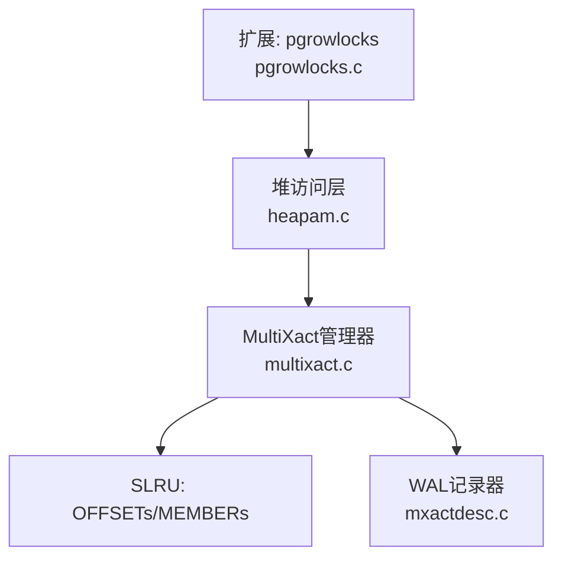
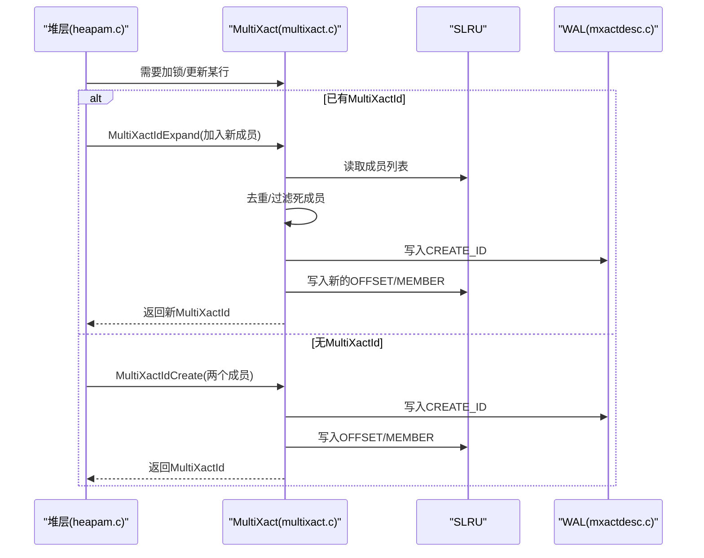
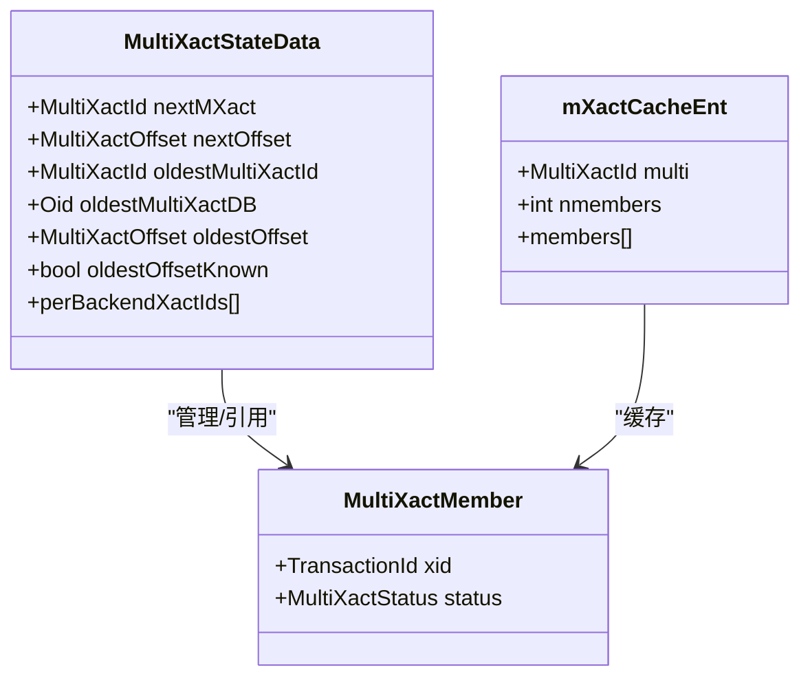
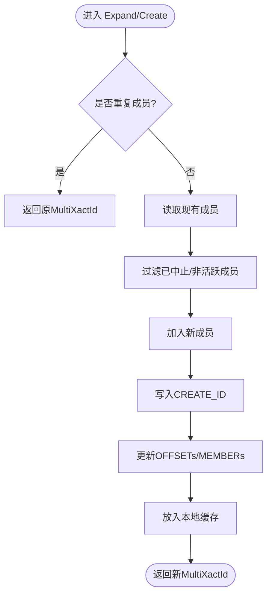
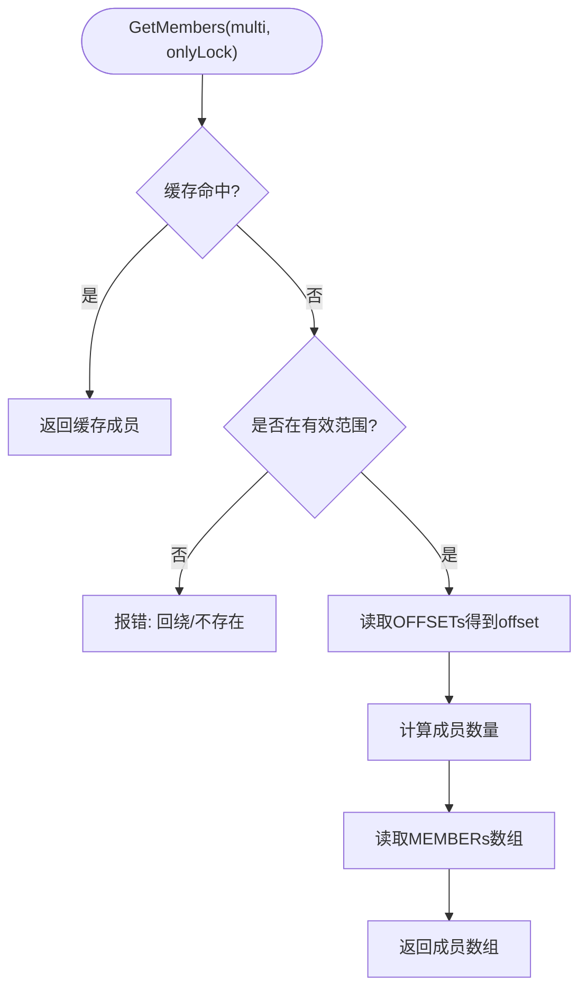
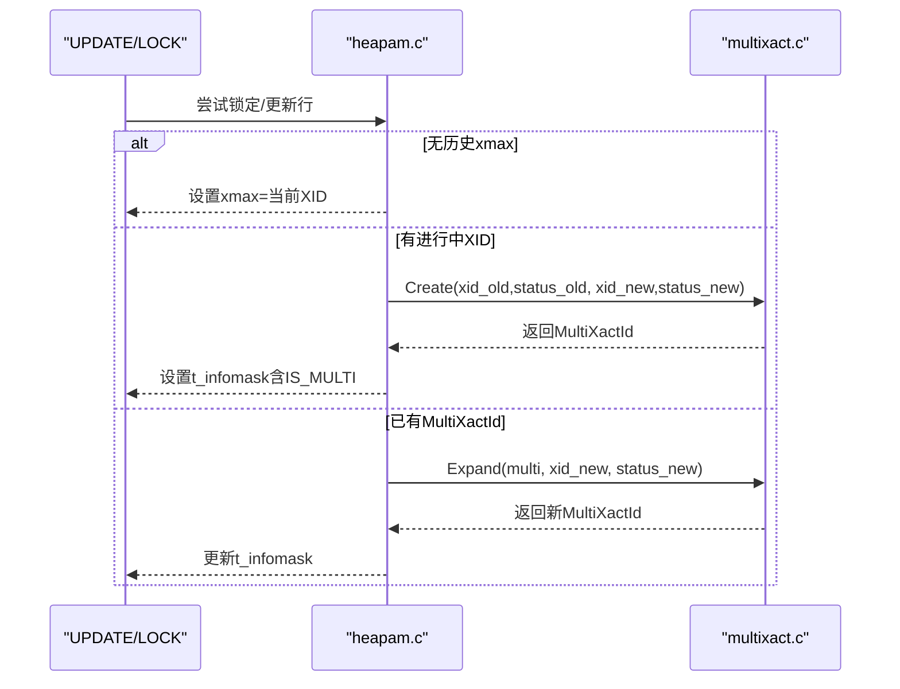
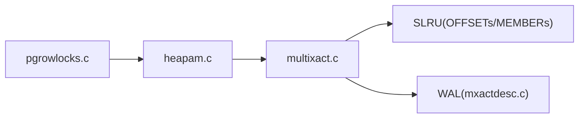

# 多事务ID系统

<cite>
**本文引用的文件**
- [multixact.h](file://src/include/access/multixact.h)
- [multixact.c](file://src/backend/access/transam/multixact.c)
- [heapam.c](file://src/backend/access/heap/heapam.c)
- [mxactdesc.c](file://src/backend/access/rmgrdesc/mxactdesc.c)
- [pgrowlocks.c](file://contrib/pgrowlocks/pgrowlocks.c)
</cite>

## 目录
1. [简介](#简介)
2. [项目结构](#项目结构)
3. [核心组件](#核心组件)
4. [架构总览](#架构总览)
5. [详细组件分析](#详细组件分析)
6. [依赖关系分析](#依赖关系分析)
7. [性能考量](#性能考量)
8. [故障排除指南](#故障排除指南)
9. [结论](#结论)
10. [附录](#附录)

## 简介
本文件面向PostgreSQL（及兼容实现）中的多事务ID（MultiXact）子系统，系统性阐述其设计目标、数据结构、与标准事务ID的关系、在UPDATE等写路径中的应用、锁升级机制、成员管理与状态维护、WAL持久化、以及监控与排错要点。MultiXact用于表达“多个事务同时修改或锁定同一行”的并发场景：当一行被多个事务以不同模式访问时，不再为每个事务单独记录xmax，而是将相关事务及其锁/更新状态打包为一个MultiXactId，并持久化到SLRU区域（OFFSETs与MEMBERs），从而支持高效的可见性判断与冲突检测。

## 项目结构
围绕MultiXact的关键代码分布在以下位置：
- 头文件定义：类型、枚举、WAL记录结构、对外接口
- 后端实现：MultiXact生命周期管理、成员读写、缓存、SLRU布局、WAL生成与回放
- 堆访问层：在加锁/更新路径中创建/扩展MultiXact，解析成员进行冲突检测
- WAL描述器：对MultiXact日志的可读描述
- 扩展工具：如pgrowlocks利用MultiXact信息展示行级锁持有者

图表来源
- [multixact.c:770-866](file://src/backend/access/transam/multixact.c#L770-L866)
- [heapam.c:5260-5459](file://src/backend/access/heap/heapam.c#L5260-L5459)
- [mxactdesc.c:55-105](file://src/backend/access/rmgrdesc/mxactdesc.c#L55-L105)

章节来源
- [multixact.h:19-64](file://src/include/access/multixact.h#L19-L64)
- [multixact.c:1-68](file://src/backend/access/transam/multixact.c#L1-L68)

## 核心组件
- MultiXactId与成员结构
  - MultiXactId：标识一组事务成员及其状态的句柄
  - MultiXactMember：包含一个TransactionId与其在该行上的状态（锁或更新）
  - 状态枚举：KeyShare/Share/NoKeyUpdate/Update等，区分只读锁与写操作
- SLRU存储
  - OFFSETs：每个MultiXactId对应一段起始偏移，用于定位MEMBERs数组
  - MEMBERs：按组存放成员XID与标志位，便于顺序读取与裁剪
- 共享状态与每后端状态
  - nextMXact/nextOffset：下一个待分配的MultiXactId与偏移
  - oldestMultiXactId/oldestOffset：可安全截断的边界
  - OldestMemberMXactId/OldestVisibleMXactId：每后端可见性/成员边界，避免访问已截断数据
- 本地缓存
  - 事务级缓存，减少SLRU访问次数
- WAL集成
  - CREATE_ID/TRUNCATE_ID/ZERO_PAGE等记录，保证崩溃恢复一致性

章节来源
- [multixact.h:19-165](file://src/include/access/multixact.h#L19-L165)
- [multixact.c:184-294](file://src/backend/access/transam/multixact.c#L184-L294)
- [multixact.c:313-324](file://src/backend/access/transam/multixact.c#L313-L324)

## 架构总览
MultiXact通过“索引+变长数组”的方式组织成员：每个MultiXactId在OFFSETs中保存起始偏移，MEMBERs中按固定组大小连续存放成员XID与标志位。创建/扩展时写入WAL并更新SLRU；读取时先查本地缓存，再根据偏移从SLRU加载成员。堆层在加锁/更新时决定是单事务xmax还是MultiXactId，并在必要时创建或扩展MultiXact。

图表来源
- [heapam.c:5260-5459](file://src/backend/access/heap/heapam.c#L5260-L5459)
- [multixact.c:389-550](file://src/backend/access/transam/multixact.c#L389-L550)
- [multixact.c:770-866](file://src/backend/access/transam/multixact.c#L770-L866)
- [mxactdesc.c:55-105](file://src/backend/access/rmgrdesc/mxactdesc.c#L55-L105)

## 详细组件分析

### 数据结构与状态模型
- MultiXactMember：{xid, status}，status表示该事务对该行的意图（锁或更新）
- MultiXactId范围：[FirstMultiXactId..MaxMultiXactId]，Invalid为0
- 共享状态：
  - nextMXact/nextOffset：分配计数器
  - oldestMultiXactId/oldestOffset：截断下界
  - per-backend OldestMemberMXactId/OldestVisibleMXactId：避免访问过期数据
- 本地缓存：mXactCacheEnt，事务内有效，降低SLRU压力

图表来源
- [multixact.h:41-64](file://src/include/access/multixact.h#L41-L64)
- [multixact.c:200-294](file://src/backend/access/transam/multixact.c#L200-L294)
- [multixact.c:313-324](file://src/backend/access/transam/multixact.c#L313-L324)

章节来源
- [multixact.h:19-64](file://src/include/access/multixact.h#L19-L64)
- [multixact.c:200-294](file://src/backend/access/transam/multixact.c#L200-L294)
- [multixact.c:313-324](file://src/backend/access/transam/multixact.c#L313-L324)

### 创建与扩展流程
- MultiXactIdCreate(xid1,status1,xid2,status2)：构造包含两个成员的MultiXactId
- MultiXactIdExpand(multi,xid,status)：向已有MultiXact添加成员，若成员重复且状态相同则直接复用；否则清理无效成员并创建新MultiXact
- 内部统一入口MultiXactIdCreateFromMembers：排序成员、写WAL、写SLRU、入缓存

图表来源
- [multixact.c:389-550](file://src/backend/access/transam/multixact.c#L389-L550)
- [multixact.c:770-866](file://src/backend/access/transam/multixact.c#L770-L866)

章节来源
- [multixact.c:389-550](file://src/backend/access/transam/multixact.c#L389-L550)
- [multixact.c:770-866](file://src/backend/access/transam/multixact.c#L770-L866)

### 成员读取与可见性检查
- GetMultiXactIdMembers：优先查本地缓存；若onlyLock且早于OldestVisibleMXactId可直接判定不可运行；否则从SLRU读取OFFSETs定位MEMBERs，计算长度并加载成员
- MultiXactIdIsRunning：遍历成员，若任一成员仍在运行则返回true；快速路径检查当前事务子事务

图表来源
- [multixact.c:1350-1549](file://src/backend/access/transam/multixact.c#L1350-L1549)
- [multixact.c:552-622](file://src/backend/access/transam/multixact.c#L552-L622)

章节来源
- [multixact.c:552-622](file://src/backend/access/transam/multixact.c#L552-L622)
- [multixact.c:1350-1549](file://src/backend/access/transam/multixact.c#L1350-L1549)

### 与标准事务ID的关系及UPDATE应用
- 当一行尚未被任何事务锁定/更新时，直接使用TransactionId作为xmax（单事务路径）
- 当出现并发冲突时，升级为MultiXactId：
  - 若已有MultiXactId：调用Expand加入新成员
  - 若已有提交更新但无锁：创建包含旧更新与新锁/更新的MultiXactId
  - 若已有进行中事务：创建包含两方的MultiXactId
- 堆层根据锁模式映射到MultiXactStatus，并在必要时保留“键列更新”标记

图表来源
- [heapam.c:5212-5459](file://src/backend/access/heap/heapam.c#L5212-L5459)
- [multixact.c:389-550](file://src/backend/access/transam/multixact.c#L389-L550)

章节来源
- [heapam.c:5212-5459](file://src/backend/access/heap/heapam.c#L5212-L5459)
- [multixact.c:389-550](file://src/backend/access/transam/multixact.c#L389-L550)

### 锁升级与冲突检测
- 锁模式映射：KeyShare/Share/NoKeyUpdate/Update等，分别对应不同的MultiXactStatus
- 冲突检测：读取MultiXact成员后，比较请求模式与成员模式，决定是否等待
- 自优化：若自身已在成员列表中且模式更强，可合并为单一最强模式

章节来源
- [multixact.h:41-57](file://src/include/access/multixact.h#L41-L57)
- [heapam.c:5260-5459](file://src/backend/access/heap/heapam.c#L5260-L5459)

### WAL与持久化
- 记录类型：ZERO_OFF_PAGE、ZERO_MEM_PAGE、CREATE_ID、TRUNCATE_ID
- CREATE_ID包含新MultiXactId、起始偏移、成员数与成员数组
- 回放：确保OFFSETs/MEMBERs重建一致，并推进nextMXact/nextOffset

章节来源
- [multixact.h:72-100](file://src/include/access/multixact.h#L72-L100)
- [mxactdesc.c:55-105](file://src/backend/access/rmgrdesc/mxactdesc.c#L55-L105)
- [multixact.c:837-866](file://src/backend/access/transam/multixact.c#L837-L866)

### 截断与冻结
- 基于每表/每库最小MultiXactId推进全局oldestMultiXactId，触发TruncateMultiXact
- 冻结：将过旧的MultiXactId从元组头移除（FreezeMultiXactId），减少后续可见性开销

章节来源
- [multixact.c:211-280](file://src/backend/access/transam/multixact.c#L211-L280)
- [multixact.c:1265-1301](file://src/backend/access/transam/multixact.c#L1265-L1301)

## 依赖关系分析
- 堆层依赖MultiXact进行并发控制与可见性判断
- MultiXact依赖SLRU进行成员持久化，依赖WAL保障一致性
- 扩展工具（如pgrowlocks）依赖MultiXact暴露的成员信息展示锁持有者

图表来源
- [heapam.c:5260-5459](file://src/backend/access/heap/heapam.c#L5260-L5459)
- [multixact.c:770-866](file://src/backend/access/transam/multixact.c#L770-L866)
- [mxactdesc.c:55-105](file://src/backend/access/rmgrdesc/mxactdesc.c#L55-L105)
- [pgrowlocks.c:180-231](file://contrib/pgrowlocks/pgrowlocks.c#L180-L231)

章节来源
- [pgrowlocks.c:180-231](file://contrib/pgrowlocks/pgrowlocks.c#L180-L231)

## 性能考量
- 本地缓存：事务级缓存显著减少SLRU访问，提升热点MultiXact的读取性能
- 快速路径：仅锁场景且早于OldestVisibleMXactId时可快速判定不可运行
- 成员裁剪：Expand时剔除已中止或非活跃成员，降低后续扫描成本
- 空间布局：MEMBERs按组存储，牺牲少量空间换取对齐与简单性，提高吞吐
- 反回绕阈值：成员与偏移设有安全/危险/停止阈值，防止计数器回绕导致的数据损坏

章节来源
- [multixact.c:296-324](file://src/backend/access/transam/multixact.c#L296-L324)
- [multixact.c:1398-1412](file://src/backend/access/transam/multixact.c#L1398-L1412)
- [multixact.c:176-179](file://src/backend/access/transam/multixact.c#L176-L179)

## 故障排除指南
- 常见错误
  - “MultiXactId 不存在/未创建——疑似回绕”：检查oldestMultiXactId与nextMXact边界，确认未发生未检测到的回绕
  - “无效的下一偏移”：检查WAL回放与SLRU一致性，必要时执行检查点或恢复
- 诊断步骤
  - 使用pgrowlocks查看行级锁持有者与MultiXact成员，确认是否存在长时间运行的事务
  - 检查autovacuum与vacuum_multixact_freeze_*参数，确保及时冻结与截断
  - 观察WAL描述输出，确认CREATE_ID/TRUNCATE_ID是否正常
- 处理建议
  - 调整vacuum参数以降低冻结年龄，避免MultiXact堆积
  - 排查长事务与锁竞争热点，优化SQL或业务逻辑以减少多事务并发修改同一行

章节来源
- [multixact.c:1414-1447](file://src/backend/access/transam/multixact.c#L1414-L1447)
- [multixact.c:1265-1301](file://src/backend/access/transam/multixact.c#L1265-L1301)
- [pgrowlocks.c:180-231](file://contrib/pgrowlocks/pgrowlocks.c#L180-L231)

## 结论
MultiXact通过成员集合与SLRU持久化，优雅地解决了多事务并发修改同一行的可见性与冲突问题。其设计兼顾了正确性（WAL与边界检查）、性能（缓存与快速路径）与可维护性（清晰的截断与冻结策略）。在实际运维中，应关注MultiXact增长趋势、长事务与锁竞争，并通过合理的vacuum策略与参数调优保持系统稳定高效。

## 附录
- 关键API速览
  - 创建/扩展：MultiXactIdCreate、MultiXactIdExpand、MultiXactIdCreateFromMembers
  - 查询：GetMultiXactIdMembers、MultiXactIdIsRunning
  - 生命周期：ReadNextMultiXactId、ReadMultiXactIdRange、SetMultiXactIdLimit、TruncateMultiXact
- 与堆层的交互要点
  - t_infomask中HEAP_XMAX_IS_MULTI标志指示使用MultiXactId
  - 锁模式到MultiXactStatus的映射与冲突检测在堆层完成

章节来源
- [multixact.h:103-165](file://src/include/access/multixact.h#L103-L165)
- [heapam.c:2687-2724](file://src/backend/access/heap/heapam.c#L2687-L2724)