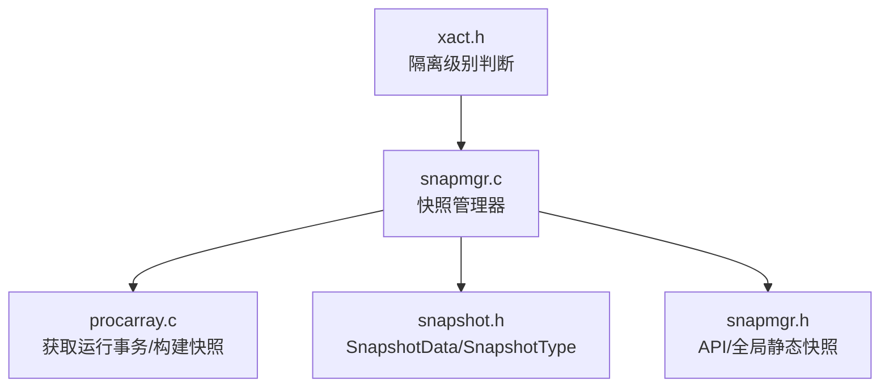
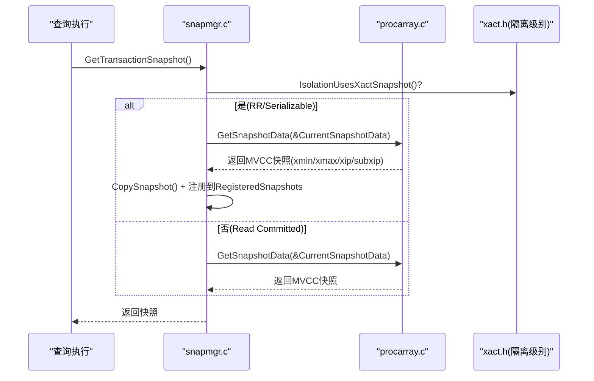
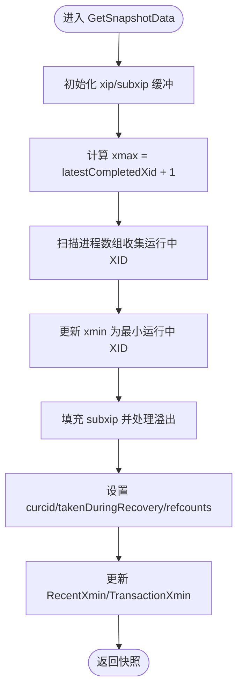
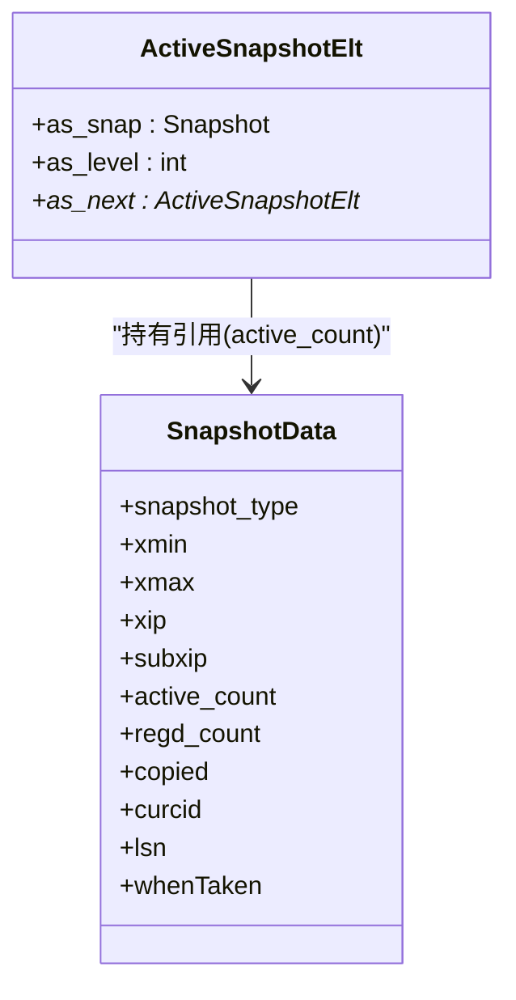
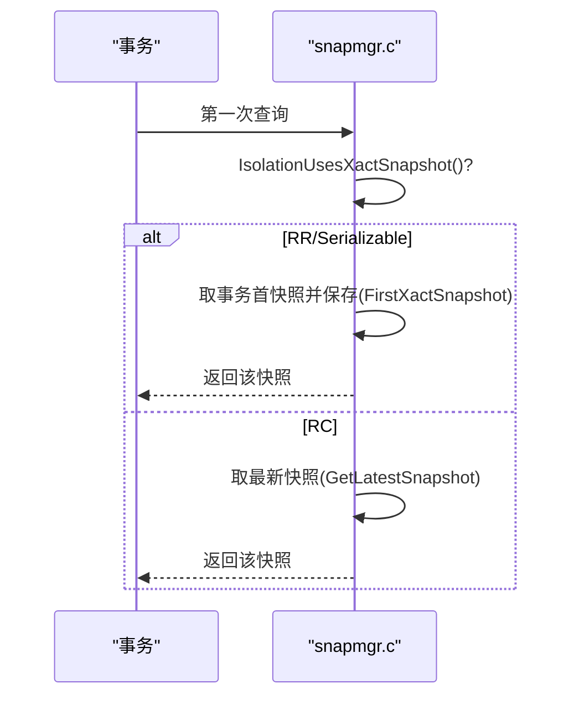
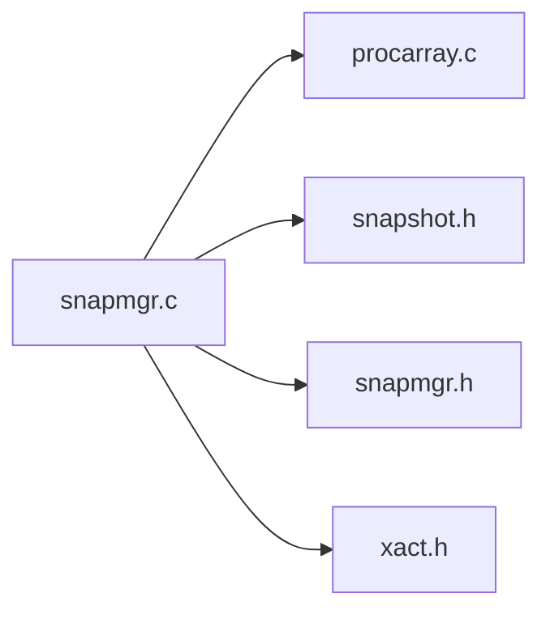

# 快照管理

<cite>
**本文引用的文件**
- [src/include/utils/snapshot.h](file://src/include/utils/snapshot.h)
- [src/include/utils/snapmgr.h](file://src/include/utils/snapmgr.h)
- [src/backend/utils/time/snapmgr.c](file://src/backend/utils/time/snapmgr.c)
- [src/backend/storage/ipc/procarray.c](file://src/backend/storage/ipc/procarray.c)
- [src/include/access/xact.h](file://src/include/access/xact.h)
</cite>

## 目录
1. [简介](#简介)
2. [项目结构](#项目结构)
3. [核心组件](#核心组件)
4. [架构总览](#架构总览)
5. [详细组件分析](#详细组件分析)
6. [依赖关系分析](#依赖关系分析)
7. [性能考虑](#性能考虑)
8. [故障排查指南](#故障排查指南)
9. [结论](#结论)
10. [附录](#附录)

## 简介
本文件围绕 PostgreSQL 的 MVCC 快照管理机制，系统阐述不同类型快照（SNAPSHOT_SELF、SNAPSHOT_ANY、SNAPSHOT_DIRTY 等）的实现机制与使用场景；解释快照的创建、维护与生命周期管理，包括 xmin/xmax 边界处理、活跃事务数组 xip 与子事务数组 subxip 的管理；说明快照与事务隔离级别的关系及并发行为差异；并提供快照性能优化与内存管理的最佳实践。

## 项目结构
与快照管理相关的核心代码分布在以下位置：
- 类型与接口定义：utils/snapshot.h、utils/snapmgr.h
- 快照管理器实现：backend/utils/time/snapmgr.c
- 获取运行事务信息并构建快照：backend/storage/ipc/procarray.c
- 隔离级别相关宏：access/xact.h

图表来源
- [src/backend/utils/time/snapmgr.c:249-317](file://src/backend/utils/time/snapmgr.c#L249-L317)
- [src/backend/storage/ipc/procarray.c:2248-2400](file://src/backend/storage/ipc/procarray.c#L2248-L2400)
- [src/include/utils/snapshot.h:35-119](file://src/include/utils/snapshot.h#L35-L119)
- [src/include/utils/snapmgr.h:61-98](file://src/include/utils/snapmgr.h#L61-L98)
- [src/include/access/xact.h:51-52](file://src/include/access/xact.h#L51-L52)

章节来源
- [src/include/utils/snapshot.h:35-119](file://src/include/utils/snapshot.h#L35-L119)
- [src/include/utils/snapmgr.h:61-98](file://src/include/utils/snapmgr.h#L61-L98)
- [src/backend/utils/time/snapmgr.c:249-317](file://src/backend/utils/time/snapmgr.c#L249-L317)
- [src/backend/storage/ipc/procarray.c:2248-2400](file://src/backend/storage/ipc/procarray.c#L2248-L2400)
- [src/include/access/xact.h:51-52](file://src/include/access/xact.h#L51-L52)

## 核心组件
- SnapshotData：统一表示各类快照的结构体，包含 snapshot_type、xmin、xmax、xip、subxip、curcid、lsn、whenTaken 等字段，用于 MVCC 可见性判定与特殊语义快照。
- SnapshotType：枚举不同快照语义，如 SNAPSHOT_MVCC、SNAPSHOT_SELF、SNAPSHOT_ANY、SNAPSHOT_TOAST、SNAPSHOT_DIRTY、SNAPSHOT_HISTORIC_MVCC、SNAPSHOT_NON_VACUUMABLE。
- 快照管理器 API：GetTransactionSnapshot、GetLatestSnapshot、PushActiveSnapshot/PopActiveSnapshot、RegisterSnapshot/UnregisterSnapshot、ExportSnapshot/ImportSnapshot 等。
- 全局静态快照：SnapshotSelfData、SnapshotAnyData、CatalogSnapshotData，避免重复分配，提高性能。
- 隔离级别影响：IsolationUsesXactSnapshot() 决定是否采用事务级快照（REPEATABLE READ/Serializable）。

章节来源
- [src/include/utils/snapshot.h:121-217](file://src/include/utils/snapshot.h#L121-L217)
- [src/include/utils/snapmgr.h:108-177](file://src/include/utils/snapmgr.h#L108-L177)
- [src/backend/utils/time/snapmgr.c:95-105](file://src/backend/utils/time/snapmgr.c#L95-L105)
- [src/include/access/xact.h:51-52](file://src/include/access/xact.h#L51-L52)

## 架构总览
PostgreSQL 通过 snapmgr.c 提供统一的快照生命周期管理，procarray.c 负责收集当前运行中的事务信息以构造 MVCC 快照。快照管理器维护“活动快照栈”和“注册快照堆”，并通过 refcount（active_count、regd_count）控制内存释放。隔离级别决定是否复用事务首快照或每命令取最新快照。

图表来源
- [src/backend/utils/time/snapmgr.c:249-317](file://src/backend/utils/time/snapmgr.c#L249-L317)
- [src/backend/storage/ipc/procarray.c:2248-2400](file://src/backend/storage/ipc/procarray.c#L2248-L2400)
- [src/include/access/xact.h:51-52](file://src/include/access/xact.h#L51-L52)

## 详细组件分析

### 快照类型与语义
- SNAPSHOT_MVCC：标准 MVCC 可见性，基于 xmin/xmax 与 xip 列表判断。
- SNAPSHOT_SELF：仅对“自身可见”，包含已提交事务、当前事务之前命令以及当前命令的修改，但不包含其他进行中的事务。
- SNAPSHOT_ANY：任何元组均可见，常用于内部扫描或统计。
- SNAPSHOT_TOAST：针对 TOAST 行的可见性规则。
- SNAPSHOT_DIRTY：包含进行中的事务效果，并将影响元组的并发事务 XID 回写到 snapshot->xmin/xmax/speculativeToken，用于脏读场景。
- SNAPSHOT_HISTORIC_MVCC：历史 MVCC，用于逻辑解码时的时间旅行。
- SNAPSHOT_NON_VACUUMABLE：判断元组是否可被清理（vacuumable），需要 vistest 上下文。

章节来源
- [src/include/utils/snapshot.h:35-119](file://src/include/utils/snapshot.h#L35-L119)
- [src/include/utils/snapmgr.h:74-98](file://src/include/utils/snapmgr.h#L74-L98)

### 快照数据结构与关键字段
- SnapshotData：
  - snapshot_type：快照类型
  - xmin/xmax：可见性边界，所有小于 xmin 的 XID 可见，大于等于 xmax 的不可见
  - xip/xcnt：进行中事务 ID 列表（xmin <= xid < xmax）
  - subxip/subxcnt/suboverflowed：子事务 ID 列表及其溢出标记
  - curcid：当前命令 ID，用于同事务内命令间可见性
  - takenDuringRecovery/copied：恢复期快照与复制标记
  - active_count/regd_count：引用计数，控制释放
  - lsn/whenTaken/snapXactCompletionCount：用于旧快照阈值与缓存优化

章节来源
- [src/include/utils/snapshot.h:142-217](file://src/include/utils/snapshot.h#L142-L217)

### 快照创建流程（GetSnapshotData）
- 初始化 xip/subxip 缓冲区（首次调用时分配）
- 计算 xmax = latestCompletedXid + 1
- 遍历进程数组，收集运行中事务 XID，排除自身、逻辑解码、LAZY VACUUM 等
- 更新 xmin 为最小运行中 XID（含自身）
- 填充 subxip（尽可能包含子事务，若溢出则标记 suboverflowed）
- 设置 curcid、takenDuringRecovery、active_count、regd_count、copied 等
- 更新全局 RecentXmin/TransactionXmin，并维护旧快照映射

图表来源
- [src/backend/storage/ipc/procarray.c:2248-2400](file://src/backend/storage/ipc/procarray.c#L2248-L2400)

章节来源
- [src/backend/storage/ipc/procarray.c:2248-2400](file://src/backend/storage/ipc/procarray.c#L2248-L2400)

### 快照生命周期管理
- 活动快照栈（ActiveSnapshot）：PushActiveSnapshot/PopActiveSnapshot 管理栈式引用，支持嵌套层级 with level
- 注册快照堆（RegisteredSnapshots）：按 xmin 排序，便于快速定位最老快照并推进 MyProc->xmin
- 引用计数：active_count（活动栈）与 regd_count（注册表）共同决定何时释放
- 事务结束清理：AtEOXact_Snapshot 清理 FirstXactSnapshot、导出快照文件、目录快照等

图表来源
- [src/backend/utils/time/snapmgr.c:126-135](file://src/backend/utils/time/snapmgr.c#L126-L135)
- [src/include/utils/snapshot.h:142-217](file://src/include/utils/snapshot.h#L142-L217)

章节来源
- [src/backend/utils/time/snapmgr.c:674-796](file://src/backend/utils/time/snapmgr.c#L674-L796)
- [src/backend/utils/time/snapmgr.c:820-900](file://src/backend/utils/time/snapmgr.c#L820-L900)
- [src/backend/utils/time/snapmgr.c:1018-1113](file://src/backend/utils/time/snapmgr.c#L1018-L1113)

### 隔离级别与快照行为
- REPEATABLE READ / Serializable：使用事务级快照（FirstXactSnapshot），同一事务内多次查询复用同一快照
- Read Committed：每次查询获取最新快照（GetLatestSnapshot）
- 导入/导出快照：ExportSnapshot/ImportSnapshot 支持跨后端共享快照，用于一致性备份或并行读取

图表来源
- [src/backend/utils/time/snapmgr.c:249-317](file://src/backend/utils/time/snapmgr.c#L249-L317)
- [src/include/access/xact.h:51-52](file://src/include/access/xact.h#L51-L52)

章节来源
- [src/backend/utils/time/snapmgr.c:249-317](file://src/backend/utils/time/snapmgr.c#L249-L317)
- [src/include/access/xact.h:51-52](file://src/include/access/xact.h#L51-L52)

### 特殊快照：SNAPSHOT_DIRTY 的使用
- 用途：在可见性检查中包含进行中的事务效果，并将影响元组的并发事务 XID 写回 snapshot->xmin/xmax/speculativeToken
- 初始化：使用 InitDirtySnapshot 宏设置类型为 SNAPSHOT_DIRTY
- 注意：非 MVCC 快照，不依赖 xip/subxip 常规路径

章节来源
- [src/include/utils/snapmgr.h:74-75](file://src/include/utils/snapmgr.h#L74-L75)
- [src/include/utils/snapshot.h:76-102](file://src/include/utils/snapshot.h#L76-L102)

### 快照导出与导入
- ExportSnapshot：将快照序列化为文本文件，包含 vxid/pid/dbid/iso/ro、xmin/xmax、xip、subxip、sof/rec 等
- ImportSnapshot：解析文件并安装为当前事务的快照，要求 SERIALIZABLE/REPEATABLE READ，且不能跨库导入
- 清理：AtEOXact_Snapshot 删除导出文件并从 RegisteredSnapshots 移除

章节来源
- [src/backend/utils/time/snapmgr.c:1116-1292](file://src/backend/utils/time/snapmgr.c#L1116-L1292)
- [src/backend/utils/time/snapmgr.c:1387-1562](file://src/backend/utils/time/snapmgr.c#L1387-L1562)
- [src/backend/utils/time/snapmgr.c:1018-1113](file://src/backend/utils/time/snapmgr.c#L1018-L1113)

## 依赖关系分析
- snapmgr.c 依赖 procarray.c 提供的运行事务信息以构建 MVCC 快照
- snapmgr.c 依赖 snapshot.h 定义的 SnapshotData/SnapshotType
- snapmgr.c 依赖 xact.h 的隔离级别判断以决定快照策略
- 全局静态快照（SnapshotSelfData、SnapshotAnyData、CatalogSnapshotData）减少分配开销

图表来源
- [src/backend/utils/time/snapmgr.c:249-317](file://src/backend/utils/time/snapmgr.c#L249-L317)
- [src/backend/storage/ipc/procarray.c:2248-2400](file://src/backend/storage/ipc/procarray.c#L2248-L2400)
- [src/include/utils/snapshot.h:35-119](file://src/include/utils/snapshot.h#L35-L119)
- [src/include/utils/snapmgr.h:61-98](file://src/include/utils/snapmgr.h#L61-L98)
- [src/include/access/xact.h:51-52](file://src/include/access/xact.h#L51-L52)

章节来源
- [src/backend/utils/time/snapmgr.c:249-317](file://src/backend/utils/time/snapmgr.c#L249-L317)
- [src/backend/storage/ipc/procarray.c:2248-2400](file://src/backend/storage/ipc/procarray.c#L2248-L2400)
- [src/include/utils/snapshot.h:35-119](file://src/include/utils/snapshot.h#L35-L119)
- [src/include/utils/snapmgr.h:61-98](file://src/include/utils/snapmgr.h#L61-L98)
- [src/include/access/xact.h:51-52](file://src/include/access/xact.h#L51-L52)

## 性能考虑
- 复用静态快照：SnapshotSelfData、SnapshotAnyData、CatalogSnapshotData 避免频繁分配
- 快照缓存：snapXactCompletionCount 避免无事务完成时重复计算静态快照
- 子事务溢出：suboverflowed 标记下减少 subxip 拷贝与处理成本
- 旧快照阈值：old_snapshot_threshold 控制旧快照保留时间，平衡可见性与空间占用
- 活动栈与注册堆：按 xmin 排序快速推进 MyProc->xmin，减少无效可见性检查

[本节为通用指导，无需具体文件引用]

## 故障排查指南
- 导入快照失败：检查隔离级别是否为 REPEATABLE READ/Serializable，源事务是否仍在运行，数据库是否一致
- 导出快照后残留文件：确认 AtEOXact_Snapshot 是否正确清理 exportedSnapshots
- 快照未释放：检查 active_count/regd_count 是否正确递减，确保 PopActiveSnapshot/UnregisterSnapshot 成对调用
- 可见性异常：核对 xmin/xmax 边界与 xip/subxip 内容，确认 takenDuringRecovery 与 curcid 设置正确

章节来源
- [src/backend/utils/time/snapmgr.c:1387-1562](file://src/backend/utils/time/snapmgr.c#L1387-L1562)
- [src/backend/utils/time/snapmgr.c:1018-1113](file://src/backend/utils/time/snapmgr.c#L1018-L1113)
- [src/backend/utils/time/snapmgr.c:820-900](file://src/backend/utils/time/snapmgr.c#L820-L900)

## 结论
PostgreSQL 的快照管理系统通过统一的 SnapshotData 结构与完善的生命周期管理，支持多种快照语义以满足不同并发与一致性需求。MVCC 快照由 procarray.c 构建，snapmgr.c 负责注册、激活、导出/导入与释放。合理配置隔离级别、利用静态快照与快照缓存、关注子事务溢出与旧快照阈值，可在保证一致性的同时提升性能与资源利用率。

[本节为总结，无需具体文件引用]

## 附录
- 关键 API 速查：
  - 获取快照：GetTransactionSnapshot、GetLatestSnapshot
  - 活动栈：PushActiveSnapshot、PopActiveSnapshot、UpdateActiveSnapshotCommandId
  - 注册/注销：RegisterSnapshot、UnregisterSnapshot
  - 导出/导入：ExportSnapshot、ImportSnapshot
  - 目录快照：GetCatalogSnapshot、InvalidateCatalogSnapshot
- 关键常量/宏：
  - IsolationUsesXactSnapshot、IsolationIsSerializable
  - InitDirtySnapshot、InitNonVacuumableSnapshot、InitToastSnapshot
  - OldSnapshotThresholdActive

章节来源
- [src/include/utils/snapmgr.h:108-177](file://src/include/utils/snapmgr.h#L108-L177)
- [src/include/access/xact.h:51-52](file://src/include/access/xact.h#L51-L52)