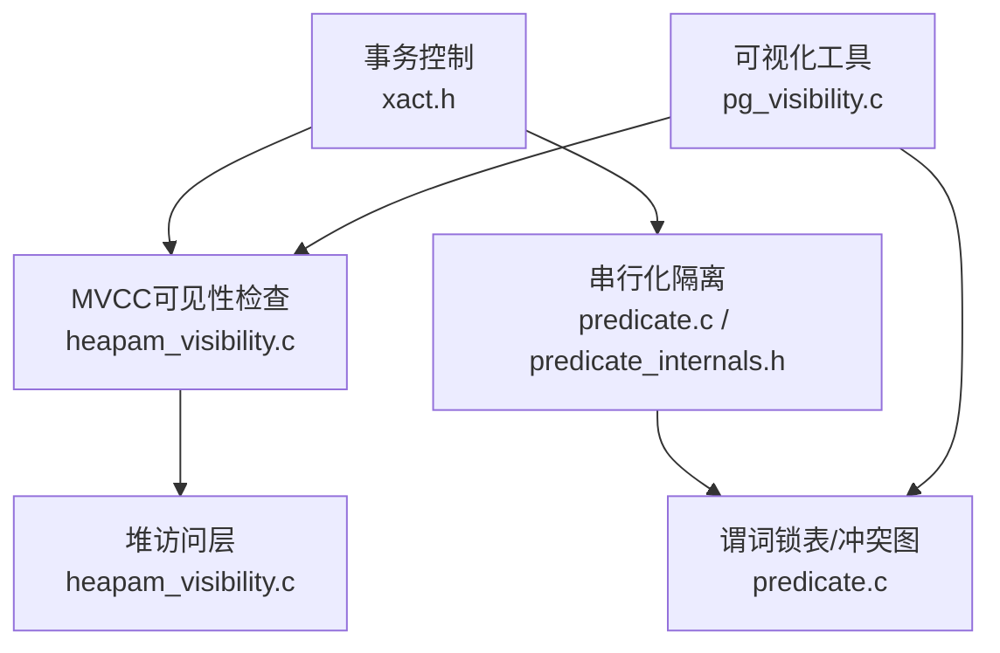
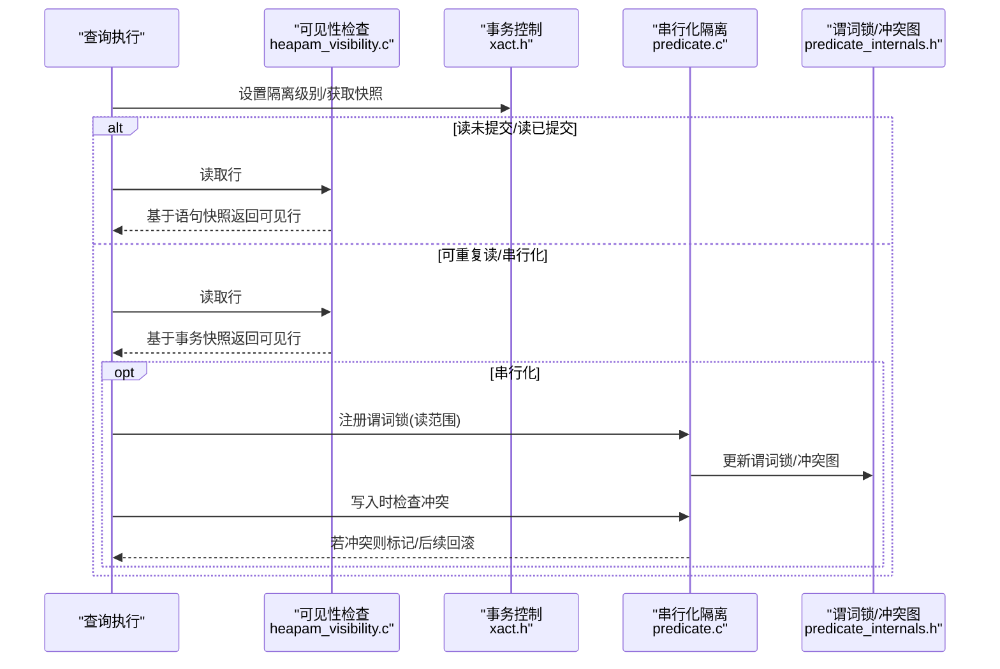
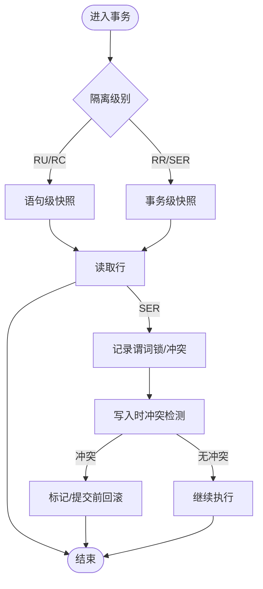
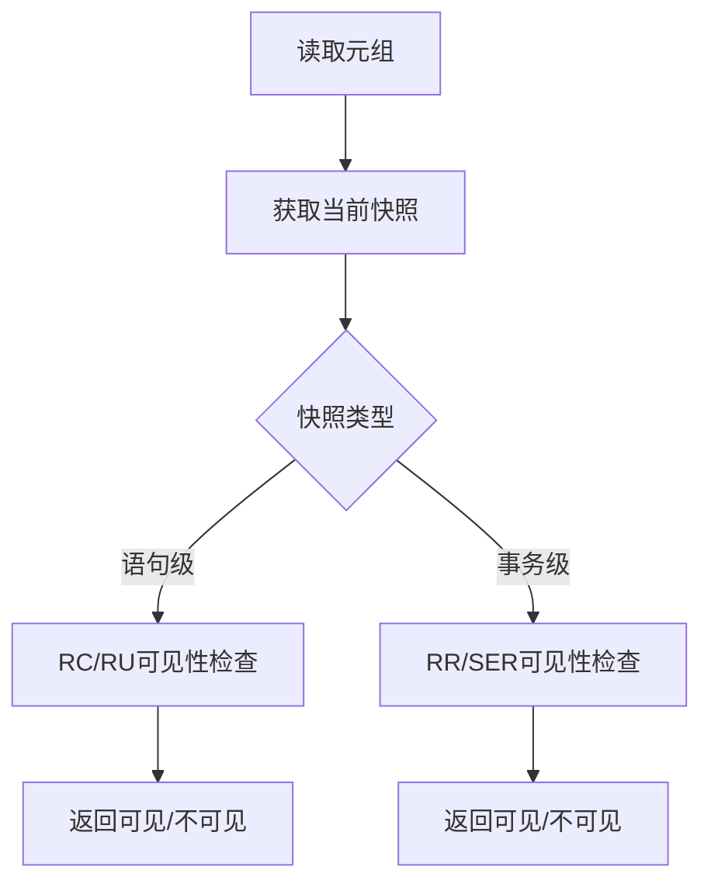
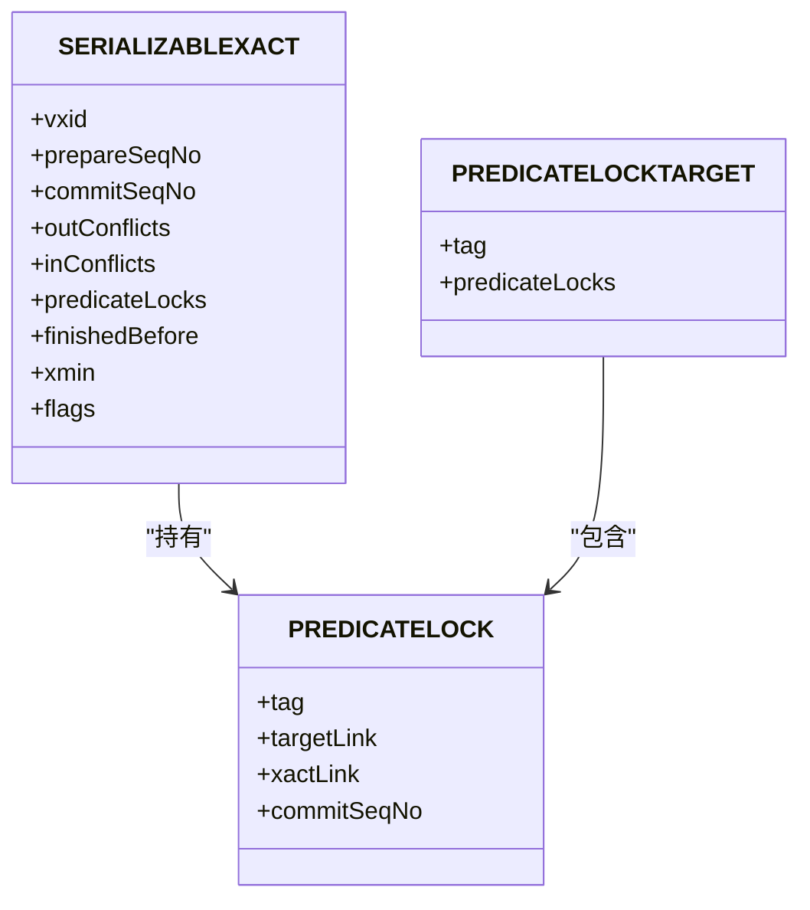
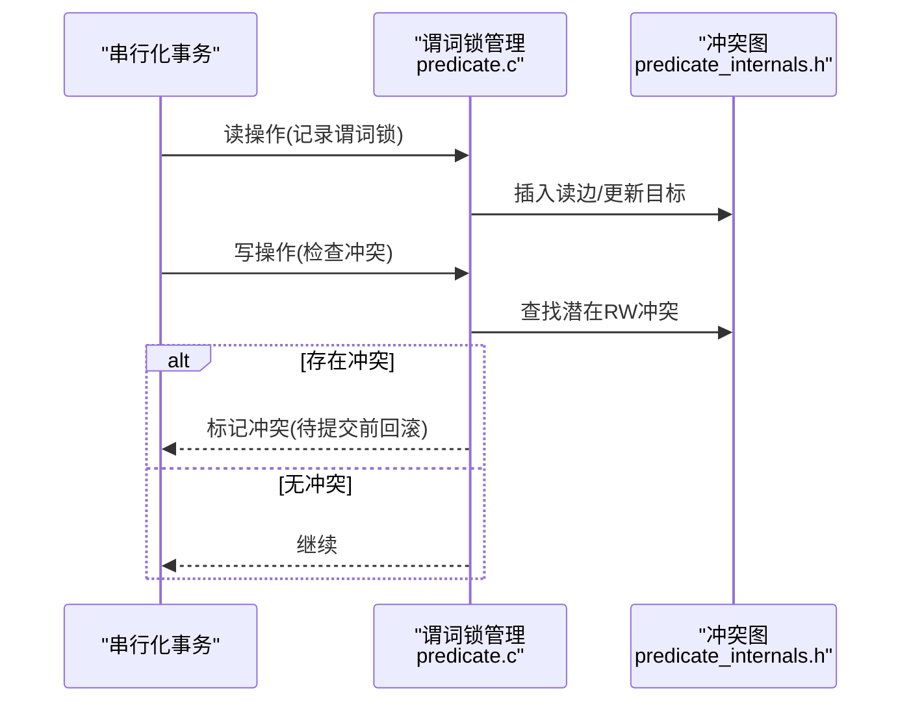
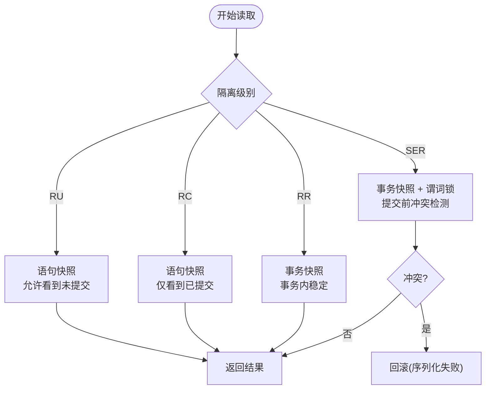
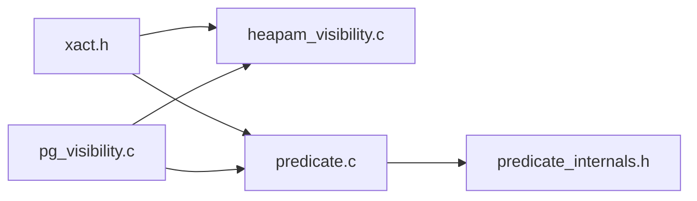

# 隔离级别实现

<cite>
**本文引用的文件**
- [xact.h](file://src/include/access/xact.h)
- [predicate.c](file://src/backend/storage/lmgr/predicate.c)
- [predicate_internals.h](file://src/include/storage/predicate_internals.h)
- [heapam_visibility.c](file://src/backend/access/heap/heapam_visibility.c)
- [pg_visibility.c](file://contrib/pg_visibility/pg_visibility.c)
</cite>

## 目录
1. [简介](#简介)
2. [项目结构](#项目结构)
3. [核心组件](#核心组件)
4. [架构总览](#架构总览)
5. [详细组件分析](#详细组件分析)
6. [依赖关系分析](#依赖关系分析)
7. [性能考量](#性能考量)
8. [故障排查指南](#故障排查指南)
9. [结论](#结论)
10. [附录](#附录)

## 简介
本文件聚焦于PostgreSQL中事务隔离级别的实现机制，重点解释四种隔离级别（读未提交、读已提交、可重复读、串行化）在代码层面的可见性规则、冲突检测与异常处理。同时给出不同隔离级别对查询性能与数据一致性的影响，以及在不同应用场景下的选择建议，并提供相关测试方法与问题诊断工具的使用指引。

## 项目结构
围绕隔离级别的核心实现分布在以下模块：
- 事务与隔离级别定义：位于事务系统头文件，定义了隔离级别常量与判断宏。
- 可重复读/串行化的快照与可见性：由MVCC子系统提供，读取时依据当前快照判定行可见性。
- 串行化隔离的谓词锁与冲突检测：通过共享内存中的谓词锁表、事务状态与冲突图，检测读写冲突并可能回滚事务。
- 可视化工具：扩展模块提供查看可见性与锁状态的接口，便于测试与排障。

图表来源
- [xact.h:33-52](file://src/include/access/xact.h#L33-L52)
- [predicate.c:1-191](file://src/backend/storage/lmgr/predicate.c#L1-L191)
- [predicate_internals.h:57-116](file://src/include/storage/predicate_internals.h#L57-L116)
- [heapam_visibility.c:1-200](file://src/backend/access/heap/heapam_visibility.c#L1-L200)
- [pg_visibility.c:1-120](file://contrib/pg_visibility/pg_visibility.c#L1-L120)

章节来源
- [xact.h:33-52](file://src/include/access/xact.h#L33-L52)
- [predicate.c:1-191](file://src/backend/storage/lmgr/predicate.c#L1-L191)
- [predicate_internals.h:57-116](file://src/include/storage/predicate_internals.h#L57-L116)
- [heapam_visibility.c:1-200](file://src/backend/access/heap/heapam_visibility.c#L1-L200)
- [pg_visibility.c:1-120](file://contrib/pg_visibility/pg_visibility.c#L1-L120)

## 核心组件
- 隔离级别定义与判断
  - 定义了四种隔离级别常量与两个关键宏：是否使用事务级快照、是否为串行化级别。
  - 这些宏用于在运行时决定快照策略与是否需要谓词锁跟踪。
- MVCC可见性检查
  - 基于当前语句或事务快照，结合行的xmin/xmax与提交信息，判定行对当前事务是否可见。
  - 读未提交/读已提交使用语句级快照；可重复读/串行化使用事务级快照。
- 串行化隔离的谓词锁与冲突检测
  - 为串行化事务维护谓词锁（SIREAD），记录读范围与写范围，构建读写冲突图。
  - 检测到循环依赖或特定RW冲突时，将标记并可能在提交前触发序列化失败回滚。

章节来源
- [xact.h:33-52](file://src/include/access/xact.h#L33-L52)
- [heapam_visibility.c:1-200](file://src/backend/access/heap/heapam_visibility.c#L1-L200)
- [predicate.c:1-191](file://src/backend/storage/lmgr/predicate.c#L1-L191)
- [predicate_internals.h:57-116](file://src/include/storage/predicate_internals.h#L57-L116)

## 架构总览
下图展示了从SQL执行到可见性判定与串行化冲突检测的整体流程。

图表来源
- [xact.h:33-52](file://src/include/access/xact.h#L33-L52)
- [heapam_visibility.c:1-200](file://src/backend/access/heap/heapam_visibility.c#L1-L200)
- [predicate.c:1-191](file://src/backend/storage/lmgr/predicate.c#L1-L191)
- [predicate_internals.h:57-116](file://src/include/storage/predicate_internals.h#L57-L116)

## 详细组件分析

### 隔离级别定义与快照策略
- 读未提交（RU）
  - 行为：允许看到其他事务未提交的修改（非标准行为）。
  - 实现要点：语句级快照，不等待提交即可读取最新元组版本。
- 读已提交（RC）
  - 行为：每次语句开始时创建新快照，保证语句内一致性。
  - 实现要点：语句级快照，可见性基于当前语句时间戳。
- 可重复读（RR）
  - 行为：整个事务使用同一快照，保证事务内读一致性。
  - 实现要点：事务级快照，可见性基于事务开始时间戳。
- 串行化（SER）
  - 行为：最强一致性，通过快照+谓词锁检测读写冲突，必要时回滚。
  - 实现要点：事务级快照 + 谓词锁（SIREAD） + 冲突图 + 提交前检查。

图表来源
- [xact.h:33-52](file://src/include/access/xact.h#L33-L52)
- [predicate.c:1-191](file://src/backend/storage/lmgr/predicate.c#L1-L191)
- [predicate_internals.h:57-116](file://src/include/storage/predicate_internals.h#L57-L116)

章节来源
- [xact.h:33-52](file://src/include/access/xact.h#L33-L52)

### MVCC可见性检查（RU/RC/RR）
- 可见性规则
  - 根据行的xmin/xmax与当前快照的xmin/xmax及提交信息，判定行是否可见。
  - RU/RC使用语句快照；RR/SER使用事务快照。
- 实现位置
  - 堆层的可见性函数负责具体判定逻辑，调用快照信息与提交日志进行过滤。

图表来源
- [heapam_visibility.c:1-200](file://src/backend/access/heap/heapam_visibility.c#L1-L200)

章节来源
- [heapam_visibility.c:1-200](file://src/backend/access/heap/heapam_visibility.c#L1-L200)

### 串行化隔离的谓词锁与冲突检测（SER）
- 谓词锁（SIREAD）
  - 记录读范围（表/页/元组），避免“先读后写”的RW冲突被遗漏。
  - 支持粒度提升（细粒度合并为粗粒度）以节省空间。
- 冲突图与检测
  - 维护读写冲突关系（inConflicts/outConflicts），检测循环依赖。
  - 在提交前进行最终检查，若发现冲突则触发序列化失败回滚。
- 数据结构
  - SERIALIZABLEXACT：每个串行化事务的状态对象，包含xmin、标志位、冲突列表等。
  - PREDICATELOCKTARGET/PREDICATELOCK：目标与锁项，组织在哈希表中。

图表来源
- [predicate_internals.h:57-116](file://src/include/storage/predicate_internals.h#L57-L116)
- [predicate_internals.h:282-343](file://src/include/storage/predicate_internals.h#L282-L343)

图表来源
- [predicate.c:1-191](file://src/backend/storage/lmgr/predicate.c#L1-L191)
- [predicate_internals.h:57-116](file://src/include/storage/predicate_internals.h#L57-L116)

章节来源
- [predicate.c:1-191](file://src/backend/storage/lmgr/predicate.c#L1-L191)
- [predicate_internals.h:57-116](file://src/include/storage/predicate_internals.h#L57-L116)

### 可见性检查流程图（按隔离级别）

图表来源
- [xact.h:33-52](file://src/include/access/xact.h#L33-L52)
- [heapam_visibility.c:1-200](file://src/backend/access/heap/heapam_visibility.c#L1-L200)
- [predicate.c:1-191](file://src/backend/storage/lmgr/predicate.c#L1-L191)

## 依赖关系分析
- 事务控制与可见性
  - xact.h定义的隔离级别宏驱动快照策略，影响heapam_visibility.c中的可见性判定。
- 串行化隔离依赖
  - predicate.c与predicate_internals.h共同实现谓词锁与冲突图，依赖事务ID、提交序列号等基础信息。
- 可视化工具
  - pg_visibility.c提供视图/函数，暴露可见性与锁状态，辅助测试与诊断。

图表来源
- [xact.h:33-52](file://src/include/access/xact.h#L33-L52)
- [heapam_visibility.c:1-200](file://src/backend/access/heap/heapam_visibility.c#L1-L200)
- [predicate.c:1-191](file://src/backend/storage/lmgr/predicate.c#L1-L191)
- [predicate_internals.h:57-116](file://src/include/storage/predicate_internals.h#L57-L116)
- [pg_visibility.c:1-120](file://contrib/pg_visibility/pg_visibility.c#L1-L120)

章节来源
- [xact.h:33-52](file://src/include/access/xact.h#L33-L52)
- [heapam_visibility.c:1-200](file://src/backend/access/heap/heapam_visibility.c#L1-L200)
- [predicate.c:1-191](file://src/backend/storage/lmgr/predicate.c#L1-L191)
- [predicate_internals.h:57-116](file://src/include/storage/predicate_internals.h#L57-L116)
- [pg_visibility.c:1-120](file://contrib/pg_visibility/pg_visibility.c#L1-L120)

## 性能考量
- 读未提交（RU）
  - 优点：读取无需等待，吞吐高。
  - 缺点：可能读到脏数据，一致性最弱。
- 读已提交（RC）
  - 优点：语句级一致性，兼顾性能与一致性。
  - 缺点：事务内多次读取可能看到不一致视图。
- 可重复读（RR）
  - 优点：事务级快照，避免幻读/不可重复读。
  - 缺点：快照维护成本略增，长事务可能增加回溯开销。
- 串行化（SER）
  - 优点：最强一致性，避免所有并发异常。
  - 缺点：谓词锁与冲突检测带来额外CPU与内存开销，可能出现序列化失败回滚，需应用层重试。

[本节为通用指导，不直接分析具体文件]

## 故障排查指南
- 常见问题
  - 序列化失败：串行化事务在提交前检测到读写冲突，导致回滚。需检查业务逻辑是否存在潜在的RW冲突路径，或考虑降低隔离级别。
  - 可见性问题：确认隔离级别与快照类型是否符合预期；使用可视化工具检查行可见性与锁状态。
- 诊断工具
  - 使用pg_visibility扩展提供的函数/视图，观察行可见性、死元组情况与锁占用。
  - 结合事务日志与错误码，定位冲突点与回滚原因。

章节来源
- [pg_visibility.c:1-120](file://contrib/pg_visibility/pg_visibility.c#L1-L120)

## 结论
- 隔离级别的选择需在一致性与性能之间权衡：RU/RC适合高吞吐场景，RR适合需要事务内一致性的场景，SER适合强一致性要求但可接受重试的场景。
- 实现上，RU/RC/RR依赖MVCC快照，SER在此基础上引入谓词锁与冲突检测，确保串行化语义。
- 通过可视化工具与日志分析，可有效定位可见性与冲突问题，优化应用逻辑与配置。

[本节为总结，不直接分析具体文件]

## 附录
- 术语
  - 快照：某一时间点的数据视图，用于保证一致性。
  - 谓词锁：记录读范围，用于检测“先读后写”的RW冲突。
  - 冲突图：记录事务间的读写依赖关系，用于检测循环依赖。
- 参考路径
  - 隔离级别定义与判断宏：[xact.h:33-52](file://src/include/access/xact.h#L33-L52)
  - 可见性检查实现：[heapam_visibility.c:1-200](file://src/backend/access/heap/heapam_visibility.c#L1-L200)
  - 串行化隔离核心：[predicate.c:1-191](file://src/backend/storage/lmgr/predicate.c#L1-L191), [predicate_internals.h:57-116](file://src/include/storage/predicate_internals.h#L57-L116)
  - 可视化工具：[pg_visibility.c:1-120](file://contrib/pg_visibility/pg_visibility.c#L1-L120)