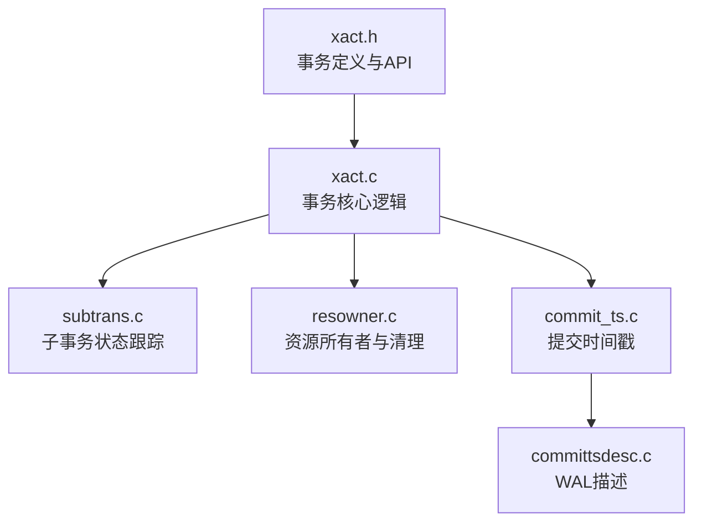
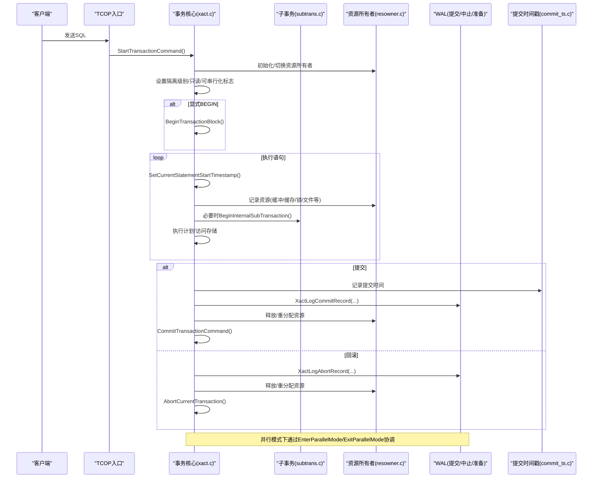
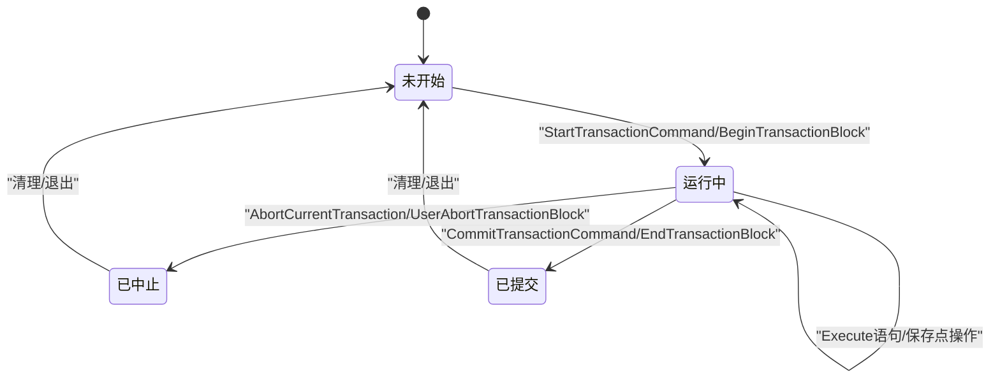
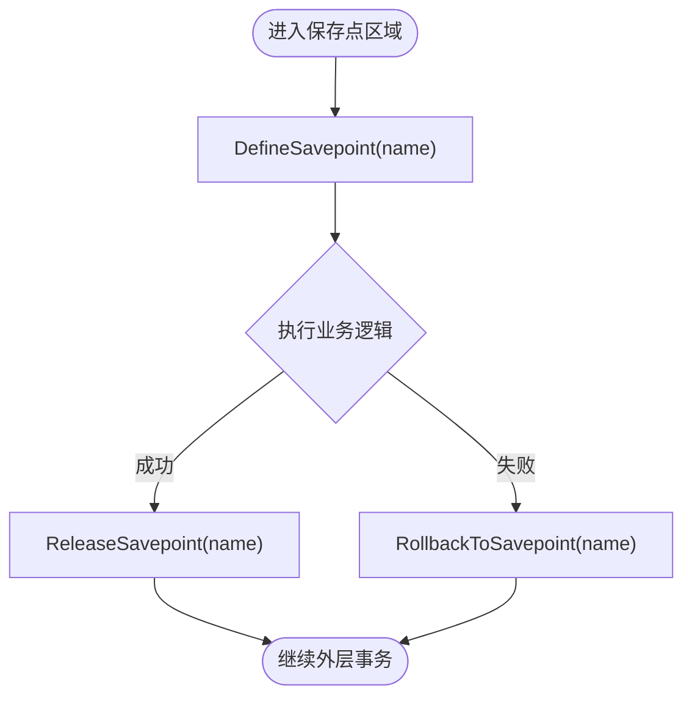
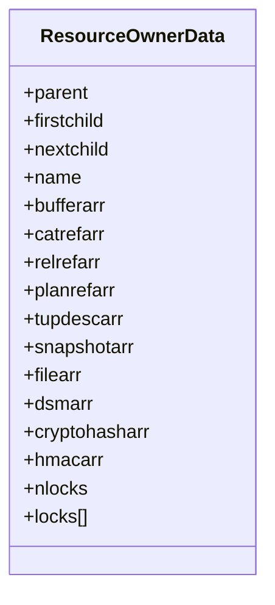
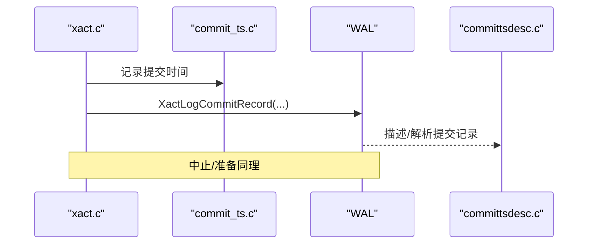
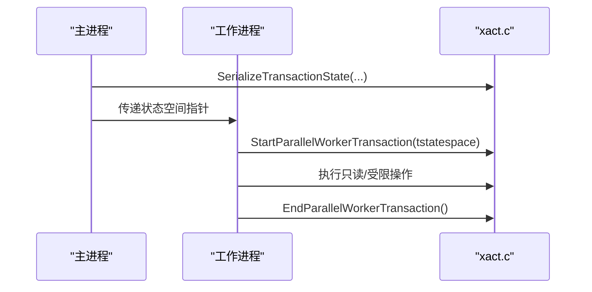
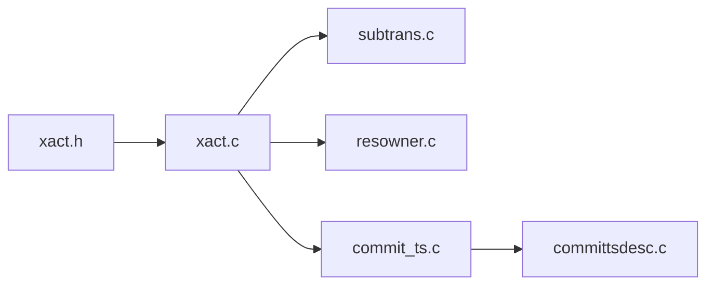

# 事务生命周期管理

<cite>
**本文引用的文件**
- [xact.h](file://src/include/access/xact.h)
- [xact.c](file://src/backend/access/transam/xact.c)
- [subtrans.c](file://src/backend/access/transam/subtrans.c)
- [resowner.c](file://src/backend/utils/resowner/resowner.c)
- [commit_ts.c](file://src/backend/access/transam/commit_ts.c)
- [committsdesc.c](file://src/backend/access/rmgrdesc/committsdesc.c)
</cite>

## 目录
1. [简介](#简介)
2. [项目结构](#项目结构)
3. [核心组件](#核心组件)
4. [架构总览](#架构总览)
5. [详细组件分析](#详细组件分析)
6. [依赖关系分析](#依赖关系分析)
7. [性能考量](#性能考量)
8. [故障排查指南](#故障排查指南)
9. [结论](#结论)
10. [附录](#附录)

## 简介
本文件系统性阐述 PostgreSQL 事务从启动到结束的完整生命周期，覆盖事务状态机、嵌套事务与保存点机制、资源管理与清理、并行工作进程中的事务处理，以及提交/回滚阶段的 WAL 记录与两阶段提交相关流程。文档面向不同技术背景的读者，提供由浅入深的说明、可视化图示与排错建议。

## 项目结构
围绕事务生命周期，代码主要分布在以下位置：
- 事务定义与对外接口：头文件集中声明事务隔离级别、同步提交级别、WAL 记录结构、回调与 API。
- 事务核心实现：事务启动、提交、回滚、子事务、保存点、并行模式切换等。
- 子事务状态跟踪：维护子事务的分配与活跃状态。
- 资源所有者（ResourceOwner）：统一管理缓冲、缓存引用、锁、临时文件等资源的创建与释放。
- 提交时间戳与描述：记录并提交时间信息，并支持 WAL 描述。

**图表来源**
- [xact.h:1-484](file://src/include/access/xact.h#L1-L484)
- [xact.c:1-200](file://src/backend/access/transam/xact.c#L1-L200)
- [subtrans.c:1-200](file://src/backend/access/transam/subtrans.c#L1-L200)
- [resowner.c:1-200](file://src/backend/utils/resowner/resowner.c#L1-L200)
- [commit_ts.c:1-200](file://src/backend/access/transam/commit_ts.c#L1-L200)
- [committsdesc.c:1-200](file://src/backend/access/rmgrdesc/committsdesc.c#L1-L200)

**章节来源**
- [xact.h:1-484](file://src/include/access/xact.h#L1-L484)

## 核心组件
- 事务状态与隔离级别：定义隔离级别常量、是否使用事务级快照、是否可串行化等判定宏；暴露当前事务/语句时间戳、嵌套层级、命令计数器等查询接口。
- 事务事件回调：注册/注销顶层与子事务的生命周期回调，用于扩展模块在提交、中止、准备等阶段执行自定义逻辑。
- 子事务与保存点：提供内部子事务创建、释放、回滚到保存点、释放保存点等能力，支撑复杂错误恢复与局部回滚。
- 资源所有者：以 ResourceOwner 为单位追踪缓冲、缓存引用、锁、临时文件、动态共享内存段等，确保在事务或语句结束时统一释放。
- 提交时间戳与 WAL：记录提交时间，生成/解析提交/中止/准备记录，支持两阶段提交的 GID 与来源信息等可选字段。

**章节来源**
- [xact.h:33-83](file://src/include/access/xact.h#L33-L83)
- [xact.h:126-149](file://src/include/access/xact.h#L126-L149)
- [xact.h:283-383](file://src/include/access/xact.h#L283-L383)
- [xact.h:414-484](file://src/include/access/xact.h#L414-L484)
- [resowner.c:112-147](file://src/backend/utils/resowner/resowner.c#L112-L147)

## 架构总览
下图展示事务从开始到结束的关键路径，包括主事务与子事务、保存点、资源清理、WAL 写入与并行模式切换。

**图表来源**
- [xact.h:414-484](file://src/include/access/xact.h#L414-L484)
- [xact.c:1-200](file://src/backend/access/transam/xact.c#L1-L200)
- [subtrans.c:1-200](file://src/backend/access/transam/subtrans.c#L1-L200)
- [resowner.c:1-200](file://src/backend/utils/resowner/resowner.c#L1-L200)
- [commit_ts.c:1-200](file://src/backend/access/transam/commit_ts.c#L1-L200)

## 详细组件分析

### 事务状态机与生命周期
- 状态要点
  - 启动：StartTransactionCommand/BeginTransactionBlock 建立事务上下文、设置隔离级别、只读/可串行化标志、命令计数器与时间戳。
  - 执行：每条语句前更新语句起始时间；访问对象时通过 ResourceOwner 记录资源；必要时创建内部子事务以隔离错误。
  - 提交：记录提交时间，生成提交 WAL 记录（含可选的子事务、关系节点、失效消息、两阶段信息、来源等），释放/重分配资源，完成提交。
  - 回滚：生成中止 WAL 记录，释放/重分配资源，清理事务上下文。
  - 保存点：DefineSavepoint/RollbackToSavepoint/ReleaseSavepoint 基于子事务实现局部回滚与释放。
  - 并行：EnterParallelMode/ExitParallelMode 控制并行工作进程的事务边界与状态序列化/反序列化。

- 关键接口（节选）
  - 启动/结束：StartTransactionCommand, CommitTransactionCommand, AbortCurrentTransaction
  - 块级控制：BeginTransactionBlock, EndTransactionBlock, UserAbortTransactionBlock
  - 保存点：DefineSavepoint, RollbackToSavepoint, ReleaseSavepoint
  - 子事务：BeginInternalSubTransaction, ReleaseCurrentSubTransaction, RollbackAndReleaseCurrentSubTransaction
  - 并行：EnterParallelMode, ExitParallelMode, IsInParallelMode, StartParallelWorkerTransaction, EndParallelWorkerTransaction

**图表来源**
- [xact.h:414-484](file://src/include/access/xact.h#L414-L484)

**章节来源**
- [xact.h:33-83](file://src/include/access/xact.h#L33-L83)
- [xact.h:414-484](file://src/include/access/xact.h#L414-L484)

### 嵌套事务与保存点机制
- 子事务模型
  - 通过内部子事务将局部失败隔离，避免影响外层事务。
  - 子事务的分配与活跃性由 subtrans 子系统维护，支持查询与标记。
- 保存点语义
  - DefineSavepoint 创建保存点（底层通常对应一个子事务）。
  - RollbackToSavepoint 回滚至指定保存点（释放后续子事务）。
  - ReleaseSavepoint 释放保存点（合并子事务）。
- 典型调用链
  - 触发器/规则/函数内部可能自动创建内部子事务，捕获异常后回滚到保存点再抛出上层。

**图表来源**
- [xact.h:425-431](file://src/include/access/xact.h#L425-L431)
- [subtrans.c:1-200](file://src/backend/access/transam/subtrans.c#L1-L200)

**章节来源**
- [xact.h:425-431](file://src/include/access/xact.h#L425-L431)
- [subtrans.c:1-200](file://src/backend/access/transam/subtrans.c#L1-L200)

### 事务资源管理与清理
- ResourceOwner 职责
  - 为每个事务/语句/子事务维护资源集合，包括缓冲、缓存引用、锁、临时文件、动态共享内存段、加密上下文等。
  - 在提交/中止/语句结束时按阶段释放或重分配给父资源所有者，防止泄漏。
- 清理阶段
  - 提交：先释放/重分配资源，再写 WAL，最后清理事务上下文。
  - 中止：优先释放资源，再写中止记录，保证一致性。
- 并发安全
  - 资源数组采用小集合数组与大集合哈希表混合策略，兼顾性能与可扩展性。

**图表来源**
- [resowner.c:112-147](file://src/backend/utils/resowner/resowner.c#L112-L147)

**章节来源**
- [resowner.c:1-200](file://src/backend/utils/resowner/resowner.c#L1-L200)

### 提交/中止/准备与 WAL 记录
- 提交记录
  - 包含事务时间、数据库/表空间信息、子事务列表、被删除的关系节点、失效消息、两阶段信息、来源 LSN/时间戳等可选字段。
  - 通过 XactLogCommitRecord 生成，并在恢复时由 xact_redo 重放。
- 中止记录
  - 结构与提交类似但不需要失效消息，通过 XactLogAbortRecord 生成。
- 准备记录（两阶段提交）
  - xl_xact_prepare 记录原始 XID、数据库、准备时间、所有者、子事务数量、待删关系、失效消息、GID、来源信息等。
- 描述与解析
  - committsdesc 提供 WAL 记录的可读描述；xact.h 提供 ParseCommit/ParseAbort/ParsePrepare 解析函数。

**图表来源**
- [xact.h:283-383](file://src/include/access/xact.h#L283-L383)
- [xact.h:454-477](file://src/include/access/xact.h#L454-L477)
- [commit_ts.c:1-200](file://src/backend/access/transam/commit_ts.c#L1-L200)
- [committsdesc.c:1-200](file://src/backend/access/rmgrdesc/committsdesc.c#L1-L200)

**章节来源**
- [xact.h:283-383](file://src/include/access/xact.h#L283-L383)
- [xact.h:454-477](file://src/include/access/xact.h#L454-L477)
- [commit_ts.c:1-200](file://src/backend/access/transam/commit_ts.c#L1-L200)
- [committsdesc.c:1-200](file://src/backend/access/rmgrdesc/committsdesc.c#L1-L200)

### 并行工作进程中的事务处理
- 并行模式切换
  - EnterParallelMode/ExitParallelMode 控制工作进程进入/退出并行模式，限制某些操作（如DDL）在并行模式下不可用。
- 事务状态序列化
  - EstimateTransactionStateSpace/SerializeTransactionState 估算并序列化事务状态，供工作进程复制。
  - StartParallelWorkerTransaction/EndParallelWorkerTransaction 在工作进程内启动/结束事务副本。
- 约束与注意事项
  - 并行模式下对全局状态修改受限，需遵循主进程协调。

**图表来源**
- [xact.h:432-435](file://src/include/access/xact.h#L432-L435)
- [xact.h:479-481](file://src/include/access/xact.h#L479-L481)

**章节来源**
- [xact.h:432-435](file://src/include/access/xact.h#L432-L435)
- [xact.h:479-481](file://src/include/access/xact.h#L479-L481)

## 依赖关系分析
- 松耦合设计
  - xact.h 作为公共接口层，xact.c 实现核心逻辑，subtrans.c 专注子事务状态，resowner.c 专注资源生命周期，commit_ts.c 专注提交时间戳，committsdesc.c 负责 WAL 描述。
- 直接依赖
  - xact.c 依赖 subtrans.c（子事务）、resowner.c（资源清理）、commit_ts.c（提交时间）、WAL 子系统（提交/中止/准备记录）。
- 潜在循环依赖
  - 通过头文件拆分与仅必要的 include 避免循环；若新增功能，应优先通过回调或接口扩展而非紧耦合。

**图表来源**
- [xact.h:1-484](file://src/include/access/xact.h#L1-L484)
- [xact.c:1-200](file://src/backend/access/transam/xact.c#L1-L200)
- [subtrans.c:1-200](file://src/backend/access/transam/subtrans.c#L1-L200)
- [resowner.c:1-200](file://src/backend/utils/resowner/resowner.c#L1-L200)
- [commit_ts.c:1-200](file://src/backend/access/transam/commit_ts.c#L1-L200)
- [committsdesc.c:1-200](file://src/backend/access/rmgrdesc/committsdesc.c#L1-L200)

**章节来源**
- [xact.h:1-484](file://src/include/access/xact.h#L1-L484)

## 性能考量
- 隔离级别与快照
  - 高隔离级别（可重复读/可串行化）使用事务级快照，减少读取冲突但增加快照管理开销。
- 同步提交级别
  - 根据数据一致性与吞吐需求选择同步提交级别，平衡 fsync 与远程复制延迟。
- 资源数组优化
  - 小集合使用数组，大集合切换到哈希表，降低查找与插入成本。
- WAL 记录大小控制
  - 仅在必要时携带子事务、关系节点、失效消息等可选字段，减少日志体积。

[本节为通用指导，不直接分析具体文件]

## 故障排查指南
- 常见问题定位
  - 事务未正确提交/回滚：检查 Begin/End 配对与异常路径是否调用 AbortCurrentTransaction。
  - 资源泄漏：关注 ResourceOwner 释放阶段，确认缓冲、缓存引用、锁、临时文件是否在提交/中止时被释放。
  - 保存点回滚异常：验证 DefineSavepoint/RollbackToSavepoint/ReleaseSavepoint 调用顺序与命名唯一性。
  - 并行模式限制：确认在并行模式下未执行受限操作（如 DDL）。
- 调试技巧
  - 启用更详细的日志（如事务与 WAL 相关日志级别）。
  - 使用工具查看提交时间戳与 WAL 记录（如 wal 相关工具）辅助定位。
  - 通过回调注册观察事务生命周期事件（提交、中止、准备等）。

**章节来源**
- [xact.h:126-149](file://src/include/access/xact.h#L126-L149)
- [resowner.c:1-200](file://src/backend/utils/resowner/resowner.c#L1-L200)
- [commit_ts.c:1-200](file://src/backend/access/transam/commit_ts.c#L1-L200)

## 结论
PostgreSQL 的事务生命周期通过清晰的状态机、完善的子事务与保存点机制、统一的资源所有者管理以及健壮的 WAL 记录体系，实现了高可靠与高性能的数据一致性保障。理解这些组件及其交互，有助于在开发与运维中更好地设计事务边界、优化性能与快速定位问题。

## 附录
- 术语
  - 事务块：用户显式 BEGIN...COMMIT/ROLLBACK 包裹的一组语句。
  - 子事务：事务内部的嵌套单元，用于局部回滚与错误隔离。
  - 保存点：事务内的标记点，支持回滚到该点。
  - 两阶段提交：跨分布式节点的原子提交协议，涉及 PREPARE 阶段。
- 参考接口（节选）
  - 事务控制：StartTransactionCommand, CommitTransactionCommand, AbortCurrentTransaction, BeginTransactionBlock, EndTransactionBlock
  - 保存点：DefineSavepoint, RollbackToSavepoint, ReleaseSavepoint
  - 子事务：BeginInternalSubTransaction, ReleaseCurrentSubTransaction, RollbackAndReleaseCurrentSubTransaction
  - 并行：EnterParallelMode, ExitParallelMode, StartParallelWorkerTransaction, EndParallelWorkerTransaction

**章节来源**
- [xact.h:414-484](file://src/include/access/xact.h#L414-L484)