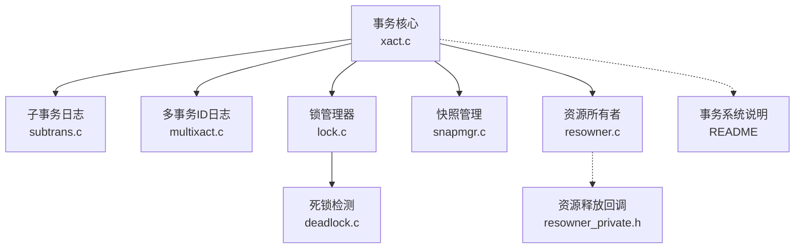
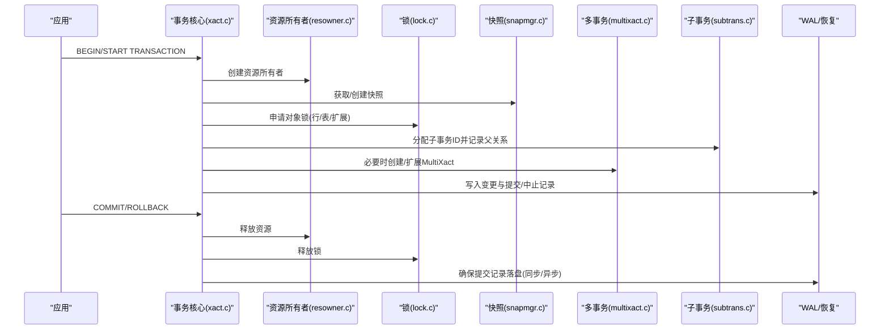
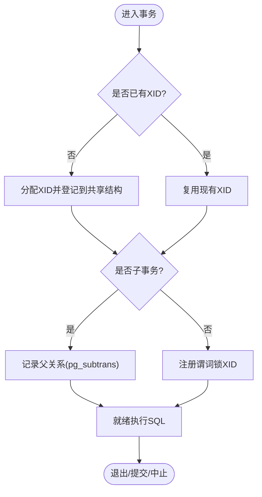
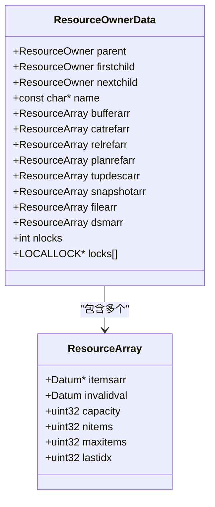
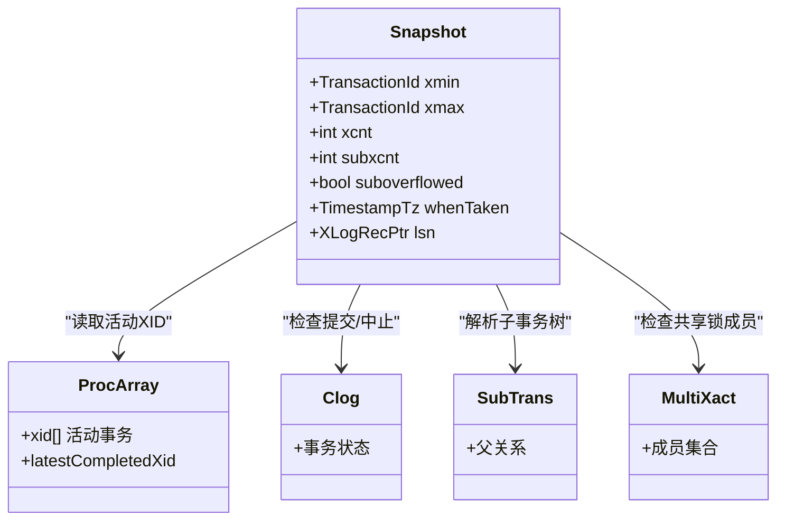
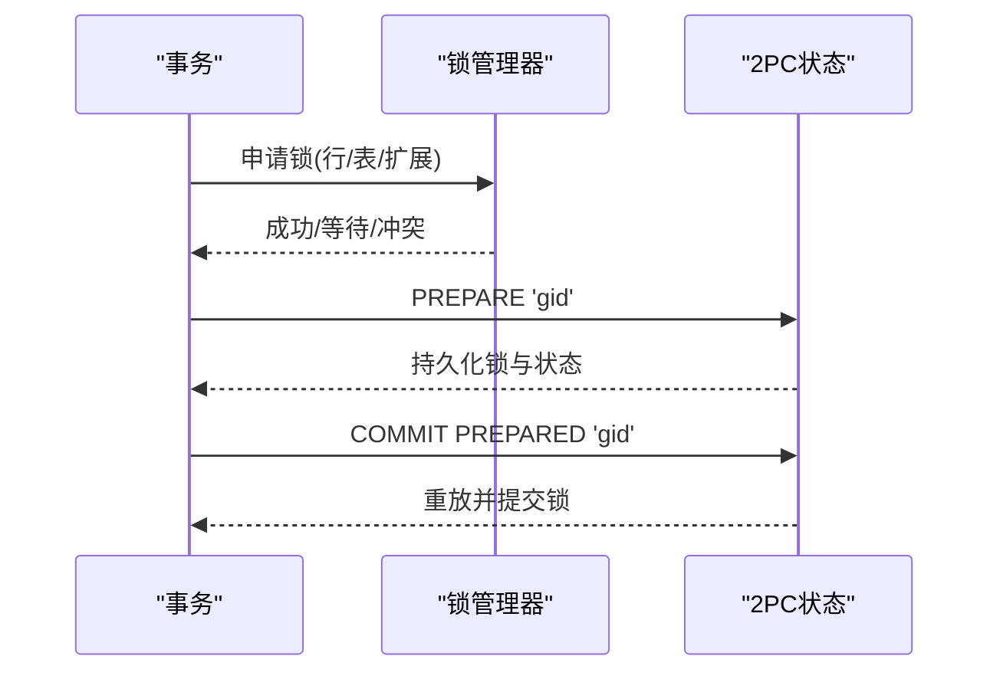
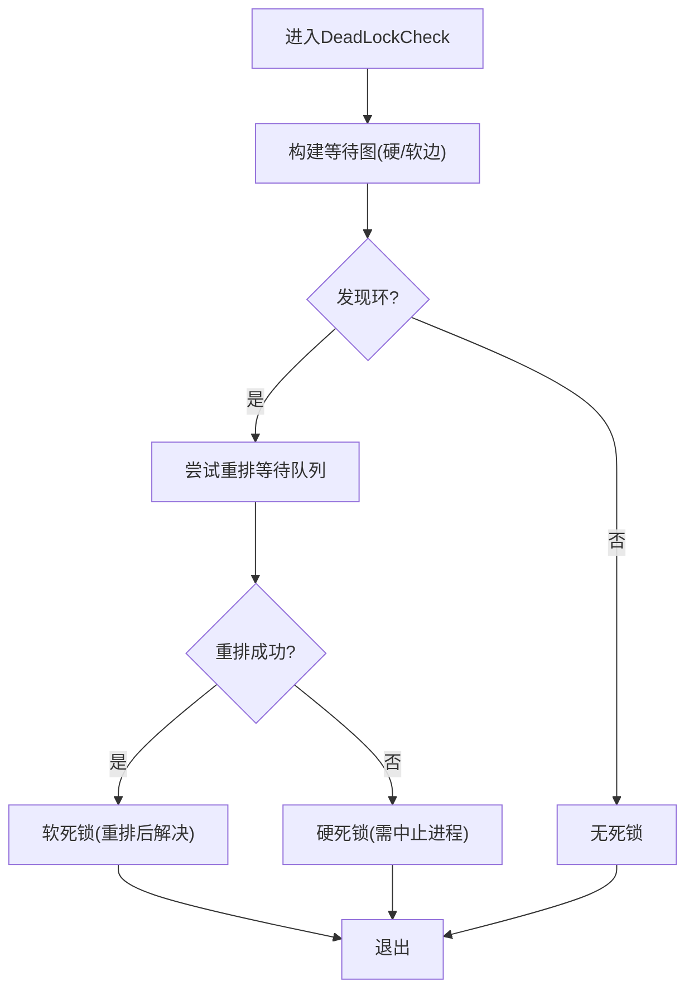
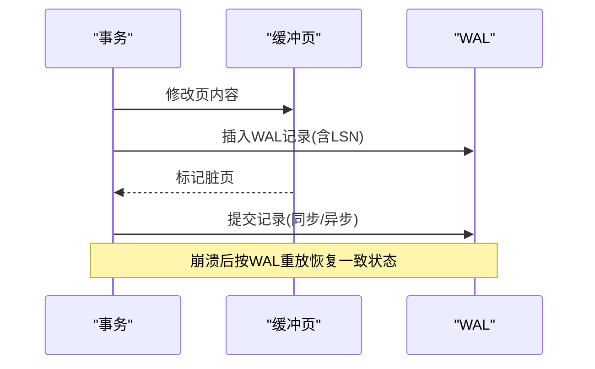
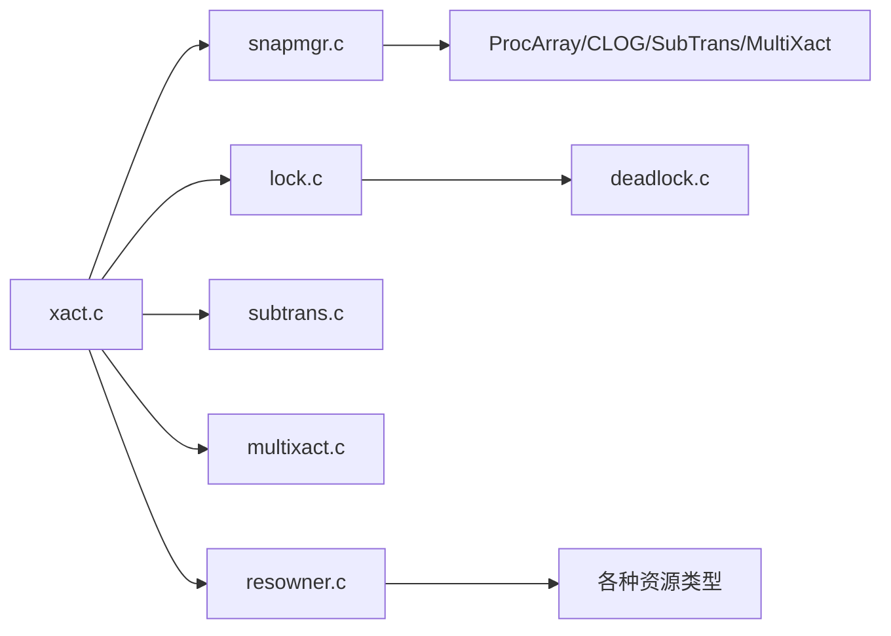

# 事务管理

<cite>
**本文引用的文件**
- [xact.c](file://src/backend/access/transam/xact.c)
- [README（事务系统）](file://src/backend/access/transam/README)
- [subtrans.c](file://src/backend/access/transam/subtrans.c)
- [multixact.c](file://src/backend/access/transam/multixact.c)
- [lock.c](file://src/backend/storage/lmgr/lock.c)
- [deadlock.c](file://src/backend/storage/lmgr/deadlock.c)
- [snapmgr.c](file://src/backend/utils/time/snapmgr.c)
- [resowner.c](file://src/backend/utils/resowner/resowner.c)
- [resowner.h](file://src/include/utils/resowner.h)
- [resowner_private.h](file://src/include/utils/resowner_private.h)
</cite>

## 更新摘要
**所做更改**
- 移除了资源所有者系统中的HMAC上下文跟踪相关代码
- 更新了ResourceOwnerCreate、ResourceOwnerReleaseInternal、ResourceOwnerDelete函数以移除HMAC相关的内存管理
- 简化了资源所有者的生命周期管理，专注于核心资源类型

## 目录
1. [简介](#简介)
2. [项目结构](#项目结构)
3. [核心组件](#核心组件)
4. [架构总览](#架构总览)
5. [详细组件分析](#详细组件分析)
6. [依赖关系分析](#依赖关系分析)
7. [性能考量](#性能考量)
8. [故障排查指南](#故障排查指南)
9. [结论](#结论)
10. [附录](#附录)

## 简介
本文件面向事务管理系统，围绕ACID特性在源码中的实现机制进行系统化说明。重点覆盖：
- 事务生命周期管理与子事务栈
- MVCC并发控制与快照隔离
- 锁机制、两阶段提交（2PC）与恢复协议
- 死锁检测与恢复策略
- 隔离级别、锁粒度与性能影响
- 事务调试与监控工具使用指南及常见问题诊断

**更新** 资源所有者系统已移除HMAC上下文跟踪功能，简化了资源管理机制，专注于核心事务资源的统一管理。

## 项目结构
事务相关代码主要分布在以下模块：
- 事务核心：access/transam（xact.c、subtrans.c、multixact.c、twophase*）
- 锁与死锁：storage/lmgr（lock.c、deadlock.c）
- 快照与MVCC：utils/time（snapmgr.c）
- 资源所有者管理：utils/resowner（resowner.c）
- 文档与流程说明：access/transam/README

**图示来源**
- [xact.c:1-120](file://src/backend/access/transam/xact.c#L1-L120)
- [subtrans.c:1-60](file://src/backend/access/transam/subtrans.c#L1-L60)
- [multixact.c:1-60](file://src/backend/access/transam/multixact.c#L1-L60)
- [lock.c:1-60](file://src/backend/storage/lmgr/lock.c#L1-L60)
- [deadlock.c:1-40](file://src/backend/storage/lmgr/deadlock.c#L1-L40)
- [snapmgr.c:1-80](file://src/backend/utils/time/snapmgr.c#L1-L80)
- [resowner.c:1-100](file://src/backend/utils/resowner/resowner.c#L1-L100)
- [README（事务系统）:1-40](file://src/backend/access/transam/README#L1-L40)

**章节来源**
- [xact.c:1-120](file://src/backend/access/transam/xact.c#L1-L120)
- [README（事务系统）:1-40](file://src/backend/access/transam/README#L1-L40)

## 核心组件
- 事务状态机与生命周期：定义事务块状态与底层事务状态，提供开始、提交、中止、准备等接口，维护事务栈与资源所有者。
- 子事务与父关系：通过SLRU持久化子事务父关系，支持保存点与回滚到保存点。
- 多事务ID（MultiXact）：用于共享行锁与元组级并发控制，记录成员事务及其状态位。
- 锁管理器：基于哈希表与快速路径优化，提供多种锁模式与冲突矩阵，支持会话级与事务级锁。
- 死锁检测：构建等待图，识别硬/软边，尝试重排队列或终止进程以解除死锁。
- 快照与MVCC：维护当前/次级/目录快照，计算xmin/xmax，协调ProcArray与CLOG/SubTrans/MultiXact以提供一致性视图。
- 资源所有者管理：统一管理事务期间创建的各种资源，包括缓冲区、缓存引用、计划缓存、临时文件等，确保资源正确释放。

**更新** 资源所有者系统现在专注于核心资源类型的管理，移除了HMAC上下文跟踪功能，简化了内存管理和资源清理逻辑。

**章节来源**
- [xact.c:127-203](file://src/backend/access/transam/xact.c#L127-L203)
- [subtrans.c:70-135](file://src/backend/access/transam/subtrans.c#L70-L135)
- [multixact.c:193-283](file://src/backend/access/transam/multixact.c#L193-L283)
- [lock.c:60-154](file://src/backend/storage/lmgr/lock.c#L60-L154)
- [deadlock.c:200-285](file://src/backend/storage/lmgr/deadlock.c#L200-L285)
- [snapmgr.c:83-147](file://src/backend/utils/time/snapmgr.c#L83-L147)
- [resowner.c:113-135](file://src/backend/utils/resowner/resowner.c#L113-L135)

## 架构总览
下图展示事务、锁、快照与WAL/恢复之间的交互关系。

**更新** 资源所有者系统在事务生命周期中扮演重要角色，负责统一管理事务期间创建的所有资源，确保在事务结束时正确清理。

**图示来源**
- [xact.c:351-420](file://src/backend/access/transam/xact.c#L351-L420)
- [resowner.c:422-450](file://src/backend/utils/resowner/resowner.c#L422-L450)
- [lock.c:740-800](file://src/backend/storage/lmgr/lock.c#L740-L800)
- [snapmgr.c:83-147](file://src/backend/utils/time/snapmgr.c#L83-L147)
- [multixact.c:389-430](file://src/backend/access/transam/multixact.c#L389-L430)
- [subtrans.c:70-135](file://src/backend/access/transam/subtrans.c#L70-L135)

## 详细组件分析

### 事务生命周期与子事务栈
- 事务状态机：顶层事务与子事务分别维护TransState与TBlockState，支持BEGIN/COMMIT/ROLLBACK/SAVEPOINT/ROLLBACK TO/RELEASE。
- 子事务栈：TransactionStateData链式结构，Push/Pop管理嵌套；子事务拥有独立SubTransactionId与资源所有者。
- 编号与可见性：仅在需要时分配永久XID，保证子XID晚于父XID；VXID用于无XID事务的标识。
- 命令计数器：CommandCounterIncrement在同一事务内使后续命令可见前序修改。

**图示来源**
- [xact.c:551-708](file://src/backend/access/transam/xact.c#L551-L708)
- [README（事务系统）:148-222](file://src/backend/access/transam/README#L148-L222)

**章节来源**
- [xact.c:127-203](file://src/backend/access/transam/xact.c#L127-L203)
- [xact.c:351-420](file://src/backend/access/transam/xact.c#L351-L420)
- [README（事务系统）:148-222](file://src/backend/access/transam/README#L148-L222)

### 资源所有者系统与资源管理
- 资源所有者创建：每个事务和子事务都有独立的资源所有者，形成父子层次结构。
- 资源类型管理：管理缓冲区、缓存引用、关系缓存、计划缓存、元组描述符、快照、临时文件、动态共享内存等。
- 三阶段资源释放：在锁定前、锁定中、锁定后三个阶段分别释放不同类型的资源，确保正确的清理顺序。
- 内存管理：所有资源所有者对象保存在TopMemoryContext中，确保在整个后端生命周期内有效。

**更新** 资源所有者系统已移除HMAC上下文跟踪功能，简化了资源管理逻辑，专注于核心事务资源的统一管理。

**图示来源**
- [resowner.c:113-135](file://src/backend/utils/resowner/resowner.c#L113-L135)
- [resowner.c:63-71](file://src/backend/utils/resowner/resowner.c#L63-L71)

**章节来源**
- [resowner.c:422-450](file://src/backend/utils/resowner/resowner.c#L422-L450)
- [resowner.c:489-683](file://src/backend/utils/resowner/resowner.c#L489-L683)
- [resowner.c:712-757](file://src/backend/utils/resowner/resowner.c#L712-L757)

### MVCC并发控制与快照
- 快照类型：CurrentSnapshot、SecondarySnapshot、CatalogSnapshot、SnapshotSelf/Any。
- xmin/xmax与可见性：通过ProcArray与CLOG/SubTrans/MultiXact综合判断元组可见性；ComputeXidHorizons与GetSnapshotData协作避免竞态。
- 旧快照阈值：old_snapshot_threshold控制历史快照保留时间，防止过度膨胀。

**图示来源**
- [snapmgr.c:83-147](file://src/backend/utils/time/snapmgr.c#L83-L147)
- [README（事务系统）:224-340](file://src/backend/access/transam/README#L224-L340)

**章节来源**
- [snapmgr.c:83-147](file://src/backend/utils/time/snapmgr.c#L83-L147)
- [README（事务系统）:224-340](file://src/backend/access/transam/README#L224-L340)

### 锁机制与两阶段提交
- 锁模式与冲突矩阵：AccessShareLock至AccessExclusiveLock，定义互斥关系。
- 快速路径：对本地数据库的非共享关系的轻量锁采用快速路径，减少锁表竞争。
- 两阶段提交（2PC）：prepare阶段持久化锁与事务状态，commit/rollback阶段回放并重放锁持有。

**图示来源**
- [lock.c:60-154](file://src/backend/storage/lmgr/lock.c#L60-L154)
- [lock.c:157-230](file://src/backend/storage/lmgr/lock.c#L157-L230)

**章节来源**
- [lock.c:60-154](file://src/backend/storage/lmgr/lock.c#L60-L154)
- [lock.c:157-230](file://src/backend/storage/lmgr/lock.c#L157-L230)

### 死锁检测与恢复
- 等待图构建：硬边来自已持有冲突锁的进程，软边来自队列中前置请求。
- 检测算法：递归搜索环，尝试重排队列以消除软环；若不可解则返回硬死锁。
- 恢复策略：选择牺牲者进程中止其事务，唤醒其他等待者继续推进。

**图示来源**
- [deadlock.c:200-285](file://src/backend/storage/lmgr/deadlock.c#L200-L285)
- [deadlock.c:314-428](file://src/backend/storage/lmgr/deadlock.c#L314-L428)

**章节来源**
- [deadlock.c:200-285](file://src/backend/storage/lmgr/deadlock.c#L200-L285)
- [deadlock.c:314-428](file://src/backend/storage/lmgr/deadlock.c#L314-L428)

### 恢复协议与WAL
- 预写日志：数据页变更前先写WAL，确保崩溃恢复一致性。
- 提交协议：跨页提交时使用"子提交"两阶段标记，保证原子性。
- 异步提交：可配置异步提交以降低延迟，walwriter负责周期性刷新。

**图示来源**
- [README（事务系统）:399-487](file://src/backend/access/transam/README#L399-L487)
- [README（事务系统）:760-797](file://src/backend/access/transam/README#L760-L797)

**章节来源**
- [README（事务系统）:399-487](file://src/backend/access/transam/README#L399-L487)
- [README（事务系统）:760-797](file://src/backend/access/transam/README#L760-L797)

## 依赖关系分析
- 事务核心依赖快照、锁、子事务与多事务ID子系统。
- 锁管理器依赖进程数组与资源所有者，死锁检测依赖锁表与等待队列。
- 快照依赖ProcArray、CLOG、SubTrans、MultiXact以计算可见性。
- 恢复协议贯穿WAL与SLRU（pg_xact/pg_subtrans/pg_multixact）。
- 资源所有者系统为事务提供统一的资源管理机制，确保资源正确释放。

**更新** 资源所有者系统作为事务管理的核心组件，为事务提供统一的资源生命周期管理。

**图示来源**
- [xact.c:23-60](file://src/backend/access/transam/xact.c#L23-L60)
- [lock.c:35-50](file://src/backend/storage/lmgr/lock.c#L35-L50)
- [snapmgr.c:48-72](file://src/backend/utils/time/snapmgr.c#L48-L72)
- [resowner.c:142-145](file://src/backend/utils/resowner/resowner.c#L142-L145)

**章节来源**
- [xact.c:23-60](file://src/backend/access/transam/xact.c#L23-L60)
- [lock.c:35-50](file://src/backend/storage/lmgr/lock.c#L35-L50)
- [snapmgr.c:48-72](file://src/backend/utils/time/snapmgr.c#L48-L72)
- [resowner.c:142-145](file://src/backend/utils/resowner/resowner.c#L142-L145)

## 性能考量
- 快速路径锁：针对本地数据库非共享关系的轻量锁，降低锁表竞争。
- 快照优化：避免频繁访问xmin，使用近似阈值提升GetSnapshotData性能。
- 异步提交：减少fsync等待，由walwriter批量刷新，权衡一致性与延迟。
- 子事务与MultiXact缓存：减少SLRU访问次数，提高并发读性能。
- 资源所有者优化：通过ResourceArray的高效数据结构管理大量资源，减少内存分配开销。

**更新** 资源所有者系统的简化提高了资源管理的效率，减少了不必要的内存操作和复杂性。

[本节为通用指导，不直接分析具体文件]

## 故障排查指南
- 死锁问题：
  - 启用锁追踪与死锁调试标志，观察锁等待与重排过程。
  - 关注自动清理进程阻塞情况，必要时取消阻塞的autovacuum。
- 长事务与快照膨胀：
  - 调整old_snapshot_threshold，避免历史快照长期保留。
  - 检查未提交事务持有的锁与快照，及时释放资源。
- 提交延迟：
  - 评估synchronous_commit设置，结合业务需求选择同步/异步。
  - 监控walwriter刷新频率与延迟。
- 资源泄漏问题：
  - 使用资源所有者调试功能检查未释放的资源。
  - 关注警告消息中的资源类型，定位泄漏点。

**更新** 资源所有者系统提供了更清晰的资源泄漏检测机制，简化了调试过程。

**章节来源**
- [lock.c:279-354](file://src/backend/storage/lmgr/lock.c#L279-L354)
- [deadlock.c:287-301](file://src/backend/storage/lmgr/deadlock.c#L287-L301)
- [snapmgr.c:75-80](file://src/backend/utils/time/snapmgr.c#L75-L80)
- [resowner.c:1107-1111](file://src/backend/utils/resowner/resowner.c#L1107-L1111)

## 结论
PostgreSQL的事务系统在ACID保障上通过多层协同实现：事务状态机与子事务栈提供灵活的生命周期管理；MVCC与快照机制确保隔离性；锁与死锁检测保障并发安全；WAL与恢复协议保证持久性与一致性。资源所有者系统为事务提供了统一的资源管理机制，简化了资源生命周期管理。合理配置锁粒度、隔离级别与提交策略，可有效平衡性能与可靠性。

**更新** 资源所有者系统的简化设计提高了系统的可维护性和性能，同时保持了完整的资源管理功能。

[本节为总结性内容，不直接分析具体文件]

## 附录
- 隔离级别建议：
  - READ COMMITTED：默认级别，适合大多数OLTP场景。
  - REPEATABLE READ/ SERIALIZABLE：强一致性需求时使用，注意潜在的性能开销与死锁风险。
- 锁粒度选择：
  - 行级锁：高并发更新场景首选。
  - 表级锁：DDL或批量操作时使用，注意阻塞范围。
- 监控与诊断：
  - 使用锁追踪与死锁日志定位瓶颈。
  - 通过快照与事务视图观察长事务与阻塞链。
  - 利用资源所有者调试功能检查资源泄漏。

**更新** 资源所有者系统提供了更完善的调试和监控能力，帮助开发者更好地理解和优化事务行为。

[本节为通用指导，不直接分析具体文件]