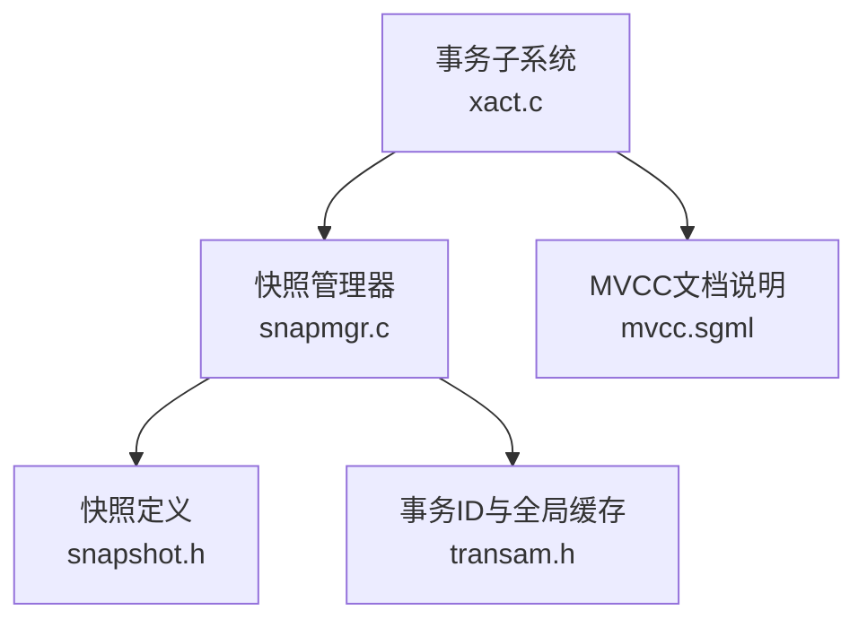
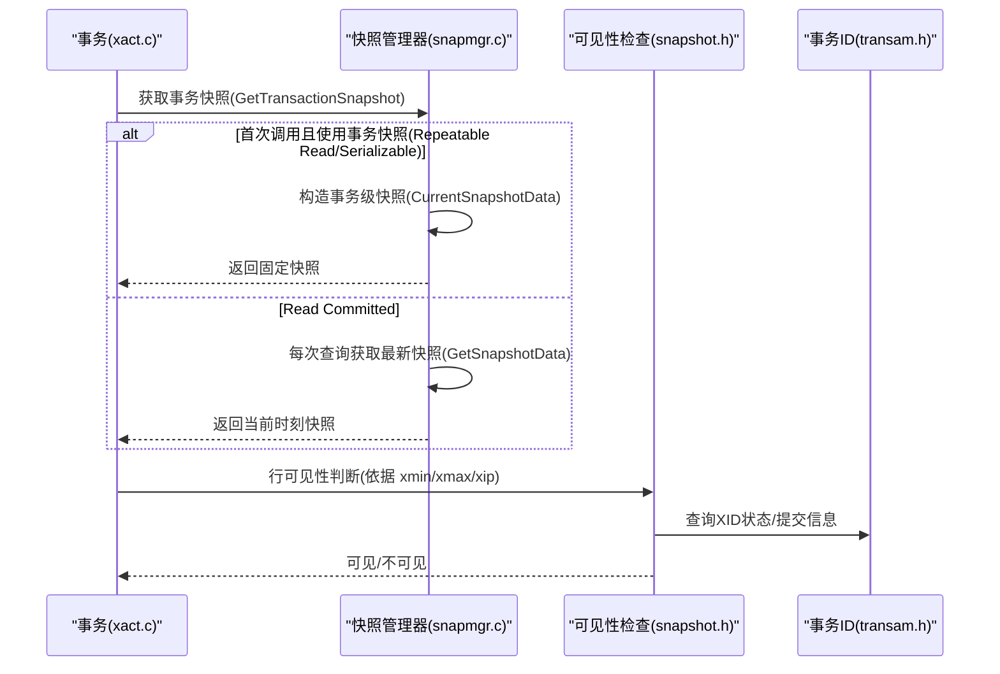
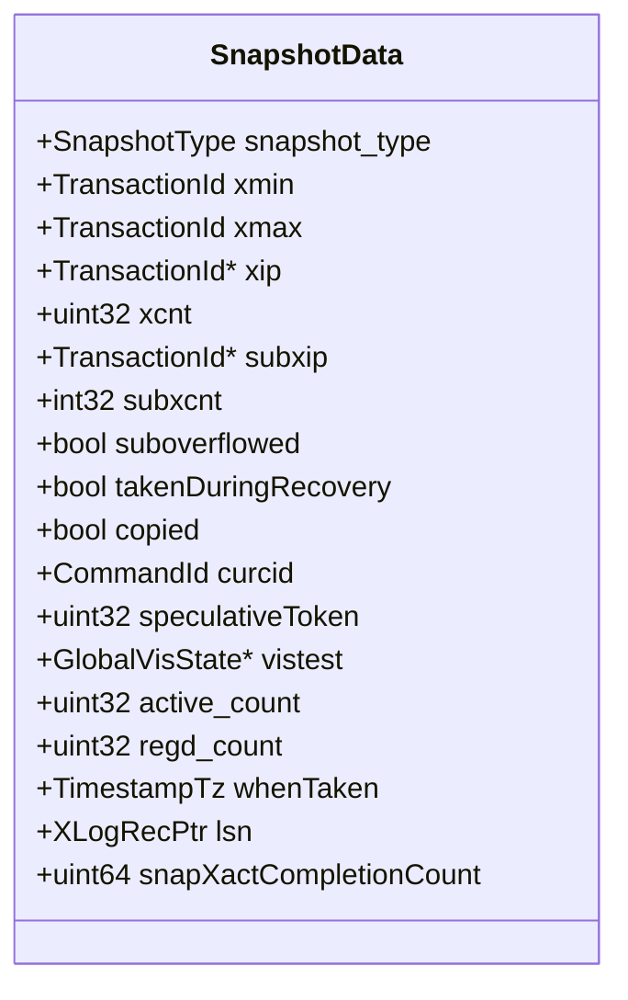
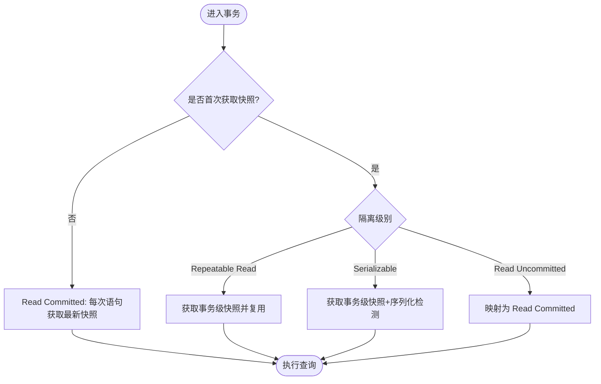
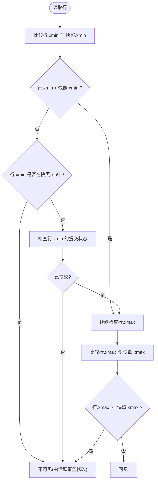
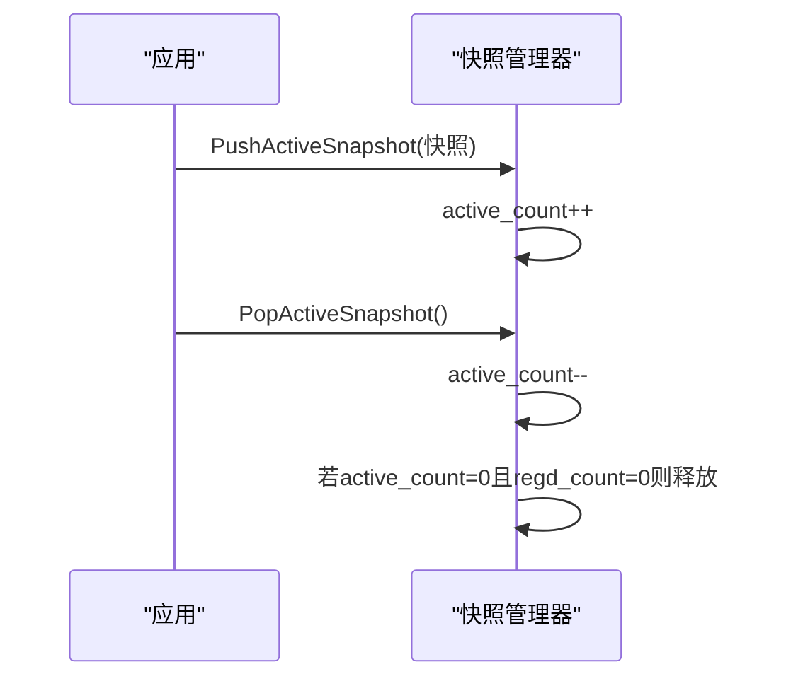
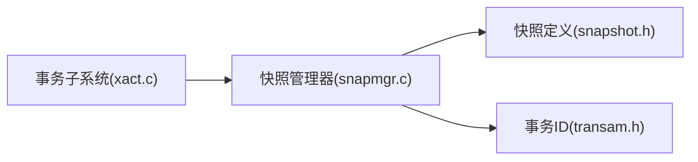

# 事务隔离级别

<cite>
**本文引用的文件**
- [src/include/utils/snapshot.h](file://src/include/utils/snapshot.h)
- [src/include/utils/snapmgr.h](file://src/include/utils/snapmgr.h)
- [src/backend/utils/time/snapmgr.c](file://src/backend/utils/time/snapmgr.c)
- [src/include/access/transam.h](file://src/include/access/transam.h)
- [src/backend/access/transam/xact.c](file://src/backend/access/transam/xact.c)
- [doc/src/sgml/mvcc.sgml](file://doc/src/sgml/mvcc.sgml)
</cite>

## 目录
1. [简介](#简介)
2. [项目结构](#项目结构)
3. [核心组件](#核心组件)
4. [架构总览](#架构总览)
5. [详细组件分析](#详细组件分析)
6. [依赖关系分析](#依赖关系分析)
7. [性能考量](#性能考量)
8. [故障排查指南](#故障排查指南)
9. [结论](#结论)
10. [附录](#附录)

## 简介
本文件围绕 PostgreSQL 的事务隔离级别，系统阐述 READ UNCOMMITTED、READ COMMITTED、REPEATABLE READ 与 SERIALIZABLE 四种隔离级别的实现机制与行为差异。重点说明快照获取时机、可见性规则与数据一致性保证；文档化各隔离级别下的幻读、不可重复读与写偏斜现象及解决方案；并提供隔离级别选择指导与性能影响分析。

## 项目结构
围绕隔离级别的核心代码分布在以下模块：
- 快照定义与管理接口：snapshot.h、snapmgr.h
- 快照管理器实现：snapmgr.c（负责获取 MVCC 快照、管理活动快照栈、注册快照、导入导出等）
- 事务子系统：xact.c（默认隔离级别、事务状态机、与快照的交互）
- 事务 ID 与全局变量：transam.h（XID、FullTransactionId、VariableCacheData 等）
- 官方文档：mvcc.sgml（隔离级别语义说明）

**图表来源**
- [src/backend/access/transam/xact.c:66-73](file://src/backend/access/transam/xact.c#L66-L73)
- [src/backend/utils/time/snapmgr.c:240-317](file://src/backend/utils/time/snapmgr.c#L240-L317)
- [src/include/utils/snapshot.h:142-217](file://src/include/utils/snapshot.h#L142-L217)
- [src/include/access/transam.h:194-250](file://src/include/access/transam.h#L194-L250)

**章节来源**
- [src/backend/access/transam/xact.c:66-73](file://src/backend/access/transam/xact.c#L66-L73)
- [src/backend/utils/time/snapmgr.c:240-317](file://src/backend/utils/time/snapmgr.c#L240-L317)
- [src/include/utils/snapshot.h:142-217](file://src/include/utils/snapshot.h#L142-L217)
- [src/include/access/transam.h:194-250](file://src/include/access/transam.h#L194-L250)
- [doc/src/sgml/mvcc.sgml:270-276](file://doc/src/sgml/mvcc.sgml#L270-L276)

## 核心组件
- 快照类型与数据结构：SnapshotData 定义了 MVCC 快照的关键字段（xmin、xmax、xip、subxip、curcid、whenTaken、lsn 等），并区分多种快照类型（MVCC、SELF、ANY、TOAST、DIRTY、HISTORIC_MVCC、NON_VACUUMABLE）。
- 快照管理器：提供 GetTransactionSnapshot、GetLatestSnapshot、PushActiveSnapshot、RegisterSnapshot 等接口，维护活动快照栈与注册快照集合，支持导入/导出快照与旧快照阈值控制。
- 事务子系统：维护默认隔离级别（默认 READ COMMITTED）、事务状态机，并在首次获取快照时根据隔离级别决定快照策略（例如 REPEATABLE READ/SERIALIZABLE 使用事务级快照）。
- 事务 ID 与全局缓存：通过 FullTransactionId、VariableCacheData 等结构维护 XID 分配、提交/中止状态、最新完成 XID 等，支撑可见性判断与快照构建。

**章节来源**
- [src/include/utils/snapshot.h:35-119](file://src/include/utils/snapshot.h#L35-L119)
- [src/include/utils/snapshot.h:142-217](file://src/include/utils/snapshot.h#L142-L217)
- [src/include/utils/snapmgr.h:108-147](file://src/include/utils/snapmgr.h#L108-L147)
- [src/backend/utils/time/snapmgr.c:83-116](file://src/backend/utils/time/snapmgr.c#L83-L116)
- [src/backend/access/transam/xact.c:66-73](file://src/backend/access/transam/xact.c#L66-L73)
- [src/include/access/transam.h:194-250](file://src/include/access/transam.h#L194-L250)

## 架构总览
PostgreSQL 在内部仅实现三种隔离语义：Read Uncommitted 映射为 Read Committed；Read Committed 每语句取最新快照；Repeatable Read 与 Serializable 均基于事务开始时的快照，但 Serializable 额外进行序列化异常检测。

**图表来源**
- [src/backend/utils/time/snapmgr.c:240-317](file://src/backend/utils/time/snapmgr.c#L240-L317)
- [src/include/utils/snapshot.h:142-217](file://src/include/utils/snapshot.h#L142-L217)
- [src/include/access/transam.h:260-290](file://src/include/access/transam.h#L260-L290)

**章节来源**
- [doc/src/sgml/mvcc.sgml:270-276](file://doc/src/sgml/mvcc.sgml#L270-L276)
- [src/backend/utils/time/snapmgr.c:240-317](file://src/backend/utils/time/snapmgr.c#L240-L317)
- [src/include/utils/snapshot.h:142-217](file://src/include/utils/snapshot.h#L142-L217)
- [src/include/access/transam.h:260-290](file://src/include/access/transam.h#L260-L290)

## 详细组件分析

### 快照数据结构与可见性规则
- SnapshotData 关键字段：
  - xmin/xmax：所有小于 xmin 的 XID 可见，大于等于 xmax 的 XID 不可见。
  - xip/subxip：记录在快照时刻处于活跃状态的 XID 列表，用于判断是否可见。
  - curcid：命令 ID，限制同一事务内当前命令可见范围。
  - whenTaken/lsn：快照时间与 WAL 位置，用于旧快照检测与时间旅行。
- 可见性规则：
  - MVCC 快照：仅看到快照前已提交的变更与本事务之前的命令效果；不看到快照中列出的活跃事务以及之后开始的变更。
  - SELF/ANY/DIRTY/TOAST/HISTORIC_MVCC/NON_VACUUMABLE：不同用途的特殊可见性语义。

**图表来源**
- [src/include/utils/snapshot.h:142-217](file://src/include/utils/snapshot.h#L142-L217)

**章节来源**
- [src/include/utils/snapshot.h:35-119](file://src/include/utils/snapshot.h#L35-L119)
- [src/include/utils/snapshot.h:142-217](file://src/include/utils/snapshot.h#L142-L217)

### 快照获取时机与隔离级别行为
- Read Committed：每个语句开始时获取最新快照（GetSnapshotData），因此能看到其他事务在本语句之前提交的变更。
- Repeatable Read：事务内首个语句时获取一次快照并复用至事务结束，确保可重复读。
- Serializable：同 Repeatable Read 的快照策略，但增加对可能产生序列化异常的并发访问进行检测，失败时回滚并重试。
- Read Uncommitted：在 PostgreSQL 中映射为 Read Committed，不会看到未提交数据。

**图表来源**
- [src/backend/utils/time/snapmgr.c:240-317](file://src/backend/utils/time/snapmgr.c#L240-L317)
- [doc/src/sgml/mvcc.sgml:270-276](file://doc/src/sgml/mvcc.sgml#L270-L276)
- [doc/src/sgml/mvcc.sgml:444-486](file://doc/src/sgml/mvcc.sgml#L444-L486)
- [doc/src/sgml/mvcc.sgml:571-600](file://doc/src/sgml/mvcc.sgml#L571-L600)

**章节来源**
- [src/backend/utils/time/snapmgr.c:240-317](file://src/backend/utils/time/snapmgr.c#L240-L317)
- [doc/src/sgml/mvcc.sgml:270-276](file://doc/src/sgml/mvcc.sgml#L270-L276)
- [doc/src/sgml/mvcc.sgml:444-486](file://doc/src/sgml/mvcc.sgml#L444-L486)
- [doc/src/sgml/mvcc.sgml:571-600](file://doc/src/sgml/mvcc.sgml#L571-L600)

### 可见性判断流程（MVCC）
- 读取行时，依据行的 xmin/xmax 与当前快照的 xmin/xmax/xip 判断可见性。
- 若行由活跃事务插入或更新，需检查该 XID 是否在快照的 xip 列表中；若在则不可见（除非是本事务自身）。
- 若行已被删除，需检查删除者的提交/中止状态。

**图表来源**
- [src/include/utils/snapshot.h:142-217](file://src/include/utils/snapshot.h#L142-L217)
- [src/include/access/transam.h:260-290](file://src/include/access/transam.h#L260-L290)

**章节来源**
- [src/include/utils/snapshot.h:142-217](file://src/include/utils/snapshot.h#L142-L217)
- [src/include/access/transam.h:260-290](file://src/include/access/transam.h#L260-L290)

### 隔离级别下的异常现象与解决方案
- 不可重复读：
  - 现象：同一事务内两次 SELECT 读到不同结果。
  - 隔离级别：Read Committed 可能发生；Repeatable Read/Seriable 不会发生。
  - 解决：使用 Repeatable Read 或 Serializable。
- 幻读：
  - 现象：同一事务内两次相同条件查询返回不同行数。
  - 隔离级别：PostgreSQL 的 Repeatable Read 与 Serializable 均避免传统意义上的幻读（基于快照的一致性视图）。
  - 解决：使用 Repeatable Read 或 Serializable。
- 写偏斜（Write Skew）：
  - 现象：两个事务同时读取共享状态并各自写入，导致最终状态不一致。
  - 隔离级别：Repeatable Read 无法完全避免；Serializable 通过检测读写依赖冲突来避免。
  - 解决：使用 Serializable，或在应用层加锁/重试。

**章节来源**
- [doc/src/sgml/mvcc.sgml:444-486](file://doc/src/sgml/mvcc.sgml#L444-L486)
- [doc/src/sgml/mvcc.sgml:571-600](file://doc/src/sgml/mvcc.sgml#L571-L600)

### 快照生命周期与注册管理
- 活动快照栈：PushActiveSnapshot/PopActiveSnapshot 管理当前使用的快照引用计数，避免过早释放。
- 注册快照：RegisteredSnapshots 按 xmin 排序，便于推进全局 xmin 以回收旧版本。
- 导入/导出：ImportSnapshot/ExportSnapshot 支持跨会话共享快照，用于逻辑解码或外部工具。
- 旧快照阈值：old_snapshot_threshold 控制旧快照保留时长，避免长时间阻塞清理。

**图表来源**
- [src/backend/utils/time/snapmgr.c:673-796](file://src/backend/utils/time/snapmgr.c#L673-L796)

**章节来源**
- [src/backend/utils/time/snapmgr.c:673-796](file://src/backend/utils/time/snapmgr.c#L673-L796)
- [src/include/utils/snapmgr.h:118-147](file://src/include/utils/snapmgr.h#L118-L147)

## 依赖关系分析
- 事务子系统依赖快照管理器获取 MVCC 快照；快照管理器依赖事务 ID 与全局缓存进行可见性判断。
- 快照管理器维护活动快照栈与注册快照堆，确保 xmin 推进与资源释放正确。
- 事务 ID 模块提供 XID 分配、提交/中止状态查询，支撑快照构建与可见性判断。

**图表来源**
- [src/backend/access/transam/xact.c:66-73](file://src/backend/access/transam/xact.c#L66-L73)
- [src/backend/utils/time/snapmgr.c:240-317](file://src/backend/utils/time/snapmgr.c#L240-L317)
- [src/include/utils/snapshot.h:142-217](file://src/include/utils/snapshot.h#L142-L217)
- [src/include/access/transam.h:194-250](file://src/include/access/transam.h#L194-L250)

**章节来源**
- [src/backend/access/transam/xact.c:66-73](file://src/backend/access/transam/xact.c#L66-L73)
- [src/backend/utils/time/snapmgr.c:240-317](file://src/backend/utils/time/snapmgr.c#L240-L317)
- [src/include/utils/snapshot.h:142-217](file://src/include/utils/snapshot.h#L142-L217)
- [src/include/access/transam.h:194-250](file://src/include/access/transam.h#L194-L250)

## 性能考量
- Read Committed：每语句获取最新快照，开销较低，适合大多数 OLTP 场景。
- Repeatable Read：事务级快照减少多次快照构建成本，但需要维护更长的快照生命周期，可能延迟清理。
- Serializable：在 Repeatable Read 基础上增加读写依赖监控与冲突检测，带来额外 CPU 与内存开销；在高并发下可能出现序列化失败，需要应用层重试。
- 旧快照阈值：合理设置 old_snapshot_threshold 可在避免阻塞清理与保持长事务一致性之间取得平衡。

[本节为通用性能讨论，不直接分析具体文件]

## 故障排查指南
- 序列化失败：
  - 现象：事务提交时报错（SQLSTATE '40001'），提示序列化异常。
  - 原因：并发事务的读写依赖可能导致非串行化结果。
  - 处理：应用层捕获错误并重试事务；必要时调整业务逻辑或改用显式锁。
- 旧快照阻塞清理：
  - 现象：长期运行的事务持有旧快照，导致 VACUUM 无法回收旧版本。
  - 处理：调整 old_snapshot_threshold；审查长事务与逻辑解码会话的快照使用。
- 导入快照失败：
  - 现象：ImportSnapshot 报错“源事务不再运行”。
  - 原因：源事务已结束或进程退出。
  - 处理：确保源事务仍存活或使用有效快照标识。

**章节来源**
- [doc/src/sgml/mvcc.sgml:571-600](file://doc/src/sgml/mvcc.sgml#L571-L600)
- [src/backend/utils/time/snapmgr.c:503-598](file://src/backend/utils/time/snapmgr.c#L503-L598)
- [src/include/utils/snapmgr.h:135-147](file://src/include/utils/snapmgr.h#L135-L147)

## 结论
- PostgreSQL 将 READ UNCOMMITTED 映射为 READ COMMITTED，实际提供三种隔离语义。
- READ COMMITTED 适合高吞吐 OLTP；REPEATABLE READ 提供强一致视图；SERIALIZABLE 提供最强一致性但带来额外开销与重试需求。
- 选择隔离级别应结合业务一致性要求与性能目标；对复杂并发场景优先考虑 SERIALIZABLE 并在应用层做好重试与容错。

[本节为总结性内容，不直接分析具体文件]

## 附录
- 关键配置项：
  - DefaultXactIsoLevel：默认事务隔离级别（默认 READ COMMITTED）。
  - old_snapshot_threshold：旧快照阈值（分钟），控制旧快照保留时长。
- 相关函数：
  - GetTransactionSnapshot：获取事务快照。
  - GetLatestSnapshot：获取当前最新快照。
  - ImportSnapshot/ExportSnapshot：导入/导出快照。
  - TransactionIdDidCommit/TransactionIdDidAbort：查询 XID 提交/中止状态。

**章节来源**
- [src/backend/access/transam/xact.c:66-73](file://src/backend/access/transam/xact.c#L66-L73)
- [src/include/utils/snapmgr.h:46-54](file://src/include/utils/snapmgr.h#L46-L54)
- [src/include/utils/snapmgr.h:108-147](file://src/include/utils/snapmgr.h#L108-L147)
- [src/include/access/transam.h:260-290](file://src/include/access/transam.h#L260-L290)