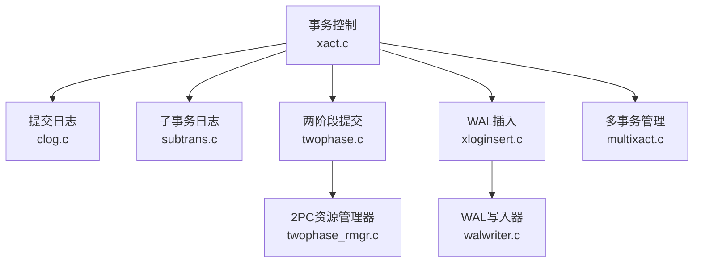
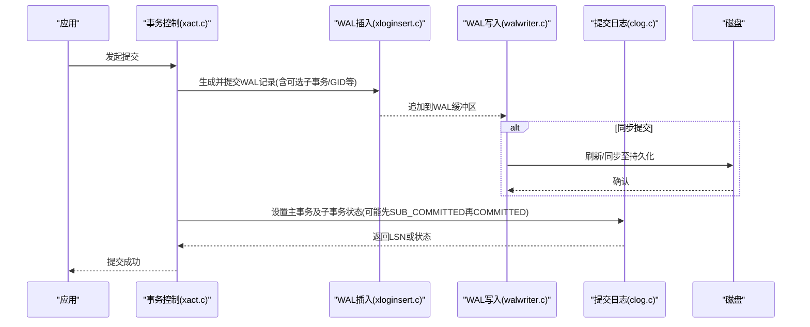
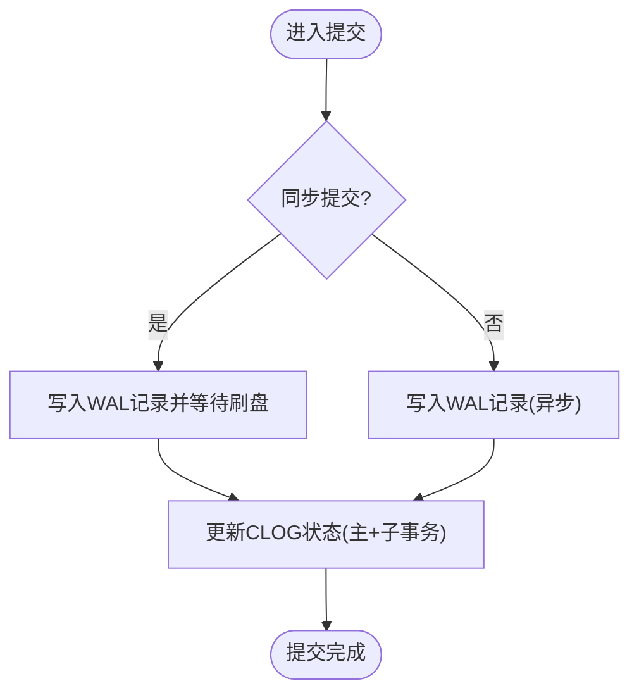
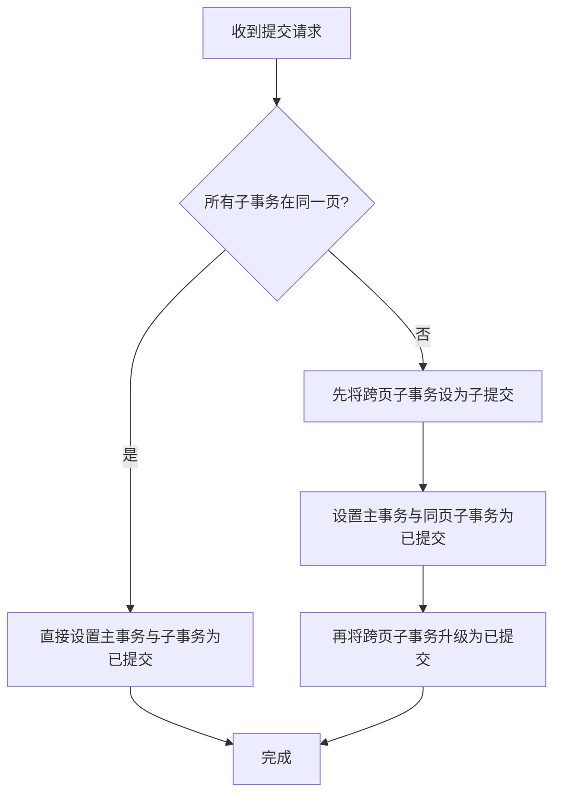
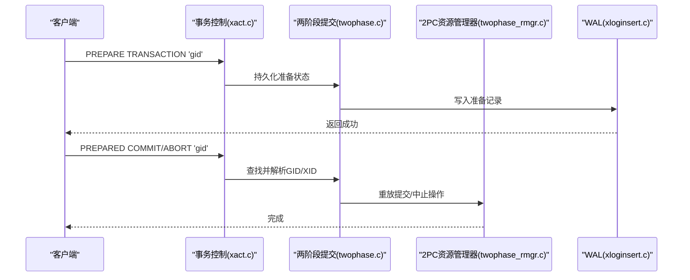
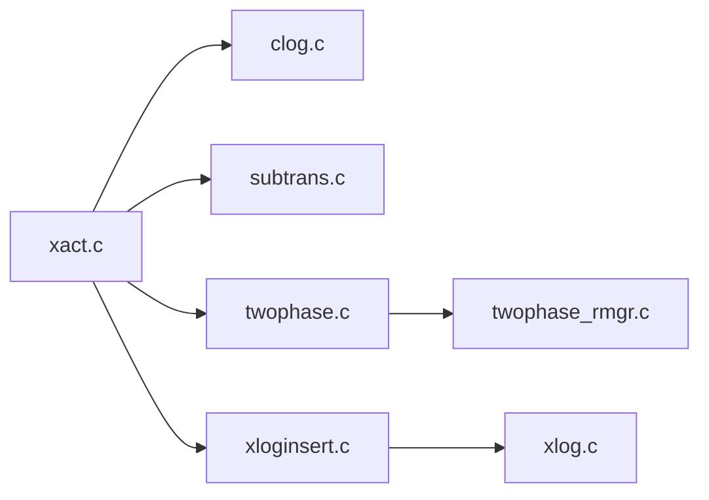

# 提交协议

<cite>
**本文引用的文件**
- [xact.c](file://src/backend/access/transam/xact.c)
- [clog.c](file://src/backend/access/transam/clog.c)
- [clog.h](file://src/include/access/clog.h)
- [subtrans.c](file://src/backend/access/transam/subtrans.c)
- [multixact.c](file://src/backend/access/transam/multixact.c)
- [twophase.c](file://src/backend/access/transam/twophase.c)
- [twophase_rmgr.c](file://src/backend/access/transam/twophase_rmgr.c)
- [xact.h](file://src/include/access/xact.h)
- [xloginsert.c](file://src/backend/access/transam/xloginsert.c)
- [xlog.c](file://src/backend/access/transam/xlog.c)
- [walwriter.c](file://src/backend/postmaster/walwriter.c)
</cite>

## 目录
1. [简介](#简介)
2. [项目结构](#项目结构)
3. [核心组件](#核心组件)
4. [架构总览](#架构总览)
5. [详细组件分析](#详细组件分析)
6. [依赖关系分析](#依赖关系分析)
7. [性能考虑](#性能考虑)
8. [故障排除指南](#故障排除指南)
9. [结论](#结论)
10. [附录](#附录)

## 简介
本文件面向PostgreSQL事务提交协议，系统性阐述两阶段提交（2PC）、提交日志（CLOG）管理与分布式事务协调机制。重点覆盖事务准备、预提交、提交与回滚的完整流程；WAL记录生成、提交确认机制与崩溃恢复策略；并提供提交性能优化与故障排除建议。文档以源码为依据，辅以流程图与时序图，帮助读者从高层到代码级理解提交路径的一致性保障。

## 项目结构
围绕提交协议的核心代码分布在以下模块：
- 事务控制与生命周期：xact.c、xact.h
- 提交状态存储：clog.c、clog.h
- 子事务父指针：subtrans.c
- 多事务锁/成员：multixact.c
- 两阶段提交：twophase.c、twophase_rmgr.c
- WAL写入与回放：xloginsert.c、xlog.c、walwriter.c

**图表来源**
- [xact.c:1-120](file://src/backend/access/transam/xact.c#L1-L120)
- [clog.c:1-120](file://src/backend/access/transam/clog.c#L1-L120)
- [subtrans.c:1-80](file://src/backend/access/transam/subtrans.c#L1-L80)
- [twophase.c:1-120](file://src/backend/access/transam/twophase.c#L1-L120)
- [xloginsert.c:1-120](file://src/backend/access/transam/xloginsert.c#L1-L120)
- [walwriter.c:1-120](file://src/backend/postmaster/walwriter.c#L1-L120)

**章节来源**
- [xact.c:1-120](file://src/backend/access/transam/xact.c#L1-L120)
- [clog.c:1-120](file://src/backend/access/transam/clog.c#L1-L120)
- [subtrans.c:1-80](file://src/backend/access/transam/subtrans.c#L1-L80)
- [multixact.c:1-120](file://src/backend/access/transam/multixact.c#L1-L120)
- [twophase.c:1-120](file://src/backend/access/transam/twophase.c#L1-L120)
- [xact.h:150-220](file://src/include/access/xact.h#L150-L220)

## 核心组件
- 事务控制（xact.c/xact.h）：负责事务生命周期、隔离级别、同步提交策略、WAL记录组装与回调。
- 提交日志（clog.c/clog.h）：维护每个事务的最终状态（进行中/已提交/已中止/子提交），提供原子性更新与LSN组跟踪。
- 子事务日志（subtrans.c）：维护子事务与其直接父事务的关系，支持快速定位顶层事务。
- 多事务（multixact.c）：用于共享行锁的多事务成员集合，与提交/回滚间接相关。
- 两阶段提交（twophase.c/twophase_rmgr.c）：实现PREPARE/PREPARED COMMIT/ABORT的持久化与重放。
- WAL系统（xloginsert.c/xlog.c/walwriter.c）：负责将事务提交/中止/准备等记录持久化并刷盘。

**章节来源**
- [xact.h:150-220](file://src/include/access/xact.h#L150-L220)
- [clog.h:18-64](file://src/include/access/clog.h#L18-L64)
- [xact.c:560-708](file://src/backend/access/transam/xact.c#L560-L708)
- [clog.c:112-229](file://src/backend/access/transam/clog.c#L112-L229)
- [subtrans.c:70-178](file://src/backend/access/transam/subtrans.c#L70-L178)
- [multixact.c:1-120](file://src/backend/access/transam/multixact.c#L1-L120)
- [twophase.c:1-120](file://src/backend/access/transam/twophase.c#L1-L120)

## 架构总览
下图展示一次典型提交的关键调用链：事务层生成WAL记录，CLOG更新提交状态，必要时触发WAL刷盘，最终完成提交确认。

**图表来源**
- [xact.c:560-708](file://src/backend/access/transam/xact.c#L560-L708)
- [xact.h:454-467](file://src/include/access/xact.h#L454-L467)
- [clog.c:112-229](file://src/backend/access/transam/clog.c#L112-L229)
- [walwriter.c:1-120](file://src/backend/postmaster/walwriter.c#L1-L120)

## 详细组件分析

### 事务生命周期与提交路径（xact.c/xact.h）
- 事务状态机：包含默认、开始、进行中、提交中、中止中、准备中等状态，确保在正确时机执行清理与持久化。
- 同步提交：通过配置项控制是否等待本地刷盘或远程节点确认，影响延迟与一致性权衡。
- 子事务分配与WAL：为子事务分配XID并记录到WAL，保证逻辑解码与备库可见性。
- 提交/中止记录：组装xl_xact_commit/abort，携带数据库信息、子事务列表、失效消息、2PC信息等。

**图表来源**
- [xact.c:560-708](file://src/backend/access/transam/xact.c#L560-L708)
- [xact.h:454-467](file://src/include/access/xact.h#L454-L467)

**章节来源**
- [xact.c:129-203](file://src/backend/access/transam/xact.c#L129-L203)
- [xact.c:560-708](file://src/backend/access/transam/xact.c#L560-L708)
- [xact.h:68-83](file://src/include/access/xact.h#L68-L83)
- [xact.h:454-467](file://src/include/access/xact.h#L454-L467)

### 提交日志（CLOG）与原子性（clog.c/clog.h）
- 状态位：每个事务占用两位，表示进行中/已提交/已中止/子提交。
- 原子更新：当主事务与部分子事务位于不同页面时，先标记跨页子事务为“子提交”，再原子地设置主事务与同页子事务为“已提交”，最后将跨页子事务升级为“已提交”。
- LSN组跟踪：为每组事务维护最新LSN，确保异步提交时能按组推进WAL刷盘。
- 分组更新优化：高并发提交时，多个进程可加入同一组，由领导者统一获取锁并批量更新，减少锁竞争。

**图表来源**
- [clog.c:112-229](file://src/backend/access/transam/clog.c#L112-L229)
- [clog.c:273-398](file://src/backend/access/transam/clog.c#L273-L398)
- [clog.c:414-563](file://src/backend/access/transam/clog.c#L414-L563)

**章节来源**
- [clog.c:112-229](file://src/backend/access/transam/clog.c#L112-L229)
- [clog.c:273-398](file://src/backend/access/transam/clog.c#L273-L398)
- [clog.c:414-563](file://src/backend/access/transam/clog.c#L414-L563)
- [clog.h:18-64](file://src/include/access/clog.h#L18-L64)

### 子事务父指针（subtrans.c）
- 作用：为每个子事务记录其直接父事务，便于快速定位顶层事务。
- 非持久化：仅对当前活跃事务有效，重启后重建，不要求跨崩溃持久化。
- 扩展与截断：在新页边界初始化零页，并在检查点时写脏页。

**章节来源**
- [subtrans.c:1-80](file://src/backend/access/transam/subtrans.c#L1-L80)
- [subtrans.c:70-178](file://src/backend/access/transam/subtrans.c#L70-L178)
- [subtrans.c:248-328](file://src/backend/access/transam/subtrans.c#L248-L328)

### 两阶段提交（twophase.c/twophase_rmgr.c）
- PREPARE：将事务状态与必要信息持久化到全局事务表与WAL，允许后续跨节点协调。
- PREPARED COMMIT/ABORT：基于持久化的GID与XID，重放提交或中止语义，确保一致性。
- 资源管理器：处理2PC相关的资源操作（如索引、堆、缓存失效）的重放与清理。

**图表来源**
- [twophase.c:1-120](file://src/backend/access/transam/twophase.c#L1-L120)
- [twophase_rmgr.c:1-120](file://src/backend/access/transam/twophase_rmgr.c#L1-L120)
- [xact.h:313-329](file://src/include/access/xact.h#L313-L329)

**章节来源**
- [twophase.c:1-120](file://src/backend/access/transam/twophase.c#L1-L120)
- [twophase_rmgr.c:1-120](file://src/backend/access/transam/twophase_rmgr.c#L1-L120)
- [xact.h:313-329](file://src/include/access/xact.h#L313-L329)

### WAL记录与回放（xloginsert.c/xlog.c）
- 记录类型：提交、中止、准备、分配、无效化等，携带数据库、子事务、失效消息、2PC信息等。
- 回放：在恢复过程中重放这些记录，确保CLOG、缓存、索引等一致。
- 刷盘策略：根据同步提交级别决定何时刷盘，平衡性能与一致性。

**章节来源**
- [xact.h:150-220](file://src/include/access/xact.h#L150-L220)
- [xact.h:454-467](file://src/include/access/xact.h#L454-L467)
- [xloginsert.c:1-120](file://src/backend/access/transam/xloginsert.c#L1-L120)
- [xlog.c:1-120](file://src/backend/access/transam/xlog.c#L1-L120)

## 依赖关系分析
- xact.c依赖clog.c进行状态落盘，依赖subtrans.c维护父子关系，依赖twophase.c实现2PC，依赖xloginsert.c生成WAL。
- clog.c依赖SLRU子系统与WAL刷盘机制，确保异步提交时的LSN一致性。
- twophase_rmgr.c作为2PC的资源管理器，配合xact.c在回放阶段执行具体资源操作。

**图表来源**
- [xact.c:1-120](file://src/backend/access/transam/xact.c#L1-L120)
- [clog.c:1-120](file://src/backend/access/transam/clog.c#L1-L120)
- [subtrans.c:1-80](file://src/backend/access/transam/subtrans.c#L1-L80)
- [twophase.c:1-120](file://src/backend/access/transam/twophase.c#L1-L120)
- [twophase_rmgr.c:1-120](file://src/backend/access/transam/twophase_rmgr.c#L1-L120)
- [xloginsert.c:1-120](file://src/backend/access/transam/xloginsert.c#L1-L120)
- [xlog.c:1-120](file://src/backend/access/transam/xlog.c#L1-L120)

**章节来源**
- [xact.c:1-120](file://src/backend/access/transam/xact.c#L1-L120)
- [clog.c:1-120](file://src/backend/access/transam/clog.c#L1-L120)
- [subtrans.c:1-80](file://src/backend/access/transam/subtrans.c#L1-L80)
- [twophase.c:1-120](file://src/backend/access/transam/twophase.c#L1-L120)
- [twophase_rmgr.c:1-120](file://src/backend/access/transam/twophase_rmgr.c#L1-L120)
- [xloginsert.c:1-120](file://src/backend/access/transam/xloginsert.c#L1-L120)
- [xlog.c:1-120](file://src/backend/access/transam/xlog.c#L1-L120)

## 性能考虑
- 同步提交级别：根据业务需求选择本地刷盘或远程确认，降低延迟或提升一致性。
- CLOG分组更新：在高并发提交场景下，利用分组机制减少锁竞争，提升吞吐。
- 子事务数量阈值：避免过多子事务导致CLOG更新复杂度过高。
- WAL缓冲与刷盘：合理配置WAL缓冲区大小与刷盘策略，平衡IO压力与延迟。

[本节为通用指导，无需特定文件引用]

## 故障排除指南
- 提交未生效：检查CLOG状态是否为已提交，确认WAL记录是否已刷盘；查看同步提交配置。
- 两阶段提交卡住：检查全局事务表中是否存在未决的GID/XID，确认PREPARED COMMIT/ABORT是否被正确执行。
- 崩溃恢复不一致：验证WAL回放是否完成，检查CLOG与数据页的一致性；必要时使用pg_waldump分析记录。
- 高并发提交延迟：观察CLOG锁争用与分组更新情况，调整子事务数量或提交策略。

**章节来源**
- [clog.c:624-663](file://src/backend/access/transam/clog.c#L624-L663)
- [xact.h:454-467](file://src/include/access/xact.h#L454-L467)
- [twophase.c:1-120](file://src/backend/access/transam/twophase.c#L1-L120)

## 结论
PostgreSQL的事务提交协议通过事务控制、CLOG、WAL与两阶段提交的协同，实现了强一致性与高可用的平衡。CLOG的原子更新与LSN组跟踪确保了提交确认的正确性；两阶段提交提供了跨节点协调的能力；WAL系统保证了崩溃恢复的一致性。通过合理配置同步提交级别与优化CLOG更新路径，可在性能与一致性之间取得最佳实践。

[本节为总结，无需特定文件引用]

## 附录
- 关键数据结构：xl_xact_commit、xl_xact_abort、xl_xact_prepare等，定义于xact.h。
- 状态枚举：TRANSACTION_STATUS_*，定义于clog.h。
- 常用API：TransactionIdSetTreeStatus、TransactionIdGetStatus、XactLogCommitRecord、XactLogAbortRecord等。

**章节来源**
- [xact.h:233-329](file://src/include/access/xact.h#L233-L329)
- [clog.h:18-64](file://src/include/access/clog.h#L18-L64)
- [xact.h:454-467](file://src/include/access/xact.h#L454-L467)