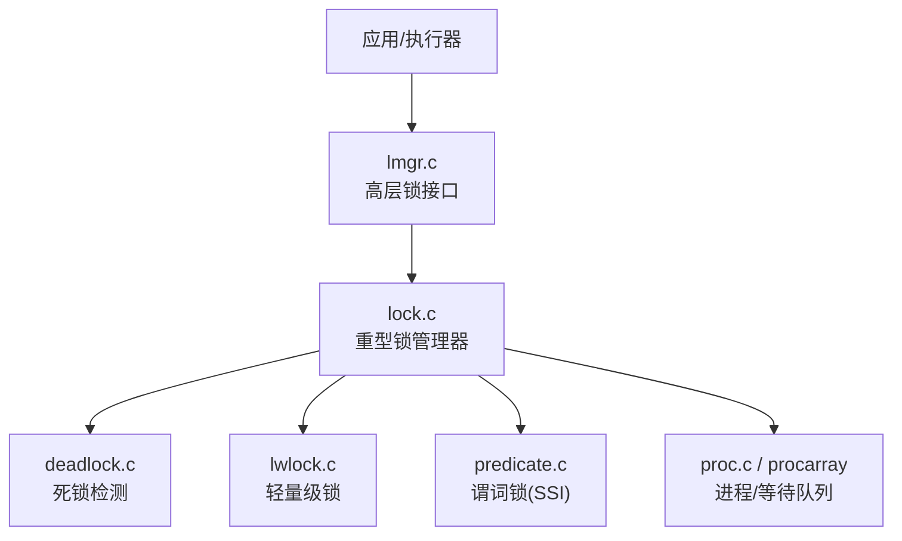
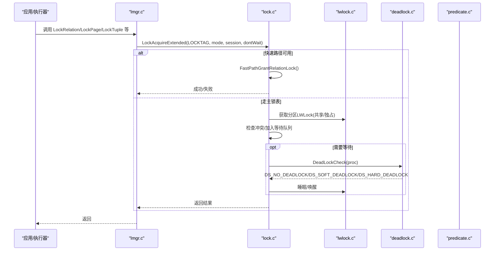
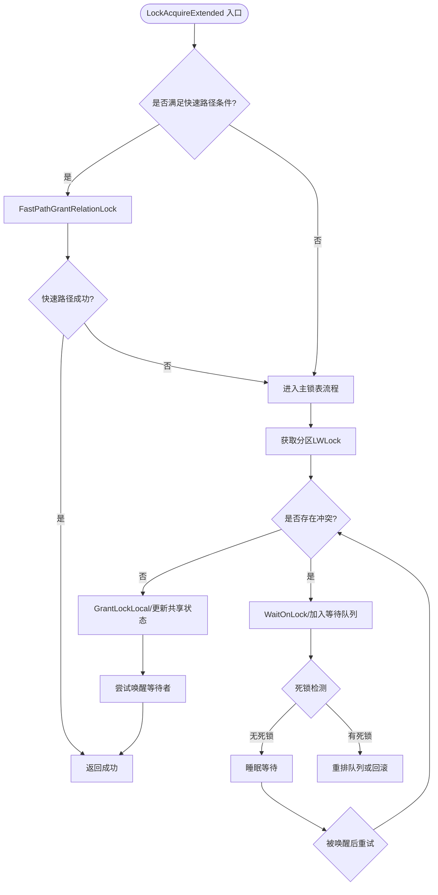
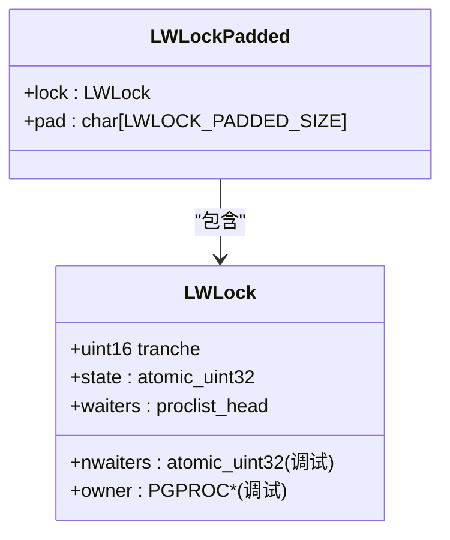
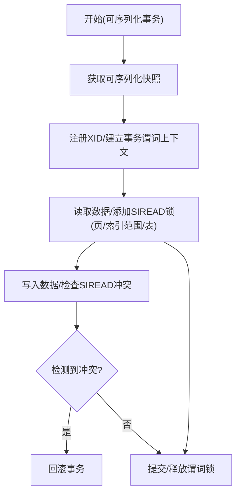
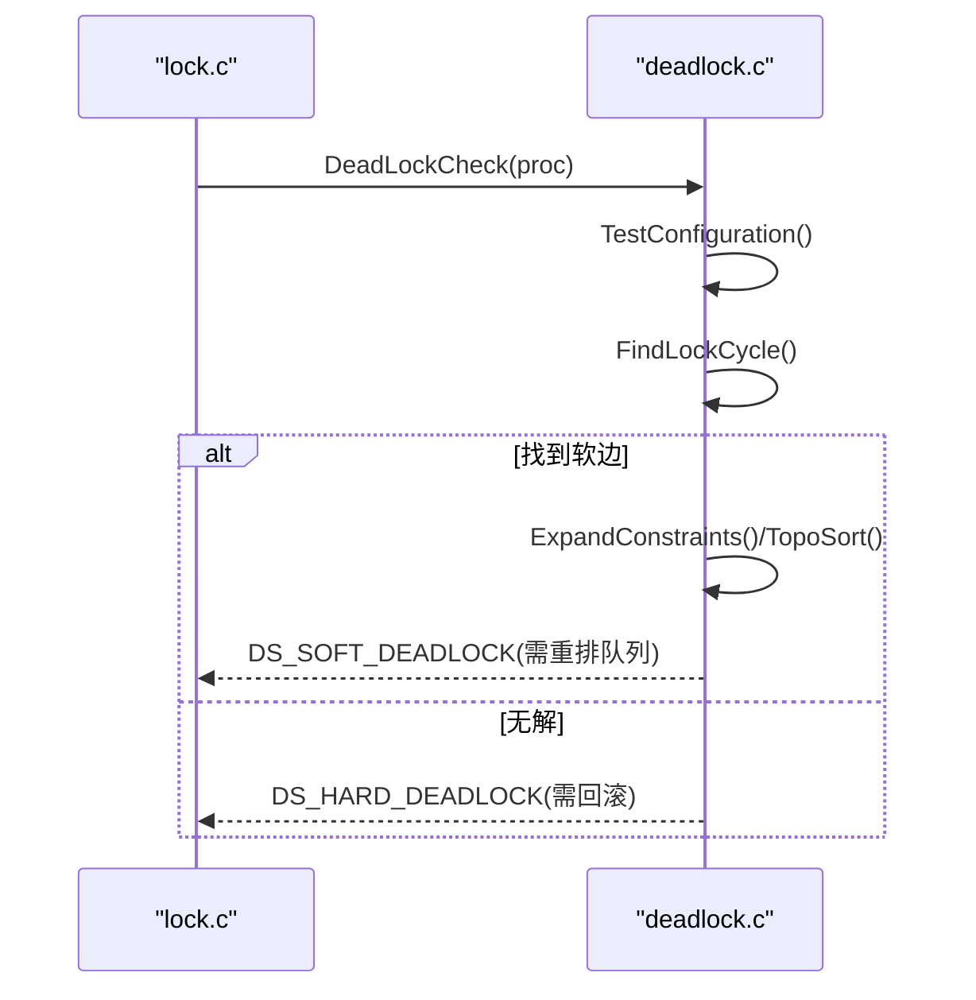
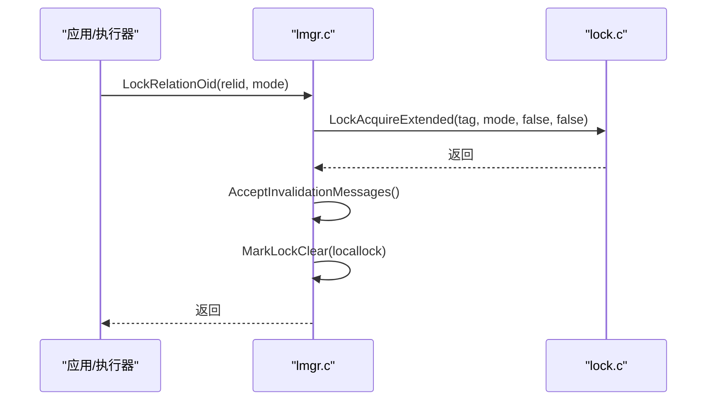
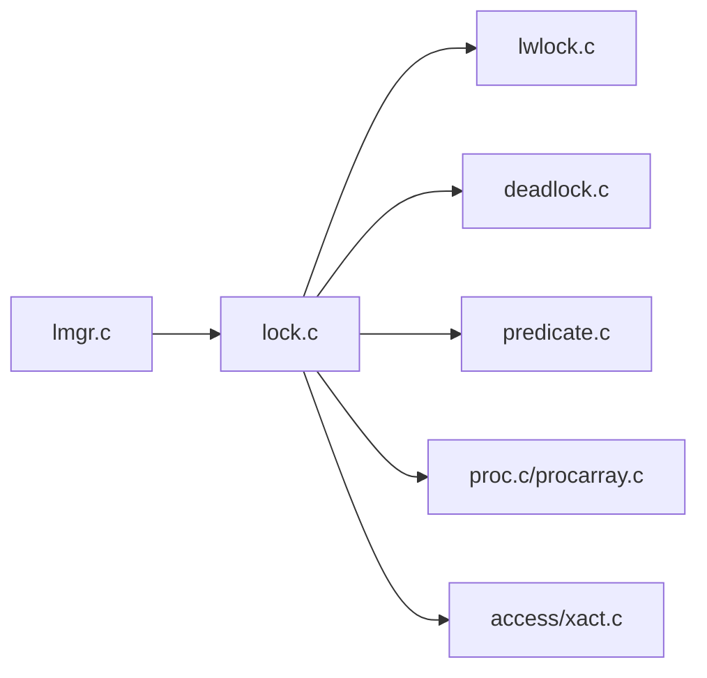

# 锁机制

<cite>
**本文引用的文件**
- [src/backend/storage/lmgr/lock.c](file://src/backend/storage/lmgr/lock.c)
- [src/backend/storage/lmgr/lwlock.c](file://src/backend/storage/lmgr/lwlock.c)
- [src/backend/storage/lmgr/deadlock.c](file://src/backend/storage/lmgr/deadlock.c)
- [src/backend/storage/lmgr/lmgr.c](file://src/backend/storage/lmgr/lmgr.c)
- [src/backend/storage/lmgr/predicate.c](file://src/backend/storage/lmgr/predicate.c)
- [src/include/storage/lock.h](file://src/include/storage/lock.h)
- [src/include/storage/lwlock.h](file://src/include/storage/lwlock.h)
- [src/include/storage/predicate.h](file://src/include/storage/predicate.h)
</cite>

## 目录
1. [简介](#简介)
2. [项目结构](#项目结构)
3. [核心组件](#核心组件)
4. [架构总览](#架构总览)
5. [详细组件分析](#详细组件分析)
6. [依赖关系分析](#依赖关系分析)
7. [性能考量](#性能考量)
8. [故障排查指南](#故障排查指南)
9. [结论](#结论)
10. [附录](#附录)

## 简介
本文件系统性梳理 PostgreSQL 的锁管理机制，覆盖行级锁、表级锁、轻量级锁（LWLock）与重入锁的实现原理；解释锁粒度、锁升级策略、死锁检测与恢复；文档化各类锁的使用场景、性能影响与最佳实践；并提供锁监控工具使用指南与常见问题诊断方法。内容基于源码仓库中的锁管理模块进行分析与归纳。

## 项目结构
PostgreSQL 的锁子系统位于 storage/lmgr 目录，包含：
- 重型锁管理器（Lock Manager）：负责对象级/行级/页级等锁的获取、释放、冲突检测、等待队列与唤醒。
- 轻量级锁管理器（Lightweight Lock Manager）：用于共享内存结构的互斥访问，提供无阻塞读路径与可等待变量语义。
- 谓词锁（Predicate Locking）：实现可序列化隔离级别下的读写冲突检测。
- 死锁检测：构建等待图并寻找环，尝试通过重排等待队列或回滚进程来解除死锁。
- 高层接口封装：面向关系、页面、元组、事务等的便捷加锁/解锁 API。

图表来源
- [src/backend/storage/lmgr/lmgr.c:108-238](file://src/backend/storage/lmgr/lmgr.c#L108-L238)
- [src/backend/storage/lmgr/lock.c:389-465](file://src/backend/storage/lmgr/lock.c#L389-L465)
- [src/backend/storage/lmgr/lwlock.c:462-570](file://src/backend/storage/lmgr/lwlock.c#L462-L570)
- [src/backend/storage/lmgr/deadlock.c:216-285](file://src/backend/storage/lmgr/deadlock.c#L216-L285)
- [src/backend/storage/lmgr/predicate.c:147-191](file://src/backend/storage/lmgr/predicate.c#L147-L191)

章节来源
- [src/backend/storage/lmgr/lmgr.c:108-238](file://src/backend/storage/lmgr/lmgr.c#L108-L238)
- [src/backend/storage/lmgr/lock.c:389-465](file://src/backend/storage/lmgr/lock.c#L389-L465)
- [src/backend/storage/lmgr/lwlock.c:462-570](file://src/backend/storage/lmgr/lwlock.c#L462-L570)
- [src/backend/storage/lmgr/deadlock.c:216-285](file://src/backend/storage/lmgr/deadlock.c#L216-L285)
- [src/backend/storage/lmgr/predicate.c:147-191](file://src/backend/storage/lmgr/predicate.c#L147-L191)

## 核心组件
- 重型锁管理器（lock.c）
  - 维护共享内存中的 LOCK 与 PROCLOCK 哈希表，记录每个被锁对象的授予/请求状态与持有者列表。
  - 支持快速路径（Fast Path）优化：对不冲突的关系锁在本地缓存位图加速获取/释放。
  - 提供锁模式冲突表、锁方法表、分区锁（LWLock）保护哈希表分区。
  - 关键入口：InitLocks、LockAcquireExtended、LockRelease、GrantLockLocal、WaitOnLock 等。
- 轻量级锁管理器（lwlock.c）
  - 为共享内存数据结构提供互斥访问，支持共享/独占模式与“等待变量”语义。
  - 采用原子计数 + 两阶段获取策略，减少自旋开销，支持无阻塞共享获取。
  - 支持命名 tranche 与统计信息收集。
- 谓词锁（predicate.c）
  - 实现 SSI（可序列化快照隔离），以 SIREAD 锁标记读取范围，避免阻塞但检测读写冲突。
  - 维护事务级谓词锁链表与目标哈希分区锁，按严格顺序获取以避免竞争。
- 死锁检测（deadlock.c）
  - 构建等待图，识别硬边（已持有冲突锁）与软边（等待队列中前置冲突请求）。
  - 尝试通过重排等待队列消除软边；若不可解则返回硬死锁，由调用方中止某事务。
- 高层接口（lmgr.c）
  - 面向关系、页面、元组、事务、扩展名等的高层加锁/解锁 API，统一构造 LOCKTAG 并调用底层锁管理器。

章节来源
- [src/backend/storage/lmgr/lock.c:60-154](file://src/backend/storage/lmgr/lock.c#L60-L154)
- [src/backend/storage/lmgr/lock.c:165-259](file://src/backend/storage/lmgr/lock.c#L165-L259)
- [src/backend/storage/lmgr/lock.c:389-465](file://src/backend/storage/lmgr/lock.c#L389-L465)
- [src/backend/storage/lmgr/lwlock.c:1-76](file://src/backend/storage/lmgr/lwlock.c#L1-L76)
- [src/backend/storage/lmgr/lwlock.c:462-570](file://src/backend/storage/lmgr/lwlock.c#L462-L570)
- [src/backend/storage/lmgr/predicate.c:27-83](file://src/backend/storage/lmgr/predicate.c#L27-L83)
- [src/backend/storage/lmgr/deadlock.c:36-91](file://src/backend/storage/lmgr/deadlock.c#L36-L91)
- [src/backend/storage/lmgr/lmgr.c:108-238](file://src/backend/storage/lmgr/lmgr.c#L108-L238)

## 架构总览
下图展示从高层接口到底层锁管理的调用链路与数据流。

图表来源
- [src/backend/storage/lmgr/lmgr.c:108-238](file://src/backend/storage/lmgr/lmgr.c#L108-L238)
- [src/backend/storage/lmgr/lock.c:765-800](file://src/backend/storage/lmgr/lock.c#L765-L800)
- [src/backend/storage/lmgr/lwlock.c:735-746](file://src/backend/storage/lmgr/lwlock.c#L735-L746)
- [src/backend/storage/lmgr/deadlock.c:216-285](file://src/backend/storage/lmgr/deadlock.c#L216-L285)

## 详细组件分析

### 重型锁管理器（lock.c）
- 数据结构
  - LOCK：每对象一条，记录 granted/requested/waitMask、等待队列、持有者列表。
  - PROCLOCK：每个持有者在某对象上的锁条目，关联 PGPROC。
  - LOCALLOCK：后端本地缓存，记录当前事务持有的锁计数与资源所有者。
- 锁模式与冲突
  - 默认锁方法定义多种锁模式（如 AccessShareLock、RowExclusiveLock、AccessExclusiveLock 等），并通过冲突表判定是否冲突。
- 快速路径
  - 针对同一数据库内非共享关系的低冲突锁（小于 ShareUpdateExclusiveLock），使用后端本地位图加速获取/释放。
  - 当存在强锁时，禁用快速路径，退回主锁表。
- 初始化与哈希分区
  - InitLocks 创建 LOCK/PROCLOCK/LOCALLOCK 哈希表，分配 fast-path 强锁计数器。
  - 使用 NUM_LOCK_PARTITIONS 个分区 LWLock 保护哈希表分区，降低锁竞争。
- 关键流程
  - LockAcquireExtended：选择快速路径或主锁表；必要时进入 WaitOnLock；处理会话锁与资源所有者。
  - GrantLockLocal/UnGrantLock：更新本地与共享状态，触发唤醒。
  - LockHasWaiters：检查是否有其他进程等待该锁。

图表来源
- [src/backend/storage/lmgr/lock.c:165-259](file://src/backend/storage/lmgr/lock.c#L165-L259)
- [src/backend/storage/lmgr/lock.c:389-465](file://src/backend/storage/lmgr/lock.c#L389-L465)
- [src/backend/storage/lmgr/lock.c:765-800](file://src/backend/storage/lmgr/lock.c#L765-L800)

章节来源
- [src/backend/storage/lmgr/lock.c:60-154](file://src/backend/storage/lmgr/lock.c#L60-L154)
- [src/backend/storage/lmgr/lock.c:165-259](file://src/backend/storage/lmgr/lock.c#L165-L259)
- [src/backend/storage/lmgr/lock.c:389-465](file://src/backend/storage/lmgr/lock.c#L389-L465)
- [src/backend/storage/lmgr/lock.c:765-800](file://src/backend/storage/lmgr/lock.c#L765-L800)

### 轻量级锁管理器（lwlock.c）
- 设计目标
  - 为共享内存结构提供互斥访问，支持共享/独占模式与“等待变量”语义。
  - 通过原子操作与两阶段获取，减少自旋与上下文切换开销。
- 状态与标志
  - 使用单一原子 state 字段编码独占/共享计数与等待标志。
  - 支持 LWLockUpdateVar/LWLockWaitForVar/LWLockReleaseClearVar 实现条件变量式同步。
- 初始化与分区
  - CreateLWLocks 分配主数组并初始化固定 LWLock 与分区（缓冲映射、锁管理器、谓词锁管理器）。
  - 支持命名 tranche 与动态注册，便于扩展与观测。
- 统计与调试
  - 可选 LWLOCK_STATS 收集各锁的获取/阻塞/自旋次数。

图表来源
- [src/include/storage/lwlock.h:39-67](file://src/include/storage/lwlock.h#L39-L67)
- [src/backend/storage/lmgr/lwlock.c:735-746](file://src/backend/storage/lmgr/lwlock.c#L735-L746)

章节来源
- [src/backend/storage/lmgr/lwlock.c:1-76](file://src/backend/storage/lmgr/lwlock.c#L1-L76)
- [src/backend/storage/lmgr/lwlock.c:462-570](file://src/backend/storage/lmgr/lwlock.c#L462-L570)
- [src/include/storage/lwlock.h:39-67](file://src/include/storage/lwlock.h#L39-L67)

### 谓词锁（predicate.c）
- 目标与特性
  - 实现 SSI，使用 SIREAD 锁标记读取范围，不阻塞写操作但检测读写冲突。
  - 必须保存在内存中以快速访问；空间不足时需合并细粒度锁为粗粒度。
  - 仅对可序列化事务生效；只读事务在安全快照下可释放谓词锁。
- 锁序与分区
  - 严格的 LWLock 获取顺序：SerializableFinishedListLock → SerializablePredicateListLock → PredicateLockHashPartitionLock → SerializableXactHashLock。
  - 使用分区 LWLock 保护目标与锁链表，避免全局热点。
- 主要接口
  - 获取快照、注册 XID、添加/释放谓词锁、冲突检测、提交前检查、两阶段提交支持。

图表来源
- [src/backend/storage/lmgr/predicate.c:27-83](file://src/backend/storage/lmgr/predicate.c#L27-L83)
- [src/include/storage/predicate.h:43-81](file://src/include/storage/predicate.h#L43-L81)

章节来源
- [src/backend/storage/lmgr/predicate.c:27-83](file://src/backend/storage/lmgr/predicate.c#L27-L83)
- [src/include/storage/predicate.h:43-81](file://src/include/storage/predicate.h#L43-L81)

### 死锁检测与恢复（deadlock.c）
- 算法要点
  - 构建等待图：硬边来自已持有冲突锁的进程；软边来自等待队列中前置冲突请求。
  - 递归搜索环，尝试通过重排等待队列消除软边；若无法消除则判定硬死锁。
  - 记录死锁细节以便报告，并在信号处理器外打印。
- 恢复策略
  - 优先尝试重排队列；若失败，返回 DS_HARD_DEADLOCK，由调用方中止某事务（通常选择代价最小者）。
  - 特殊处理自动清理进程（autovacuum）直接阻塞的情况。

图表来源
- [src/backend/storage/lmgr/deadlock.c:216-285](file://src/backend/storage/lmgr/deadlock.c#L216-L285)
- [src/backend/storage/lmgr/deadlock.c:314-428](file://src/backend/storage/lmgr/deadlock.c#L314-L428)

章节来源
- [src/backend/storage/lmgr/deadlock.c:36-91](file://src/backend/storage/lmgr/deadlock.c#L36-L91)
- [src/backend/storage/lmgr/deadlock.c:216-285](file://src/backend/storage/lmgr/deadlock.c#L216-L285)
- [src/backend/storage/lmgr/deadlock.c:314-428](file://src/backend/storage/lmgr/deadlock.c#L314-L428)

### 高层接口（lmgr.c）
- 关系/页面/元组锁
  - LockRelationOid/ConditionalLockRelationOid：为关系加锁，随后接受失效消息并标记锁清除。
  - LockPage/UnlockPage：索引访问等方法使用的页级锁。
  - LockTuple/UnlockTuple：元组级锁，配合 MVCC 可见性判断。
- 事务锁
  - XactLockTableInsert/Delete/Wait：用于等待事务完成或子事务提升。
- 扩展名锁
  - LockRelationForExtension：防止并发扩展关系时的竞态。

图表来源
- [src/backend/storage/lmgr/lmgr.c:108-140](file://src/backend/storage/lmgr/lmgr.c#L108-L140)
- [src/backend/storage/lmgr/lmgr.c:216-238](file://src/backend/storage/lmgr/lmgr.c#L216-L238)

章节来源
- [src/backend/storage/lmgr/lmgr.c:108-238](file://src/backend/storage/lmgr/lmgr.c#L108-L238)
- [src/backend/storage/lmgr/lmgr.c:386-456](file://src/backend/storage/lmgr/lmgr.c#L386-L456)
- [src/backend/storage/lmgr/lmgr.c:473-583](file://src/backend/storage/lmgr/lmgr.c#L473-L583)
- [src/backend/storage/lmgr/lmgr.c:586-741](file://src/backend/storage/lmgr/lmgr.c#L586-L741)

## 依赖关系分析
- 组件耦合
  - lmgr.c 依赖 lock.c 进行具体锁操作；lock.c 依赖 lwlock.c 保护内部结构与等待队列；deadlock.c 由 lock.c 在等待时调用；predicate.c 独立但同样依赖 lwlock.c 与锁表分区。
- 外部依赖
  - 进程管理（proc.c/procarray.c）：等待队列、唤醒、进程状态。
  - 共享内存与原子操作：lwlock.c 使用原子变量与自旋锁。
  - 事务系统（access/xact.c）：事务生命周期与两阶段提交。
- 潜在循环
  - 通过分层调用与明确职责边界避免循环依赖；例如 deadlock.c 不反向调用 lock.c 的内部函数，仅通过返回值驱动上层行为。

图表来源
- [src/backend/storage/lmgr/lmgr.c:108-238](file://src/backend/storage/lmgr/lmgr.c#L108-L238)
- [src/backend/storage/lmgr/lock.c:389-465](file://src/backend/storage/lmgr/lock.c#L389-L465)
- [src/backend/storage/lmgr/lwlock.c:462-570](file://src/backend/storage/lmgr/lwlock.c#L462-L570)
- [src/backend/storage/lmgr/deadlock.c:216-285](file://src/backend/storage/lmgr/deadlock.c#L216-L285)
- [src/backend/storage/lmgr/predicate.c:147-191](file://src/backend/storage/lmgr/predicate.c#L147-L191)

章节来源
- [src/backend/storage/lmgr/lmgr.c:108-238](file://src/backend/storage/lmgr/lmgr.c#L108-L238)
- [src/backend/storage/lmgr/lock.c:389-465](file://src/backend/storage/lmgr/lock.c#L389-L465)
- [src/backend/storage/lmgr/lwlock.c:462-570](file://src/backend/storage/lmgr/lwlock.c#L462-L570)
- [src/backend/storage/lmgr/deadlock.c:216-285](file://src/backend/storage/lmgr/deadlock.c#L216-L285)
- [src/backend/storage/lmgr/predicate.c:147-191](file://src/backend/storage/lmgr/predicate.c#L147-L191)

## 性能考量
- 快速路径优化
  - 对常见且低冲突的关系锁使用后端本地位图，显著减少共享内存访问与锁竞争。
  - 当存在强锁时自动降级为主锁表，保证正确性。
- 分区与粒度
  - 锁表与谓词锁表按分区划分，结合 LWLock 分区锁降低热点。
  - 合理选择锁粒度（表/页/元组）平衡并发与开销。
- 等待与唤醒
  - 使用 LWLock 的原子计数与两阶段获取减少自旋；等待队列重排可降低软死锁概率。
- 谓词锁内存
  - 控制 max_predicate_locks_per_xact/relation/page，避免内存耗尽；必要时合并细粒度锁。
- 建议
  - 尽量使用更细粒度锁（如页/元组）提高并发，但注意锁表大小与 CPU 开销。
  - 避免长时间持有高冲突锁（如 AccessExclusiveLock）。
  - 对热点对象使用合适的索引与查询计划，减少锁竞争。

[本节为通用指导，不直接分析具体文件]

## 故障排查指南
- 常见症状
  - 长时间等待锁：检查是否有长事务或高冲突锁持有者。
  - 频繁死锁：分析等待图，定位软边来源，考虑调整锁顺序或事务粒度。
  - 谓词锁过多：监控 max_predicate_locks_*，必要时调整隔离级别或查询。
- 诊断步骤
  - 查看锁持有者与等待者：使用 pg_locks、pg_stat_activity。
  - 启用锁跟踪：编译时开启 LOCK_DEBUG，或使用 trace_locks/Trace_lwlocks。
  - 分析死锁日志：关注 DeadLockReport 输出的详细信息。
  - 检查谓词锁：使用 predicate 相关视图与函数。
- 工具与配置
  - GUC：max_locks_per_xact、max_predicate_locks_per_xact/relation/page。
  - 扩展：pageinspect、pgrowlocks、pgstattuple 辅助观察锁与页面状态。
  - 统计：LWLOCK_STATS 收集 LWLock 使用统计。

章节来源
- [src/backend/storage/lmgr/lock.c:279-354](file://src/backend/storage/lmgr/lock.c#L279-L354)
- [src/backend/storage/lmgr/lwlock.c:247-407](file://src/backend/storage/lmgr/lwlock.c#L247-L407)
- [src/include/storage/lock.h:36-45](file://src/include/storage/lock.h#L36-L45)
- [src/include/storage/predicate.h:22-28](file://src/include/storage/predicate.h#L22-L28)

## 结论
PostgreSQL 的锁机制通过重型锁管理器、轻量级锁、谓词锁与死锁检测协同工作，实现了高并发与强一致性的平衡。快速路径、分区化与原子操作显著提升了性能；死锁检测与恢复保障了系统的健壮性。实践中应合理选择锁粒度、控制锁数量与超时策略，并结合监控工具进行持续优化。

[本节为总结，不直接分析具体文件]

## 附录
- 锁类型与用途速查
  - 表级锁：DDL 与高冲突操作，谨慎使用。
  - 页级锁：索引操作常用，粒度适中。
  - 元组级锁：MVCC 可见性与并发更新，推荐优先。
  - 事务锁：等待事务完成，避免长时间持有。
  - 扩展名锁：防止并发扩展关系。
  - 谓词锁：SSI 隔离级别下检测读写冲突。
- 最佳实践
  - 缩短事务长度，减少锁持有时间。
  - 避免跨表大事务，降低死锁风险。
  - 合理使用索引，减少全表扫描带来的锁竞争。
  - 监控锁等待与死锁，及时调整 SQL 与事务逻辑。

[本节为补充说明，不直接分析具体文件]