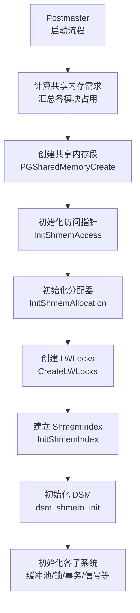
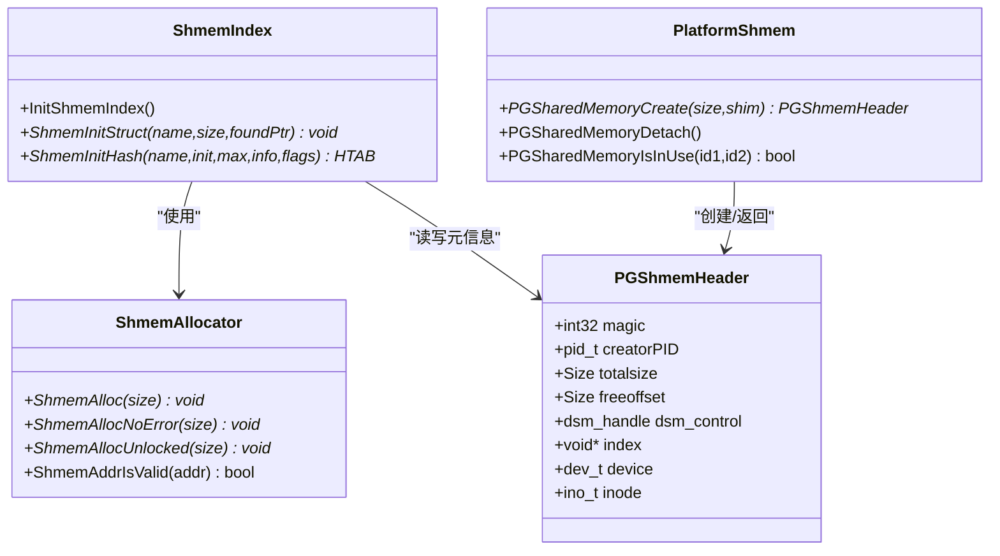
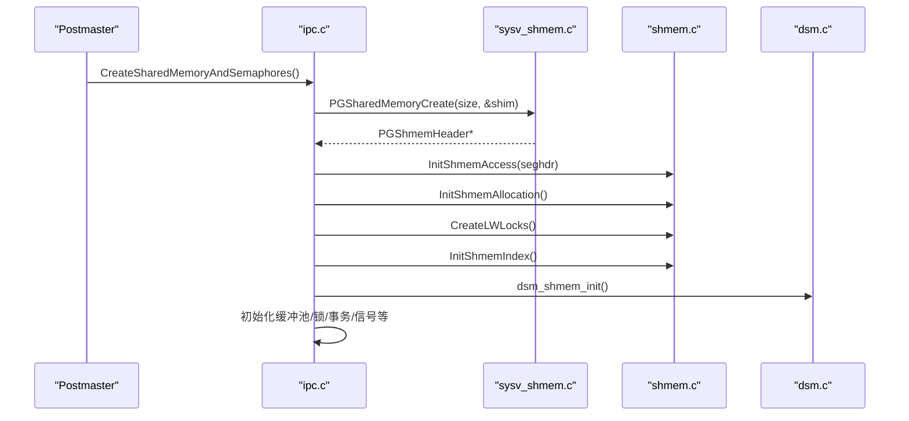
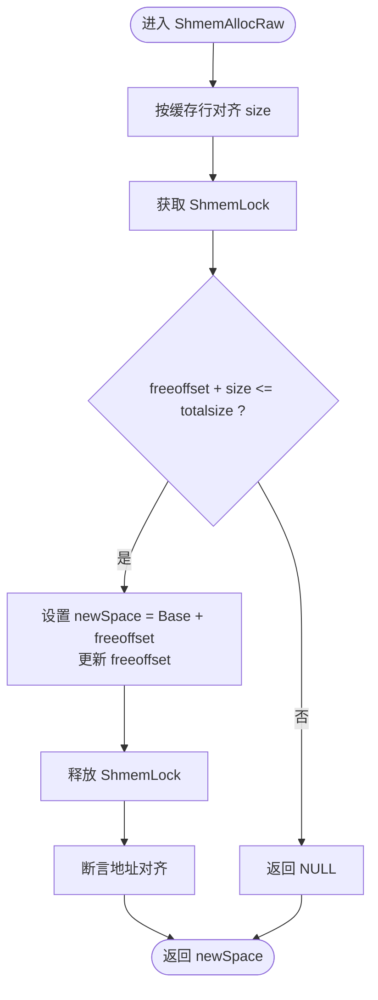

# 共享内存管理

<cite>
**本文引用的文件**
- [src/backend/storage/ipc/shmem.c](file://src/backend/storage/ipc/shmem.c)
- [src/include/storage/shmem.h](file://src/include/storage/shmem.h)
- [src/include/storage/pg_shmem.h](file://src/include/storage/pg_shmem.h)
- [src/backend/port/sysv_shmem.c](file://src/backend/port/sysv_shmem.c)
- [src/backend/storage/ipc/ipci.c](file://src/backend/storage/ipc/ipci.c)
- [src/backend/postmaster/postmaster.c](file://src/backend/postmaster/postmaster.c)
- [src/backend/port/posix_sema.c](file://src/backend/port/posix_sema.c)
</cite>

## 目录
1. [简介](#简介)
2. [项目结构](#项目结构)
3. [核心组件](#核心组件)
4. [架构总览](#架构总览)
5. [详细组件分析](#详细组件分析)
6. [依赖关系分析](#依赖关系分析)
7. [性能考虑](#性能考虑)
8. [故障诊断指南](#故障诊断指南)
9. [结论](#结论)
10. [附录](#附录)

## 简介
本文件面向希望深入理解 PostgreSQL 共享内存子系统与进程间通信机制的开发者，系统阐述共享内存段的创建、映射与管理，动态共享内存（DSM）的使用场景与接口，信号量机制、无效消息传递与并发控制策略。文档同时提供配置参数、性能调优建议与常见问题的定位方法，帮助读者在实际工程中高效使用并优化共享内存。

## 项目结构
PostgreSQL 的共享内存实现由平台无关层与平台相关层组成：
- 平台无关层负责共享内存段头、分配器、索引表、哈希表绑定等通用逻辑。
- 平台相关层负责底层系统调用（如 SysV shm/mmap、POSIX 信号量），屏蔽差异。
- Postmaster 在启动阶段计算所需大小、创建共享内存段、初始化各子系统所需的共享数据结构。

**图示来源**
- [src/backend/storage/ipc/ipci.c:81-247](file://src/backend/storage/ipc/ipci.c#L81-L247)
- [src/backend/port/sysv_shmem.c:617-795](file://src/backend/port/sysv_shmem.c#L617-L795)
- [src/backend/storage/ipc/shmem.c:98-149](file://src/backend/storage/ipc/shmem.c#L98-L149)

**章节来源**
- [src/backend/storage/ipc/ipci.c:81-247](file://src/backend/storage/ipc/ipci.c#L81-L247)
- [src/backend/port/sysv_shmem.c:617-795](file://src/backend/port/sysv_shmem.c#L617-L795)
- [src/backend/storage/ipc/shmem.c:98-149](file://src/backend/storage/ipc/shmem.c#L98-L149)

## 核心组件
- 共享内存段头 PGShmemHeader：记录段大小、空闲偏移、DSM 控制句柄、数据目录标识等元信息。
- 共享内存分配器：基于连续分配的简单分配器，支持缓存行对齐与无锁前置分配。
- ShmemIndex 索引表：以名称为键维护已分配结构的地址与尺寸，便于多进程“发现/附加”。
- 哈希表绑定：通过 ShmemInitHash 将哈希表目录与条目置于共享内存，保证跨进程一致可见。
- 平台抽象：SysV 或 mmap 匿名共享内存，统一对外 API。
- 信号量：POSIX/SysV 两种实现，用于自旋锁模拟、进程同步等。
- 动态共享内存（DSM）：用于扩展区、并行执行等场景的按需共享内存。

**章节来源**
- [src/include/storage/pg_shmem.h:29-71](file://src/include/storage/pg_shmem.h#L29-L71)
- [src/backend/storage/ipc/shmem.c:158-273](file://src/backend/storage/ipc/shmem.c#L158-L273)
- [src/backend/storage/ipc/shmem.c:287-493](file://src/backend/storage/ipc/shmem.c#L287-L493)
- [src/backend/port/posix_sema.c:159-383](file://src/backend/port/posix_sema.c#L159-L383)

## 架构总览
PostgreSQL 共享内存采用“固定头部 + 连续分配 + 命名索引”的模型：
- Postmaster 计算总需求后，一次性申请一块共享内存；子进程通过 fork 继承映射。
- 所有模块通过统一的 ShmemInitStruct/ShmemInitHash 获取或附加到共享结构。
- 通过 LWLock 保护索引表与关键区域，避免竞争。
- 平台层根据配置选择 SysV 或 mmap 实现，必要时结合大页。

**图示来源**
- [src/include/storage/pg_shmem.h:29-71](file://src/include/storage/pg_shmem.h#L29-L71)
- [src/backend/storage/ipc/shmem.c:158-273](file://src/backend/storage/ipc/shmem.c#L158-L273)
- [src/backend/storage/ipc/shmem.c:287-493](file://src/backend/storage/ipc/shmem.c#L287-L493)
- [src/backend/port/sysv_shmem.c:617-795](file://src/backend/port/sysv_shmem.c#L617-L795)

## 详细组件分析

### 共享内存段创建与生命周期
- 创建入口：CreateSharedMemoryAndSemaphores 汇总各模块需求，调用 PGSharedMemoryCreate 创建段，随后初始化访问指针、分配器、LWLocks、ShmemIndex、DSM 与各子系统。
- 平台实现：sysv_shmem.c 中 PGSharedMemoryCreate 根据 shared_memory_type 选择 SysV 或 mmap 匿名段；若使用 mmap，则额外保留最小 SysV 段作为互斥与探测用途。
- 生命周期：on_shmem_exit 注册回调，确保退出时正确解映射/分离与删除。

**图示来源**
- [src/backend/storage/ipc/ipci.c:81-247](file://src/backend/storage/ipc/ipci.c#L81-L247)
- [src/backend/port/sysv_shmem.c:617-795](file://src/backend/port/sysv_shmem.c#L617-L795)
- [src/backend/storage/ipc/shmem.c:98-149](file://src/backend/storage/ipc/shmem.c#L98-L149)

**章节来源**
- [src/backend/storage/ipc/ipci.c:81-247](file://src/backend/storage/ipc/ipci.c#L81-L247)
- [src/backend/port/sysv_shmem.c:617-795](file://src/backend/port/sysv_shmem.c#L617-L795)

### 共享内存分配与索引机制
- 分配器：ShmemAllocRaw 按缓存行对齐分配，使用自旋锁保护 freeoffset；ShmemAlloc 失败抛错，ShmemAllocNoError 返回 NULL。
- 索引表：ShmemIndex 以字符串名登记结构体位置与尺寸；ShmemInitStruct 查找或分配，ShmemInitHash 将哈希表目录与条目放入共享内存，保证跨进程一致性。
- 有效性检查：ShmemAddrIsValid 验证指针是否落在共享段内。

**图示来源**
- [src/backend/storage/ipc/shmem.c:192-233](file://src/backend/storage/ipc/shmem.c#L192-L233)

**章节来源**
- [src/backend/storage/ipc/shmem.c:158-273](file://src/backend/storage/ipc/shmem.c#L158-L273)
- [src/backend/storage/ipc/shmem.c:287-493](file://src/backend/storage/ipc/shmem.c#L287-L493)

### 哈希表共享与绑定
- ShmemInitHash 强制哈希表目录大小固定且足够大，避免运行时扩容导致其他进程不可见。
- 通过 infoP->alloc 指向 ShmemAllocNoError，确保哈希表内部分配也来自共享内存。
- 若同名哈希表已存在，则以 HASH_ATTACH 模式附加，避免重复初始化。

**章节来源**
- [src/backend/storage/ipc/shmem.c:338-375](file://src/backend/storage/ipc/shmem.c#L338-L375)

### 信号量机制与并发控制
- POSIX 信号量实现：支持命名与未命名两种方式；未命名方式将 sem_t 数组放在共享内存，命名方式在 postmaster 私有内存维护指针并在退出时关闭。
- 典型用途：自旋锁模拟、进程间同步、资源计数等。
- 并发安全：sem_wait/sem_post 处理 EINTR，确保可靠加解锁。

**章节来源**
- [src/backend/port/posix_sema.c:159-383](file://src/backend/port/posix_sema.c#L159-L383)

### 动态共享内存（DSM）
- 作用：为扩展区、并行执行、后台任务等提供按需共享内存，独立于主共享段，支持跨进程共享与生命周期管理。
- 初始化：在 CreateSharedMemoryAndSemaphores 中调用 dsm_shmem_init 与 dsm_postmaster_startup，完成控制段与后端关联。
- 清理：当检测到遗留 DSM 控制段时进行清理，避免僵尸对象。

**章节来源**
- [src/backend/storage/ipc/ipci.c:186-240](file://src/backend/storage/ipc/ipci.c#L186-L240)
- [src/backend/port/sysv_shmem.c:754-757](file://src/backend/port/sysv_shmem.c#L754-L757)

### 无效消息传递与进程信号
- 共享失效状态：CreateSharedInvalidationState 建立共享失效消息通道，用于缓存/目录变更通知。
- 进程信号：PMSignalShmemInit/ProcSignalShmemInit 初始化进程间信号设施，配合 Postmaster 协调后端生命周期与中断。

**章节来源**
- [src/backend/storage/ipc/ipci.c:218-229](file://src/backend/storage/ipc/ipci.c#L218-L229)
- [src/backend/postmaster/postmaster.c:15-23](file://src/backend/postmaster/postmaster.c#L15-L23)

## 依赖关系分析
- 启动顺序依赖：先创建共享内存段，再初始化分配器与 LWLocks，然后建立 ShmemIndex，最后初始化 DSM 与各子系统。
- 模块耦合：各子系统通过 ShmemInitStruct/ShmemInitHash 获取共享结构，降低直接耦合；通过 LWLock 保护临界区。
- 平台抽象：上层不感知 SysV/mmap 差异，仅通过 PGSharedMemoryCreate 等接口交互。

**图示来源**
- [src/backend/storage/ipc/ipci.c:81-247](file://src/backend/storage/ipc/ipci.c#L81-L247)
- [src/backend/port/sysv_shmem.c:617-795](file://src/backend/port/sysv_shmem.c#L617-L795)
- [src/backend/storage/ipc/shmem.c:98-149](file://src/backend/storage/ipc/shmem.c#L98-L149)

**章节来源**
- [src/backend/storage/ipc/ipci.c:81-247](file://src/backend/storage/ipc/ipci.c#L81-L247)
- [src/backend/port/sysv_shmem.c:617-795](file://src/backend/port/sysv_shmem.c#L617-L795)
- [src/backend/storage/ipc/shmem.c:98-149](file://src/backend/storage/ipc/shmem.c#L98-L149)

## 性能考虑
- 分配对齐：按缓存行对齐减少伪共享，提升多核并发访问性能。
- 预分配策略：哈希表目录大小在创建时确定，避免运行时扩容导致的跨进程不可见问题。
- 大页支持：mmap 路径可启用 MAP_HUGETLB，减少 TLB 压力；需内核支持与合理配置。
- 共享内存类型：默认使用 mmap 匿名共享内存，仅在特定场景回退至 SysV；可通过 shared_memory_type 调整。
- 监控与诊断：通过 SQL 函数查看共享内存分配情况，辅助容量规划与泄漏排查。

[本节为通用指导，无需具体文件引用]

## 故障诊断指南
- 共享内存不足：
  - 现象：分配失败报错，提示超出内核限制或可用内存不足。
  - 排查：核对 shared_buffers、max_connections、并行度等对共享内存的影响；检查内核 SHMMAX/SHMALL/SHMMNI 限制。
  - 参考：错误信息与提示包含系统调用与参数说明。
- 段冲突与残留：
  - 现象：启动时报“已有共享内存段仍在使用”，或检测到遗留 DSM 控制段。
  - 排查：确认是否存在旧进程未退出；必要时清理残留段与 DSM 控制段。
- 大页失败：
  - 现象：MAP_HUGETLB 失败，自动回退普通页；若强制开启则报错。
  - 排查：检查系统大页配置与数量；调整 huge_pages/huge_page_size。
- 信号量异常：
  - 现象：sem_wait/sem_post 失败或死锁。
  - 排查：检查 EINTR 处理与资源释放路径；确认未命名/命名信号量生命周期。

**章节来源**
- [src/backend/port/sysv_shmem.c:116-220](file://src/backend/port/sysv_shmem.c#L116-L220)
- [src/backend/port/sysv_shmem.c:535-597](file://src/backend/port/sysv_shmem.c#L535-L597)
- [src/backend/port/posix_sema.c:314-383](file://src/backend/port/posix_sema.c#L314-L383)

## 结论
PostgreSQL 的共享内存体系以“固定头部 + 连续分配 + 命名索引”为核心，结合平台抽象与完善的初始化流程，实现了稳定高效的进程间共享内存管理。通过合理的配置与调优（如大页、共享内存类型、哈希表预分配），可在高并发与大数据场景下获得良好性能。借助内置的诊断能力与清晰的错误提示，可有效定位与解决常见问题。

[本节为总结性内容，无需具体文件引用]

## 附录

### 配置参数与含义
- shared_memory_type：选择共享内存实现类型（默认 mmap，可选 sysv）。
- huge_pages：是否启用大页（off/on/try）。
- huge_page_size：指定大页大小（单位 KB）。
- 其他：shared_buffers、max_connections、并行度等间接影响共享内存占用。

**章节来源**
- [src/include/storage/pg_shmem.h:42-66](file://src/include/storage/pg_shmem.h#L42-L66)

### 常用 API 速查
- 共享内存段：
  - PGSharedMemoryCreate：创建共享内存段并初始化头部。
  - PGSharedMemoryDetach：分离共享内存段。
  - PGSharedMemoryIsInUse：检测段是否仍被使用。
- 共享内存分配：
  - ShmemAlloc/ShmemAllocNoError/ShmemAllocUnlocked：分配共享内存块。
  - ShmemAddrIsValid：校验地址是否在共享段内。
- 共享结构注册与查找：
  - ShmemInitStruct：按名称查找或分配共享结构。
  - ShmemInitHash：创建/附加共享哈希表。
- 信号量：
  - PGSemaphoreCreate/Reset/Lock/Unlock/TryLock：信号量基本操作。

**章节来源**
- [src/include/storage/pg_shmem.h:63-71](file://src/include/storage/pg_shmem.h#L63-L71)
- [src/include/storage/shmem.h:34-44](file://src/include/storage/shmem.h#L34-L44)
- [src/backend/port/posix_sema.c:256-383](file://src/backend/port/posix_sema.c#L256-L383)