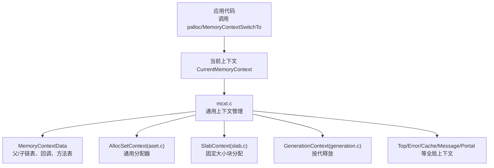
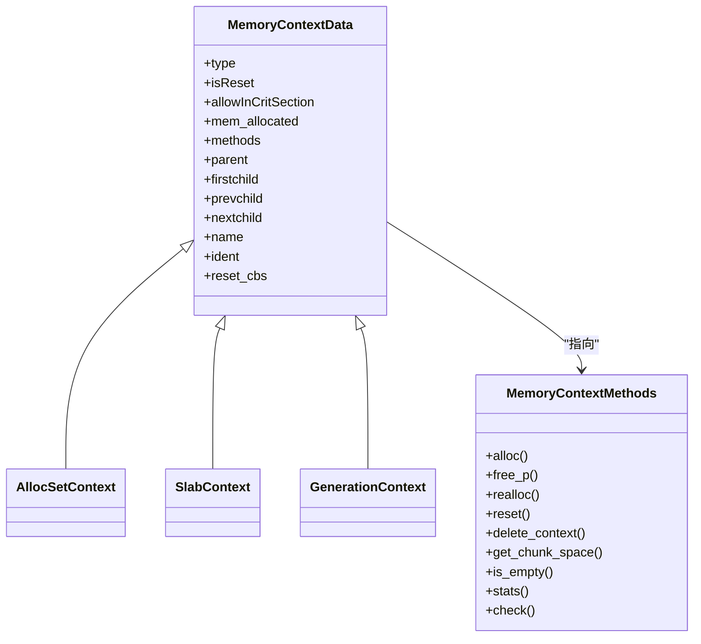
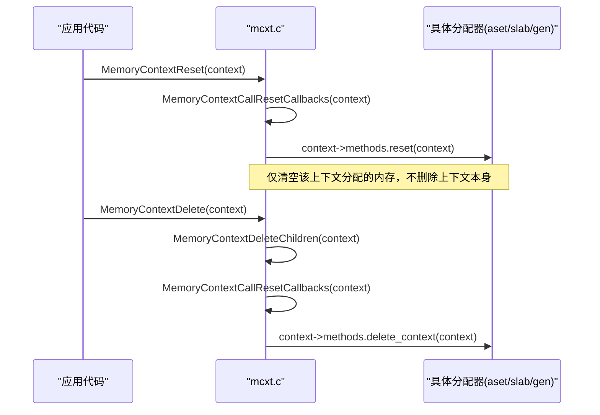
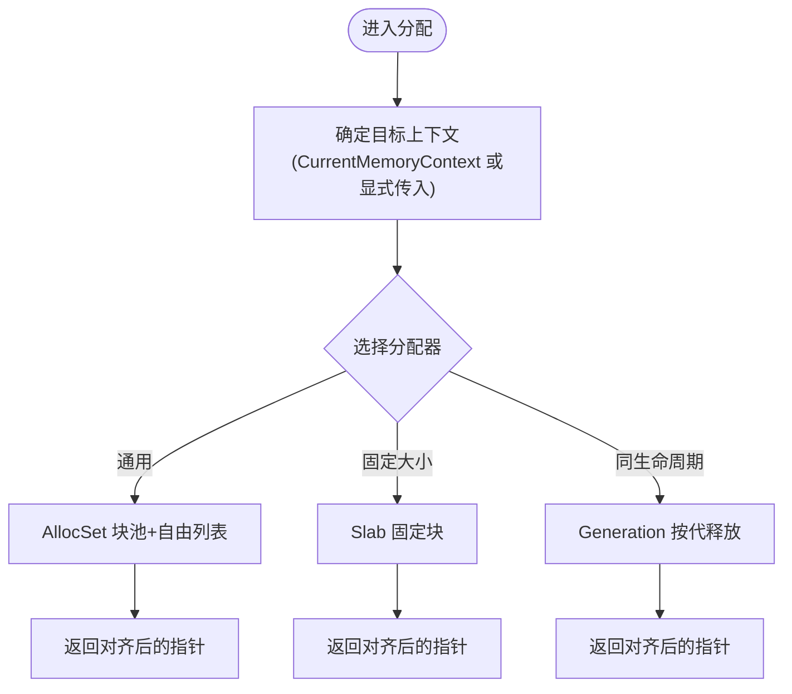
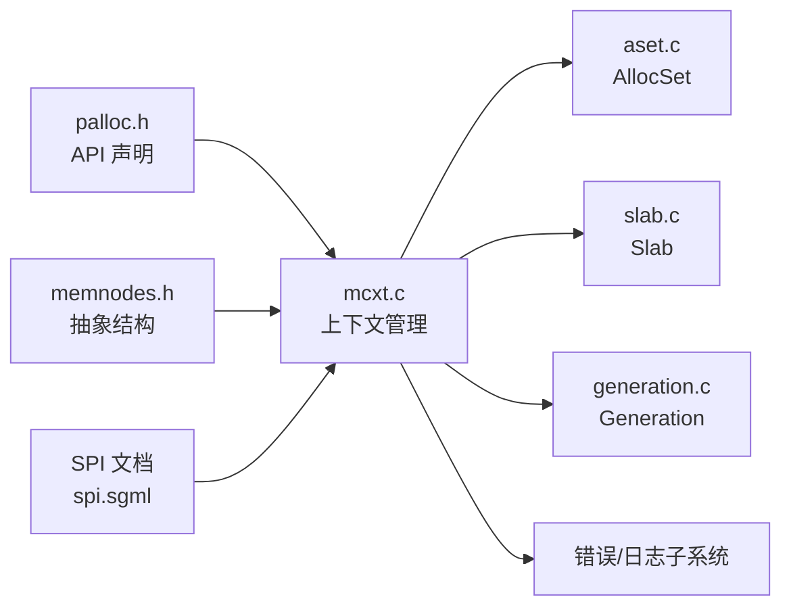

# 内存上下文管理

<cite>
**本文引用的文件**
- [mcxt.c](file://src/backend/utils/mmgr/mcxt.c)
- [memnodes.h](file://src/include/nodes/memnodes.h)
- [palloc.h](file://src/include/utils/palloc.h)
- [README](file://src/backend/utils/mmgr/README)
- [aset.c](file://src/backend/utils/mmgr/aset.c)
- [slab.c](file://src/backend/utils/mmgr/slab.c)
- [generation.c](file://src/backend/utils/mmgr/generation.c)
- [spi.sgml](file://doc/src/sgml/spi.sgml)
</cite>

## 目录
1. [简介](#简介)
2. [项目结构](#项目结构)
3. [核心组件](#核心组件)
4. [架构总览](#架构总览)
5. [详细组件分析](#详细组件分析)
6. [依赖关系分析](#依赖关系分析)
7. [性能考量](#性能考量)
8. [故障排查指南](#故障排查指南)
9. [结论](#结论)
10. [附录](#附录)

## 简介
本文件系统性阐述 PostgreSQL 的内存上下文（Memory Context）管理机制，覆盖设计原理、层次结构、生命周期管理、标准上下文用途、创建/销毁/重置/统计接口、分配模式、上下文切换机制与错误处理策略。同时提供最佳实践与性能优化建议，帮助开发者正确使用内存上下文以避免内存泄漏并提升系统稳定性。

## 项目结构
内存上下文子系统位于后端 utils/mmgr 目录，核心由 mcxt.c 提供与具体实现无关的上下文管理逻辑；具体分配器通过 aset.c、slab.c、generation.c 实现不同的 MemoryContextMethods 策略。公共接口在 include/utils/palloc.h 与 include/nodes/memnodes.h 中声明，README 提供了高层设计与使用约定。

图表来源
- [mcxt.c:39-58](file://src/backend/utils/mmgr/mcxt.c#L39-L58)
- [memnodes.h:78-93](file://src/include/nodes/memnodes.h#L78-L93)
- [aset.c:121-137](file://src/backend/utils/mmgr/aset.c#L121-L137)
- [slab.c:64-80](file://src/backend/utils/mmgr/slab.c#L64-L80)
- [generation.c:58-67](file://src/backend/utils/mmgr/generation.c#L58-L67)

章节来源
- [README:9-49](file://src/backend/utils/mmgr/README#L9-L49)
- [palloc.h:11-18](file://src/include/utils/palloc.h#L11-L18)
- [mcxt.c:39-58](file://src/backend/utils/mmgr/mcxt.c#L39-L58)

## 核心组件
- 抽象类型与方法表
  - MemoryContextData：包含类型标识、父/子指针、名称/标识、回调链、已分配计数、是否允许在临界区分配等字段。
  - MemoryContextMethods：定义 alloc/free/realloc/reset/delete/get_chunk_space/is_empty/stats/check 等方法指针，作为虚拟函数表。
- 当前上下文与切换
  - CurrentMemoryContext：默认分配上下文，通过 MemoryContextSwitchTo 切换。
- 标准全局上下文
  - TopMemoryContext：根上下文，近似“进程级 malloc”，不主动 reset/delete。
  - ErrorContext：错误恢复专用，保证始终有少量可用内存，并允许在临界区分配。
  - CacheMemoryContext：持久缓存（如 relcache/catcache）存放处。
  - MessageContext：当前消息及派生临时数据，随外层循环周期重置。
  - TopTransactionContext/CurTransactionContext：事务级上下文，用于跨子事务状态。
  - PortalContext：当前执行门户的上下文指针。
- 分配器实现
  - AllocSetContext（aset.c）：通用分配器，块池+自由列表，适合大多数场景。
  - SlabContext（slab.c）：固定大小块分配，适合大量等长对象。
  - GenerationContext（generation.c）：按代/批次释放，适合 FIFO 或同生命周期分组。

章节来源
- [memnodes.h:29-93](file://src/include/nodes/memnodes.h#L29-L93)
- [palloc.h:55-79](file://src/include/utils/palloc.h#L55-L79)
- [mcxt.c:39-58](file://src/backend/utils/mmgr/mcxt.c#L39-L58)
- [README:170-252](file://src/backend/utils/mmgr/README#L170-L252)
- [aset.c:121-137](file://src/backend/utils/mmgr/aset.c#L121-L137)
- [slab.c:64-80](file://src/backend/utils/mmgr/slab.c#L64-L80)
- [generation.c:58-67](file://src/backend/utils/mmgr/generation.c#L58-L67)

## 架构总览
内存上下文采用树形层次结构，所有上下文构成森林，根为 TopMemoryContext。每个上下文维护父/子双向链表，支持批量 reset/delete 以简化生命周期管理。分配器通过方法表多态化，统一对外暴露 MemoryContext API。

图表来源
- [memnodes.h:78-93](file://src/include/nodes/memnodes.h#L78-L93)
- [memnodes.h:58-75](file://src/include/nodes/memnodes.h#L58-L75)
- [aset.c:121-137](file://src/backend/utils/mmgr/aset.c#L121-L137)
- [slab.c:64-80](file://src/backend/utils/mmgr/slab.c#L64-L80)
- [generation.c:58-67](file://src/backend/utils/mmgr/generation.c#L58-L67)

## 详细组件分析

### 上下文生命周期与操作
- 初始化
  - MemoryContextInit 创建 TopMemoryContext 与 ErrorContext，并将 CurrentMemoryContext 指向 TopMemoryContext。ErrorContext 配置最小保留内存并允许在临界区分配。
- 创建/删除/重置
  - MemoryContextCreate（由具体分配器封装）创建上下文节点并挂入父上下文。
  - MemoryContextDelete 递归删除子上下文，调用上下文特定 delete 方法，清理回调与标识。
  - MemoryContextReset/MemoryContextResetOnly 触发回调并调用上下文特定 reset，清空已分配空间。
- 父子关系与重归属
  - MemoryContextSetParent 可改变上下文归属，便于将短生命周期上下文提升为长生命周期（例如转至 CacheMemoryContext）。
- 回调机制
  - MemoryContextRegisterResetCallback 注册在 reset/delete 前调用的回调，常用于释放非 palloc 资源（文件句柄、外部库内存等）。

图表来源
- [mcxt.c:147-191](file://src/backend/utils/mmgr/mcxt.c#L147-L191)
- [mcxt.c:222-260](file://src/backend/utils/mmgr/mcxt.c#L222-L260)
- [mcxt.c:296-328](file://src/backend/utils/mmgr/mcxt.c#L296-L328)

章节来源
- [mcxt.c:103-140](file://src/backend/utils/mmgr/mcxt.c#L103-L140)
- [mcxt.c:147-191](file://src/backend/utils/mmgr/mcxt.c#L147-L191)
- [mcxt.c:222-260](file://src/backend/utils/mmgr/mcxt.c#L222-L260)
- [mcxt.c:296-328](file://src/backend/utils/mmgr/mcxt.c#L296-L328)
- [mcxt.c:340-409](file://src/backend/utils/mmgr/mcxt.c#L340-L409)

### 标准上下文的作用与用途
- TopMemoryContext：进程级常驻内存，避免频繁 reset/delete，适合 fd 表等长期资源。
- ErrorContext：错误恢复专用，确保 OOM 时仍可分配少量内存进行错误报告，且允许在临界区分配。
- CacheMemoryContext：持久缓存（relcache/catcache），通常不 reset/delete，但内部可含短生命周期子上下文。
- MessageContext：当前消息及解析/计划等临时数据，随外层循环重置。
- TopTransactionContext/CurTransactionContext：事务级状态，跨子事务保持必要信息。
- PortalContext：当前执行门户上下文指针，用于执行期临时存储。

章节来源
- [README:170-252](file://src/backend/utils/mmgr/README#L170-L252)
- [mcxt.c:39-58](file://src/backend/utils/mmgr/mcxt.c#L39-L58)

### 分配模式与上下文切换
- 分配入口
  - palloc/palloc0/palloc_extended 等基于 CurrentMemoryContext 分配。
  - MemoryContextAlloc/MemoryContextAllocZero/MemoryContextAllocExtended 直接指定上下文。
- 上下文切换
  - MemoryContextSwitchTo 保存旧上下文并设置新上下文，返回旧值以便恢复。
- 分配器选择
  - AllocSet：通用，块池+自由列表，首次分配 8K 并按需倍增，适合多数场景。
  - Slab：固定大小块，适合大量等长对象，减少碎片与开销。
  - Generation：按代/批次释放，适合 FIFO 或同生命周期分组，快速回收整块。

图表来源
- [palloc.h:71-79](file://src/include/utils/palloc.h#L71-L79)
- [palloc.h:146-153](file://src/include/utils/palloc.h#L146-L153)
- [README:411-435](file://src/backend/utils/mmgr/README#L411-L435)
- [README:438-458](file://src/backend/utils/mmgr/README#L438-L458)

章节来源
- [palloc.h:55-79](file://src/include/utils/palloc.h#L55-L79)
- [palloc.h:146-153](file://src/include/utils/palloc.h#L146-L153)
- [README:411-458](file://src/backend/utils/mmgr/README#L411-L458)

### 错误处理策略
- 临界区限制
  - 默认禁止在临界区内分配，防止 OOM 升级为 PANIC；可通过 MemoryContextAllowInCriticalSection 对特定上下文放宽（如 ErrorContext）。
- 错误恢复保障
  - ErrorContext 保证至少保留一定内存，并在错误恢复期间切换至该上下文，确保即使 OOM 也能输出诊断信息。
- 回调安全
  - 回调在 reset/delete 前调用，若回调出错，上下文可能泄漏，因此应尽量避免在回调中抛出异常。

章节来源
- [mcxt.c:74-80](file://src/backend/utils/mmgr/mcxt.c#L74-L80)
- [mcxt.c:121-140](file://src/backend/utils/mmgr/mcxt.c#L121-L140)
- [mcxt.c:235-248](file://src/backend/utils/mmgr/mcxt.c#L235-L248)
- [README:247-252](file://src/backend/utils/mmgr/README#L247-L252)

### 统计与调试
- 统计接口
  - MemoryContextStats/MemoryContextStatsDetail 递归打印上下文及其子节点的统计信息，包括块数、空闲空间、总分配等。
- 检查工具
  - 在启用 MEMORY_CONTEXT_CHECKING 时，可使用 MemoryContextCheck 校验上下文完整性。
- 包含性检测
  - MemoryContextContains 判断某指针是否属于给定上下文（注意边界情况）。

章节来源
- [mcxt.c:509-559](file://src/backend/utils/mmgr/mcxt.c#L509-L559)
- [mcxt.c:568-650](file://src/backend/utils/mmgr/mcxt.c#L568-L650)
- [mcxt.c:737-748](file://src/backend/utils/mmgr/mcxt.c#L737-L748)
- [mcxt.c:751-785](file://src/backend/utils/mmgr/mcxt.c#L751-L785)

## 依赖关系分析
- 模块耦合
  - mcxt.c 依赖 memnodes.h 定义的抽象结构与接口，并通过具体分配器的方法表实现多态。
  - 各分配器（aset/slab/generation）实现统一的 MemoryContextMethods，降低上层调用复杂度。
- 外部依赖
  - 错误处理与日志（elog/ereport）在 ErrorContext 相关路径中被依赖。
  - SPI 文档强调在 SPI_connect/SPI_finish 之间使用独立上下文，避免返回对象被提前释放。

图表来源
- [palloc.h:11-18](file://src/include/utils/palloc.h#L11-L18)
- [memnodes.h:78-93](file://src/include/nodes/memnodes.h#L78-L93)
- [mcxt.c:22-33](file://src/backend/utils/mmgr/mcxt.c#L22-L33)
- [spi.sgml:4276-4320](file://doc/src/sgml/spi.sgml#L4276-L4320)

章节来源
- [mcxt.c:22-33](file://src/backend/utils/mmgr/mcxt.c#L22-L33)
- [spi.sgml:4276-4320](file://doc/src/sgml/spi.sgml#L4276-L4320)

## 性能考量
- 分配器选择
  - AllocSet：默认推荐，块池复用减少 malloc 调用，适合混合大小分配。
  - Slab：固定大小对象高频分配/释放，减少碎片与查找开销。
  - Generation：FIFO/同生命周期分组，快速整块回收，降低碎片。
- 上下文粒度
  - 合理划分上下文层级，利用 reset 批量回收，避免逐块 free 的开销。
  - 短生命周期上下文置于查询/元组级别，长生命周期置于事务/缓存级别。
- 统计与监控
  - 使用 MemoryContextStatsDetail 定期评估上下文树规模与内存占用，识别热点与潜在泄漏。
- 临界区与错误路径
  - 避免在临界区分配；必要时仅对 ErrorContext 放宽限制，确保错误恢复稳定。

[本节为通用指导，不直接分析具体文件]

## 故障排查指南
- 常见症状
  - 内存泄漏：上下文未正确 reset/delete，或回调未释放外部资源。
  - 崩溃：在临界区分配导致 PANIC；或访问已释放上下文中的指针。
  - OOM 无法恢复：ErrorContext 不足或未正确切换。
- 排查步骤
  - 使用 MemoryContextStatsDetail 打印上下文树，定位异常增长。
  - 检查 MemoryContextSetParent 的使用，确认上下文归属是否正确。
  - 审查回调注册与释放逻辑，确保资源在 reset/delete 前释放。
  - 在启用 MEMORY_CONTEXT_CHECKING 下运行，配合 MemoryContextCheck 验证一致性。
- 参考路径
  - 错误恢复上下文初始化与临界区允许：[mcxt.c:121-140](file://src/backend/utils/mmgr/mcxt.c#L121-L140)
  - 统计与打印：[mcxt.c:509-559](file://src/backend/utils/mmgr/mcxt.c#L509-L559)
  - SPI 上下文使用规范：[spi.sgml:4276-4320](file://doc/src/sgml/spi.sgml#L4276-L4320)

章节来源
- [mcxt.c:121-140](file://src/backend/utils/mmgr/mcxt.c#L121-L140)
- [mcxt.c:509-559](file://src/backend/utils/mmgr/mcxt.c#L509-L559)
- [spi.sgml:4276-4320](file://doc/src/sgml/spi.sgml#L4276-L4320)

## 结论
PostgreSQL 的内存上下文系统通过抽象接口、树形层次与多种分配器实现，提供了高效、灵活且安全的内存生命周期管理能力。合理使用 Top/Error/Cache/Message/Transaction/Portal 等标准上下文，结合上下文切换与回调机制，可有效避免内存泄漏并提升系统稳定性。在生产环境中，建议结合统计与调试工具持续监控上下文行为，并根据负载特征选择合适的分配器与上下文粒度。

[本节为总结，不直接分析具体文件]

## 附录
- 最佳实践清单
  - 将短期临时数据放入查询/元组级上下文，并在每轮迭代开始时 reset。
  - 将持久缓存数据放入 CacheMemoryContext，并避免在此处频繁分配大对象。
  - 使用 MemoryContextSwitchTo 包裹需要切换上下文的代码段，确保恢复原上下文。
  - 在错误恢复路径中依赖 ErrorContext，不要自行分配过多内存。
  - 对非 palloc 资源（文件、外部库内存）注册 reset 回调，确保及时释放。
  - 定期调用 MemoryContextStatsDetail 分析上下文树，发现异常增长。
- 参考路径
  - 上下文切换与分配接口：[palloc.h:55-79](file://src/include/utils/palloc.h#L55-L79), [palloc.h:146-153](file://src/include/utils/palloc.h#L146-L153)
  - 标准上下文说明：[README:170-252](file://src/backend/utils/mmgr/README#L170-L252)
  - 分配器特性与适用场景：[README:411-458](file://src/backend/utils/mmgr/README#L411-L458)

[本节为补充材料，不直接分析具体文件]