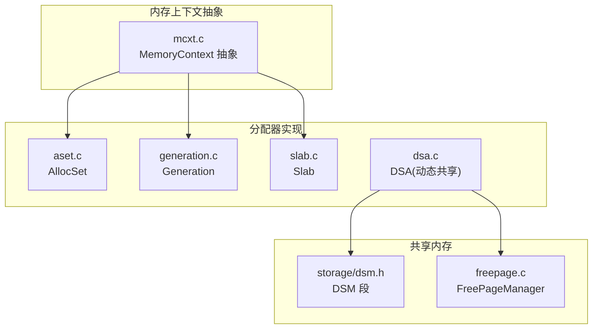
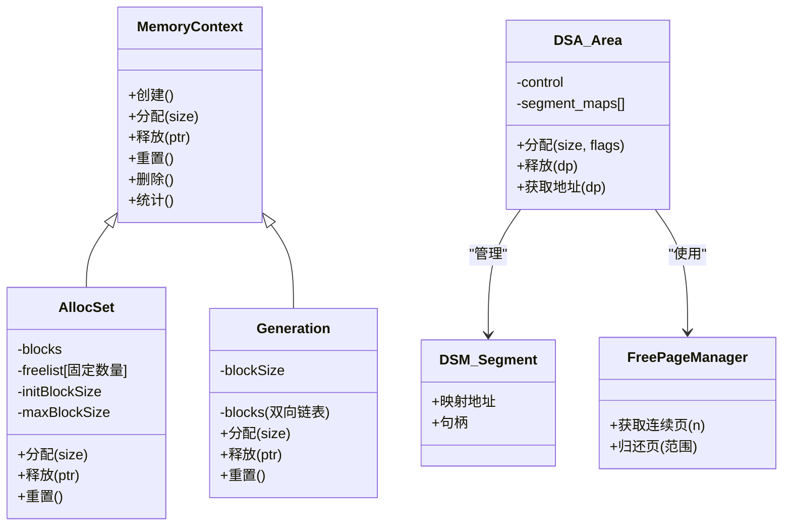
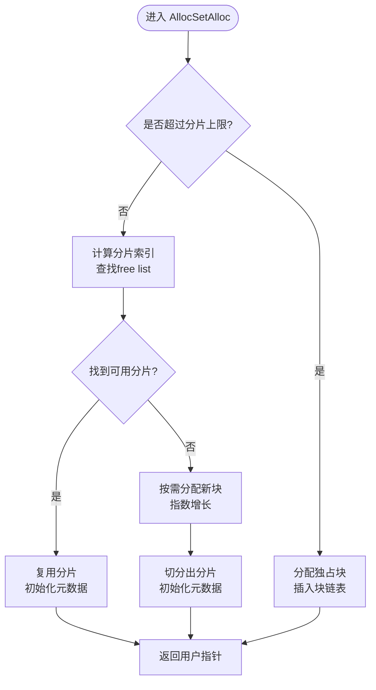
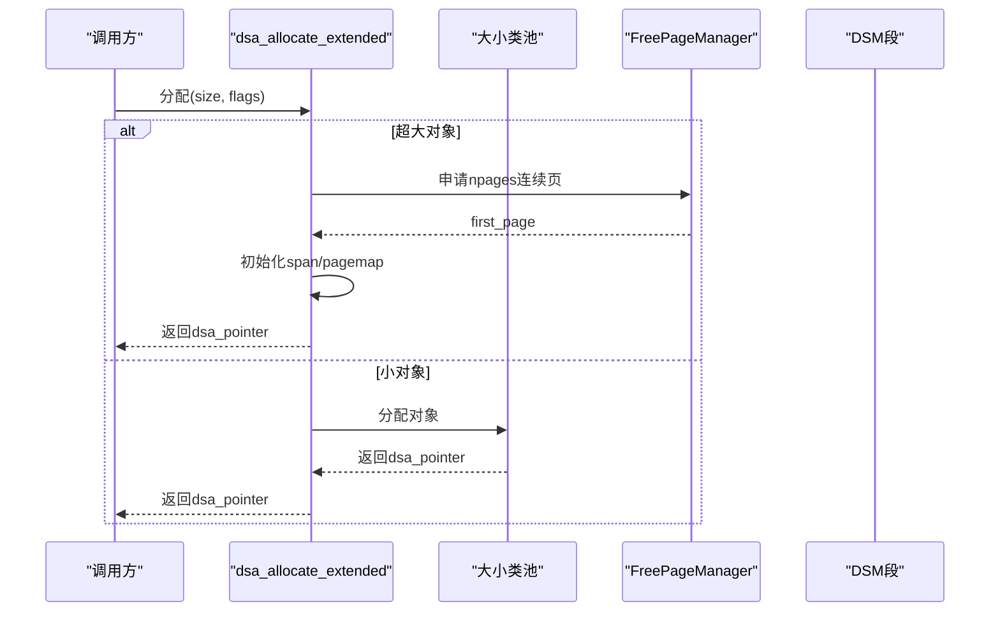
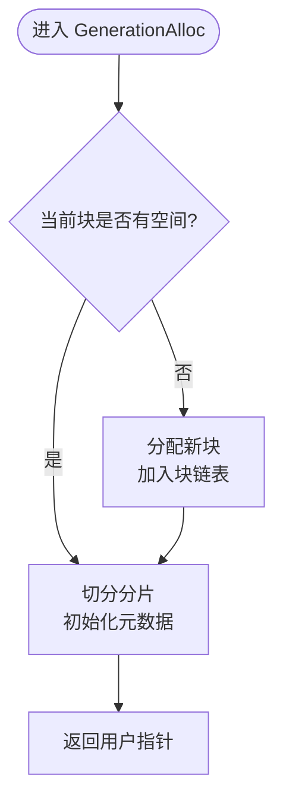
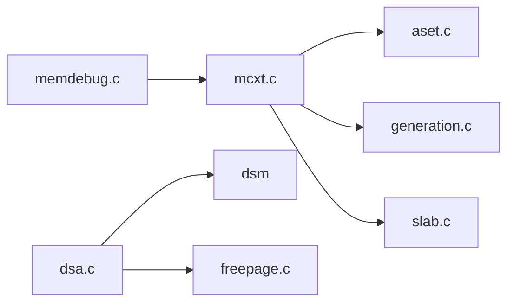

# 内存分配器

<cite>
**本文引用的文件**
- [src/backend/utils/mmgr/aset.c](file://src/backend/utils/mmgr/aset.c)
- [src/backend/utils/mmgr/dsa.c](file://src/backend/utils/mmgr/dsa.c)
- [src/backend/utils/mmgr/generation.c](file://src/backend/utils/mmgr/generation.c)
- [src/include/utils/memutils.h](file://src/include/utils/memutils.h)
- [src/include/utils/dsa.h](file://src/include/utils/dsa.h)
- [src/backend/utils/mmgr/mcxt.c](file://src/backend/utils/mmgr/mcxt.c)
- [src/backend/utils/mmgr/slab.c](file://src/backend/utils/mmgr/slab.c)
</cite>

## 目录
1. [简介](#简介)
2. [项目结构](#项目结构)
3. [核心组件](#核心组件)
4. [架构总览](#架构总览)
5. [详细组件分析](#详细组件分析)
6. [依赖关系分析](#依赖关系分析)
7. [性能考量](#性能考量)
8. [故障排查指南](#故障排查指南)
9. [结论](#结论)
10. [附录](#附录)

## 简介
本技术文档聚焦于 PostgreSQL 后端内存子系统，系统性地说明三类关键分配器的实现原理与适用场景：
- AllocSet：通用、基于块池与固定大小分片（chunk）的内存上下文实现，适合大多数短期或中等寿命对象。
- DSA（动态共享分配器）：基于 DSM 段构建的动态共享内存区域，支持跨进程共享的“伪指针”，适合并行执行、扩展等需要共享堆的场景。
- Generation：按“代”释放的简单分配器，假设同批对象生命周期相近，适合队列式构造-处理-丢弃模式。

文档还涵盖内存块的分配、合并、碎片整理与垃圾回收机制；对比各分配器的性能特点、内存使用模式与选择策略；并提供统计、调试工具与优化实践建议，帮助开发者选择合适的分配器并避免常见内存问题。

## 项目结构
PostgreSQL 内存子系统位于 backend/utils/mmgr，核心文件包括：
- aset.c：AllocSet 分配器实现
- dsa.c：DSA 动态共享分配器实现
- generation.c：Generation 分配器实现
- mcxt.c：MemoryContext 抽象层与公共接口
- slab.c：Slab 分配器（固定大小块）
- memdebug.c：调试与检测辅助
- freepage.c：DSA 底层页级空闲管理

**图表来源**
- [src/backend/utils/mmgr/mcxt.c](file://src/backend/utils/mmgr/mcxt.c)
- [src/backend/utils/mmgr/aset.c](file://src/backend/utils/mmgr/aset.c)
- [src/backend/utils/mmgr/generation.c](file://src/backend/utils/mmgr/generation.c)
- [src/backend/utils/mmgr/slab.c](file://src/backend/utils/mmgr/slab.c)
- [src/backend/utils/mmgr/dsa.c](file://src/backend/utils/mmgr/dsa.c)

**章节来源**
- [src/backend/utils/mmgr/mcxt.c](file://src/backend/utils/mmgr/mcxt.c)
- [src/backend/utils/mmgr/aset.c](file://src/backend/utils/mmgr/aset.c)
- [src/backend/utils/mmgr/dsa.c](file://src/backend/utils/mmgr/dsa.c)
- [src/backend/utils/mmgr/generation.c](file://src/backend/utils/mmgr/generation.c)
- [src/backend/utils/mmgr/slab.c](file://src/backend/utils/mmgr/slab.c)

## 核心组件
- MemoryContext 抽象：提供统一的创建、重置、删除、统计等接口，具体分配器通过方法表接入。
- AllocSet：以块为单位向系统申请内存，内部维护多个固定大小的分片链表，小对象复用分片，大对象独占块。
- DSA：在共享内存中组织多个 DSM 段，按大小类（size class）管理小对象池，大对象直接分配连续页；使用“伪指针”跨进程传递。
- Generation：每个块记录已分配/空闲计数，不重用分片，整块一次性释放，适合生命周期相近的对象。
- Slab：固定大小块分配器，适合大量相同尺寸对象的快速分配与释放。

**章节来源**
- [src/include/utils/memutils.h:156-187](file://src/include/utils/memutils.h#L156-L187)
- [src/backend/utils/mmgr/aset.c:121-137](file://src/backend/utils/mmgr/aset.c#L121-L137)
- [src/backend/utils/mmgr/dsa.c:236-247](file://src/backend/utils/mmgr/dsa.c#L236-L247)
- [src/backend/utils/mmgr/generation.c:58-67](file://src/backend/utils/mmgr/generation.c#L58-L67)
- [src/backend/utils/mmgr/slab.c](file://src/backend/utils/mmgr/slab.c)

## 架构总览
内存子系统采用“抽象 + 多实现”的架构：上层通过 MemoryContext 统一调用，底层由不同分配器根据场景优化。DSA 额外提供跨进程共享能力，底层依赖 DSM 与 FreePageManager。

**图表来源**
- [src/backend/utils/mmgr/mcxt.c](file://src/backend/utils/mmgr/mcxt.c)
- [src/backend/utils/mmgr/aset.c:121-137](file://src/backend/utils/mmgr/aset.c#L121-L137)
- [src/backend/utils/mmgr/generation.c:58-67](file://src/backend/utils/mmgr/generation.c#L58-L67)
- [src/backend/utils/mmgr/dsa.c:298-326](file://src/backend/utils/mmgr/dsa.c#L298-L326)

## 详细组件分析

### AllocSet（通用分配器）
- 设计要点
  - 将小块请求映射到固定大小的分片（power-of-2），通过多个 free list 快速命中。
  - 超过阈值的请求直接分配独占块，避免碎片放大。
  - 首次块与后续块按指数增长策略分配，减少 malloc 调用次数。
  - 支持上下文缓存（freelist of contexts），降低频繁创建/销毁开销。
- 分配流程（小对象）
  - 计算分片索引 -> 从对应 free list 取分片 -> 初始化元数据 -> 返回用户指针。
- 分配流程（大对象）
  - 直接 malloc 一个块 -> 插入块链表 -> 标记未用空间为 NOACCESS -> 返回用户指针。
- 释放与重置
  - 释放小对象时放回 free list；释放大对象时直接归还给系统。
  - Reset 仅保留 keeper 块，清空 free list，重置块分配序列。
- 碎片与合并
  - 通过固定大小分片控制碎片；大对象独立块便于整体归还。
- 垃圾回收
  - 无后台 GC；依赖上下文生命周期（Reset/Delete）批量回收。

**图表来源**
- [src/backend/utils/mmgr/aset.c:720-800](file://src/backend/utils/mmgr/aset.c#L720-L800)
- [src/backend/utils/mmgr/aset.c:800-963](file://src/backend/utils/mmgr/aset.c#L800-L963)

**章节来源**
- [src/backend/utils/mmgr/aset.c:121-137](file://src/backend/utils/mmgr/aset.c#L121-L137)
- [src/backend/utils/mmgr/aset.c:300-354](file://src/backend/utils/mmgr/aset.c#L300-L354)
- [src/backend/utils/mmgr/aset.c:378-543](file://src/backend/utils/mmgr/aset.c#L378-L543)
- [src/backend/utils/mmgr/aset.c:558-617](file://src/backend/utils/mmgr/aset.c#L558-L617)
- [src/backend/utils/mmgr/aset.c:720-963](file://src/backend/utils/mmgr/aset.c#L720-L963)

### DSA（动态共享分配器）
- 设计要点
  - 基于 DSM 段组织共享内存区域，支持跨进程共享的 dsa_pointer（伪指针）。
  - 小对象：按 size class 划分池，每池维护若干 superblock（span），使用空闲链表管理对象。
  - 大对象：直接从 FreePageManager 获取连续页，使用特殊 span 管理。
  - 并发：全局 LWLock 保护大对象与超块分配；小对象池各自有锁。
- 分配流程
  - 判断是否超大 -> 若是，选段/分配页 -> 初始化 span/pagemap -> 可选清零 -> 返回伪指针。
  - 若为小对象 -> 映射 size class -> 从池中分配对象 -> 返回伪指针。
- 释放与回收
  - 释放小对象：查 pagemap 定位 span，回收到对应 free list。
  - 释放大对象：直接归还页到 FreePageManager。
  - 当 superblock 完全空闲可回收；当 segment 完全空闲可归还 OS。
- 共享与生命周期
  - 通过 dsa_handle 跨进程 attach；支持 pin/unpin 控制映射生命周期。

**图表来源**
- [src/backend/utils/mmgr/dsa.c:665-815](file://src/backend/utils/mmgr/dsa.c#L665-L815)
- [src/backend/utils/mmgr/dsa.c:236-247](file://src/backend/utils/mmgr/dsa.c#L236-L247)

**章节来源**
- [src/include/utils/dsa.h:45-75](file://src/include/utils/dsa.h#L45-L75)
- [src/backend/utils/mmgr/dsa.c:298-326](file://src/backend/utils/mmgr/dsa.c#L298-L326)
- [src/backend/utils/mmgr/dsa.c:665-815](file://src/backend/utils/mmgr/dsa.c#L665-L815)

### Generation（代式分配器）
- 设计要点
  - 假设同批对象生命周期相近，按 FIFO/分组释放。
  - 每个块记录 nchunks/nfree，不重用分片；当块内所有分片释放后，整块归还。
  - 超大对象单独分配独占块。
- 分配流程
  - 检查当前块剩余空间 -> 不足则分配新块 -> 切分分片 -> 初始化元数据 -> 返回用户指针。
- 释放与回收
  - 释放分片时递增 nfree；若 nfree == nchunks，整块释放。
  - Reset/Delete 遍历所有块并释放。
- 碎片与合并
  - 通过整块释放减少碎片；不主动合并分片。
- 垃圾回收
  - 无后台 GC；依赖上下文生命周期批量回收。

**图表来源**
- [src/backend/utils/mmgr/generation.c:325-454](file://src/backend/utils/mmgr/generation.c#L325-L454)

**章节来源**
- [src/backend/utils/mmgr/generation.c:58-67](file://src/backend/utils/mmgr/generation.c#L58-L67)
- [src/backend/utils/mmgr/generation.c:196-257](file://src/backend/utils/mmgr/generation.c#L196-L257)
- [src/backend/utils/mmgr/generation.c:325-454](file://src/backend/utils/mmgr/generation.c#L325-L454)
- [src/backend/utils/mmgr/generation.c:456-514](file://src/backend/utils/mmgr/generation.c#L456-L514)

### Slab（固定大小块分配器）
- 设计要点
  - 固定大小块，适合大量相同尺寸对象，分配/释放极快。
  - 通常用于热点路径或已知尺寸的数据结构。
- 适用场景
  - 哈希表桶、索引节点、消息缓冲等。

**章节来源**
- [src/backend/utils/mmgr/slab.c](file://src/backend/utils/mmgr/slab.c)
- [src/include/utils/memutils.h:178-182](file://src/include/utils/memutils.h#L178-L182)

## 依赖关系分析
- MemoryContext 抽象层与各分配器解耦，便于替换与扩展。
- DSA 依赖 DSM 与 FreePageManager，提供跨进程共享能力。
- AllocSet 与 Generation 均依赖系统 malloc/free，并通过上下文生命周期管理资源。
- 统计与调试通过 memdebug 与 MemoryContextStats 暴露。

**图表来源**
- [src/backend/utils/mmgr/mcxt.c](file://src/backend/utils/mmgr/mcxt.c)
- [src/backend/utils/mmgr/dsa.c](file://src/backend/utils/mmgr/dsa.c)
- [src/backend/utils/mmgr/freepage.c](file://src/backend/utils/mmgr/freepage.c)

**章节来源**
- [src/backend/utils/mmgr/mcxt.c](file://src/backend/utils/mmgr/mcxt.c)
- [src/backend/utils/mmgr/dsa.c](file://src/backend/utils/mmgr/dsa.c)
- [src/backend/utils/mmgr/freepage.c](file://src/backend/utils/mmgr/freepage.c)

## 性能考量
- AllocSet
  - 小对象：固定大小分片 + 多 free list，命中率高，分配 O(1)。
  - 大对象：独占块，避免碎片放大；Reset 时批量归还，减少系统调用。
  - 上下文缓存：减少频繁创建/销毁开销。
- DSA
  - 小对象：按 size class 池化，超块内对象分配高效；锁粒度细（每池一锁）。
  - 大对象：直接页分配，适合并行扩展；需关注段管理与页回收。
  - 共享成本：伪指针转换与跨进程访问带来额外开销。
- Generation
  - 分配/释放极简，无复杂 free list；整块释放减少碎片与系统调用。
  - 适合 FIFO/分组释放模式；不适合随机生命周期对象。
- Slab
  - 固定大小块，分配/释放常数时间，内存布局紧凑，缓存友好。

[本节为通用指导，无需特定文件引用]

## 故障排查指南
- 常见问题
  - 内存泄漏：检查上下文是否正确 Reset/Delete；DSA 区域是否正确 release。
  - 越界写入：启用 MEMORY_CONTEXT_CHECKING，利用 sentinel 检测。
  - 碎片过高：评估对象生命周期与分配器匹配度；考虑 Generation 或 Slab。
  - 共享内存异常：确认 DSA 句柄有效、映射已 pin；检查段生命周期。
- 诊断工具
  - MemoryContextStats/MemoryContextStatsDetail：输出各上下文内存使用统计。
  - dsa_dump：打印 DSA 区域使用情况。
  - valgrind：结合 NOACCESS/UNDEFINED 标记定位非法访问。
- 最佳实践
  - 合理设置 AllocSet 初始/最大块大小，避免过度增长。
  - 对短生命周期对象使用 Generation 或临时上下文。
  - 对大量相同尺寸对象使用 Slab。
  - 对跨进程共享数据使用 DSA，注意伪指针转换与生命周期管理。

**章节来源**
- [src/include/utils/memutils.h:83-96](file://src/include/utils/memutils.h#L83-L96)
- [src/backend/utils/mmgr/dsa.c:665-815](file://src/backend/utils/mmgr/dsa.c#L665-L815)
- [src/backend/utils/mmgr/aset.c:558-617](file://src/backend/utils/mmgr/aset.c#L558-L617)
- [src/backend/utils/mmgr/generation.c:266-297](file://src/backend/utils/mmgr/generation.c#L266-L297)

## 结论
- AllocSet 适用于通用场景，平衡了分配速度与碎片控制。
- DSA 适用于跨进程共享与并行扩展，提供灵活的共享堆能力。
- Generation 适用于生命周期相近的对象，简化释放逻辑。
- Slab 适用于固定尺寸高频分配场景。
- 选择分配器应结合对象生命周期、尺寸分布、共享需求与并发模型；配合统计与调试工具持续优化。

[本节为总结性内容，无需特定文件引用]

## 附录
- 配置与阈值
  - MaxAllocSize/MaxAllocHugeSize：限制单次分配大小。
  - ALLOCSET_SEPARATE_THRESHOLD：AllocSet 中大对象阈值。
  - DSA size classes：定义小对象池的尺寸梯度。
- 常用 API
  - MemoryContext 系列：创建、分配、释放、重置、删除、统计。
  - DSA 系列：创建/附加区域、分配/释放、获取地址、修剪/转储。
  - Generation/Slab：专用上下文创建与分配。

**章节来源**
- [src/include/utils/memutils.h:23-47](file://src/include/utils/memutils.h#L23-L47)
- [src/include/utils/memutils.h:156-187](file://src/include/utils/memutils.h#L156-L187)
- [src/include/utils/dsa.h:83-120](file://src/include/utils/dsa.h#L83-L120)
- [src/backend/utils/mmgr/dsa.c:236-247](file://src/backend/utils/mmgr/dsa.c#L236-L247)