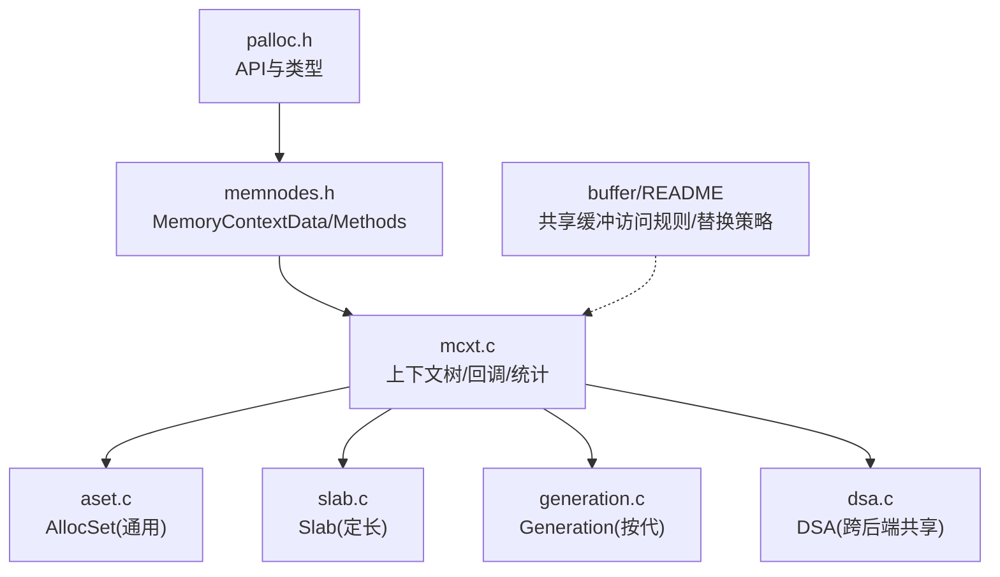
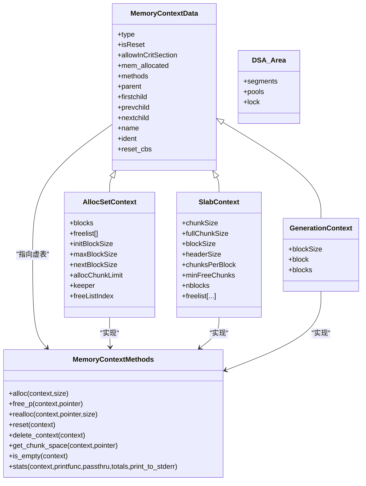
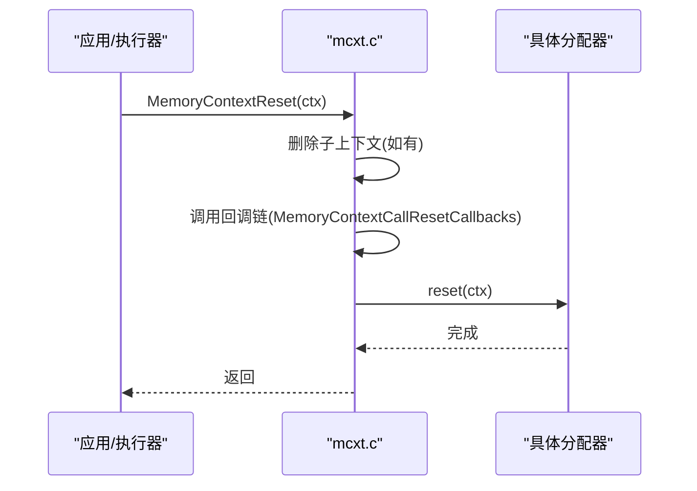
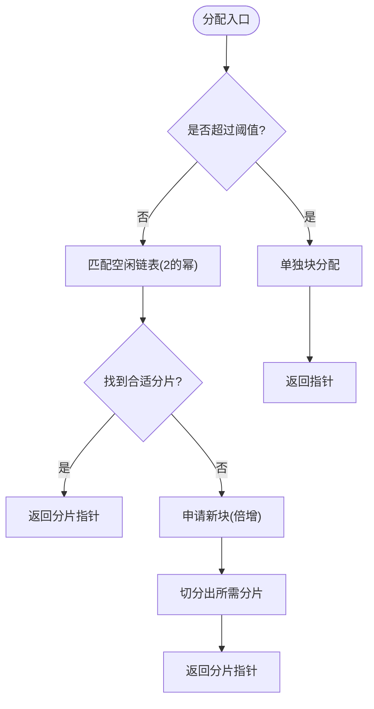
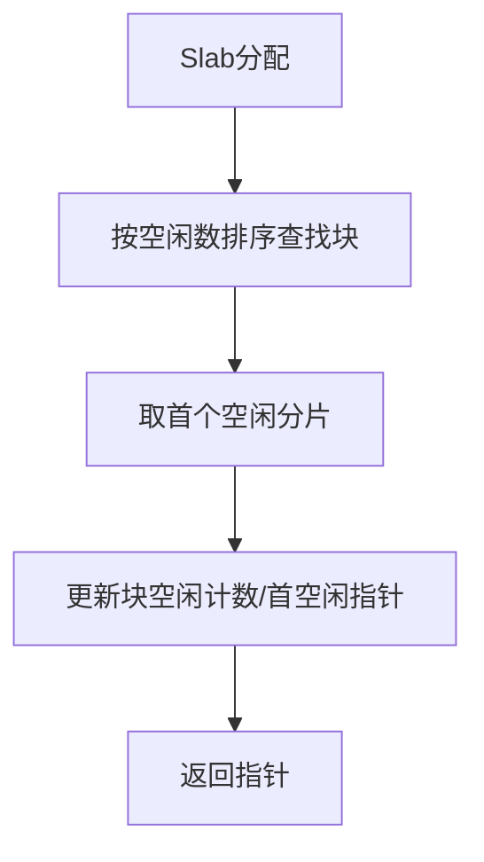
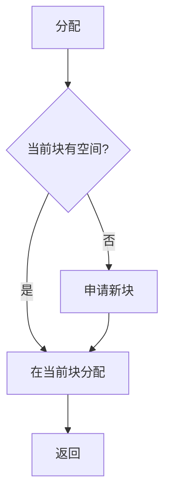
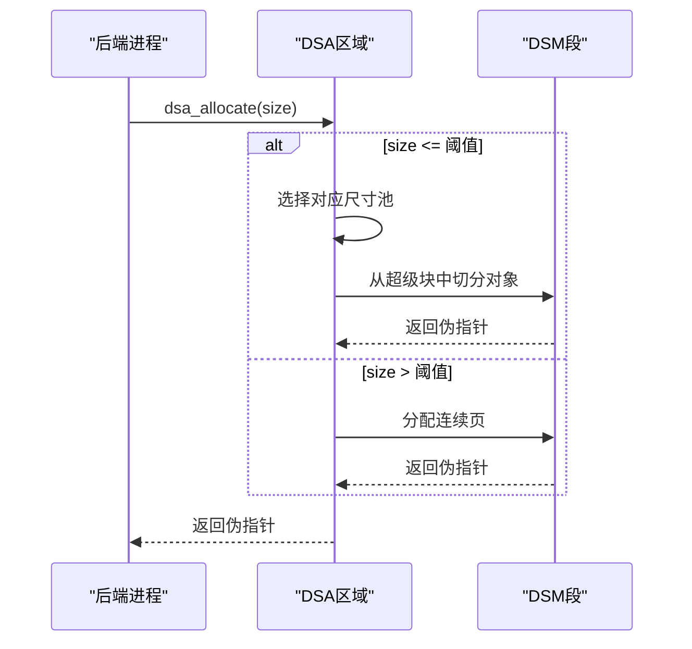
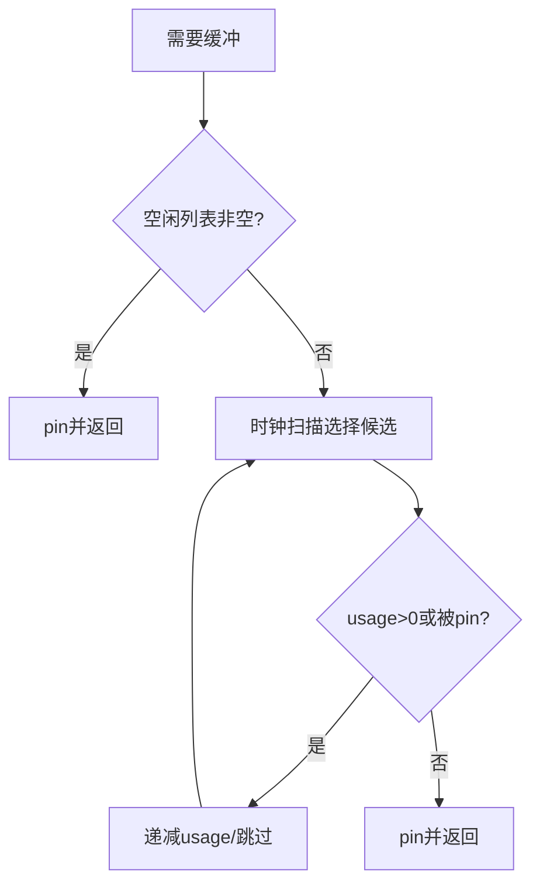
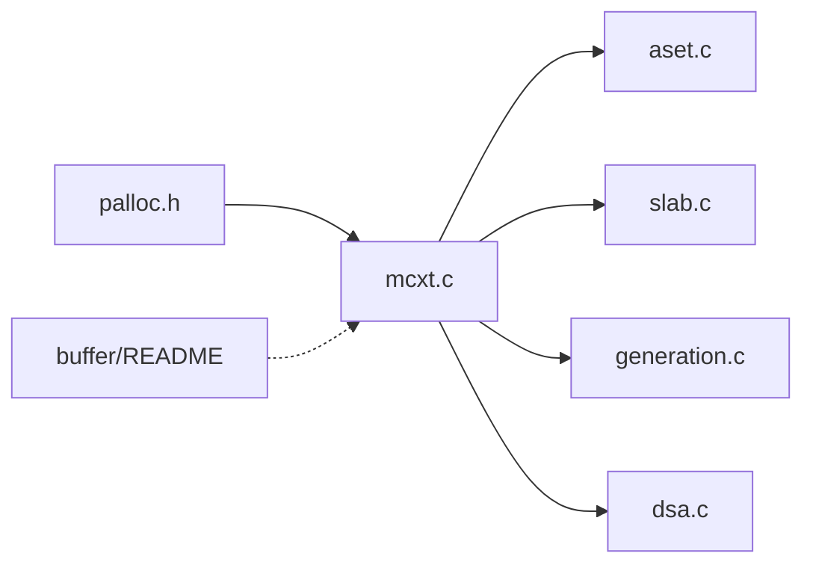

# 内存管理

<cite>
**本文引用的文件**
- [src/include/utils/palloc.h](file://src/include/utils/palloc.h)
- [src/include/nodes/memnodes.h](file://src/include/nodes/memnodes.h)
- [src/backend/utils/mmgr/README](file://src/backend/utils/mmgr/README)
- [src/backend/utils/mmgr/mcxt.c](file://src/backend/utils/mmgr/mcxt.c)
- [src/backend/utils/mmgr/aset.c](file://src/backend/utils/mmgr/aset.c)
- [src/backend/utils/mmgr/slab.c](file://src/backend/utils/mmgr/slab.c)
- [src/backend/utils/mmgr/generation.c](file://src/backend/utils/mmgr/generation.c)
- [src/backend/utils/mmgr/dsa.c](file://src/backend/utils/mmgr/dsa.c)
- [src/backend/storage/buffer/README](file://src/backend/storage/buffer/README)
</cite>

## 目录
1. [简介](#简介)
2. [项目结构](#项目结构)
3. [核心组件](#核心组件)
4. [架构总览](#架构总览)
5. [详细组件分析](#详细组件分析)
6. [依赖关系分析](#依赖关系分析)
7. [性能考虑](#性能考虑)
8. [故障排除指南](#故障排除指南)
9. [结论](#结论)
10. [附录](#附录)

## 简介
本文件面向PostgreSQL（minipg）内存管理子系统，系统性说明：
- 内存上下文管理机制与生命周期
- 缓冲区缓存策略与共享内存分配
- 内存池实现原理（AllocSet、Slab、Generation）
- 垃圾回收机制与内存泄漏检测思路
- 内存使用模式、性能调优参数与监控方法
- 故障排除指南与优化最佳实践

## 项目结构
围绕内存管理的核心代码分布在以下位置：
- 公共接口与类型定义：utils/palloc.h、nodes/memnodes.h
- 内存上下文管理与全局上下文：backend/utils/mmgr/mcxt.c
- 通用分配器（默认）：backend/utils/mmgr/aset.c
- 专用分配器：slab.c（固定大小块）、generation.c（按代释放）
- 动态共享内存区域：backend/utils/mmgr/dsa.c
- 共享缓冲与替换策略：backend/storage/buffer/README

图表来源
- [src/include/utils/palloc.h:1-175](file://src/include/utils/palloc.h#L1-L175)
- [src/include/nodes/memnodes.h:1-111](file://src/include/nodes/memnodes.h#L1-L111)
- [src/backend/utils/mmgr/mcxt.c:1-200](file://src/backend/utils/mmgr/mcxt.c#L1-L200)
- [src/backend/utils/mmgr/aset.c:1-200](file://src/backend/utils/mmgr/aset.c#L1-L200)
- [src/backend/utils/mmgr/slab.c:1-200](file://src/backend/utils/mmgr/slab.c#L1-L200)
- [src/backend/utils/mmgr/generation.c:1-200](file://src/backend/utils/mmgr/generation.c#L1-L200)
- [src/backend/utils/mmgr/dsa.c:1-200](file://src/backend/utils/mmgr/dsa.c#L1-L200)
- [src/backend/storage/buffer/README:1-277](file://src/backend/storage/buffer/README#L1-L277)

章节来源
- [src/include/utils/palloc.h:1-175](file://src/include/utils/palloc.h#L1-L175)
- [src/include/nodes/memnodes.h:1-111](file://src/include/nodes/memnodes.h#L1-L111)
- [src/backend/utils/mmgr/README:1-488](file://src/backend/utils/mmgr/README#L1-L488)

## 核心组件
- 内存上下文抽象与接口
  - MemoryContextData：上下文树节点，包含父/子指针、名称、回调列表、已分配计数等
  - MemoryContextMethods：虚表，定义alloc/free/realloc/reset/delete/stats等方法
  - CurrentMemoryContext：当前默认上下文，palloc系列函数在其上分配
- 上下文管理器
  - 初始化TopMemoryContext与ErrorContext
  - 提供reset/delete/reset children等操作
  - 支持reset/delete回调，用于释放非palloc资源
- 分配器实现
  - AllocSet：通用分配器，多块+多级空闲链表，适合多数场景
  - Slab：固定大小块，适合大量同构对象
  - Generation：按代释放，适合FIFO或同生命周期分组
- 动态共享内存（DSA）
  - 基于DSM段构建的跨后端共享堆，支持小对象池与大对象页分配
- 共享缓冲
  - 通过pin与内容锁控制并发访问
  - 时钟扫描与环式策略进行页面替换

章节来源
- [src/include/nodes/memnodes.h:1-111](file://src/include/nodes/memnodes.h#L1-L111)
- [src/include/utils/palloc.h:1-175](file://src/include/utils/palloc.h#L1-L175)
- [src/backend/utils/mmgr/mcxt.c:1-200](file://src/backend/utils/mmgr/mcxt.c#L1-L200)
- [src/backend/utils/mmgr/aset.c:1-200](file://src/backend/utils/mmgr/aset.c#L1-L200)
- [src/backend/utils/mmgr/slab.c:1-200](file://src/backend/utils/mmgr/slab.c#L1-L200)
- [src/backend/utils/mmgr/generation.c:1-200](file://src/backend/utils/mmgr/generation.c#L1-L200)
- [src/backend/utils/mmgr/dsa.c:1-200](file://src/backend/utils/mmgr/dsa.c#L1-L200)
- [src/backend/storage/buffer/README:1-277](file://src/backend/storage/buffer/README#L1-L277)

## 架构总览
内存上下文以树形组织，所有分配都发生在某个上下文中。上下文可注册回调，在reset/delete时统一释放关联资源。不同分配器实现同一套接口，便于根据负载特征选择最优策略。DSA为跨后端共享内存提供统一分配界面。共享缓冲层负责磁盘页到内存的映射、并发访问控制与替换策略。

图表来源
- [src/include/nodes/memnodes.h:1-111](file://src/include/nodes/memnodes.h#L1-L111)
- [src/backend/utils/mmgr/aset.c:1-200](file://src/backend/utils/mmgr/aset.c#L1-L200)
- [src/backend/utils/mmgr/slab.c:1-200](file://src/backend/utils/mmgr/slab.c#L1-L200)
- [src/backend/utils/mmgr/generation.c:1-200](file://src/backend/utils/mmgr/generation.c#L1-L200)
- [src/backend/utils/mmgr/dsa.c:1-200](file://src/backend/utils/mmgr/dsa.c#L1-L200)

## 详细组件分析

### 内存上下文管理（mcxt.c）
- 启动阶段创建TopMemoryContext与ErrorContext，并设置CurrentMemoryContext
- 提供reset/reset only/reset children/delete等操作，保证子树一致性清理
- 支持reset/delete回调链，按逆序调用，确保资源正确释放
- 统计与检查：维护isReset标记、回调触发时机、Valgrind池管理

图表来源
- [src/backend/utils/mmgr/mcxt.c:1-200](file://src/backend/utils/mmgr/mcxt.c#L1-L200)

章节来源
- [src/backend/utils/mmgr/mcxt.c:1-200](file://src/backend/utils/mmgr/mcxt.c#L1-L200)
- [src/backend/utils/mmgr/README:1-488](file://src/backend/utils/mmgr/README#L1-L488)

### 通用分配器 AllocSet（aset.c）
- 块与块内分片：从malloc获取大块，内部划分为多个对齐的分片；大请求直接独占块
- 多级空闲链表：按2的幂次大小维护空闲分片，提高复用率
- 增长策略：首次分配默认块，后续按需倍增至上限；保留“守护块”避免频繁malloc/free
- 大对象路径：超过阈值的大分配直接走独立块，释放时直接归还OS

图表来源
- [src/backend/utils/mmgr/aset.c:1-200](file://src/backend/utils/mmgr/aset.c#L1-L200)

章节来源
- [src/backend/utils/mmgr/aset.c:1-200](file://src/backend/utils/mmgr/aset.c#L1-L200)

### 定长分配器 Slab（slab.c）
- 固定块大小与固定分片大小，无碎片化
- 块级与上下文级双维护空闲信息，优先重用接近满的块，加速整块回收
- 维护每块首个空闲分片指针，减少查找开销

图表来源
- [src/backend/utils/mmgr/slab.c:1-200](file://src/backend/utils/mmgr/slab.c#L1-L200)

章节来源
- [src/backend/utils/mmgr/slab.c:1-200](file://src/backend/utils/mmgr/slab.c#L1-L200)

### 按代分配器 Generation（generation.c）
- 假设分片按FIFO或同生命周期组释放
- 不重用分片，仅记录块内已分配/空闲数量；当块全空则整体归还OS
- 适合队列型处理、批量构造后一次性丢弃的场景

图表来源
- [src/backend/utils/mmgr/generation.c:1-200](file://src/backend/utils/mmgr/generation.c#L1-L200)

章节来源
- [src/backend/utils/mmgr/generation.c:1-200](file://src/backend/utils/mmgr/generation.c#L1-L200)

### 动态共享内存 DSA（dsa.c）
- 基于DSM段构建共享堆，支持跨后端共享伪指针
- 小对象：按尺寸类池分配，超小块由预分配超级块服务
- 大对象：按连续页分配，使用自由页管理器与页映射追踪来源
- 锁粒度：大对象与超级块分配用全局锁，小对象按池粒度加锁提升并发

图表来源
- [src/backend/utils/mmgr/dsa.c:1-200](file://src/backend/utils/mmgr/dsa.c#L1-L200)

章节来源
- [src/backend/utils/mmgr/dsa.c:1-200](file://src/backend/utils/mmgr/dsa.c#L1-L200)

### 共享缓冲与缓存策略（buffer/README）
- 访问控制：pin（引用计数）与内容锁（共享/独占），遵循严格顺序
- 正常替换：时钟扫描算法，维护usage计数与nextVictimBuffer
- 环式策略：针对单次大扫描/VACUUM/COPY等，使用固定大小环缓冲降低WAL压力
- 后台写入：背景写进程扫描脏页并写出，减轻前台压力

图表来源
- [src/backend/storage/buffer/README:155-203](file://src/backend/storage/buffer/README#L155-L203)

章节来源
- [src/backend/storage/buffer/README:1-277](file://src/backend/storage/buffer/README#L1-L277)

## 依赖关系分析
- palloc.h暴露对外API，memnodes.h定义上下文抽象与虚表
- mcxt.c实现上下文树与生命周期管理，委托具体分配器实现
- aset/slab/generation实现各自分配策略，均遵循MemoryContextMethods约定
- dsa.c提供共享内存分配，依赖DSM与锁原语
- buffer/README描述共享缓冲访问与替换策略，与上层执行器/存储层交互

图表来源
- [src/include/utils/palloc.h:1-175](file://src/include/utils/palloc.h#L1-L175)
- [src/backend/utils/mmgr/mcxt.c:1-200](file://src/backend/utils/mmgr/mcxt.c#L1-L200)
- [src/backend/utils/mmgr/aset.c:1-200](file://src/backend/utils/mmgr/aset.c#L1-L200)
- [src/backend/utils/mmgr/slab.c:1-200](file://src/backend/utils/mmgr/slab.c#L1-L200)
- [src/backend/utils/mmgr/generation.c:1-200](file://src/backend/utils/mmgr/generation.c#L1-L200)
- [src/backend/utils/mmgr/dsa.c:1-200](file://src/backend/utils/mmgr/dsa.c#L1-L200)
- [src/backend/storage/buffer/README:1-277](file://src/backend/storage/buffer/README#L1-L277)

章节来源
- [src/include/nodes/memnodes.h:1-111](file://src/include/nodes/memnodes.h#L1-L111)
- [src/backend/utils/mmgr/README:1-488](file://src/backend/utils/mmgr/README#L1-L488)

## 性能考虑
- 选择合适上下文与分配器
  - 通用场景：AllocSet（默认）
  - 大量同构对象：Slab
  - FIFO/同生命周期分组：Generation
- 上下文粒度与生命周期
  - 尽量将临时数据放入短生命周期上下文（如per-tuple/per-query），利用reset快速回收
  - 避免在TopMemoryContext长期持有数据
- 大对象与超大分配
  - 使用扩展分配接口与huge路径，避免频繁repalloc导致碎片
- 共享缓冲策略
  - 大扫描/批处理使用环式策略，减少WAL刷新与竞争
  - 合理配置shared_buffers与ring大小，平衡命中率与内存占用
- 统计与观测
  - 使用上下文统计接口收集各上下文内存使用情况，定位热点与异常增长

[本节为通用指导，不直接分析具体文件]

## 故障排除指南
- 内存耗尽与错误恢复
  - ErrorContext预留固定内存，确保即使在OOM时仍可输出错误信息
  - 关键路径避免在临界区分配；必要时允许ErrorContext在临界区分配
- 上下文未释放导致的泄漏
  - 检查是否遗漏reset/delete，尤其是子上下文树
  - 利用reset/delete回调释放外部资源（文件句柄、第三方库内存等）
- 分配器选择不当
  - 若出现碎片或频繁malloc/free抖动，评估是否改用Slab/Generation
  - 对超大对象路径，确认使用合适的huge分配接口
- 共享缓冲竞争与卡顿
  - 观察clock-sweep与ring策略下的命中率与WAL压力
  - 调整shared_buffers、checkpoint相关参数，缓解后台写入压力
- 调试工具
  - 启用MEMORY_CONTEXT_CHECKING以增强校验
  - 结合Valgrind池标记与统计接口定位问题

章节来源
- [src/backend/utils/mmgr/mcxt.c:1-200](file://src/backend/utils/mmgr/mcxt.c#L1-L200)
- [src/backend/utils/mmgr/README:1-488](file://src/backend/utils/mmgr/README#L1-L488)
- [src/backend/storage/buffer/README:1-277](file://src/backend/storage/buffer/README#L1-L277)

## 结论
PostgreSQL的内存管理以“上下文树 + 多实现分配器 + 共享缓冲策略”为核心，兼顾通用性与高性能。通过合理选择上下文粒度与分配器、配合共享缓冲替换策略与后台写入机制，可在高并发与大数据量场景下获得稳定表现。借助统计与调试能力，可有效识别瓶颈与泄漏点，持续优化系统性能。

[本节为总结性内容，不直接分析具体文件]

## 附录
- 常用API与概念速查
  - 上下文切换：MemoryContextSwitchTo
  - 分配/重分配/释放：palloc/pfree/repalloc及extended变体
  - 上下文操作：MemoryContextReset/MemoryContextDelete/MemoryContextResetChildren
  - 回调注册：MemoryContextRegisterResetCallback
  - 统计：MemoryContextStats系列
- 典型使用模式
  - per-tuple/per-query上下文：表达式求值、中间结果暂存
  - 事务级上下文：TopTransactionContext/CurTransactionContext
  - 持久缓存：CacheMemoryContext（relcache/catcache等）
- 共享缓冲要点
  - pin与内容锁的正确使用顺序
  - 正常时钟扫描 vs 环式策略的适用场景

[本节为补充信息，不直接分析具体文件]