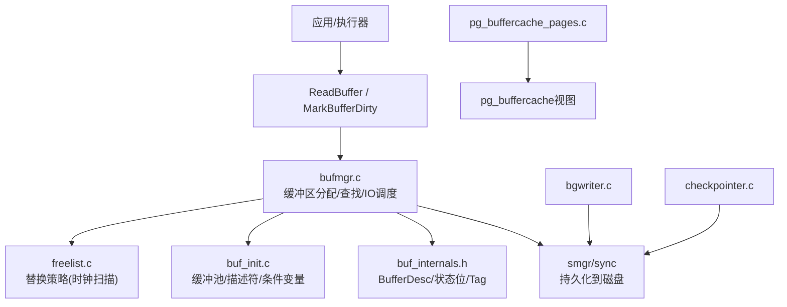
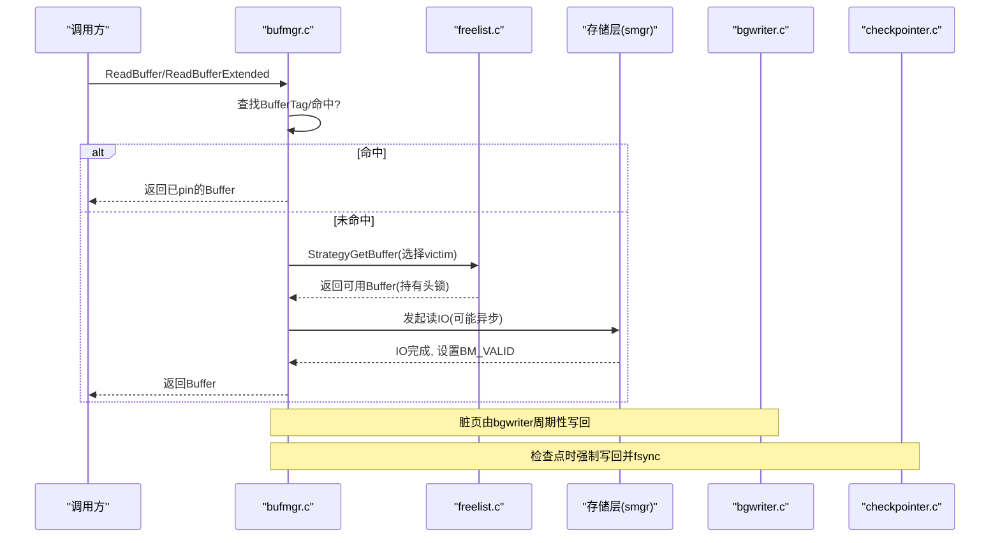
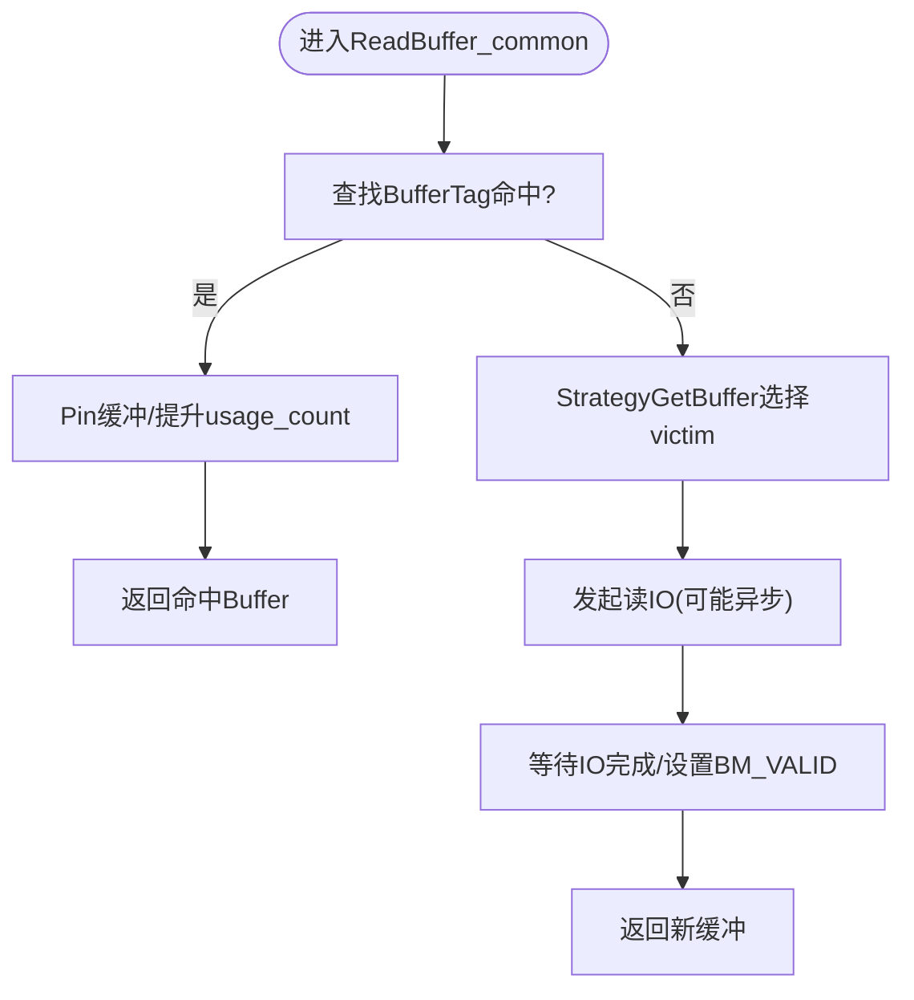
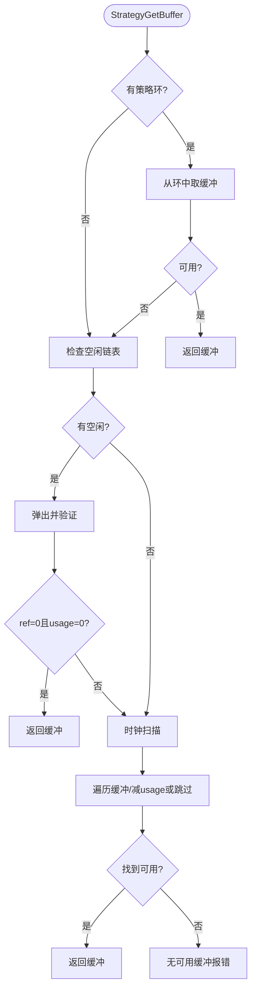
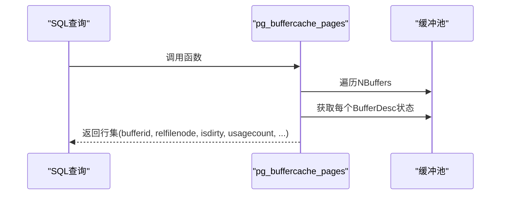
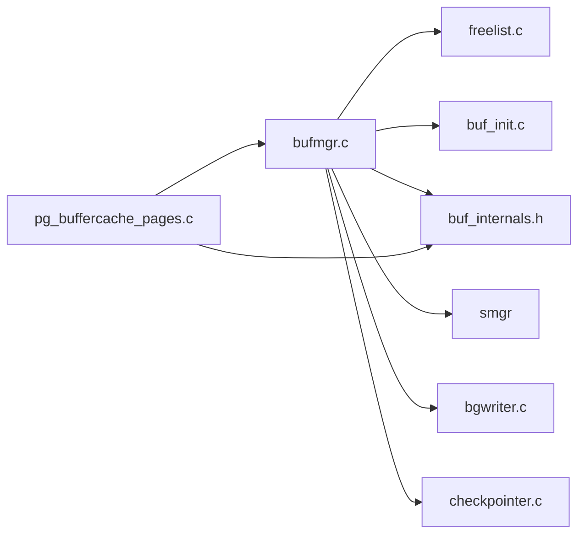

# 缓冲区缓存

<cite>
**本文引用的文件**
- [bufmgr.c](file://src/backend/storage/buffer/bufmgr.c)
- [buf_init.c](file://src/backend/storage/buffer/buf_init.c)
- [freelist.c](file://src/backend/storage/buffer/freelist.c)
- [buf_internals.h](file://src/include/storage/buf_internals.h)
- [pg_buffercache_pages.c](file://contrib/pg_buffercache/pg_buffercache_pages.c)
- [pgbuffercache.sgml](file://doc/src/sgml/pgbuffercache.sgml)
- [bgwriter.c](file://src/backend/postmaster/bgwriter.c)
- [checkpointer.c](file://src/backend/postmaster/checkpointer.c)
</cite>

## 目录
1. [简介](#简介)
2. [项目结构](#项目结构)
3. [核心组件](#核心组件)
4. [架构总览](#架构总览)
5. [详细组件分析](#详细组件分析)
6. [依赖关系分析](#依赖关系分析)
7. [性能考虑](#性能考虑)
8. [故障排除指南](#故障排除指南)
9. [结论](#结论)
10. [附录](#附录)

## 简介
本文件面向PostgreSQL的共享缓冲区缓存系统，系统性说明Buffer Manager的工作机制、缓冲池管理、页面替换算法（时钟扫描）、缓冲区的分配与释放、读写流程与同步机制、脏页处理与检查点协作、以及命中率优化、缓存策略调优与性能监控方法。同时提供常见问题的定位与排障建议，帮助读者快速识别和解决缓冲区相关问题。

## 项目结构
与缓冲区缓存相关的核心代码位于存储层：
- 缓冲区管理器接口与主要逻辑：bufmgr.c
- 缓冲池初始化与共享内存布局：buf_init.c
- 替换策略与空闲链表：freelist.c
- 内部数据结构与状态位定义：buf_internals.h
- 监控与诊断扩展：pg_buffercache_pages.c（配合文档 pgbuffercache.sgml）
- 后台写入器与检查点：bgwriter.c、checkpointer.c

图表来源
- [bufmgr.c:742-759](file://src/backend/storage/buffer/bufmgr.c#L742-L759)
- [freelist.c:189-358](file://src/backend/storage/buffer/freelist.c#L189-L358)
- [buf_init.c:66-146](file://src/backend/storage/buffer/buf_init.c#L66-L146)
- [buf_internals.h:29-77](file://src/include/storage/buf_internals.h#L29-L77)
- [pg_buffercache_pages.c:64-179](file://contrib/pg_buffercache/pg_buffercache_pages.c#L64-L179)
- [bgwriter.c:93-136](file://src/backend/postmaster/bgwriter.c#L93-L136)
- [checkpointer.c:182-200](file://src/backend/postmaster/checkpointer.c#L182-L200)

章节来源
- [bufmgr.c:742-759](file://src/backend/storage/buffer/bufmgr.c#L742-L759)
- [buf_init.c:66-146](file://src/backend/storage/buffer/buf_init.c#L66-L146)
- [freelist.c:189-358](file://src/backend/storage/buffer/freelist.c#L189-L358)
- [buf_internals.h:29-77](file://src/include/storage/buf_internals.h#L29-L77)
- [pgbuffercache.sgml:10-164](file://doc/src/sgml/pgbuffercache.sgml#L10-L164)

## 核心组件
- 缓冲区描述符与状态：BufferDesc、state字段（包含refcount、usagecount、标志位如BM_DIRTY/BM_VALID/BM_TAG_VALID等），用于标识页是否有效、是否脏、是否在IO中、是否已分配tag等。
- 缓冲池与共享内存：在进程启动时分配BufferDescriptors、BufferBlocks、I/O条件变量数组、检查点排序数组等。
- 缓冲区映射表：按BufferTag进行哈希查找，分区锁降低竞争。
- 替换策略：基于时钟扫描（Clock Sweep）的近似LRU，结合free list与usage count。
- 后台写入器与检查点：bgwriter负责定期写回脏页；checkpointer负责检查点期间将脏页与WAL持久化。
- 监控与诊断：pg_buffercache扩展暴露共享缓冲区的实时视图。

章节来源
- [buf_internals.h:29-77](file://src/include/storage/buf_internals.h#L29-L77)
- [buf_init.c:66-146](file://src/backend/storage/buffer/buf_init.c#L66-L146)
- [freelist.c:189-358](file://src/backend/storage/buffer/freelist.c#L189-L358)
- [bgwriter.c:93-136](file://src/backend/postmaster/bgwriter.c#L93-L136)
- [checkpointer.c:182-200](file://src/backend/postmaster/checkpointer.c#L182-L200)
- [pgbuffercache.sgml:10-164](file://doc/src/sgml/pgbuffercache.sgml#L10-L164)

## 架构总览
下图展示了从读取请求到可能的磁盘IO、替换策略选择、以及后台写回的整体交互。

图表来源
- [bufmgr.c:742-759](file://src/backend/storage/buffer/bufmgr.c#L742-L759)
- [freelist.c:189-358](file://src/backend/storage/buffer/freelist.c#L189-L358)
- [bgwriter.c:93-136](file://src/backend/postmaster/bgwriter.c#L93-L136)
- [checkpointer.c:182-200](file://src/backend/postmaster/checkpointer.c#L182-L200)

## 详细组件分析

### Buffer Manager（bufmgr.c）
- 入口函数：ReadBuffer/ReadBufferExtended封装了统计计数与通用读取逻辑；ReadBuffer_common实现共享缓冲区的查找、分配、IO调度与返回。
- 私有引用计数：为每个后端维护一个小型数组+溢出哈希表，减少共享内存访问次数，提高pin/unpin效率。
- 最近缓冲优化：ReadRecentBuffer可避免重复查找，直接尝试pin最近观察到的缓冲。
- 预取：PrefetchBuffer/PrefetchSharedBuffer在不阻塞的情况下提前触发内核或底层预取。
- 脏页标记：MarkBufferDirty标记BM_DIRTY，延迟到替换或检查点时写回。
- 同步与等待：StartBufferIO/TerminateBufferIO/WaitIO协调并发IO与状态更新。

图表来源
- [bufmgr.c:742-759](file://src/backend/storage/buffer/bufmgr.c#L742-L759)
- [bufmgr.c:505-600](file://src/backend/storage/buffer/bufmgr.c#L505-L600)
- [bufmgr.c:609-689](file://src/backend/storage/buffer/bufmgr.c#L609-L689)

章节来源
- [bufmgr.c:742-759](file://src/backend/storage/buffer/bufmgr.c#L742-L759)
- [bufmgr.c:505-600](file://src/backend/storage/buffer/bufmgr.c#L505-L600)
- [bufmgr.c:609-689](file://src/backend/storage/buffer/bufmgr.c#L609-L689)

### 缓冲池与初始化（buf_init.c）
- 初始化共享内存：分配BufferDescriptors、BufferBlocks、I/O条件变量数组、检查点排序数组。
- 链接所有缓冲为空闲链表：初始freeNext指向下一个缓冲，最后项指向结束标记。
- 初始化策略子系统：StrategyInitialize创建查找表与策略控制块。

章节来源
- [buf_init.c:66-146](file://src/backend/storage/buffer/buf_init.c#L66-L146)
- [buf_init.c:148-181](file://src/backend/storage/buffer/buf_init.c#L148-L181)

### 替换策略（freelist.c）
- 时钟扫描：使用nextVictimBuffer原子递增作为“时钟指针”，遍历缓冲并依据refcount与usagecount判断是否可回收。
- 空闲链表：优先从firstFreeBuffer链表中弹出候选，若不可用则回退到时钟扫描。
- 策略对象环：支持BulkRead/BulkWrite/Vacuum等专用策略，通过环形缓冲重用近期分配的缓冲，减少开销。
- 拒绝脏页：StrategyRejectBuffer在特定模式下拒绝需要刷WAL的脏页，避免不必要的WAL冲刷。

图表来源
- [freelist.c:189-358](file://src/backend/storage/buffer/freelist.c#L189-L358)
- [freelist.c:536-705](file://src/backend/storage/buffer/freelist.c#L536-L705)

章节来源
- [freelist.c:189-358](file://src/backend/storage/buffer/freelist.c#L189-L358)
- [freelist.c:536-705](file://src/backend/storage/buffer/freelist.c#L536-L705)

### 内部数据结构与状态（buf_internals.h）
- BufferDesc：包含tag、buf_id、state（原子32位，组合refcount/usagecount/flags）、content_lock等。
- 状态位：BM_LOCKED、BM_DIRTY、BM_VALID、BM_TAG_VALID、BM_IO_IN_PROGRESS、BM_IO_ERROR、BM_JUST_DIRTIED、BM_PIN_COUNT_WAITER、BM_CHECKPOINT_NEEDED、BM_PERMANENT。
- BufferTag：唯一标识磁盘页（RelFileNode+ForkNumber+BlockNumber）。
- 分区锁：BufMappingPartitionLock降低映射表竞争。

章节来源
- [buf_internals.h:29-77](file://src/include/storage/buf_internals.h#L29-L77)
- [buf_internals.h:80-133](file://src/include/storage/buf_internals.h#L80-L133)
- [buf_internals.h:135-193](file://src/include/storage/buf_internals.h#L135-L193)

### 监控与诊断（pg_buffercache）
- pg_buffercache_pages函数：遍历所有缓冲，读取各缓冲的状态（是否有效、是否脏、usage_count、pinning_backends等），以集合形式返回。
- pg_buffercache视图：对函数结果进行包装，便于SQL查询与分析。
- 注意：视图不持全局一致性快照，但每个缓冲自身信息一致。

图表来源
- [pg_buffercache_pages.c:64-179](file://contrib/pg_buffercache/pg_buffercache_pages.c#L64-L179)
- [pgbuffercache.sgml:10-164](file://doc/src/sgml/pgbuffercache.sgml#L10-L164)

章节来源
- [pg_buffercache_pages.c:64-179](file://contrib/pg_buffercache/pg_buffercache_pages.c#L64-L179)
- [pgbuffercache.sgml:10-164](file://doc/src/sgml/pgbuffercache.sgml#L10-L164)

### 后台写入器与检查点（bgwriter.c、checkpointer.c）
- bgwriter：周期性地写回脏页，降低前台进程写回压力；支持休眠与唤醒机制。
- checkpointer：负责检查点流程，确保脏页与WAL持久化；与后台写入器分工明确。
- 两者均与缓冲管理器协作，利用策略与状态位决定何时写回与fsync。

章节来源
- [bgwriter.c:93-136](file://src/backend/postmaster/bgwriter.c#L93-L136)
- [checkpointer.c:182-200](file://src/backend/postmaster/checkpointer.c#L182-L200)

## 依赖关系分析
- bufmgr.c依赖：
  - freelist.c：选择victim缓冲
  - buf_init.c：缓冲池与共享内存初始化
  - buf_internals.h：BufferDesc、状态位、BufferTag
  - smgr：实际磁盘IO
  - postmaster/bgwriter.c与checkpointer.c：脏页写回与检查点
- freelist.c依赖：
  - buf_internals.h：BufferDesc与状态位
  - 策略控制块：nextVictimBuffer、free list、统计
- 监控扩展依赖：
  - buf_internals.h与bufmgr.c：读取缓冲状态

图表来源
- [bufmgr.c:742-759](file://src/backend/storage/buffer/bufmgr.c#L742-L759)
- [freelist.c:189-358](file://src/backend/storage/buffer/freelist.c#L189-L358)
- [buf_init.c:66-146](file://src/backend/storage/buffer/buf_init.c#L66-L146)
- [buf_internals.h:29-77](file://src/include/storage/buf_internals.h#L29-L77)
- [pg_buffercache_pages.c:64-179](file://contrib/pg_buffercache/pg_buffercache_pages.c#L64-L179)

章节来源
- [bufmgr.c:742-759](file://src/backend/storage/buffer/bufmgr.c#L742-L759)
- [freelist.c:189-358](file://src/backend/storage/buffer/freelist.c#L189-L358)
- [buf_init.c:66-146](file://src/backend/storage/buffer/buf_init.c#L66-L146)
- [buf_internals.h:29-77](file://src/include/storage/buf_internals.h#L29-L77)
- [pg_buffercache_pages.c:64-179](file://contrib/pg_buffercache/pg_buffercache_pages.c#L64-L179)

## 性能考虑
- 命中率优化
  - 合理设置shared_buffers，使热点数据常驻内存。
  - 使用BufferAccessStrategy（如BAS_BULKREAD/BAS_BULKWRITE）优化批量操作，减少随机分配与替换开销。
  - 利用ReadRecentBuffer避免重复查找，提升连续访问路径性能。
- 替换策略调优
  - 时钟扫描的usagecount上限BM_MAX_USAGE_COUNT平衡了LRU精度与扫描成本。
  - 关注completePasses与numBufferAllocs统计，评估替换频率与压力。
- 后台写回与检查点
  - 调整BgWriterDelay、checkpoint相关参数，平衡写回延迟与检查点耗时。
  - 监控脏页比例与写回吞吐，避免前台进程频繁写回导致抖动。
- 监控方法
  - 使用pg_buffercache视图分析热点关系与缓冲占用。
  - 结合pg_stat_*统计与服务器日志，定位瓶颈。

[本节为通用指导，无需具体文件引用]

## 故障排除指南
- 症状：频繁出现“无可用缓冲”错误
  - 可能原因：大量缓冲被pin或usagecount长期非零，导致时钟扫描无法找到可回收缓冲。
  - 排查步骤：
    - 使用pg_buffercache视图查看usagecount与pinning_backends分布。
    - 检查是否存在长事务或未释放的缓冲引用。
    - 调整shared_buffers或优化查询以减少缓冲驻留时间。
- 症状：脏页堆积，检查点耗时过长
  - 可能原因：脏页过多或WAL刷盘压力大。
  - 排查步骤：
    - 检查bgwriter与checkpointer运行状态与日志。
    - 调整checkpoint相关参数与写回阈值。
    - 分析热点表与索引，必要时进行分片或归档。
- 症状：I/O等待高
  - 可能原因：预取未生效或磁盘带宽不足。
  - 排查步骤：
    - 启用/调整effective_io_concurrency与maintenance_io_concurrency。
    - 使用I/O监控工具定位瓶颈。
    - 检查smgr与文件系统层配置。

章节来源
- [freelist.c:189-358](file://src/backend/storage/buffer/freelist.c#L189-L358)
- [pgbuffercache.sgml:10-164](file://doc/src/sgml/pgbuffercache.sgml#L10-L164)
- [bgwriter.c:93-136](file://src/backend/postmaster/bgwriter.c#L93-L136)
- [checkpointer.c:182-200](file://src/backend/postmaster/checkpointer.c#L182-L200)

## 结论
PostgreSQL的缓冲区缓存系统通过BufferManager、时钟扫描替换策略、后台写入器与检查点的协同，实现了高效、可扩展的共享内存页缓存。理解其数据结构、状态位、同步机制与监控手段，有助于在实际生产环境中进行容量规划、性能调优与问题定位。建议结合pg_buffercache视图与系统监控指标，持续评估与优化缓存策略。

[本节为总结性内容，无需具体文件引用]

## 附录
- 关键术语
  - BufferDesc：共享缓冲描述符，包含tag、state、content_lock等。
  - BufferTag：唯一标识磁盘页（关系、fork、块号）。
  - 时钟扫描：近似LRU的替换算法，基于usagecount与refcount选择victim。
  - 脏页：已被修改但未写回的缓冲页。
  - 检查点：将脏页与WAL持久化的过程，保证崩溃恢复的一致性。
- 常用视图与函数
  - pg_buffercache：展示共享缓冲区的实时状态。
  - pg_buffercache_pages：底层函数，返回缓冲详情。

[本节为补充信息，无需具体文件引用]