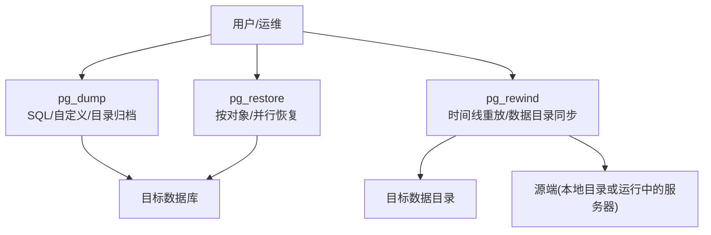
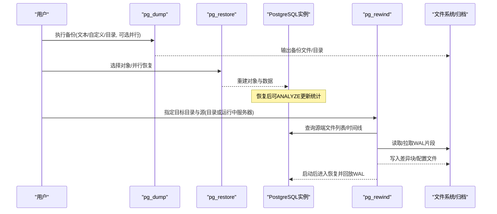
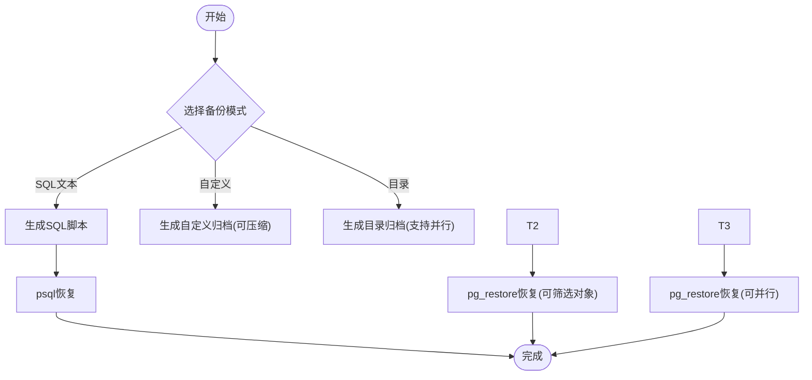
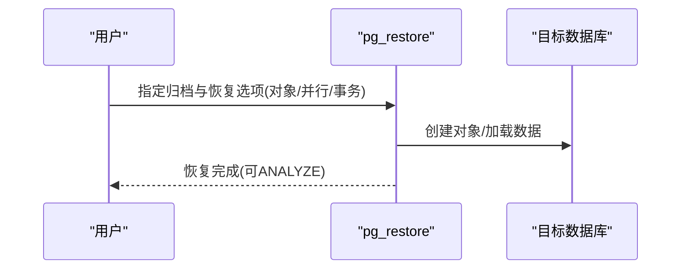
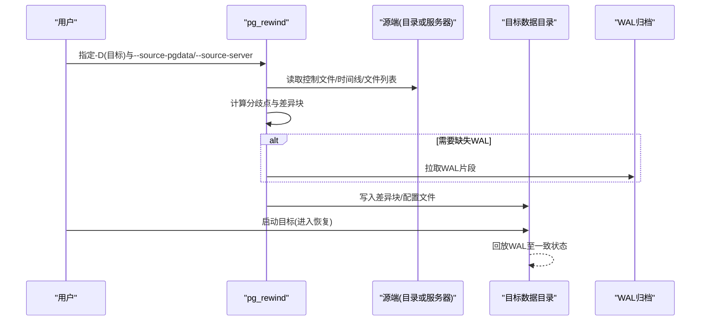
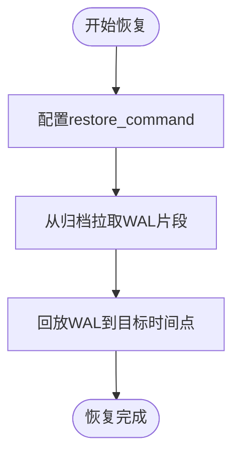
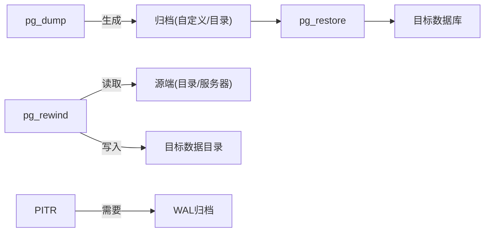

# 备份恢复工具

<cite>
**本文引用的文件**
- [backup.sgml](file://doc/src/sgml/backup.sgml)
- [pg_rewind.sgml](file://doc/src/sgml/ref/pg_rewind.sgml)
- [pg_rewind.c](file://src/bin/pg_rewind/pg_rewind.c)
- [libpq_source.c](file://src/bin/pg_rewind/libpq_source.c)
- [config.sgml](file://doc/src/sgml/config.sgml)
- [perform.sgml](file://doc/src/sgml/perform.sgml)
</cite>

## 目录
1. [简介](#简介)
2. [项目结构](#项目结构)
3. [核心组件](#核心组件)
4. [架构总览](#架构总览)
5. [详细组件分析](#详细组件分析)
6. [依赖关系分析](#依赖关系分析)
7. [性能考虑](#性能考虑)
8. [故障排查指南](#故障排查指南)
9. [结论](#结论)
10. [附录](#附录)

## 简介
本文件面向PostgreSQL的备份与恢复，聚焦以下主题：
- pg_dump逻辑备份：全库、表级、自定义格式、并行等模式与选项
- pg_restore恢复：从自定义/目录归档中按对象或并行恢复
- pg_rewind在故障恢复与数据同步中的作用：将旧主节点重新作为备库使用
- 完整的备份恢复策略与自动化脚本示例：保障数据安全与业务连续性

## 项目结构
围绕备份恢复的相关文档与实现主要分布在如下位置：
- 文档：doc/src/sgml/backup.sgml（备份与恢复总体说明）、ref/pg_rewind.sgml（pg_rewind手册）
- 实现：src/bin/pg_rewind/pg_rewind.c（主程序）、libpq_source.c（通过libpq获取源端信息）
- 配置：doc/src/sgml/config.sgml（WAL归档与恢复相关参数）
- 性能：doc/src/sgml/perform.sgml（并行导入优化建议）

图表来源
- [backup.sgml:27-132](file://doc/src/sgml/backup.sgml#L27-L132)
- [pg_rewind.sgml:40-103](file://doc/src/sgml/ref/pg_rewind.sgml#L40-L103)
- [pg_rewind.c:107-200](file://src/bin/pg_rewind/pg_rewind.c#L107-L200)

章节来源
- [backup.sgml:27-132](file://doc/src/sgml/backup.sgml#L27-L132)
- [pg_rewind.sgml:40-103](file://doc/src/sgml/ref/pg_rewind.sgml#L40-L103)

## 核心组件
- pg_dump：生成SQL文本或自定义/目录归档；支持按schema/table过滤、压缩、并行导出
- pg_restore：从自定义/目录归档恢复，支持选择性对象恢复与并行导入
- pg_rewind：比较源与目标的时间线，仅复制差异块，使旧主节点可快速作为备库接入新主
- WAL归档与恢复：通过archive_command/restore_command配合连续归档实现时间点恢复(PITR)

章节来源
- [backup.sgml:27-132](file://doc/src/sgml/backup.sgml#L27-L132)
- [backup.sgml:241-354](file://doc/src/sgml/backup.sgml#L241-L354)
- [pg_rewind.sgml:40-103](file://doc/src/sgml/ref/pg_rewind.sgml#L40-L103)
- [config.sgml:3155-3175](file://doc/src/sgml/config.sgml#L3155-L3175)

## 架构总览
下图展示备份与恢复的整体流程，包括逻辑备份、归档恢复与故障切换后的重同步。

图表来源
- [backup.sgml:27-132](file://doc/src/sgml/backup.sgml#L27-L132)
- [backup.sgml:241-354](file://doc/src/sgml/backup.sgml#L241-L354)
- [pg_rewind.sgml:40-103](file://doc/src/sgml/ref/pg_rewind.sgml#L40-L103)
- [pg_rewind.c:107-200](file://src/bin/pg_rewind/pg_rewind.c#L107-L200)
- [libpq_source.c:237-269](file://src/bin/pg_rewind/libpq_source.c#L237-L269)

## 详细组件分析

### pg_dump：逻辑备份工具
- 备份模式
  - SQL文本：可直接用psql恢复，适合跨版本迁移与跨架构迁移
  - 自定义格式(-Fc)：内置压缩，支持选择性恢复
  - 目录格式(-Fd)：支持并行导出(-j)，便于大库高效备份
- 常用能力
  - 全库备份、按schema/table筛选
  - 通过管道结合压缩工具处理超大文件
  - 并行导出提升吞吐
- 恢复方式
  - 文本：psql
  - 自定义/目录：pg_restore

图表来源
- [backup.sgml:27-132](file://doc/src/sgml/backup.sgml#L27-L132)
- [backup.sgml:241-354](file://doc/src/sgml/backup.sgml#L241-L354)

章节来源
- [backup.sgml:27-132](file://doc/src/sgml/backup.sgml#L27-L132)
- [backup.sgml:241-354](file://doc/src/sgml/backup.sgml#L241-L354)

### pg_restore：从归档恢复
- 适用场景：自定义/目录归档
- 关键能力：按对象恢复、并行恢复(-j)、单事务恢复(--single-transaction)
- 性能建议：大批量导入时关闭WAL归档、使用单事务、开启并行导入

图表来源
- [backup.sgml:104-132](file://doc/src/sgml/backup.sgml#L104-L132)
- [perform.sgml:1824-1855](file://doc/src/sgml/perform.sgml#L1824-L1855)

章节来源
- [backup.sgml:104-132](file://doc/src/sgml/backup.sgml#L104-L132)
- [perform.sgml:1824-1855](file://doc/src/sgml/perform.sgml#L1824-L1855)

### pg_rewind：故障恢复与数据同步
- 作用：将旧主节点的数据目录与新的主节点保持一致，使其可作为备库继续参与复制
- 工作原理：比较源与目标的时间线，找到分歧点，仅复制差异块；必要时从WAL归档拉取缺失片段
- 前置条件：目标需干净关闭；启用wal_log_hints或数据校验；full_page_writes=on
- 典型流程：
  - 指定目标目录与源(本地目录或运行中服务器)
  - 计算分歧点与所需WAL
  - 复制差异块与必要文件
  - 启动目标进入恢复并回放WAL

图表来源
- [pg_rewind.sgml:40-103](file://doc/src/sgml/ref/pg_rewind.sgml#L40-L103)
- [pg_rewind.c:107-200](file://src/bin/pg_rewind/pg_rewind.c#L107-L200)
- [libpq_source.c:237-269](file://src/bin/pg_rewind/libpq_source.c#L237-L269)

章节来源
- [pg_rewind.sgml:40-103](file://doc/src/sgml/ref/pg_rewind.sgml#L40-L103)
- [pg_rewind.c:107-200](file://src/bin/pg_rewind/pg_rewind.c#L107-L200)
- [libpq_source.c:237-269](file://src/bin/pg_rewind/libpq_source.c#L237-L269)

### WAL归档与恢复(PITR)
- archive_command：将WAL片段复制到归档存储
- restore_command：恢复时从归档拉取WAL片段
- 注意事项：命令必须正确返回退出码；路径占位符%f/%p；仅在postgresql.conf或命令行设置

图表来源
- [config.sgml:3155-3175](file://doc/src/sgml/config.sgml#L3155-L3175)

章节来源
- [config.sgml:3155-3175](file://doc/src/sgml/config.sgml#L3155-L3175)

## 依赖关系分析
- pg_dump依赖客户端连接与权限，对全库备份通常需要超级用户
- pg_restore依赖归档格式与目标库对象存在性
- pg_rewind依赖源端可达性与WAL完整性，以及目标目录的可写权限
- PITR依赖正确的archive/restore配置与可用WAL归档

图表来源
- [backup.sgml:27-132](file://doc/src/sgml/backup.sgml#L27-L132)
- [pg_rewind.sgml:40-103](file://doc/src/sgml/ref/pg_rewind.sgml#L40-L103)
- [config.sgml:3155-3175](file://doc/src/sgml/config.sgml#L3155-L3175)

章节来源
- [backup.sgml:27-132](file://doc/src/sgml/backup.sgml#L27-L132)
- [pg_rewind.sgml:40-103](file://doc/src/sgml/ref/pg_rewind.sgml#L40-L103)
- [config.sgml:3155-3175](file://doc/src/sgml/config.sgml#L3155-L3175)

## 性能考虑
- 大库备份
  - 使用自定义/目录格式以获得压缩与并行能力
  - 使用-j并行导出/导入，显著提升吞吐
- 恢复优化
  - 大批量导入时可关闭WAL归档并使用单事务
  - 使用pg_restore --jobs并行加载数据与重建索引
  - 恢复后执行ANALYZE更新统计

章节来源
- [backup.sgml:241-354](file://doc/src/sgml/backup.sgml#L241-L354)
- [perform.sgml:1824-1855](file://doc/src/sgml/perform.sgml#L1824-L1855)

## 故障排查指南
- pg_rewind失败风险
  - 若pg_rewind中途失败，目标目录可能不可恢复，建议重新做基础备份
  - 注意只读文件或符号链接映射导致的写入失败
- 恢复一致性
  - 恢复后需确保WAL回放完成，必要时配置restore_command以获取缺失WAL
- 权限与连接
  - pg_dump全库备份通常需超级用户
  - pg_rewind通过libpq访问源端时需具备相应函数执行权限或超级用户

章节来源
- [pg_rewind.sgml:105-132](file://doc/src/sgml/ref/pg_rewind.sgml#L105-L132)
- [pg_rewind.sgml:40-103](file://doc/src/sgml/ref/pg_rewind.sgml#L40-L103)
- [backup.sgml:47-102](file://doc/src/sgml/backup.sgml#L47-L102)

## 结论
- 逻辑备份(pg_dump)与归档恢复(PITR)互补：前者提供灵活的对象级恢复与跨版本迁移能力，后者提供细粒度时间点恢复
- pg_rewind极大缩短故障切换后的再同步时间，适用于“旧主变备”的场景
- 合理选择备份格式与并行度、配合WAL归档与恢复配置，可在保证安全性的同时获得最佳性能

## 附录

### 完整备份恢复策略建议
- 日常备份
  - 每日全库逻辑备份：优先使用目录格式(-Fd)并启用并行(-j)
  - 每周一次全量物理基础备份 + 持续WAL归档
- 恢复演练
  - 定期在隔离环境验证恢复流程与RTO/RPO
- 故障切换
  - 主库故障后，尽快将最近的基础备份+归档恢复到新主
  - 使用pg_rewind将旧主重新加入为新主的备库

### 自动化脚本示例（思路）
- 定时任务
  - 使用cron调度pg_dump，输出到目录归档并压缩
  - 归档WAL到远程存储，保留策略按RPO设定
- 恢复脚本
  - 校验归档完整性
  - 停止目标实例，清理数据目录，恢复基础备份
  - 配置restore_command，启动实例进行恢复
  - 恢复完成后执行ANALYZE
- 切换脚本
  - 触发pg_rewind，将旧主重新作为备库
  - 验证复制状态与延迟

[本节为概念性内容，不直接分析具体文件]