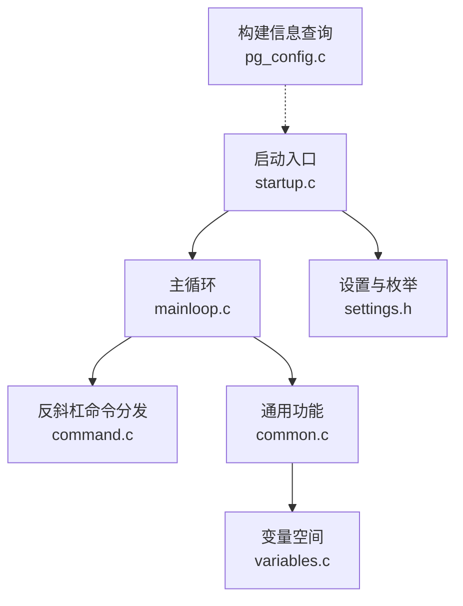
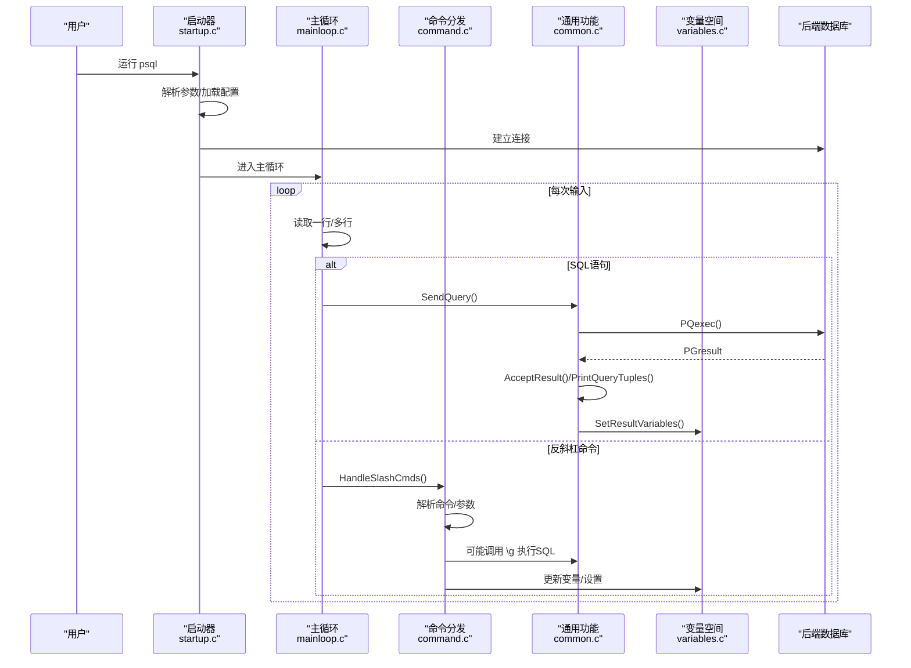
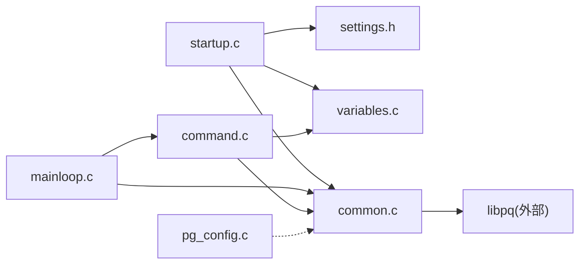

# 客户端连接工具

<cite>
**本文引用的文件**
- [startup.c](file://src/bin/psql/startup.c)
- [mainloop.c](file://src/bin/psql/mainloop.c)
- [command.c](file://src/bin/psql/command.c)
- [common.c](file://src/bin/psql/common.c)
- [variables.c](file://src/bin/psql/variables.c)
- [settings.h](file://src/bin/psql/settings.h)
- [pg_config.c](file://src/bin/pg_config/pg_config.c)
</cite>

## 目录
1. [简介](#简介)
2. [项目结构](#项目结构)
3. [核心组件](#核心组件)
4. [架构总览](#架构总览)
5. [详细组件分析](#详细组件分析)
6. [依赖关系分析](#依赖关系分析)
7. [性能与最佳实践](#性能与最佳实践)
8. [故障排查指南](#故障排查指南)
9. [结论](#结论)
10. [附录：常用命令速查](#附录：常用命令速查)

## 简介
本文件面向PostgreSQL客户端连接工具，重点围绕交互式客户端 psql 的强大能力展开，涵盖SQL执行、结果格式化、脚本执行、元数据查询等核心特性；同时说明 psql 的命令、变量设置与配置文件选项，并介绍 pg_config 工具用于获取编译配置信息的使用方法。文末提供常用操作的最佳实践与性能优化建议。

## 项目结构
psql 的源码位于 src/bin/psql，主要模块包括：
- 启动与参数解析：startup.c
- 主循环与输入处理：mainloop.c
- 反斜杠命令（\x、\d、\g 等）：command.c
- 通用功能（输出重定向、取消、结果打印、变量注入等）：common.c
- 变量空间与变量管理：variables.c
- 全局设置与枚举定义：settings.h
- 构建信息查询工具：pg_config.c

图表来源
- [startup.c:108-441](file://src/bin/psql/startup.c#L108-L441)
- [mainloop.c:32-646](file://src/bin/psql/mainloop.c#L32-L646)
- [command.c:193-418](file://src/bin/psql/command.c#L193-L418)
- [common.c:43-105](file://src/bin/psql/common.c#L43-L105)
- [variables.c:50-92](file://src/bin/psql/variables.c#L50-L92)
- [settings.h:79-148](file://src/bin/psql/settings.h#L79-L148)
- [pg_config.c:129-189](file://src/bin/pg_config/pg_config.c#L129-L189)

章节来源
- [startup.c:108-441](file://src/bin/psql/startup.c#L108-L441)
- [mainloop.c:32-646](file://src/bin/psql/mainloop.c#L32-L646)
- [command.c:193-418](file://src/bin/psql/command.c#L193-L418)
- [common.c:43-105](file://src/bin/psql/common.c#L43-L105)
- [variables.c:50-92](file://src/bin/psql/variables.c#L50-L92)
- [settings.h:79-148](file://src/bin/psql/settings.h#L79-L148)
- [pg_config.c:129-189](file://src/bin/pg_config/pg_config.c#L129-L189)

## 核心组件
- 启动与初始化：负责解析命令行参数、建立数据库连接、加载配置文件、初始化变量空间与默认输出格式。
- 主循环：持续读取用户输入或脚本文件，识别SQL语句与反斜杠命令，维护多行输入、历史、条件分支（\if/\else/\endif）。
- 反斜杠命令：实现 \d* 元数据查询、\g 系列执行控制、\pset 输出控制、\watch 定时执行、\crosstabview 交叉表展示等。
- 通用功能：输出重定向到文件或管道、查询取消、错误结果保存与显示、变量注入与转义、结果集打印。
- 变量系统：支持布尔/数值解析、变量钩子、变量作用域与同步。
- 构建信息查询：pg_config 提供安装路径、编译器标志、库信息等。

章节来源
- [startup.c:108-441](file://src/bin/psql/startup.c#L108-L441)
- [mainloop.c:32-646](file://src/bin/psql/mainloop.c#L32-L646)
- [command.c:193-418](file://src/bin/psql/command.c#L193-L418)
- [common.c:43-105](file://src/bin/psql/common.c#L43-L105)
- [variables.c:50-92](file://src/bin/psql/variables.c#L50-L92)
- [pg_config.c:129-189](file://src/bin/pg_config/pg_config.c#L129-L189)

## 架构总览
下图展示了从启动到执行SQL的关键流程，以及各模块之间的交互关系。

图表来源
- [startup.c:108-441](file://src/bin/psql/startup.c#L108-L441)
- [mainloop.c:32-646](file://src/bin/psql/mainloop.c#L32-L646)
- [command.c:193-418](file://src/bin/psql/command.c#L193-L418)
- [common.c:515-569](file://src/bin/psql/common.c#L515-L569)
- [variables.c:50-92](file://src/bin/psql/variables.c#L50-L92)

## 详细组件分析

### 启动与连接（startup.c）
- 解析命令行参数（如 -c/-f/-d/-h/-p/-U/-W/-w/-X/-P/-o/-q/-t/-x/-H 等），设置输出格式、字段分隔符、记录分隔符、是否单事务模式等。
- 建立数据库连接，必要时提示密码；支持通过环境变量和URI参数组合。
- 加载配置文件（系统级 psqlrc、用户级 .psqlrc 及版本化变体），执行其中的初始化命令。
- 若指定了动作（单条SQL、反斜杠命令或脚本文件），按顺序执行；否则进入交互式主循环。

章节来源
- [startup.c:108-441](file://src/bin/psql/startup.c#L108-L441)
- [startup.c:448-709](file://src/bin/psql/startup.c#L448-L709)
- [startup.c:742-798](file://src/bin/psql/startup.c#L742-L798)

### 主循环与输入处理（mainloop.c）
- 维护扫描状态、条件栈（\if/\else/\endif）、查询缓冲、历史缓冲。
- 支持 Ctrl-C 中断、EOF 行为（ignoreeof）、单行模式（singleline）、回显（echo）。
- 将输入逐行送入词法分析器，遇到分号或结束即执行；遇到反斜杠命令则交由 command.c 处理。
- 在脚本模式下，检测非SQL内容（如自定义格式备份头），避免误执行。

章节来源
- [mainloop.c:32-646](file://src/bin/psql/mainloop.c#L32-L646)

### 反斜杠命令（command.c）
- 统一入口 HandleSlashCmds 解析命令名与参数，再路由到具体 exec_command_*。
- 常见命令类别：
  - 连接与会话：\c/connect、\conninfo、\quit/exit
  - 元数据查询：\d*（表、视图、函数、类型、索引、模式、聚合、语言等）
  - 执行控制：\g/gdesc/gexec/gset、\watch、\timing
  - 输出控制：\pset、\a、\t、\x、\H、\o/out、\T/table attr
  - 脚本控制：\i/include、\if/\elif/\else/\endif、\e/edit、\! shell
  - 变量与提示：\set/unset/prompt、\echo/qecho/warn
- 部分命令会触发SQL执行（如 \g、\crosstabview），或通过描述函数生成DDL/元数据。

章节来源
- [command.c:193-418](file://src/bin/psql/command.c#L193-L418)
- [command.c:421-800](file://src/bin/psql/command.c#L421-L800)

### 通用功能（common.c）
- 输出重定向：openQueryOutputFile/setQFout 支持 stdout、文件、管道。
- 查询执行封装：PSQLexec/PSQLexecWatch 统一发送SQL、处理取消、计时、结果打印。
- 结果处理：AcceptResult/ClearOrSaveResult/SetResultVariables 保证错误状态可追踪。
- 变量注入：psql_get_variable 支持普通、SQL字面量、标识符、Shell参数等不同转义场景。
- 取消机制：setup_cancel_handler 与 SIGINT 处理，支持中断长查询。

章节来源
- [common.c:43-105](file://src/bin/psql/common.c#L43-L105)
- [common.c:515-569](file://src/bin/psql/common.c#L515-L569)
- [common.c:572-658](file://src/bin/psql/common.c#L572-L658)
- [common.c:122-207](file://src/bin/psql/common.c#L122-L207)
- [common.c:236-258](file://src/bin/psql/common.c#L236-L258)

### 变量系统（variables.c）
- 变量空间：CreateVariableSpace/GetVariable/SetVariable/DeleteVariable/PrintVariables。
- 值解析：ParseVariableBool/ParseVariableNum 支持多种布尔/整数表示。
- 钩子机制：SetVariableHooks 允许为变量绑定替换与赋值钩子，驱动 pset 状态同步。
- 命名规则：valid_variable_name 校验变量名合法性。

章节来源
- [variables.c:50-92](file://src/bin/psql/variables.c#L50-L92)
- [variables.c:106-180](file://src/bin/psql/variables.c#L106-L180)
- [variables.c:210-296](file://src/bin/psql/variables.c#L210-L296)
- [variables.c:314-361](file://src/bin/psql/variables.c#L314-L361)

### 设置与枚举（settings.h）
- 全局设置结构 PsqlSettings 包含连接、编码、输出、打印选项、变量空间、日志、错误处理策略、提示符等。
- 关键枚举：PSQL_ECHO、PSQL_ECHO_HIDDEN、PSQL_ERROR_ROLLBACK、PSQL_COMP_CASE、HistControl、trivalue。
- 默认常量：CSV/字段/记录分隔符、默认编辑器、默认提示符等。

章节来源
- [settings.h:79-148](file://src/bin/psql/settings.h#L79-L148)
- [settings.h:14-27](file://src/bin/psql/settings.h#L14-L27)

### 构建信息查询（pg_config.c）
- 用途：报告已安装的 PostgreSQL 版本信息与构建配置，供外部包或扩展构建时使用。
- 支持的开关：--bindir、--docdir、--htmldir、--includedir、--pkgincludedir、--includedir-server、--libdir、--pkglibdir、--localedir、--mandir、--sharedir、--sysconfdir、--pgxs、--configure、--cc、--cppflags、--cflags、--cflags_sl、--ldflags、--ldflags_ex、--ldflags_sl、--libs、--version。
- 无参数时输出所有已知项；带参数时仅输出对应项。

章节来源
- [pg_config.c:129-189](file://src/bin/pg_config/pg_config.c#L129-L189)
- [pg_config.c:43-68](file://src/bin/pg_config/pg_config.c#L43-L68)

## 依赖关系分析
- startup.c 依赖 settings.h 中的全局设置与枚举，依赖 variables.c 进行变量初始化，依赖 common.c 的输出与连接辅助。
- mainloop.c 依赖 command.c 的反斜杠命令处理，依赖 common.c 的查询执行与结果打印。
- command.c 依赖 common.c 的 \g 执行、变量注入、输出重定向；依赖 describe/crosstabview 等元数据与展示功能。
- common.c 依赖 libpq 接口（PQexec/PQresultStatus 等）与 fe_utils 打印模块。
- pg_config.c 独立于 psql，仅依赖公共配置信息接口。

图表来源
- [startup.c:108-441](file://src/bin/psql/startup.c#L108-L441)
- [mainloop.c:32-646](file://src/bin/psql/mainloop.c#L32-L646)
- [command.c:193-418](file://src/bin/psql/command.c#L193-L418)
- [common.c:515-569](file://src/bin/psql/common.c#L515-L569)
- [pg_config.c:129-189](file://src/bin/pg_config/pg_config.c#L129-L189)

章节来源
- [startup.c:108-441](file://src/bin/psql/startup.c#L108-L441)
- [mainloop.c:32-646](file://src/bin/psql/mainloop.c#L32-L646)
- [command.c:193-418](file://src/bin/psql/command.c#L193-L418)
- [common.c:515-569](file://src/bin/psql/common.c#L515-L569)
- [pg_config.c:129-189](file://src/bin/pg_config/pg_config.c#L129-L189)

## 性能与最佳实践
- 使用 \timing 统计每条SQL耗时，定位慢查询；结合 EXPLAIN/EXPLAIN ANALYZE 分析计划。
- 合理设置输出格式：
  - 批量导出使用 CSV（--csv 或 \pset format csv），减少解析开销。
  - 大结果集使用分页或限制行数，避免一次性拉取过多数据。
- 使用 \watch 定期监控查询结果变化，便于观察指标趋势。
- 利用 \gset 将查询结果存入变量，便于后续拼接SQL或脚本逻辑。
- 使用 \if/\elif/\else/\endif 进行条件执行，提升脚本灵活性。
- 使用 \o/out 将结果输出到文件或管道，配合外部工具处理。
- 使用 --single-transaction 确保多条命令原子性，失败自动回滚。
- 使用 -E/--echo-hidden 调试内部生成的SQL，便于问题定位。
- 使用 -X 跳过配置文件，快速复现最小环境；或使用 psqlrc 定制默认行为。
- 使用 \errverbose 查看最近一次错误的详细信息，提高排错效率。
- 使用 \crosstabview 对二维数据进行交叉表展示，便于直观分析。

[本节为通用指导，不直接分析具体文件]

## 故障排查指南
- 连接失败：检查主机、端口、用户名、密码与网络连通性；确认认证方式与 pg_hba.conf 配置。
- 会话丢失：psql 在非交互模式下检测到连接断开会退出；交互模式下尝试重置连接并恢复。
- 权限不足：确认当前用户对目标对象有相应权限；必要时使用具备更高权限的用户执行。
- 输出异常：检查 \pset 设置、字段/记录分隔符、是否启用 expanded 模式；确认输出重定向是否正确。
- 变量未生效：确认变量名称合法、作用域正确；使用 \set 查看当前变量；注意 \if 分支内变量替换可能被抑制。
- 脚本执行错误：使用 -b/--echo-errors 或 \errverbose 查看错误详情；使用 on_error_stop 控制脚本终止行为。
- 构建配置问题：使用 pg_config 核对安装路径、编译器标志、库链接参数，确保扩展或第三方工具正确构建。

章节来源
- [common.c:273-331](file://src/bin/psql/common.c#L273-L331)
- [common.c:336-385](file://src/bin/psql/common.c#L336-L385)
- [common.c:399-428](file://src/bin/psql/common.c#L399-L428)
- [pg_config.c:129-189](file://src/bin/pg_config/pg_config.c#L129-L189)

## 结论
psql 作为PostgreSQL的交互式客户端，提供了强大的SQL执行、结果格式化、脚本控制与元数据查询能力；配合 pg_config 可快速获取构建与安装信息。通过合理使用命令、变量与配置文件，可以显著提升日常开发与运维效率。遵循最佳实践与性能优化建议，能够在复杂场景中保持高效与稳定。

[本节为总结，不直接分析具体文件]

## 附录：常用命令速查
- 连接与会话
  - \c/connect dbname user host port：切换连接
  - \conninfo：显示当前连接信息
  - \quit/exit：退出客户端
- 元数据查询
  - \d[table|view|index|type|function|aggregate|language|schema|...]+：列出或描述对象
  - \df[+] pattern：搜索函数
  - \da[+] pattern：搜索聚合函数
  - \dT[+] pattern：搜索数据类型
- 执行控制
  - \g[filename]：执行当前缓冲区SQL，可选输出到文件或管道
  - \gdesc：仅描述结果列，不返回数据
  - \gexec：将结果每行作为SQL执行
  - \gset[prefix]：将结果行存入变量（列名作为变量名前缀）
  - \watch [sleep]：周期性执行SQL并显示结果
  - \timing：开启/关闭查询计时
- 输出控制
  - \pset key value：设置输出格式（如 border、format、pager、tablespace、expanded 等）
  - \a：切换对齐/不对齐
  - \t：仅显示元组（隐藏标题与分隔线）
  - \x：开启/关闭扩展显示
  - \H：输出HTML表格
  - \o[out] filename：重定向输出到文件或管道
  - \T table_attr：设置表格属性（如 HTML 类名）
- 脚本控制
  - \i/include file：包含并执行脚本
  - \if expr / \elif expr / \else / \endif：条件执行
  - \e/edit：用编辑器编辑当前缓冲区
  - \! command：执行系统命令
- 变量与提示
  - \set name=value / \unset name：设置/删除变量
  - \prompt text：交互式设置变量
  - \echo/qecho/warn：输出消息
- 错误与调试
  - \errverbose：显示最近一次错误的详细信息
  - -E/--echo-hidden：显示内部生成的SQL
  - -b/--echo-errors：执行时回显错误
  - -1/--single-transaction：以单事务执行多条命令

[本节为概览性参考，不直接分析具体文件]