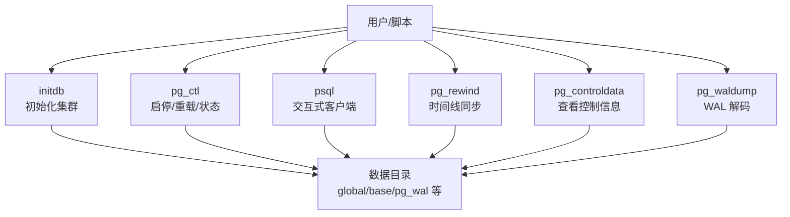
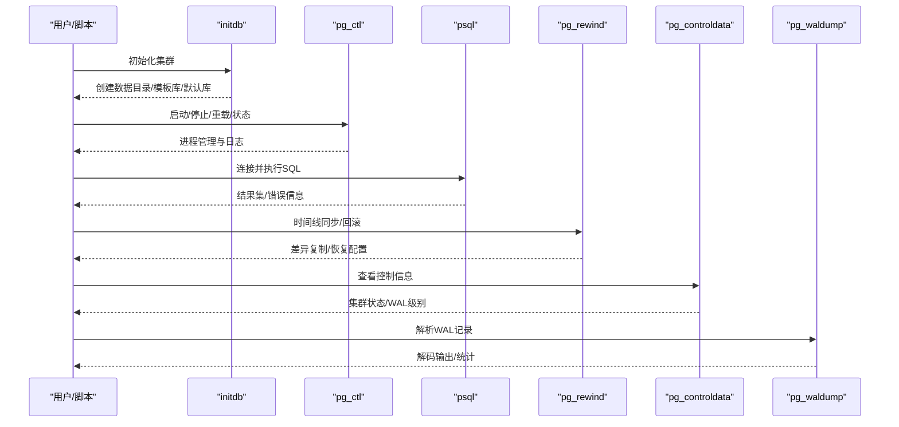
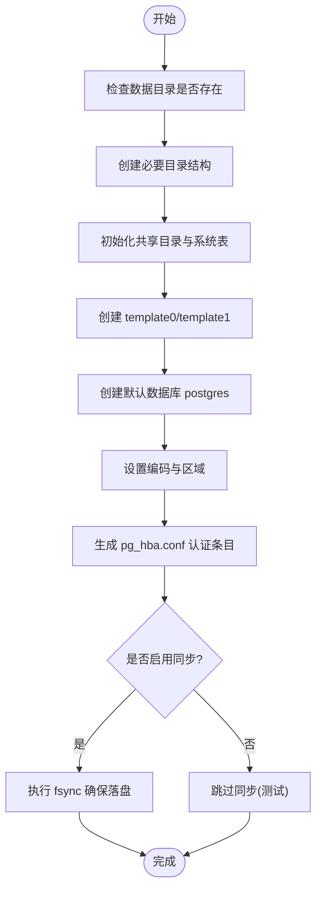
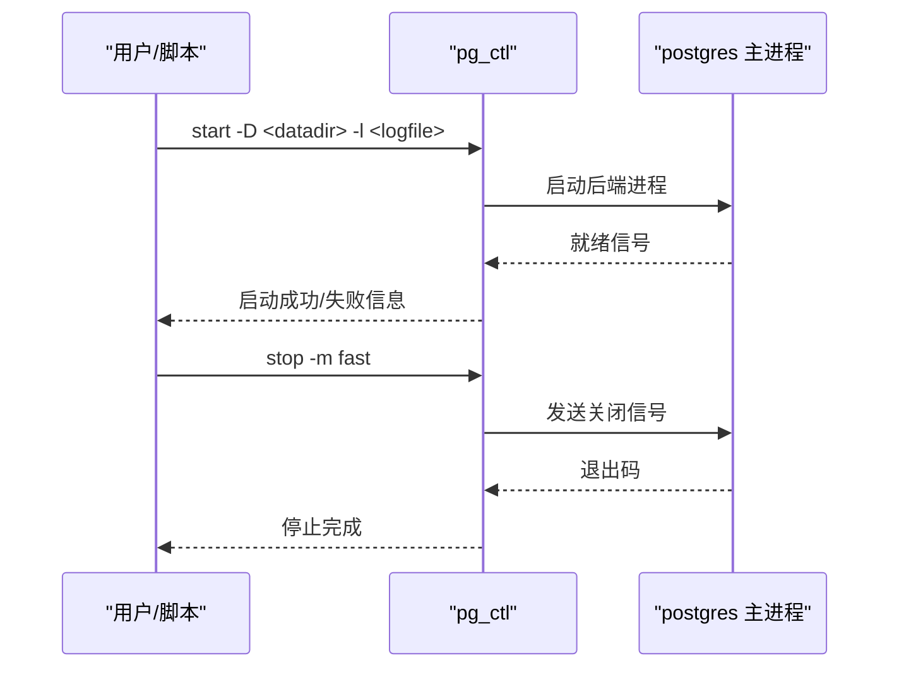
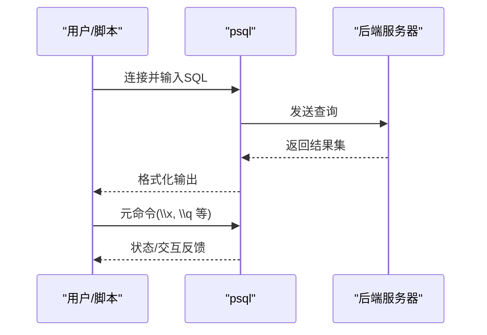
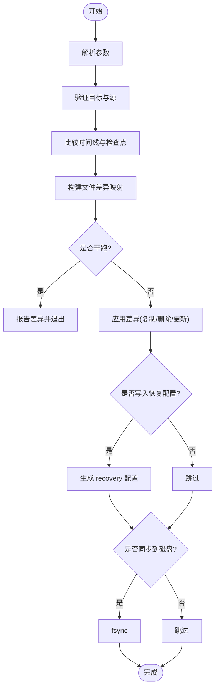
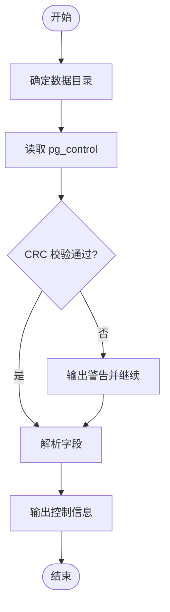
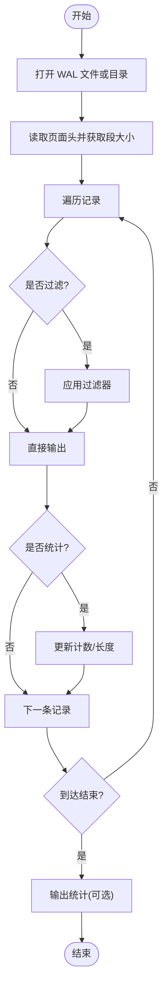
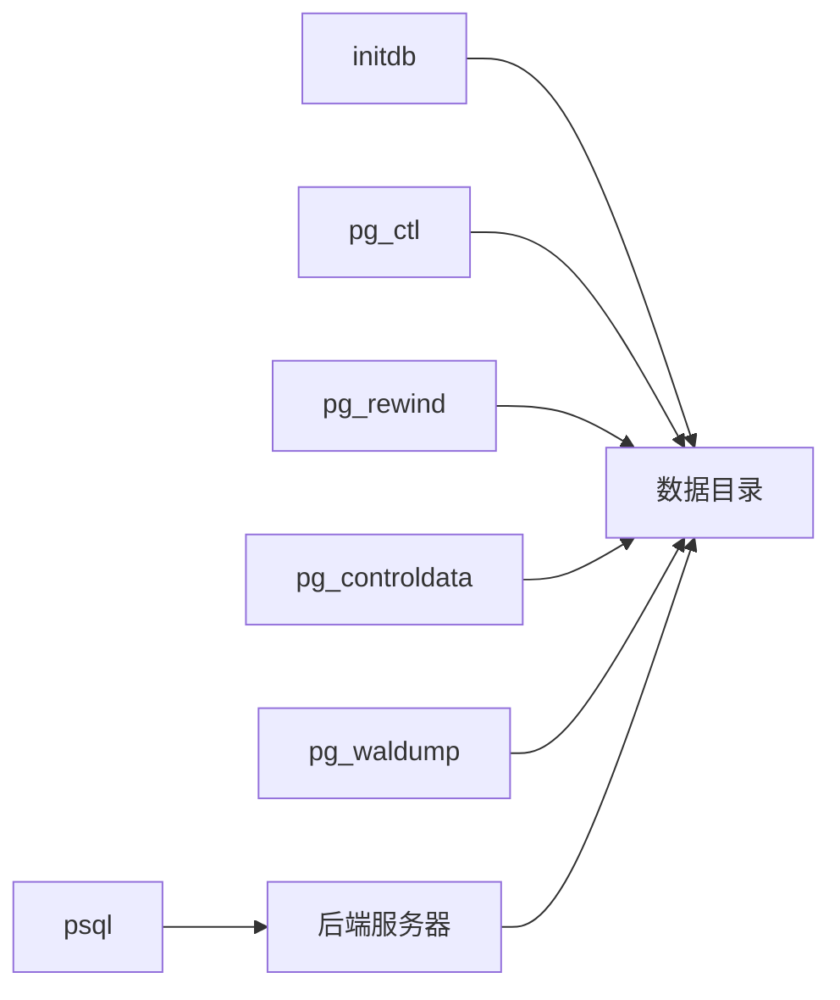

# 工具和实用程序

<cite>
**本文引用的文件**
- [README](file://README)
- [initdb.c](file://src/bin/initdb/initdb.c)
- [pg_ctl.c](file://src/bin/pg_ctl/pg_ctl.c)
- [mainloop.c](file://src/bin/psql/mainloop.c)
- [pg_rewind.c](file://src/bin/pg_rewind/pg_rewind.c)
- [pg_controldata.c](file://src/bin/pg_controldata/pg_controldata.c)
- [pg_waldump.c](file://src/bin/pg_waldump/pg_waldump.c)
- [PostgresNode.pm](file://src/test/perl/PostgresNode.pm)
- [initdb.sgml](file://doc/src/sgml/ref/initdb.sgml)
- [pg_ctl-ref.sgml](file://doc/src/sgml/ref/pg_ctl-ref.sgml)
- [psql-ref.sgml](file://doc/src/sgml/ref/psql-ref.sgml)
</cite>

## 目录
1. [简介](#简介)
2. [项目结构](#项目结构)
3. [核心组件](#核心组件)
4. [架构总览](#架构总览)
5. [详细组件分析](#详细组件分析)
6. [依赖关系分析](#依赖关系分析)
7. [性能考量](#性能考量)
8. [故障排查指南](#故障排查指南)
9. [结论](#结论)
10. [附录](#附录)

## 简介
Mini PostgreSQL 提供一组轻量级的数据库运维工具，覆盖数据库初始化、实例生命周期管理、交互式客户端连接、WAL 诊断与恢复等常见场景。本章节面向 DBA 与开发者，系统说明各工具的用途、参数选项、输出格式与使用场景，并给出自动化脚本示例与性能注意事项，帮助高效管理 Mini PostgreSQL 数据库系统。

## 项目结构
Mini PostgreSQL 的工具集中在 src/bin 目录下，每个工具对应一个子目录：
- initdb：初始化数据库集群（创建数据目录、全局表、模板库和默认库）
- pg_ctl：启动、停止、重启、重载配置、状态查询、日志轮转、提升备库等
- psql：交互式命令行客户端，支持 SQL 执行、元命令、脚本化
- pg_rewind：将数据目录同步到新的时间线，常用于主备切换后的回滚
- pg_controldata：读取并显示控制文件信息，辅助诊断集群状态
- pg_waldump：解析并展示 WAL 记录，用于排障与审计

**图示来源**
- [initdb.c:1-47](file://src/bin/initdb/initdb.c#L1-L47)
- [pg_ctl.c:1-10](file://src/bin/pg_ctl/pg_ctl.c#L1-L10)
- [mainloop.c:1-7](file://src/bin/psql/mainloop.c#L1-L7)
- [pg_rewind.c:1-32](file://src/bin/pg_rewind/pg_rewind.c#L1-L32)
- [pg_controldata.c:1-29](file://src/bin/pg_controldata/pg_controldata.c#L1-L29)
- [pg_waldump.c:1-27](file://src/bin/pg_waldump/pg_waldump.c#L1-L27)

**章节来源**
- [README:1-6](file://README#L1-L6)

## 核心组件
本节概述各工具的职责与典型用法要点：
- initdb：创建新集群，设置编码、区域、权限策略，生成模板库与默认库；支持密码文件、无同步模式、不打印启动提示等选项。
- pg_ctl：封装 postgres 进程管理，支持智能/快速/立即三种关闭模式，等待启动完成、日志重定向、重载配置、状态检查、日志轮转、提升备库等。
- psql：交互式终端，支持 -c/-f 执行 SQL、多种输出格式（对齐/非对齐/CSV）、变量与元命令、错误回显、静默模式等。
- pg_rewind：基于源端或源数据目录，比较差异并仅复制变更页，支持 dry-run、进度、写入恢复配置、恢复目标 WAL 等。
- pg_controldata：读取 PGDATA/global/pg_control，输出集群状态、WAL 级别、校验信息等。
- pg_waldump：从指定目录或文件解析 WAL，支持过滤记录类型、事务 ID、统计、跟随模式等。

**章节来源**
- [initdb.sgml:36-117](file://doc/src/sgml/ref/initdb.sgml#L36-L117)
- [pg_ctl-ref.sgml:144-200](file://doc/src/sgml/ref/pg_ctl-ref.sgml#L144-L200)
- [psql-ref.sgml:33-46](file://doc/src/sgml/ref/psql-ref.sgml#L33-L46)
- [pg_rewind.c:82-104](file://src/bin/pg_rewind/pg_rewind.c#L82-L104)
- [pg_controldata.c:32-46](file://src/bin/pg_controldata/pg_controldata.c#L32-L46)
- [pg_waldump.c:32-73](file://src/bin/pg_waldump/pg_waldump.c#L32-L73)

## 架构总览
工具之间的协作关系如下：
- 初始化阶段：initdb 构建数据目录与系统对象，为后续服务运行奠定基础。
- 运行期管理：pg_ctl 负责启动/停止/重载/状态/日志轮转/提升，psql 作为客户端连接后端执行 SQL。
- 备份与恢复：通过文件系统级备份（热/冷）或流式备份（pg_basebackup），结合 pg_rewind 进行时间线同步与回滚。
- 诊断与排障：pg_controldata 读取控制文件，pg_waldump 解析 WAL 记录，定位问题根因。

**图示来源**
- [initdb.c:1-47](file://src/bin/initdb/initdb.c#L1-L47)
- [pg_ctl.c:1-10](file://src/bin/pg_ctl/pg_ctl.c#L1-L10)
- [mainloop.c:1-7](file://src/bin/psql/mainloop.c#L1-L7)
- [pg_rewind.c:1-32](file://src/bin/pg_rewind/pg_rewind.c#L1-L32)
- [pg_controldata.c:1-29](file://src/bin/pg_controldata/pg_controldata.c#L1-L29)
- [pg_waldump.c:1-27](file://src/bin/pg_waldump/pg_waldump.c#L1-L27)

## 详细组件分析

### initdb：数据库初始化
- 功能要点
  - 创建数据目录、全局表、模板库 template0/template1 与默认库 postgres。
  - 设置默认编码、区域排序规则、字符类别；可单独调整 LC_COLLATE/LC_CTYPE。
  - 安全策略：默认仅集群所有者可访问；可选允许同组用户读取以支持非特权备份。
  - 支持密码文件、无同步模式、调试与清理控制等。
- 常用参数
  - -D/--pgdata：指定数据目录
  - -E/--encoding：设置模板库编码
  - --auth/--auth-host/--auth-local：设置认证方法
  - --pwfile：从文件读取超级用户密码
  - -N/--no-sync：不等待磁盘同步（测试用）
  - --no-instructions：不输出启动提示
  - -L：指定输入文件位置
  - -n/--no-clean：出错时不清理已创建文件（调试用）
  - -V/--version：输出版本信息
- 使用场景
  - 首次部署、容器化初始化、批量环境准备
- 输出格式
  - 控制台输出初始化步骤与提示信息；可通过环境变量或选项控制日志行为
- 自动化建议
  - 在 CI/CD 中配合 -N 加速初始化；生产环境务必避免该选项
  - 使用 --pwfile 注入密码，避免明文传递

**图示来源**
- [initdb.c:152-174](file://src/bin/initdb/initdb.c#L152-L174)
- [initdb.sgml:36-117](file://doc/src/sgml/ref/initdb.sgml#L36-L117)

**章节来源**
- [initdb.c:1-200](file://src/bin/initdb/initdb.c#L1-L200)
- [initdb.sgml:68-456](file://doc/src/sgml/ref/initdb.sgml#L68-L456)

### pg_ctl：实例生命周期管理
- 功能要点
  - 启动/停止/重启/重载配置/状态查询/日志轮转/提升备库
  - 支持三种关闭模式：智能（等待空闲）、快速（默认，回滚活跃事务）、立即（强制终止）
  - 可等待启动完成、重定向日志、传递后端参数
- 常用参数
  - init[db]：调用 initdb 初始化集群
  - start/stop/restart/reload/status/promote/logrotate/kill
  - -D：数据目录
  - -l：日志文件
  - -W/-t：等待超时
  - -m：关闭模式 smart/fast/immediate
  - -o：传递给后端的选项
  - -p：postgres 可执行路径
  - -c：后台模式
- 使用场景
  - 服务启停编排、健康检查、日志轮转、主备切换中的 promote
- 输出格式
  - 标准输出/错误输出消息；可通过 -s 静默模式减少输出

**图示来源**
- [pg_ctl.c:38-64](file://src/bin/pg_ctl/pg_ctl.c#L38-L64)
- [pg_ctl-ref.sgml:144-200](file://doc/src/sgml/ref/pg_ctl-ref.sgml#L144-L200)

**章节来源**
- [pg_ctl.c:1-200](file://src/bin/pg_ctl/pg_ctl.c#L1-L200)
- [pg_ctl-ref.sgml:1-200](file://doc/src/sgml/ref/pg_ctl-ref.sgml#L1-L200)

### psql：交互式客户端
- 功能要点
  - 交互式执行 SQL、支持元命令与脚本化
  - 多种输出格式：对齐/非对齐/CSV；支持回显查询/错误/隐藏命令
  - 支持 -c/-f 执行单条或多条命令；支持变量、历史、自动补全
- 常用参数
  - -d/--dbname：连接数据库
  - -c/--command：执行命令字符串
  - -f：从文件读取命令
  - -A/--no-align：非对齐输出
  - --csv：CSV 输出
  - -e/--echo-queries：回显 SQL
  - -b/--echo-errors：回显错误
  - -E/--echo-hidden：回显内部命令生成的 SQL
- 使用场景
  - 日常运维、批处理脚本、ETL 任务、自动化测试
- 输出格式
  - 表格/CSV/纯文本；可通过 \pset 或命令行选项控制

**图示来源**
- [mainloop.c:25-33](file://src/bin/psql/mainloop.c#L25-L33)
- [psql-ref.sgml:33-46](file://doc/src/sgml/ref/psql-ref.sgml#L33-L46)

**章节来源**
- [mainloop.c:1-200](file://src/bin/psql/mainloop.c#L1-L200)
- [psql-ref.sgml:1-200](file://doc/src/sgml/ref/psql-ref.sgml#L1-L200)

### pg_rewind：时间线同步与回滚
- 功能要点
  - 将目标数据目录同步到新的时间线，仅复制差异页，提高恢复效率
  - 支持从源数据目录或源服务器获取差异；可写入恢复配置、恢复目标 WAL
  - 提供 dry-run、进度、调试、禁止自动修复不一致关闭等选项
- 常用参数
  - -D/--target-pgdata：目标数据目录
  - --source-pgdata：源数据目录
  - --source-server：源服务器连接串
  - -n/--dry-run：仅模拟不修改
  - -N/--no-sync：不等待磁盘同步
  - -P/--progress：显示进度
  - -R/--write-recovery-conf：写入复制配置
  - -c/--restore-target-wal：使用 restore_command 恢复 WAL
  - --debug：调试输出
  - --no-ensure-shutdown：不自动修复不一致关闭
- 使用场景
  - 主备切换后回滚、时间线分叉后的合并、快速重建副本
- 输出格式
  - 控制台进度与调试信息；可通过 --debug 增加详细日志

**图示来源**
- [pg_rewind.c:82-104](file://src/bin/pg_rewind/pg_rewind.c#L82-L104)
- [pg_rewind.c:107-200](file://src/bin/pg_rewind/pg_rewind.c#L107-L200)

**章节来源**
- [pg_rewind.c:1-200](file://src/bin/pg_rewind/pg_rewind.c#L1-L200)

### pg_controldata：控制信息查看
- 功能要点
  - 读取 PGDATA/global/pg_control，输出集群状态、WAL 级别、时间戳、校验等信息
  - 支持 -D 指定数据目录；未指定时使用 PGDATA 环境变量
- 常用参数
  - -D/--pgdata：数据目录
  - -V/--version：版本信息
  - -?/--help：帮助
- 使用场景
  - 集群状态诊断、WAL 级别确认、控制文件完整性检查
- 输出格式
  - 键值对形式输出控制字段；包含警告信息（如 CRC 不匹配）

**图示来源**
- [pg_controldata.c:32-46](file://src/bin/pg_controldata/pg_controldata.c#L32-L46)
- [pg_controldata.c:88-169](file://src/bin/pg_controldata/pg_controldata.c#L88-L169)

**章节来源**
- [pg_controldata.c:1-200](file://src/bin/pg_controldata/pg_controldata.c#L1-L200)

### pg_waldump：WAL 解码与展示
- 功能要点
  - 从指定目录或文件解析 WAL，输出记录详情
  - 支持过滤记录类型、事务 ID、统计、跟随模式、安静模式等
- 常用参数
  - 目录/文件名：指定 WAL 源
  - 过滤选项：按 rmgr/xid 过滤
  - 统计选项：统计记录数量与长度
  - follow：跟随最新 WAL
  - quiet：安静模式
- 使用场景
  - WAL 排障、审计、回放分析
- 输出格式
  - 每行一条记录，包含 LSN、时间线、记录类型、详细信息；可开启统计汇总

**图示来源**
- [pg_waldump.c:32-73](file://src/bin/pg_waldump/pg_waldump.c#L32-L73)
- [pg_waldump.c:150-200](file://src/bin/pg_waldump/pg_waldump.c#L150-L200)

**章节来源**
- [pg_waldump.c:1-200](file://src/bin/pg_waldump/pg_waldump.c#L1-L200)

## 依赖关系分析
- 工具间耦合度低，主要通过数据目录与 WAL 文件交互
- initdb 与 pg_ctl 紧密协作：initdb 创建集群，pg_ctl 管理其生命周期
- psql 通过 libpq 与后端通信，不直接操作文件系统
- pg_rewind 依赖源端一致性信息与 WAL 记录进行差异计算
- pg_controldata 与 pg_waldump 均读取 PGDATA 下的控制与 WAL 文件

**图示来源**
- [initdb.c:152-174](file://src/bin/initdb/initdb.c#L152-L174)
- [pg_ctl.c:1-10](file://src/bin/pg_ctl/pg_ctl.c#L1-L10)
- [mainloop.c:1-7](file://src/bin/psql/mainloop.c#L1-L7)
- [pg_rewind.c:1-32](file://src/bin/pg_rewind/pg_rewind.c#L1-L32)
- [pg_controldata.c:1-29](file://src/bin/pg_controldata/pg_controldata.c#L1-L29)
- [pg_waldump.c:1-27](file://src/bin/pg_waldump/pg_waldump.c#L1-L27)

**章节来源**
- [initdb.c:152-174](file://src/bin/initdb/initdb.c#L152-L174)
- [pg_ctl.c:1-10](file://src/bin/pg_ctl/pg_ctl.c#L1-L10)
- [mainloop.c:1-7](file://src/bin/psql/mainloop.c#L1-L7)
- [pg_rewind.c:1-32](file://src/bin/pg_rewind/pg_rewind.c#L1-L32)
- [pg_controldata.c:1-29](file://src/bin/pg_controldata/pg_controldata.c#L1-L29)
- [pg_waldump.c:1-27](file://src/bin/pg_waldump/pg_waldump.c#L1-L27)

## 性能考量
- initdb
  - 生产环境避免使用 -N/--no-sync，以确保数据持久性；测试环境可使用以提升速度
  - 合理选择编码与区域，避免非 C/POSIX 排序带来的性能开销
- pg_ctl
  - 选择合适的关闭模式：smart 适合优雅停机，fast 适合快速回收资源，immediate 可能导致下次启动恢复
  - 使用 -l 重定向日志，避免终端输出影响性能
- psql
  - 批处理建议使用 -A 或 --csv 输出，减少格式化开销
  - 使用 -c/-f 组合执行多条命令，减少连接开销
- pg_rewind
  - 仅复制差异页，相比全量恢复更高效；合理使用 --dry-run 评估影响
  - 启用 --restore-target-wal 可结合归档恢复缺失 WAL
- pg_controldata/pg_waldump
  - 大 WAL 文件解析耗时，建议按需过滤与限制范围；统计模式可用于性能基线

[本节为通用指导，无需特定文件引用]

## 故障排查指南
- 初始化失败
  - 检查数据目录权限与存在性；避免以 root 运行 initdb
  - 使用 -n/--no-clean 保留中间文件以便调试
- 启动失败
  - 使用 pg_ctl status 检查进程状态；查看日志文件定位错误
  - 关闭模式选择不当可能导致长时间等待或数据不一致
- 客户端连接问题
  - 检查 pg_hba.conf 认证配置；使用 psql -e 回显 SQL 辅助定位
  - 多语句 -c 行为与预期不符时，改用多次 -c 或管道输入
- 时间线分叉
  - 使用 pg_rewind --dry-run 评估差异；必要时启用 --restore-target-wal 恢复缺失 WAL
  - 若不一致关闭，谨慎使用 --no-ensure-shutdown
- WAL 异常
  - 使用 pg_waldump 过滤特定 rmgr/xid 缩小范围；开启 stats 统计异常记录
  - 结合 pg_controldata 检查 WAL 级别与控制文件完整性

**章节来源**
- [initdb.sgml:68-456](file://doc/src/sgml/ref/initdb.sgml#L68-L456)
- [pg_ctl-ref.sgml:144-200](file://doc/src/sgml/ref/pg_ctl-ref.sgml#L144-L200)
- [psql-ref.sgml:33-200](file://doc/src/sgml/ref/psql-ref.sgml#L33-L200)
- [pg_rewind.c:82-104](file://src/bin/pg_rewind/pg_rewind.c#L82-L104)
- [pg_waldump.c:32-73](file://src/bin/pg_waldump/pg_waldump.c#L32-L73)
- [pg_controldata.c:88-169](file://src/bin/pg_controldata/pg_controldata.c#L88-L169)

## 结论
Mini PostgreSQL 的工具链覆盖了从初始化、运行期管理、客户端连接到备份恢复与诊断的全流程。通过合理选择参数与模式，可在保证数据安全的前提下提升运维效率。建议在生产环境中严格遵循安全与持久化最佳实践，并结合自动化脚本实现标准化运维。

[本节为总结，无需特定文件引用]

## 附录

### 常见运维任务脚本示例
- 初始化并启动实例
  - 使用 initdb -D <datadir> 初始化；随后 pg_ctl start -D <datadir> -l <logfile>
- 在线备份与恢复
  - 使用 PostgresNode.backup 调用 pg_basebackup 进行在线备份
  - 使用 PostgresNode.init_from_backup 从备份初始化新节点
- 主备切换与回滚
  - 使用 pg_ctl promote 提升备库；必要时使用 pg_rewind 将原主库回滚到新时间线
- WAL 诊断
  - 使用 pg_waldump 解析关键时间段 WAL；结合 pg_controldata 确认 WAL 级别

**章节来源**
- [PostgresNode.pm:51-798](file://src/test/perl/PostgresNode.pm#L51-L798)