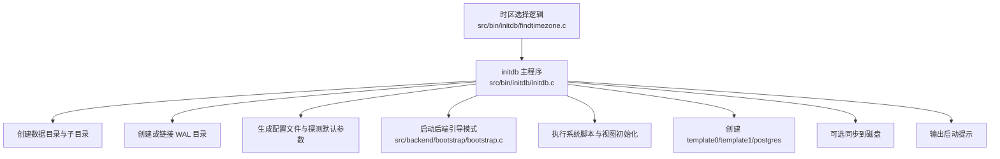
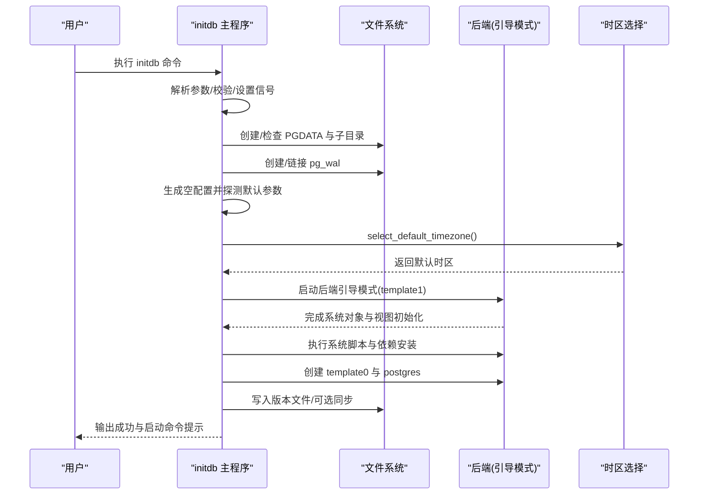
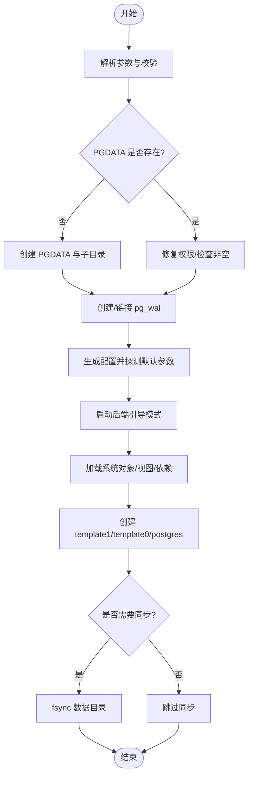
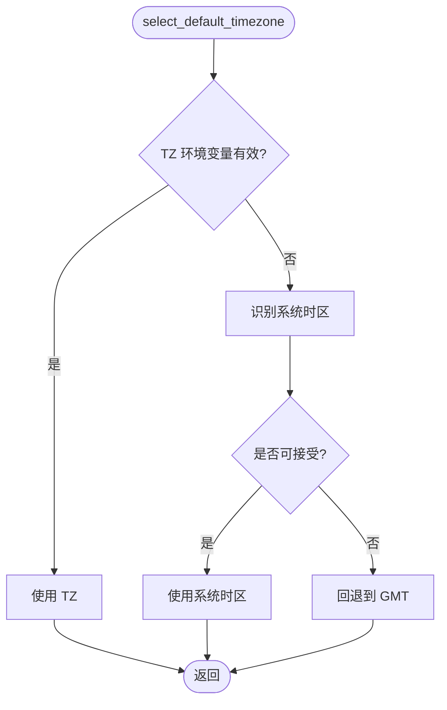
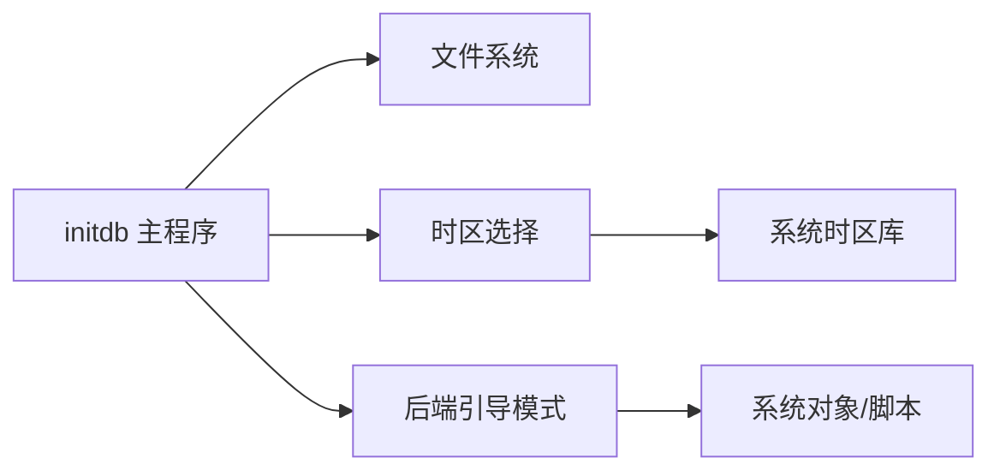

# 数据库初始化工具

<cite>
**本文引用的文件**
- [initdb.c](file://src/bin/initdb/initdb.c)
- [findtimezone.c](file://src/bin/initdb/findtimezone.c)
- [bootstrap.c](file://src/backend/bootstrap/bootstrap.c)
- [001_initdb.pl](file://src/bin/initdb/t/001_initdb.pl)
</cite>

## 目录
1. [简介](#简介)
2. [项目结构](#项目结构)
3. [核心组件](#核心组件)
4. [架构总览](#架构总览)
5. [详细组件分析](#详细组件分析)
6. [依赖关系分析](#依赖关系分析)
7. [性能考虑](#性能考虑)
8. [故障排查指南](#故障排查指南)
9. [结论](#结论)
10. [附录](#附录)

## 简介
本文件面向DBA与运维工程师，系统化说明 PostgreSQL 的数据库初始化工具 initdb 的功能、参数、初始化流程、时区与字符集配置方法，以及常见问题诊断与排错建议。文档基于源码级实现进行分析，确保内容准确、可追溯，并提供可视化流程图帮助理解。

## 项目结构
initdb 工具位于前端工具目录，负责创建数据目录、WAL 目录、系统目录结构，生成配置文件，启动后端以引导模板库并构建默认数据库。其关键源文件包括：
- 主程序与流程控制：src/bin/initdb/initdb.c
- 时区选择逻辑：src/bin/initdb/findtimezone.c
- 后端引导模式（用于创建模板库）：src/backend/bootstrap/bootstrap.c
- 测试用例（覆盖常见场景与边界条件）：src/bin/initdb/t/001_initdb.pl

图表来源
- [initdb.c:2041-2142](file://src/bin/initdb/initdb.c#L2041-L2142)
- [bootstrap.c:1-200](file://src/backend/bootstrap/bootstrap.c#L1-L200)
- [findtimezone.c:759-780](file://src/bin/initdb/findtimezone.c#L759-L780)

章节来源
- [initdb.c:2145-2467](file://src/bin/initdb/initdb.c#L2145-L2467)
- [001_initdb.pl:20-95](file://src/bin/initdb/t/001_initdb.pl#L20-L95)

## 核心组件
- 命令行参数解析与校验：支持数据目录、编码、区域设置、超级用户密码、WAL 目录、WAL 段大小、数据页校验和、权限等选项。
- 数据目录与子目录创建：自动创建必要目录结构，处理挂载点警告与权限修复。
- 配置文件生成与默认参数探测：动态选择共享内存实现、连接数与缓冲大小等。
- 后端引导与系统对象初始化：通过后端 bootstrap 模式加载系统定义、函数、视图，并创建模板库与默认数据库。
- 时区选择：优先使用环境变量 TZ，其次匹配系统时区行为，最后回退到 GMT。
- 同步与清理：可选择是否将数据落盘；失败时可清理已创建的文件与目录。

章节来源
- [initdb.c:2145-2467](file://src/bin/initdb/initdb.c#L2145-L2467)
- [initdb.c:1853-2022](file://src/bin/initdb/initdb.c#L1853-L2022)
- [initdb.c:697-800](file://src/bin/initdb/initdb.c#L697-L800)
- [findtimezone.c:759-780](file://src/bin/initdb/findtimezone.c#L759-L780)

## 架构总览
initdb 的工作流分为“准备阶段”、“引导阶段”、“收尾阶段”。准备阶段负责参数解析、路径与权限检查、目录创建与配置生成；引导阶段调用后端 bootstrap 模式完成系统对象与模板库初始化；收尾阶段进行 vacuum、版本文件写入、可选同步与提示信息输出。

图表来源
- [initdb.c:2041-2142](file://src/bin/initdb/initdb.c#L2041-L2142)
- [initdb.c:2145-2467](file://src/bin/initdb/initdb.c#L2145-L2467)
- [findtimezone.c:759-780](file://src/bin/initdb/findtimezone.c#L759-L780)
- [bootstrap.c:1-200](file://src/backend/bootstrap/bootstrap.c#L1-L200)

## 详细组件分析

### 命令行参数与用法
- 数据目录与路径
  - -D/--pgdata：指定数据目录路径。若未提供，则从位置参数获取。
  - -X/--waldir：指定 WAL 目录绝对路径；不允许相对路径；目录必须存在且为空。
  - --wal-segsize：WAL 段大小（MB），必须为 1~1024 的 2 的幂次方。
- 编码与区域设置
  - -E/--encoding：服务器编码名称，需有效。
  - --locale / --lc-collate / --lc-ctype / --lc-monetary / --lc-numeric / --lc-time / --lc-messages：分别设置区域相关属性。
  - --no-locale：强制使用 C 区域。
- 安全与权限
  - -W/--pwprompt：交互式输入超级用户密码。
  - --pwfile：从文件读取超级用户密码。
  - -U/--username：指定超级用户名，禁止以“pg_”开头。
  - -g/--allow-group-access：允许组访问，调整目录权限掩码。
- 运行与控制
  - -N/--no-sync：跳过最终同步（谨慎使用）。
  - -S/--sync-only：仅对已有数据目录执行 fsync。
  - -k/--data-checksums：启用数据页校验和。
  - -n/--no-clean：失败时不清理已创建目录。
  - --no-instructions：不输出启动提示。
  - -d/--debug：调试模式，打印内部变量。
  - -s/--show：显示当前设置后退出。
  - -L：指定 share_path（通常由构建系统设定）。
  - --discard-caches：在引导期间丢弃缓存（调试用途）。

章节来源
- [initdb.c:2145-2467](file://src/bin/initdb/initdb.c#L2145-L2467)
- [initdb.c:2218-2307](file://src/bin/initdb/initdb.c#L2218-L2307)
- [initdb.c:2356-2377](file://src/bin/initdb/initdb.c#L2356-L2377)
- [initdb.c:2385-2393](file://src/bin/initdb/initdb.c#L2385-L2393)

### 初始化流程与阶段
- 参数解析与前置检查：解析选项、校验用户名、设置 umask、注册清理回调。
- 目录与 WAL 管理：创建/检查 PGDATA 与子目录；创建/链接 pg_wal；检测挂载点并给出警告。
- 配置与默认参数：生成空配置文件；探测动态共享内存实现、max_connections、shared_buffers。
- 引导与系统对象：启动后端 bootstrap 模式，加载系统约束、函数、视图，安装依赖。
- 模板库与默认库：创建 template1（引导阶段）、template0 与 postgres（独立后端模式）。
- 收尾与同步：写入版本文件；可选同步到磁盘；输出启动命令提示。

图表来源
- [initdb.c:1853-2022](file://src/bin/initdb/initdb.c#L1853-L2022)
- [initdb.c:2041-2142](file://src/bin/initdb/initdb.c#L2041-L2142)
- [initdb.c:2145-2467](file://src/bin/initdb/initdb.c#L2145-L2467)

章节来源
- [initdb.c:1853-2022](file://src/bin/initdb/initdb.c#L1853-L2022)
- [initdb.c:2041-2142](file://src/bin/initdb/initdb.c#L2041-L2142)
- [initdb.c:2145-2467](file://src/bin/initdb/initdb.c#L2145-L2467)

### 时区配置与选择
- 优先级策略：
  1) 环境变量 TZ 若有效则直接使用；
  2) 尝试识别系统时区（读取 /etc/localtime 或扫描可用时区文件，比较 localtime 行为）；
  3) 无法识别时回退到 GMT。
- 行为细节：
  - 通过 score_timezone 对候选时区打分，优先 UTC/Etc/UTC，避免 Factory、localtime、posixrules。
  - 支持 POSIX 风格偏移构造名（如 PST8PDT）作为备选。

图表来源
- [findtimezone.c:759-780](file://src/bin/initdb/findtimezone.c#L759-L780)
- [findtimezone.c:328-517](file://src/bin/initdb/findtimezone.c#L328-L517)
- [findtimezone.c:612-633](file://src/bin/initdb/findtimezone.c#L612-L633)

章节来源
- [findtimezone.c:759-780](file://src/bin/initdb/findtimezone.c#L759-L780)
- [findtimezone.c:328-517](file://src/bin/initdb/findtimezone.c#L328-L517)

### 字符集与区域设置
- 编码验证：通过服务器编码名称校验，无效则报错退出。
- 区域类别：支持按类别设置 locale（collate、ctype、monetary、numeric、time、messages），或统一设置 --locale。
- 无区域模式：--no-locale 强制使用 C 区域，便于跨平台一致性。

章节来源
- [initdb.c:532-548](file://src/bin/initdb/initdb.c#L532-L548)
- [initdb.c:2254-2277](file://src/bin/initdb/initdb.c#L2254-L2277)

### 后端引导与系统对象初始化
- 引导模式作用：创建初始模板数据库 template1，并加载核心系统对象。
- 后续步骤：使用独立后端模式执行系统约束、函数、视图与依赖安装，再创建 template0 与默认数据库 postgres。
- 关键点：引导阶段关闭 fsync 以提升速度，完成后统一 fsync。

章节来源
- [initdb.c:136-148](file://src/bin/initdb/initdb.c#L136-L148)
- [initdb.c:2096-2139](file://src/bin/initdb/initdb.c#L2096-L2139)
- [bootstrap.c:1-200](file://src/backend/bootstrap/bootstrap.c#L1-L200)

### 典型初始化场景示例
- 基本初始化（默认时区与编码）：
  - 命令要点：指定数据目录；如需交互设置密码可使用 -W；默认禁用数据页校验和。
- 指定编码与区域：
  - 使用 -E 指定编码；使用 --locale 或各 lc-* 参数细化区域设置。
- 分离 WAL 目录：
  - 使用 -X 指定绝对路径的 WAL 目录；目录必须存在且为空。
- 启用数据页校验和：
  - 使用 -k 开启；注意可能影响性能与兼容性。
- 仅同步已有数据目录：
  - 使用 -S 对现有 PGDATA 执行 fsync。
- 组访问权限：
  - 使用 -g 允许组访问，调整目录权限掩码。

章节来源
- [initdb.c:2145-2467](file://src/bin/initdb/initdb.c#L2145-L2467)
- [001_initdb.pl:24-95](file://src/bin/initdb/t/001_initdb.pl#L24-L95)

## 依赖关系分析
- 模块耦合：
  - initdb 主程序依赖文件系统操作、后端进程管理、时区选择模块。
  - 时区选择模块依赖系统时间库与本地时区数据库。
  - 后端引导模式依赖系统目录与系统脚本。
- 外部依赖：
  - 操作系统时区配置（如 /etc/localtime）。
  - 共享内存实现（POSIX 或 System V）。
- 潜在循环依赖：无直接循环依赖；流程为单向推进。

图表来源
- [initdb.c:2041-2142](file://src/bin/initdb/initdb.c#L2041-L2142)
- [findtimezone.c:759-780](file://src/bin/initdb/findtimezone.c#L759-L780)
- [bootstrap.c:1-200](file://src/backend/bootstrap/bootstrap.c#L1-L200)

章节来源
- [initdb.c:2041-2142](file://src/bin/initdb/initdb.c#L2041-L2142)
- [findtimezone.c:759-780](file://src/bin/initdb/findtimezone.c#L759-L780)
- [bootstrap.c:1-200](file://src/backend/bootstrap/bootstrap.c#L1-L200)

## 性能考虑
- 动态共享内存实现选择：优先尝试 POSIX shm_open，失败回退至 System V。
- 默认连接数与缓冲大小探测：通过多次尝试最小化资源占用并确保可启动。
- 引导阶段关闭 fsync：提升初始化速度，完成后统一同步。
- WAL 段大小：合理设置可减少碎片与切换开销，但需符合 1~1024 MB 的 2 的幂次方限制。

章节来源
- [initdb.c:660-690](file://src/bin/initdb/initdb.c#L660-L690)
- [initdb.c:697-800](file://src/bin/initdb/initdb.c#L697-L800)
- [initdb.c:136-148](file://src/bin/initdb/initdb.c#L136-L148)
- [initdb.c:2356-2377](file://src/bin/initdb/initdb.c#L2356-L2377)

## 故障排查指南
- 数据目录非空或挂载点问题：
  - 现象：提示目录存在但不为空，或检测到挂载点特征（隐藏文件或 lost+found）。
  - 处理：清空或移除目录；建议在挂载点下创建子目录作为 PGDATA。
- WAL 目录错误：
  - 现象：相对路径不被允许；目录非空或不可访问。
  - 处理：使用绝对路径并确保目录为空；检查权限。
- 超级用户名非法：
  - 现象：用户名以“pg_”开头被拒绝。
  - 处理：更换合法用户名。
- 编码无效：
  - 现象：编码名称无效导致退出。
  - 处理：使用有效的服务器编码名称。
- 时区识别失败：
  - 现象：无法识别系统时区，回退到 GMT。
  - 处理：设置 TZ 环境变量或修正系统时区配置。
- 权限问题：
  - 现象：无法创建目录或修改权限。
  - 处理：确保运行用户对目标路径有写权限；必要时使用 -g 调整权限。

章节来源
- [initdb.c:1853-2022](file://src/bin/initdb/initdb.c#L1853-L2022)
- [initdb.c:2385-2393](file://src/bin/initdb/initdb.c#L2385-L2393)
- [initdb.c:532-548](file://src/bin/initdb/initdb.c#L532-L548)
- [findtimezone.c:759-780](file://src/bin/initdb/findtimezone.c#L759-L780)
- [001_initdb.pl:24-95](file://src/bin/initdb/t/001_initdb.pl#L24-L95)

## 结论
initdb 提供了健壮且可配置的数据库集群初始化能力，涵盖目录结构、WAL 管理、编码与区域设置、时区选择、系统对象初始化与默认数据库创建。通过合理的参数组合与故障排查，DBA 可以高效地部署符合业务需求的数据库环境。建议在生产环境中启用数据页校验和、合理设置 WAL 目录与段大小，并根据系统资源调整默认连接数与缓冲大小。

## 附录
- 参考测试用例：覆盖帮助信息、版本信息、选项处理、WAL 目录校验、角色名限制、权限检查、同步模式等场景。
- 建议实践：
  - 明确指定编码与区域，避免隐式行为差异。
  - 将 WAL 目录置于高性能存储介质。
  - 使用 -k 启用数据页校验和以增强数据完整性。
  - 在生产环境避免使用 --no-sync，确保数据持久性。

章节来源
- [001_initdb.pl:20-95](file://src/bin/initdb/t/001_initdb.pl#L20-L95)