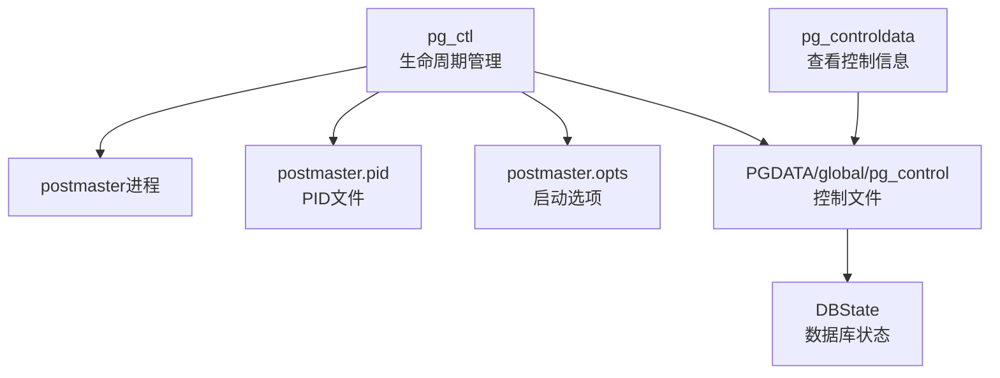
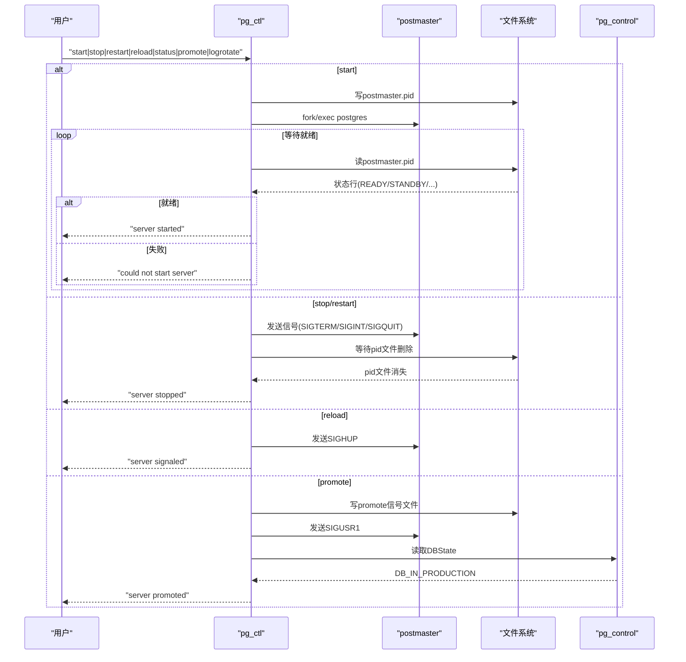
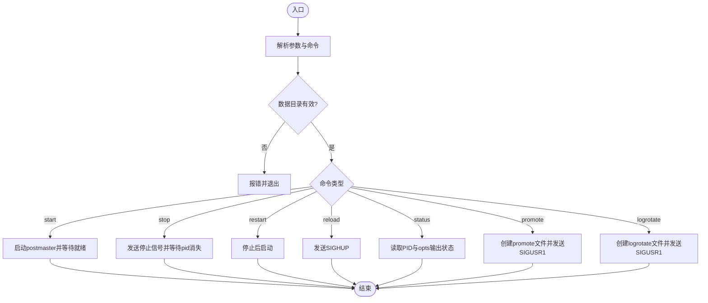
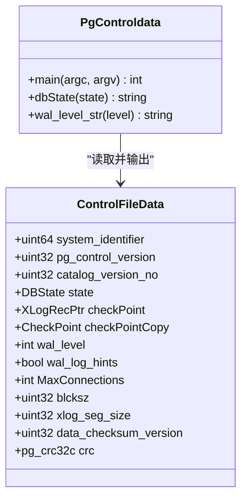
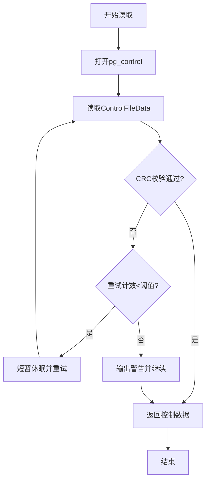
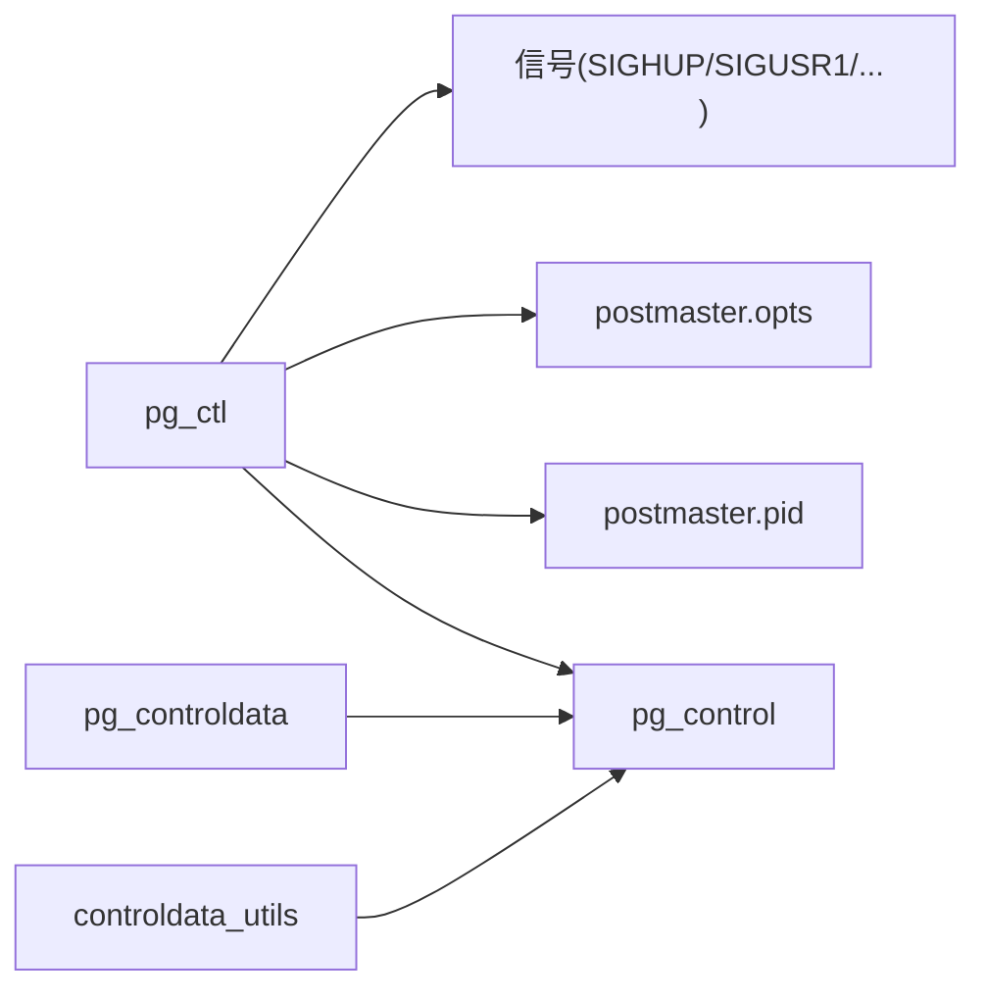

# 服务器管理工具

<cite>
**本文引用的文件**
- [pg_ctl.c](file://src/bin/pg_ctl/pg_ctl.c)
- [pg_controldata.c](file://src/bin/pg_controldata/pg_controldata.c)
- [controldata_utils.c](file://src/common/controldata_utils.c)
- [pg_control.h](file://src/include/catalog/pg_control.h)
</cite>

## 目录
1. [简介](#简介)
2. [项目结构](#项目结构)
3. [核心组件](#核心组件)
4. [架构总览](#架构总览)
5. [详细组件分析](#详细组件分析)
6. [依赖关系分析](#依赖关系分析)
7. [性能与可靠性考量](#性能与可靠性考量)
8. [故障排查指南](#故障排查指南)
9. [结论](#结论)
10. [附录：常用运维命令示例](#附录：常用运维命令示例)

## 简介
本文件面向PostgreSQL的服务器管理工具，重点覆盖以下两个命令行工具：
- pg_ctl：用于数据库实例的生命周期管理（初始化、启动、停止、重启、重载配置、状态检查、主备切换、日志轮转等）。
- pg_controldata：用于读取并展示数据目录中的控制文件信息，辅助诊断与恢复。

文档将解释这些工具的功能、输出格式、错误处理机制，并提供常见运维场景的命令示例与排错建议。

## 项目结构
围绕服务器管理的代码主要分布在以下位置：
- src/bin/pg_ctl/pg_ctl.c：pg_ctl的主实现，负责解析参数、调用后端进程、发送信号、等待状态变化等。
- src/bin/pg_controldata/pg_controldata.c：pg_controldata的主实现，读取并打印pg_control文件内容。
- src/common/controldata_utils.c：前后端共享的控制文件读取与更新逻辑。
- src/include/catalog/pg_control.h：控制文件结构与数据库状态枚举定义。

图表来源
- [pg_ctl.c:1450-1758](file://src/bin/pg_ctl/pg_ctl.c#L1450-L1758)
- [pg_controldata.c:88-339](file://src/bin/pg_controldata/pg_controldata.c#L88-L339)
- [controldata_utils.c:50-173](file://src/common/controldata_utils.c#L50-L173)
- [pg_control.h:87-96](file://src/include/catalog/pg_control.h#L87-L96)

章节来源
- [pg_ctl.c:1450-1758](file://src/bin/pg_ctl/pg_ctl.c#L1450-L1758)
- [pg_controldata.c:88-339](file://src/bin/pg_controldata/pg_controldata.c#L88-L339)

## 核心组件
- pg_ctl
  - 功能：初始化数据库、启动/停止/重启实例、重载配置、查询状态、触发主备切换、日志轮转、向指定进程发送信号。
  - 关键行为：通过PID文件定位postmaster；通过postmaster.opts读取上次启动参数；通过控制文件判断数据库状态；使用信号与文件进行进程间通信。
- pg_controldata
  - 功能：读取PGDATA/global/pg_control并输出关键信息（版本、系统标识、WAL设置、检查点信息、最大连接数、块大小等），用于诊断与恢复。
- 控制文件工具
  - 提供安全读取与更新pg_control的逻辑，包含CRC校验、字节序检查、原子写入等。

章节来源
- [pg_ctl.c:1450-1758](file://src/bin/pg_ctl/pg_ctl.c#L1450-L1758)
- [pg_controldata.c:88-339](file://src/bin/pg_controldata/pg_controldata.c#L88-L339)
- [controldata_utils.c:50-173](file://src/common/controldata_utils.c#L50-L173)

## 架构总览
pg_ctl作为前端控制程序，通过文件系统与信号机制与postmaster交互：
- 启动：fork/exec postgres进程，写postmaster.pid，轮询状态直到就绪或失败。
- 停止/重启：根据模式发送不同信号（smart/fast/immediate），等待pid文件消失或超时。
- 重载：发送SIGHUP使postmaster重新加载配置。
- 主备切换：创建promote信号文件并发送SIGUSR1，等待数据库进入生产状态。
- 日志轮转：创建logrotate信号文件并发送SIGUSR1。
- 状态检查：读取postmaster.pid与postmaster.opts，输出运行信息与启动参数。

pg_controldata直接读取pg_control文件，计算并验证CRC，输出控制信息。

图表来源
- [pg_ctl.c:358-520](file://src/bin/pg_ctl/pg_ctl.c#L358-L520)
- [pg_ctl.c:829-981](file://src/bin/pg_ctl/pg_ctl.c#L829-L981)
- [pg_ctl.c:1020-1095](file://src/bin/pg_ctl/pg_ctl.c#L1020-L1095)
- [pg_ctl.c:1101-1151](file://src/bin/pg_ctl/pg_ctl.c#L1101-L1151)
- [pg_ctl.c:1180-1233](file://src/bin/pg_ctl/pg_ctl.c#L1180-L1233)
- [pg_ctl.c:1431-1447](file://src/bin/pg_ctl/pg_ctl.c#L1431-L1447)

## 详细组件分析

### pg_ctl：生命周期管理与信号控制
- 启动流程
  - 解析参数（数据目录、日志、超时、是否等待等）。
  - 查找postgres可执行文件，必要时从postmaster.opts读取上次启动参数。
  - fork子进程exec postgres，设置会话组与环境变量。
  - 轮询postmaster.pid的状态行，直到“ready”或“standby”，或在超时/进程退出时报告失败。
- 停止/重启流程
  - 根据模式选择信号：smart→SIGTERM，fast→SIGINT，immediate→SIGQUIT。
  - 若存在backup_label且非归档恢复，提示在线备份模式下smart关闭会等待完成。
  - 等待pid文件消失或超时，失败时给出快速关闭建议。
- 重载配置
  - 发送SIGHUP，不等待完成。
- 主备切换
  - 仅当数据库处于归档恢复（standby）模式时允许。
  - 创建promote信号文件并发送SIGUSR1，等待DBState变为生产状态。
- 日志轮转
  - 创建logrotate信号文件并发送SIGUSR1。
- 状态检查
  - 读取postmaster.pid与postmaster.opts，输出当前运行信息与启动参数。
- 错误处理
  - 对目录不存在、版本文件缺失、PID文件无效、无法打开/读取文件等情况输出明确错误并返回相应退出码。
  - 支持环境变量PGCTLTIMEOUT调整等待时间。

图表来源
- [pg_ctl.c:1450-1758](file://src/bin/pg_ctl/pg_ctl.c#L1450-L1758)
- [pg_ctl.c:358-520](file://src/bin/pg_ctl/pg_ctl.c#L358-L520)
- [pg_ctl.c:829-981](file://src/bin/pg_ctl/pg_ctl.c#L829-L981)
- [pg_ctl.c:1020-1095](file://src/bin/pg_ctl/pg_ctl.c#L1020-L1095)
- [pg_ctl.c:1101-1151](file://src/bin/pg_ctl/pg_ctl.c#L1101-L1151)
- [pg_ctl.c:1180-1233](file://src/bin/pg_ctl/pg_ctl.c#L1180-L1233)

章节来源
- [pg_ctl.c:1450-1758](file://src/bin/pg_ctl/pg_ctl.c#L1450-L1758)
- [pg_ctl.c:358-520](file://src/bin/pg_ctl/pg_ctl.c#L358-L520)
- [pg_ctl.c:829-981](file://src/bin/pg_ctl/pg_ctl.c#L829-L981)
- [pg_ctl.c:1020-1095](file://src/bin/pg_ctl/pg_ctl.c#L1020-L1095)
- [pg_ctl.c:1101-1151](file://src/bin/pg_ctl/pg_ctl.c#L1101-L1151)
- [pg_ctl.c:1180-1233](file://src/bin/pg_ctl/pg_ctl.c#L1180-L1233)

### pg_controldata：控制文件信息查看
- 功能
  - 读取PGDATA/global/pg_control，计算并校验CRC。
  - 输出数据库版本、系统标识、数据库状态、最近检查点位置与时间线、WAL相关设置、最大连接数、块大小、TOAST chunk大小、数据页校验和版本等。
- 输出格式
  - 每行以键值形式呈现，便于脚本解析与人工阅读。
  - 若CRC不一致或WAL段大小非法，会输出警告并提示结果不可信。
- 错误处理
  - 无法打开/读取文件、WAL段大小非法、字节序不匹配等情况会输出错误或警告并退出。

图表来源
- [pg_control.h:102-231](file://src/include/catalog/pg_control.h#L102-L231)
- [pg_controldata.c:88-339](file://src/bin/pg_controldata/pg_controldata.c#L88-L339)

章节来源
- [pg_controldata.c:88-339](file://src/bin/pg_controldata/pg_controldata.c#L88-L339)
- [pg_control.h:87-96](file://src/include/catalog/pg_control.h#L87-L96)
- [pg_control.h:102-231](file://src/include/catalog/pg_control.h#L102-L231)

### 控制文件工具：读写与一致性保障
- 读取
  - 打开PGDATA/global/pg_control，读取ControlFileData结构。
  - 计算CRC并与文件中存储的crc比较，确保完整性。
  - 在并发写入场景下，前端会重试有限次数以避免读到部分更新的数据。
  - 检查字节序，防止跨平台不兼容。
- 更新
  - 重算CRC，按固定大小写入pg_control，必要时fsync确保持久化。
  - 在前后端分别有错误处理策略，前端致命错误直接退出，后端PANIC。

图表来源
- [controldata_utils.c:50-173](file://src/common/controldata_utils.c#L50-L173)

章节来源
- [controldata_utils.c:50-173](file://src/common/controldata_utils.c#L50-L173)

## 依赖关系分析
- pg_ctl依赖
  - 文件系统：postmaster.pid、postmaster.opts、PG_VERSION、backup_label、promote、logrotate。
  - 控制文件：通过get_controlfile读取DBState。
  - 信号机制：向postmaster发送SIGTERM/SIGINT/SIGQUIT/SIGHUP/SIGUSR1。
- pg_controldata依赖
  - 控制文件：读取并输出pg_control内容。
  - 公共工具：controldata_utils提供读取与CRC校验。
- 控制文件工具
  - 前后端共享逻辑，保证一致性与安全性。

图表来源
- [pg_ctl.c:1450-1758](file://src/bin/pg_ctl/pg_ctl.c#L1450-L1758)
- [pg_controldata.c:88-339](file://src/bin/pg_controldata/pg_controldata.c#L88-L339)
- [controldata_utils.c:50-173](file://src/common/controldata_utils.c#L50-L173)

章节来源
- [pg_ctl.c:1450-1758](file://src/bin/pg_ctl/pg_ctl.c#L1450-L1758)
- [pg_controldata.c:88-339](file://src/bin/pg_controldata/pg_controldata.c#L88-L339)
- [controldata_utils.c:50-173](file://src/common/controldata_utils.c#L50-L173)

## 性能与可靠性考量
- 启动等待
  - 默认等待时间可通过环境变量PGCTLTIMEOUT或-t参数调整，避免长时间阻塞。
  - 轮询频率为每秒多次，兼顾响应与开销。
- 停止模式
  - smart模式优雅关闭，可能因在线备份而延迟；fast模式立即断开会话；immediate模式不完成关闭，重启需恢复。
- 控制文件一致性
  - CRC校验与重试机制降低并发写入导致的读取不一致风险。
  - 原子写入与fsync确保控制文件更新的持久性。
- 权限与安全
  - pg_ctl禁止以root运行，避免潜在安全风险。
  - 基于PGDATA权限设置umask，确保文件创建的安全模式。

[本节为通用指导，不直接分析具体文件]

## 故障排查指南
- 启动失败
  - 检查数据目录是否存在、PG_VERSION是否存在、postmaster.pid是否被占用。
  - 查看日志输出（-l指定日志文件或系统日志），确认postgres进程是否成功启动。
  - 若启动超时，增加PGCTLTIMEOUT或-t参数。
- 停止/重启失败
  - 确认PID文件存在且可读；检查是否有单用户进程阻止操作。
  - 若smart模式未退出，考虑使用-fast模式或检查在线备份状态。
- 主备切换失败
  - 确认数据库处于归档恢复模式；检查promote信号文件是否创建成功。
  - 观察DBState是否变为生产状态。
- 控制文件异常
  - pg_controldata输出CRC警告或WAL段大小非法时，表明控制文件损坏或不兼容，需谨慎处理。
  - 检查字节序与版本兼容性。

章节来源
- [pg_ctl.c:164-221](file://src/bin/pg_ctl/pg_ctl.c#L164-L221)
- [pg_ctl.c:829-981](file://src/bin/pg_ctl/pg_ctl.c#L829-L981)
- [pg_ctl.c:1020-1095](file://src/bin/pg_ctl/pg_ctl.c#L1020-L1095)
- [pg_controldata.c:168-189](file://src/bin/pg_controldata/pg_controldata.c#L168-L189)
- [controldata_utils.c:141-173](file://src/common/controldata_utils.c#L141-L173)

## 结论
pg_ctl与pg_controldata构成了PostgreSQL服务器生命周期管理与诊断的核心工具集。前者通过信号与文件机制实现对postmaster的精细控制，后者通过读取控制文件提供关键的运行时与恢复信息。结合合理的等待策略、停止模式与错误处理，可有效支撑日常运维与故障恢复任务。

[本节为总结，不直接分析具体文件]

## 附录：常用运维命令示例
以下为典型运维场景的命令示例（请根据实际环境替换路径与参数）：
- 初始化数据库
  - pg_ctl initdb -D /path/to/data
- 启动实例
  - pg_ctl start -D /path/to/data -l /path/to/logfile -t 120
- 停止实例（优雅关闭）
  - pg_ctl stop -D /path/to/data -m smart
- 停止实例（快速关闭）
  - pg_ctl stop -D /path/to/data -m fast
- 重启实例
  - pg_ctl restart -D /path/to/data -m fast
- 重载配置
  - pg_ctl reload -D /path/to/data
- 检查状态
  - pg_ctl status -D /path/to/data
- 主备切换
  - pg_ctl promote -D /path/to/data -t 60
- 日志轮转
  - pg_ctl logrotate -D /path/to/data
- 查看控制文件信息
  - pg_controldata -D /path/to/data

注意：
- 所有命令需在非root用户下执行。
- 若存在在线备份，smart关闭会等待pg_stop_backup完成后才退出。
- 可通过PGCTLTIMEOUT或-t调整等待时间。

[本节为概念性说明，不直接分析具体文件]