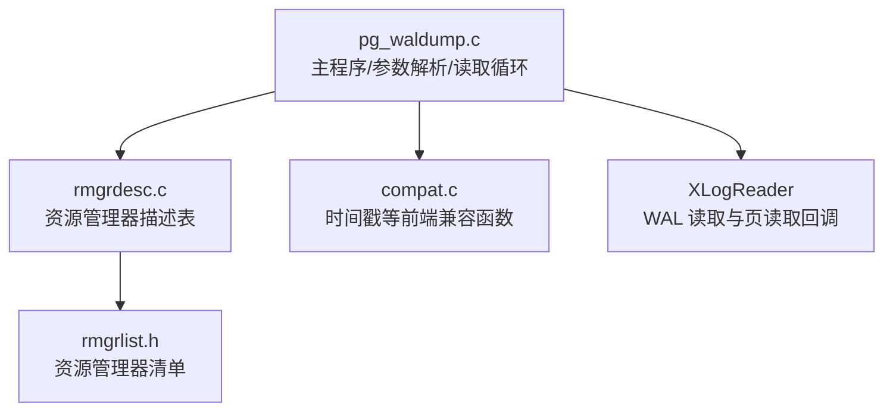
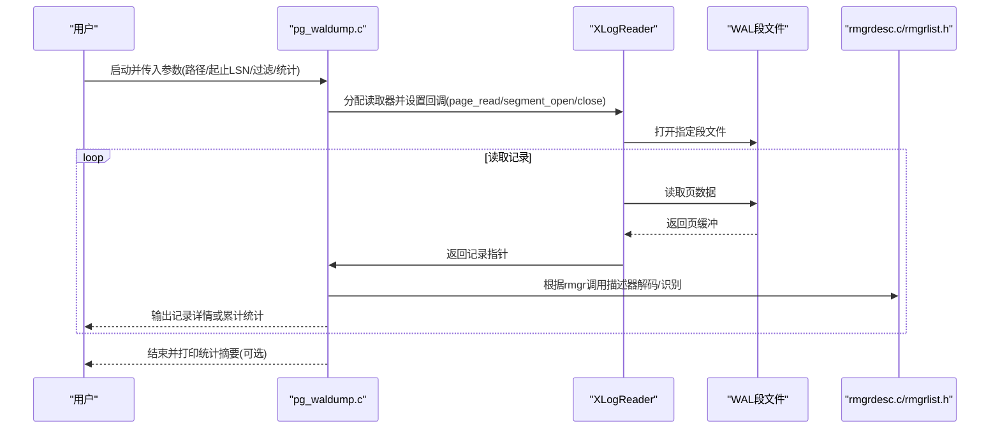
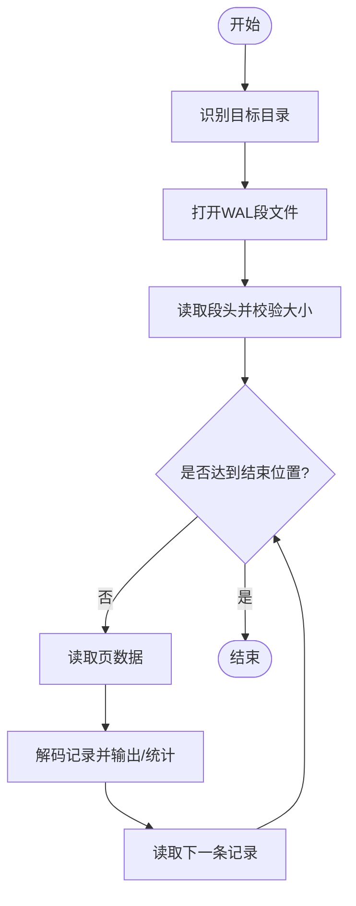
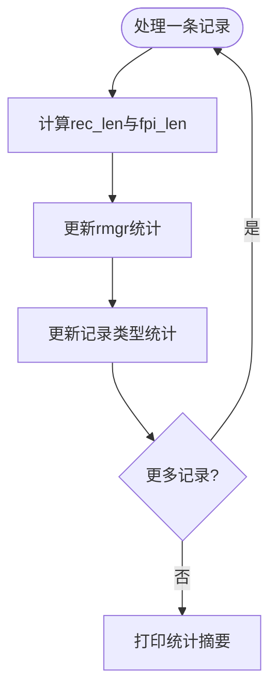
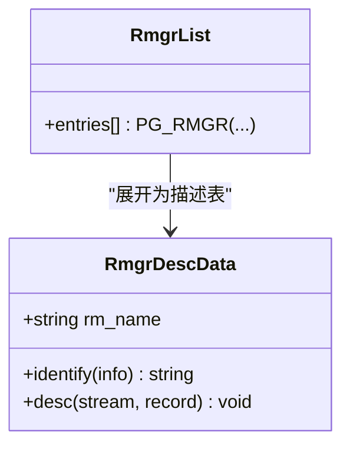
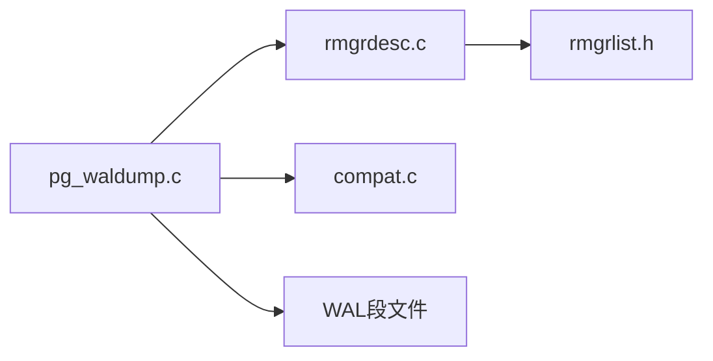

# 诊断调试工具

<cite>
**本文档引用的文件**
- [pg_waldump.c](file://src/bin/pg_waldump/pg_waldump.c)
- [rmgrdesc.c](file://src/bin/pg_waldump/rmgrdesc.c)
- [compat.c](file://src/bin/pg_waldump/compat.c)
- [rmgrlist.h](file://src/include/access/rmgrlist.h)
</cite>

## 目录
1. [简介](#简介)
2. [项目结构](#项目结构)
3. [核心组件](#核心组件)
4. [架构总览](#架构总览)
5. [详细组件分析](#详细组件分析)
6. [依赖关系分析](#依赖关系分析)
7. [性能考量](#性能考量)
8. [故障排查指南](#故障排查指南)
9. [结论](#结论)
10. [附录](#附录)

## 简介
本文件面向数据库管理员与高级用户，系统性介绍 PostgreSQL 的 WAL（预写式日志）诊断工具 pg_waldump。内容涵盖：WAL 日志解析、事务追踪、数据变更分析等高级诊断能力；参数选项与输出格式说明；以及基于真实场景的故障定位与调优实践。通过理解 pg_waldump 的工作机制与输出语义，DBA 可快速定位异常写入、评估备份块影响、分析资源管理器（rmgr）行为，从而进行问题定位与系统调优。

## 项目结构
pg_waldump 位于前端工具目录，核心由以下文件组成：
- pg_waldump.c：主程序入口、参数解析、WAL 读取与记录显示/统计、跟随模式实现
- rmgrdesc.c：资源管理器描述表构建，用于识别与解码不同 rmgr 的记录
- compat.c：前端兼容实现（如时间戳转换），避免对后端基础设施的强依赖
- rmgrlist.h：资源管理器清单，定义支持的 rmgr 集合及其标识

图表来源
- [pg_waldump.c:748-1127](file://src/bin/pg_waldump/pg_waldump.c#L748-L1127)
- [rmgrdesc.c:29-34](file://src/bin/pg_waldump/rmgrdesc.c#L29-L34)
- [rmgrlist.h:27-42](file://src/include/access/rmgrlist.h#L27-L42)
- [compat.c:25-64](file://src/bin/pg_waldump/compat.c#L25-L64)

章节来源
- [pg_waldump.c:748-1127](file://src/bin/pg_waldump/pg_waldump.c#L748-L1127)
- [rmgrdesc.c:29-34](file://src/bin/pg_waldump/rmgrdesc.c#L29-L34)
- [rmgrlist.h:27-42](file://src/include/access/rmgrlist.h#L27-L42)
- [compat.c:25-64](file://src/bin/pg_waldump/compat.c#L25-L64)

## 核心组件
- 参数解析与配置：支持 quiet、bkp-details、start/end、follow、limit、path、rmgr、timeline、xid、stats 等选项，控制输出粒度、过滤条件与统计模式
- WAL 段定位与打开：自动在多种路径下查找 WAL 段文件，解析段大小并建立读取上下文
- 记录读取与解码：基于 XLogReader 的 page_read/segment_open/segment_close 回调，逐条读取并调用 rmgr 描述器解码
- 显示与统计：按 rmgr 与记录类型统计计数、记录长度、FPI（Full Page Image）长度及占比，支持 per-record 或 per-rmgr 汇总
- 过滤器：按 rmgr 名称与事务 ID 过滤记录，便于聚焦特定业务或事务链
- 跟随模式：到达末尾后持续重试，适合实时观察 WAL 生成

章节来源
- [pg_waldump.c:718-746](file://src/bin/pg_waldump/pg_waldump.c#L718-L746)
- [pg_waldump.c:800-930](file://src/bin/pg_waldump/pg_waldump.c#L800-L930)
- [pg_waldump.c:1040-1127](file://src/bin/pg_waldump/pg_waldump.c#L1040-L1127)

## 架构总览
pg_waldump 作为独立前端工具，复用后端 WAL 读取接口，通过自定义回调完成段打开、关闭与页读取。资源管理器描述表提供各 rmgr 的解码与识别逻辑，使工具能通用化地展示各类 WAL 记录。

图表来源
- [pg_waldump.c:1040-1127](file://src/bin/pg_waldump/pg_waldump.c#L1040-L1127)
- [rmgrdesc.c:29-34](file://src/bin/pg_waldump/rmgrdesc.c#L29-L34)
- [rmgrlist.h:27-42](file://src/include/access/rmgrlist.h#L27-L42)

## 详细组件分析

### 参数与输出格式
- 关键参数
  - --bkp-details：输出备份块详细信息（含压缩、空洞信息）
  - --start/--end：指定起始与结束 LSN
  - --follow：到达末尾后持续重试，适合实时跟踪
  - --limit：限制输出记录数
  - --path：指定 WAL 段所在目录
  - --quiet：仅输出错误
  - --rmgr：按资源管理器过滤，支持 list 列出所有 rmgr
  - --timeline：指定时间线
  - --xid：按事务 ID 过滤
  - --stats[=record|rmgr]：输出统计而非记录，可选择按记录或 rmgr 维度
- 输出字段
  - rmgr：资源管理器名称
  - len(rec/tot)：记录长度与总长度
  - tx：事务 ID
  - lsn/prev：当前与上一条记录的 LSN
  - desc：记录类型描述
  - blkref：块引用（rel/fork/blk），可选 FPW 标记
  - 统计模式：计数、记录长度、FPI 长度、合计长度及百分比

章节来源
- [pg_waldump.c:718-746](file://src/bin/pg_waldump/pg_waldump.c#L718-L746)
- [pg_waldump.c:455-562](file://src/bin/pg_waldump/pg_waldump.c#L455-L562)
- [pg_waldump.c:567-716](file://src/bin/pg_waldump/pg_waldump.c#L567-L716)

### 段定位与读取流程
- 目标目录识别：优先使用显式路径，其次尝试当前目录、./pg_wal、$PGDATA/pg_wal
- 段大小校验：从 WAL 头读取段大小并验证为 2 的幂且在允许范围内
- 跟随模式：段切换时短暂等待新文件出现，避免竞态导致失败
- 页读取：通过 WALRead 获取页数据，遇到错误时报告具体偏移与错误码

图表来源
- [pg_waldump.c:234-277](file://src/bin/pg_waldump/pg_waldump.c#L234-L277)
- [pg_waldump.c:279-328](file://src/bin/pg_waldump/pg_waldump.c#L279-L328)
- [pg_waldump.c:330-374](file://src/bin/pg_waldump/pg_waldump.c#L330-L374)
- [pg_waldump.c:1040-1127](file://src/bin/pg_waldump/pg_waldump.c#L1040-L1127)

章节来源
- [pg_waldump.c:234-277](file://src/bin/pg_waldump/pg_waldump.c#L234-L277)
- [pg_waldump.c:279-328](file://src/bin/pg_waldump/pg_waldump.c#L279-L328)
- [pg_waldump.c:330-374](file://src/bin/pg_waldump/pg_waldump.c#L330-L374)
- [pg_waldump.c:1040-1127](file://src/bin/pg_waldump/pg_waldump.c#L1040-L1127)

### 记录统计与 FPI 分析
- 记录长度拆分：总长度减去 FPI 长度得到实际记录负载
- 统计维度：按 rmgr 与记录类型（xl_info 高四位）聚合计数、记录长度、FPI 长度与合计长度
- 百分比计算：行内百分比相对列总计，底部汇总行百分比相对行总计

图表来源
- [pg_waldump.c:376-450](file://src/bin/pg_waldump/pg_waldump.c#L376-L450)
- [pg_waldump.c:605-716](file://src/bin/pg_waldump/pg_waldump.c#L605-L716)

章节来源
- [pg_waldump.c:376-450](file://src/bin/pg_waldump/pg_waldump.c#L376-L450)
- [pg_waldump.c:605-716](file://src/bin/pg_waldump/pg_waldump.c#L605-L716)

### 资源管理器描述与兼容性
- 资源管理器清单：通过 rmgrlist.h 声明支持的 rmgr 集合，顺序决定 ID 值
- 描述表构建：rmgrdesc.c 将清单展开为描述表，供工具识别与解码
- 前端兼容：compat.c 提供时间戳转换等函数，避免对后端基础设施的强依赖

图表来源
- [rmgrlist.h:27-42](file://src/include/access/rmgrlist.h#L27-L42)
- [rmgrdesc.c:29-34](file://src/bin/pg_waldump/rmgrdesc.c#L29-L34)
- [compat.c:25-64](file://src/bin/pg_waldump/compat.c#L25-L64)

章节来源
- [rmgrlist.h:27-42](file://src/include/access/rmgrlist.h#L27-L42)
- [rmgrdesc.c:29-34](file://src/bin/pg_waldump/rmgrdesc.c#L29-L34)
- [compat.c:25-64](file://src/bin/pg_waldump/compat.c#L25-L64)

## 依赖关系分析
- 模块耦合
  - pg_waldump.c 依赖 rmgrdesc.c 提供的描述表以解码记录
  - rmgrdesc.c 依赖 rmgrlist.h 的资源管理器清单
  - pg_waldump.c 通过 XLogReader 接口与底层 WAL 文件交互
  - compat.c 提供前端兼容函数，降低对外部基础设施的依赖
- 外部依赖
  - 文件系统访问（段文件打开/读取）
  - 标准库与平台时间 API（时间戳格式化）

图表来源
- [pg_waldump.c:748-1127](file://src/bin/pg_waldump/pg_waldump.c#L748-L1127)
- [rmgrdesc.c:29-34](file://src/bin/pg_waldump/rmgrdesc.c#L29-L34)
- [rmgrlist.h:27-42](file://src/include/access/rmgrlist.h#L27-L42)
- [compat.c:25-64](file://src/bin/pg_waldump/compat.c#L25-L64)

章节来源
- [pg_waldump.c:748-1127](file://src/bin/pg_waldump/pg_waldump.c#L748-L1127)
- [rmgrdesc.c:29-34](file://src/bin/pg_waldump/rmgrdesc.c#L29-L34)
- [rmgrlist.h:27-42](file://src/include/access/rmgrlist.h#L27-L42)
- [compat.c:25-64](file://src/bin/pg_waldump/compat.c#L25-L64)

## 性能考量
- 大文件扫描：建议结合 --start 与 --end 精确限定范围，减少不必要 I/O
- 统计模式：--stats 仅在需要时启用，避免大量记录输出的开销
- 跟随模式：--follow 会周期性重试，注意 CPU 与 I/O 占用
- FPI 影响：当 FPI 比例较高时，WAL 体积显著增大，需关注磁盘空间与归档策略
- 过滤优化：使用 --rmgr 与 --xid 缩小关注面，提高定位效率

## 故障排查指南
- 无法找到 WAL 文件
  - 现象：提示找不到文件或目录
  - 排查：确认 --path 指向正确目录；检查 $PGDATA/pg_wal 是否存在；确保权限可读
  - 参考：段定位与目录搜索逻辑
- 读取错误或段大小无效
  - 现象：读取失败或段大小不合法
  - 排查：检查 WAL 文件完整性；确认段大小是否为 2 的幂且在允许范围内
  - 参考：段大小校验与错误报告
- 记录解码失败
  - 现象：记录解码时报错
  - 排查：核对版本兼容性；检查 rmgr 描述表是否完整；必要时使用 --quiet 仅看错误
  - 参考：记录读取与错误处理
- 事务追踪困难
  - 现象：难以定位某事务相关的所有记录
  - 方法：使用 --xid 过滤；结合 --start 与 --end 限定范围；查看 prev LSN 串联事务链
  - 参考：事务 ID 过滤与记录链接
- 备份块过多导致 WAL 膨胀
  - 现象：FPI 占比高，WAL 体积增长快
  - 方法：分析 --stats 中 FPI 长度占比；检查热点页面更新频率；评估 checkpoint 与 wal_level 配置
  - 参考：FPI 长度计算与统计输出

章节来源
- [pg_waldump.c:234-277](file://src/bin/pg_waldump/pg_waldump.c#L234-L277)
- [pg_waldump.c:330-374](file://src/bin/pg_waldump/pg_waldump.c#L330-L374)
- [pg_waldump.c:1040-1127](file://src/bin/pg_waldump/pg_waldump.c#L1040-L1127)

## 结论
pg_waldump 提供了强大的 WAL 日志诊断能力，覆盖从基础解析到高级统计的全链路功能。通过合理选择参数与输出模式，DBA 可以高效定位异常写入、分析事务行为、评估 FPI 影响并进行系统调优。建议在生产环境中结合监控与日志采集，形成常态化的 WAL 健康检查与问题响应流程。

## 附录
- 常用命令示例（概念性说明）
  - 解析指定段的记录：指定路径与起止 LSN，输出人类可读记录
  - 统计 rmgr 分布：使用 --stats 查看各资源管理器的记录数量与大小占比
  - 跟踪特定事务：使用 --xid 过滤，结合 --follow 实时观察事务写入
  - 聚焦热点 rmgr：使用 --rmgr 筛选特定资源管理器，减少噪音
- 最佳实践
  - 明确目标：先确定问题域（如堆表、索引、事务），再选择相应 rmgr 与范围
  - 逐步收敛：从宽泛统计到精细记录，逐步缩小问题范围
  - 结合上下文：关联错误日志、慢查询与系统指标，综合判断根因