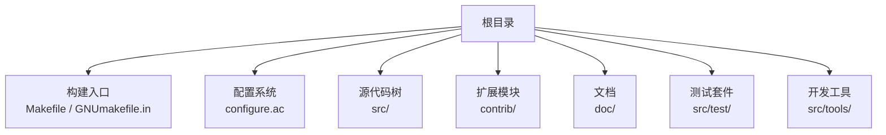
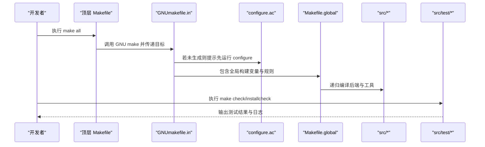
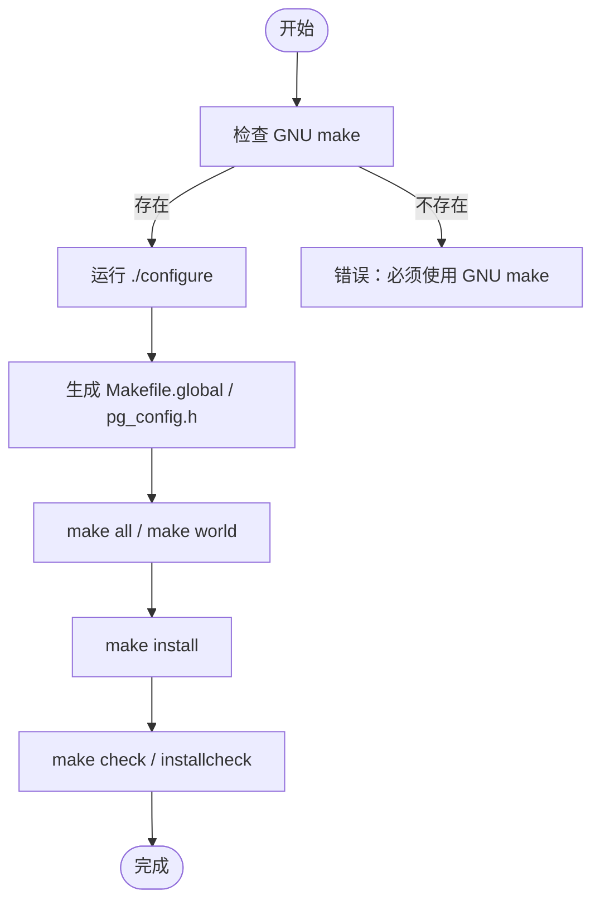
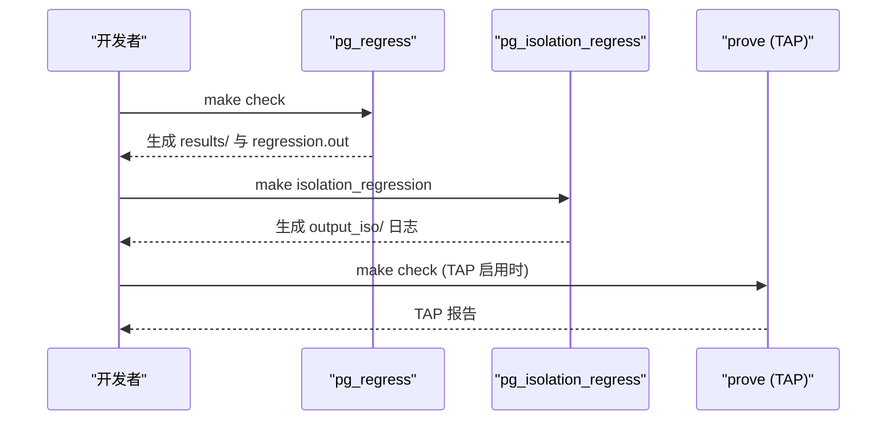
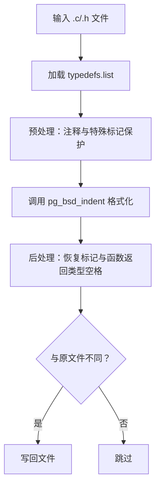
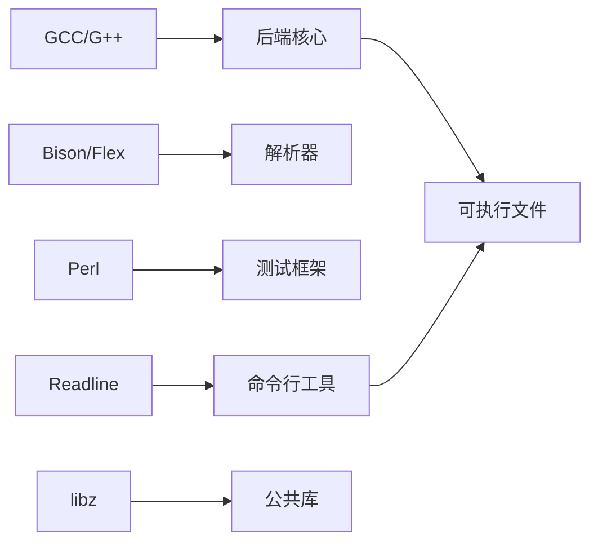
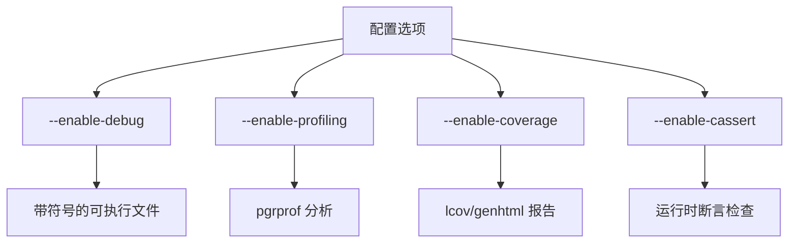

# 开发者指南

<cite>
**本文引用的文件**
- [README](file://README)
- [Makefile](file://Makefile)
- [GNUmakefile.in](file://GNUmakefile.in)
- [configure.ac](file://configure.ac)
- [build.sh](file://build.sh)
- [src/Makefile.global](file://src/Makefile.global)
- [src/test/README](file://src/test/README)
- [src/test/regress/README](file://src/test/regress/README)
- [src/tools/pgindent/pgindent](file://src/tools/pgindent/pgindent)
- [mydoc/requirement.md](file://mydoc/requirement.md)
- [mydoc/develop.md](file://mydoc/develop.md)
</cite>

## 目录
1. [简介](#简介)
2. [项目结构](#项目结构)
3. [核心组件](#核心组件)
4. [架构总览](#架构总览)
5. [详细组件分析](#详细组件分析)
6. [依赖关系分析](#依赖关系分析)
7. [性能与调试](#性能与调试)
8. [测试与质量保障](#测试与质量保障)
9. [代码规范与工具链](#代码规范与工具链)
10. [版本控制、审查与发布流程](#版本控制审查与发布流程)
11. [新功能开发最佳实践](#新功能开发最佳实践)
12. [故障排查](#故障排查)
13. [结论](#结论)

## 简介
Mini PostgreSQL（minipg）是基于 PostgreSQL 14.23 的裁剪版，目标是保留数据库内核的核心能力，将源码规模从百万行级精简到十万行左右，便于学习数据库内核。本项目提供完整的构建系统、测试框架和开发工具链，适合希望参与内核开发与学习的贡献者。

**章节来源**
- [README:1-6](file://README#L1-L6)
- [mydoc/requirement.md:1-6](file://mydoc/requirement.md#L1-L6)

## 项目结构
仓库采用分层组织：顶层 Makefile 负责引导 GNU make；configure.ac 定义配置选项与平台检测；src 下为后端核心、公共库、前端工具与接口；contrib 为可选扩展；doc 为文档；test 为回归与隔离测试；tools 包含代码格式化工具与辅助脚本。

**图示来源**
- [Makefile:17-42](file://Makefile#L17-L42)
- [GNUmakefile.in:1-45](file://GNUmakefile.in#L1-L45)
- [configure.ac:20-78](file://configure.ac#L20-L78)

**章节来源**
- [Makefile:17-42](file://Makefile#L17-L42)
- [GNUmakefile.in:1-45](file://GNUmakefile.in#L1-L45)
- [configure.ac:20-78](file://configure.ac#L20-L78)

## 核心组件
- 构建入口与递归规则：顶层 Makefile 强制使用 GNU make，并转发到 GNUmakefile.in；GNUmakefile.in 通过递归调用构建 src、config、contrib、doc 等子目录，并提供 world、install、check 等目标。
- 配置系统：configure.ac 定义编译器、特性开关（debug、coverage、profiling、dtrace）、块大小、WAL 块大小、默认端口等，生成 Makefile.global 与头文件。
- 全局构建变量：src/Makefile.global 集中定义安装路径、编译器标志、测试基础设施（pg_regress、isolation regress、TAP）、链接参数等。
- 快速构建脚本：build.sh 提供一键清理与配置示例，便于本地开发。

**章节来源**
- [Makefile:17-42](file://Makefile#L17-L42)
- [GNUmakefile.in:11-76](file://GNUmakefile.in#L11-L76)
- [configure.ac:162-203](file://configure.ac#L162-L203)
- [src/Makefile.global:22-49](file://src/Makefile.global#L22-L49)
- [build.sh:1-3](file://build.sh#L1-L3)

## 架构总览
下图展示从“开发者执行 make”到“生成可执行文件与运行测试”的整体流程，以及关键配置文件的作用。

**图示来源**
- [Makefile:17-42](file://Makefile#L17-L42)
- [GNUmakefile.in:11-76](file://GNUmakefile.in#L11-L76)
- [configure.ac:20-78](file://configure.ac#L20-L78)
- [src/Makefile.global:358-447](file://src/Makefile.global#L358-L447)

## 详细组件分析

### 构建系统与配置
- 强制 GNU make：顶层 Makefile 会查找 gmake/gnumake/make 并验证是否为 GNU make，否则报错。
- 配置项：
  - 调试与性能：--enable-debug、--enable-profiling、--enable-coverage（需要 gcov/lcov/genhtml）。
  - 平台与模板：仅支持 Linux 模板，自动选择 linux。
  - 存储参数：--with-blocksize、--with-wal-blocksize、--with-segsize。
  - 默认端口：--with-pgport。
  - 其他：--enable-dtrace、--enable-tap-tests、--with-readline、--with-systemd 等。
- 生成产物：Makefile.global、pg_config.h、pg_config_ext.h 等。

**图示来源**
- [Makefile:17-42](file://Makefile#L17-L42)
- [configure.ac:162-203](file://configure.ac#L162-L203)
- [src/Makefile.global:760-795](file://src/Makefile.global#L760-L795)

**章节来源**
- [Makefile:17-42](file://Makefile#L17-L42)
- [configure.ac:162-203](file://configure.ac#L162-L203)
- [src/Makefile.global:760-795](file://src/Makefile.global#L760-L795)

### 测试框架与执行
- 回归测试：基于 pg_regress，通过 make check 或 make installcheck 在临时实例中运行 SQL 用例与预期结果对比。
- 隔离测试：基于 pg_isolation_regress，用于并发行为与隔离级别验证。
- TAP 测试：当启用 --enable-tap-tests 时，通过 prove 运行 Perl TAP 测试套件。
- 测试基础设施：src/test/README 说明各子目录用途；regress/README 指向手册中的回归测试章节。

**图示来源**
- [src/Makefile.global:358-447](file://src/Makefile.global#L358-L447)
- [src/Makefile.global:629-655](file://src/Makefile.global#L629-L655)
- [src/test/README:1-51](file://src/test/README#L1-L51)
- [src/test/regress/README:1-4](file://src/test/regress/README#L1-L4)

**章节来源**
- [src/Makefile.global:358-447](file://src/Makefile.global#L358-L447)
- [src/Makefile.global:629-655](file://src/Makefile.global#L629-L655)
- [src/test/README:1-51](file://src/test/README#L1-L51)
- [src/test/regress/README:1-4](file://src/test/regress/README#L1-L4)

### 代码格式化与规范工具
- pgindent：统一 C/C++ 代码风格，基于 pg_bsd_indent，支持 typedefs 列表、排除模式、预/后处理逻辑。
- 建议：提交前运行 pgindent 确保风格一致，避免引入无关格式变更。

**图示来源**
- [src/tools/pgindent/pgindent:18-21](file://src/tools/pgindent/pgindent#L18-L21)
- [src/tools/pgindent/pgindent:201-256](file://src/tools/pgindent/pgindent#L201-L256)
- [src/tools/pgindent/pgindent:259-284](file://src/tools/pgindent/pgindent#L259-L284)
- [src/tools/pgindent/pgindent:405-433](file://src/tools/pgindent/pgindent#L405-L433)

**章节来源**
- [src/tools/pgindent/pgindent:18-21](file://src/tools/pgindent/pgindent#L18-L21)
- [src/tools/pgindent/pgindent:201-256](file://src/tools/pgindent/pgindent#L201-L256)
- [src/tools/pgindent/pgindent:259-284](file://src/tools/pgindent/pgindent#L259-L284)
- [src/tools/pgindent/pgindent:405-433](file://src/tools/pgindent/pgindent#L405-L433)

## 依赖关系分析
- 构建依赖：GNU make、GCC/G++、Bison/Flex、Perl、可选的 Readline、systemd、ICU、UUID、DTrace、gcov/lcov/genhtml。
- 运行时依赖：libz、readline、m（数学库），以及平台相关库。
- 测试依赖：pg_regress、pg_isolation_regress、prove（TAP）。

**图示来源**
- [src/Makefile.global:218-265](file://src/Makefile.global#L218-L265)
- [configure.ac:305-333](file://configure.ac#L305-L333)
- [configure.ac:760-773](file://configure.ac#L760-L773)

**章节来源**
- [src/Makefile.global:218-265](file://src/Makefile.global#L218-L265)
- [configure.ac:305-333](file://configure.ac#L305-L333)
- [configure.ac:760-773](file://configure.ac#L760-L773)

## 性能与调试
- 调试构建：--enable-debug 添加 -g 符号，便于 gdb 调试。
- 性能剖析：--enable-profiling 启用 -pg 收集调用图数据。
- 覆盖率：--enable-coverage 启用 gcov 与 lcov 生成覆盖率报告。
- 断言：--enable-cassert 启用 assert 检查，有助于发现内部不一致。
- 执行器指标：instrumentation 记录节点时间与缓冲/WAL 使用，可用于 EXPLAIN ANALYZE 与性能分析。

**图示来源**
- [configure.ac:162-191](file://configure.ac#L162-L191)
- [configure.ac:567-596](file://configure.ac#L567-L596)
- [src/include/pg_trace.h:1-17](file://src/include/pg_trace.h#L1-L17)
- [src/backend/executor/instrument.c:57-102](file://src/backend/executor/instrument.c#L57-L102)

**章节来源**
- [configure.ac:162-191](file://configure.ac#L162-L191)
- [configure.ac:567-596](file://configure.ac#L567-L596)
- [src/include/pg_trace.h:1-17](file://src/include/pg_trace.h#L1-L17)
- [src/backend/executor/instrument.c:57-102](file://src/backend/executor/instrument.c#L57-L102)

## 测试与质量保障
- 回归测试：使用 pg_regress 在 tmp_check 临时实例中运行 SQL 用例，比较 expected 与 results。
- 隔离测试：使用 pg_isolation_regress 验证并发场景下的隔离行为。
- TAP 测试：启用 --enable-tap-tests 后，通过 prove 运行 Perl TAP 测试。
- 推荐流程：
  - 修改功能后，编写或更新 SQL 用例与预期结果。
  - 运行 make check 与 make installcheck 确保兼容。
  - 对并发相关改动，补充隔离测试。

**章节来源**
- [src/Makefile.global:358-447](file://src/Makefile.global#L358-L447)
- [src/Makefile.global:629-655](file://src/Makefile.global#L629-L655)
- [src/test/README:1-51](file://src/test/README#L1-L51)
- [src/test/regress/README:1-4](file://src/test/regress/README#L1-L4)

## 代码规范与工具链
- 风格：统一使用 pgindent 格式化 C/C++ 代码，遵循 BSD indent 风格与项目 typedefs 列表。
- 警告与优化：默认开启 -Wall、-Wmissing-prototypes、-Wpointer-arith、-Werror=vla 等严格警告；根据编译器特性启用向量与循环展开优化。
- 编码约定：避免可变长数组（VLA），谨慎使用别名与浮点优化，保持跨平台一致性。
- 建议：
  - 提交前运行 pgindent 与 make check。
  - 新增 API 需补充原型与文档。
  - 避免引入不必要的第三方依赖。

**章节来源**
- [src/tools/pgindent/pgindent:18-21](file://src/tools/pgindent/pgindent#L18-L21)
- [src/Makefile.global:232-244](file://src/Makefile.global#L232-L244)
- [configure.ac:456-558](file://configure.ac#L456-L558)

## 版本控制、审查与发布流程
- 版本控制：建议使用 Git 进行分支管理，提交信息清晰描述变更动机与影响范围。
- 代码审查：
  - 提交前自检：pgindent、make check、必要时隔离测试。
  - 评审关注点：正确性、性能、兼容性、可维护性、测试覆盖。
- 发布流程：
  - 使用 make dist 打包源码。
  - 使用 make distcheck 验证打包完整性与安装/卸载流程。
  - 生成文档：make docs/html 或 make man。

**章节来源**
- [GNUmakefile.in:88-144](file://GNUmakefile.in#L88-L144)

## 新功能开发最佳实践
- 明确需求与边界：参考 mydoc/requirement.md 与 mydoc/develop.md，确认功能是否属于核心裁剪范围。
- 增量实现：
  - 先设计数据结构与接口，再实现核心逻辑。
  - 逐步添加单元测试与回归用例。
- 性能与稳定性：
  - 使用 instrumentation 与 EXPLAIN ANALYZE 评估计划与执行。
  - 在 debug/profiling/coverage 模式下定位热点与盲区。
- 代码质量：
  - 遵循 pgindent 风格，减少无关格式变更。
  - 保持向后兼容，必要时提供升级脚本或迁移策略。

**章节来源**
- [mydoc/requirement.md:1-6](file://mydoc/requirement.md#L1-L6)
- [mydoc/develop.md:1-1](file://mydoc/develop.md#L1-L1)
- [src/backend/executor/instrument.c:57-102](file://src/backend/executor/instrument.c#L57-L102)

## 故障排查
- 构建失败：
  - 确认已运行 ./configure 且使用 GNU make。
  - 检查依赖工具（gcc、bison、flex、perl）是否可用。
  - 查看 config.log 与 Makefile.global 中的编译器标志。
- 测试失败：
  - 检查 tmp_check 与 results/ 日志，定位失败的 SQL 用例。
  - 对于隔离测试，查看 output_iso/ 日志。
- 运行时问题：
  - 使用 --enable-debug 与 gdb 附加进程。
  - 使用 --enable-profiling 与 pgrprof 分析热点。
  - 使用 --enable-coverage 生成覆盖率报告，识别未覆盖路径。

**章节来源**
- [Makefile:17-42](file://Makefile#L17-L42)
- [src/Makefile.global:358-447](file://src/Makefile.global#L358-L447)
- [configure.ac:162-191](file://configure.ac#L162-L191)

## 结论
Mini PostgreSQL 提供了清晰的构建系统、完善的测试框架与实用的开发工具，适合学习与贡献数据库内核。建议贡献者遵循代码规范、完善测试覆盖、合理使用调试与性能分析工具，并在提交前进行完整自检与回归测试。通过渐进式开发与严格的审查流程，确保代码质量与项目演进的一致性。