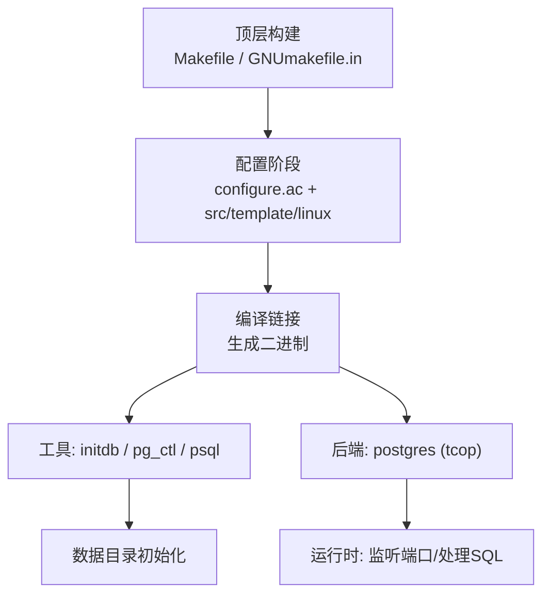
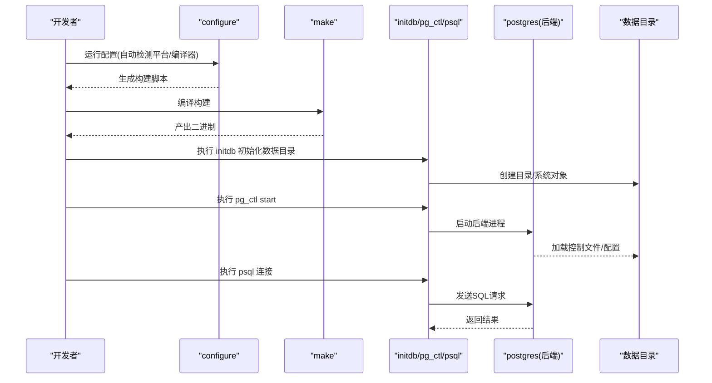
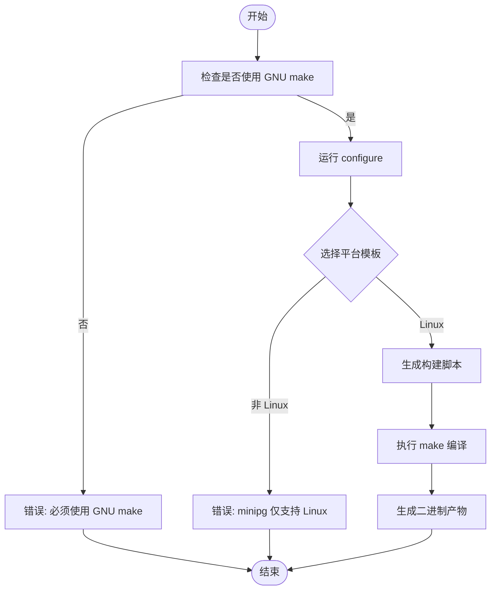
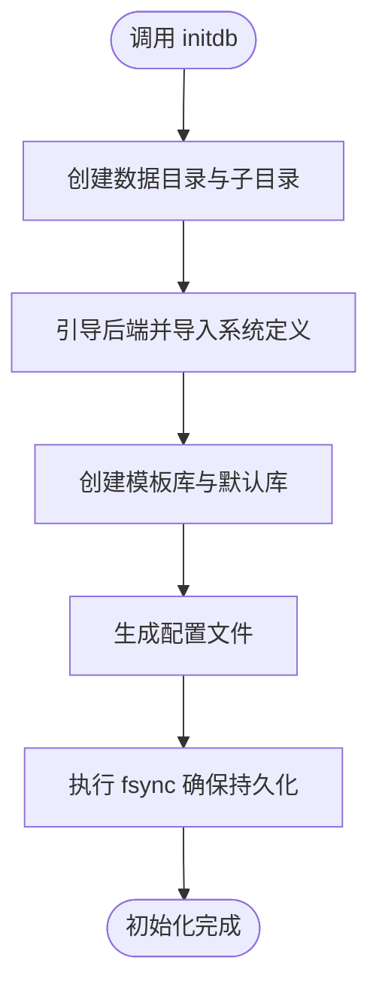
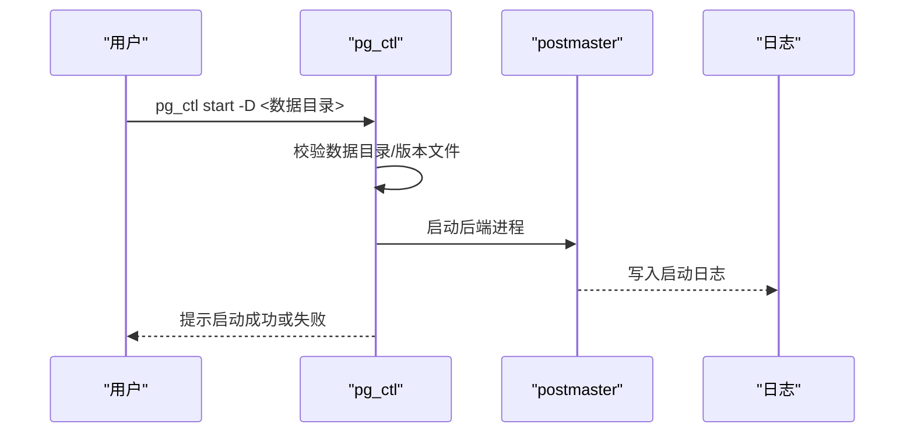
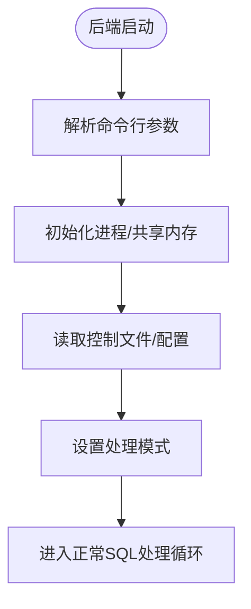
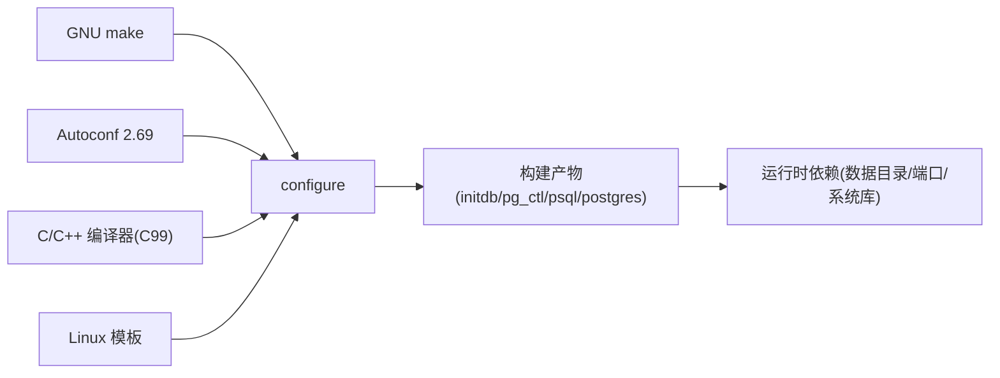

# 快速开始

<cite>
**本文引用的文件**
- [README](file://README)
- [Makefile](file://Makefile)
- [configure.ac](file://configure.ac)
- [build.sh](file://build.sh)
- [src/template/linux](file://src/template/linux)
- [GNUmakefile.in](file://GNUmakefile.in)
- [src/Makefile.global](file://src/Makefile.global)
- [src/bin/initdb/initdb.c](file://src/bin/initdb/initdb.c)
- [src/bin/pg_ctl/pg_ctl.c](file://src/bin/pg_ctl/pg_ctl.c)
- [src/backend/tcop/postgres.c](file://src/backend/tcop/postgres.c)
</cite>

## 目录
1. [简介](#简介)
2. [项目结构](#项目结构)
3. [核心组件](#核心组件)
4. [架构总览](#架构总览)
5. [详细组件分析](#详细组件分析)
6. [依赖关系分析](#依赖关系分析)
7. [性能注意事项](#性能注意事项)
8. [故障排除指南](#故障排除指南)
9. [结论](#结论)
10. [附录](#附录)

## 简介
Mini PostgreSQL（minipg）是基于 PostgreSQL 14.23 裁剪而成的轻量级数据库内核学习项目，目标是保留核心功能并将源码规模精简至约十万行。本快速开始指南帮助你在 Linux 环境下从零开始完成源码获取、编译构建、数据库初始化与启动，并通过 psql 执行简单查询，让你在最短时间内运行第一个 Mini PostgreSQL 实例。

## 项目结构
本项目采用标准的 PostgreSQL 源码树组织方式，关键目录与职责如下：
- 顶层构建入口：Makefile、GNUmakefile.in、configure.ac
- 平台模板：src/template/linux（Linux 专用编译选项）
- 工具链：src/bin/initdb（初始化）、src/bin/pg_ctl（启停控制）、src/bin/psql（客户端）
- 后端核心：src/backend（包括 tcop/postgres.c 等后端主流程）
- 公共库与头文件：src/common、src/include

**图表来源**
- [Makefile:1-42](file://Makefile#L1-L42)
- [configure.ac:62-76](file://configure.ac#L62-L76)
- [src/template/linux:1-40](file://src/template/linux#L1-L40)
- [GNUmakefile.in:1-200](file://GNUmakefile.in#L1-L200)

**章节来源**
- [Makefile:1-42](file://Makefile#L1-L42)
- [configure.ac:62-76](file://configure.ac#L62-L76)
- [src/template/linux:1-40](file://src/template/linux#L1-L40)
- [GNUmakefile.in:1-200](file://GNUmakefile.in#L1-L200)

## 核心组件
- 构建系统
  - Makefile：强制使用 GNU make，并转发到 GNUmakefile
  - configure.ac：检测编译器、平台模板、默认端口、块大小等；minipg 仅支持 Linux 模板
  - src/template/linux：为 Linux 设置编译标志（如 -D_GNU_SOURCE、-fPIC）
- 工具与后端
  - initdb：创建数据目录、系统表、默认数据库与模板库
  - pg_ctl：启动/停止/重启/重载服务器进程
  - psql：交互式 SQL 客户端
  - postgres（tcop/postgres.c）：后端主循环与参数解析、初始化流程

**章节来源**
- [Makefile:1-42](file://Makefile#L1-L42)
- [configure.ac:113-140](file://configure.ac#L113-L140)
- [src/template/linux:1-40](file://src/template/linux#L1-L40)
- [src/bin/initdb/initdb.c:1-200](file://src/bin/initdb/initdb.c#L1-L200)
- [src/bin/pg_ctl/pg_ctl.c:1-200](file://src/bin/pg_ctl/pg_ctl.c#L1-L200)
- [src/backend/tcop/postgres.c:3746-3811](file://src/backend/tcop/postgres.c#L3746-L3811)

## 架构总览
下图展示了从构建到运行的整体流程：配置阶段选择 Linux 模板并生成构建脚本；编译后得到 initdb、pg_ctl、psql 与后端程序；通过 initdb 初始化数据目录，再用 pg_ctl 启动服务器，最后用 psql 连接执行 SQL。

**图表来源**
- [configure.ac:62-76](file://configure.ac#L62-L76)
- [src/bin/initdb/initdb.c:1-200](file://src/bin/initdb/initdb.c#L1-L200)
- [src/bin/pg_ctl/pg_ctl.c:1-200](file://src/bin/pg_ctl/pg_ctl.c#L1-L200)
- [src/backend/tcop/postgres.c:3746-3811](file://src/backend/tcop/postgres.c#L3746-L3811)

## 详细组件分析

### 构建与配置
- 强制 GNU make：顶层 Makefile 会查找并使用 GNU make，否则报错
- 平台限制：configure.ac 中 minipg 仅接受 Linux 模板，其他平台将直接报错
- 默认端口：可通过 --with-pgport 指定默认监听端口（默认 5432），并在运行时可覆盖
- 块大小与 WAL 块大小：可在配置阶段调整，影响存储与日志行为

**图表来源**
- [Makefile:18-41](file://Makefile#L18-L41)
- [configure.ac:62-76](file://configure.ac#L62-L76)
- [configure.ac:113-140](file://configure.ac#L113-L140)
- [configure.ac:213-302](file://configure.ac#L213-L302)

**章节来源**
- [Makefile:18-41](file://Makefile#L18-L41)
- [configure.ac:62-76](file://configure.ac#L62-L76)
- [configure.ac:113-140](file://configure.ac#L113-L140)
- [configure.ac:213-302](file://configure.ac#L213-L302)

### 数据库初始化（initdb）
- 职责：创建数据目录、全局表、控制文件以及 template0/template1 和默认数据库
- 行为：以独立后端模式运行，批量导入系统定义，完成后进行一致性检查与同步

**图表来源**
- [src/bin/initdb/initdb.c:1-200](file://src/bin/initdb/initdb.c#L1-L200)

**章节来源**
- [src/bin/initdb/initdb.c:1-200](file://src/bin/initdb/initdb.c#L1-L200)

### 服务器启动与控制（pg_ctl）
- 职责：读取数据目录、校验版本/控制文件、启动 postmaster 并等待就绪
- 行为：支持 start/stop/restart/status/reload 等操作，输出日志便于排查

**图表来源**
- [src/bin/pg_ctl/pg_ctl.c:1-200](file://src/bin/pg_ctl/pg_ctl.c#L1-L200)

**章节来源**
- [src/bin/pg_ctl/pg_ctl.c:1-200](file://src/bin/pg_ctl/pg_ctl.c#L1-L200)

### 后端主流程（tcop/postgres.c）
- 职责：解析命令行参数、初始化进程上下文、加载控制文件、进入正常处理模式
- 关键点：支持调试级别、单会话模式、搜索路径等参数；在安全模式下忽略初始 --single

**图表来源**
- [src/backend/tcop/postgres.c:3746-3811](file://src/backend/tcop/postgres.c#L3746-L3811)
- [src/backend/tcop/postgres.c:4097-4143](file://src/backend/tcop/postgres.c#L4097-L4143)

**章节来源**
- [src/backend/tcop/postgres.c:3746-3811](file://src/backend/tcop/postgres.c#L3746-L3811)
- [src/backend/tcop/postgres.c:4097-4143](file://src/backend/tcop/postgres.c#L4097-L4143)

## 依赖关系分析
- 构建期依赖
  - GNU make：顶层 Makefile 强制要求
  - Autoconf 2.69：configure.ac 显式检查版本
  - C/C++ 编译器：需支持 C99
  - Linux 平台模板：仅支持 linux 模板
- 运行期依赖
  - 数据目录权限与磁盘空间
  - 默认端口 5432（可通过配置修改）
  - 必要的系统库（由 configure 自动探测）

**图表来源**
- [Makefile:18-41](file://Makefile#L18-L41)
- [configure.ac:20-25](file://configure.ac#L20-L25)
- [configure.ac:305-331](file://configure.ac#L305-L331)
- [configure.ac:62-76](file://configure.ac#L62-L76)

**章节来源**
- [Makefile:18-41](file://Makefile#L18-L41)
- [configure.ac:20-25](file://configure.ac#L20-L25)
- [configure.ac:305-331](file://configure.ac#L305-L331)
- [configure.ac:62-76](file://configure.ac#L62-L76)

## 性能注意事项
- 块大小与 WAL 块大小：在配置阶段可调整，影响存储与日志写入效率
- 共享内存与缓冲区：可通过后端参数调整 shared_buffers 等（参考测试配置中的保守设置）
- 并发与连接数：max_connections 可根据资源情况调优
- 最小化特性：minipg 已裁剪大量功能，适合学习与实验环境

[本节提供通用建议，不直接分析具体文件]

## 故障排除指南
- 未找到 GNU make
  - 现象：构建时报错提示需要使用 GNU make
  - 解决：安装并保证 gmake/gnumake/make 可用且为 GNU 版本
  - 依据：顶层 Makefile 会查找并强制使用 GNU make
- 不支持的平台
  - 现象：configure 报错 minipg 仅支持 Linux
  - 解决：在 Linux 上构建；如需在其他平台，需自行适配模板
- 编译器不支持 C99
  - 现象：configure 报 C 编译器不支持 C99
  - 解决：升级 GCC/Clang 或使用支持的编译器
- 默认端口冲突
  - 现象：启动时端口占用
  - 解决：通过 --with-pgport 或在配置文件中修改端口
- 数据目录无效或权限不足
  - 现象：pg_ctl 报告目录不存在或非数据库集群目录
  - 解决：确认数据目录存在且权限正确，重新执行 initdb
- 构建产物缺失或路径问题
  - 现象：找不到 initdb/pg_ctl/psql
  - 解决：确认构建目标完整，检查安装前缀与 PATH

**章节来源**
- [Makefile:18-41](file://Makefile#L18-L41)
- [configure.ac:62-76](file://configure.ac#L62-L76)
- [configure.ac:305-331](file://configure.ac#L305-L331)
- [configure.ac:113-140](file://configure.ac#L113-L140)
- [src/bin/pg_ctl/pg_ctl.c:164-200](file://src/bin/pg_ctl/pg_ctl.c#L164-L200)

## 结论
按照本指南，你可以在 Linux 环境中快速完成 Mini PostgreSQL 的构建、初始化与启动，并通过 psql 执行基本 SQL 操作。若遇到构建或启动问题，可参考故障排除部分定位常见原因。建议在熟悉基础流程后，进一步阅读源码与文档，探索更多内核机制与优化手段。

## 附录

### 环境要求与依赖项
- 操作系统：Linux（minipg 仅支持 Linux 模板）
- 构建工具：GNU make、Autoconf 2.69、支持 C99 的 C/C++ 编译器
- 可选：readline/libedit（用于 psql 交互体验）

**章节来源**
- [configure.ac:20-25](file://configure.ac#L20-L25)
- [configure.ac:305-331](file://configure.ac#L305-L331)
- [configure.ac:62-76](file://configure.ac#L62-L76)

### 安装与构建步骤（Linux）
- 获取源码：克隆仓库到本地目录
- 配置：运行 configure（可选择默认端口、块大小等）
- 构建：执行 make 编译
- 安装（可选）：执行 make install 安装到指定前缀
- 初始化：使用 initdb 创建数据目录与系统对象
- 启动：使用 pg_ctl 启动服务器
- 连接：使用 psql 连接并执行 SQL

示例命令（请根据实际路径替换）：
- 配置与构建
  - ./configure --prefix=/home/postgres/minipg --enable-debug
  - make
- 初始化与启动
  - mkdir -p /tmp/minipg_data
  - src/bin/initdb/initdb -D /tmp/minipg_data
  - src/bin/pg_ctl/pg_ctl -D /tmp/minipg_data start
- 连接与查询
  - src/bin/psql/psql -h localhost -p 5432 -U <用户名> -d postgres

注意：
- 若端口被占用，请在配置阶段通过 --with-pgport 指定新端口
- 若需要禁用文件系统同步以加速初始化，请参考 initdb 的后端选项（谨慎使用）

**章节来源**
- [build.sh:1-3](file://build.sh#L1-L3)
- [configure.ac:113-140](file://configure.ac#L113-L140)
- [src/bin/initdb/initdb.c:1-200](file://src/bin/initdb/initdb.c#L1-L200)
- [src/bin/pg_ctl/pg_ctl.c:1-200](file://src/bin/pg_ctl/pg_ctl.c#L1-L200)

### 基本数据库操作示例
- 创建数据库
  - 使用 psql 连接到默认数据库后执行 CREATE DATABASE 语句
- 创建表与插入数据
  - 使用 psql 执行 CREATE TABLE 与 INSERT 语句
- 查询数据
  - 使用 psql 执行 SELECT 语句查看结果

提示：
- 首次连接可使用默认超级用户与默认数据库名
- 若启用密码认证，请按配置提供凭据

[本节为通用操作说明，不直接分析具体文件]

### 常见问题速查
- 构建失败：检查 GNU make、Autoconf 版本与编译器支持
- 平台错误：确保在 Linux 上构建
- 端口冲突：修改默认端口或释放占用端口
- 数据目录错误：重新初始化并确保权限正确
- 无法连接：确认服务器已启动且端口/主机配置正确

**章节来源**
- [Makefile:18-41](file://Makefile#L18-L41)
- [configure.ac:62-76](file://configure.ac#L62-L76)
- [configure.ac:113-140](file://configure.ac#L113-L140)
- [src/bin/pg_ctl/pg_ctl.c:164-200](file://src/bin/pg_ctl/pg_ctl.c#L164-L200)