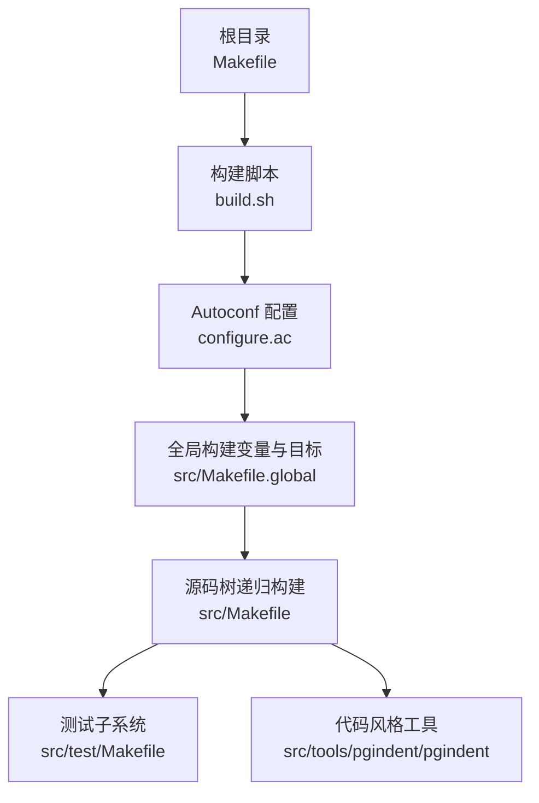
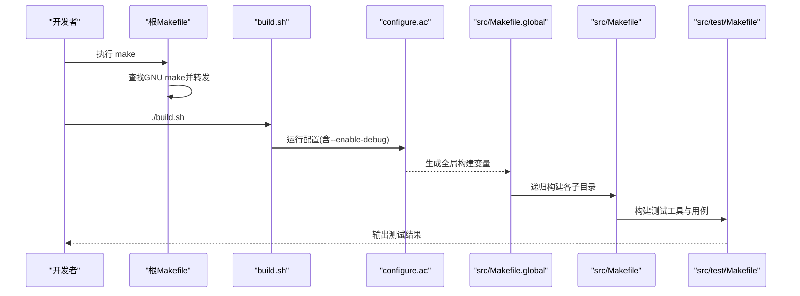
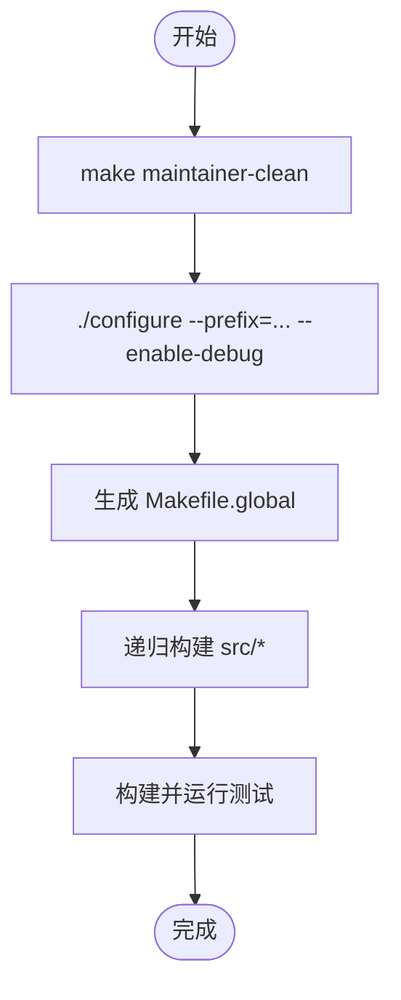
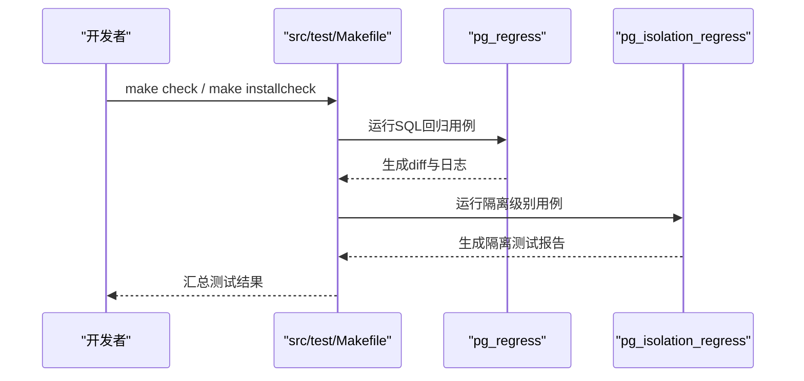
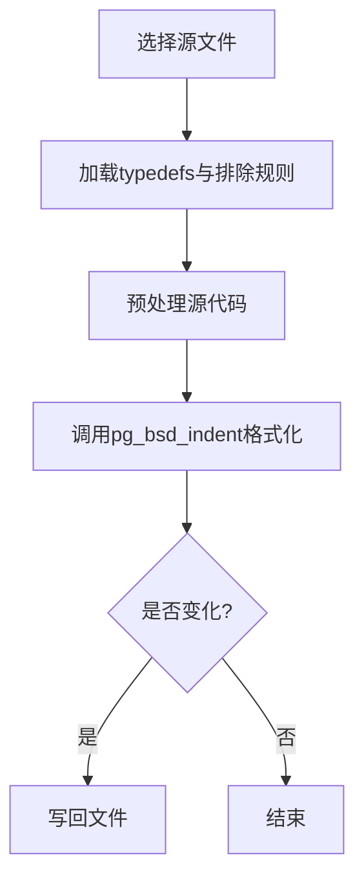
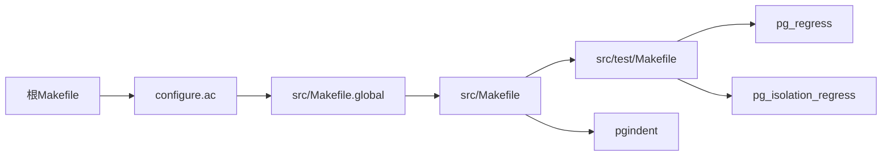

# 开发工具和调试

<cite>
**本文引用的文件**
- [README](file://README)
- [Makefile](file://Makefile)
- [build.sh](file://build.sh)
- [src/Makefile](file://src/Makefile)
- [src/Makefile.global](file://src/Makefile.global)
- [configure.ac](file://configure.ac)
- [src/test/Makefile](file://src/test/Makefile)
- [src/tools/pgindent/pgindent](file://src/tools/pgindent/pgindent)
</cite>

## 目录
1. [简介](#简介)
2. [项目结构](#项目结构)
3. [核心组件](#核心组件)
4. [架构总览](#架构总览)
5. [详细组件分析](#详细组件分析)
6. [依赖关系分析](#依赖关系分析)
7. [性能与构建优化](#性能与构建优化)
8. [故障排查指南](#故障排查指南)
9. [结论](#结论)
10. [附录：常用开发与调试命令速查](#附录：常用开发与调试命令速查)

## 简介
本指南面向基于 minipg（裁剪版 PostgreSQL）的扩展开发与调试工作，覆盖开发环境搭建、代码规范与格式化、构建系统使用、调试技巧、性能分析与内存泄漏检测、测试体系（单元/集成/回归）、以及常见问题的诊断与解决方案。minipg 的目标是保留数据库内核核心能力，便于学习与二次开发。

## 项目结构
- 顶层 Makefile 负责引导 GNU make 并转发到真正的构建入口；根目录提供一键构建脚本以简化配置与编译流程。
- src/ 下为源码主体，包含后端、公共库、接口、工具等子模块；test/ 提供回归、隔离、Perl 测试框架与示例。
- config/ 存放 Autoconf 宏与辅助脚本；configure.ac 定义构建选项与平台探测逻辑。
- tools/ 提供代码格式化工具 pgindent 及若干辅助脚本。

**图示来源**
- [Makefile:1-42](file://Makefile#L1-L42)
- [build.sh:1-3](file://build.sh#L1-L3)
- [configure.ac:1-800](file://configure.ac#L1-L800)
- [src/Makefile.global:1-800](file://src/Makefile.global#L1-L800)
- [src/Makefile:1-69](file://src/Makefile#L1-L69)
- [src/test/Makefile:1-34](file://src/test/Makefile#L1-L34)
- [src/tools/pgindent/pgindent:1-436](file://src/tools/pgindent/pgindent#L1-L436)

**章节来源**
- [README:1-6](file://README#L1-L6)
- [Makefile:1-42](file://Makefile#L1-L42)
- [build.sh:1-3](file://build.sh#L1-L3)
- [src/Makefile:1-69](file://src/Makefile#L1-L69)
- [src/Makefile.global:1-800](file://src/Makefile.global#L1-L800)
- [configure.ac:1-800](file://configure.ac#L1-L800)
- [src/test/Makefile:1-34](file://src/test/Makefile#L1-L34)
- [src/tools/pgindent/pgindent:1-436](file://src/tools/pgindent/pgindent#L1-L436)

## 核心组件
- 构建入口与引导
  - 顶层 Makefile 会查找 GNU make 并转发构建任务，确保构建一致性。
  - build.sh 提供“清理 + 配置”的一键流程，默认开启调试符号以便后续调试。
- 配置与生成
  - configure.ac 集中管理编译器、特性开关（如调试、覆盖率、TAP 测试）、平台模板选择等。
  - src/Makefile.global 由 configure 生成，统一设置安装路径、编译器标志、链接参数、测试运行器等。
- 源码组织与递归构建
  - src/Makefile 声明子目录列表并禁用并行以避免复杂依赖导致的竞态；同时定义安装与清理规则。
- 测试框架
  - src/test/Makefile 将 regress、isolation、perl、modules 等纳入统一测试入口，支持 installcheck 与 check。
- 代码规范与格式化
  - src/tools/pgindent/pgindent 提供统一的 C/C++ 代码缩进与风格检查，内置 typedefs 与排除规则。

**章节来源**
- [Makefile:1-42](file://Makefile#L1-L42)
- [build.sh:1-3](file://build.sh#L1-L3)
- [configure.ac:1-800](file://configure.ac#L1-L800)
- [src/Makefile.global:1-800](file://src/Makefile.global#L1-L800)
- [src/Makefile:1-69](file://src/Makefile#L1-L69)
- [src/test/Makefile:1-34](file://src/test/Makefile#L1-L34)
- [src/tools/pgindent/pgindent:1-436](file://src/tools/pgindent/pgindent#L1-L436)

## 架构总览
下图展示从开发者执行构建到最终产物与测试运行的整体流程，包括配置、生成头文件、递归构建与测试驱动。

**图示来源**
- [Makefile:1-42](file://Makefile#L1-L42)
- [build.sh:1-3](file://build.sh#L1-L3)
- [configure.ac:1-800](file://configure.ac#L1-L800)
- [src/Makefile.global:1-800](file://src/Makefile.global#L1-L800)
- [src/Makefile:1-69](file://src/Makefile#L1-L69)
- [src/test/Makefile:1-34](file://src/test/Makefile#L1-L34)

## 详细组件分析

### 构建系统与配置
- 构建入口
  - 根 Makefile 强制使用 GNU make，若未找到则提示错误，避免非预期行为。
  - build.sh 先清理再配置，便于在变更配置后完整重建。
- 配置项
  - configure.ac 暴露 --enable-debug、--enable-coverage、--enable-tap-tests 等关键开关，影响编译标志与测试能力。
  - 平台模板固定为 Linux，其他平台直接报错，减少跨平台差异带来的干扰。
- 全局变量
  - src/Makefile.global 统一设置 CC/CXX、CFLAGS/LDFLAGS、安装路径、测试运行器（pg_regress、pg_isolation_regress）等。
  - 通过 with_temp_install 与 temp-install 目标创建临时安装树，保证测试隔离。

**图示来源**
- [build.sh:1-3](file://build.sh#L1-L3)
- [configure.ac:1-800](file://configure.ac#L1-L800)
- [src/Makefile.global:1-800](file://src/Makefile.global#L1-L800)
- [src/Makefile:1-69](file://src/Makefile#L1-L69)

**章节来源**
- [Makefile:1-42](file://Makefile#L1-L42)
- [build.sh:1-3](file://build.sh#L1-L3)
- [configure.ac:1-800](file://configure.ac#L1-L800)
- [src/Makefile.global:1-800](file://src/Makefile.global#L1-L800)
- [src/Makefile:1-69](file://src/Makefile#L1-L69)

### 测试框架与回归测试
- 测试入口
  - src/test/Makefile 将 regress、isolation、perl、modules 纳入统一构建与测试流程。
  - 顶层 Makefile.global 提供 pg_regress 与 pg_isolation_regress 的封装目标，支持临时实例与结果对比。
- TAP 测试
  - 当启用 TAP 测试时，通过 prove 驱动 Perl 测试脚本，便于在 CI 中集成。
- 回归测试
  - regress 套件通过 sql/expected 对比输出，适合验证 SQL 行为与计划稳定性。
  - isolation 套件用于并发与隔离级别场景的回归。

**图示来源**
- [src/test/Makefile:1-34](file://src/test/Makefile#L1-L34)
- [src/Makefile.global:1-800](file://src/Makefile.global#L1-L800)

**章节来源**
- [src/test/Makefile:1-34](file://src/test/Makefile#L1-L34)
- [src/Makefile.global:1-800](file://src/Makefile.global#L1-L800)

### 代码规范与格式化
- pgindent 提供统一的缩进与风格检查，自动处理注释、extern "C"、CATALOG 宏等特殊情况。
- 支持从仓库或远程获取 typedefs 列表，确保类型识别一致。
- 可结合 pre-commit 钩子在提交前自动格式化与校验。

**图示来源**
- [src/tools/pgindent/pgindent:1-436](file://src/tools/pgindent/pgindent#L1-L436)

**章节来源**
- [src/tools/pgindent/pgindent:1-436](file://src/tools/pgindent/pgindent#L1-L436)

### 调试与性能分析
- 调试构建
  - 通过 --enable-debug 启用调试符号，便于 gdb/lldb 单步与断点调试。
  - 可在 configure.ac 中进一步启用 assert 检查（--enable-cassert），增强运行时断言。
- 覆盖率
  - 通过 --enable-coverage 启用 gcov/lcov/genhtml，生成覆盖率报告，指导测试补充。
- 性能剖析
  - 可通过 --enable-profiling 启用 gprof 等剖析工具，定位热点函数。
- 内存与并发问题
  - 建议结合 valgrind 与 AddressSanitizer（需自行调整编译标志）进行内存泄漏与越界检测。
  - 对并发相关缺陷，优先使用 isolation 测试复现，并结合日志与计划分析。

**章节来源**
- [configure.ac:1-800](file://configure.ac#L1-L800)
- [src/Makefile.global:1-800](file://src/Makefile.global#L1-L800)

## 依赖关系分析
- 构建依赖
  - 根 Makefile 依赖 GNU make；configure.ac 依赖 autoconf/m4 与指定版本的 autoconf。
  - src/Makefile.global 依赖生成的配置文件与平台模板，统一导出编译器与链接参数。
- 测试依赖
  - regress 与 isolation 测试依赖 pg_regress 与 pg_isolation_regress，二者由 src/Makefile.global 提供封装。
  - TAP 测试依赖 Perl 与 IPC::Run（当启用时）。
- 工具依赖
  - pgindent 依赖 pg_bsd_indent 与 typedefs 列表，支持在线拉取与本地缓存。

**图示来源**
- [Makefile:1-42](file://Makefile#L1-L42)
- [configure.ac:1-800](file://configure.ac#L1-L800)
- [src/Makefile.global:1-800](file://src/Makefile.global#L1-L800)
- [src/Makefile:1-69](file://src/Makefile#L1-L69)
- [src/test/Makefile:1-34](file://src/test/Makefile#L1-L34)
- [src/tools/pgindent/pgindent:1-436](file://src/tools/pgindent/pgindent#L1-L436)

**章节来源**
- [Makefile:1-42](file://Makefile#L1-L42)
- [configure.ac:1-800](file://configure.ac#L1-L800)
- [src/Makefile.global:1-800](file://src/Makefile.global#L1-L800)
- [src/Makefile:1-69](file://src/Makefile#L1-L69)
- [src/test/Makefile:1-34](file://src/test/Makefile#L1-L34)
- [src/tools/pgindent/pgindent:1-436](file://src/tools/pgindent/pgindent#L1-L436)

## 性能与构建优化
- 构建优化
  - 使用并行构建时需评估依赖复杂度；src/Makefile 显式禁用并行以避免复杂依赖冲突。
  - 合理设置 CFLAGS/LDFLAGS，必要时启用特定优化（如循环展开、向量化）以提升性能。
- 测试优化
  - 使用临时安装树隔离测试环境，避免污染源码树。
  - 针对回归测试，按需选择 regress/isolation 子集，缩短反馈周期。
- 调试与剖析
  - 调试构建关闭优化以获得更清晰的堆栈；剖析构建启用相应剖析标志。
  - 结合覆盖率数据补充边界用例，提升回归质量。

[本节提供通用指导，不直接分析具体文件]

## 故障排查指南
- 构建阶段
  - 未找到 GNU make：根 Makefile 会提示错误，请安装 GNU make 并确保 PATH 正确。
  - 配置失败：检查 autoconf 版本与依赖工具（bison/flex/perl 等），参考 configure.ac 中的要求。
  - 链接错误：确认 LDFLAGS_INTERNAL 顺序与外部库路径，避免链接到错误的共享库。
- 测试阶段
  - 回归失败：查看 tmp_check 下的 diff 与日志，定位 SQL 输出差异。
  - 隔离测试失败：检查 output_iso 目录，结合并发场景复现问题。
- 代码风格
  - pgindent 报错：确认 pg_bsd_indent 版本与 typedefs 列表可用；必要时使用 --build 自动构建。
- 常见问题
  - 端口占用：修改默认端口或释放占用端口后再启动服务。
  - 权限问题：确保数据目录与日志目录权限正确。

**章节来源**
- [Makefile:1-42](file://Makefile#L1-L42)
- [configure.ac:1-800](file://configure.ac#L1-L800)
- [src/Makefile.global:1-800](file://src/Makefile.global#L1-L800)
- [src/tools/pgindent/pgindent:1-436](file://src/tools/pgindent/pgindent#L1-L436)

## 结论
minipg 提供了精简而完整的数据库内核学习与实践环境。通过统一的构建系统、完善的测试框架与代码规范工具，开发者可以高效地进行扩展开发与调试。建议在日常工作中结合调试构建、覆盖率与隔离测试，形成闭环的质量保障流程。

[本节为总结性内容，不直接分析具体文件]

## 附录：常用开发与调试命令速查
- 清理并配置
  - 执行根目录构建脚本以清理并配置调试构建。
- 构建与安装
  - 使用顶层 Makefile 触发递归构建与安装。
- 运行测试
  - 使用测试子系统目标运行回归与隔离测试。
- 代码风格
  - 使用 pgindent 对 C/C++ 源文件进行格式化与检查。

**章节来源**
- [build.sh:1-3](file://build.sh#L1-L3)
- [Makefile:1-42](file://Makefile#L1-L42)
- [src/test/Makefile:1-34](file://src/test/Makefile#L1-L34)
- [src/tools/pgindent/pgindent:1-436](file://src/tools/pgindent/pgindent#L1-L436)