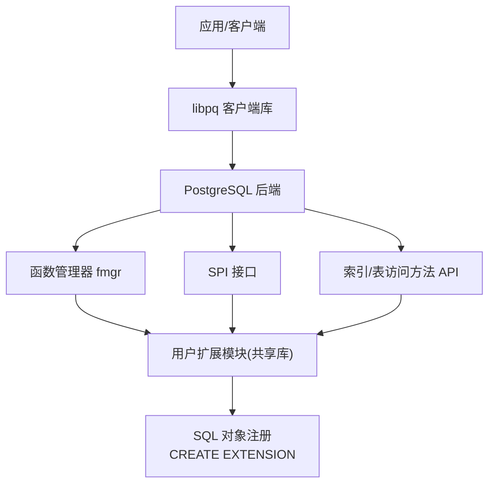
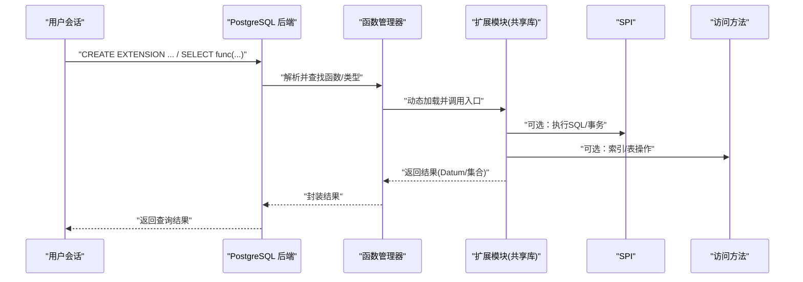
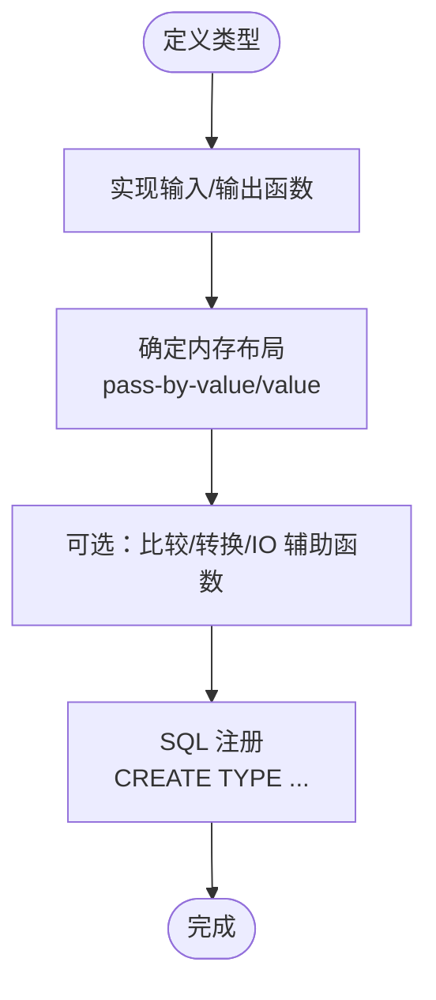
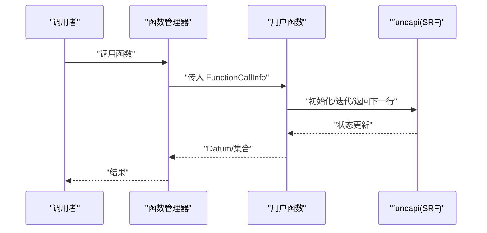
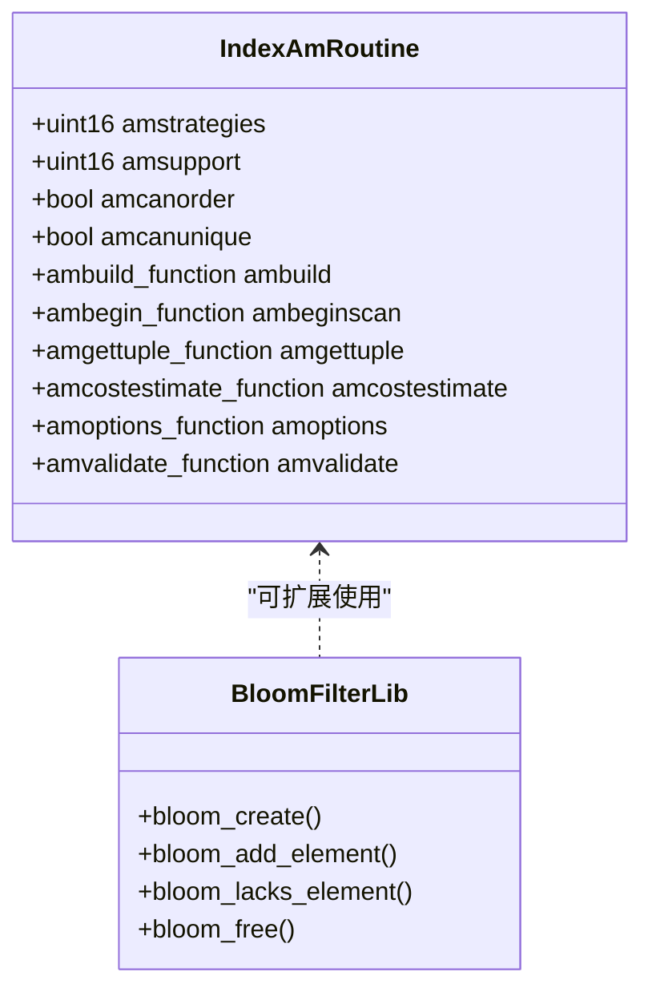
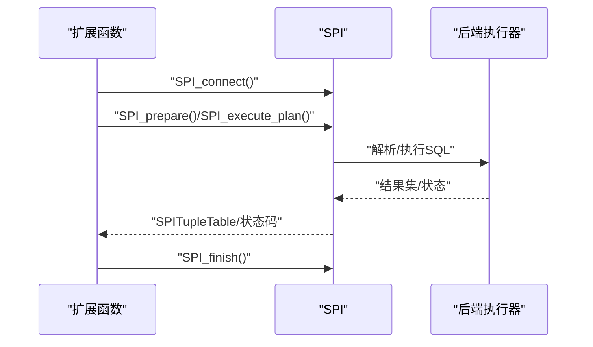
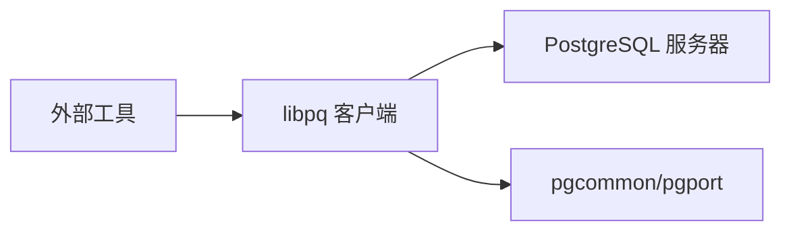
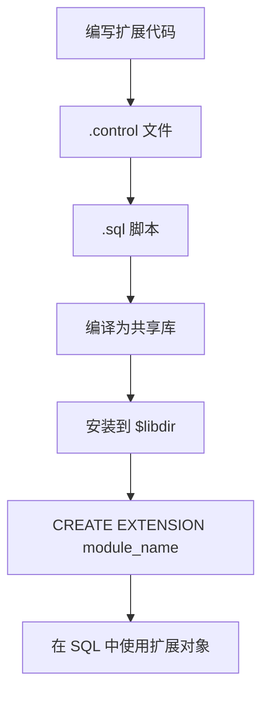
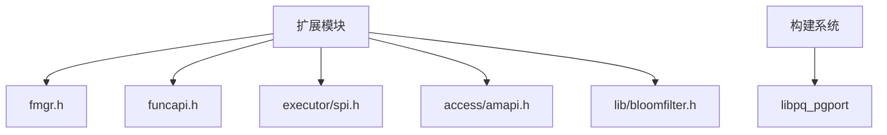

# 扩展开发

<cite>
**本文引用的文件**
- [fmgr.h](file://src/include/fmgr.h)
- [funcapi.h](file://src/include/funcapi.h)
- [spi.h](file://src/include/executor/spi.h)
- [amapi.h](file://src/include/access/amapi.h)
- [bloomfilter.h](file://src/include/lib/bloomfilter.h)
- [xtypes.sgml](file://doc/src/sgml/xtypes.sgml)
- [indexam.sgml](file://doc/src/sgml/indexam.sgml)
- [spi.sgml](file://doc/src/sgml/spi.sgml)
- [Makefile.global](file://src/Makefile.global)
- [worker_spi--1.0.sql](file://src/test/modules/worker_spi/worker_spi--1.0.sql)
- [worker_spi.control](file://src/test/modules/worker_spi/worker_spi.control)
- [test_ext1.control](file://src/test/modules/test_extensions/test_ext1.control)
- [test_ext7.control](file://src/test/modules/test_extensions/test_ext7.control)
- [test_ext8.control](file://src/test/modules/test_extensions/test_ext8.control)
- [README](file://contrib/README)
- [execMain.c](file://src/backend/executor/execMain.c)
- [utility.h](file://src/include/tcop/utility.h)
- [extension.c](file://src/backend/commands/extension.c)
</cite>

## 更新摘要
**变更内容**
- 移除了对已删除的bloom contrib模块的引用和示例
- 更新了可用的contrib模块列表，反映Mini PostgreSQL的精简特性
- 强调了bloomfilter库作为核心组件的存在，但不再提供完整的bloom索引扩展
- 调整了索引方法示例，使用更基础的实现方式
- 更新了扩展开发能力说明，突出系统精简化的优势

## 目录
1. [简介](#简介)
2. [项目结构](#项目结构)
3. [核心组件](#核心组件)
4. [架构总览](#架构总览)
5. [详细组件分析](#详细组件分析)
6. [依赖关系分析](#依赖关系分析)
7. [性能考虑](#性能考虑)
8. [故障排查指南](#故障排查指南)
9. [结论](#结论)
10. [附录](#附录)

## 简介
本指南面向希望在 Mini PostgreSQL 中开发扩展的工程师，系统阐述扩展架构与插件机制，覆盖自定义数据类型、函数、索引方法与访问方法的开发方法；提供 SPI 接口、libpq 客户端库与外部工具集成的实践要点；并给出扩展打包、部署与管理流程，以及最佳实践、性能优化与调试技巧。

**重要更新**：Mini PostgreSQL 作为精简版 PostgreSQL，已移除了部分 contrib 模块（包括 bloom 索引扩展），大幅简化了扩展生态。同时，bloomfilter 算法作为核心库保留在系统中，供其他扩展使用。这一变更使系统更加轻量，但扩展开发能力受到一定限制。开发者应专注于标准的扩展开发模式，通过函数管理器（fmgr）、SPI 接口和访问方法 API 进行扩展开发。

## 项目结构
Mini PostgreSQL 的扩展生态主要分布在以下位置：
- contrib：官方示例扩展（如 amcheck、pageinspect、pg_buffercache 等），展示索引 AM、函数、类型扩展的典型组织方式。
- src/test/modules：测试用扩展（如 worker_spi、test_bloomfilter），演示后台工作者、SPI 使用、Bloom filter 测试等。
- doc/src/sgml：官方文档源，包含扩展相关章节（如 xtypes、indexam、spi）。
- include：扩展开发所需的核心头文件（fmgr、funcapi、spi、amapi 等）。
- interfaces/libpq：libpq 客户端库源码，供外部工具集成。

图表来源
- [fmgr.h:1-778](file://src/include/fmgr.h#L1-L778)
- [spi.h:1-211](file://src/include/executor/spi.h#L1-L211)
- [amapi.h:1-295](file://src/include/access/amapi.h#L1-L295)

章节来源
- [README:1-29](file://contrib/README#L1-L29)

## 核心组件
- 函数管理器（fmgr）：定义统一的函数调用约定、参数/返回值封装、动态加载模块兼容性检查（PG_MODULE_MAGIC）、直接调用宏等。
- 函数返回复合类型/集合（funcapi）：支持 SRF（Set Returning Functions）、复合类型构建、元数据辅助。
- SPI（Server Programming Interface）：允许扩展内执行 SQL、管理游标、事务、结果集等。
- 访问方法（Index/Table AM）：通过 IndexAmRoutine/TableAmHandler 暴露回调，实现自定义索引或表存储引擎。
- 扩展控制文件与 SQL 脚本：.control 描述元信息，.sql 脚本注册 SQL 对象（函数、类型、操作符、索引方法等）。

**更新**：由于移除了部分 contrib 模块（如 bloom），扩展开发示例更加精简。开发者应专注于标准扩展开发模式，利用现有的核心库和测试模块作为参考。

章节来源
- [fmgr.h:1-778](file://src/include/fmgr.h#L1-L778)
- [funcapi.h:1-349](file://src/include/funcapi.h#L1-L349)
- [spi.h:1-211](file://src/include/executor/spi.h#L1-L211)
- [amapi.h:1-295](file://src/include/access/amapi.h#L1-L295)

## 架构总览
扩展以共享库形式动态加载，遵循 fmgr 调用约定；通过 .control 和 .sql 将 SQL 对象注册到系统目录；索引/表扩展通过实现访问方法回调接入核心；SPI 为扩展内部提供 SQL 执行能力；libpq 用于外部工具与数据库交互。

**架构简化说明**：Mini PostgreSQL 移除了部分 contrib 模块，使得扩展生态更加精简。虽然某些高级扩展功能不可用，但核心扩展开发能力保持不变，开发者仍可通过标准接口实现丰富的扩展功能。

图表来源
- [fmgr.h:1-778](file://src/include/fmgr.h#L1-L778)
- [spi.h:1-211](file://src/include/executor/spi.h#L1-L211)
- [amapi.h:1-295](file://src/include/access/amapi.h#L1-L295)

## 详细组件分析

### 自定义数据类型
- 必须提供输入/输出函数，决定内存布局与字符串表示。
- 可通过 fmgr 宏获取/返回 Datum，处理 varlena/toast 数据。
- 复杂类型建议按 pass-by-reference 设计，避免超出 Datum 大小限制。

图表来源
- [xtypes.sgml:28-66](file://doc/src/sgml/xtypes.sgml#L28-L66)
- [fmgr.h:200-340](file://src/include/fmgr.h#L200-L340)

章节来源
- [xtypes.sgml:28-66](file://doc/src/sgml/xtypes.sgml#L28-L66)
- [fmgr.h:200-340](file://src/include/fmgr.h#L200-L340)

### 自定义函数（含集合返回）
- 所有可被 fmgr 调用的函数需遵循统一签名 PG_FUNCTION_ARGS，并使用 PG_GETARG_* / PG_RETURN_* 宏。
- 集合返回函数（SRF）使用 funcapi 提供的上下文与宏进行多值迭代。
- 复合类型返回可使用 TupleDesc/AttInMetadata 构建元组。

图表来源
- [fmgr.h:175-340](file://src/include/fmgr.h#L175-L340)
- [funcapi.h:234-325](file://src/include/funcapi.h#L234-L325)

章节来源
- [fmgr.h:175-340](file://src/include/fmgr.h#L175-L340)
- [funcapi.h:234-325](file://src/include/funcapi.h#L234-L325)

### 索引方法与访问方法
- 索引访问方法通过 IndexAmRoutine 暴露回调（构建、插入、扫描、统计等），并在 pg_am 中注册。
- **更新**：由于 bloom 扩展已被移除，开发者可以参考 test_bloomfilter 模块了解如何使用核心的 bloomfilter 库，或通过其他方式实现类似的索引功能。
- 可以通过实现基本的 IndexAmRoutine 回调来创建自定义索引方法。

图表来源
- [amapi.h:210-287](file://src/include/access/amapi.h#L210-L287)
- [bloomfilter.h:18-25](file://src/include/lib/bloomfilter.h#L18-L25)

章节来源
- [indexam.sgml:1-258](file://doc/src/sgml/indexam.sgml#L1-L258)
- [bloomfilter.h:1-28](file://src/include/lib/bloomfilter.h#L1-L28)

### SPI 接口
- 扩展可在函数体内连接 SPI、准备/执行计划、管理游标与事务，并安全地释放资源。
- 常用 API：SPI_connect/SPI_execute/SPI_prepare/SPI_cursor_open 等。
- 错误码与结果码可通过 SPI_result_code_string 转换为可读字符串。

图表来源
- [spi.h:107-203](file://src/include/executor/spi.h#L107-L203)
- [spi.sgml:41-90](file://doc/src/sgml/spi.sgml#L41-L90)

章节来源
- [spi.h:107-203](file://src/include/executor/spi.h#L107-L203)
- [spi.sgml:41-90](file://doc/src/sgml/spi.sgml#L41-L90)

### libpq 客户端库与外部工具集成
- libpq 是 PostgreSQL 的 C 客户端库，外部工具可通过其建立连接、发送命令、读取结果。
- Mini PostgreSQL 在构建系统中提供 libpq_pgport 链接宏，确保正确链接公共库。
- 示例：pg_rewind 中的 libpq_source 展示了如何复用 libpq 进行只读访问与文件拉取。

图表来源
- [Makefile.global:542-567](file://src/Makefile.global#L542-L567)

章节来源
- [Makefile.global:542-567](file://src/Makefile.global#L542-L567)

### 扩展打包、部署与管理
- 每个扩展包含 .control 文件（描述名称、版本、模块路径、依赖、schema 等）与一个或多个 .sql 脚本（创建 SQL 对象）。
- 安装后通过 CREATE EXTENSION 启用；升级时提供增量迁移脚本。
- **更新**：可用的 contrib 模块包括 amcheck、pageinspect、pg_buffercache、pg_freespacemap、pg_surgery、pg_visibility、pgrowlocks、pgstattuple 等。

图表来源
- [worker_spi--1.0.sql:1-9](file://src/test/modules/worker_spi/worker_spi--1.0.sql#L1-L9)
- [worker_spi.control:1-5](file://src/test/modules/worker_spi/worker_spi.control#L1-L5)
- [test_ext1.control:1-5](file://src/test/modules/test_extensions/test_ext1.control#L1-L5)
- [test_ext7.control:1-4](file://src/test/modules/test_extensions/test_ext7.control#L1-L4)
- [test_ext8.control:1-4](file://src/test/modules/test_extensions/test_ext8.control#L1-L4)

章节来源
- [worker_spi--1.0.sql:1-9](file://src/test/modules/worker_spi/worker_spi--1.0.sql#L1-L9)
- [worker_spi.control:1-5](file://src/test/modules/worker_spi/worker_spi.control#L1-L5)
- [test_ext1.control:1-5](file://src/test/modules/test_extensions/test_ext1.control#L1-L5)
- [test_ext7.control:1-4](file://src/test/modules/test_extensions/test_ext7.control#L1-L4)
- [test_ext8.control:1-4](file://src/test/modules/test_extensions/test_ext8.control#L1-L4)

## 依赖关系分析
- 扩展模块依赖 fmgr 调用约定与 funcapi 集合返回能力。
- 索引扩展依赖 amapi 定义的 IndexAmRoutine 回调。
- SPI 扩展依赖 executor/spi.h 提供的执行与结果管理接口。
- **更新**：bloomfilter 库作为核心组件可用，通过 src/include/lib/bloomfilter.h 提供接口。
- 构建阶段通过 Makefile.global 的 libpq_pgport 宏确保正确链接公共库。

图表来源
- [fmgr.h:1-778](file://src/include/fmgr.h#L1-L778)
- [funcapi.h:1-349](file://src/include/funcapi.h#L1-L349)
- [spi.h:1-211](file://src/include/executor/spi.h#L1-L211)
- [amapi.h:1-295](file://src/include/access/amapi.h#L1-L295)
- [bloomfilter.h:1-28](file://src/include/lib/bloomfilter.h#L1-L28)
- [Makefile.global:542-567](file://src/Makefile.global#L542-L567)

章节来源
- [fmgr.h:1-778](file://src/include/fmgr.h#L1-L778)
- [funcapi.h:1-349](file://src/include/funcapi.h#L1-L349)
- [spi.h:1-211](file://src/include/executor/spi.h#L1-L211)
- [amapi.h:1-295](file://src/include/access/amapi.h#L1-L295)
- [bloomfilter.h:1-28](file://src/include/lib/bloomfilter.h#L1-L28)
- [Makefile.global:542-567](file://src/Makefile.global#L542-L567)

## 性能考虑
- 函数与类型：
  - 尽量使用 pass-by-value 的基础类型以减少拷贝开销。
  - 对 varlena/toast 类型使用 PG_DETOAST_DATUM/PACKED 变体按需解压缩，避免不必要复制。
  - 集合返回函数注意内存上下文切换，使用 multi_call_memory_ctx 保存跨调用状态。
- 索引访问方法：
  - 合理设置 amcanorder/amcanunique/amcanmulticol 等标志，使优化器做出更优选择。
  - 实现 amcostestimate 提供准确的成本估计，有助于计划器选择最优路径。
  - 扫描回调应尽量减少 I/O 与锁竞争，利用 TIDBitmap 批量返回匹配项。
- SPI：
  - 避免在热路径频繁 prepare/execute，缓存计划并复用。
  - 谨慎使用事务边界，减少不必要的提交/回滚。
- **更新**：bloomfilter 库提供了高效的概率数据结构，可用于构建高性能的过滤和去重逻辑。
- 构建与链接：
  - 使用 libpq_pgport 宏确保链接顺序与符号可见性，降低运行时依赖风险。

## 故障排查指南
- 动态加载失败：
  - 确认模块包含 PG_MODULE_MAGIC，且与后端主版本兼容。
  - 检查模块导出符号与入口点命名是否符合约定。
- 函数调用异常：
  - 核对 PG_GETARG_* / PG_RETURN_* 的使用与 NULL 检查。
  - 对于严格函数（strict），确保无 NULL 入参再调用。
- SPI 错误：
  - 使用 SPI_result_code_string 将结果码转为可读字符串定位问题。
  - 确保 SPI_connect/SPI_finish 成对调用，避免连接泄漏。
- 索引 AM：
  - 验证 IndexAmRoutine 回调指针全部有效，未实现的回调设为 NULL。
  - 检查 amvalidate 逻辑是否满足操作类/族约束。
- **更新**：如果尝试使用已移除的 bloom 扩展，需要重新实现或使用其他替代方案。

章节来源
- [fmgr.h:427-492](file://src/include/fmgr.h#L427-L492)
- [spi.h:67-105](file://src/include/executor/spi.h#L67-L105)
- [amapi.h:210-287](file://src/include/access/amapi.h#L210-L287)

## 结论
Mini PostgreSQL 的扩展体系围绕 fmgr 调用约定、funcapi 集合返回、SPI 执行能力与访问方法回调展开。通过 .control 与 .sql 脚本完成 SQL 对象注册，借助 libpq 实现外部工具集成。

**重要更新**：Mini PostgreSQL 作为精简版 PostgreSQL，已移除了部分 contrib 模块（包括 bloom 索引扩展），但保留了核心的 bloomfilter 库。这使系统变得更加轻量，同时仍提供了丰富的扩展开发能力。开发者应专注于标准的扩展开发模式，充分利用现有的 fmgr、SPI、访问方法 API 和核心库来构建高质量的扩展。

遵循本文的最佳实践与性能建议，可高效开发稳定、高性能的自定义类型、函数、索引方法与访问方法。

## 附录
- 快速参考
  - 函数签名与宏：参见 fmgr.h 的 PG_FUNCTION_ARGS、PG_GETARG_*、PG_RETURN_*。
  - 集合返回：参见 funcapi.h 的 FuncCallContext、SRF_* 宏。
  - SPI 接口：参见 executor/spi.h 的连接、执行、游标与事务 API。
  - 索引 AM：参见 access/amapi.h 的 IndexAmRoutine 与回调类型。
  - **更新**：Bloom Filter 库：参见 lib/bloomfilter.h 的概率数据结构接口。
- 示例路径
  - **更新**：Bloom Filter 测试：src/test/modules/test_bloomfilter（展示如何使用核心 bloomfilter 库）
  - SPI 示例：src/test/modules/worker_spi
  - 扩展控制文件：src/test/modules/test_extensions/*.control
  - **更新**：可用的 contrib 模块：amcheck、pageinspect、pg_buffercache、pg_freespacemap、pg_surgery、pg_visibility、pgrowlocks、pgstattuple
- **新增**：Bloom Filter 库用法
  - 创建过滤器：bloom_create(total_elems, bloom_work_mem, seed)
  - 添加元素：bloom_add_element(filter, elem, len)
  - 检查存在：bloom_lacks_element(filter, elem, len)
  - 释放资源：bloom_free(filter)