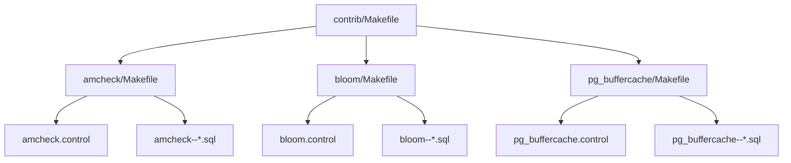
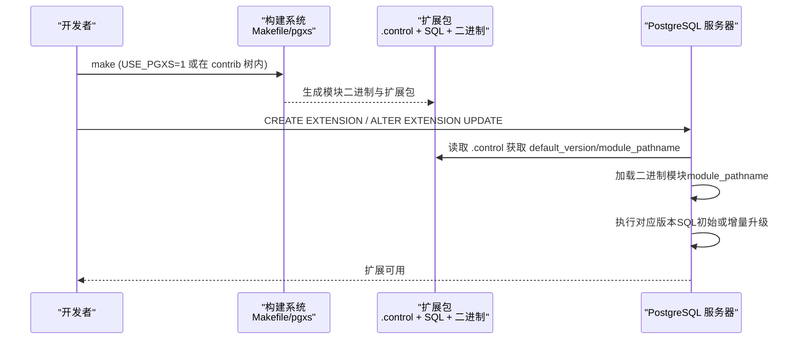
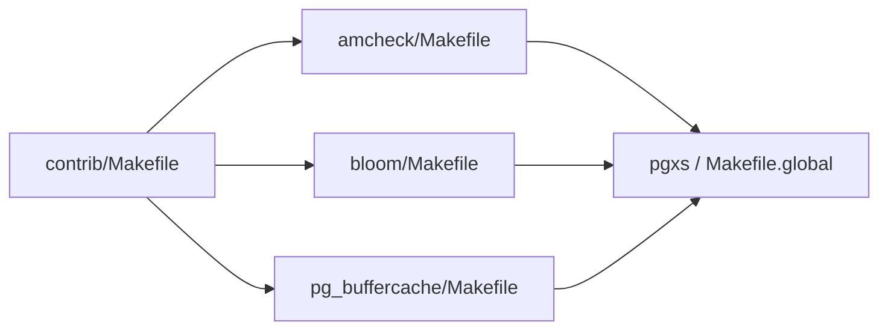

# 扩展打包和部署

<cite>
**本文引用的文件**
- [contrib/Makefile](file://contrib/Makefile)
- [contrib/contrib-global.mk](file://contrib/contrib-global.mk)
- [amcheck/Makefile](file://contrib/amcheck/Makefile)
- [amcheck/amcheck.control](file://contrib/amcheck/amcheck.control)
- [amcheck/amcheck--1.0.sql](file://contrib/amcheck/amcheck--1.0.sql)
- [amcheck/amcheck--1.0--1.1.sql](file://contrib/amcheck/amcheck--1.0--1.1.sql)
- [bloom/Makefile](file://contrib/bloom/Makefile)
- [bloom/bloom.control](file://contrib/bloom/bloom.control)
- [bloom/bloom--1.0.sql](file://contrib/bloom/bloom--1.0.sql)
- [pg_buffercache/Makefile](file://contrib/pg_buffercache/Makefile)
- [pg_buffercache/pg_buffercache.control](file://contrib/pg_buffercache/pg_buffercache.control)
</cite>

## 目录
1. [简介](#简介)
2. [项目结构](#项目结构)
3. [核心组件](#核心组件)
4. [架构总览](#架构总览)
5. [详细组件分析](#详细组件分析)
6. [依赖分析](#依赖分析)
7. [性能考虑](#性能考虑)
8. [故障排查指南](#故障排查指南)
9. [结论](#结论)
10. [附录](#附录)

## 简介
本指南面向PostgreSQL扩展的打包与部署，基于仓库中 contrib 下的多个官方扩展示例（如 amcheck、bloom、pg_buffercache），系统说明扩展的文件组织、控制文件与SQL脚本版本迁移、编译配置、平台适配、分发包制作、安装与升级流程，以及测试、签名与发布建议。读者可据此为二进制扩展与纯SQL扩展制定一致的构建与交付规范。

## 项目结构
PostgreSQL扩展通常位于 contrib/<extname>/ 目录下，每个扩展包含：
- Makefile：定义模块名、对象文件、扩展名、数据文件、描述信息、测试等构建参数
- <extname>.control：扩展元数据与控制项（名称、默认版本、模块路径、是否可重定位等）
- SQL脚本：初始安装脚本与增量升级脚本（命名约定：<extname>--<from>--<to>.sql）
- C源码（可选）：实现函数或访问方法等二进制能力
- sql/expected/log/t 等（可选）：回归测试与TAP测试资源

图表来源
- [contrib/Makefile:7-17](file://contrib/Makefile#L7-L17)
- [amcheck/Makefile:3-11](file://contrib/amcheck/Makefile#L3-L11)
- [bloom/Makefile:3-15](file://contrib/bloom/Makefile#L3-L15)
- [pg_buffercache/Makefile:3-11](file://contrib/pg_buffercache/Makefile#L3-L11)

章节来源
- [contrib/Makefile:1-21](file://contrib/Makefile#L1-L21)
- [contrib/contrib-global.mk:1-5](file://contrib/contrib-global.mk#L1-L5)

## 核心组件
- 扩展控制文件（.control）：声明扩展的元数据与加载行为，包括 comment、default_version、module_pathname、relocatable 等
- 扩展Makefile：声明 MODULE_big、OBJS、EXTENSION、DATA、PGFILEDESC、REGRESS/TAP_TESTS 等，决定如何编译与打包
- SQL脚本：初始安装脚本与增量升级脚本，遵循 PostgreSQL 扩展版本迁移命名规则
- 构建集成：通过 USE_PGXS 或 contrib 全局配置引入 pgxs 进行跨平台构建

章节来源
- [amcheck/amcheck.control:1-6](file://contrib/amcheck/amcheck.control#L1-L6)
- [bloom/bloom.control:1-6](file://contrib/bloom/bloom.control#L1-L6)
- [pg_buffercache/pg_buffercache.control:1-6](file://contrib/pg_buffercache/pg_buffercache.control#L1-L6)
- [amcheck/Makefile:3-11](file://contrib/amcheck/Makefile#L3-L11)
- [bloom/Makefile:3-15](file://contrib/bloom/Makefile#L3-L15)
- [pg_buffercache/Makefile:3-11](file://contrib/pg_buffercache/Makefile#L3-L11)

## 架构总览
下图展示了从构建到安装的完整链路：Makefile 驱动编译生成二进制模块；SQL 脚本作为 DATA 被打包进扩展；运行时由 PostgreSQL 根据 .control 中的 module_pathname 加载二进制，并执行对应版本的SQL完成创建或升级。

图表来源
- [amcheck/Makefile:19-28](file://contrib/amcheck/Makefile#L19-L28)
- [bloom/Makefile:21-30](file://contrib/bloom/Makefile#L21-L30)
- [pg_buffercache/Makefile:13-22](file://contrib/pg_buffercache/Makefile#L13-L22)
- [amcheck/amcheck.control:1-6](file://contrib/amcheck/amcheck.control#L1-L6)

## 详细组件分析

### 扩展控制文件（.control）
- comment：扩展描述
- default_version：默认安装版本
- module_pathname：二进制模块的共享库路径占位符（$libdir/...）
- relocatable：是否允许在任意 schema 下安装

示例参考：
- [amcheck.control:1-6](file://contrib/amcheck/amcheck.control#L1-L6)
- [bloom.control:1-6](file://contrib/bloom/bloom.control#L1-L6)
- [pg_buffercache.control:1-6](file://contrib/pg_buffercache/pg_buffercache.control#L1-L6)

章节来源
- [amcheck/amcheck.control:1-6](file://contrib/amcheck/amcheck.control#L1-L6)
- [bloom/bloom.control:1-6](file://contrib/bloom/bloom.control#L1-L6)
- [pg_buffercache/pg_buffercache.control:1-6](file://contrib/pg_buffercache/pg_buffercache.control#L1-L6)

### 扩展Makefile与构建
- MODULE_big：指定生成的共享库名称
- OBJS：参与链接的对象文件列表
- EXTENSION：扩展名
- DATA：随扩展一起安装的数据文件（通常是SQL脚本）
- PGFILEDESC：扩展描述
- REGRESS/TAP_TESTS：回归测试与TAP测试开关
- 构建模式：
  - USE_PGXS=1：独立于源码树构建，使用 pg_config 提供的 pgxs
  - 在 contrib 树内构建：通过 include src/Makefile.global 与 contrib-global.mk

示例参考：
- [amcheck/Makefile:1-29](file://contrib/amcheck/Makefile#L1-L29)
- [bloom/Makefile:1-31](file://contrib/bloom/Makefile#L1-L31)
- [pg_buffercache/Makefile:1-23](file://contrib/pg_buffercache/Makefile#L1-L23)
- [contrib/contrib-global.mk:1-5](file://contrib/contrib-global.mk#L1-L5)

章节来源
- [amcheck/Makefile:1-29](file://contrib/amcheck/Makefile#L1-L29)
- [bloom/Makefile:1-31](file://contrib/bloom/Makefile#L1-L31)
- [pg_buffercache/Makefile:1-23](file://contrib/pg_buffercache/Makefile#L1-L23)
- [contrib/contrib-global.mk:1-5](file://contrib/contrib-global.mk#L1-L5)

### SQL脚本与版本管理
- 初始安装脚本：命名 <extname>--<version>.sql
- 增量升级脚本：命名 <extname>--<from>--<to>.sql
- 控制文件中 default_version 指向默认安装版本
- 升级时PostgreSQL按顺序执行相应增量脚本

示例参考：
- [amcheck--1.0.sql:1-23](file://contrib/amcheck/amcheck--1.0.sql#L1-L23)
- [amcheck--1.0--1.1.sql:1-28](file://contrib/amcheck/amcheck--1.0--1.1.sql#L1-L28)
- [bloom--1.0.sql:1-25](file://contrib/bloom/bloom--1.0.sql#L1-L25)
- [pg_buffercache 相关脚本见其Makefile DATA 字段:9-10](file://contrib/pg_buffercache/Makefile#L9-L10)

章节来源
- [amcheck/amcheck--1.0.sql:1-23](file://contrib/amcheck/amcheck--1.0.sql#L1-L23)
- [amcheck/amcheck--1.0--1.1.sql:1-28](file://contrib/amcheck/amcheck--1.0--1.1.sql#L1-L28)
- [bloom/bloom--1.0.sql:1-25](file://contrib/bloom/bloom--1.0.sql#L1-L25)
- [pg_buffercache/Makefile:9-10](file://contrib/pg_buffercache/Makefile#L9-L10)

### 二进制扩展与纯SQL扩展
- 二进制扩展：需要MODULE_big与OBJS，生成共享库并在运行时加载
- 纯SQL扩展：仅含SQL脚本，无需C代码，但仍需.control与Makefile（DATA列出SQL）

示例参考：
- 二进制扩展：amcheck、pg_buffercache（含C源与共享库）
- 纯SQL扩展：bloom（提供访问方法与操作类，但示例Makefile未列C源，实际以SQL为主）

章节来源
- [amcheck/Makefile:3-11](file://contrib/amcheck/Makefile#L3-L11)
- [pg_buffercache/Makefile:3-11](file://contrib/pg_buffercache/Makefile#L3-L11)
- [bloom/Makefile:3-15](file://contrib/bloom/Makefile#L3-L15)

### 平台适配与构建选项
- 支持 Windows 资源占位 $(WIN32RES)
- 支持两种构建方式：USE_PGXS 独立构建或在 contrib 树内构建
- 通过 pgxs 自动处理平台差异与编译器标志

章节来源
- [amcheck/Makefile:5-6](file://contrib/amcheck/Makefile#L5-L6)
- [bloom/Makefile:5-6](file://contrib/bloom/Makefile#L5-L6)
- [pg_buffercache/Makefile:5-6](file://contrib/pg_buffercache/Makefile#L5-L6)
- [amcheck/Makefile:19-28](file://contrib/amcheck/Makefile#L19-L28)
- [bloom/Makefile:21-30](file://contrib/bloom/Makefile#L21-L30)
- [pg_buffercache/Makefile:13-22](file://contrib/pg_buffercache/Makefile#L13-L22)

### 测试与验证
- 回归测试：REGRESS 指定测试套件
- TAP测试：TAP_TESTS = 1 启用TAP框架测试
- 测试资源：sql/expected/log/t 等目录用于输入、期望输出与日志

章节来源
- [bloom/Makefile:17-19](file://contrib/bloom/Makefile#L17-L19)
- [amcheck/Makefile:17-18](file://contrib/amcheck/Makefile#L17-L18)

## 依赖分析
- 顶层 contrib/Makefile 通过 SUBDIRS 枚举所有子扩展，统一递归构建
- 各扩展 Makefile 通过 include 机制接入 pgxs 或全局构建环境
- 扩展之间在本仓库中相互独立，无直接耦合

图表来源
- [contrib/Makefile:7-17](file://contrib/Makefile#L7-L17)
- [amcheck/Makefile:19-28](file://contrib/amcheck/Makefile#L19-L28)
- [bloom/Makefile:21-30](file://contrib/bloom/Makefile#L21-L30)
- [pg_buffercache/Makefile:13-22](file://contrib/pg_buffercache/Makefile#L13-L22)

章节来源
- [contrib/Makefile:1-21](file://contrib/Makefile#L1-L21)

## 性能考虑
- 合理拆分SQL脚本：将初始化与升级逻辑分离，减少不必要的DDL执行
- 谨慎使用 PARALLEL/RESTRICTED 等函数属性，避免在不安全上下文中调用
- 控制模块体积：仅链接必要对象文件，减少启动开销
- 利用 pgxs 的平台优化标志，确保在不同平台上获得一致性能表现

[本节为通用指导，不直接分析具体文件]

## 故障排查指南
- 无法找到模块路径：检查 .control 中 module_pathname 是否正确，确认安装后 $libdir 下存在对应共享库
- 版本升级失败：确认存在正确的增量升级脚本，且命名符合 <extname>--<from>--<to>.sql 约定
- 权限问题：某些扩展函数可能标记为 RESTRICTED，需在合适角色或上下文中调用
- 构建错误：确认已正确设置 USE_PGXS 或处于 contrib 树内构建；检查 pg_config 与编译器工具链可用性

章节来源
- [amcheck/amcheck--1.0.sql:1-23](file://contrib/amcheck/amcheck--1.0.sql#L1-L23)
- [amcheck/amcheck--1.0--1.1.sql:1-28](file://contrib/amcheck/amcheck--1.0--1.1.sql#L1-L28)

## 结论
本仓库提供了完善的PostgreSQL扩展构建与部署范式：通过统一的 .control 与 Makefile 组织扩展元数据与构建过程，配合规范的SQL版本迁移脚本，实现可扩展、可升级、可测试的二进制与纯SQL扩展。遵循本文档的流程，可在多平台上稳定地打包、安装与发布扩展。

[本节为总结性内容，不直接分析具体文件]

## 附录

### 打包与部署步骤（二进制扩展）
- 准备扩展目录：包含 Makefile、.control、SQL脚本与C源码
- 构建：
  - 在扩展目录执行 make（USE_PGXS=1 或在 contrib 树内）
  - 产物包括共享库与扩展包
- 安装：
  - 将共享库复制到 $libdir
  - 将 .control 与 SQL 脚本复制到扩展目录
  - 执行 CREATE EXTENSION <extname>
- 升级：
  - 放置新的增量升级脚本
  - 执行 ALTER EXTENSION <extname> UPDATE TO '<new_version>'

章节来源
- [amcheck/Makefile:3-11](file://contrib/amcheck/Makefile#L3-L11)
- [amcheck/amcheck.control:1-6](file://contrib/amcheck/amcheck.control#L1-L6)
- [amcheck/amcheck--1.0--1.1.sql:1-28](file://contrib/amcheck/amcheck--1.0--1.1.sql#L1-L28)

### 打包与部署步骤（纯SQL扩展）
- 准备扩展目录：包含 Makefile、.control 与SQL脚本（无C源码）
- 构建：make（USE_PGXS=1 或在 contrib 树内）
- 安装：复制 .control 与SQL脚本至扩展目录，执行 CREATE EXTENSION
- 升级：新增增量升级脚本并执行 ALTER EXTENSION UPDATE

章节来源
- [bloom/Makefile:3-15](file://contrib/bloom/Makefile#L3-L15)
- [bloom/bloom.control:1-6](file://contrib/bloom/bloom.control#L1-L6)
- [bloom/bloom--1.0.sql:1-25](file://contrib/bloom/bloom--1.0.sql#L1-L25)

### 版本管理与依赖声明
- 版本命名：初始脚本 <extname>--<version>.sql；升级脚本 <extname>--<from>--<to>.sql
- 默认版本：.control 中 default_version
- 依赖：当前示例扩展未显式声明外部依赖；如需依赖其他扩展，可在 .control 中添加 depends 字段（本仓库示例未体现）

章节来源
- [amcheck/amcheck.control:1-6](file://contrib/amcheck/amcheck.control#L1-L6)
- [bloom/bloom.control:1-6](file://contrib/bloom/bloom.control#L1-L6)
- [pg_buffercache/pg_buffercache.control:1-6](file://contrib/pg_buffercache/pg_buffercache.control#L1-L6)

### 测试、签名与发布流程建议
- 测试：启用 REGRESS 与 TAP_TESTS，确保用例覆盖关键路径
- 签名：对共享库与扩展包进行数字签名，校验完整性与来源可信
- 发布：提供安装包与安装说明，包含版本信息与升级路径

[本节为通用指导，不直接分析具体文件]