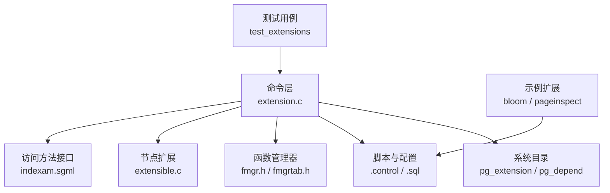
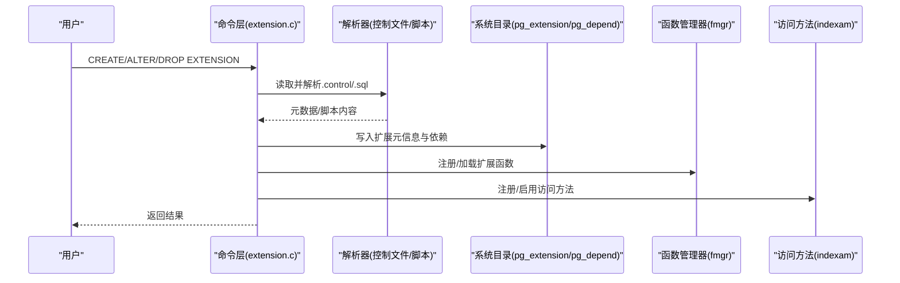
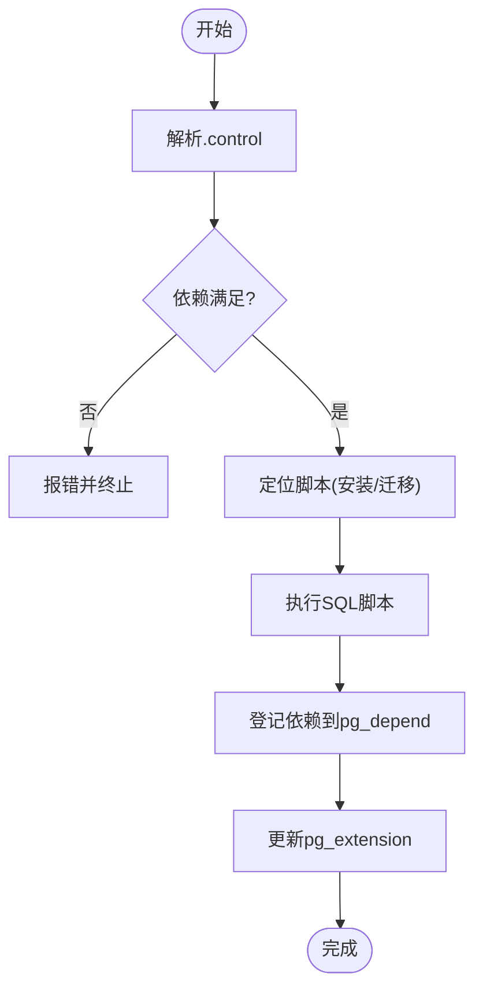
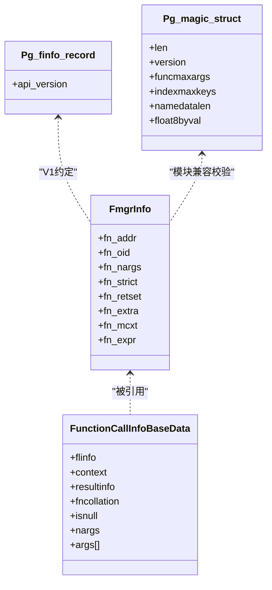
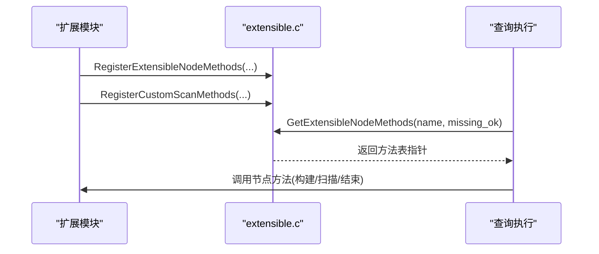
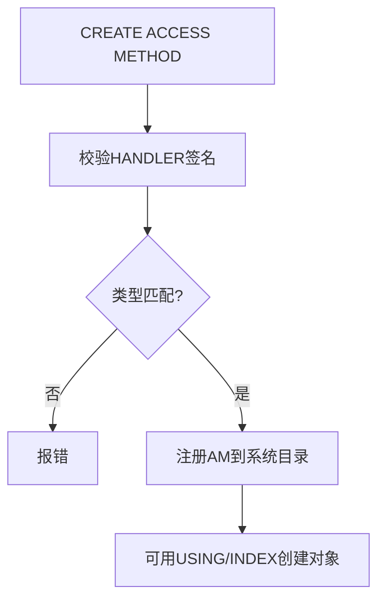
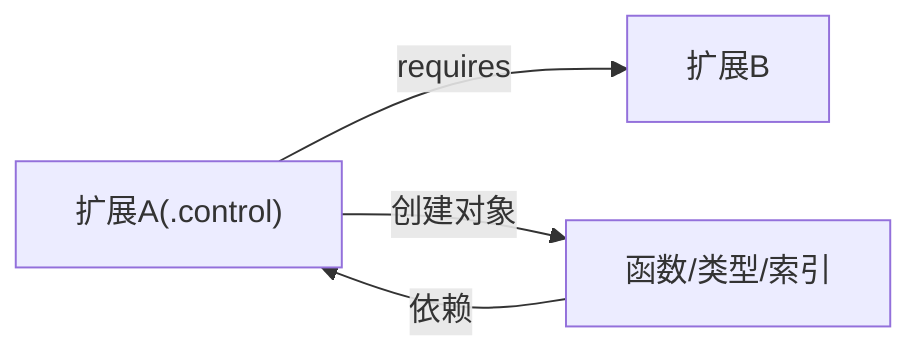

# 扩展架构概述

<cite>
**本文引用的文件**
- [extension.c](file://src/backend/commands/extension.c)
- [pg_extension_d.h](file://src/include/catalog/pg_extension_d.h)
- [pg_depend_d.h](file://src/backend/catalog/pg_depend_d.h)
- [extensible.c](file://src/backend/nodes/extensible.c)
- [fmgr.h](file://src/include/fmgr.h)
- [fmgrtab.h](file://src/include/utils/fmgrtab.h)
- [Gen_fmgrtab.pl](file://src/backend/utils/Gen_fmgrtab.pl)
- [bloom.control](file://contrib/bloom/bloom.control)
- [pageinspect.control](file://contrib/pageinspect/pageinspect.control)
- [test_ext1.control](file://src/test/modules/test_extensions/test_ext1.control)
- [test_ext_cor--1.0.sql](file://src/test/modules/test_extensions/test_ext_cor--1.0.sql)
- [test_extensions.sql](file://src/test/modules/test_extensions/sql/test_extensions.sql)
- [test_extdepend.sql](file://src/test/modules/test_extensions/sql/test_extdepend.sql)
- [create_am.out](file://src/test/regress/expected/create_am.out)
- [indexam.sgml](file://doc/src/sgml/indexam.sgml)
- [create_type.out](file://src/test/regress/expected/create_type.out)
</cite>

## 目录
1. [简介](#简介)
2. [项目结构](#项目结构)
3. [核心组件](#核心组件)
4. [架构总览](#架构总览)
5. [详细组件分析](#详细组件分析)
6. [依赖关系分析](#依赖关系分析)
7. [性能考量](#性能考量)
8. [故障排查指南](#故障排查指南)
9. [结论](#结论)
10. [附录](#附录)

## 简介
本文件面向Mini PostgreSQL（minipg）的扩展系统，提供从整体设计到实现细节的综合概述。重点覆盖：
- 扩展生命周期管理（创建、升级、卸载）与版本控制机制
- 插件机制与内核集成点（函数注册、类型系统扩展点、访问方法接口）
- 依赖关系处理与对象归属模型
- 扩展开发的基础概念与最佳实践

## 项目结构
minipg将扩展能力分散在多个子系统：
- 命令层：扩展安装/升级/删除的核心逻辑位于后端命令模块
- 元数据：扩展定义与依赖通过系统目录记录
- 节点扩展：可扩展节点类型用于自定义执行计划节点
- 函数调用：统一的函数管理器为C扩展提供统一入口
- 访问方法：索引/表访问方法接口允许扩展存储引擎或索引类型
- 示例与测试：contrib与测试模块展示真实扩展形态

**图表来源**
- [extension.c:1-800](file://src/backend/commands/extension.c#L1-L800)
- [pg_extension_d.h:1-35](file://src/include/catalog/pg_extension_d.h#L1-L35)
- [pg_depend_d.h:1-34](file://src/backend/catalog/pg_depend_d.h#L1-L34)
- [extensible.c:1-143](file://src/backend/nodes/extensible.c#L1-L143)
- [fmgr.h:1-778](file://src/include/fmgr.h#L1-L778)
- [fmgrtab.h:1-48](file://src/include/utils/fmgrtab.h#L1-L48)
- [indexam.sgml:122-936](file://doc/src/sgml/indexam.sgml#L122-L936)

**章节来源**
- [extension.c:1-800](file://src/backend/commands/extension.c#L1-L800)
- [pg_extension_d.h:1-35](file://src/include/catalog/pg_extension_d.h#L1-L35)
- [pg_depend_d.h:1-34](file://src/backend/catalog/pg_depend_d.h#L1-L34)

## 核心组件
- 扩展命令与生命周期：解析.control与SQL脚本，维护pg_extension与依赖关系，支持按版本路径升级
- 函数管理器：统一函数调用约定、动态加载、钩子机制，供扩展暴露C函数
- 可扩展节点：注册自定义执行节点类型，参与查询计划与执行
- 访问方法接口：定义索引/表访问方法回调，允许扩展实现新AM
- 类型系统扩展点：通过输入/输出/发送/接收函数及约束，扩展数据类型

**章节来源**
- [extension.c:1-800](file://src/backend/commands/extension.c#L1-L800)
- [fmgr.h:1-778](file://src/include/fmgr.h#L1-L778)
- [extensible.c:1-143](file://src/backend/nodes/extensible.c#L1-L143)
- [indexam.sgml:122-936](file://doc/src/sgml/indexam.sgml#L122-L936)
- [create_type.out:189-222](file://src/test/regress/expected/create_type.out#L189-L222)

## 架构总览
扩展系统围绕“声明式配置 + SQL脚本 + 动态库”的模式工作：
- .control文件描述扩展元信息（名称、默认版本、依赖、是否可重定位等）
- .sql脚本负责创建对象（函数、类型、索引AM等），并建立依赖
- 后端在CREATE/ALTER/DROP EXTENSION时解析并执行相应脚本，更新系统目录
- 运行时通过函数管理器加载扩展提供的C函数；通过节点/AM接口注入执行路径

**图表来源**
- [extension.c:1-800](file://src/backend/commands/extension.c#L1-L800)
- [fmgr.h:1-778](file://src/include/fmgr.h#L1-L778)
- [indexam.sgml:122-936](file://doc/src/sgml/indexam.sgml#L122-L936)

## 详细组件分析

### 扩展生命周期与版本控制
- 控制文件解析：读取name、directory、default_version、module_pathname、schema、relocatable、superuser、trusted、encoding、requires等
- 脚本定位：根据版本选择install或迁移脚本（形如 ext--from--to.sql）
- 依赖检查：解析requires列表，确保依赖扩展已存在并可满足版本要求
- 对象归属：所有由扩展创建的数据库对象均登记到pg_depend，关联到pg_extension OID
- 升级路径：计算可达版本图，顺序应用迁移脚本
- 安全与权限：superuser/trusted标志影响安装行为

**图表来源**
- [extension.c:597-737](file://src/backend/commands/extension.c#L597-L737)
- [extension.c:742-789](file://src/backend/commands/extension.c#L742-L789)
- [extension.c:497-585](file://src/backend/commands/extension.c#L497-L585)
- [pg_depend_d.h:1-34](file://src/backend/catalog/pg_depend_d.h#L1-L34)
- [pg_extension_d.h:1-35](file://src/include/catalog/pg_extension_d.h#L1-L35)

**章节来源**
- [extension.c:1-800](file://src/backend/commands/extension.c#L1-L800)
- [pg_extension_d.h:1-35](file://src/include/catalog/pg_extension_d.h#L1-L35)
- [pg_depend_d.h:1-34](file://src/backend/catalog/pg_depend_d.h#L1-L34)

### 函数注册与调用机制
- 统一签名：所有可通过fmgr调用的函数遵循PG_FUNCTION_ARGS约定
- 动态加载：load_external_function/lookup_external_function按需加载共享库中的函数
- 内置映射：生成fmgr_builtins表，加速内部函数查找
- 钩子：fmgr_hook支持在函数调用前后进行拦截（例如安全策略）
- 模块魔法：PG_MODULE_MAGIC校验模块与内核兼容性

**图表来源**
- [fmgr.h:38-67](file://src/include/fmgr.h#L38-L67)
- [fmgr.h:85-96](file://src/include/fmgr.h#L85-L96)
- [fmgr.h:394-424](file://src/include/fmgr.h#L394-L424)
- [fmgr.h:453-491](file://src/include/fmgr.h#L453-L491)
- [fmgrtab.h:25-35](file://src/include/utils/fmgrtab.h#L25-L35)
- [Gen_fmgrtab.pl:183-233](file://src/backend/utils/Gen_fmgrtab.pl#L183-L233)

**章节来源**
- [fmgr.h:1-778](file://src/include/fmgr.h#L1-L778)
- [fmgrtab.h:1-48](file://src/include/utils/fmgrtab.h#L1-L48)
- [Gen_fmgrtab.pl:183-233](file://src/backend/utils/Gen_fmgrtab.pl#L183-L233)

### 可扩展节点与自定义扫描
- 注册机制：RegisterExtensibleNodeMethods/RegisterCustomScanMethods将方法表注册到哈希表
- 查找机制：GetExtensibleNodeMethods/GetCustomScanMethods按名称检索方法表
- 用途：允许扩展插入自定义计划节点，参与优化与执行阶段

**图表来源**
- [extensible.c:1-143](file://src/backend/nodes/extensible.c#L1-L143)

**章节来源**
- [extensible.c:1-143](file://src/backend/nodes/extensible.c#L1-L143)

### 访问方法接口（索引/表）
- 索引AM：IndexAmRoutine定义构建、插入、删除、扫描、并行等回调
- 表AM：通过HANDLER注册表访问方法，配合USING指定存储引擎
- 验证：创建AM时会校验处理器函数签名与返回类型

**图表来源**
- [indexam.sgml:122-936](file://doc/src/sgml/indexam.sgml#L122-L936)
- [create_am.out:92-118](file://src/test/regress/expected/create_am.out#L92-L118)

**章节来源**
- [indexam.sgml:122-936](file://doc/src/sgml/indexam.sgml#L122-L936)
- [create_am.out:92-118](file://src/test/regress/expected/create_am.out#L92-L118)

### 类型系统扩展点
- 自定义类型：通过input/output/send/receive函数组合定义新类型
- 域类型：基于基础类型增加约束，输入时执行约束检查
- 缓存优化：类型I/O使用typcache减少目录开销

**章节来源**
- [create_type.out:189-222](file://src/test/regress/expected/create_type.out#L189-L222)

### 依赖关系与对象归属
- 依赖登记：扩展内对象通过pg_depend关联到pg_extension
- 级联行为：DROP EXTENSION会级联删除其拥有对象；也可显式标记/取消标记依赖
- 测试覆盖：包含依赖标记、移除、级联删除等场景

**章节来源**
- [pg_depend_d.h:1-34](file://src/backend/catalog/pg_depend_d.h#L1-L34)
- [test_extdepend.sql:1-80](file://src/test/modules/test_extensions/sql/test_extdepend.sql#L1-L80)
- [test_extensions.sql:40-78](file://src/test/modules/test_extensions/sql/test_extensions.sql#L40-L78)

## 依赖关系分析
- 控制文件依赖：requires字段声明对其他扩展的依赖
- 运行时依赖：扩展脚本中创建的对象自动登记依赖
- 版本依赖：升级路径需保证脚本序列正确且无环

**图表来源**
- [test_ext1.control:1-5](file://src/test/modules/test_extensions/test_ext1.control#L1-L5)
- [pg_depend_d.h:1-34](file://src/backend/catalog/pg_depend_d.h#L1-L34)

**章节来源**
- [test_ext1.control:1-5](file://src/test/modules/test_extensions/test_ext1.control#L1-L5)
- [pg_depend_d.h:1-34](file://src/backend/catalog/pg_depend_d.h#L1-L34)

## 性能考量
- 函数查找：内置函数通过fmgr_builtins表快速定位，避免重复解析
- I/O缓存：类型I/O使用typcache缓存约束与函数信息，降低目录访问
- 扩展升级：迁移脚本应尽量幂等且增量最小化，减少锁竞争
- 动态加载：按需加载共享库，避免启动开销；注意模块魔法校验成本

[本节为通用指导，不直接分析具体文件]

## 故障排查指南
- 扩展不存在：get_extension_oid在未找到时抛出未定义对象错误
- 脚本路径错误：.control或脚本找不到会报文件访问错误
- 依赖缺失：requires未满足时报错，需先安装依赖扩展
- 替换限制：扩展不允许替换非自身拥有的对象（如视图/函数）
- 访问方法签名不匹配：创建AM时若HANDLER返回类型不符将报错

**章节来源**
- [extension.c:158-196](file://src/backend/commands/extension.c#L158-L196)
- [extension.c:615-627](file://src/backend/commands/extension.c#L615-L627)
- [test_extensions.sql:66-78](file://src/test/modules/test_extensions/sql/test_extensions.sql#L66-L78)
- [create_am.out:92-118](file://src/test/regress/expected/create_am.out#L92-L118)

## 结论
Mini PostgreSQL的扩展体系以“控制文件+SQL脚本+动态库”为核心，结合函数管理器、可扩展节点与访问方法接口，形成完整的插件生态。通过严格的依赖管理与版本控制，扩展可以安全地增强数据库功能。开发者应遵循统一接口与最佳实践，确保扩展的可移植性与稳定性。

## 附录

### 扩展开发最佳实践
- 明确声明依赖与版本，保持脚本幂等
- 使用PG_FUNCTION_INFO_V1与PG_MODULE_MAGIC
- 谨慎使用OR REPLACE，避免破坏对象所有权
- 合理划分schema，利用relocatable提升部署灵活性
- 对复杂I/O操作使用typcache与内存上下文管理

**章节来源**
- [fmgr.h:394-424](file://src/include/fmgr.h#L394-L424)
- [fmgr.h:453-491](file://src/include/fmgr.h#L453-L491)
- [test_ext_cor--1.0.sql:1-20](file://src/test/modules/test_extensions/test_ext_cor--1.0.sql#L1-L20)
- [bloom.control:1-6](file://contrib/bloom/bloom.control#L1-L6)
- [pageinspect.control:1-6](file://contrib/pageinspect/pageinspect.control#L1-L6)