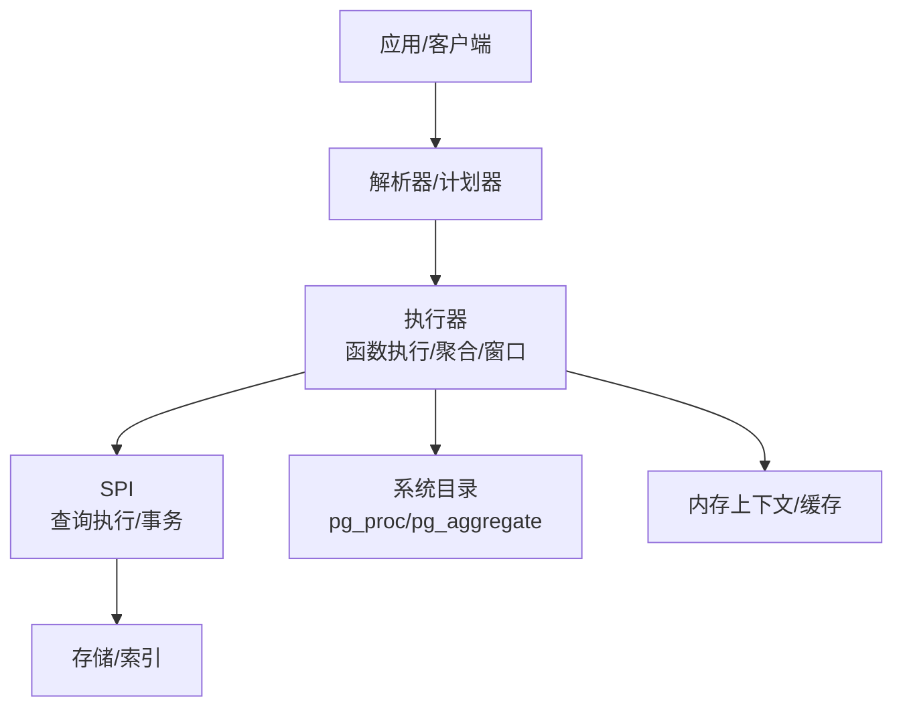
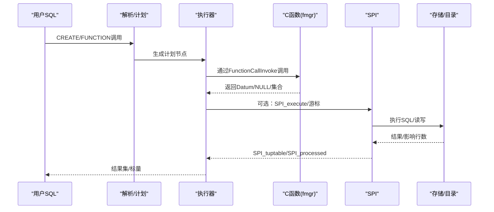
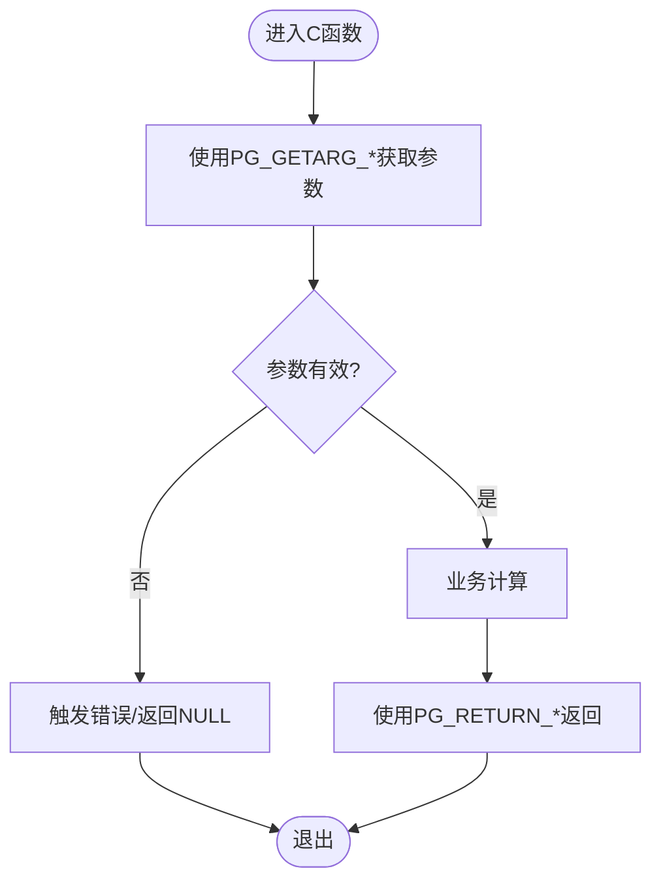
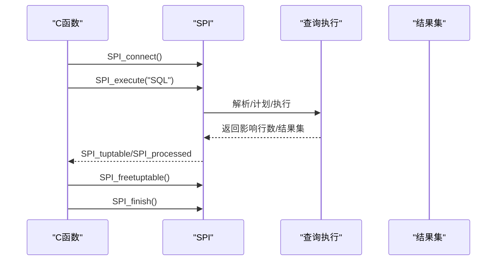
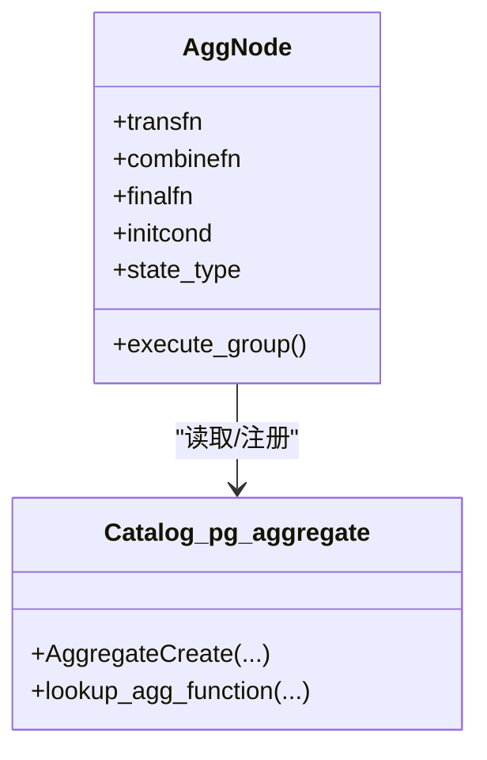
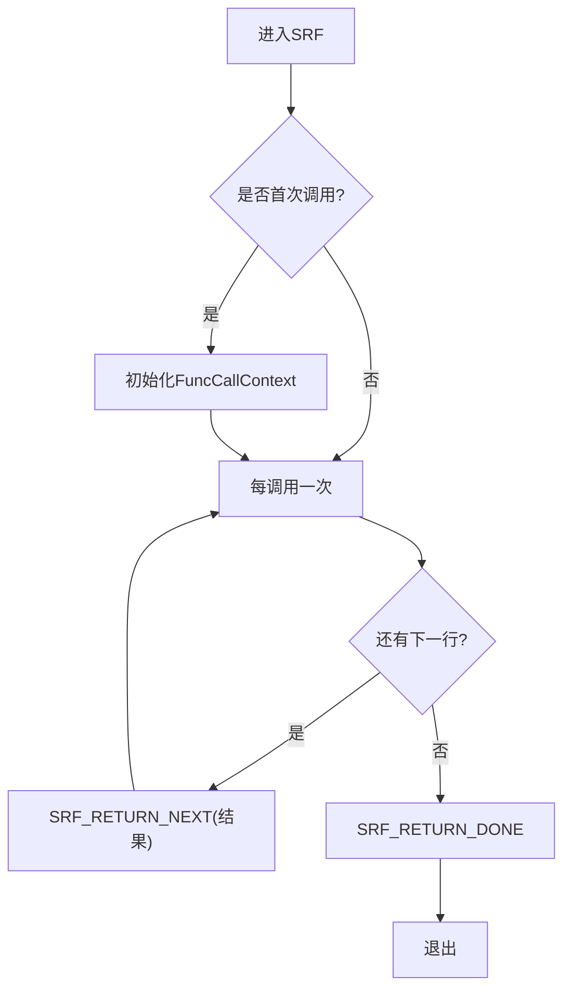
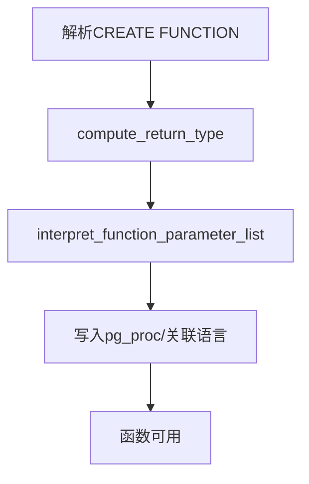
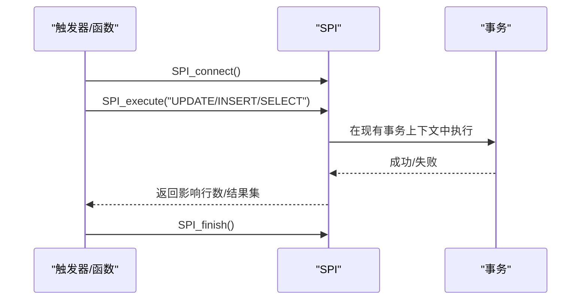
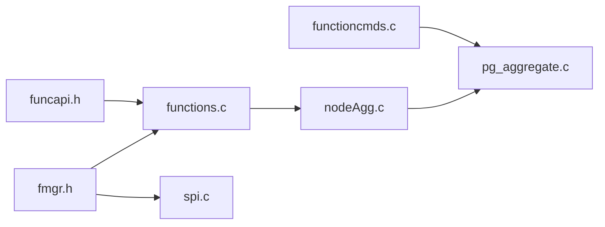

# 用户定义函数

<cite>
**本文引用的文件**
- [fmgr.h](file://src/include/fmgr.h)
- [funcapi.h](file://src/include/funcapi.h)
- [spi.c](file://src/backend/executor/spi.c)
- [functioncmds.c](file://src/backend/commands/functioncmds.c)
- [functions.c](file://src/backend/executor/functions.c)
- [nodeAgg.c](file://src/backend/executor/nodeAgg.c)
- [pg_aggregate.c](file://src/backend/catalog/pg_aggregate.c)
- [spi.sgml](file://doc/src/sgml/spi.sgml)
- [autoinc.example](file://contrib/spi/autoinc.example)
</cite>

## 目录
1. [简介](#简介)
2. [项目结构](#项目结构)
3. [核心组件](#核心组件)
4. [架构总览](#架构总览)
5. [详细组件分析](#详细组件分析)
6. [依赖关系分析](#依赖关系分析)
7. [性能考虑](#性能考虑)
8. [故障排查指南](#故障排查指南)
9. [结论](#结论)
10. [附录](#附录)

## 简介
本文件面向希望在 PostgreSQL 中开发“用户定义函数”的工程师，覆盖以下主题：
- 如何编写 C 语言函数、SQL 函数与过程语言函数（通过 SPI）
- 函数注册机制、参数传递、返回值处理与错误处理
- 聚合函数、窗口函数与表值函数的实现方法
- SPI 接口使用指南：查询执行、事务管理与结果集处理
- 函数性能优化与调试技巧

## 项目结构
围绕用户定义函数，代码主要分布在如下位置：
- 函数调用约定与宏：src/include/fmgr.h
- 集合返回与复合类型支持：src/include/funcapi.h
- 函数创建与注册命令：src/backend/commands/functioncmds.c
- SQL 函数执行引擎：src/backend/executor/functions.c
- SPI（服务器编程接口）：src/backend/executor/spi.c
- 聚合与窗口执行：src/backend/executor/nodeAgg.c；聚合元数据管理：src/backend/catalog/pg_aggregate.c
- SPI 文档与示例：doc/src/sgml/spi.sgml；contrib/spi/autoinc.example

图表来源
- [functioncmds.c:1-200](file://src/backend/commands/functioncmds.c#L1-L200)
- [functions.c:1-200](file://src/backend/executor/functions.c#L1-L200)
- [spi.c:1-200](file://src/backend/executor/spi.c#L1-L200)
- [nodeAgg.c:1-200](file://src/backend/executor/nodeAgg.c#L1-L200)

章节来源
- [functioncmds.c:1-200](file://src/backend/commands/functioncmds.c#L1-L200)
- [functions.c:1-200](file://src/backend/executor/functions.c#L1-L200)
- [spi.c:1-200](file://src/backend/executor/spi.c#L1-L200)
- [nodeAgg.c:1-200](file://src/backend/executor/nodeAgg.c#L1-L200)

## 核心组件
- 函数调用约定（fmgr）：统一入口签名、参数获取与返回宏、动态加载信息、直接调用工具。
- 集合返回与复合类型（funcapi）：SRF（Set Returning Function）、TupleDesc、AttInMetadata、多调用上下文。
- 函数注册与验证（functioncmds）：CREATE FUNCTION 语义解析、返回类型推断、参数列表解释、语言绑定。
- SQL 函数执行（functions）：SQL 函数体解析、计划缓存、逐行/惰性求值、结果收集。
- SPI（spi）：连接/断开、执行 SQL、游标、结果集访问、事务边界控制、错误恢复。
- 聚合与窗口（nodeAgg/pg_aggregate）：转换函数/合并函数/最终函数、移动聚合、分组集、部分聚合。

章节来源
- [fmgr.h:175-425](file://src/include/fmgr.h#L175-L425)
- [funcapi.h:234-349](file://src/include/funcapi.h#L234-L349)
- [functioncmds.c:79-200](file://src/backend/commands/functioncmds.c#L79-L200)
- [functions.c:40-165](file://src/backend/executor/functions.c#L40-L165)
- [spi.c:93-200](file://src/backend/executor/spi.c#L93-L200)
- [nodeAgg.c:1-200](file://src/backend/executor/nodeAgg.c#L1-L200)
- [pg_aggregate.c:41-120](file://src/backend/catalog/pg_aggregate.c#L41-L120)

## 架构总览
下图展示了从 SQL 到 C/SPI 的调用链与关键交互点。

图表来源
- [fmgr.h:147-173](file://src/include/fmgr.h#L147-L173)
- [functions.c:76-128](file://src/backend/executor/functions.c#L76-L128)
- [spi.c:93-200](file://src/backend/executor/spi.c#L93-L200)

## 详细组件分析

### 1) C 语言函数：参数、返回与注册
- 函数签名与调用约定
  - 所有可被 fmgr 调用的函数必须遵循统一签名，并通过 PG_FUNCTION_ARGS 接收参数。
  - 使用 PG_GETARG_* 系列宏获取参数，PG_RETURN_* 系列宏返回结果，PG_RETURN_NULL 表示 NULL。
  - 动态加载函数需声明 PG_FUNCTION_INFO_V1，模块需包含 PG_MODULE_MAGIC。
- 参数与返回值
  - 支持基本类型、变长类型（varlena）、指针、事务ID等。
  - 对可 TOAST 的类型可使用 PG_DETOAST_DATUM* 系列宏安全访问。
- 直接调用
  - 提供 DirectFunctionCallN/OidFunctionCallN 系列用于内部直接调用其他函数。

图表来源
- [fmgr.h:175-376](file://src/include/fmgr.h#L175-L376)
- [fmgr.h:378-425](file://src/include/fmgr.h#L378-L425)
- [fmgr.h:499-681](file://src/include/fmgr.h#L499-L681)

章节来源
- [fmgr.h:175-425](file://src/include/fmgr.h#L175-L425)
- [fmgr.h:499-681](file://src/include/fmgr.h#L499-L681)

### 2) SQL 函数与过程语言函数（SPI）
- SQL 函数执行
  - SQL 函数体在首次调用时解析并构建计划，后续复用缓存（fn_extra）。
  - 支持惰性求值与一次性结果收集，适合 SETOF 或单值返回。
- SPI 基础
  - SPI_connect/SPI_finish 建立/释放连接，管理内存上下文与全局状态。
  - SPI_execute 执行 SQL 语句，SPI_cursor_open/操作游标，SPI_freetuptable 释放结果。
  - 结果集通过 SPI_tuptable 访问，SPI_getvalue 提取列值字符串。
- 事务管理
  - 不能在普通函数内随意提交/回滚；如需子事务隔离，应使用 SPI 提供的子事务能力。
  - 标准过程语言根据 volatility 设置 SPI 只读/读写模式。

图表来源
- [spi.c:93-200](file://src/backend/executor/spi.c#L93-L200)
- [spi.sgml:5002-5227](file://doc/src/sgml/spi.sgml#L5002-L5227)

章节来源
- [functions.c:76-165](file://src/backend/executor/functions.c#L76-L165)
- [spi.c:93-200](file://src/backend/executor/spi.c#L93-L200)
- [spi.sgml:5002-5227](file://doc/src/sgml/spi.sgml#L5002-L5227)

### 3) 聚合函数与窗口函数
- 聚合函数三阶段
  - 转换函数（transfn）：累积状态
  - 合并函数（combinefn，可选）：并行/部分聚合合并
  - 最终函数（finalfn，可选）：输出结果
- 移动聚合
  - 为窗口函数提供高效滑动帧计算，需要逆转换函数（invtransfn）。
- 执行细节
  - nodeAgg 负责按组推进状态，支持哈希/排序/混合策略，以及分组集。
  - 聚合元数据由 pg_aggregate 管理，AggregateCreate 完成注册。

图表来源
- [nodeAgg.c:1-200](file://src/backend/executor/nodeAgg.c#L1-L200)
- [pg_aggregate.c:41-120](file://src/backend/catalog/pg_aggregate.c#L41-L120)

章节来源
- [nodeAgg.c:1-200](file://src/backend/executor/nodeAgg.c#L1-L200)
- [pg_aggregate.c:41-120](file://src/backend/catalog/pg_aggregate.c#L41-L120)

### 4) 表值函数（SRF）
- 使用 funcapi 提供的 SRF 宏：
  - SRF_IS_FIRSTCALL / SRF_FIRSTCALL_INIT / SRF_PERCALL_SETUP / SRF_RETURN_NEXT / SRF_RETURN_DONE
- 适用于返回多行的函数，支持复合类型与基本类型。
- 注意资源清理：不要在跨调用间持有非内存资源；必要时使用回调或物化模式。

图表来源
- [funcapi.h:234-324](file://src/include/funcapi.h#L234-L324)

章节来源
- [funcapi.h:234-324](file://src/include/funcapi.h#L234-L324)

### 5) 函数注册机制（CREATE FUNCTION）
- functioncmds 负责解析 CREATE FUNCTION 的 RETURNS、参数列表、默认值、VARIADIC 等。
- compute_return_type 处理返回类型（含壳类型），interpret_function_parameter_list 解释参数。
- 将函数元信息写入系统目录（如 pg_proc），并与语言绑定（C/SQL/过程语言）。

图表来源
- [functioncmds.c:79-200](file://src/backend/commands/functioncmds.c#L79-L200)

章节来源
- [functioncmds.c:79-200](file://src/backend/commands/functioncmds.c#L79-L200)

### 6) SPI 使用指南（查询执行、事务、结果集）
- 连接与生命周期
  - SPI_connect/SPI_finish 成对出现，管理内存上下文与全局变量（SPI_processed/SPI_tuptable/SPI_result）。
- 执行与结果
  - SPI_execute 执行 SQL，返回影响行数；结果集通过 SPI_tuptable 访问。
  - 使用 SPI_getvalue 获取列值的字符串表示。
- 事务
  - 不建议在函数内直接 COMMIT/ROLLBACK；如需隔离，使用子事务。
  - 根据 volatility 决定只读/读写模式。
- 示例
  - contrib/spi/autoinc.example 展示触发器中使用 SPI 的用法。

图表来源
- [spi.c:93-200](file://src/backend/executor/spi.c#L93-L200)
- [spi.sgml:5002-5227](file://doc/src/sgml/spi.sgml#L5002-L5227)
- [autoinc.example:1-36](file://contrib/spi/autoinc.example#L1-L36)

章节来源
- [spi.c:93-200](file://src/backend/executor/spi.c#L93-L200)
- [spi.sgml:5002-5227](file://doc/src/sgml/spi.sgml#L5002-L5227)
- [autoinc.example:1-36](file://contrib/spi/autoinc.example#L1-L36)

## 依赖关系分析
- 低层接口
  - fmgr.h 提供统一的函数调用约定与宏，是所有函数实现的基石。
  - funcapi.h 扩展了集合返回与复合类型支持。
- 执行路径
  - functions.c 负责 SQL 函数体的解析与执行。
  - spi.c 提供 SPI，供 C/过程语言函数执行 SQL。
  - nodeAgg.c 与 pg_aggregate.c 协作实现聚合与窗口。
- 注册与元数据
  - functioncmds.c 解析并注册函数，更新系统目录。

图表来源
- [fmgr.h:175-425](file://src/include/fmgr.h#L175-L425)
- [funcapi.h:234-349](file://src/include/funcapi.h#L234-L349)
- [functions.c:76-165](file://src/backend/executor/functions.c#L76-L165)
- [spi.c:93-200](file://src/backend/executor/spi.c#L93-L200)
- [nodeAgg.c:1-200](file://src/backend/executor/nodeAgg.c#L1-L200)
- [pg_aggregate.c:41-120](file://src/backend/catalog/pg_aggregate.c#L41-L120)
- [functioncmds.c:79-200](file://src/backend/commands/functioncmds.c#L79-L200)

章节来源
- [fmgr.h:175-425](file://src/include/fmgr.h#L175-L425)
- [funcapi.h:234-349](file://src/include/funcapi.h#L234-L349)
- [functions.c:76-165](file://src/backend/executor/functions.c#L76-L165)
- [spi.c:93-200](file://src/backend/executor/spi.c#L93-L200)
- [nodeAgg.c:1-200](file://src/backend/executor/nodeAgg.c#L1-L200)
- [pg_aggregate.c:41-120](file://src/backend/catalog/pg_aggregate.c#L41-L120)
- [functioncmds.c:79-200](file://src/backend/commands/functioncmds.c#L79-L200)

## 性能考虑
- 避免不必要的内存分配
  - 聚合转换函数可利用 AggCheckCallContext 返回的临时上下文，减少重复分配。
- 合理使用 volatility
  - 将纯函数标记为 IMMUTABLE/STABLE，有助于计划器优化与缓存。
- 集合返回函数
  - 对于大数据集，优先使用物化模式或在单次调用中填充 tuplestore，避免跨调用资源泄漏。
- SPI 使用
  - 批量执行 SQL，减少多次往返；谨慎管理 SPI 连接与结果集释放。
- 聚合移动模式
  - 为窗口函数提供逆转换函数，可显著降低滑动窗口的重算成本。

[本节为通用指导，不直接分析具体文件]

## 故障排查指南
- SPI 错误码
  - SPI_ERROR_ARGUMENT、SPI_ERROR_UNCONNECTED、SPI_ERROR_REL_DUPLICATE 等指示参数、连接或临时关系冲突问题。
- 事务与错误恢复
  - 若 SPI 调用失败，当前事务/子事务会回滚；可在 SPI 调用周围建立子事务以捕获并恢复。
- 常见陷阱
  - 忘记释放 SPI 结果集导致内存增长。
  - 在严格模式下传入 NULL 参数未检查。
  - 在函数体内不当提交/回滚导致外部事务不一致。

章节来源
- [spi.sgml:3607-3641](file://doc/src/sgml/spi.sgml#L3607-L3641)
- [spi.sgml:5002-5227](file://doc/src/sgml/spi.sgml#L5002-L5227)

## 结论
PostgreSQL 的用户定义函数体系以 fmgr 为核心，配合 funcapi、SPI、执行器与目录系统，提供了从简单标量函数到复杂聚合/窗口/表值函数的完整能力。通过正确理解函数注册、参数与返回约定、SPI 事务与结果集处理，以及聚合/窗口执行模型，可以高效地实现高性能、可维护的自定义函数。

[本节为总结性内容，不直接分析具体文件]

## 附录
- 快速参考
  - C 函数：使用 PG_FUNCTION_ARGS、PG_GETARG_*、PG_RETURN_*、PG_FUNCTION_INFO_V1、PG_MODULE_MAGIC。
  - SRF：使用 SRF_* 宏管理多调用上下文。
  - SPI：SPI_connect/SPI_execute/SPI_finish，结合 SPI_tuptable 与 SPI_getvalue。
  - 聚合：transfn/combinefn/finalfn，必要时提供 invtransfn 以支持移动聚合。
  - 注册：CREATE FUNCTION 由 functioncmds 解析并写入 pg_proc。

[本节为补充说明，不直接分析具体文件]