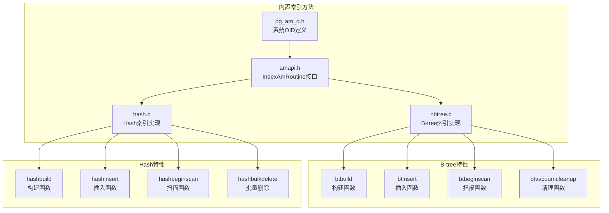
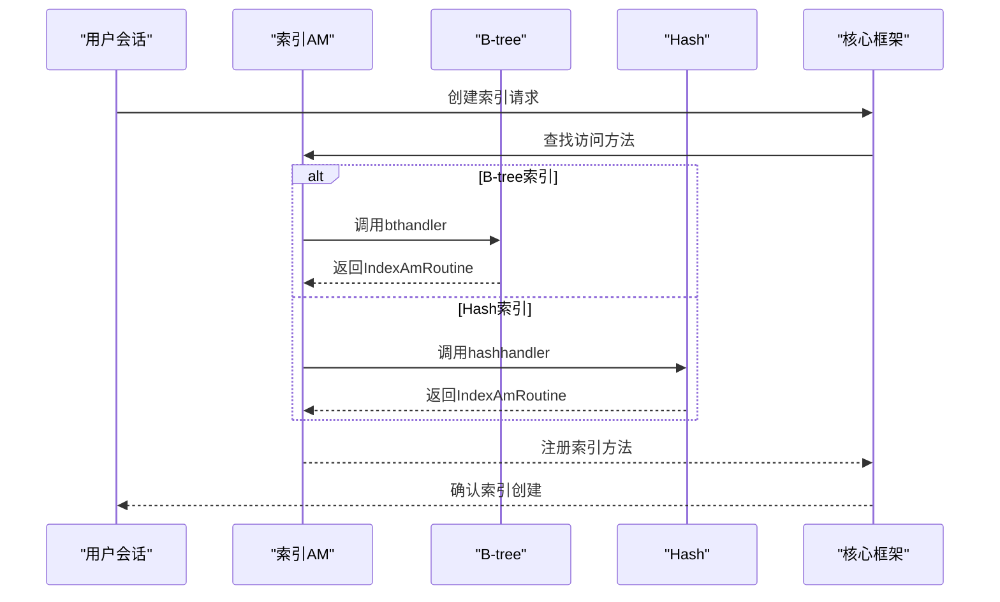
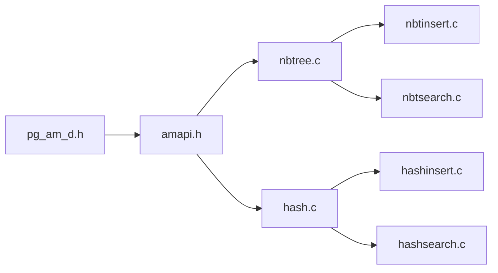

# 索引方法

<cite>
**本文引用的文件**
- [hash.c](file://src/backend/access/hash/hash.c)
- [nbtree.c](file://src/backend/access/nbtree/nbtree.c)
- [amapi.h](file://src/include/access/amapi.h)
- [pg_am_d.h](file://src/include/catalog/pg_am_d.h)
- [indexam.sgml](file://doc/src/sgml/indexam.sgml)
</cite>

## 更新摘要
**所做更改**
- 移除了Bloom索引相关的所有内容，因为该实现已从minipg中删除
- 更新了支持的索引类型说明，仅包含B-tree和Hash索引
- 重新组织了文档结构，专注于当前可用的索引方法
- 更新了架构图表和示例以反映实际的实现状态

## 目录
1. [简介](#简介)
2. [项目结构](#项目结构)
3. [核心组件](#核心组件)
4. [架构总览](#架构总览)
5. [详细组件分析](#详细组件分析)
6. [依赖关系分析](#依赖关系分析)
7. [性能考虑](#性能考虑)
8. [故障排查指南](#故障排查指南)
9. [结论](#结论)
10. [附录](#附录)

## 简介
本指南面向希望实现自定义索引方法的开发者，系统讲解B-tree与Hash等索引方法的设计要点。基于minipg中已实现的索引方法，提供从接口实现到性能优化的完整示例。内容覆盖：
- 索引构建算法、搜索策略与更新维护机制
- 索引元数据管理、统计信息收集与成本估算
- B-tree和Hash索引的AM接口注册、页格式、插入/扫描/清理流程
- 测试与验证方法（含回归测试）

**注意**：Bloom索引实现已从minipg中移除，本文档不再包含相关内容。

## 项目结构
本仓库包含PostgreSQL核心与多个扩展模块。针对"索引方法"主题，重点关注以下位置：
- src/backend/access/nbtree：B-tree索引实现，包含完整的访问方法回调、构建/插入/扫描/清理功能
- src/backend/access/hash：Hash索引实现，包含哈希表操作、冲突处理、并行支持
- src/include/access/amapi.h：索引访问方法接口定义（IndexAmRoutine）
- src/include/catalog/pg_am_d.h：系统目录定义，包含B-tree和Hash的OID常量

**图表来源**
- [nbtree.c:94-144](file://src/backend/access/nbtree/nbtree.c#L94-L144)
- [hash.c:55-105](file://src/backend/access/hash/hash.c#L55-L105)
- [amapi.h:262-287](file://src/include/access/amapi.h#L262-L287)
- [pg_am_d.h:37-39](file://src/include/catalog/pg_am_d.h#L37-L39)

**章节来源**
- [nbtree.c:94-144](file://src/backend/access/nbtree/nbtree.c#L94-L144)
- [hash.c:55-105](file://src/backend/access/hash/hash.c#L55-L105)
- [amapi.h:262-287](file://src/include/access/amapi.h#L262-L287)
- [pg_am_d.h:37-39](file://src/include/catalog/pg_am_d.h#L37-L39)

## 核心组件
- 访问方法接口（IndexAmRoutine）：统一描述索引AM的能力与回调，包括构建、插入、扫描、清理、成本估算、选项解析、校验等。
- B-tree索引实现：
  - 支持排序、唯一约束、多列索引
  - 支持并行扫描和VACUUM优化
  - 完整的WAL日志支持和恢复机制
- Hash索引实现：
  - 高效的等值查询支持
  - 动态哈希表扩容机制
  - 支持位图扫描优化

**章节来源**
- [amapi.h:262-287](file://src/include/access/amapi.h#L262-L287)
- [nbtree.c:94-144](file://src/backend/access/nbtree/nbtree.c#L94-L144)
- [hash.c:55-105](file://src/backend/access/hash/hash.c#L55-L105)

## 架构总览
minipg中的索引方法通过统一的IndexAmRoutine接口进行注册和管理。B-tree和Hash索引分别实现了完整的生命周期管理，包括构建、插入、扫描、清理等操作。

**图表来源**
- [nbtree.c:94-144](file://src/backend/access/nbtree/nbtree.c#L94-L144)
- [hash.c:55-105](file://src/backend/access/hash/hash.c#L55-L105)
- [amapi.c:55-103](file://src/backend/access/index/amapi.c#L55-L103)

**章节来源**
- [nbtree.c:94-144](file://src/backend/access/nbtree/nbtree.c#L94-L144)
- [hash.c:55-105](file://src/backend/access/hash/hash.c#L55-L105)
- [amapi.c:55-103](file://src/backend/access/index/amapi.c#L55-L103)

## 详细组件分析

### 索引访问方法接口（IndexAmRoutine）
- 作用：声明索引AM支持的能力（如是否支持唯一、多列、并行、INCLUDE等）以及所有回调函数指针。
- B-tree设置：
  - amcanmulticol = true（支持多列索引）
  - amcanunique = true（支持唯一约束）
  - amcanparallel = true（支持并行扫描）
  - amcaninclude = true（支持INCLUDE列）
- Hash设置：
  - amcanmulticol = false（不支持多列）
  - amcanunique = false（不支持唯一约束）
  - amcanparallel = false（不支持并行扫描）

**章节来源**
- [nbtree.c:94-144](file://src/backend/access/nbtree/nbtree.c#L94-L144)
- [hash.c:55-105](file://src/backend/access/hash/hash.c#L55-L105)
- [amapi.h:262-287](file://src/include/access/amapi.h#L262-L287)

### B-tree索引实现
- 构建流程：
  - btbuild：扫描堆表，按B-tree算法组织数据
  - btbuildempty：在初始化fork中创建元数据页
- 插入流程：
  - btinsert：递归下降找到合适位置，处理页面分裂
- 扫描流程：
  - btbeginscan：初始化扫描描述符
  - btgettuple：按顺序或反向遍历B-tree
- 清理流程：
  - btbulkdelete：批量删除标记的元组
  - btvacuumcleanup：回收空间并更新统计信息

**章节来源**
- [nbtree.c:94-144](file://src/backend/access/nbtree/nbtree.c#L94-L144)
- [nbtree.c:149-200](file://src/backend/access/nbtree/nbtree.c#L149-L200)

### Hash索引实现
- 构建流程：
  - hashbuild：根据数据量决定是否需要排序优化
  - hashbuildempty：初始化哈希表元数据页
- 插入流程：
  - hashinsert：计算哈希值，处理冲突链
- 扫描流程：
  - hashbeginscan：根据查询键定位桶
  - hashgettuple：遍历桶内元组
- 清理流程：
  - hashbulkdelete：批量删除操作
  - hashvacuumcleanup：清理死元组

**章节来源**
- [hash.c:55-105](file://src/backend/access/hash/hash.c#L55-L105)
- [hash.c:110-188](file://src/backend/access/hash/hash.c#L110-L188)

### 系统目录与OID管理
- pg_am_d.h定义了索引访问方法的OID常量：
  - BTREE_AM_OID：B-tree索引访问方法OID
  - HASH_AM_OID：Hash索引访问方法OID
  - HEAP_TABLE_AM_OID：堆表访问方法OID
- 这些OID用于系统目录中的索引方法标识

**章节来源**
- [pg_am_d.h:37-39](file://src/include/catalog/pg_am_d.h#L37-L39)

## 依赖关系分析
- 索引方法依赖的核心接口：
  - IndexAmRoutine（amapi.h）：定义AM回调与能力标志
  - GenericXLog：事务与WAL日志
  - BufferManager/FSM：缓冲与空闲页管理
  - Catalog：操作类、操作族、类型等元数据
- B-tree内部依赖：
  - nbtree.h：数据结构、常量、宏
  - nbtinsert.c：插入逻辑
  - nbtsearch.c：搜索逻辑
  - nbtsort.c：排序优化
- Hash内部依赖：
  - hash.h：数据结构、常量、宏
  - hashinsert.c：插入逻辑
  - hashsearch.c：搜索逻辑
  - hashovfl.c：溢出处理

**图表来源**
- [amapi.h:262-287](file://src/include/access/amapi.h#L262-L287)
- [pg_am_d.h:37-39](file://src/include/catalog/pg_am_d.h#L37-L39)
- [nbtree.c:94-144](file://src/backend/access/nbtree/nbtree.c#L94-L144)
- [hash.c:55-105](file://src/backend/access/hash/hash.c#L55-L105)

**章节来源**
- [amapi.h:262-287](file://src/include/access/amapi.h#L262-L287)
- [pg_am_d.h:37-39](file://src/include/catalog/pg_am_d.h#L37-L39)
- [nbtree.c:94-144](file://src/backend/access/nbtree/nbtree.c#L94-L144)
- [hash.c:55-105](file://src/backend/access/hash/hash.c#L55-L105)

## 性能考虑
- B-tree索引：
  - 支持范围查询和排序，适合大多数场景
  - 并行扫描提升大表查询性能
  - VACUUM优化减少空间碎片
- Hash索引：
  - 等值查询性能优异
  - 动态扩容适应数据增长
  - 位图扫描优化批量操作
- 通用优化：
  - WAL日志确保数据一致性
  - 缓冲区管理减少磁盘IO
  - 统计信息辅助查询规划

## 故障排查指南
- 索引构建失败：
  - 检查内存配置和维护工作区大小
  - 验证数据类型和操作符兼容性
- 插入性能问题：
  - 分析B-tree分裂频率
  - 检查Hash冲突率
- 扫描结果异常：
  - 验证索引完整性
  - 检查MVCC可见性规则
- VACUUM后统计异常：
  - 确认清理过程正确执行
  - 检查统计信息更新逻辑

## 结论
minipg提供了完整的B-tree和Hash索引实现，涵盖了索引方法开发的核心概念和实践。通过这些实现，开发者可以：
- 理解索引AM接口的职责与回调约定
- 掌握不同索引结构的组织方式
- 学习构建、插入、扫描、清理的完整流程
- 借助现有代码快速理解和扩展索引功能

**注意**：Bloom索引实现已从minipg中移除，如需了解其设计原理，请参考完整的PostgreSQL源码。

## 附录

### 不同索引方法要点对照
- B-tree：有序结构，支持范围查询与排序，适合等值与范围检索
- Hash：等值查询高效，不支持范围与排序
- GiST：通用树结构，支持多种数据类型与操作符族（未在minipg中实现）
- GIN：倒排索引，适合多值/数组/全文检索（未在minipg中实现）
- Bloom：签名文件，适合高基数的多列存在性查询（已从minipg中移除）

### 索引方法API速查
- IndexAmRoutine字段：能力标志与回调指针
- B-tree特有：btbuild、btinsert、btbeginscan、btgettuple
- Hash特有：hashbuild、hashinsert、hashbeginscan、hashgettuple

**章节来源**
- [nbtree.c:94-144](file://src/backend/access/nbtree/nbtree.c#L94-L144)
- [hash.c:55-105](file://src/backend/access/hash/hash.c#L55-L105)
- [amapi.h:262-287](file://src/include/access/amapi.h#L262-L287)

### 测试与验证
- 回归测试：使用PG的回归测试框架验证索引行为
- TAP测试：启用TAP_TESTS=1，便于自动化测试
- 性能基准：使用pgbench等工具进行性能测试

**章节来源**
- [indexam.sgml:68-162](file://doc/src/sgml/indexam.sgml#L68-L162)