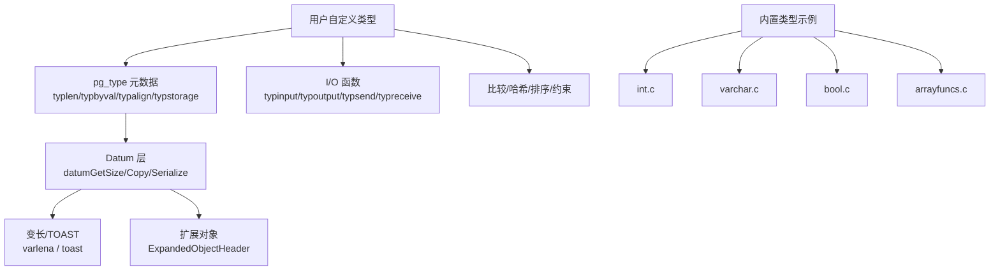
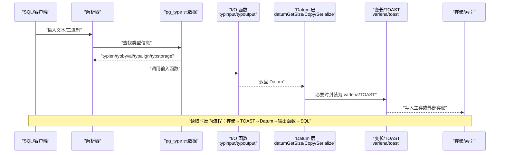
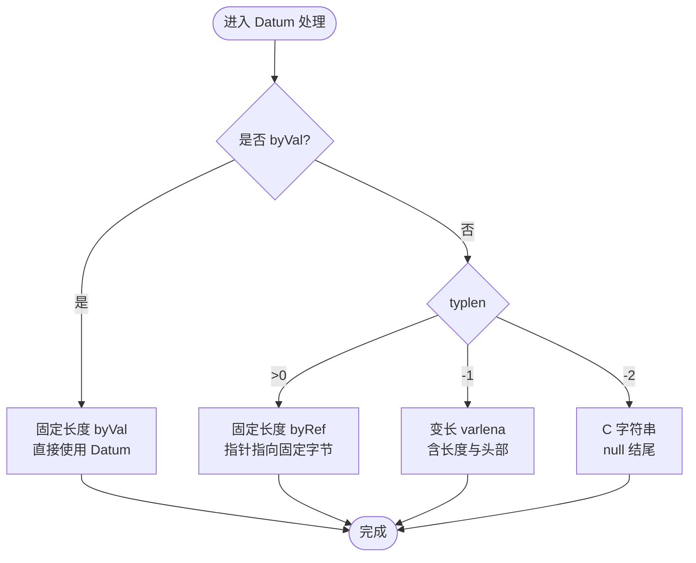
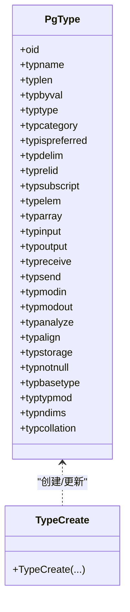
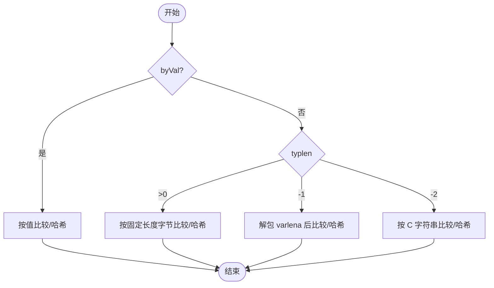
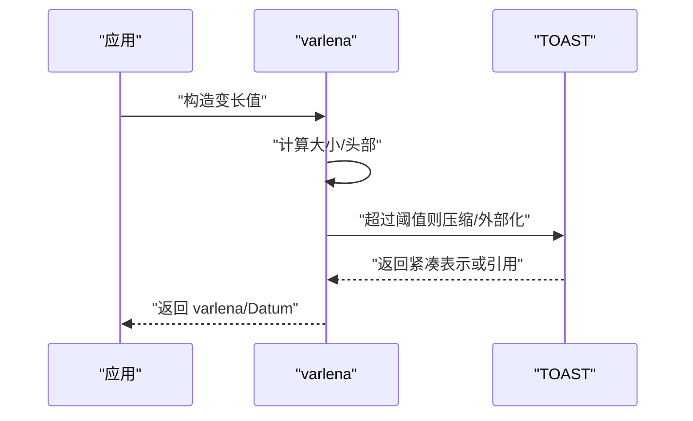
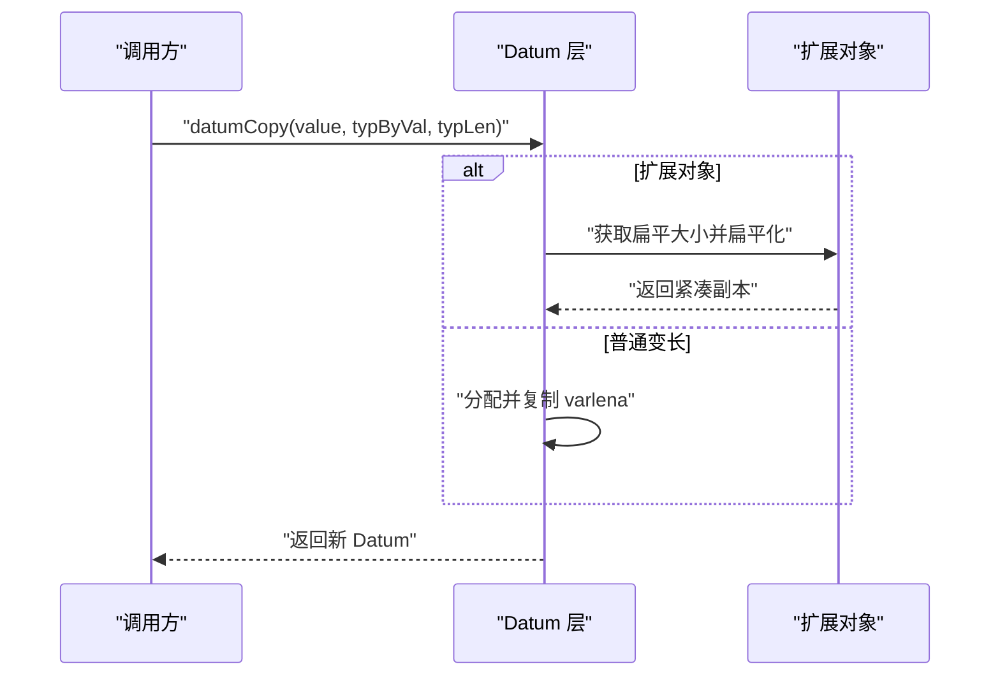
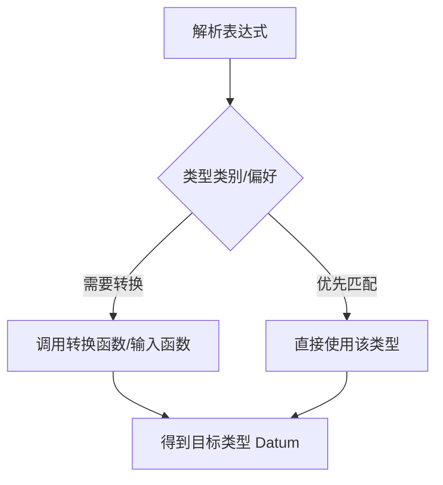
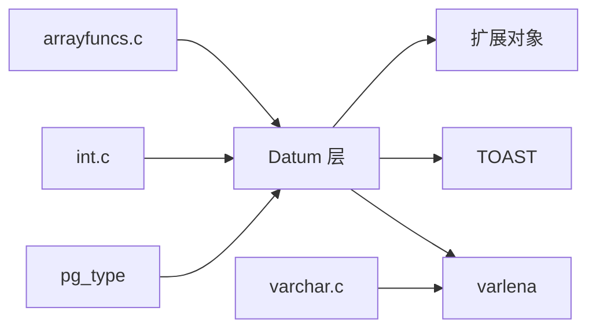

# 自定义数据类型

<cite>
**本文引用的文件**
- [src/backend/utils/adt/datum.c](file://src/backend/utils/adt/datum.c)
- [src/include/utils/datum.h](file://src/include/utils/datum.h)
- [src/include/catalog/pg_type.h](file://src/include/catalog/pg_type.h)
- [src/backend/utils/adt/varlena.c](file://src/backend/utils/adt/varlena.c)
- [src/backend/utils/adt/expandeddatum.c](file://src/backend/utils/adt/expandeddatum.c)
- [src/include/utils/expandeddatum.h](file://src/include/utils/expandeddatum.h)
- [src/backend/access/common/toast_internals.c](file://src/backend/access/common/toast_internals.c)
- [src/include/access/detoast.h](file://src/include/access/detoast.h)
- [src/backend/utils/adt/arrayfuncs.c](file://src/backend/utils/adt/arrayfuncs.c)
- [src/backend/utils/adt/int.c](file://src/backend/utils/adt/int.c)
- [src/backend/utils/adt/varchar.c](file://src/backend/utils/adt/varchar.c)
- [src/backend/utils/adt/bool.c](file://src/backend/utils/adt/bool.c)
</cite>

## 目录
1. [简介](#简介)
2. [项目结构](#项目结构)
3. [核心组件](#核心组件)
4. [架构总览](#架构总览)
5. [详细组件分析](#详细组件分析)
6. [依赖关系分析](#依赖关系分析)
7. [性能考虑](#性能考虑)
8. [故障排查指南](#故障排查指南)
9. [结论](#结论)
10. [附录](#附录)

## 简介
本指南面向希望在 minipg（PostgreSQL 代码库）中实现自定义数据类型的开发者。内容涵盖：
- Datum 类型系统与内部表示
- 输入/输出函数、比较与哈希、存储格式与 TOAST
- 类型转换机制与内存管理
- 从简单标量到复杂复合类型的完整实现路径
- 类型验证、序列化与性能优化技巧

## 项目结构
围绕自定义类型开发，最相关的代码分布在以下位置：
- 类型系统元信息：pg_type 目录定义类型在系统目录中的字段与行为
- Datum 操作：utils/adt/datum.* 提供复制、比较、序列化等通用能力
- 变长类型与 TOAST：varlena.c 与 toast_internals.c 负责可变长度与压缩/外部存储
- 扩展对象：expandeddatum.* 支持将大型对象“展开”为可读写结构，避免频繁拷贝
- 内置类型示例：int.c、varchar.c、bool.c、arrayfuncs.c 等展示不同形态的实现范式

图表来源
- [src/include/catalog/pg_type.h:47-189](file://src/include/catalog/pg_type.h#L47-L189)
- [src/backend/utils/adt/datum.c:16-41](file://src/backend/utils/adt/datum.c#L16-L41)
- [src/backend/utils/adt/varlena.c:1-200](file://src/backend/utils/adt/varlena.c#L1-L200)
- [src/backend/utils/adt/expandeddatum.c:1-200](file://src/backend/utils/adt/expandeddatum.c#L1-L200)

章节来源
- [src/include/catalog/pg_type.h:47-189](file://src/include/catalog/pg_type.h#L47-L189)
- [src/backend/utils/adt/datum.c:16-41](file://src/backend/utils/adt/datum.c#L16-L41)

## 核心组件
- Datum 抽象：所有值统一以 Datum 传递，具体语义由 typbyval/typlen 决定
- 变长类型 varlena：用于任意长度二进制数据，支持 TOAST 压缩/外部存储
- 扩展对象 ExpandedObjectHeader：对大型对象进行惰性展开与读写，减少拷贝
- 类型元数据 pg_type：描述类型大小、对齐、存储策略、I/O 过程等
- 内置类型参考：整数、字符串、布尔、数组等实现可作为模板

章节来源
- [src/include/utils/datum.h:21-74](file://src/include/utils/datum.h#L21-L74)
- [src/include/catalog/pg_type.h:47-189](file://src/include/catalog/pg_type.h#L47-L189)
- [src/backend/utils/adt/datum.c:16-41](file://src/backend/utils/adt/datum.c#L16-L41)

## 架构总览
下图展示了自定义类型从 SQL 到存储的完整链路，包括解析、I/O、内存布局、TOAST 与并行传输。

图表来源
- [src/include/catalog/pg_type.h:125-189](file://src/include/catalog/pg_type.h#L125-L189)
- [src/backend/utils/adt/datum.c:492-545](file://src/backend/utils/adt/datum.c#L492-L545)
- [src/backend/access/common/toast_internals.c:1-200](file://src/backend/access/common/toast_internals.c#L1-L200)

## 详细组件分析

### Datum 类型系统与内部表示
- 按值传递（byVal）：固定长度且不超过 sizeof(Datum)，直接内嵌于 Datum
- 按引用传递（ref）：
  - 固定长度（typlen > 0）：Datum 指向固定长度字节流
  - 变长（typlen == -1）：Datum 指向 varlena，包含实际长度与头部信息
  - C 字符串（typlen == -2）：Datum 指向以 null 结尾的字符串
- 这些规则决定了 datumGetSize、datumCopy、datumIsEqual、datum_image_hash 的行为

图表来源
- [src/backend/utils/adt/datum.c:16-41](file://src/backend/utils/adt/datum.c#L16-L41)
- [src/backend/utils/adt/datum.c:65-115](file://src/backend/utils/adt/datum.c#L65-L115)

章节来源
- [src/backend/utils/adt/datum.c:16-41](file://src/backend/utils/adt/datum.c#L16-L41)
- [src/backend/utils/adt/datum.c:65-115](file://src/backend/utils/adt/datum.c#L65-L115)

### 输入/输出函数与类型注册
- 必须实现 typinput/typoutput（文本格式），可选实现 typsend/typreceive（二进制格式）
- 通过 TypeCreate 注册类型，设置 typlen、typbyval、typalign、typstorage 等
- 对于数组类型，还需设置 typelem、typsubscript、typarray

图表来源
- [src/include/catalog/pg_type.h:36-247](file://src/include/catalog/pg_type.h#L36-L247)
- [src/include/catalog/pg_type.h:338-373](file://src/include/catalog/pg_type.h#L338-L373)

章节来源
- [src/include/catalog/pg_type.h:125-189](file://src/include/catalog/pg_type.h#L125-L189)
- [src/include/catalog/pg_type.h:338-373](file://src/include/catalog/pg_type.h#L338-L373)

### 比较、哈希与相等性
- datumIsEqual：基于字节图像的比较，适用于不需要语义比较的场景
- datum_image_eq：更严格的位级相等性检查，考虑符号扩展与 TOAST
- datum_image_hash：基于位的哈希，适合需要稳定哈希的场景

图表来源
- [src/backend/utils/adt/datum.c:223-257](file://src/backend/utils/adt/datum.c#L223-L257)
- [src/backend/utils/adt/datum.c:271-346](file://src/backend/utils/adt/datum.c#L271-L346)
- [src/backend/utils/adt/datum.c:358-414](file://src/backend/utils/adt/datum.c#L358-L414)

章节来源
- [src/backend/utils/adt/datum.c:223-257](file://src/backend/utils/adt/datum.c#L223-L257)
- [src/backend/utils/adt/datum.c:271-346](file://src/backend/utils/adt/datum.c#L271-L346)
- [src/backend/utils/adt/datum.c:358-414](file://src/backend/utils/adt/datum.c#L358-L414)

### 存储格式与 TOAST
- varlena：变长类型统一包装，包含长度与头部；支持压缩与外部存储
- TOAST：当值过大时自动移动到外部表，主行仅保留引用
- 典型流程：写入时检测大小→选择 inline/compress/external→记录引用；读取时按需解压/拉取

图表来源
- [src/backend/utils/adt/varlena.c:1-200](file://src/backend/utils/adt/varlena.c#L1-L200)
- [src/backend/access/common/toast_internals.c:1-200](file://src/backend/access/common/toast_internals.c#L1-L200)
- [src/include/access/detoast.h:1-200](file://src/include/access/detoast.h#L1-L200)

章节来源
- [src/backend/utils/adt/varlena.c:1-200](file://src/backend/utils/adt/varlena.c#L1-L200)
- [src/backend/access/common/toast_internals.c:1-200](file://src/backend/access/common/toast_internals.c#L1-L200)
- [src/include/access/detoast.h:1-200](file://src/include/access/detoast.h#L1-L200)

### 内存管理与扩展对象
- datumCopy：复制非空 Datum；遇到扩展对象会“扁平化”到当前上下文
- datumTransfer：转移 Datum 到当前上下文；对读写的扩展对象仅重父节点，避免拷贝
- 扩展对象：用于大型数据结构，惰性展开、读写共享，提升并发与内存效率

图表来源
- [src/backend/utils/adt/datum.c:132-181](file://src/backend/utils/adt/datum.c#L132-L181)
- [src/backend/utils/adt/datum.c:194-203](file://src/backend/utils/adt/datum.c#L194-L203)
- [src/backend/utils/adt/expandeddatum.c:1-200](file://src/backend/utils/adt/expandeddatum.c#L1-L200)
- [src/include/utils/expandeddatum.h:1-200](file://src/include/utils/expandeddatum.h#L1-L200)

章节来源
- [src/backend/utils/adt/datum.c:132-181](file://src/backend/utils/adt/datum.c#L132-L181)
- [src/backend/utils/adt/datum.c:194-203](file://src/backend/utils/adt/datum.c#L194-L203)
- [src/backend/utils/adt/expandeddatum.c:1-200](file://src/backend/utils/adt/expandeddatum.c#L1-L200)
- [src/include/utils/expandeddatum.h:1-200](file://src/include/utils/expandeddatum.h#L1-L200)

### 类型转换机制
- 解析阶段根据 pg_type 的 category/preferred 选择隐式/显式转换
- 可通过 typmodin/typmodout 支持类型修饰符
- 数组类型通过 arrayfuncs 提供下标与元素访问

图表来源
- [src/include/catalog/pg_type.h:74-85](file://src/include/catalog/pg_type.h#L74-L85)
- [src/backend/utils/adt/arrayfuncs.c:1-200](file://src/backend/utils/adt/arrayfuncs.c#L1-L200)

章节来源
- [src/include/catalog/pg_type.h:74-85](file://src/include/catalog/pg_type.h#L74-L85)
- [src/backend/utils/adt/arrayfuncs.c:1-200](file://src/backend/utils/adt/arrayfuncs.c#L1-L200)

### 示例：从简单标量到复合类型
- 简单标量（如 int、bool）：
  - 固定长度 byVal，实现输入/输出、比较、哈希
  - 参考：int.c、bool.c
- 变长类型（如 varchar）：
  - 使用 varlena 包装，实现 I/O、TOAST 策略
  - 参考：varchar.c
- 复合类型（如数组）：
  - 设置 typelem、typsubscript、typarray，提供下标与遍历
  - 参考：arrayfuncs.c

章节来源
- [src/backend/utils/adt/int.c:1-200](file://src/backend/utils/adt/int.c#L1-L200)
- [src/backend/utils/adt/bool.c:1-200](file://src/backend/utils/adt/bool.c#L1-L200)
- [src/backend/utils/adt/varchar.c:1-200](file://src/backend/utils/adt/varchar.c#L1-L200)
- [src/backend/utils/adt/arrayfuncs.c:1-200](file://src/backend/utils/adt/arrayfuncs.c#L1-L200)

## 依赖关系分析
- 类型元数据（pg_type）驱动 Datum 层行为
- Datum 层依赖 varlena/TOAST 进行存储优化
- 扩展对象与 TOAST 协同，避免不必要的数据拷贝
- 内置类型作为参考实现，帮助理解不同形态的最佳实践

图表来源
- [src/include/catalog/pg_type.h:47-189](file://src/include/catalog/pg_type.h#L47-L189)
- [src/backend/utils/adt/datum.c:16-41](file://src/backend/utils/adt/datum.c#L16-L41)
- [src/backend/utils/adt/varlena.c:1-200](file://src/backend/utils/adt/varlena.c#L1-L200)
- [src/backend/utils/adt/expandeddatum.c:1-200](file://src/backend/utils/adt/expandeddatum.c#L1-L200)

章节来源
- [src/include/catalog/pg_type.h:47-189](file://src/include/catalog/pg_type.h#L47-L189)
- [src/backend/utils/adt/datum.c:16-41](file://src/backend/utils/adt/datum.c#L16-L41)

## 性能考虑
- 尽量使用 byVal 固定长度类型以减少指针间接与拷贝
- 合理设置 typalign 与 typstorage，平衡对齐与 TOAST 策略
- 对大型对象使用扩展对象，减少重复拷贝与内存碎片
- 使用 datum_image_hash 与 datum_image_eq 保证一致性与稳定性
- 控制 varlena 大小，避免频繁 TOAST 触发

[本节为通用指导，不直接分析具体文件]

## 故障排查指南
- 无效 Datum 指针：检查 varlena 指针有效性，避免空指针访问
- 类型长度异常：确认 typlen 与 byVal 配置一致，避免越界
- TOAST 相关问题：确保输入/输出函数正确处理压缩/外部存储
- 扩展对象生命周期：注意扁平化与重父节点的使用场景，避免悬垂指针

章节来源
- [src/backend/utils/adt/datum.c:85-115](file://src/backend/utils/adt/datum.c#L85-L115)
- [src/backend/utils/adt/datum.c:132-181](file://src/backend/utils/adt/datum.c#L132-L181)
- [src/backend/utils/adt/datum.c:492-545](file://src/backend/utils/adt/datum.c#L492-L545)

## 结论
实现自定义数据类型的关键在于：
- 正确配置 pg_type 元数据（大小、对齐、存储、I/O）
- 遵循 Datum 层的 byVal/byRef 约定
- 合理使用 varlena/TOAST 与扩展对象优化内存与性能
- 通过内置类型示例学习最佳实践
- 严格测试输入/输出、比较、哈希与序列化路径

[本节为总结，不直接分析具体文件]

## 附录
- 关键 API 路径参考：
  - Datum 操作：[src/backend/utils/adt/datum.c](file://src/backend/utils/adt/datum.c)
  - 类型元数据：[src/include/catalog/pg_type.h](file://src/include/catalog/pg_type.h)
  - 变长与 TOAST：[src/backend/utils/adt/varlena.c](file://src/backend/utils/adt/varlena.c)、[src/backend/access/common/toast_internals.c](file://src/backend/access/common/toast_internals.c)
  - 扩展对象：[src/backend/utils/adt/expandeddatum.c](file://src/backend/utils/adt/expandeddatum.c)、[src/include/utils/expandeddatum.h](file://src/include/utils/expandeddatum.h)
  - 内置类型示例：[src/backend/utils/adt/int.c](file://src/backend/utils/adt/int.c)、[src/backend/utils/adt/varchar.c](file://src/backend/utils/adt/varchar.c)、[src/backend/utils/adt/bool.c](file://src/backend/utils/adt/bool.c)、[src/backend/utils/adt/arrayfuncs.c](file://src/backend/utils/adt/arrayfuncs.c)

[本节为资源导航，不直接分析具体文件]