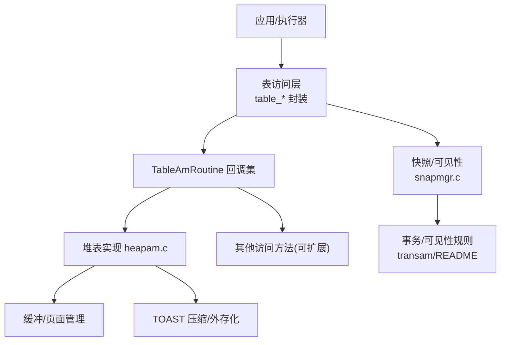
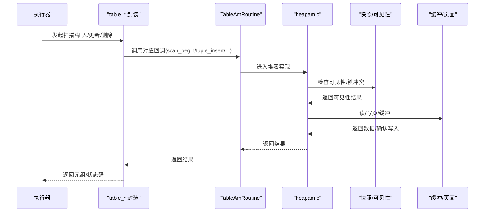
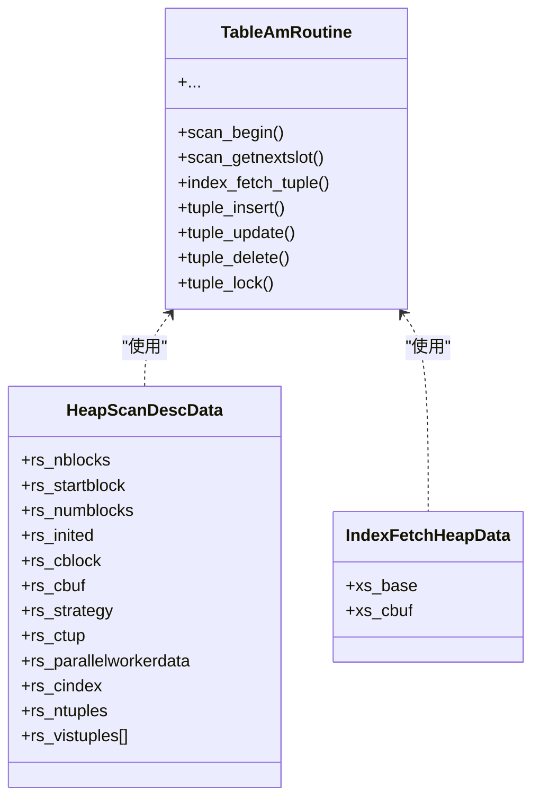
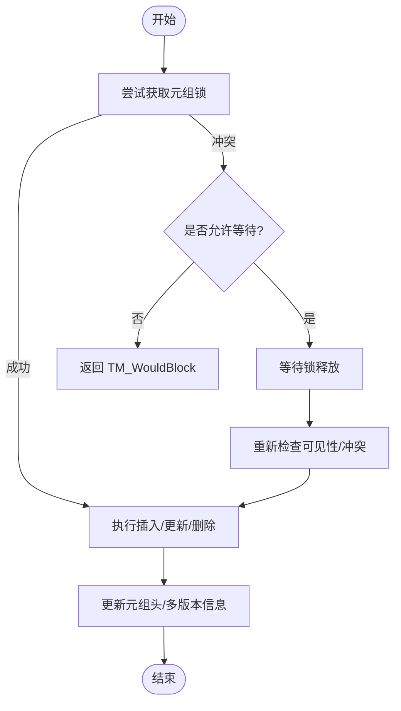
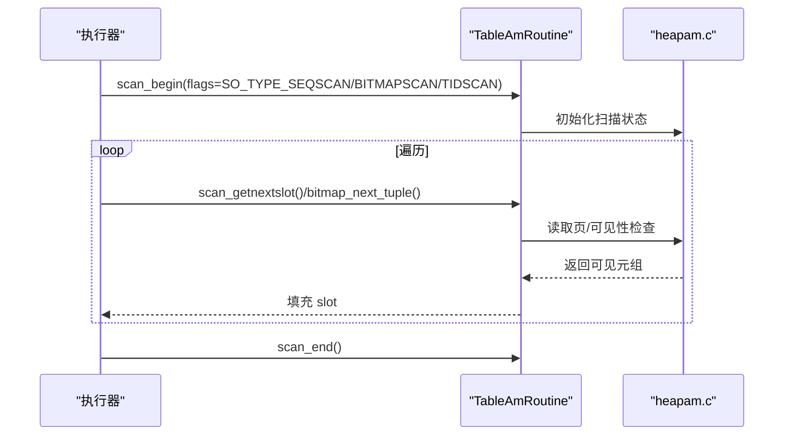
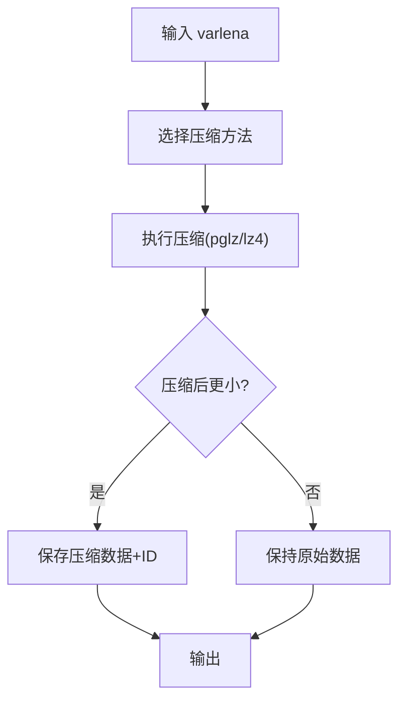
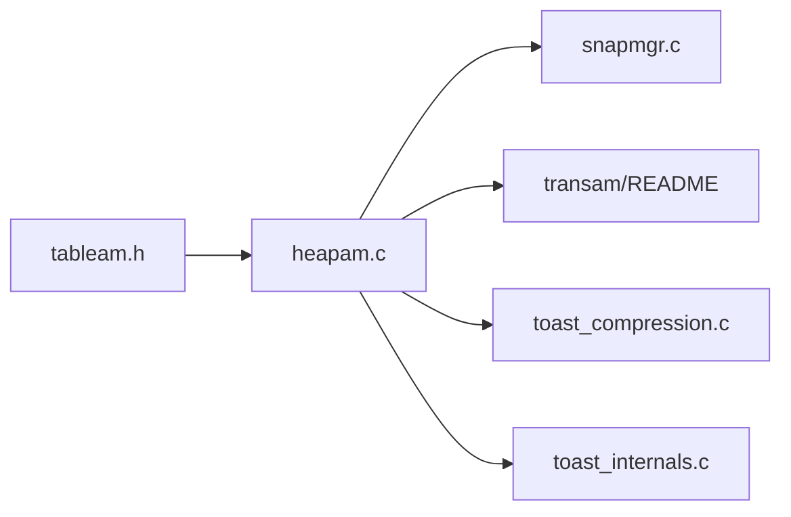

# 访问方法

<cite>
**本文引用的文件**
- [src/include/access/tableam.h](file://src/include/access/tableam.h)
- [src/include/access/heapam.h](file://src/include/access/heapam.h)
- [src/backend/access/heap/heapam.c](file://src/backend/access/heap/heapam.c)
- [src/include/access/toast_compression.h](file://src/include/access/toast_compression.h)
- [src/backend/access/common/toast_compression.c](file://src/backend/access/common/toast_compression.c)
- [src/backend/access/common/toast_internals.c](file://src/backend/access/common/toast_internals.c)
- [src/backend/utils/time/snapmgr.c](file://src/backend/utils/time/snapmgr.c)
- [src/backend/access/transam/README](file://src/backend/access/transam/README)
</cite>

## 目录
1. [简介](#简介)
2. [项目结构](#项目结构)
3. [核心组件](#核心组件)
4. [架构总览](#架构总览)
5. [详细组件分析](#详细组件分析)
6. [依赖关系分析](#依赖关系分析)
7. [性能考虑](#性能考虑)
8. [故障排除指南](#故障排除指南)
9. [结论](#结论)
10. [附录：扩展存储引擎示例与最佳实践](#附录：扩展存储引擎示例与最佳实践)

## 简介
本开发文档面向希望实现自定义表访问方法（Table Access Method, Table AM）的开发者，系统讲解如何在 PostgreSQL 中实现堆表、外部表和临时表的访问接口，覆盖元组操作、扫描接口、并发控制机制，以及数据序列化、压缩和加密的实现要点。文档同时提供扩展存储引擎支持新数据格式或后端的方法、性能调优建议与故障排除指南。

## 项目结构
PostgreSQL 将“表访问方法”抽象为统一的回调接口，具体实现以堆表（heap）为代表，并通过 TOAST 机制处理大字段压缩与外存化。快照管理与事务子系统提供 MVCC 可见性判定与并发控制基础。

图表来源
- [src/include/access/tableam.h:265-800](file://src/include/access/tableam.h#L265-L800)
- [src/backend/access/heap/heapam.c:1-200](file://src/backend/access/heap/heapam.c#L1-L200)
- [src/backend/utils/time/snapmgr.c:75-105](file://src/backend/utils/time/snapmgr.c#L75-L105)
- [src/backend/access/transam/README:224-244](file://src/backend/access/transam/README#L224-L244)

章节来源
- [src/include/access/tableam.h:265-800](file://src/include/access/tableam.h#L265-L800)
- [src/include/access/heapam.h:47-183](file://src/include/access/heapam.h#L47-L183)
- [src/backend/access/heap/heapam.c:1-200](file://src/backend/access/heap/heapam.c#L1-L200)

## 核心组件
- TableAmRoutine：定义表访问方法的统一回调集合，涵盖扫描、索引获取、元组插入/更新/删除/锁定、并行扫描、VACUUM/ANALYZE、DDL 等。
- HeapScanDescData/IndexFetchHeapData：堆表扫描与基于索引取回元组的描述符，维护当前块、缓冲区、可见元组列表等状态。
- TOAST 压缩：提供 pglz/lz4 内置压缩方法与默认策略，支持切片读取与 ID 映射。
- 快照与可见性：通过 snapmgr 维护当前/辅助/目录快照；transam 文档说明快照一致性约束。

章节来源
- [src/include/access/tableam.h:265-800](file://src/include/access/tableam.h#L265-L800)
- [src/include/access/heapam.h:47-183](file://src/include/access/heapam.h#L47-L183)
- [src/include/access/toast_compression.h:16-74](file://src/include/access/toast_compression.h#L16-L74)
- [src/backend/utils/time/snapmgr.c:75-105](file://src/backend/utils/time/snapmgr.c#L75-L105)
- [src/backend/access/transam/README:224-244](file://src/backend/access/transam/README#L224-L244)

## 架构总览
下图展示从执行器到访问方法再到存储与可见性的调用链，突出扫描、索引取回与元组修改路径。

图表来源
- [src/include/access/tableam.h:265-800](file://src/include/access/tableam.h#L265-L800)
- [src/backend/access/heap/heapam.c:1-200](file://src/backend/access/heap/heapam.c#L1-L200)
- [src/backend/utils/time/snapmgr.c:75-105](file://src/backend/utils/time/snapmgr.c#L75-L105)

## 详细组件分析

### 表访问方法接口（TableAmRoutine）
- 扫描相关：scan_begin/scan_end/scan_rescan/scan_getnextslot、tidrange 扫描、并行扫描估计与初始化。
- 索引取回：index_fetch_begin/reset/end/fetch_tuple，支持 call_again/all_dead 语义。
- 元组非修改操作：tuple_fetch_row_version、tuple_tid_valid、tuple_get_latest_tid、tuple_satisfies_snapshot。
- 元组修改：tuple_insert/multi_insert、tuple_delete、tuple_update、tuple_lock、finish_bulk_insert。
- DDL/维护：relation_set_new_filenode/relation_nontransactional_truncate/copy_data/copy_for_cluster/vacuum/analyze。
- 规划/执行：relation_estimate_size、bitmap 扫描回调。

实现要点
- 所有回调需遵循 MVCC 可见性与锁语义，确保并发安全。
- 对块式存储应实现 tidrange/bitmap 扫描以提升随机访问效率。
- 并行扫描需提供 estimate/initialize/reinitialize 以共享内存协调。

章节来源
- [src/include/access/tableam.h:265-800](file://src/include/access/tableam.h#L265-L800)

### 堆表访问方法（heapam）
- 扫描描述符：HeapScanDescData 包含块计数、起始块、当前块/缓冲、可见元组偏移数组等。
- 索引取回：IndexFetchHeapData 维护当前堆缓冲。
- 可见性：提供 HeapTupleSatisfiesVisibility/Update/Vacuum 等函数用于不同场景的可见性判断。
- 批量/冻结：bulk insert、freeze 与是否需要冻结的判断。
- 删除优化：bottom-up 索引删除与预取优化。

图表来源
- [src/include/access/heapam.h:47-90](file://src/include/access/heapam.h#L47-L90)
- [src/include/access/tableam.h:265-800](file://src/include/access/tableam.h#L265-L800)

章节来源
- [src/include/access/heapam.h:47-183](file://src/include/access/heapam.h#L47-L183)
- [src/backend/access/heap/heapam.c:1-200](file://src/backend/access/heap/heapam.c#L1-L200)

### 元组操作与并发控制
- 元组状态码：TM_Result 表示成功、不可见、被自身或其他事务修改、正在被修改、阻塞等。
- 失败信息：TM_FailureData 携带 ctid/xmax/cmax/traversed 等信息，便于上层定位问题。
- 锁模式与 MultiXact：堆表内部将 LockTupleMode 映射到 heavyweight lock 与 MultiXactStatus，并处理等待/条件等待。
- 可见性判定：结合快照与事务状态，决定元组是否可见。

图表来源
- [src/include/access/tableam.h:71-131](file://src/include/access/tableam.h#L71-L131)
- [src/backend/access/heap/heapam.c:124-182](file://src/backend/access/heap/heapam.c#L124-L182)

章节来源
- [src/include/access/tableam.h:71-131](file://src/include/access/tableam.h#L71-L131)
- [src/backend/access/heap/heapam.c:124-182](file://src/backend/access/heap/heapam.c#L124-L182)

### 扫描接口与并行扫描
- 顺序/位图/TID范围扫描：通过 scan_getnextslot、scan_bitmap_next_block/scan_bitmap_next_tuple、scan_set_tidrange/scan_getnextslot_tidrange 实现。
- 并行扫描：parallelscan_estimate/initialize/reinitialize 提供共享内存分配与重初始化能力。
- 同步扫描：SO_ALLOW_SYNC 标志控制是否参与同步扫描逻辑。

图表来源
- [src/include/access/tableam.h:287-357](file://src/include/access/tableam.h#L287-L357)
- [src/include/access/tableam.h:364-383](file://src/include/access/tableam.h#L364-L383)
- [src/include/access/tableam.h:789-800](file://src/include/access/tableam.h#L789-L800)

章节来源
- [src/include/access/tableam.h:287-357](file://src/include/access/tableam.h#L287-L357)
- [src/include/access/tableam.h:364-383](file://src/include/access/tableam.h#L364-L383)
- [src/include/access/tableam.h:789-800](file://src/include/access/tableam.h#L789-L800)

### 数据序列化、压缩与外存化（TOAST）
- 压缩方法：pglz/lz4 内置，默认可通过 GUC 配置；名称到方法映射与反查。
- 压缩流程：根据 attcompression 选择方法，压缩后校验尺寸收益，必要时回退不压缩。
- 切片读取：支持 varlena 切片解压，减少不必要的全量加载。
- 外存化：当值过大时自动外存至 TOAST 表，并提供 fetch_toast_slice 回调。

图表来源
- [src/include/access/toast_compression.h:16-74](file://src/include/access/toast_compression.h#L16-L74)
- [src/backend/access/common/toast_compression.c:26-318](file://src/backend/access/common/toast_compression.c#L26-L318)
- [src/backend/access/common/toast_internals.c:53-105](file://src/backend/access/common/toast_internals.c#L53-L105)

章节来源
- [src/include/access/toast_compression.h:16-74](file://src/include/access/toast_compression.h#L16-L74)
- [src/backend/access/common/toast_compression.c:26-318](file://src/backend/access/common/toast_compression.c#L26-L318)
- [src/backend/access/common/toast_internals.c:53-105](file://src/backend/access/common/toast_internals.c#L53-L105)

### 外部表与临时表访问
- 外部表：通常通过 FDW（Foreign Data Wrapper）暴露为“表”，其访问由 FDW 实现 table_* 包装下的特定扫描与取回逻辑，复用快照与可见性框架。
- 临时表：可复用堆表访问方法，但生命周期与持久化行为不同；可通过 relation_set_new_filenode/relation_nontransactional_truncate 定制持久化策略。

章节来源
- [src/include/access/tableam.h:561-613](file://src/include/access/tableam.h#L561-L613)

## 依赖关系分析
- tableam.h 定义了访问方法契约，heapam.c 提供堆表实现，toast 模块提供大字段压缩/外存化，snapmgr 提供快照，transam 文档说明可见性一致性约束。
- 堆表实现依赖缓冲/页面、事务、锁、WAL、统计等子系统。

图表来源
- [src/include/access/tableam.h:265-800](file://src/include/access/tableam.h#L265-L800)
- [src/backend/access/heap/heapam.c:1-200](file://src/backend/access/heap/heapam.c#L1-L200)
- [src/backend/utils/time/snapmgr.c:75-105](file://src/backend/utils/time/snapmgr.c#L75-L105)
- [src/backend/access/transam/README:224-244](file://src/backend/access/transam/README#L224-L244)
- [src/backend/access/common/toast_compression.c:26-318](file://src/backend/access/common/toast_compression.c#L26-L318)
- [src/backend/access/common/toast_internals.c:53-105](file://src/backend/access/common/toast_internals.c#L53-L105)

章节来源
- [src/include/access/tableam.h:265-800](file://src/include/access/tableam.h#L265-L800)
- [src/backend/access/heap/heapam.c:1-200](file://src/backend/access/heap/heapam.c#L1-L200)

## 性能考虑
- 扫描优化
  - 启用位图扫描与 tidrange 扫描以减少随机 IO。
  - 合理设置 SO_ALLOW_STRAT/SO_ALLOW_PAGEMODE 以利用访问策略与页级可见性检查。
- 并行扫描
  - 正确实现 parallelscan_estimate/initialize/reinitialize，避免重复计算与过度共享内存占用。
- 元组修改
  - 使用 bulk insert 与 finish_bulk_insert 降低 WAL/锁开销。
  - 合理使用 freeze 与 vacuum 控制膨胀与可见性成本。
- 压缩
  - 根据数据类型与负载选择合适的压缩方法；对频繁读取的大字段启用切片读取。
- 可见性
  - 避免不必要的快照创建与持有；在热点路径尽量复用现有快照。

[本节为通用指导，无需特定文件引用]

## 故障排除指南
- 常见错误码
  - FDW 错误类：H Vxxx 系列，用于外部数据源异常。
  - 内部错误类：XX000/XX001/XX002，指示内部错误或数据/索引损坏。
- 调试步骤
  - 检查 TM_Result 与 TM_FailureData，定位锁冲突与可见性问题。
  - 使用 pageinspect 等工具检查页结构与可见性位。
  - 开启 WAL 日志与统计，结合 EXPLAIN/ANALYZE 评估计划与执行。
  - 对于压缩/TOAST，验证压缩方法是否有效与切片读取是否正确。

章节来源
- [src/backend/utils/errcodes.h:314-352](file://src/backend/utils/errcodes.h#L314-L352)

## 结论
通过 TableAmRoutine 提供的统一接口，PostgreSQL 实现了高度可扩展的表访问方法体系。堆表作为默认实现，展示了扫描、元组操作、可见性与压缩的核心模式。开发者可据此扩展新的存储后端或数据格式，并结合快照与并发控制保证一致性与性能。

[本节为总结，无需特定文件引用]

## 附录：扩展存储引擎示例与最佳实践
- 实现步骤
  - 定义 TableAmRoutine 并注册 handler，实现必需的回调（如 scan_begin、tuple_insert、tuple_update、tuple_delete、tuple_lock）。
  - 针对块式存储实现 tidrange 与 bitmap 扫描回调，提升随机访问性能。
  - 实现 index_fetch_tuple 以支持基于索引的元组取回，正确处理 call_again/all_dead。
  - 若支持大字段，集成 TOAST 压缩与外存化，或自行实现 relation_needs_toast_table/relation_toast_am/relation_fetch_toast_slice。
  - 实现 DDL 与维护回调（truncate/copy_data/vacuum/analyze），确保生命周期与一致性。
- 并发与可见性
  - 严格遵循 MVCC 可见性规则，参考 transam 文档的一致性要求。
  - 正确使用锁模式与 MultiXact 状态，避免死锁与长事务。
- 性能调优
  - 使用 bulk insert、并行扫描、访问策略与页级可见性检查。
  - 根据数据特征选择压缩方法，启用切片读取。
- 故障排除
  - 借助错误码与诊断工具定位问题；关注锁冲突、可见性误判与压缩异常。

[本节为实践指导，无需特定文件引用]