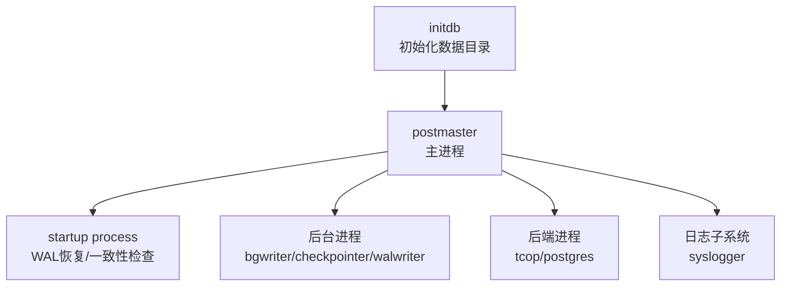
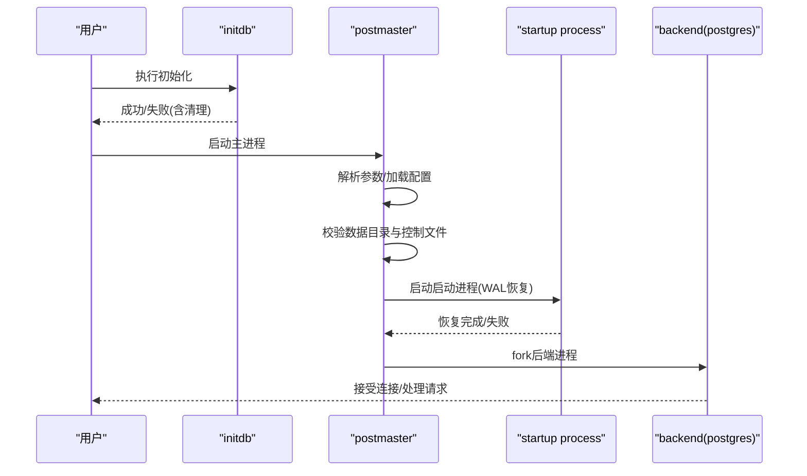
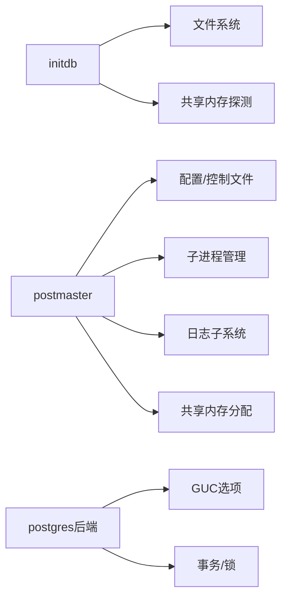

# 启动问题诊断

<cite>
**本文引用的文件**
- [postmaster.c](file://src/backend/postmaster/postmaster.c)
- [initdb.c](file://src/bin/initdb/initdb.c)
- [postgres.c](file://src/backend/tcop/postgres.c)
- [configure.ac](file://configure.ac)
- [pg_regress.c](file://src/test/regress/pg_regress.c)
- [shm_toc.c](file://src/backend/storage/ipc/shm_toc.c)
- [d2s_full_table.h](file://src/common/d2s_full_table.h)
- [postgresql.conf.sample](file://src/test/modules/snapshot_too_old/tmp_check_iso/data/postgresql.conf)
</cite>

## 目录
1. [简介](#简介)
2. [项目结构](#项目结构)
3. [核心组件](#核心组件)
4. [架构总览](#架构总览)
5. [详细组件分析](#详细组件分析)
6. [依赖关系分析](#依赖关系分析)
7. [性能与资源考量](#性能与资源考量)
8. [故障排查指南](#故障排查指南)
9. [结论](#结论)
10. [附录](#附录)

## 简介
本指南面向DBA与运维工程师，聚焦PostgreSQL在“初始化”和“启动”阶段的常见问题与定位方法。内容覆盖：
- initdb初始化失败的原因、错误处理与恢复机制
- Postmaster进程启动失败的诊断步骤（日志分析、系统资源检查、依赖验证）
- 常见错误消息示例及对应解决方案（配置文件错误、权限问题、端口冲突、磁盘空间不足等）
- 快速定位与解决启动问题的实用工具与方法

## 项目结构
与启动问题直接相关的代码主要分布在以下模块：
- 初始化：initdb（数据库集群初始化）
- 主进程：postmaster（管理子进程、监听端口、状态机）
- 后端入口：tcop/postgres（单用户/独立后端启动流程）
- 配置：默认端口、数据目录、控制文件校验
- 共享内存：动态共享内存分配与限制
- 测试与回归：模拟端口占用、启动重试、日志输出

图表来源
- [postmaster.c:407-800](file://src/backend/postmaster/postmaster.c#L407-L800)
- [postgres.c:3988-4130](file://src/backend/tcop/postgres.c#L3988-L4130)
- [initdb.c:1-150](file://src/bin/initdb/initdb.c#L1-L150)

章节来源
- [postmaster.c:407-800](file://src/backend/postmaster/postmaster.c#L407-L800)
- [initdb.c:1-150](file://src/bin/initdb/initdb.c#L1-L150)

## 核心组件
- initdb：负责创建数据目录、生成控制文件、模板库与默认数据库；包含权限检查、文件系统操作、配置探测与回滚清理。
- postmaster：主进程，负责解析参数、选择配置、校验数据目录与控制文件、创建锁文件、启动子进程、监听端口、维护状态机。
- tcop/postgres：后端进程入口，负责参数解析、环境初始化、读取控制文件、初始化进程与事务循环。
- 共享内存：动态共享内存分配器，提供段内布局与容量检查，避免溢出与越界。
- 配置：默认端口、数据目录路径、控制文件校验逻辑。

章节来源
- [initdb.c:1-150](file://src/bin/initdb/initdb.c#L1-L150)
- [postmaster.c:407-800](file://src/backend/postmaster/postmaster.c#L407-L800)
- [postgres.c:3988-4130](file://src/backend/tcop/postgres.c#L3988-L4130)
- [shm_toc.c:88-125](file://src/backend/storage/ipc/shm_toc.c#L88-L125)
- [configure.ac:113-140](file://configure.ac#L113-L140)

## 架构总览
PostgreSQL启动的关键阶段如下：
1. 初始化阶段（initdb）
   - 校验运行用户（非root）、创建数据目录、写入版本文件、生成空配置、探测共享内存实现与默认参数。
   - 失败时清理已创建的文件/目录（可配置保留）。
2. 主进程启动（postmaster）
   - 解析命令行参数，选择并加载配置文件，校验数据目录与控制文件，创建数据目录锁文件。
   - 启动日志记录器、后台进程、监听TCP/Unix套接字，进入状态机等待连接。
3. 后端进程（postgres）
   - 独立模式或作为子进程启动，读取控制文件，初始化进程上下文，进入请求处理循环。

图表来源
- [initdb.c:451-497](file://src/bin/initdb/initdb.c#L451-L497)
- [postmaster.c:705-793](file://src/backend/postmaster/postmaster.c#L705-L793)
- [postgres.c:3988-4130](file://src/backend/tcop/postgres.c#L3988-L4130)

## 详细组件分析

### initdb 初始化流程与错误处理
- 关键职责
  - 校验运行用户（禁止root），创建数据目录与必要子目录，写入PG_VERSION与空配置文件。
  - 探测动态共享内存实现（POSIX优先，回退System V），尝试最小化配置以评估系统能力。
  - 失败时自动清理（可配置保留），便于重试。
- 错误处理与恢复
  - 文件读写失败、目录不存在、权限不足等会记录错误并退出。
  - 通过cleanup_directories_atexit在失败时删除已创建的临时数据目录/WAL目录（除非noclean）。
- 常见问题与定位
  - 以root运行：拒绝执行并提示使用普通用户。
  - 无法写入文件或目录：检查磁盘空间与权限。
  - 共享内存不可用：根据平台回退到System V或调整内核参数。

章节来源
- [initdb.c:504-521](file://src/bin/initdb/initdb.c#L504-L521)
- [initdb.c:660-690](file://src/bin/initdb/initdb.c#L660-L690)
- [initdb.c:697-800](file://src/bin/initdb/initdb.c#L697-L800)
- [initdb.c:451-497](file://src/bin/initdb/initdb.c#L451-L497)

### Postmaster 启动流程与状态机
- 关键职责
  - 解析命令行参数（包括端口、数据目录、调试级别等），选择并加载配置文件。
  - 校验数据目录与控制文件，创建数据目录锁文件，切换工作目录。
  - 启动日志子系统、后台进程，监听端口，进入PM_*状态机。
- 状态机要点
  - PM_INIT → PM_STARTUP → PM_RECOVERY/PM_HOT_STANDBY → PM_RUN
  - 正常启动后允许新连接；异常时进入停止或等待状态。
- 常见问题与定位
  - 配置文件错误或数据目录不一致：在SelectConfigFiles/LocalProcessControlFile阶段失败。
  - 端口被占用：监听失败，需检查端口占用与防火墙规则。
  - 共享内存不足：后台进程启动失败，查看日志中的共享内存相关错误。

章节来源
- [postmaster.c:407-800](file://src/backend/postmaster/postmaster.c#L407-L800)
- [postmaster.c:280-327](file://src/backend/postmaster/postmaster.c#L280-L327)

### 后端进程（postgres）启动与初始化
- 关键职责
  - 解析参数（支持--single等），初始化GUC选项，创建数据目录锁文件，读取控制文件。
  - 初始化进程上下文与事务环境，进入主循环处理客户端请求。
- 常见问题与定位
  - 参数错误：在process_postgres_switches阶段报错。
  - 控制文件损坏或不一致：LocalProcessControlFile失败。
  - 权限不足：无法打开数据目录或文件。

章节来源
- [postgres.c:3988-4130](file://src/backend/tcop/postgres.c#L3988-L4130)
- [postgres.c:3746-3939](file://src/backend/tcop/postgres.c#L3746-L3939)

### 共享内存与系统资源
- 动态共享内存
  - shm_toc用于在共享内存段内进行对齐分配与容量检查，防止溢出。
  - 若分配失败，返回“out of shared memory”，需调整内核参数或减少配置。
- 系统资源检查
  - 默认端口范围校验（1-65535），避免非法端口导致绑定失败。
  - 测试用例中演示了端口占用检测与重试策略。

章节来源
- [shm_toc.c:88-125](file://src/backend/storage/ipc/shm_toc.c#L88-L125)
- [configure.ac:113-140](file://configure.ac#L113-L140)
- [pg_regress.c:2295-2317](file://src/test/regress/pg_regress.c#L2295-L2317)

## 依赖关系分析
- initdb依赖文件系统API、用户信息获取、共享内存探测。
- postmaster依赖配置解析、控制文件校验、信号处理、子进程管理。
- postgres后端依赖GUC选项、进程上下文、事务子系统。
- 共享内存子系统为各组件提供跨进程通信基础。

图表来源
- [initdb.c:660-690](file://src/bin/initdb/initdb.c#L660-L690)
- [postmaster.c:705-793](file://src/backend/postmaster/postmaster.c#L705-L793)
- [shm_toc.c:88-125](file://src/backend/storage/ipc/shm_toc.c#L88-L125)

章节来源
- [initdb.c:660-690](file://src/bin/initdb/initdb.c#L660-L690)
- [postmaster.c:705-793](file://src/backend/postmaster/postmaster.c#L705-L793)
- [shm_toc.c:88-125](file://src/backend/storage/ipc/shm_toc.c#L88-L125)

## 性能与资源考量
- 共享内存大小与max_connections、shared_buffers的耦合：initdb会尝试不同组合以确定可行配置。
- 默认端口与网络栈：确保端口可用且未被其他服务占用。
- 日志与调试：启用适当日志级别有助于定位启动问题，但需注意磁盘空间。

[本节为通用指导，不直接分析具体文件]

## 故障排查指南

### 初始化失败（initdb）
- 常见原因
  - 以root运行：程序拒绝执行并提示使用普通用户。
  - 数据目录不可写：检查磁盘空间、目录权限与SELinux/AppArmor策略。
  - 共享内存不可用：根据平台回退或调整内核参数（如shmmax/shmall）。
- 错误处理与恢复
  - 失败时自动清理已创建的数据目录/WAL目录（除非指定保留）。
  - 建议查看详细日志，确认失败点后再重试。
- 示例与解决
  - “cannot be run as root”：切换到普通用户重新执行initdb。
  - “could not write file ...”：释放磁盘空间或修复权限。
  - “out of shared memory”：调整内核共享内存限制或降低配置。

章节来源
- [initdb.c:504-521](file://src/bin/initdb/initdb.c#L504-L521)
- [initdb.c:451-497](file://src/bin/initdb/initdb.c#L451-L497)
- [shm_toc.c:112-119](file://src/backend/storage/ipc/shm_toc.c#L112-L119)

### Postmaster启动失败
- 常见原因
  - 配置文件错误：参数无效或路径不正确。
  - 数据目录不一致：控制文件校验失败。
  - 端口冲突：监听端口被占用。
  - 权限问题：无法访问数据目录或套接字目录。
  - 共享内存不足：后台进程无法启动。
- 诊断步骤
  - 查看服务器日志（syslogger输出），关注FATAL/PANIC级别错误。
  - 检查数据目录锁文件（postmaster.pid）是否存在，避免重复启动。
  - 检查端口占用（netstat/ss）与防火墙规则。
  - 检查系统资源（ulimit、内核共享内存参数）。
- 示例与解决
  - “port already in use”：更换端口或终止占用进程。
  - “invalid data directory”：修正PGDATA或数据目录权限。
  - “out of shared memory”：调整内核参数或降低shared_buffers/max_connections。

章节来源
- [postmaster.c:705-793](file://src/backend/postmaster/postmaster.c#L705-L793)
- [postmaster.c:407-800](file://src/backend/postmaster/postmaster.c#L407-L800)
- [configure.ac:113-140](file://configure.ac#L113-L140)

### 后端进程启动失败
- 常见原因
  - 参数错误：命令行选项无效。
  - 控制文件损坏：无法读取或校验失败。
  - 权限不足：无法打开数据目录或文件。
- 诊断步骤
  - 使用--single模式单独启动后端，观察错误输出。
  - 检查控制文件与数据目录一致性。
  - 查看日志中的SQLSTATE与错误详情。
- 示例与解决
  - “invalid option”：修正命令行参数。
  - “control file corrupted”：从备份恢复或重建实例。
  - “permission denied”：修正数据目录权限与所有者。

章节来源
- [postgres.c:3988-4130](file://src/backend/tcop/postgres.c#L3988-L4130)
- [postgres.c:3746-3939](file://src/backend/tcop/postgres.c#L3746-L3939)

### 端口冲突与网络问题
- 现象
  - 启动时报端口占用或无法绑定。
- 排查
  - 使用系统工具检查端口占用情况。
  - 确认防火墙未阻止所需端口。
  - 修改默认端口或释放冲突端口。
- 参考
  - 测试脚本中包含端口占用检测与重试逻辑。

章节来源
- [pg_regress.c:2295-2317](file://src/test/regress/pg_regress.c#L2295-L2317)
- [configure.ac:113-140](file://configure.ac#L113-L140)

### 磁盘空间与文件系统问题
- 现象
  - 初始化或启动过程中出现写入失败。
- 排查
  - 检查磁盘剩余空间与inode数量。
  - 验证文件系统挂载选项与配额限制。
  - 检查日志中的文件系统错误码。
- 解决
  - 清理无用文件或扩容磁盘。
  - 调整文件系统或挂载参数。

章节来源
- [initdb.c:451-497](file://src/bin/initdb/initdb.c#L451-L497)
- [file_utils.c:150-196](file://src/common/file_utils.c#L150-L196)

### 共享内存与系统资源
- 现象
  - 后台进程无法启动或报共享内存不足。
- 排查
  - 检查内核共享内存参数（shmmax/shmall）。
  - 调整shared_buffers与max_connections以降低需求。
- 解决
  - 提升内核限制或优化配置。

章节来源
- [shm_toc.c:112-119](file://src/backend/storage/ipc/shm_toc.c#L112-L119)
- [initdb.c:697-800](file://src/bin/initdb/initdb.c#L697-L800)

## 结论
- 启动问题通常集中在配置、权限、端口与系统资源四个方面。
- initdb与postmaster提供了完善的错误处理与恢复机制，利用日志与工具可快速定位问题。
- 建议在生产环境中启用合适的日志级别，定期巡检系统资源与配置一致性。

[本节为总结性内容，不直接分析具体文件]

## 附录

### 常用命令与工具
- 初始化：initdb -D <data_dir>
- 启动：pg_ctl start -D <data_dir>
- 查看日志：tail -f <data_dir>/log/postgresql-*.log
- 端口检查：ss -tlnp | grep <port>
- 共享内存：ipcs -lm / sysctl kernel.shm*

[本节为通用指导，不直接分析具体文件]

### 配置参考
- 默认端口：可通过构建参数或运行时配置修改。
- 数据目录：确保PGDATA指向正确目录，具备合适权限。
- 控制文件：位于数据目录根，供postmaster校验一致性。

章节来源
- [configure.ac:113-140](file://configure.ac#L113-L140)
- [postgresql.conf.sample:35-55](file://src/test/modules/snapshot_too_old/tmp_check_iso/data/postgresql.conf#L35-L55)