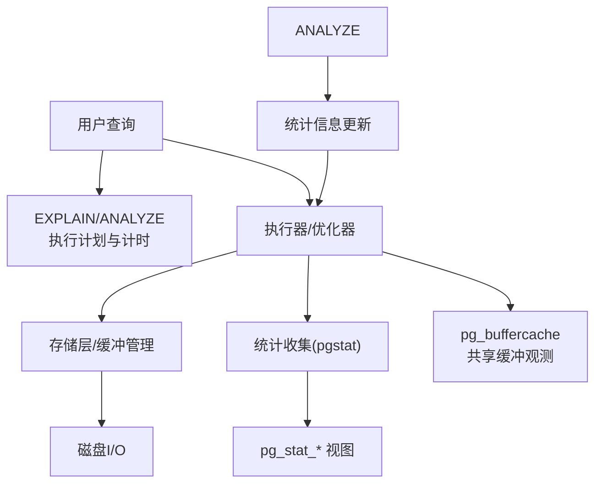
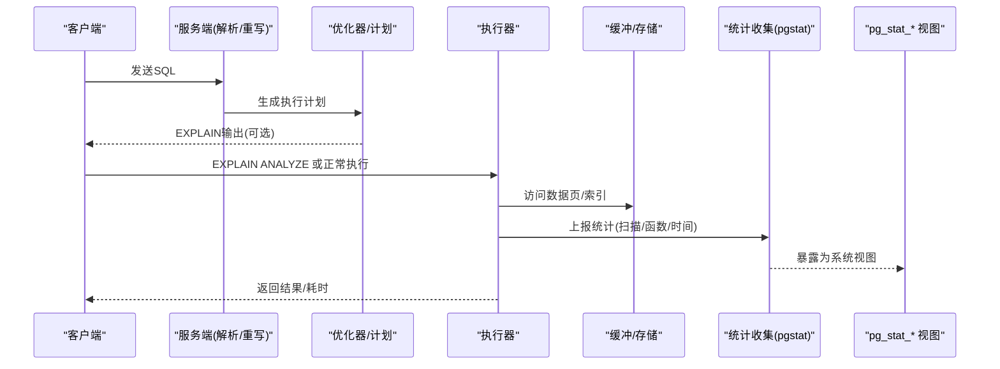
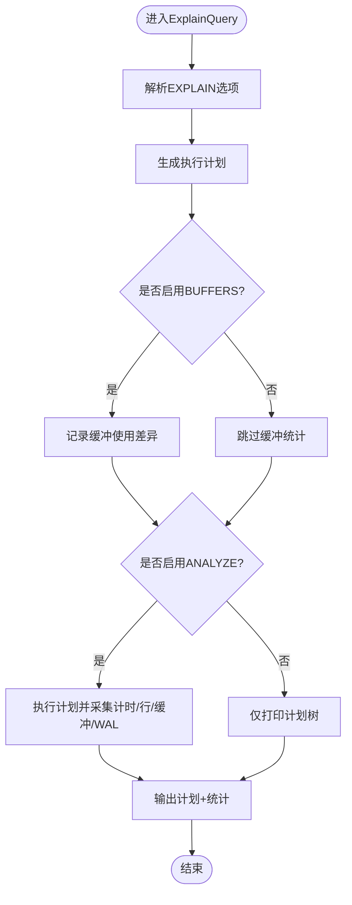
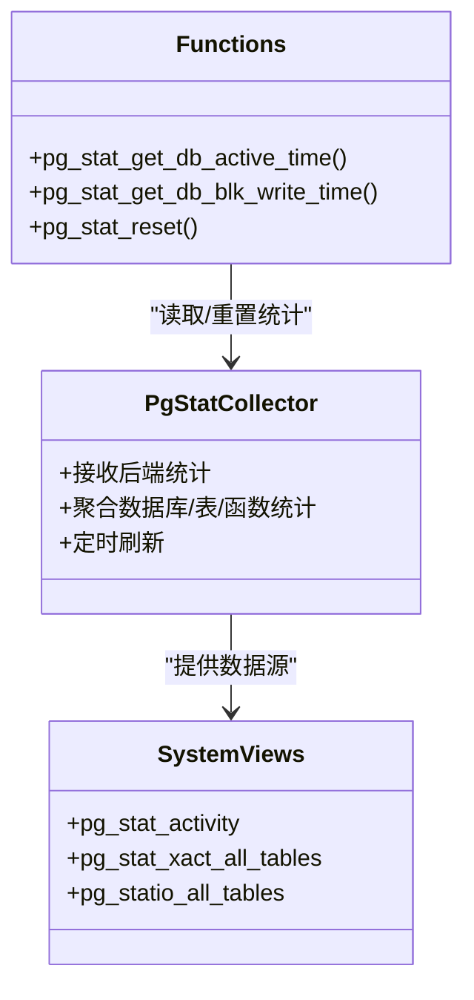
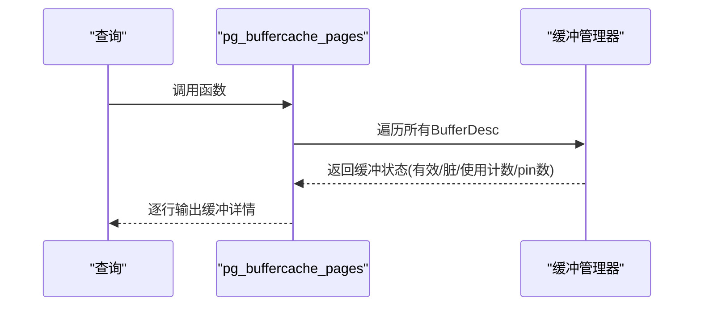
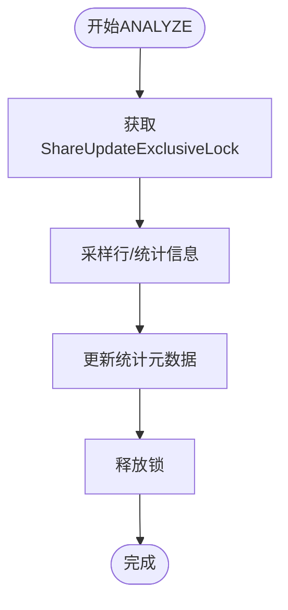
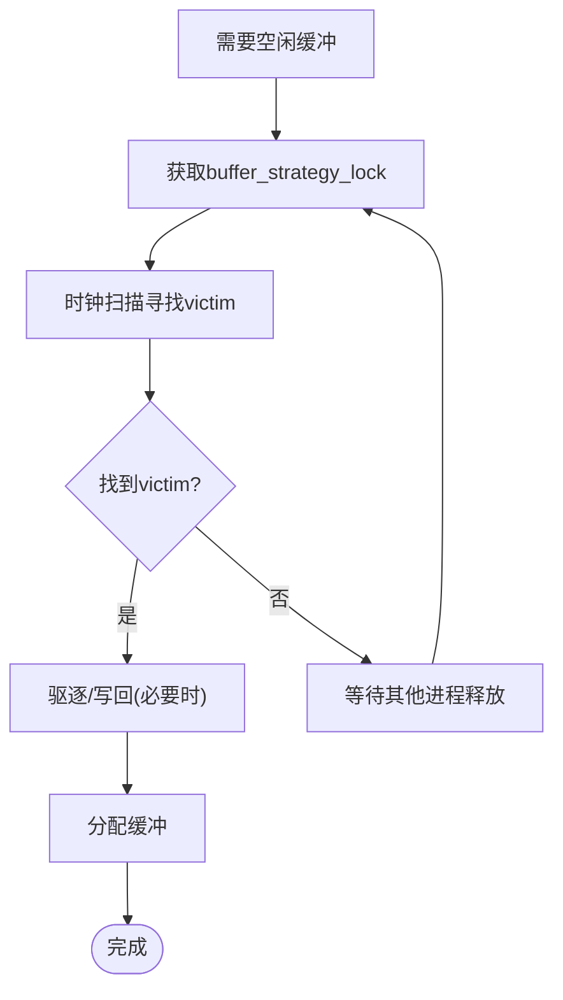
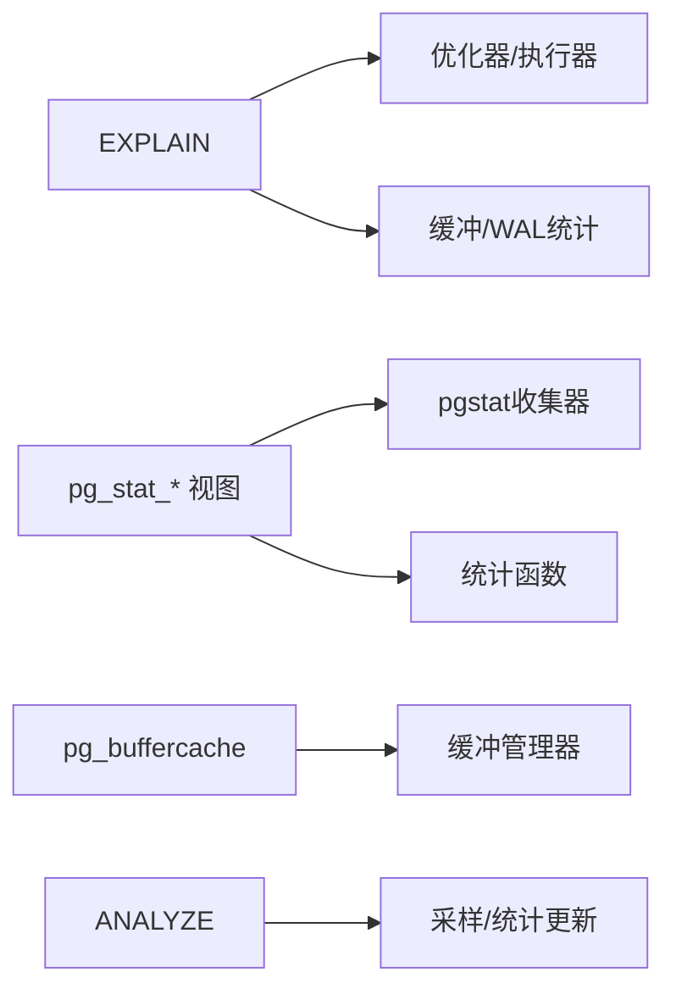

# 性能问题排查

<cite>
**本文引用的文件**
- [explain.c](file://src/backend/commands/explain.c)
- [pgstatfuncs.c](file://src/backend/utils/adt/pgstatfuncs.c)
- [system_views.sql](file://src/backend/catalog/system_views.sql)
- [pg_buffercache_pages.c](file://contrib/pg_buffercache/pg_buffercache_pages.c)
- [pgbuffercache.sgml](file://doc/src/sgml/pgbuffercache.sgml)
- [perform.sgml](file://doc/src/sgml/perform.sgml)
- [monitoring.sgml](file://doc/src/sgml/monitoring.sgml)
- [analyze.c](file://src/backend/commands/analyze.c)
- [pgstat.c](file://src/backend/postmaster/pgstat.c)
- [README（缓冲管理器）](file://src/backend/storage/buffer/README)
</cite>

## 目录
1. [简介](#简介)
2. [项目结构](#项目结构)
3. [核心组件](#核心组件)
4. [架构总览](#架构总览)
5. [详细组件分析](#详细组件分析)
6. [依赖关系分析](#依赖关系分析)
7. [性能考量](#性能考量)
8. [故障排查指南](#故障排查指南)
9. [结论](#结论)
10. [附录](#附录)

## 简介
本指南面向PostgreSQL开发者与DBA，聚焦查询慢、资源争用与系统级瓶颈的定位与优化。内容覆盖：
- 常见慢查询根因：索引缺失、统计信息不准确、锁竞争、缓冲区命中率低等
- 监控与分析工具：pg_stat_*视图、EXPLAIN/EXPLAIN ANALYZE、pg_buffercache、pgstattuple、pgstat子系统
- 内存使用、I/O性能、并发性能的调优方法
- 基准测试与瓶颈识别的实用技巧
- 最佳实践与定位流程

## 项目结构
围绕性能排查的关键代码与文档分布如下：
- 执行计划与开销分析：EXPLAIN命令实现位于后端命令层
- 统计信息收集与展示：pgstat子系统与系统视图
- 共享缓冲缓存观测：pg_buffercache扩展
- 统计信息生成：ANALYZE命令
- 性能与监控文档：perform与monitoring章节

**图示来源**
- [explain.c:152-292](file://src/backend/commands/explain.c#L152-L292)
- [pgstatfuncs.c:333-399](file://src/backend/utils/adt/pgstatfuncs.c#L333-L399)
- [pg_buffercache_pages.c:64-179](file://contrib/pg_buffercache/pg_buffercache_pages.c#L64-L179)
- [analyze.c:123-200](file://src/backend/commands/analyze.c#L123-L200)

**章节来源**
- [explain.c:152-292](file://src/backend/commands/explain.c#L152-L292)
- [pgstatfuncs.c:333-399](file://src/backend/utils/adt/pgstatfuncs.c#L333-L399)
- [pg_buffercache_pages.c:64-179](file://contrib/pg_buffercache/pg_buffercache_pages.c#L64-L179)
- [analyze.c:123-200](file://src/backend/commands/analyze.c#L123-L200)

## 核心组件
- EXPLAIN/EXPLAIN ANALYZE：输出执行计划、成本估算、实际运行时间与缓冲/WAL使用
- pg_stat_* 视图：表/索引扫描、函数调用、数据库会话时间、I/O命中/读取等
- pg_buffercache：实时查看共享缓冲中页的归属、脏标记、使用计数、被pin数量
- ANALYZE：采样并更新列/索引统计信息，提升优化器估计准确性
- pgstat子系统：后台收集器聚合各后端统计，提供统一查询接口

**章节来源**
- [explain.c:152-292](file://src/backend/commands/explain.c#L152-L292)
- [system_views.sql:323-386](file://src/backend/catalog/system_views.sql#L323-L386)
- [pgbuffercache.sgml:10-30](file://doc/src/sgml/pgbuffercache.sgml#L10-L30)
- [analyze.c:123-200](file://src/backend/commands/analyze.c#L123-L200)
- [pgstat.c:71-129](file://src/backend/postmaster/pgstat.c#L71-L129)

## 架构总览
下图展示了从SQL到执行计划、执行、统计收集与可视化的整体链路：

**图示来源**
- [explain.c:330-578](file://src/backend/commands/explain.c#L330-L578)
- [pgstatfuncs.c:1498-1553](file://src/backend/utils/adt/pgstatfuncs.c#L1498-L1553)
- [system_views.sql:450-475](file://src/backend/catalog/system_views.sql#L450-L475)

## 详细组件分析

### EXPLAIN/EXPLAIN ANALYZE 工作流
- 解析选项：ANALYZE、VERBOSE、COSTS、BUFFERS、WAL、TIMING、SUMMARY、FORMAT
- 若启用BUFFERS/WAL/TIMING，则在规划与执行阶段采集相应指标
- 支持JSON/YAML/TEXT等多格式输出，便于自动化分析

**图示来源**
- [explain.c:152-292](file://src/backend/commands/explain.c#L152-L292)
- [explain.c:330-578](file://src/backend/commands/explain.c#L330-L578)

**章节来源**
- [explain.c:152-292](file://src/backend/commands/explain.c#L152-L292)
- [explain.c:330-578](file://src/backend/commands/explain.c#L330-L578)

### 统计信息收集与展示（pg_stat_*）
- 通过pgstat子系统在后台收集后端上报的统计，包括表扫描、函数调用、数据库会话时间、I/O时间等
- 系统视图将统计以可读形式暴露，如活动会话、事务级表统计、I/O命中/读取等

**图示来源**
- [pgstat.c:71-129](file://src/backend/postmaster/pgstat.c#L71-L129)
- [pgstatfuncs.c:333-399](file://src/backend/utils/adt/pgstatfuncs.c#L333-L399)
- [pgstatfuncs.c:1498-1553](file://src/backend/utils/adt/pgstatfuncs.c#L1498-L1553)
- [system_views.sql:323-386](file://src/backend/catalog/system_views.sql#L323-L386)
- [system_views.sql:450-475](file://src/backend/catalog/system_views.sql#L450-L475)

**章节来源**
- [pgstat.c:71-129](file://src/backend/postmaster/pgstat.c#L71-L129)
- [pgstatfuncs.c:333-399](file://src/backend/utils/adt/pgstatfuncs.c#L333-L399)
- [pgstatfuncs.c:1498-1553](file://src/backend/utils/adt/pgstatfuncs.c#L1498-L1553)
- [system_views.sql:323-386](file://src/backend/catalog/system_views.sql#L323-L386)
- [system_views.sql:450-475](file://src/backend/catalog/system_views.sql#L450-L475)

### 共享缓冲缓存观测（pg_buffercache）
- 通过pg_buffercache_pages函数遍历共享缓冲，返回每个缓冲的标识、所属关系、块号、脏标记、使用计数、被pin的后端数
- 视图pg_buffercache封装该函数，便于按数据库/表维度统计缓冲占用

**图示来源**
- [pg_buffercache_pages.c:64-179](file://contrib/pg_buffercache/pg_buffercache_pages.c#L64-L179)
- [pgbuffercache.sgml:10-30](file://doc/src/sgml/pgbuffercache.sgml#L10-L30)

**章节来源**
- [pg_buffercache_pages.c:64-179](file://contrib/pg_buffercache/pg_buffercache_pages.c#L64-L179)
- [pgbuffercache.sgml:10-30](file://doc/src/sgml/pgbuffercache.sgml#L10-L30)

### 统计信息生成（ANALYZE）
- ANALYZE对表进行采样，计算列分布、多值列、扩展统计等，写入系统统计
- 通过ShareUpdateExclusiveLock避免并发ANALYZE冲突，同时与VACUUM协调
- 默认统计目标由GUC控制，影响采样精度与统计质量

**图示来源**
- [analyze.c:123-200](file://src/backend/commands/analyze.c#L123-L200)

**章节来源**
- [analyze.c:123-200](file://src/backend/commands/analyze.c#L123-L200)

### 缓冲替换策略与锁机制
- 缓冲管理器使用自旋锁与轻量锁保护缓冲头与内容访问
- 采用时钟扫描算法选择victim buffer，减少全局锁持有时间
- BM_IO_IN_PROGRESS标志用于等待I/O完成

**图示来源**
- [README（缓冲管理器）:130-182](file://src/backend/storage/buffer/README#L130-L182)

**章节来源**
- [README（缓冲管理器）:130-182](file://src/backend/storage/buffer/README#L130-L182)

## 依赖关系分析
- EXPLAIN依赖优化器/执行器与缓冲/WAL统计接口
- pg_stat_*视图依赖pgstat收集器与后端上报函数
- pg_buffercache依赖缓冲管理器内部结构
- ANALYZE依赖表访问、采样与统计写入路径

**图示来源**
- [explain.c:152-292](file://src/backend/commands/explain.c#L152-L292)
- [pgstatfuncs.c:333-399](file://src/backend/utils/adt/pgstatfuncs.c#L333-L399)
- [pg_buffercache_pages.c:64-179](file://contrib/pg_buffercache/pg_buffercache_pages.c#L64-L179)
- [analyze.c:123-200](file://src/backend/commands/analyze.c#L123-L200)

**章节来源**
- [explain.c:152-292](file://src/backend/commands/explain.c#L152-L292)
- [pgstatfuncs.c:333-399](file://src/backend/utils/adt/pgstatfuncs.c#L333-L399)
- [pg_buffercache_pages.c:64-179](file://contrib/pg_buffercache/pg_buffercache_pages.c#L64-L179)
- [analyze.c:123-200](file://src/backend/commands/analyze.c#L123-L200)

## 性能考量
- 索引与统计：确保常用过滤/连接条件有合适索引；定期ANALYZE保证统计准确
- 缓冲命中率：通过pg_statio_*与pg_buffercache观察热点对象与脏页比例
- I/O与WAL：结合EXPLAIN BUFFERS/WAL与pg_stat数据库级I/O时间，定位慢读/慢写
- 锁竞争：关注pg_stat_activity等待事件与长时间事务；必要时调整隔离级别或批大小
- 内存与临时对象：监控排序/哈希使用的临时块，必要时增大work_mem或改写查询以减少排序

[本节为通用指导，不直接分析具体文件]

## 故障排查指南

### 慢查询定位流程
1. 使用EXPLAIN ANALYZE获取计划与实际耗时，重点关注高成本节点与行估算偏差
2. 开启BUFFERS/WAL观察缓冲命中与磁盘读取、WAL写入
3. 检查pg_stat_xact_all_tables/pg_statio_all_tables定位热点表/索引
4. 使用pg_buffercache查看共享缓冲占用与脏页情况
5. 核对ANALYZE频率与统计目标，必要时手动ANALYZE或调整default_statistics_target
6. 检查pg_stat_activity等待事件与长事务，识别锁竞争

**章节来源**
- [explain.c:152-292](file://src/backend/commands/explain.c#L152-L292)
- [system_views.sql:323-386](file://src/backend/catalog/system_views.sql#L323-L386)
- [pgbuffercache.sgml:10-30](file://doc/src/sgml/pgbuffercache.sgml#L10-L30)
- [analyze.c:123-200](file://src/backend/commands/analyze.c#L123-L200)

### 常见问题与对策
- 索引缺失/失效：EXPLAIN显示Seq Scan且无可用索引；创建或重建索引，检查表达式/类型匹配
- 统计信息不准：估算行数与真实行数差距大；执行ANALYZE，调整统计目标
- 锁竞争：pg_stat_activity出现等待；缩短事务、拆分批量、避免长事务持有强锁
- 缓冲区命中率低：pg_statio显示大量read；增加shared_buffers、优化热数据访问模式、减少随机读
- WAL压力大：EXPLAIN WAL显示高写入；合并写入、降低同步级别（谨慎）、优化批量提交

**章节来源**
- [explain.c:330-578](file://src/backend/commands/explain.c#L330-L578)
- [pgstatfuncs.c:1498-1553](file://src/backend/utils/adt/pgstatfuncs.c#L1498-L1553)
- [system_views.sql:450-475](file://src/backend/catalog/system_views.sql#L450-L475)

### 基准测试与瓶颈识别技巧
- 使用EXPLAIN ANALYZE对比不同计划/参数下的实际耗时与资源消耗
- 利用pg_stat数据库级活跃时间/会话时间评估负载变化
- 通过pg_buffercache与pg_statio定位热点对象与I/O热点
- 使用pgstattuple等扩展辅助分析表碎片与索引密度（如需）

**章节来源**
- [explain.c:152-292](file://src/backend/commands/explain.c#L152-L292)
- [pgstatfuncs.c:1498-1553](file://src/backend/utils/adt/pgstatfuncs.c#L1498-L1553)
- [pgbuffercache.sgml:10-30](file://doc/src/sgml/pgbuffercache.sgml#L10-L30)

## 结论
通过EXPLAIN/ANALYZE、pg_stat_*、pg_buffercache与ANALYZE的组合，可系统化定位慢查询根因并实施针对性优化。建议建立常态化的监控与基线，持续跟踪统计质量与资源使用，逐步迭代查询与配置，以获得稳定高效的性能表现。

[本节为总结性内容，不直接分析具体文件]

## 附录
- 参考文档：perform与monitoring章节提供性能与监控的系统性说明
- 相关视图与函数：pg_stat_*系列、pg_buffercache、pg_stat_reset等

**章节来源**
- [perform.sgml:1-200](file://doc/src/sgml/perform.sgml#L1-L200)
- [monitoring.sgml:1-200](file://doc/src/sgml/monitoring.sgml#L1-L200)