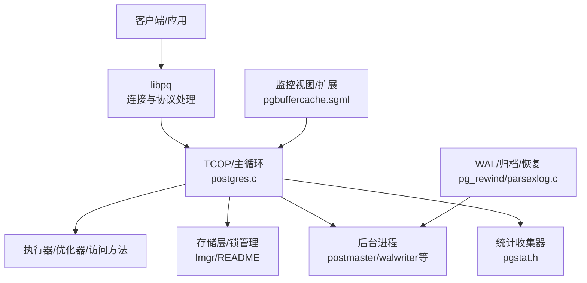
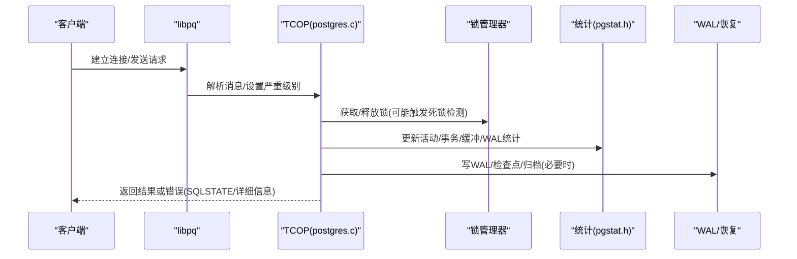
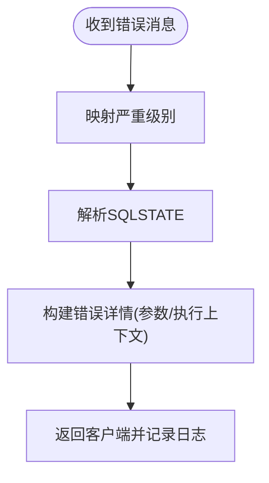
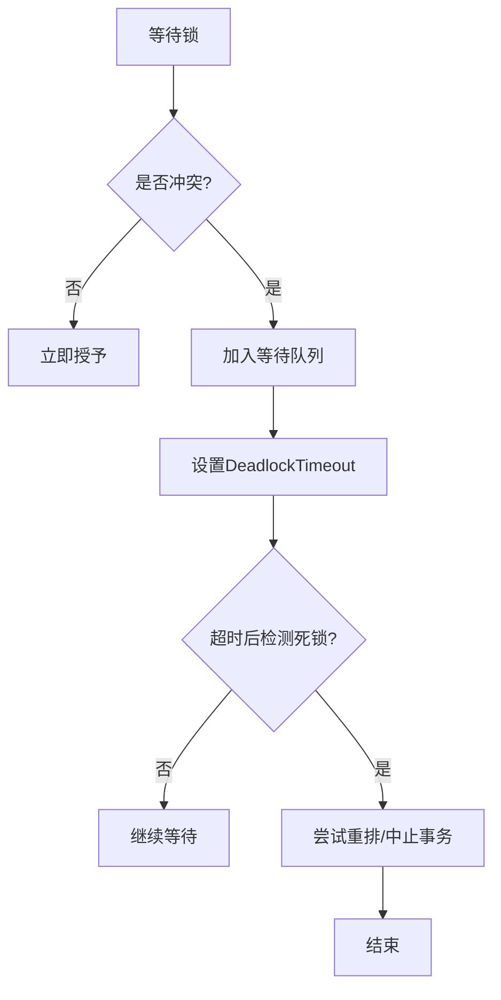
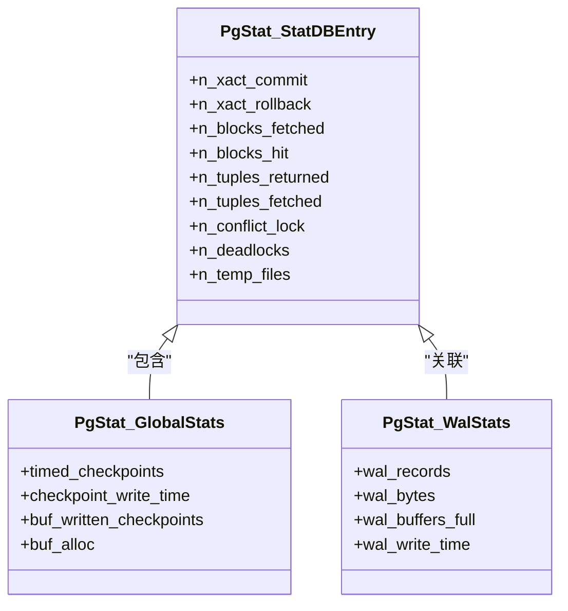
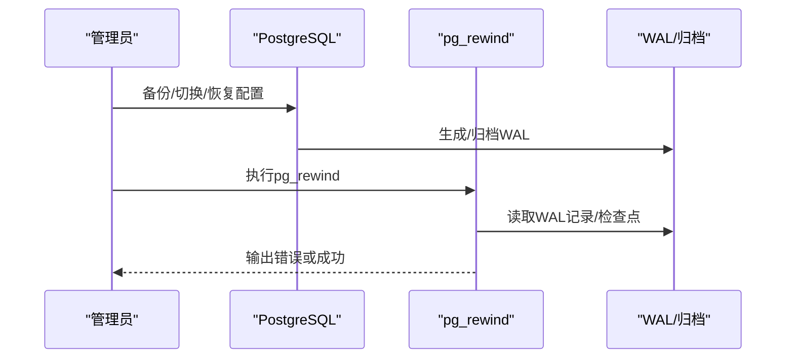
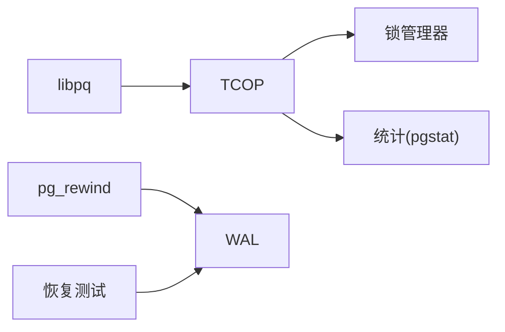

# 故障排除

<cite>
**本文引用的文件**
- [problems.sgml](file://doc/src/sgml/problems.sgml)
- [errcodes.sgml](file://doc/src/sgml/errcodes.sgml)
- [pgbuffercache.sgml](file://doc/src/sgml/pgbuffercache.sgml)
- [pgstat.h](file://src/include/pgstat.h)
- [timeout.h](file://src/include/utils/timeout.h)
- [postgres.c](file://src/backend/tcop/postgres.c)
- [pqmq.c](file://src/backend/libpq/pqmq.c)
- [README（锁管理器）](file://src/backend/storage/lmgr/README)
- [parsexlog.c](file://src/bin/pg_rewind/parsexlog.c)
- [024_archive_recovery.pl](file://src/test/recovery/t/024_archive_recovery.pl)
- [003_recovery_targets.pl](file://src/test/recovery/t/003_recovery_targets.pl)
- [016_min_consistency.pl](file://src/test/recovery/t/016_min_consistency.pl)
- [walwriter.c](file://src/backend/postmaster/walwriter.c)
</cite>

## 目录
1. [简介](#简介)
2. [项目结构](#项目结构)
3. [核心组件](#核心组件)
4. [架构总览](#架构总览)
5. [详细组件分析](#详细组件分析)
6. [依赖关系分析](#依赖关系分析)
7. [性能注意事项](#性能注意事项)
8. [故障排除指南](#故障排除指南)
9. [结论](#结论)
10. [附录](#附录)

## 简介
本指南面向DBA与开发者，聚焦PostgreSQL在启动失败、性能问题、连接问题与数据一致性等常见场景的诊断与修复。内容涵盖日志分析方法、性能监控工具、调试技巧、系统健康检查清单、预防性维护建议、错误代码参考与故障恢复流程。所有技术细节均基于仓库源码与文档进行梳理，确保可追溯与可操作。

## 项目结构
本项目为PostgreSQL源码树，关键与故障排除相关的目录与文件包括：
- 文档：doc/src/sgml/ 下的问题报告、错误码、缓冲缓存等说明
- 后端核心：src/backend/ 下的tcop、libpq、postmaster、storage、optimizer等
- 统计与监控：src/include/pgstat.h 定义统计消息与计数器
- 工具与测试：src/bin/ 与 src/test/ 中的恢复、WAL、隔离测试脚本

图表来源
- [postgres.c:2373-4942](file://src/backend/tcop/postgres.c#L2373-L4942)
- [README（锁管理器）:346-368](file://src/backend/storage/lmgr/README#L346-L368)
- [pgstat.h:719-853](file://src/include/pgstat.h#L719-L853)
- [pgbuffercache.sgml:1-30](file://doc/src/sgml/pgbuffercache.sgml#L1-L30)

章节来源
- [problems.sgml:1-363](file://doc/src/sgml/problems.sgml#L1-L363)
- [errcodes.sgml:1-90](file://doc/src/sgml/errcodes.sgml#L1-L90)

## 核心组件
- 连接与协议层：libpq负责客户端与服务端之间的消息传递与错误信息映射，支持严重级别与SQLSTATE的解析与转换。
- 会话与命令处理：TCOP主循环负责会话生命周期、语句超时控制、断连日志记录、参数绑定错误上下文等。
- 锁与并发：锁管理器提供自旋锁、轻量锁、常规锁及死锁检测；采用“乐观等待”策略，结合DeadlockTimeout避免不必要的开销。
- 统计与监控：pgstat定义各类统计消息与计数器，覆盖事务、缓冲区、WAL、SLRU、会话等维度，供外部查询与分析。
- WAL与恢复：WAL写入、归档、恢复目标、一致性校验等由相关模块与测试用例体现，pg_rewind用于主备切换后的数据对齐。

章节来源
- [pqmq.c:219-263](file://src/backend/libpq/pqmq.c#L219-L263)
- [postgres.c:2373-4942](file://src/backend/tcop/postgres.c#L2373-L4942)
- [README（锁管理器）:346-368](file://src/backend/storage/lmgr/README#L346-L368)
- [pgstat.h:719-853](file://src/include/pgstat.h#L719-L853)

## 架构总览
下图展示了从客户端到后端各层的调用链与关键故障点：

图表来源
- [pqmq.c:219-263](file://src/backend/libpq/pqmq.c#L219-L263)
- [postgres.c:2373-4942](file://src/backend/tcop/postgres.c#L2373-L4942)
- [README（锁管理器）:346-368](file://src/backend/storage/lmgr/README#L346-L368)
- [pgstat.h:719-853](file://src/include/pgstat.h#L719-L853)

## 详细组件分析

### 连接与错误处理（libpq与TCOP）
- 严重级别映射：libpq将服务端返回的严重级别转换为内部级别，便于客户端正确展示与处理。
- SQLSTATE处理：错误码按标准五字符格式解析，便于应用按类/具体条件分支处理。
- 会话日志：TCOP在会话结束时记录会话时长、用户、数据库、主机与端口等信息，有助于定位连接异常与资源占用。
- 语句超时：TCOP启用/禁用语句超时定时器，避免长事务或慢查询阻塞资源。

图表来源
- [pqmq.c:219-263](file://src/backend/libpq/pqmq.c#L219-L263)
- [postgres.c:2373-4942](file://src/backend/tcop/postgres.c#L2373-L4942)

章节来源
- [pqmq.c:219-263](file://src/backend/libpq/pqmq.c#L219-L263)
- [postgres.c:2373-4942](file://src/backend/tcop/postgres.c#L2373-L4942)

### 锁与死锁（锁管理器）
- 乐观等待：无冲突时快速通过；冲突则进入等待队列并设置DeadlockTimeout，到期后运行死锁检测/解除。
- 等待队列与软边：通过“软边”重排等待队列以避免中止事务；若无法重排则中止起始等待的事务以打破环。
- 并行组锁：同一并行组内锁不冲突（除关系扩展锁），避免领导者与工作者自死锁。

图表来源
- [README（锁管理器）:346-368](file://src/backend/storage/lmgr/README#L346-L368)

章节来源
- [README（锁管理器）:346-368](file://src/backend/storage/lmgr/README#L346-L368)

### 统计与监控（pgstat）
- 统计消息：后端向收集器发送事务提交/回滚、块命中/读取、元组操作、临时文件、死锁、校验失败、会话计数等。
- 全局统计：检查点次数/时间、缓冲写入/同步、WAL记录/字节、SLRU块操作等。
- 使用方式：通过系统视图与扩展（如pg_buffercache）实时观察共享缓冲使用情况。

图表来源
- [pgstat.h:719-853](file://src/include/pgstat.h#L719-L853)

章节来源
- [pgstat.h:719-853](file://src/include/pgstat.h#L719-L853)
- [pgbuffercache.sgml:1-30](file://doc/src/sgml/pgbuffercache.sgml#L1-L30)

### WAL与恢复（pg_rewind与恢复测试）
- pg_rewind：读取WAL记录，识别检查点与分段切换，保证主备切换后数据一致。
- 恢复目标：支持按LSN/XID/时间/名称恢复，并在目标未达或冲突时报错。
- 归档恢复：当WAL由不同wal_level生成时，恢复过程会拒绝继续，需调整配置或重新归档。

图表来源
- [parsexlog.c:201-250](file://src/bin/pg_rewind/parsexlog.c#L201-L250)
- [024_archive_recovery.pl:12-103](file://src/test/recovery/t/024_archive_recovery.pl#L12-L103)
- [003_recovery_targets.pl:90-184](file://src/test/recovery/t/003_recovery_targets.pl#L90-L184)

章节来源
- [parsexlog.c:201-250](file://src/bin/pg_rewind/parsexlog.c#L201-L250)
- [024_archive_recovery.pl:12-103](file://src/test/recovery/t/024_archive_recovery.pl#L12-L103)
- [003_recovery_targets.pl:90-184](file://src/test/recovery/t/003_recovery_targets.pl#L90-L184)

## 依赖关系分析
- libpq与TCOP：libpq负责错误级别与SQLSTATE映射，TCOP负责会话级超时与日志。
- TCOP与锁管理器：执行路径中频繁加锁/解锁，死锁检测受DeadlockTimeout影响。
- TCOP与统计：执行过程中更新各类计数器，供监控视图消费。
- 恢复工具与WAL：pg_rewind依赖WAL记录的一致性，恢复测试验证目标与行为。

图表来源
- [pqmq.c:219-263](file://src/backend/libpq/pqmq.c#L219-L263)
- [postgres.c:2373-4942](file://src/backend/tcop/postgres.c#L2373-L4942)
- [README（锁管理器）:346-368](file://src/backend/storage/lmgr/README#L346-L368)
- [pgstat.h:719-853](file://src/include/pgstat.h#L719-L853)
- [parsexlog.c:201-250](file://src/bin/pg_rewind/parsexlog.c#L201-L250)

章节来源
- [postgres.c:2373-4942](file://src/backend/tcop/postgres.c#L2373-L4942)
- [pgstat.h:719-853](file://src/include/pgstat.h#L719-L853)

## 性能注意事项
- 语句与锁超时：合理设置statement_timeout与lock_timeout，避免长时间阻塞；deadlock_timeout影响死锁检测延迟。
- 缓冲命中率：通过pg_buffercache与统计视图观察缓冲命中与脏页比例，调整shared_buffers与checkpoint配置。
- WAL压力：关注wal_records、wal_bytes、wal_buffers_full等指标，必要时增大wal_buffers或调整max_wal_size。
- 检查点频率：timed_checkpoints与checkpoint_write_time反映检查点负载，平衡fsync与吞吐。

[本节为通用指导，无需特定文件引用]

## 故障排除指南

### 启动失败
- 现象：服务无法启动或启动后立即退出。
- 诊断要点：
  - 查看服务器日志，开启详细错误级别（verbose）。
  - 检查WAL与归档配置，确认wal_level与archive_mode匹配。
  - 使用pg_controldata与控制文件核对一致性。
- 常见原因：
  - WAL由minimal级别生成，无法继续恢复。
  - 恢复目标未达或冲突导致致命错误。
- 解决步骤：
  - 修正wal_level并重新归档所需WAL。
  - 调整recovery_target_*参数，确保目标可达且唯一。
  - 使用pg_rewind对齐主备数据后再启动。

章节来源
- [024_archive_recovery.pl:12-103](file://src/test/recovery/t/024_archive_recovery.pl#L12-L103)
- [003_recovery_targets.pl:90-184](file://src/test/recovery/t/003_recovery_targets.pl#L90-L184)
- [problems.sgml:157-185](file://doc/src/sgml/problems.sgml#L157-L185)

### 性能问题
- 现象：查询慢、CPU/IO高、锁等待多。
- 诊断要点：
  - 使用pg_stat_activity观察活跃会话与等待事件。
  - 通过pg_stat_statements（如启用）定位慢查询。
  - 检查缓冲命中率与临时文件使用。
- 解决步骤：
  - 优化SQL与索引，减少全表扫描与排序。
  - 调整statement_timeout/lock_timeout，避免长事务。
  - 调整shared_buffers、work_mem、checkpoint相关参数。

章节来源
- [pgstat.h:719-853](file://src/include/pgstat.h#L719-L853)
- [pgbuffercache.sgml:1-30](file://doc/src/sgml/pgbuffercache.sgml#L1-L30)

### 连接问题
- 现象：连接超时、认证失败、断开频繁。
- 诊断要点：
  - 检查libpq错误级别映射与SQLSTATE。
  - 查看TCOP会话日志，确认断连时间与远端信息。
  - 检查网络与防火墙、SSL配置。
- 解决步骤：
  - 调整客户端超时与重试策略。
  - 修正认证配置与权限。
  - 排查网络丢包与MTU问题。

章节来源
- [pqmq.c:219-263](file://src/backend/libpq/pqmq.c#L219-L263)
- [postgres.c:2373-4942](file://src/backend/tcop/postgres.c#L2373-L4942)

### 数据一致性问题
- 现象：索引损坏、页面不一致、恢复后数据异常。
- 诊断要点：
  - 使用amcheck/pageinspect等工具检查页面与索引结构。
  - 检查WAL记录与检查点，确认最小恢复点。
- 解决步骤：
  - 对受损索引执行REINDEX（谨慎评估）。
  - 使用pg_rewind修复主备分叉后的数据。
  - 重新归档并恢复至一致点。

章节来源
- [016_min_consistency.pl:42-81](file://src/test/recovery/t/016_min_consistency.pl#L42-L81)
- [parsexlog.c:201-250](file://src/bin/pg_rewind/parsexlog.c#L201-L250)

### 日志分析方法
- 开启详细日志：设置log_error_verbosity为verbose，捕获更多上下文。
- 会话日志：关注断连日志中的会话时长、用户、数据库、主机与端口。
- 错误上下文：利用参数绑定与EXECUTE上下文的errdetail辅助定位。

章节来源
- [problems.sgml:157-185](file://doc/src/sgml/problems.sgml#L157-L185)
- [postgres.c:2373-4942](file://src/backend/tcop/postgres.c#L2373-L4942)

### 性能监控工具
- 缓冲缓存：pg_buffercache视图实时查看共享缓冲使用情况。
- 统计视图：pg_stat_*系列视图观察事务、缓冲、WAL、会话等指标。
- 自定义采样：使用log_statement_sample_rate与log_transaction_sample_rate抽样慢查询。

章节来源
- [pgbuffercache.sgml:1-30](file://doc/src/sgml/pgbuffercache.sgml#L1-L30)
- [pgstat.h:719-853](file://src/include/pgstat.h#L719-L853)

### 调试技巧
- 超时控制：使用enable_timeout_after/disable_timeout管理语句/锁/空闲超时。
- 信号处理：后台进程（如walwriter）正确处理SIGHUP/SIGTERM等信号，确保优雅关闭。
- 隔离测试：使用isolationtester与spec脚本复现并发与死锁场景。

章节来源
- [timeout.h:1-90](file://src/include/utils/timeout.h#L1-L90)
- [walwriter.c:98-127](file://src/backend/postmaster/walwriter.c#L98-L127)

### 系统健康检查清单
- 启动与健康：
  - 服务状态与进程存活
  - 日志中是否有FATAL/PANIC
  - 控制文件与WAL一致性
- 性能与资源：
  - 缓冲命中率、临时文件、WAL写入时间
  - 活跃会话数、锁等待、死锁计数
- 备份与恢复：
  - 归档模式与WAL留存
  - 恢复目标可达性与最近一次成功恢复时间

[本节为通用指导，无需特定文件引用]

### 预防性维护建议
- 定期VACUUM/ANALYZE，保持统计准确与表空间健康。
- 监控WAL增长与归档延迟，避免磁盘耗尽。
- 设定合理的超时与限制，防止长事务与锁持有过久。
- 定期进行一致性检查（amcheck/pageinspect），尽早发现潜在问题。

[本节为通用指导，无需特定文件引用]

### 错误代码参考
- SQLSTATE：所有错误消息附带五字符SQLSTATE，应用应基于错误码而非文本进行处理。
- 条件名：PL/pgSQL中可使用条件名捕获错误，便于结构化处理。
- 对象名：部分错误（如完整性约束违反）会附带对象名，便于快速定位。

章节来源
- [errcodes.sgml:1-90](file://doc/src/sgml/errcodes.sgml#L1-L90)

### 故障恢复流程
- 主备切换：
  - 使用pg_rewind比对WAL，修复分叉。
  - 确认检查点与归档完整。
- 时间点恢复：
  - 设置recovery_target_*为目标LSN/XID/时间/名称。
  - 验证目标可达，避免冲突配置。
- 归档恢复：
  - 确保wal_level与archive_mode兼容。
  - 遇到minimal级别WAL时，调整配置并重新归档。

章节来源
- [parsexlog.c:201-250](file://src/bin/pg_rewind/parsexlog.c#L201-L250)
- [003_recovery_targets.pl:90-184](file://src/test/recovery/t/003_recovery_targets.pl#L90-L184)
- [024_archive_recovery.pl:12-103](file://src/test/recovery/t/024_archive_recovery.pl#L12-L103)

## 结论
通过理解连接与错误处理、锁与死锁机制、统计与监控、WAL与恢复等核心组件，结合日志分析、性能监控与调试技巧，可以系统化地定位与解决PostgreSQL的常见问题。建议在生产环境中建立完善的健康检查与预防性维护流程，并结合错误代码参考与恢复流程，提升系统的可用性与稳定性。

## 附录
- 常用视图与扩展：pg_stat_activity、pg_stat_statements、pg_buffercache、pageinspect、amcheck。
- 关键参数：statement_timeout、lock_timeout、deadlock_timeout、log_error_verbosity、shared_buffers、checkpoint_timeout、wal_level、archive_mode。

[本节为通用指导，无需特定文件引用]