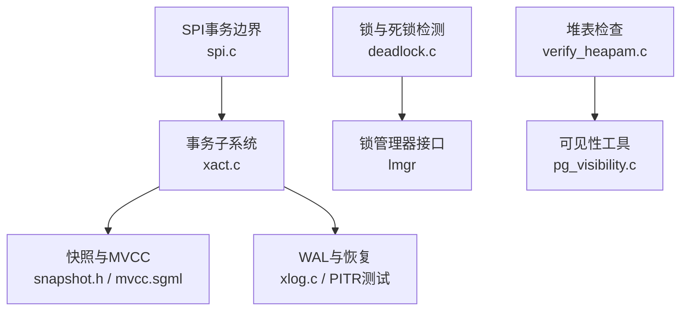
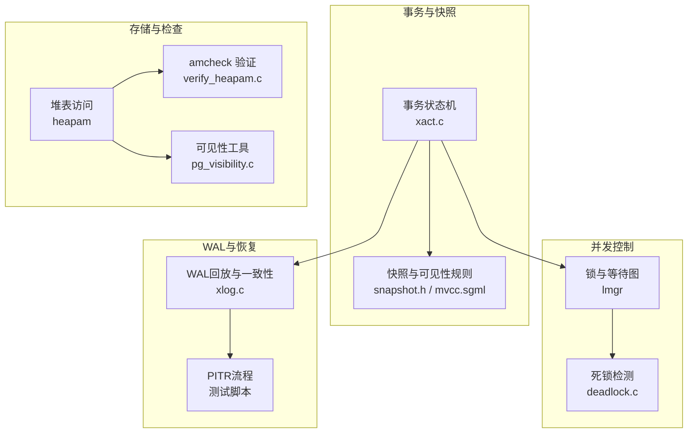
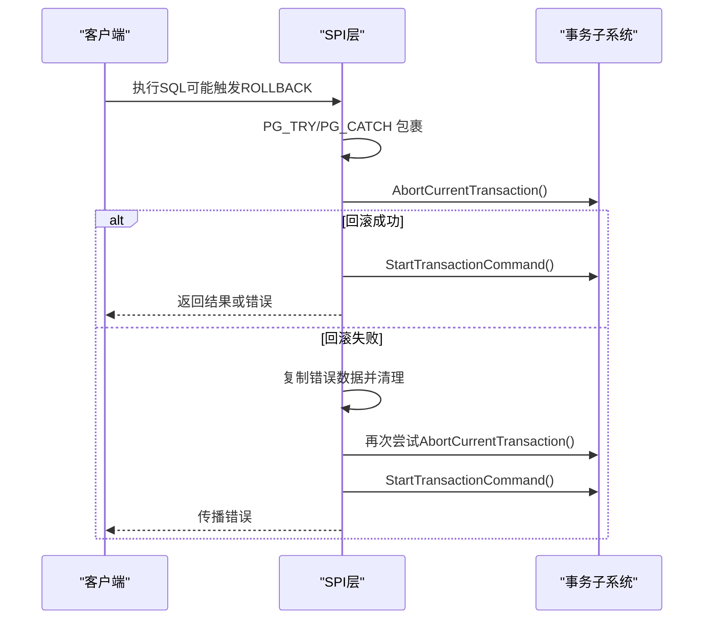
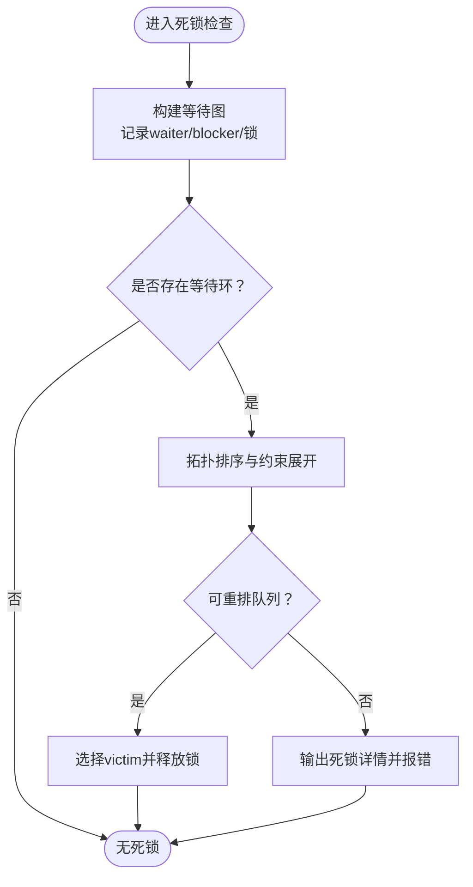
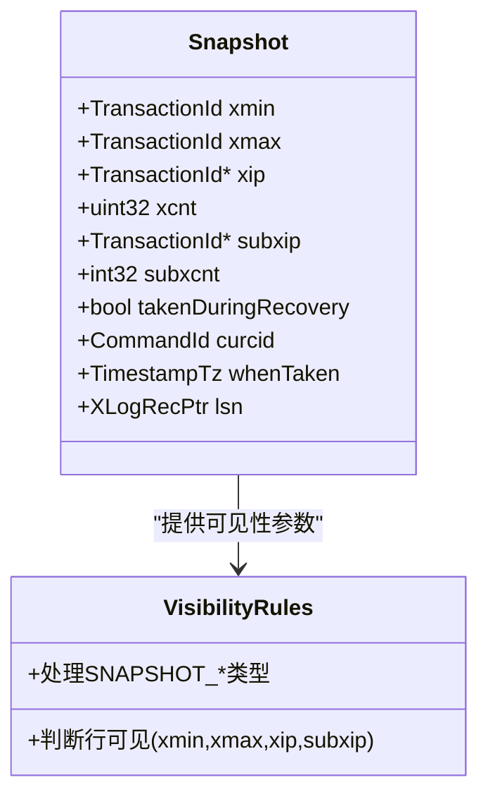
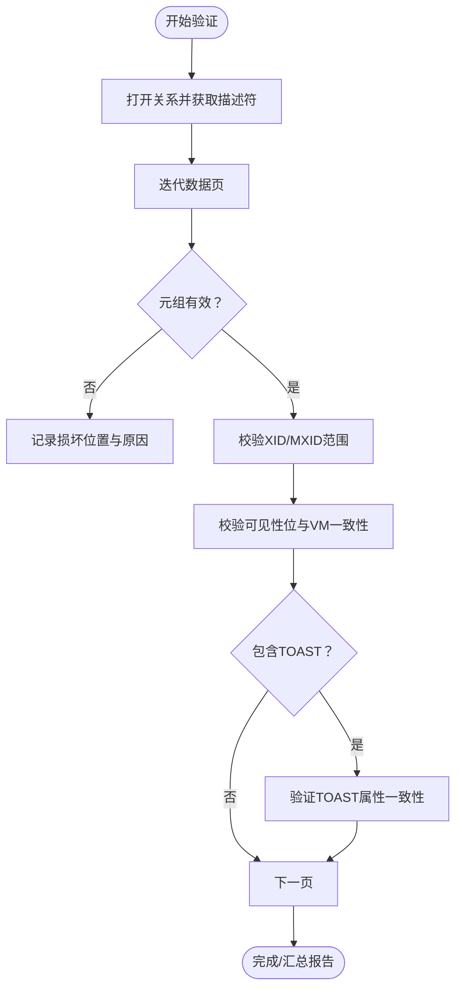
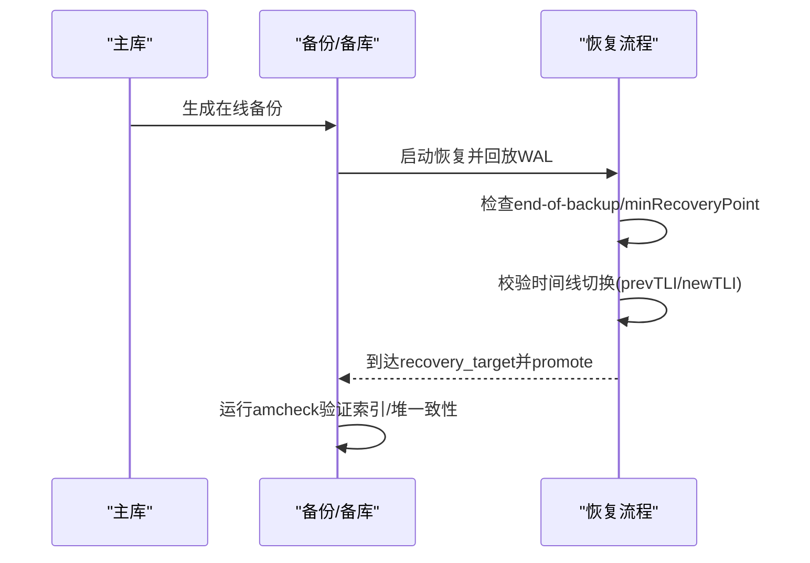
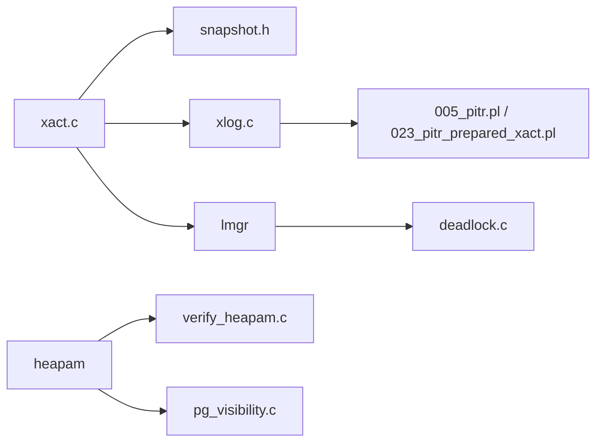

# 数据一致性问题

<cite>
**本文引用的文件**
- [deadlock.c](file://src/backend/storage/lmgr/deadlock.c)
- [xact.c](file://src/backend/access/transam/xact.c)
- [spi.c](file://src/backend/executor/spi.c)
- [verify_heapam.c](file://contrib/amcheck/verify_heapam.c)
- [pg_visibility.c](file://contrib/pg_visibility/pg_visibility.c)
- [mvcc.sgml](file://doc/src/sgml/mvcc.sgml)
- [snapshot.h](file://src/include/utils/snapshot.h)
- [xlog.c](file://src/backend/access/transam/xlog.c)
- [005_pitr.pl](file://contrib/amcheck/t/005_pitr.pl)
- [023_pitr_prepared_xact.pl](file://src/test/recovery/t/023_pitr_prepared_xact.pl)
</cite>

## 目录
1. [简介](#简介)
2. [项目结构](#项目结构)
3. [核心组件](#核心组件)
4. [架构总览](#架构总览)
5. [详细组件分析](#详细组件分析)
6. [依赖关系分析](#依赖关系分析)
7. [性能考量](#性能考量)
8. [故障排查指南](#故障排查指南)
9. [结论](#结论)
10. [附录](#附录)

## 简介
本指南面向DBA与高级用户，聚焦于PostgreSQL（minipg）中的数据一致性问题诊断与修复。内容覆盖事务一致性问题的识别与解决、死锁检测与缓解、锁等待分析、MVCC可见性问题、数据损坏检测、提交/回滚异常处理、备份恢复与PITR（基于时间点恢复）、以及数据重建的应急流程。通过源码级分析与可视化图示，帮助读者快速定位问题根因并制定修复策略。

## 项目结构
围绕数据一致性相关能力，代码主要分布在以下区域：
- 事务与快照：access/transam、include/utils/snapshot.h
- 锁与死锁：storage/lmgr
- 存储与可见性：access/heap、contrib/pg_visibility、contrib/amcheck
- WAL与恢复：access/transam/xlog.c、测试脚本中的PITR用例
- SPI与事务边界：executor/spi.c

**图表来源**
- [xact.c:1-200](file://src/backend/access/transam/xact.c#L1-L200)
- [snapshot.h:52-209](file://src/include/utils/snapshot.h#L52-L209)
- [deadlock.c:1-200](file://src/backend/storage/lmgr/deadlock.c#L1-L200)
- [verify_heapam.c:1-200](file://contrib/amcheck/verify_heapam.c#L1-L200)
- [pg_visibility.c:1-200](file://contrib/pg_visibility/pg_visibility.c#L1-L200)
- [xlog.c:7546-7580](file://src/backend/access/transam/xlog.c#L7546-L7580)

**章节来源**
- [xact.c:1-200](file://src/backend/access/transam/xact.c#L1-L200)
- [snapshot.h:52-209](file://src/include/utils/snapshot.h#L52-L209)
- [deadlock.c:1-200](file://src/backend/storage/lmgr/deadlock.c#L1-L200)
- [verify_heapam.c:1-200](file://contrib/amcheck/verify_heapam.c#L1-L200)
- [pg_visibility.c:1-200](file://contrib/pg_visibility/pg_visibility.c#L1-L200)
- [xlog.c:7546-7580](file://src/backend/access/transam/xlog.c#L7546-L7580)

## 核心组件
- 事务生命周期与状态机：管理BEGIN/COMMIT/ROLLBACK/CHAIN等状态转换，处理隐式事务与并行工作器限制。
- MVCC快照：定义快照类型、xmin/xmax范围、活跃XID集合、子事务XID集合、是否处于恢复期等，决定行可见性。
- 死锁检测：构建等待图、寻找环、拓扑排序与队列重排，输出死锁详情。
- 数据完整性检查：遍历堆页与TOAST，校验XID/MXID范围、可见性位、元组头与属性一致性。
- 可见性映射与页面位：提供VM与PD_ALL_VISIBLE位读取与一致性检查。
- WAL与恢复：在线备份一致性检查、时间线切换校验、PITR目标与promotion流程。
- SPI事务边界：在错误路径中安全回滚并重启事务，保证调用方上下文稳定。

**章节来源**
- [xact.c:3904-3938](file://src/backend/access/transam/xact.c#L3904-L3938)
- [snapshot.h:52-209](file://src/include/utils/snapshot.h#L52-L209)
- [deadlock.c:1-200](file://src/backend/storage/lmgr/deadlock.c#L1-L200)
- [verify_heapam.c:1-200](file://contrib/amcheck/verify_heapam.c#L1-L200)
- [pg_visibility.c:1-200](file://contrib/pg_visibility/pg_visibility.c#L1-L200)
- [xlog.c:7546-7580](file://src/backend/access/transam/xlog.c#L7546-L7580)
- [spi.c:348-404](file://src/backend/executor/spi.c#L348-L404)

## 架构总览
下图展示数据一致性相关模块的交互关系：事务子系统协调快照与WAL；锁子系统负责并发控制与死锁检测；存储层提供堆表与可见性工具；恢复子系统确保WAL回放一致性与PITR目标达成。

**图表来源**
- [xact.c:1-200](file://src/backend/access/transam/xact.c#L1-L200)
- [snapshot.h:52-209](file://src/include/utils/snapshot.h#L52-L209)
- [deadlock.c:1-200](file://src/backend/storage/lmgr/deadlock.c#L1-L200)
- [verify_heapam.c:1-200](file://contrib/amcheck/verify_heapam.c#L1-L200)
- [pg_visibility.c:1-200](file://contrib/pg_visibility/pg_visibility.c#L1-L200)
- [xlog.c:7546-7580](file://src/backend/access/transam/xlog.c#L7546-L7580)
- [005_pitr.pl:59-89](file://contrib/amcheck/t/005_pitr.pl#L59-L89)

## 详细组件分析

### 事务提交与回滚异常处理
- 事务块状态机：处理无活动事务时的ABORT/ROLLBACK行为，区分CHAIN与非CHAIN语义；在并行工作器中禁止ABORT。
- SPI内部事务边界：捕获ROLLBACK期间的错误，保存错误信息后重试AbortCurrentTransaction并启动新事务，保持调用者上下文稳定。

**图表来源**
- [spi.c:348-404](file://src/backend/executor/spi.c#L348-L404)
- [xact.c:3904-3938](file://src/backend/access/transam/xact.c#L3904-L3938)

**章节来源**
- [xact.c:3904-3938](file://src/backend/access/transam/xact.c#L3904-L3938)
- [spi.c:348-404](file://src/backend/executor/spi.c#L348-L404)

### 死锁检测与锁等待分析
- 等待图构建：记录waiter/blocker与锁对象，维护边集用于后续环检测。
- 环查找与拓扑排序：递归搜索锁等待环，收集约束并尝试队列重排以打破死锁。
- 诊断输出：保存锁标签、模式、PID等信息以便报告。

**图表来源**
- [deadlock.c:1-200](file://src/backend/storage/lmgr/deadlock.c#L1-L200)

**章节来源**
- [deadlock.c:1-200](file://src/backend/storage/lmgr/deadlock.c#L1-L200)

### MVCC可见性问题与快照
- 快照字段：xmin/xmax界定可见范围，xip/subxip列出活跃或历史XID集合，takenDuringRecovery标记恢复期快照。
- 可见性规则：SNAPSHOT_SELF/ANY/TOAST等类型影响行可见判定；MVCC快照不可见XID≥xmax的事务效果。
- 读/写冲突：Repeatable Read下可能出现读写冲突导致的执行顺序图环，需借助一致性检查辅助。

**图表来源**
- [snapshot.h:52-209](file://src/include/utils/snapshot.h#L52-L209)
- [mvcc.sgml:1586-1603](file://doc/src/sgml/mvcc.sgml#L1586-L1603)

**章节来源**
- [snapshot.h:52-209](file://src/include/utils/snapshot.h#L52-L209)
- [mvcc.sgml:1586-1603](file://doc/src/sgml/mvcc.sgml#L1586-L1603)

### 数据损坏检测与修复
- 堆表验证：遍历relation页与tuple，检查XID/MXID范围、可见性位、元组头与属性完整性；支持跳过all-visible/all-frozen页以提升性能。
- TOAST一致性：对TOAST属性进行关联校验，发现不一致时报告主表位置。
- 可见性映射检查：读取VM与PD_ALL_VISIBLE位，检测不一致情况；必要时重建可见性映射。

**图表来源**
- [verify_heapam.c:1-200](file://contrib/amcheck/verify_heapam.c#L1-L200)
- [pg_visibility.c:1-200](file://contrib/pg_visibility/pg_visibility.c#L1-L200)

**章节来源**
- [verify_heapam.c:1-200](file://contrib/amcheck/verify_heapam.c#L1-L200)
- [pg_visibility.c:1-200](file://contrib/pg_visibility/pg_visibility.c#L1-L200)

### 备份恢复与PITR应急流程
- 在线备份一致性：回放WAL时需达到end-of-backup记录或minRecoveryPoint；若WAL不足则报错提示启用full_page_writes并重试。
- 时间线切换校验：checkpoint记录中的prevTLI/newTLI必须与当前时间线历史一致，否则PANIC。
- PITR目标与提升：配置recovery_target_lsn/inclusive/action，启动后等待退出恢复并promote，随后运行索引/堆一致性检查。

**图表来源**
- [xlog.c:7546-7580](file://src/backend/access/transam/xlog.c#L7546-L7580)
- [xlog.c:9960-9991](file://src/backend/access/transam/xlog.c#L9960-L9991)
- [005_pitr.pl:59-89](file://contrib/amcheck/t/005_pitr.pl#L59-L89)
- [023_pitr_prepared_xact.pl:52-89](file://src/test/recovery/t/023_pitr_prepared_xact.pl#L52-L89)

**章节来源**
- [xlog.c:7546-7580](file://src/backend/access/transam/xlog.c#L7546-L7580)
- [xlog.c:9960-9991](file://src/backend/access/transam/xlog.c#L9960-L9991)
- [005_pitr.pl:59-89](file://contrib/amcheck/t/005_pitr.pl#L59-L89)
- [023_pitr_prepared_xact.pl:52-89](file://src/test/recovery/t/023_pitr_prepared_xact.pl#L52-L89)

## 依赖关系分析
- 事务子系统依赖快照机制与WAL子系统，同时与锁管理器交互以协调并发。
- 死锁检测依赖锁管理器提供的等待图信息。
- 数据完整性检查依赖堆表访问与可见性映射；amcheck与pg_visibility为上层工具。
- 恢复子系统依赖WAL回放逻辑与时间线历史，PITR流程由测试脚本驱动。

**图表来源**
- [xact.c:1-200](file://src/backend/access/transam/xact.c#L1-L200)
- [snapshot.h:52-209](file://src/include/utils/snapshot.h#L52-L209)
- [deadlock.c:1-200](file://src/backend/storage/lmgr/deadlock.c#L1-L200)
- [verify_heapam.c:1-200](file://contrib/amcheck/verify_heapam.c#L1-L200)
- [pg_visibility.c:1-200](file://contrib/pg_visibility/pg_visibility.c#L1-L200)
- [xlog.c:7546-7580](file://src/backend/access/transam/xlog.c#L7546-L7580)
- [005_pitr.pl:59-89](file://contrib/amcheck/t/005_pitr.pl#L59-L89)
- [023_pitr_prepared_xact.pl:52-89](file://src/test/recovery/t/023_pitr_prepared_xact.pl#L52-L89)

**章节来源**
- [xact.c:1-200](file://src/backend/access/transam/xact.c#L1-L200)
- [snapshot.h:52-209](file://src/include/utils/snapshot.h#L52-L209)
- [deadlock.c:1-200](file://src/backend/storage/lmgr/deadlock.c#L1-L200)
- [verify_heapam.c:1-200](file://contrib/amcheck/verify_heapam.c#L1-L200)
- [pg_visibility.c:1-200](file://contrib/pg_visibility/pg_visibility.c#L1-L200)
- [xlog.c:7546-7580](file://src/backend/access/transam/xlog.c#L7546-L7580)
- [005_pitr.pl:59-89](file://contrib/amcheck/t/005_pitr.pl#L59-L89)
- [023_pitr_prepared_xact.pl:52-89](file://src/test/recovery/t/023_pitr_prepared_xact.pl#L52-L89)

## 性能考量
- 可见性检查成本：pg_visibility中读取数据页比仅查VM更昂贵，应谨慎使用全表扫描类函数。
- amcheck跳过优化：支持跳过all-visible/all-frozen页，减少IO与CPU开销。
- 死锁检测内存：初始化阶段预分配最大后端数相关的数组，避免信号处理中动态分配风险。
- WAL回放：full_page_writes关闭期间回放可能导致备份不一致，需启用并重新在线备份。

[本节为通用指导，不直接分析具体文件]

## 故障排查指南
- 死锁排查：
  - 查看锁等待图与环检测结果，确认阻塞链路与victim选择。
  - 关注自动真空进程是否参与阻塞。
  - 参考死锁检测实现中的约束展开与拓扑排序逻辑。
- MVCC可见性问题：
  - 检查快照xmin/xmax与xip/subxip，确认活跃事务集合。
  - 针对Repeatable Read场景评估读写冲突导致的执行顺序环。
- 数据损坏检测：
  - 使用amcheck验证堆表与索引，定位损坏页与元组。
  - 使用pg_visibility检查VM与PD_ALL_VISIBLE一致性。
- 备份恢复问题：
  - 确认在线备份结束标志与minRecoveryPoint，补齐缺失WAL。
  - 校验时间线切换记录，避免非法TLI导致PANIC。
  - 使用PITR目标恢复到指定LSN或命名恢复点，再promote并验证一致性。
- SPI事务边界异常：
  - 捕获ROLLBACK错误并安全重启事务，避免状态泄漏。

**章节来源**
- [deadlock.c:1-200](file://src/backend/storage/lmgr/deadlock.c#L1-L200)
- [snapshot.h:52-209](file://src/include/utils/snapshot.h#L52-L209)
- [verify_heapam.c:1-200](file://contrib/amcheck/verify_heapam.c#L1-L200)
- [pg_visibility.c:1-200](file://contrib/pg_visibility/pg_visibility.c#L1-L200)
- [xlog.c:7546-7580](file://src/backend/access/transam/xlog.c#L7546-L7580)
- [005_pitr.pl:59-89](file://contrib/amcheck/t/005_pitr.pl#L59-L89)
- [023_pitr_prepared_xact.pl:52-89](file://src/test/recovery/t/023_pitr_prepared_xact.pl#L52-L89)
- [spi.c:348-404](file://src/backend/executor/spi.c#L348-L404)

## 结论
通过对事务、快照、锁、WAL与恢复等关键组件的分析，结合amcheck与pg_visibility等工具，可以系统化地诊断与修复数据一致性问题。建议在生产环境中定期执行一致性检查、合理配置WAL与备份策略、并在PITR场景中严格校验时间线与恢复目标。遇到异常时，优先依据日志与工具输出定位根因，再采取针对性修复措施。

[本节为总结性内容，不直接分析具体文件]

## 附录
- 常用工具与扩展：
  - amcheck：堆表与索引一致性检查
  - pg_visibility：可见性映射与页面位检查
  - pageinspect：页面级别调试（可选）
- 参考文档：
  - MVCC文档：read/write冲突与一致性检查注意事项
  - 备份与恢复：在线备份与PITR流程

[本节为补充信息，不直接分析具体文件]