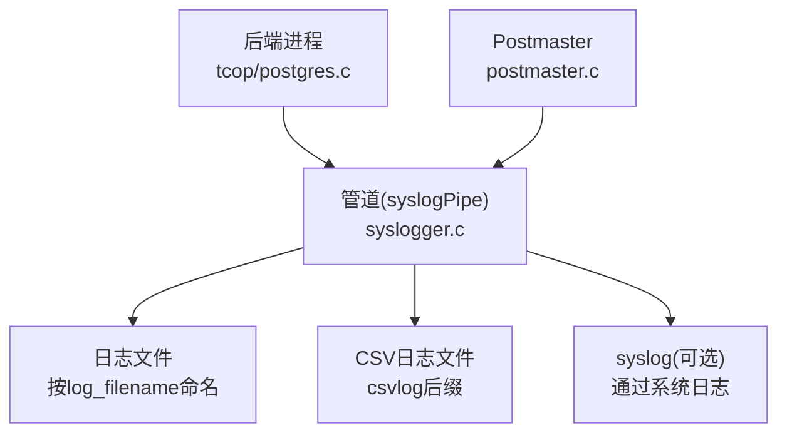
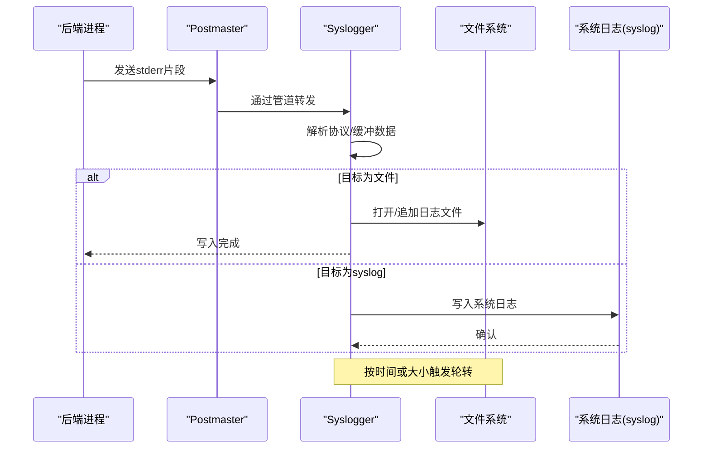
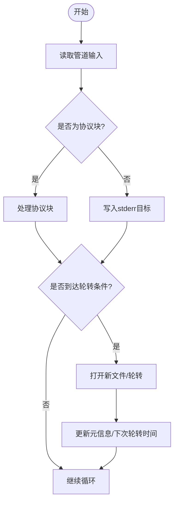
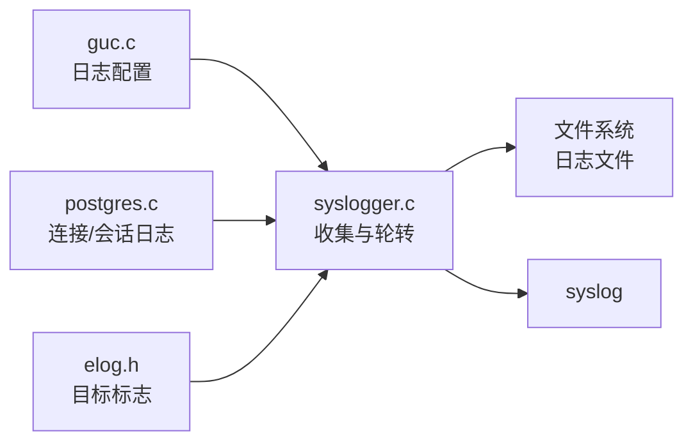

# 日志分析方法

<cite>
**本文引用的文件**
- [src/backend/postmaster/syslogger.c](file://src/backend/postmaster/syslogger.c)
- [src/backend/utils/misc/guc.c](file://src/backend/utils/misc/guc.c)
- [doc/src/sgml/config.sgml](file://doc/src/sgml/config.sgml)
- [src/backend/utils/error/elog.c](file://src/backend/utils/error/elog.c)
- [src/include/utils/elog.h](file://src/include/utils/elog.h)
- [src/backend/tcop/postgres.c](file://src/backend/tcop/postgres.c)
- [src/backend/postmaster/postmaster.c](file://src/backend/postmaster/postmaster.c)
</cite>

## 目录
1. [简介](#简介)
2. [项目结构](#项目结构)
3. [核心组件](#核心组件)
4. [架构总览](#架构总览)
5. [详细组件分析](#详细组件分析)
6. [依赖关系分析](#依赖关系分析)
7. [性能考量](#性能考量)
8. [故障排查指南](#故障排查指南)
9. [结论](#结论)
10. [附录](#附录)

## 简介
本指南面向运维与DBA，系统化说明PostgreSQL日志系统的配置与管理方法，涵盖日志级别、日志轮转、远程日志收集（syslog）、CSV日志等。文档基于代码库中的实现与官方文档源，帮助快速定位问题、建立监控告警体系，并提供高效的问题定位思路。

## 项目结构
围绕日志系统的关键位置如下：
- 日志收集与轮转：postmaster子进程syslogger负责统一收集后端stderr输出并写入日志文件，支持按时间或大小轮转。
- 配置项定义：guc.c集中定义日志相关GUC参数（如log_destination、log_connections、log_statement等）。
- CSV日志格式：elog.c中实现CSV格式输出，便于导入数据库表进行结构化分析。
- 连接/会话日志：tcop/postgres.c在会话生命周期内记录连接与断开信息。
- 平台/常量：elog.h定义日志目标标志位（stderr、syslog、csvlog、eventlog）。

图表来源
- [src/backend/postmaster/syslogger.c:135-200](file://src/backend/postmaster/syslogger.c#L135-L200)
- [src/backend/tcop/postgres.c:3641-3642](file://src/backend/tcop/postgres.c#L3641-L3642)
- [src/include/utils/elog.h:435-438](file://src/include/utils/elog.h#L435-L438)

章节来源
- [src/backend/postmaster/syslogger.c:1-200](file://src/backend/postmaster/syslogger.c#L1-L200)
- [src/backend/utils/misc/guc.c:1151-1177](file://src/backend/utils/misc/guc.c#L1151-L1177)
- [doc/src/sgml/config.sgml:5130-5147](file://doc/src/sgml/config.sgml#L5130-L5147)

## 核心组件
- 日志收集器（syslogger）：独立进程，接收来自postmaster与各后端的stderr输出，按配置写入日志文件或syslog，支持时间/大小轮转。
- GUC配置层：提供丰富的日志开关与行为控制，包括日志目的地、连接/断开日志、语句日志、错误详细度等。
- CSV日志：结构化输出，字段包含时间戳、用户、数据库、进程ID、客户端主机、会话ID、命令标签、事务ID、错误严重性、SQLSTATE、消息、上下文、应用名、后端类型、并行组leader PID、查询ID等。
- 连接与会话日志：在会话建立与结束时记录连接信息，可附加主机名与持续时间。

章节来源
- [src/backend/postmaster/syslogger.c:66-76](file://src/backend/postmaster/syslogger.c#L66-L76)
- [src/backend/utils/misc/guc.c:1151-1177](file://src/backend/utils/misc/guc.c#L1151-L1177)
- [doc/src/sgml/config.sgml:6548-6585](file://doc/src/sgml/config.sgml#L6548-L6585)
- [src/backend/tcop/postgres.c:3641-3642](file://src/backend/tcop/postgres.c#L3641-L3642)

## 架构总览
日志从各后端产生，经管道汇聚到syslogger进程，由syslogger根据配置决定输出目标（文件、syslog、CSV），并按策略轮转。

图表来源
- [src/backend/postmaster/syslogger.c:135-200](file://src/backend/postmaster/syslogger.c#L135-L200)
- [src/backend/postmaster/syslogger.c:915-1056](file://src/backend/postmaster/syslogger.c#L915-L1056)
- [src/include/utils/elog.h:435-438](file://src/include/utils/elog.h#L435-L438)

## 详细组件分析

### 日志收集与轮转（syslogger）
- 职责：统一收集后端stderr，管理日志文件打开/关闭、轮转、权限设置；支持时间/大小轮转；当达到阈值时自动切换新文件。
- 关键流程：
  - 主循环读取管道输入，处理协议头与非协议数据，必要时回退到stderr目标。
  - 检查是否到达轮转条件（时间或大小），触发logfile_rotate。
  - 轮转时根据Log_RotationAge与Log_RotationSize计算下一个文件名，支持截断覆盖（log_truncate_on_rotation）。
  - 维护当前日志文件名元信息，便于外部工具定位。
- 错误处理：遇到ENFILE/EMFILE等系统限制时，会禁用自动轮转并提示SIGHUP重新启用。

图表来源
- [src/backend/postmaster/syslogger.c:748-781](file://src/backend/postmaster/syslogger.c#L748-L781)
- [src/backend/postmaster/syslogger.c:915-1056](file://src/backend/postmaster/syslogger.c#L915-L1056)
- [src/backend/postmaster/syslogger.c:1097-1122](file://src/backend/postmaster/syslogger.c#L1097-L1122)

章节来源
- [src/backend/postmaster/syslogger.c:66-76](file://src/backend/postmaster/syslogger.c#L66-L76)
- [src/backend/postmaster/syslogger.c:278-370](file://src/backend/postmaster/syslogger.c#L278-L370)
- [src/backend/postmaster/syslogger.c:873-910](file://src/backend/postmaster/syslogger.c#L873-L910)
- [src/backend/postmaster/syslogger.c:915-1056](file://src/backend/postmaster/syslogger.c#L915-L1056)
- [src/backend/postmaster/syslogger.c:1067-1092](file://src/backend/postmaster/syslogger.c#L1067-L1092)
- [src/backend/postmaster/syslogger.c:1097-1122](file://src/backend/postmaster/syslogger.c#L1097-L1122)

### 日志配置项（GUC）
- 日志目的地：log_destination支持组合值（stderr、syslog、csvlog、eventlog），用于选择输出目标。
- 日志目录与文件名：log_directory、log_filename定义日志存放路径与命名模式（支持strftime格式）。
- 轮转策略：Log_RotationAge（分钟）、Log_RotationSize（KB）、log_truncate_on_rotation（是否覆盖）。
- 连接与会话日志：log_connections、log_disconnections、log_hostname。
- 语句与性能日志：log_statement、log_duration、log_statement_stats、log_lock_waits等。
- 错误详细度：log_error_verbosity（terse/default/verbose）、server_log_min_messages（日志级别过滤）。

章节来源
- [src/backend/utils/misc/guc.c:248-295](file://src/backend/utils/misc/guc.c#L248-L295)
- [src/backend/utils/misc/guc.c:1151-1177](file://src/backend/utils/misc/guc.c#L1151-L1177)
- [src/backend/utils/misc/guc.c:1418-1447](file://src/backend/utils/misc/guc.c#L1418-L1447)
- [src/backend/utils/misc/guc.c:3538-3570](file://src/backend/utils/misc/guc.c#L3538-L3570)
- [doc/src/sgml/config.sgml:5418-5441](file://doc/src/sgml/config.sgml#L5418-L5441)
- [doc/src/sgml/config.sgml:5858-5874](file://doc/src/sgml/config.sgml#L5858-L5874)

### CSV日志与结构化分析
- 启用方式：将csvlog加入log_destination列表。
- 输出字段：时间戳（毫秒）、用户名、数据库、进程ID、客户端主机:端口、会话ID、会话行号、命令标签、会话启动时间、虚拟事务ID、常规事务ID、错误严重性、SQLSTATE、错误消息、详情、提示、内部查询、字符位置、错误上下文、用户查询（受min_error_statement影响）、源码位置（verbose时）、应用名、后端类型、并行组leader PID、查询ID。
- 用途：可直接导入数据库表，使用SQL进行聚合、筛选、告警。

章节来源
- [doc/src/sgml/config.sgml:6548-6585](file://doc/src/sgml/config.sgml#L6548-L6585)
- [src/backend/utils/error/elog.c:2583-2639](file://src/backend/utils/error/elog.c#L2583-L2639)

### 连接与会话日志
- log_connections：记录成功连接事件。
- log_disconnections：记录会话结束，附带会话持续时间。
- log_hostname：在连接日志中记录主机名（可能带来DNS解析开销）。
- 默认行为：在某些场景下（如psql探测密码）可能出现重复连接记录，属正常现象。

章节来源
- [src/backend/utils/misc/guc.c:1161-1177](file://src/backend/utils/misc/guc.c#L1161-L1177)
- [src/backend/utils/misc/guc.c:1437-1447](file://src/backend/utils/misc/guc.c#L1437-L1447)
- [src/backend/tcop/postgres.c:3641-3642](file://src/backend/tcop/postgres.c#L3641-L3642)
- [doc/src/sgml/config.sgml:6020-6047](file://doc/src/sgml/config.sgml#L6020-L6047)

### 远程日志收集（syslog）
- 配置：将log_destination设置为syslog（或与其他目标组合）。
- 特点：在高负载下syslog倾向于丢弃无法及时写入的消息，不会阻塞系统；而logging collector保证不丢消息但可能阻塞后端。
- 轮转：可通过系统日志机制或logrotate配合syslog进行轮转。

章节来源
- [doc/src/sgml/config.sgml:5249-5275](file://doc/src/sgml/config.sgml#L5249-L5275)
- [doc/src/sgml/maintenance.sgml:1140-1165](file://doc/src/sgml/maintenance.sgml#L1140-L1165)

## 依赖关系分析
- syslogger依赖：
  - postmaster：创建并管理管道、信号处理、配置重载。
  - tcop/postgres.c：在后端生命周期中记录连接/断开日志。
  - utils/elog.h：定义日志目标标志位。
  - utils/misc/guc.c：提供日志相关配置项的校验与赋值。
- 配置项对行为的影响：
  - log_destination决定输出目标集合。
  - Log_RotationAge/Log_RotationSize控制轮转策略。
  - log_truncate_on_rotation影响覆盖/追加行为。
  - log_error_verbosity与server_log_min_messages控制错误详细度与级别过滤。

图表来源
- [src/backend/utils/misc/guc.c:3538-3570](file://src/backend/utils/misc/guc.c#L3538-L3570)
- [src/backend/postmaster/syslogger.c:66-76](file://src/backend/postmaster/syslogger.c#L66-L76)
- [src/backend/tcop/postgres.c:3641-3642](file://src/backend/tcop/postgres.c#L3641-L3642)
- [src/include/utils/elog.h:435-438](file://src/include/utils/elog.h#L435-L438)

章节来源
- [src/backend/postmaster/syslogger.c:66-76](file://src/backend/postmaster/syslogger.c#L66-L76)
- [src/backend/utils/misc/guc.c:3538-3570](file://src/backend/utils/misc/guc.c#L3538-L3570)
- [src/backend/tcop/postgres.c:3641-3642](file://src/backend/tcop/postgres.c#L3641-L3642)
- [src/include/utils/elog.h:435-438](file://src/include/utils/elog.h#L435-L438)

## 性能考量
- logging collector vs syslog：
  - logging collector确保不丢消息，但在极高负载下可能阻塞后端以等待写入。
  - syslog在高负载下可能丢弃消息，但不阻塞系统。
- 日志级别与详细度：
  - 提高日志级别（如debug）会增加I/O与CPU开销，生产环境建议仅开启必要日志。
  - log_error_verbosity设为verbose会增加额外上下文信息，需权衡存储与分析需求。
- 轮转频率：
  - 频繁轮转会增加文件操作开销；合理设置Log_RotationAge与Log_RotationSize平衡保留周期与性能。
- 主机名解析：
  - log_hostname开启可能导致DNS解析开销，建议在可信网络或关闭解析以提升性能。

章节来源
- [doc/src/sgml/config.sgml:5249-5275](file://doc/src/sgml/config.sgml#L5249-L5275)
- [src/backend/utils/misc/guc.c:1437-1447](file://src/backend/utils/misc/guc.c#L1437-L1447)

## 故障排查指南
- 轮转失败或禁用：
  - 现象：日志停止轮转或出现“禁用自动轮转”提示。
  - 原因：系统文件句柄耗尽（ENFILE/EMFILE）或目录权限问题。
  - 处理：释放文件句柄、调整ulimit、修复目录权限，发送SIGHUP重新启用轮转。
- 日志未写入预期目标：
  - 检查log_destination是否正确配置（stderr/syslog/csvlog）。
  - 确认log_directory存在且可写，log_filename模式正确。
- CSV日志缺失：
  - 确认已启用csvlog目标，并检查csvlog文件是否生成。
  - 若需要导入数据库，参考CSV字段定义建表并批量导入。
- 连接/断开日志异常：
  - 检查log_connections与log_disconnections是否开启。
  - 注意客户端重连导致的重复连接记录属正常。

章节来源
- [src/backend/postmaster/syslogger.c:955-975](file://src/backend/postmaster/syslogger.c#L955-L975)
- [src/backend/postmaster/syslogger.c:873-910](file://src/backend/postmaster/syslogger.c#L873-L910)
- [doc/src/sgml/config.sgml:6020-6047](file://doc/src/sgml/config.sgml#L6020-L6047)

## 结论
PostgreSQL日志系统通过syslogger集中管理，具备灵活的配置项与强大的轮转能力。结合CSV日志与syslog，可实现结构化分析与远程收集。运维人员应依据业务需求合理设置日志级别、轮转策略与输出目标，并建立监控告警以保障稳定性与可观测性。

## 附录

### 常见配置清单（示例）
- 基础日志：
  - logging_collector = on
  - log_destination = 'stderr'
  - log_directory = 'log'
  - log_filename = 'postgresql-%Y-%m-%d_%H%M%S.log'
- 连接与会话：
  - log_connections = on
  - log_disconnections = on
  - log_hostname = off（或on，视性能要求）
- 语句与性能：
  - log_statement = 'ddl'（或'mod'/'all'）
  - log_duration = off（按需开启）
  - log_statement_stats = on（统计累计性能）
- 轮转策略：
  - Log_RotationAge = 1440（分钟，即一天）
  - Log_RotationSize = 10240（KB，即10MB）
  - log_truncate_on_rotation = off（或on，按保留策略）
- 错误详细度：
  - log_error_verbosity = default（或verbose）
  - server_log_min_messages = warning（或error/info等）

章节来源
- [src/backend/postmaster/syslogger.c:66-76](file://src/backend/postmaster/syslogger.c#L66-L76)
- [src/backend/utils/misc/guc.c:1151-1177](file://src/backend/utils/misc/guc.c#L1151-L1177)
- [src/backend/utils/misc/guc.c:1418-1447](file://src/backend/utils/misc/guc.c#L1418-L1447)
- [doc/src/sgml/config.sgml:5418-5441](file://doc/src/sgml/config.sgml#L5418-L5441)
- [doc/src/sgml/config.sgml:5858-5874](file://doc/src/sgml/config.sgml#L5858-L5874)