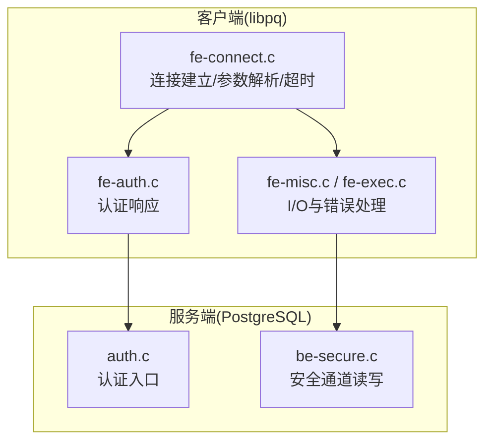
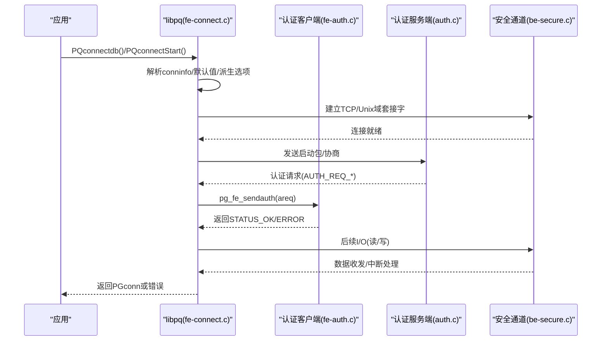
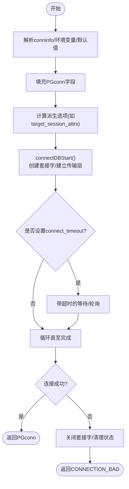
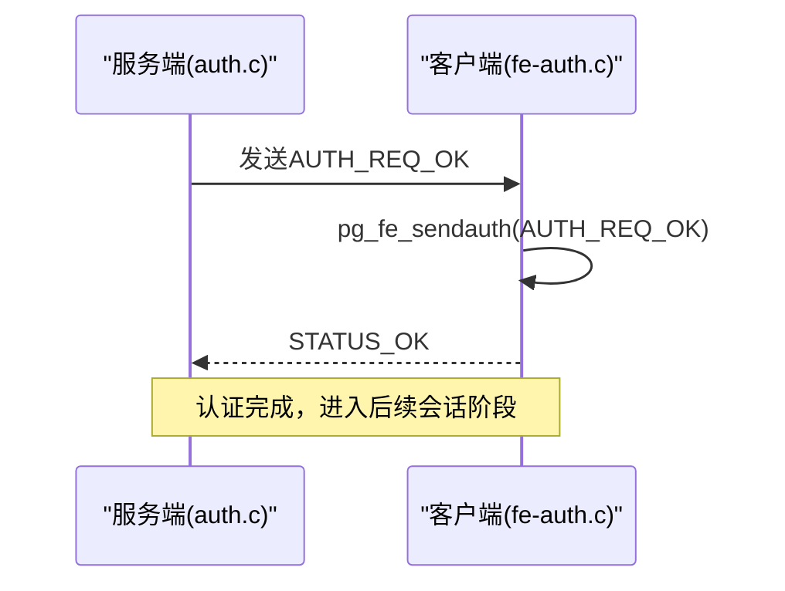
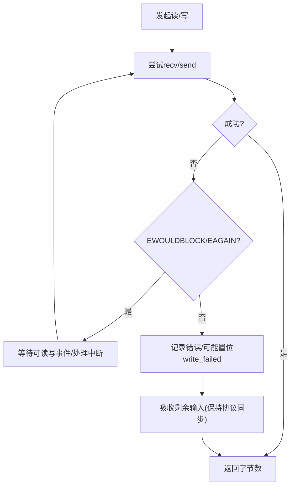
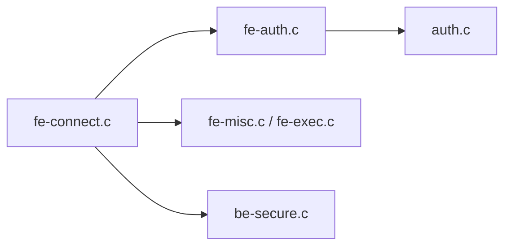

# 连接问题诊断

<cite>
**本文引用的文件**
- [fe-connect.c](file://src/interfaces/libpq/fe-connect.c)
- [fe-auth.c](file://src/interfaces/libpq/fe-auth.c)
- [auth.c](file://src/backend/libpq/auth.c)
- [be-secure.c](file://src/backend/libpq/be-secure.c)
- [fe-misc.c](file://src/interfaces/libpq/fe-misc.c)
- [fe-exec.c](file://src/interfaces/libpq/fe-exec.c)
- [config.sgml](file://doc/src/sgml/config.sgml)
- [client-auth.sgml](file://doc/src/sgml/client-auth.sgml)
</cite>

## 目录
1. [简介](#简介)
2. [项目结构](#项目结构)
3. [核心组件](#核心组件)
4. [架构总览](#架构总览)
5. [详细组件分析](#详细组件分析)
6. [依赖关系分析](#依赖关系分析)
7. [性能与稳定性考虑](#性能与稳定性考虑)
8. [故障排查指南](#故障排查指南)
9. [结论](#结论)
10. [附录](#附录)

## 简介
本指南面向应用开发者，聚焦 PostgreSQL 客户端（libpq）与服务端在连接阶段的常见问题与定位方法。内容涵盖：网络配置错误、认证失败、连接数限制、防火墙设置、连接超时、连接池管理与泄漏、SSL 连接配置与排障等。结合代码级实现说明 libpq 的连接机制、错误处理路径与可观测点，帮助快速定位并解决问题。

## 项目结构
围绕“连接”的关键代码分布在以下位置：
- 客户端连接与参数解析：src/interfaces/libpq/fe-connect.c
- 客户端认证响应：src/interfaces/libpq/fe-auth.c
- 服务端认证入口：src/backend/libpq/auth.c
- 安全通道读写（SSL/TLS 层抽象）：src/backend/libpq/be-secure.c
- 客户端 I/O 与错误累积：src/interfaces/libpq/fe-misc.c, src/interfaces/libpq/fe-exec.c
- 文档：doc/src/sgml/config.sgml, doc/src/sgml/client-auth.sgml

图表来源
- [fe-connect.c:465-685](file://src/interfaces/libpq/fe-connect.c#L465-L685)
- [fe-auth.c:50-65](file://src/interfaces/libpq/fe-auth.c#L50-L65)
- [auth.c:59-76](file://src/backend/libpq/auth.c#L59-L76)
- [be-secure.c:48-117](file://src/backend/libpq/be-secure.c#L48-L117)

章节来源
- [fe-connect.c:465-685](file://src/interfaces/libpq/fe-connect.c#L465-L685)
- [fe-auth.c:50-65](file://src/interfaces/libpq/fe-auth.c#L50-L65)
- [auth.c:59-76](file://src/backend/libpq/auth.c#L59-L76)
- [be-secure.c:48-117](file://src/backend/libpq/be-secure.c#L48-L117)

## 核心组件
- 连接建立流程：PQconnectdb/PQconnectStart 系列函数负责解析连接字符串或键值对，填充 PGconn，进入 connectDBStart/connectDBComplete 完成握手。
- 认证流程：服务端发送认证请求，客户端根据类型响应；当前仓库中服务端已简化为无条件信任放行。
- 安全通道：be-secure 提供统一的安全读/写接口，屏蔽底层 SSL/TLS 差异。
- 错误处理：fe-misc/fe-exec 负责写入失败、读取缓冲、错误消息累积与异步结果保存。

章节来源
- [fe-connect.c:465-685](file://src/interfaces/libpq/fe-connect.c#L465-L685)
- [auth.c:59-76](file://src/backend/libpq/auth.c#L59-L76)
- [be-secure.c:48-117](file://src/backend/libpq/be-secure.c#L48-L117)
- [fe-misc.c:949-987](file://src/interfaces/libpq/fe-misc.c#L949-L987)
- [fe-exec.c:754-801](file://src/interfaces/libpq/fe-exec.c#L754-L801)

## 架构总览
下图展示从应用调用到服务端认证的端到端时序，标注了关键函数与状态转换。

图表来源
- [fe-connect.c:465-685](file://src/interfaces/libpq/fe-connect.c#L465-L685)
- [fe-auth.c:50-65](file://src/interfaces/libpq/fe-auth.c#L50-L65)
- [auth.c:59-76](file://src/backend/libpq/auth.c#L59-L76)
- [be-secure.c:48-117](file://src/backend/libpq/be-secure.c#L48-L117)

## 详细组件分析

### 连接建立与超时控制（fe-connect.c）
- 入口函数：PQconnectdb、PQconnectStart、PQconnectdbParams 等，内部调用 connectDBStart/connectDBComplete。
- 参数解析：支持 conninfo 字符串与键值对数组，包含 host/port/dbname/user/password/keepalives/tcp_user_timeout 等。
- 超时控制：connect_timeout 解析与最小值保护；非零时设置等待上限，避免长时间阻塞。
- Keepalive：根据 keepalives_* 参数设置 SO_KEEPALIVE、空闲时间、间隔、计数以及 TCP_USER_TIMEOUT。
- 地址重试：当某地址不可用时，尝试下一个候选地址，提升连通性。

图表来源
- [fe-connect.c:465-685](file://src/interfaces/libpq/fe-connect.c#L465-L685)
- [fe-connect.c:1713-1774](file://src/interfaces/libpq/fe-connect.c#L1713-L1774)
- [fe-connect.c:2195-2242](file://src/interfaces/libpq/fe-connect.c#L2195-L2242)

章节来源
- [fe-connect.c:465-685](file://src/interfaces/libpq/fe-connect.c#L465-L685)
- [fe-connect.c:1713-1774](file://src/interfaces/libpq/fe-connect.c#L1713-L1774)
- [fe-connect.c:2195-2242](file://src/interfaces/libpq/fe-connect.c#L2195-L2242)

### 认证流程（fe-auth.c 与 auth.c）
- 服务端：ClientAuthentication 在当前仓库中被简化为直接发送 AUTH_REQ_OK，跳过基于主机的访问控制与密码验证。
- 客户端：pg_fe_sendauth 接收认证请求类型，仅支持 AUTH_REQ_OK，其他类型将报错。
- 影响：若服务端未启用密码或外部认证，客户端无需提供凭据即可通过认证阶段；但需注意生产环境应谨慎评估安全性。

图表来源
- [auth.c:59-76](file://src/backend/libpq/auth.c#L59-L76)
- [fe-auth.c:50-65](file://src/interfaces/libpq/fe-auth.c#L50-L65)

章节来源
- [auth.c:59-76](file://src/backend/libpq/auth.c#L59-L76)
- [fe-auth.c:50-65](file://src/interfaces/libpq/fe-auth.c#L50-L65)

### 安全通道与I/O（be-secure.c 与 fe-misc.c）
- 安全读/写：secure_read/secure_write 封装底层 recv/send，处理 EWOULDBLOCK/EAGAIN 及中断事件，保证阻塞模式下的正确等待。
- 客户端I/O：fe-misc 维护输入输出缓冲，处理写入失败后的状态标记 write_failed，防止继续发送导致协议失步；同时持续吸收输入以收集最终错误信息。
- 错误保存：fe-exec 将当前错误消息保存到异步结果对象，便于上层获取。

图表来源
- [be-secure.c:48-117](file://src/backend/libpq/be-secure.c#L48-L117)
- [be-secure.c:137-199](file://src/backend/libpq/be-secure.c#L137-L199)
- [fe-misc.c:949-987](file://src/interfaces/libpq/fe-misc.c#L949-L987)
- [fe-exec.c:754-801](file://src/interfaces/libpq/fe-exec.c#L754-L801)

章节来源
- [be-secure.c:48-117](file://src/backend/libpq/be-secure.c#L48-L117)
- [be-secure.c:137-199](file://src/backend/libpq/be-secure.c#L137-L199)
- [fe-misc.c:949-987](file://src/interfaces/libpq/fe-misc.c#L949-L987)
- [fe-exec.c:754-801](file://src/interfaces/libpq/fe-exec.c#L754-L801)

### 连接参数与系统限制（config.sgml）
- Unix 域套接字权限：unix_socket_permissions 控制本地 socket 的访问权限，影响本地连接的可达性与安全性。
- 建议：在多用户环境中，合理设置权限或使用受限目录存放 socket，避免任意用户连接。

章节来源
- [config.sgml:791-822](file://doc/src/sgml/config.sgml#L791-L822)

## 依赖关系分析
- fe-connect.c 依赖 fe-auth.c（认证响应）、be-secure.c（安全I/O抽象）、fe-misc.c/fe-exec.c（I/O与错误）。
- 服务端 auth.c 与 be-secure.c 共同完成认证与安全通道。
- 文档 config.sgml 与 client-auth.sgml 提供配置与认证策略的背景知识。

图表来源
- [fe-connect.c:465-685](file://src/interfaces/libpq/fe-connect.c#L465-L685)
- [fe-auth.c:50-65](file://src/interfaces/libpq/fe-auth.c#L50-L65)
- [auth.c:59-76](file://src/backend/libpq/auth.c#L59-L76)
- [be-secure.c:48-117](file://src/backend/libpq/be-secure.c#L48-L117)

## 性能与稳定性考虑
- 连接超时：合理设置 connect_timeout，避免长时阻塞；注意最小值保护，防止过短导致误判。
- Keepalive：启用并调优 keepalives_idle/interval/count，及时检测死连接；必要时调整 TCP_USER_TIMEOUT。
- I/O 缓冲与错误恢复：写入失败后不再发送，但继续吸收输入以收集错误；确保应用侧能识别并重置连接。
- 地址重试：多地址场景下自动切换，提高可用性。

[本节为通用指导，不直接分析具体文件]

## 故障排查指南

### 常见原因与解决方法
- 网络配置错误
  - 症状：无法解析主机名、端口不可达、Unix 域 socket 权限不足。
  - 检查：host/port/unix_socket_directories/unix_socket_permissions；确认 DNS/hosts 与防火墙规则。
  - 参考：socket 权限说明见配置文档。
  - 章节来源
    - [config.sgml:791-822](file://doc/src/sgml/config.sgml#L791-L822)

- 认证失败
  - 症状：认证请求不被支持或凭据错误。
  - 检查：服务端认证方法；客户端支持的认证类型；当前仓库中服务端已简化为信任放行，若自定义扩展需确保客户端支持对应方法。
  - 参考：客户端认证响应逻辑与服务端认证入口。
  - 章节来源
    - [fe-auth.c:50-65](file://src/interfaces/libpq/fe-auth.c#L50-L65)
    - [auth.c:59-76](file://src/backend/libpq/auth.c#L59-L76)

- 连接数限制
  - 症状：新连接被拒绝或排队。
  - 检查：max_connections、资源限制（ulimit）、操作系统内核参数；监控活跃连接数。
  - 建议：扩容或优化连接使用模式。

- 防火墙设置
  - 症状：端口被拦截、ICMP 不可达。
  - 检查：iptables/firewalld/云安全组；确认入站/出站规则允许数据库端口。

- 连接超时
  - 症状：连接建立耗时过长或提前超时。
  - 检查：connect_timeout 设置；网络延迟；DNS 解析耗时；服务器负载。
  - 参考：connect_timeout 解析与最小值保护。
  - 章节来源
    - [fe-connect.c:1713-1774](file://src/interfaces/libpq/fe-connect.c#L1713-L1774)

- 连接池管理与泄漏
  - 症状：连接数持续增长、资源耗尽。
  - 检查：应用是否正确释放 PGconn（PQfinish）；是否存在异常分支未关闭；连接生命周期管理。
  - 建议：使用连接池（如 PgBouncer）统一管理；确保异常路径释放资源。

- SSL 连接配置与故障排除
  - 症状：握手失败、证书校验失败、协议版本不匹配。
  - 检查：SSL 相关参数（sslmode、sslcert、sslkey、sslrootcert）；证书链完整性；服务端 SSL 配置。
  - 参考：安全通道抽象与名称校验接口。
  - 章节来源
    - [be-secure.c:48-117](file://src/backend/libpq/be-secure.c#L48-L117)

### 快速定位步骤
- 查看错误消息：通过 PGconn 的错误缓冲区获取详细错误信息。
- 启用日志：在服务端开启连接与认证日志，观察握手过程。
- 抓包分析：使用 tcpdump/wireshark 捕获 TLS 握手与协议报文。
- 逐步缩小范围：先测试本地 Unix 域 socket，再测试 TCP/IP；逐步启用/禁用 SSL。

## 结论
通过理解 libpq 的连接流程、认证机制与安全通道实现，结合合理的超时、Keepalive 与连接池策略，可以高效定位并解决大多数连接问题。对于 SSL 连接，务必关注证书与协议兼容性。建议在开发阶段即引入完善的错误处理与资源管理，减少线上风险。

## 附录
- 常用连接参数：host、port、dbname、user、password、connect_timeout、keepalives、tcp_user_timeout 等。
- 推荐实践：
  - 设置合理的 connect_timeout 与 keepalives。
  - 使用连接池管理连接生命周期。
  - 在生产环境启用 SSL 并严格校验证书。
  - 定期审计 pg_hba.conf 与 socket 权限，确保安全。

[本节为通用指导，不直接分析具体文件]