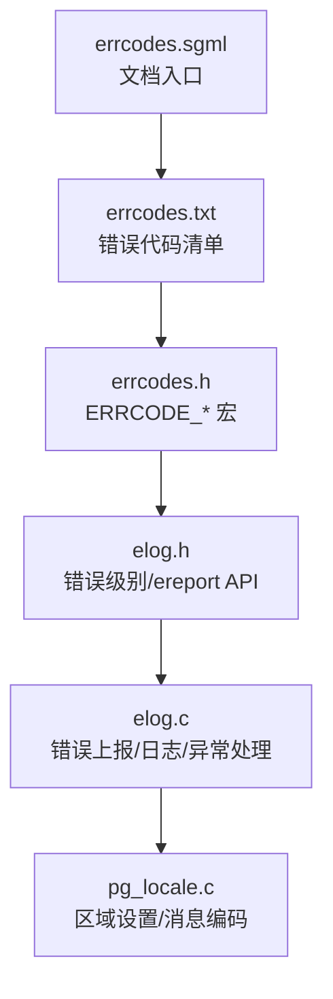
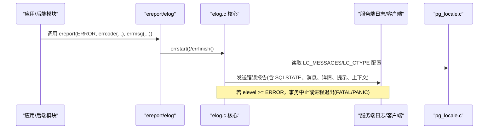
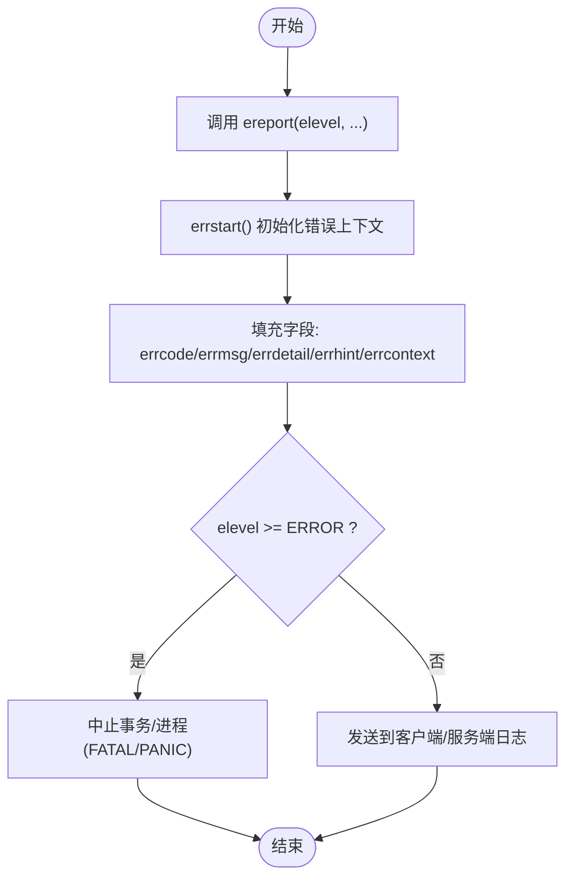
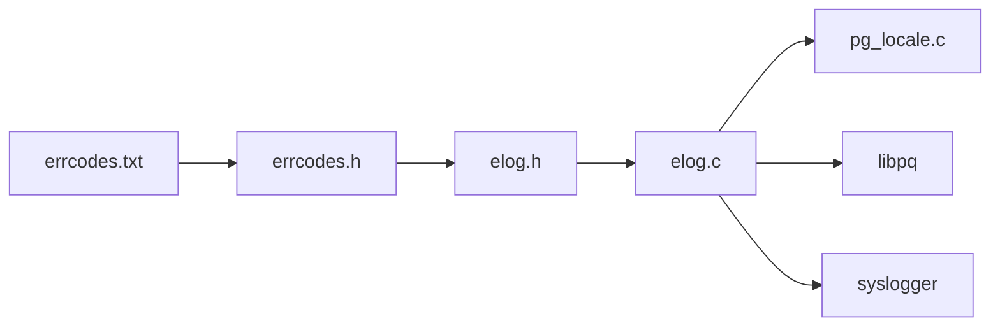

# 错误代码参考

<cite>
**本文引用的文件**
- [src/include/utils/errcodes.h](file://src/include/utils/errcodes.h)
- [src/backend/utils/errcodes.txt](file://src/backend/utils/errcodes.txt)
- [src/include/utils/elog.h](file://src/include/utils/elog.h)
- [src/backend/utils/error/elog.c](file://src/backend/utils/error/elog.c)
- [doc/src/sgml/errcodes.sgml](file://doc/src/sgml/errcodes.sgml)
- [src/backend/utils/adt/pg_locale.c](file://src/backend/utils/adt/pg_locale.c)
</cite>

## 目录
1. [简介](#简介)
2. [项目结构](#项目结构)
3. [核心组件](#核心组件)
4. [架构总览](#架构总览)
5. [详细组件分析](#详细组件分析)
6. [依赖关系分析](#依赖关系分析)
7. [性能考虑](#性能考虑)
8. [故障诊断与调试指南](#故障诊断与调试指南)
9. [结论](#结论)
10. [附录：SQLSTATE 错误代码分类速查](#附录sqlstate-错误代码分类速查)

## 简介
本手册面向开发者与维护人员，系统化整理 PostgreSQL 的 SQLSTATE 错误代码、错误级别（ERROR/FATAL/PANIC 等）、错误消息本地化机制、自定义错误消息方法以及常见错误的调试技巧与日志分析方法。内容基于仓库中的源码与文档，提供可追溯的代码级引用与可视化图示，帮助快速定位问题并制定修复策略。

## 项目结构
围绕错误处理的核心文件分布如下：
- 错误代码定义与生成源：
  - src/backend/utils/errcodes.txt：权威的错误代码清单（含类别、类型 E/W/S、宏名、PL/pgSQL 条件名）
  - src/include/utils/errcodes.h：由 errcodes.txt 生成的 C 头文件，包含所有 ERRCODE_* 宏
- 错误报告与日志框架：
  - src/include/utils/elog.h：错误级别、ereport/elog API、异常捕获 PG_TRY/PG_CATCH、ErrorData 结构体
  - src/backend/utils/error/elog.c：错误上报、格式化、输出到服务端日志/客户端、递归保护、回溯等实现
- 文档与本地化：
  - doc/src/sgml/errcodes.sgml：官方错误码文档入口
  - src/backend/utils/adt/pg_locale.c：区域设置与消息编码管理（LC_MESSAGES、LC_CTYPE 等）

**图表来源**
- [src/backend/utils/errcodes.txt:1-40](file://src/backend/utils/errcodes.txt#L1-L40)
- [src/include/utils/errcodes.h:1-10](file://src/include/utils/errcodes.h#L1-L10)
- [src/include/utils/elog.h:19-50](file://src/include/utils/elog.h#L19-L50)
- [src/backend/utils/error/elog.c:1-120](file://src/backend/utils/error/elog.c#L1-L120)
- [doc/src/sgml/errcodes.sgml:11-32](file://doc/src/sgml/errcodes.sgml#L11-L32)

**章节来源**
- [src/backend/utils/errcodes.txt:1-40](file://src/backend/utils/errcodes.txt#L1-L40)
- [src/include/utils/errcodes.h:1-10](file://src/include/utils/errcodes.h#L1-L10)
- [src/include/utils/elog.h:19-50](file://src/include/utils/elog.h#L19-L50)
- [src/backend/utils/error/elog.c:1-120](file://src/backend/utils/error/elog.c#L1-L120)
- [doc/src/sgml/errcodes.sgml:11-32](file://doc/src/sgml/errcodes.sgml#L11-L32)

## 核心组件
- SQLSTATE 错误代码体系
  - 以五字符代码表示，前两位为“类”，后三位为“子类”
  - 通过 errcodes.txt 维护，自动生成 errcodes.h 中的 ERRCODE_* 宏
  - 支持标准类与扩展类（如 HV PL/pgSQL P0 内部错误 XX）
- 错误级别与上报机制
  - 级别：DEBUG1-5、LOG、INFO、NOTICE、WARNING、ERROR、FATAL、PANIC
  - 新式 API：ereport(elevel, ...) + errcode()/errmsg()/errdetail()/errhint()
  - 旧式 API：elog(level, fmt, ...)
  - 异常捕获：PG_TRY/PG_CATCH/PG_FINALLY/PG_END_TRY
- 错误数据结构与上下文
  - ErrorData：封装 elevel、sqlerrcode、message/detail/hint/context/backtrace、对象名、游标位置等
  - 错误上下文栈 error_context_stack，便于嵌套错误时保留调用链
- 本地化与消息编码
  - LC_MESSAGES 控制消息语言；LC_CTYPE 影响消息编码
  - minipg 移除了 NLS 翻译子系统，消息格式串为 ASCII，但 %s 中可能包含数据库编码字符串

**章节来源**
- [src/backend/utils/errcodes.txt:24-75](file://src/backend/utils/errcodes.txt#L24-L75)
- [src/include/utils/errcodes.h:4-353](file://src/include/utils/errcodes.h#L4-L353)
- [src/include/utils/elog.h:19-50](file://src/include/utils/elog.h#L19-L50)
- [src/include/utils/elog.h:93-158](file://src/include/utils/elog.h#L93-L158)
- [src/include/utils/elog.h:254-344](file://src/include/utils/elog.h#L254-L344)
- [src/include/utils/elog.h:369-415](file://src/include/utils/elog.h#L369-L415)
- [src/backend/utils/adt/pg_locale.c:12-30](file://src/backend/utils/adt/pg_locale.c#L12-L30)
- [src/backend/utils/adt/pg_locale.c:140-154](file://src/backend/utils/adt/pg_locale.c#L140-L154)

## 架构总览
错误从业务逻辑触发，经 ereport/elog 进入错误上报流程，最终根据级别决定输出目标（客户端/服务端日志），并附带 SQLSTATE、详细信息、提示与上下文。

**图表来源**
- [src/include/utils/elog.h:93-158](file://src/include/utils/elog.h#L93-L158)
- [src/backend/utils/error/elog.c:1-120](file://src/backend/utils/error/elog.c#L1-L120)
- [src/backend/utils/adt/pg_locale.c:12-30](file://src/backend/utils/adt/pg_locale.c#L12-L30)

## 详细组件分析

### SQLSTATE 错误代码分类与含义
- 分类规则
  - 前两位为“类”，例如 22 数据异常、23 完整性约束违反、40 事务回滚、53 资源不足、HV 外部数据包装器、P0 PL/pgSQL、XX 内部错误
  - 后三位为“子类”，更具体地描述条件
- 典型类别与说明
  - 00 成功完成、01 警告、02 无数据
  - 08 连接异常、22 数据异常、23 完整性约束违反、25 事务状态非法、40 事务回滚
  - 53 资源不足、54 程序限制超限、57 操作干预、58 系统错误、HV FDW 错误、P0 PL/pgSQL 错误、XX 内部错误
- 使用建议
  - 优先按“类”判断进行通用处理，再针对“子类”做精细处理
  - 避免仅依赖人类可读消息，应测试 SQLSTATE 代码

**章节来源**
- [doc/src/sgml/errcodes.sgml:11-32](file://doc/src/sgml/errcodes.sgml#L11-L32)
- [src/backend/utils/errcodes.txt:77-495](file://src/backend/utils/errcodes.txt#L77-L495)
- [src/include/utils/errcodes.h:4-353](file://src/include/utils/errcodes.h#L4-L353)

### 错误级别（ERROR、FATAL、PANIC 等）的区别与处理方式
- 级别定义
  - DEBUG1-5、LOG、INFO、NOTICE、WARNING、ERROR、FATAL、PANIC
- 行为差异
  - ERROR：中止当前事务，返回已知状态
  - FATAL：终止当前进程
  - PANIC：拉垮其他后端（严重崩溃）
  - WARNING/NOTICE/INFO/LOG：不中断执行，用于提示与审计
- 处理建议
  - 对 ERROR：捕获并恢复事务状态，必要时重试或降级
  - 对 FATAL/PANIC：记录完整上下文，重启服务，排查底层资源/内核问题
  - 对 WARNING/NOTICE：优化查询或调整参数，避免频繁出现

**章节来源**
- [src/include/utils/elog.h:19-50](file://src/include/utils/elog.h#L19-L50)
- [src/backend/utils/error/elog.c:184-200](file://src/backend/utils/error/elog.c#L184-L200)

### 错误消息本地化与自定义错误消息
- 本地化机制
  - LC_MESSAGES 控制消息语言；LC_CTYPE 影响消息编码
  - minipg 移除了 NLS 翻译子系统，消息格式串为 ASCII，但 %s 中可能包含数据库编码字符串
- 自定义错误消息
  - 使用 errmsg()/errmsg_internal() 设置主消息
  - 使用 errdetail()/errdetail_log() 添加细节
  - 使用 errhint() 提供解决建议
  - 使用 errcontext() 附加上下文信息
  - 使用 errposition()/internalerrposition() 标注语句位置
- 最佳实践
  - 始终提供清晰的 SQLSTATE，便于客户端程序化处理
  - 将敏感信息放入 detail_log，避免泄露给客户端

**章节来源**
- [src/backend/utils/adt/pg_locale.c:12-30](file://src/backend/utils/adt/pg_locale.c#L12-L30)
- [src/backend/utils/adt/pg_locale.c:140-154](file://src/backend/utils/adt/pg_locale.c#L140-L154)
- [src/include/utils/elog.h:168-224](file://src/include/utils/elog.h#L168-L224)

### 错误上报流程与异常捕获
- 新式 API 调用链
  - ereport(elevel, ...) -> errstart()/errfinish() -> 输出到日志/客户端
- 异常捕获
  - PG_TRY/PG_CATCH/PG_FINALLY/PG_END_TRY
  - 在 PG_CATCH 中可选择 PG_RE_THROW 或进行子事务中止
- 递归保护
  - 错误处理期间再次报错会进入递归保护，防止无限递归导致崩溃

**图表来源**
- [src/include/utils/elog.h:93-158](file://src/include/utils/elog.h#L93-L158)
- [src/include/utils/elog.h:254-344](file://src/include/utils/elog.h#L254-L344)
- [src/backend/utils/error/elog.c:1-120](file://src/backend/utils/error/elog.c#L1-L120)

**章节来源**
- [src/include/utils/elog.h:93-158](file://src/include/utils/elog.h#L93-L158)
- [src/include/utils/elog.h:254-344](file://src/include/utils/elog.h#L254-L344)
- [src/backend/utils/error/elog.c:1-120](file://src/backend/utils/error/elog.c#L1-L120)

### 常见错误类别与解决建议
- 数据异常（22xxx）
  - 触发条件：除零、类型不匹配、字符串截断、JSON/XML 解析失败等
  - 建议：校验输入、调整数据类型、修正函数参数
- 完整性约束违反（23xxx）
  - 触发条件：非空、外键、唯一、检查约束冲突
  - 建议：清理数据、调整约束、使用 ON CONFLICT 策略
- 事务回滚（40xxx）
  - 触发条件：序列化失败、死锁检测、完整性约束导致回滚
  - 建议：重试事务、优化锁竞争、减少长事务
- 资源不足（53xxx）
  - 触发条件：磁盘满、内存不足、连接数超限、配置限制
  - 建议：扩容、调优参数、清理临时文件、限制并发
- 外部数据包装器（HVxxx）
  - 触发条件：FDW 连接失败、列名不存在、类型不匹配
  - 建议：检查 FDW 配置、权限、远程端可用性
- PL/pgSQL 错误（P0xxx）
  - 触发条件：RAISE、未找到数据、行数过多、断言失败
  - 建议：完善异常分支、增加数据存在性检查
- 内部错误（XXxxx）
  - 触发条件：数据损坏、索引损坏、不可达条件
  - 建议：备份恢复、运行一致性检查工具、升级版本

**章节来源**
- [src/backend/utils/errcodes.txt:153-495](file://src/backend/utils/errcodes.txt#L153-L495)
- [src/include/utils/errcodes.h:63-353](file://src/include/utils/errcodes.h#L63-L353)

## 依赖关系分析
- 错误代码依赖
  - errcodes.txt 作为单一事实源，生成 errcodes.h 与文档表
- 错误上报依赖
  - elog.h 提供 API 与数据结构，elog.c 实现核心逻辑
  - pg_locale.c 提供区域设置与消息编码
- 外部集成点
  - libpq（客户端通信）、syslogger（服务端日志）、存储层（事务/锁）

**图表来源**
- [src/backend/utils/errcodes.txt:1-40](file://src/backend/utils/errcodes.txt#L1-L40)
- [src/include/utils/errcodes.h:1-10](file://src/include/utils/errcodes.h#L1-L10)
- [src/include/utils/elog.h:19-50](file://src/include/utils/elog.h#L19-L50)
- [src/backend/utils/error/elog.c:1-120](file://src/backend/utils/error/elog.c#L1-L120)
- [src/backend/utils/adt/pg_locale.c:12-30](file://src/backend/utils/adt/pg_locale.c#L12-L30)

**章节来源**
- [src/backend/utils/errcodes.txt:1-40](file://src/backend/utils/errcodes.txt#L1-L40)
- [src/include/utils/errcodes.h:1-10](file://src/include/utils/errcodes.h#L1-L10)
- [src/include/utils/elog.h:19-50](file://src/include/utils/elog.h#L19-L50)
- [src/backend/utils/error/elog.c:1-120](file://src/backend/utils/error/elog.c#L1-L120)
- [src/backend/utils/adt/pg_locale.c:12-30](file://src/backend/utils/adt/pg_locale.c#L12-L30)

## 性能考虑
- 错误上报在高频率场景下需避免额外开销
  - 使用 __builtin_constant_p 优化非 ERROR 路径
  - 仅在必要时启用详细日志与回溯
- 递归错误保护
  - 错误处理期间再次报错会进入保护栈，避免无限递归
- 日志输出
  - 合理配置 log_min_messages 与 Log_destination，平衡可观测性与性能

[本节为通用指导，无需特定文件引用]

## 故障诊断与调试指南
- 定位错误来源
  - 使用 errcontext() 附加上下文，结合 backtrace 定位调用链
  - 使用 errposition()/internalerrposition() 标注语句位置
- 日志分析
  - 关注 SQLSTATE 与错误类，快速归类问题
  - 查看 detail 与 hint，获取具体原因与建议
- 常见问题
  - 连接异常（08xxx）：检查网络、认证、服务器状态
  - 数据异常（22xxx）：校验输入、类型转换、函数参数
  - 完整性约束（23xxx）：清理数据、调整约束策略
  - 事务回滚（40xxx）：重试、优化锁、缩短事务
  - 资源不足（53xxx）：扩容、调参、清理资源
  - FDW 错误（HVxxx）：检查 FDW 配置与远程端
  - PL/pgSQL 错误（P0xxx）：完善异常分支、数据存在性检查
  - 内部错误（XXxxx）：备份恢复、一致性检查、升级版本

**章节来源**
- [src/include/utils/elog.h:168-224](file://src/include/utils/elog.h#L168-L224)
- [src/backend/utils/error/elog.c:1-120](file://src/backend/utils/error/elog.c#L1-L120)
- [src/backend/utils/errcodes.txt:77-495](file://src/backend/utils/errcodes.txt#L77-L495)

## 结论
本手册基于源码与文档，系统整理了 PostgreSQL 的 SQLSTATE 错误代码、错误级别、本地化机制与自定义错误消息方法，并提供常见错误的调试技巧与日志分析方法。建议在实际开发中：
- 优先使用 SQLSTATE 进行程序化错误处理
- 合理使用错误级别与上报 API，确保可观测性与稳定性
- 结合上下文与提示，快速定位与解决问题
- 定期审查日志与错误模式，持续优化系统健壮性

[本节为总结，无需特定文件引用]

## 附录：SQLSTATE 错误代码分类速查
- 00 成功完成
- 01 警告
- 02 无数据
- 08 连接异常
- 22 数据异常
- 23 完整性约束违反
- 25 事务状态非法
- 40 事务回滚
- 53 资源不足
- 54 程序限制超限
- 57 操作干预
- 58 系统错误
- HV 外部数据包装器错误
- P0 PL/pgSQL 错误
- XX 内部错误

**章节来源**
- [src/backend/utils/errcodes.txt:77-495](file://src/backend/utils/errcodes.txt#L77-L495)
- [src/include/utils/errcodes.h:4-353](file://src/include/utils/errcodes.h#L4-L353)