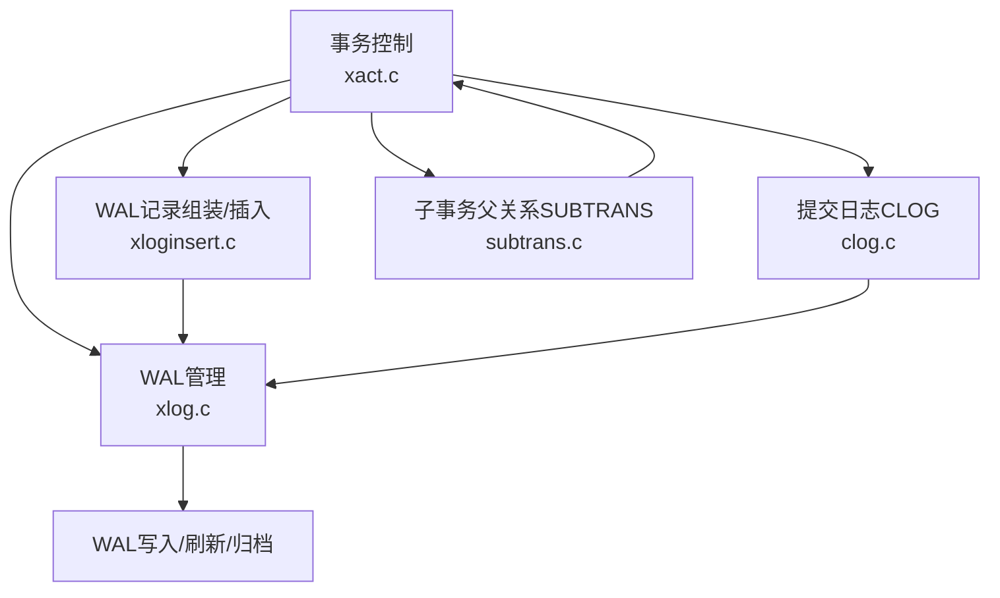
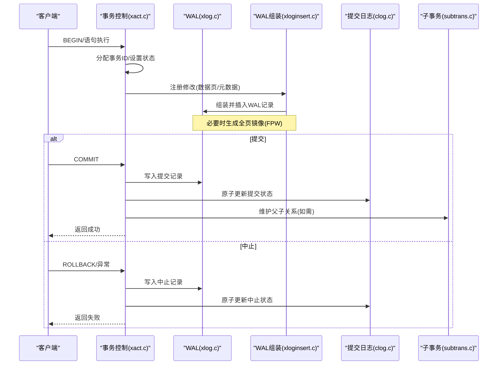
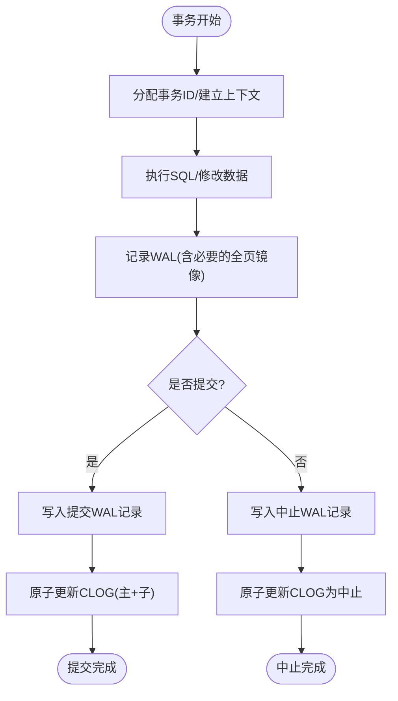
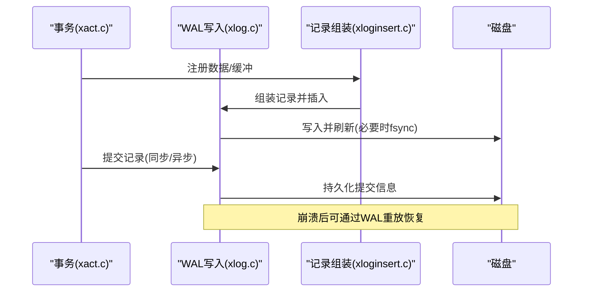
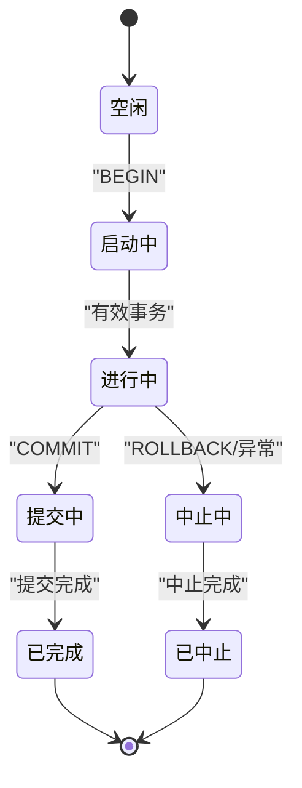
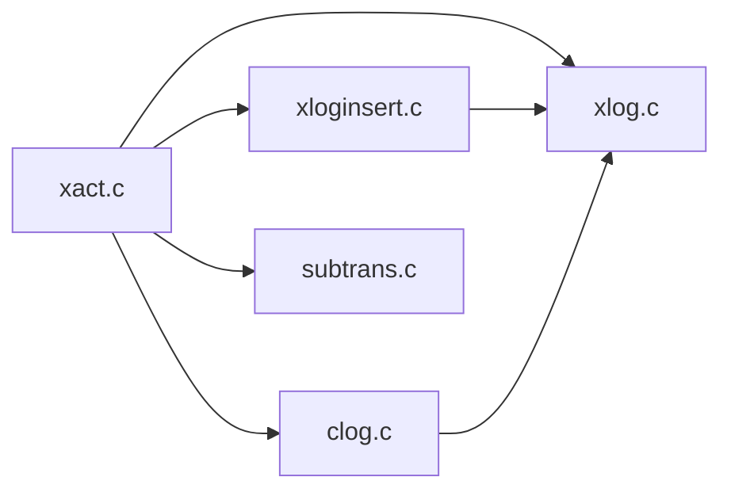

# ACID事务特性

<cite>
**本文引用的文件**   
- [xact.c](file://src/backend/access/transam/xact.c)
- [xlog.c](file://src/backend/access/transam/xlog.c)
- [xloginsert.c](file://src/backend/access/transam/xloginsert.c)
- [clog.c](file://src/backend/access/transam/clog.c)
- [subtrans.c](file://src/backend/access/transam/subtrans.c)
</cite>

## 目录
1. [简介](#简介)
2. [项目结构](#项目结构)
3. [核心组件](#核心组件)
4. [架构总览](#架构总览)
5. [详细组件分析](#详细组件分析)
6. [依赖关系分析](#依赖关系分析)
7. [性能考虑](#性能考虑)
8. [故障排查指南](#故障排查指南)
9. [结论](#结论)
10. [附录](#附录)

## 简介
本文件面向Mini PostgreSQL的ACID事务特性，围绕原子性、一致性、隔离性与持久性四个维度，结合源码实现进行系统化说明。重点覆盖：
- 原子性：事务边界定义、回滚段（子事务）管理与故障恢复策略
- 一致性：约束检查、触发器执行与引用完整性维护在事务中的角色
- 隔离性：读已提交、可重复读、串行化隔离的实现要点
- 持久性：WAL写入机制与崩溃恢复流程
同时提供事务状态转换图、错误处理策略与性能优化建议，帮助开发者理解并完善ACID实现。

## 项目结构
与ACID事务相关的核心代码集中在后端访问层的事务子系统与WAL子系统：
- 事务控制与生命周期：xact.c
- WAL日志管理：xlog.c
- WAL记录组装与插入：xloginsert.c
- 提交日志（CLOG）：clog.c
- 子事务父关系（SUBTRANS）：subtrans.c

**图表来源**
- [xact.c:127-203](file://src/backend/access/transam/xact.c#L127-L203)
- [xlog.c:85-100](file://src/backend/access/transam/xlog.c#L85-L100)
- [xloginsert.c:122-137](file://src/backend/access/transam/xloginsert.c#L122-L137)
- [clog.c:112-165](file://src/backend/access/transam/clog.c#L112-L165)
- [subtrans.c:70-103](file://src/backend/access/transam/subtrans.c#L70-L103)

**章节来源**
- [xact.c:127-203](file://src/backend/access/transam/xact.c#L127-L203)
- [xlog.c:85-100](file://src/backend/access/transam/xlog.c#L85-L100)

## 核心组件
- 事务控制（xact.c）
  - 事务状态机：TRANS_*与TBlockState*，用于描述事务与事务块的生命周期
  - 事务ID分配与子事务关系维护
  - 同步/异步提交控制参数
- WAL管理（xlog.c）
  - WAL写入、刷新、归档、恢复流程
  - 全页写（FPW）决策与时间线管理
- WAL记录组装（xloginsert.c）
  - 构建WAL记录、注册数据与缓冲、压缩与校验
- 提交日志（clog.c）
  - 事务最终状态（提交/中止）的原子更新与分组优化
- 子事务父关系（subtrans.c）
  - 子事务到父事务的映射，支持嵌套事务的回滚与可见性判断

**章节来源**
- [xact.c:127-203](file://src/backend/access/transam/xact.c#L127-L203)
- [xlog.c:85-100](file://src/backend/access/transam/xlog.c#L85-L100)
- [xloginsert.c:122-137](file://src/backend/access/transam/xloginsert.c#L122-L137)
- [clog.c:112-165](file://src/backend/access/transam/clog.c#L112-L165)
- [subtrans.c:70-103](file://src/backend/access/transam/subtrans.c#L70-L103)

## 架构总览
下图展示事务从开始到提交/中止的关键路径，以及WAL与CLOG/SUBTRANS的协作关系。

**图表来源**
- [xact.c:127-203](file://src/backend/access/transam/xact.c#L127-L203)
- [xloginsert.c:421-476](file://src/backend/access/transam/xloginsert.c#L421-L476)
- [xlog.c:341-358](file://src/backend/access/transam/xlog.c#L341-L358)
- [clog.c:163-229](file://src/backend/access/transam/clog.c#L163-L229)
- [subtrans.c:70-103](file://src/backend/access/transam/subtrans.c#L70-L103)

## 详细组件分析

### 原子性（Atomicity）
- 事务边界定义
  - 通过事务状态机（TRANS_*与TBlockState*）明确BEGIN/COMMIT/ROLLBACK等边界，确保操作要么全部生效，要么全部不生效
  - 子事务支持：通过SUBTRANS维护父子关系，允许部分回滚而不影响父事务
- 回滚段管理
  - 子事务父关系由SUBTRANS管理，支持快速定位顶层事务，便于回滚传播
  - 提交状态由CLOG原子更新，保证多页面更新的原子性（先标记子提交，再主提交）
- 故障恢复策略
  - 崩溃后通过WAL重放恢复一致状态；CLOG与WAL配合确保“写前日志”规则
  - 子事务在重启时按父子关系进行回滚或提交

**图表来源**
- [xact.c:127-203](file://src/backend/access/transam/xact.c#L127-L203)
- [xloginsert.c:421-476](file://src/backend/access/transam/xloginsert.c#L421-L476)
- [clog.c:163-229](file://src/backend/access/transam/clog.c#L163-L229)

**章节来源**
- [xact.c:127-203](file://src/backend/access/transam/xact.c#L127-L203)
- [subtrans.c:70-103](file://src/backend/access/transam/subtrans.c#L70-L103)
- [clog.c:163-229](file://src/backend/access/transam/clog.c#L163-L229)

### 一致性（Consistency）
- 约束检查
  - 在事务内对DDL/DML施加约束检查（如NOT NULL、UNIQUE、CHECK），失败则中止事务
- 触发器执行
  - 触发器作为事务的一部分执行，若触发器失败，整个事务中止
- 引用完整性维护
  - 外键约束在提交时或语句级进行检查，确保跨表引用一致
- 注意
  - 一致性更多体现在业务逻辑与约束层面，事务子系统通过“要么全部提交、要么全部回滚”保障整体一致性

[本节为概念性说明，不直接分析具体文件]

### 隔离性（Isolation）
- 读已提交（Read Committed）
  - 默认隔离级别，每次查询看到最近提交的版本
- 可重复读（Repeatable Read）
  - 事务内多次读取保持一致视图，避免不可重复读
- 串行化（Serializable）
  - 最高隔离级别，防止幻读与写偏斜，通常通过谓词锁/快照冲突检测实现
- 实现要点
  - 通过MVCC与快照管理器协调不同隔离级别的可见性规则
  - 隔离级别由GUC参数控制，并在事务启动时设置

[本节为概念性说明，不直接分析具体文件]

### 持久性（Durability）
- WAL写入机制
  - 所有关键修改先写WAL，再写数据页；必要时包含全页镜像以支持恢复
  - WAL记录组装与插入流程确保记录完整性与顺序性
- 崩溃恢复流程
  - 启动时回放WAL至最近检查点，应用提交/中止记录，重建一致状态
  - CLOG与WAL协同，确保提交语义正确

**图表来源**
- [xloginsert.c:421-476](file://src/backend/access/transam/xloginsert.c#L421-L476)
- [xlog.c:341-358](file://src/backend/access/transam/xlog.c#L341-L358)

**章节来源**
- [xlog.c:85-100](file://src/backend/access/transam/xlog.c#L85-L100)
- [xloginsert.c:421-476](file://src/backend/access/transam/xloginsert.c#L421-L476)

### 事务状态转换图

**图表来源**
- [xact.c:127-172](file://src/backend/access/transam/xact.c#L127-L172)

**章节来源**
- [xact.c:127-172](file://src/backend/access/transam/xact.c#L127-L172)

### 错误处理策略
- 事务内错误
  - 任何阶段抛出错误将进入中止流程，确保资源释放与状态清理
- WAL相关错误
  - 写入失败时重试或降级策略；必要时触发检查点或归档
- CLOG更新失败
  - 原子更新失败会回退并尝试分组更新或等待竞争释放

**章节来源**
- [xloginsert.c:122-137](file://src/backend/access/transam/xloginsert.c#L122-L137)
- [clog.c:273-332](file://src/backend/access/transam/clog.c#L273-L332)

## 依赖关系分析
- 模块耦合
  - xact.c依赖xlog.c与xloginsert.c进行持久化；依赖clog.c与subtrans.c进行状态与关系管理
- 外部依赖
  - 存储层（缓冲区、文件IO）、锁机制（LWLock）、进程间通信
- 潜在循环依赖
  - 通过接口分层避免直接循环；WAL与事务控制解耦

**图表来源**
- [xact.c:127-203](file://src/backend/access/transam/xact.c#L127-L203)
- [xlog.c:85-100](file://src/backend/access/transam/xlog.c#L85-L100)
- [xloginsert.c:122-137](file://src/backend/access/transam/xloginsert.c#L122-L137)
- [clog.c:112-165](file://src/backend/access/transam/clog.c#L112-L165)
- [subtrans.c:70-103](file://src/backend/access/transam/subtrans.c#L70-L103)

**章节来源**
- [xact.c:127-203](file://src/backend/access/transam/xact.c#L127-L203)
- [xlog.c:85-100](file://src/backend/access/transam/xlog.c#L85-L100)

## 性能考虑
- WAL写入优化
  - 使用全页镜像仅在必要时启用；合理配置WAL大小与检查点频率
  - 利用WAL插入锁减少竞争，提高并发写入能力
- CLOG分组更新
  - 同一页面的多个事务状态批量更新，降低锁竞争
- 子事务管理
  - 限制子事务深度与数量，避免过多状态维护开销
- 同步/异步提交
  - 根据业务需求选择同步或异步提交，平衡持久性与吞吐

[本节为通用性能建议，不直接分析具体文件]

## 故障排查指南
- 常见问题
  - WAL写入失败：检查磁盘空间、权限与fsync配置
  - CLOG更新延迟：观察锁竞争与分组更新队列
  - 子事务回滚异常：确认父子关系与WAL记录完整性
- 诊断工具
  - 使用WAL转储工具查看记录；检查CLOG状态与事务ID分配
- 恢复步骤
  - 基于WAL重放恢复；必要时手动清理损坏的CLOG/SUBTRANS

**章节来源**
- [xlog.c:341-358](file://src/backend/access/transam/xlog.c#L341-L358)
- [clog.c:639-663](file://src/backend/access/transam/clog.c#L639-L663)

## 结论
Mini PostgreSQL的ACID事务通过事务控制、WAL、CLOG与SUBTRANS的紧密协作，实现了可靠的原子性、一致性、隔离性与持久性。开发者应重点关注：
- 事务边界与状态机设计
- WAL记录的完整性与恢复流程
- CLOG原子更新与分组优化
- 子事务关系的正确维护
在此基础上，可根据业务需求调整隔离级别与提交策略，以获得最佳性能与可靠性。

[本节为总结性内容，不直接分析具体文件]

## 附录
- 术语表
  - WAL：预写日志
  - CLOG：提交日志
  - SUBTRANS：子事务父关系
  - FPW：全页写
- 参考实现路径
  - 事务控制：xact.c
  - WAL管理：xlog.c
  - WAL记录组装：xloginsert.c
  - 提交日志：clog.c
  - 子事务父关系：subtrans.c

[本节为补充信息，不直接分析具体文件]